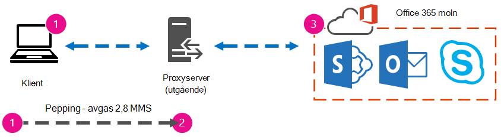

# Prestandajustering för Office 365 med baslinjer och prestandahistorikOffice 365 performance tuning using baselines and performance history

Det finns några enkla sätt att kontrollera anslutningsprestandan mellan Office 365 och ditt företag som gör att du kan upprätta en ungefärlig baslinje för anslutningen.There are some simple ways to check the connection performance between Office 365 and your business that will let you establish a rough baseline of your connectivity. Det kan vara bra att känna till prestandahistoriken för klientdatoranslutningar för att kunna upptäcka och identifiera problem tidigt och förutse eventuella problem.Knowing the performance history of your client computer connections can help you detect emerging issues early, identify, and predict problems.
  
Den här artikeln är avsedd för den som inte är van att arbeta med prestandaproblem, och hjälper till med vanliga frågor som: Hur vet jag att det jag ser är ett prestandaproblem och inte ett problem med Office 365-tjänsten?If you're not used to working on performance issues, this article is designed to help you consider some common questions, like How do you know the problem you're seeing is a performance issue and not an Office 365 service incident? Hur planerar du bra prestanda på lång sikt?How can you plan for good performance, long term? Hur kan jag hålla ett öga på prestandan?How can you keep an eye on performance? Om din grupp eller dina klienter har låg prestanda när Office 365 och du undrar över några av de här frågorna, så kan du läsa vidare.If your team or clients are seeing slow performance while using Office 365, and you wonder about any of these questions, read on.
  
> [!IMPORTANT]
> **Är det prestandaproblem mellan din klient och Office 365 just nu?****Have a performance issue between your client and Office 365 right now?** Följ stegen som beskrivs i planen [för prestandafelsökning för Office 365](performance-troubleshooting-plan.md).Follow the steps outlined in the [Performance troubleshooting plan for Office 365](performance-troubleshooting-plan.md). 
    
## Något du bör veta om Office 365 prestandaSomething you should know about Office 365 performance

Office 365 finns i ett dedikerat Microsoft-nätverk med hög kapacitet, som inte bara övervakas automatiserat utan även av verkliga personer.Office 365 lives inside a high-capacity, dedicated Microsoft network that is steadily monitored not just by automation, but by real people. En del av underhållet av Office 365 är att skapa prestandajustering och effektivisering där det är möjligt.Part of the role of maintaining the Office 365 cloud is building-in performance tuning and streamlining where it's possible. Eftersom klienterna i Office 365 måste ansluta via Internet är det kontinuerligt viktigt att finjustera prestandan mellan Office 365 tjänster.Since clients of the Office 365 cloud have to connect across the Internet, there is a continuous effort to fine-tune the performance across Office 365 services too. Prestandaförbättringarna i molnet är ständig, och vi har samlat in mycket erfarenhet för att hålla molnet snabbt och felfritt.Performance improvements never really stop in the cloud, and there is a lot of accumulated experience with keeping the cloud healthy and quick. Om du upplever prestandaproblem när du ansluter från din plats till Office 365 är det bäst att inte börja med och vänta på ett supportfall.Should you experience a performance issue connecting from your location to Office 365, it's best not to start with, and wait on, a Support case. I stället bör du börja undersöka problemet "inifrån och ut".Instead, you should begin investigating the problem from 'the inside out'. Det innebär att du börjar i ditt nätverk och jobbar dig ut för att Office 365.That is, start inside of your network, and work your way out to Office 365. Innan du inöppnar ett ärende Office 365 supporten kan du samla in data och vidta åtgärder som utforskar problemet och som kan lösa det.Before you open a case with Office 365 Support, you can gather data and take actions that will explore, and may resolve, your problem.
  
> [!IMPORTANT]
> Var uppmärksam på kapacitetsplanering och begränsningar i Office 365.Be aware of capacity planning and limits in Office 365. Den informationen gör att du kommer kurvan när du försöker lösa ett prestandaproblem.That information will put you ahead of the curve when trying to resolve a performance issue. Här är en länk till beskrivningarna [Microsoft 365 och Office 365 tjänstbeskrivningar](/office365/servicedescriptions/office-365-service-descriptions-technet-library).Here's a link to the [Microsoft 365 and Office 365 service descriptions](/office365/servicedescriptions/office-365-service-descriptions-technet-library). Det här är ett centralt nav, och alla tjänster som erbjuds Office 365 en länk som går till deras egna tjänstbeskrivningar härifrån.This is a central hub, and all the services offered by Office 365 have a link that goes to their own Service Descriptions from here. Det innebär att om du till exempel behöver se standardbegränsningarna för SharePoint Online klickar du på [SharePoint Onlinetjänstbeskrivning](/office365/servicedescriptions/sharepoint-online-service-description/sharepoint-online-service-description) och letar reda på SharePoint [onlinebegränsningar.](/office365/servicedescriptions/sharepoint-online-service-description/sharepoint-online-limits)That means, should you need to see the standard limits for SharePoint Online, for example, you would click [SharePoint Online Service Description](/office365/servicedescriptions/sharepoint-online-service-description/sharepoint-online-service-description) and locate its [SharePoint Online Limits section](/office365/servicedescriptions/sharepoint-online-service-description/sharepoint-online-limits). 
  
Se till att du går in i felsökningen och förstår att prestandan är en skjutskala, det handlar inte om att uppnå ett idealiserat värde och att underhålla det permanent (om du tror att det är så är det, så kommer tillfälliga uppgifter med hög bandbredd, som att göra ett stort antal användare, eller att göra stora datamigreringar vara mycket stressigt , så planera för prestandaeffekter då).Make sure you go into your troubleshooting with the understanding that performance is a sliding scale, it's not about achieving an idealized value and maintaining it permanently (if you believe this is so, then occasional high-bandwidth tasks like on-boarding a large number of users, or doing large data migrations will be very stressful -- so do plan for performance impacts then). Du kan och bör ha en grov uppfattning om dina prestandamål, men många variabler spelar in prestanda och därför varierar prestandan.You can, and should, have a rough idea of your performance targets, but a lot of variables play into performance, therefore, performance varies. Det är prestandan.That's the nature of performance. 
  
Felsökning av prestandan handlar inte om att nå specifika mål och ha ett obestämt antal, utan om att förbättra befintliga aktiviteter med alla variabler.Performance troubleshooting isn't about meeting specific goals and maintaining those numbers indefinitely, it's about improving existing activities, given all the variables. 
  
## Hur ser då ett prestandaproblem ut?Okay, what does a performance problem look like?

Först måste du se till att det verkligen handlar om ett prestandaproblem och inte ett problem med själva tjänsten.First, you need to make sure that what you are experiencing is indeed a performance issue and not a service incident. Prestandaproblem skiljer sig från tjänstproblem i Office 365.A performance problem is different from a service incident in Office 365. Så här skiljer du dem åt.Here's how to tell them apart.
  
Om Office 365 tjänst har problem är det ett tjänstproblem.If the Office 365 service is having issues, that's a service incident. Röda eller gula ikoner visas under Aktuell **status** i Administrationscenter för Microsoft 365, men prestandan kan också gå långsammare på klientdatorer som ansluter till Office 365.You will see red or yellow icons under **Current health** in the Microsoft 365 admin center, you may also notice slow performance on client computers connecting to Office 365. Om till exempel en röd ikon visas  under Aktuell status och Undersöker visas bredvid Exchange, kan du också få samtal från personer i organisationen som klagar på att klientpostlådor som använder Exchange Online fungerar dåligt.For example, if Current health reports a red icon and you see **Investigating** beside Exchange, you might then also receive a bunch of calls from people in your organization who complain that client mailboxes that use Exchange Online are performing badly. I så fall är det lämpligt att anta att prestandan Exchange Online hög nivå på tjänsten.In that case, it's reasonable to assume that your Exchange Online performance just became a victim of issues within the Service. 
  

  
I det här läget bör Office 365-administratören  kontrollera Aktuell status och sedan Visa information och historik ofta, för att hålla dig uppdaterad om det underhåll vi utför i systemet.At this point, you, the Office 365 admin, should check **Current health** and then **View details and history**, frequently, to keep up to date on maintenance we perform on the system. Instrumentpanelen **Aktuell** status har gjorts för att uppdatera dig om ändringar och problem i tjänsten.The **Current health** dashboard was made to update you about changes to, and problems in, the service. De anteckningar och förklaringar som finns i hälsohistoriken admin till admin är till för att hjälpa dig avgöra hur du påverkas och hålla dig publicerad om det pågående arbetet.The notes and explanations written to health history, admin to admin, are there to help you gauge your impact, and to keep you posted about ongoing work. 
  

  
Ett prestandaproblem är inte ett tjänstproblem även om låg prestanda också kan orsaka tjänstproblem.A performance issue isn't a service incident, even though incidents can cause slow performance. Ett prestandaproblem ser ut så här:A performance issue looks like this:
  
- Ett prestandaproblem uppstår oavsett vad som rapporterar aktuell **status** för tjänsten i administrationscentret.A performance issue occurs no matter what the admin center **Current health** is reporting for the service. 
    
-  Ett beteende som tidigare var relativt sömlöst tar lång tid att slutföra eller slutförs aldrig.A behavior that used to be relatively seamless takes a long time to complete or never completes. 
    
- Du kan replikera problemet eller vet att det kan replikeras om du gör rätt serie med steg.You can replicate the problem too, or, at least, you know it will happen if you do the right series of steps.
    
-  Om problemet uppstår oregelbundet finns det fortfarande ett mönster. Du vet till exempel att du klockan 10:00 brukar få samtal från användare som inte har tillförlitlig åtkomst till Office 365, och att samtalen kommer att gå ut ungefär klockan 12:00.If the problem is intermittent, there is still a pattern, for example, you know that by 10:00 AM you will have calls from users who can't reliably access Office 365, and that the calls will die down around noon. 
    
Det låter förmodligen bekant. kanske alltför bekant.This probably sounds familiar; maybe too familiar. När du vet att det är ett prestandaproblem uppstår frågan: "Vad gör du nu?"Once you know it's a performance problem, the question becomes, "What do you do next?" I resten av den här artikeln får du hjälp med att avgöra exakt det.The rest of this article helps you determine exactly that.
  
## Definiera och testa prestandaproblemHow to define and test the performance problem

Prestandaproblem uppstår ofta med tiden, så det kan vara svårt att definiera exakt vad problemet är.Performance issues often emerge over time, so it can be challenging to define the actual problem. Du måste skapa en bra problemräkning och en god uppfattning om problemkontexten, och sedan måste du upprepa upprepade teststeg för att vinna dagen.You need to create a good problem statement and a good idea of issue context, and then you need to repeatable testing steps to win the day. Annars kan felet bli så att du förlorar det.Otherwise, through no fault of your own, you may be lost. Varför?Why? Här är några exempel på problemrapporter som inte tillhandahåller tillräcklig information:Well, here are some examples of problems statements that don't provide enough information:
  
- Det brukade vara så enkelt att växla från Inkorgen till kalendern att jag inte märkte det, men nu tar det hela kaffepausen.Switching from my Inbox to my Calendar used to be something I didn't notice, and now it's a coffee-break. Kan du få det att fungera som det brukade?Can you make it act like it used to?
    
- Det tar evigheter att ladda upp SharePoint mina filer till SharePoint Online.Uploading my files to SharePoint Online is taking forever. Varför går det långsamt på eftermiddagen men snabbt vid andra tidpunkter?Why is it slow in the afternoon, but any other time, it's fast? Kan det inte vara snabbt hela nu?Can't it just be fast?
    
Problemrapporterna ovan medför flera stora utmaningar.There are several large challenges posed by the problem statements above. Det finns många tvetydigheter.Specifically, there are a lot of ambiguities to deal with. till exempel:for example:
  
- Det är oklart hur växlingen mellan Inkorgen och Kalendern brukade fungera på den bärbara datorn.It's unclear how switching between Inbox and Calendar used to act on the laptop.
    
- Vad är "snabbt" när användaren säger "Kan det inte bara vara snabbt"?When the user says, "Can't it just be fast", what's "fast"?
    
- Hur länge är "evigheter"?How long is "forever"? Är det flera sekunder eller flera minuter, eller kan användaren gå på lunch och avslutas upp tio minuter efter att användaren kommit tillbaka?Is that several seconds, or minutes, or could the user go to lunch and it would finish up ten minutes after the user got back?
    
Allt detta utan tanke på att administratören och felsökaren inte kan vara medvetna om så många detaljer från problemrapporter som dessa.All of this is without considering that the admin and troubleshooter can't be aware of many details from problem statements like these. Till exempel när problemet uppstod: Att användaren arbetar hemifrån och bara ser långsam växling när användaren är på ett hemnätverk. Att användaren måste köra flera andra RAM-resurskrävande program på den lokala klienten, eller så kör användaren ett äldre operativsystem eller inte har kört de senaste uppdateringarna.For example, when the problem started happening; That the user works from home and only ever sees slow switching while on a home network; That the user must run several other RAM intensive applications on the local client, or the user is running an older operating system or hasn't run recent updates.
  
När användare rapporterar ett prestandaproblem finns det en mängd information att samla in.When users report a performance problem, there's a lot of information to collect. Att samla in den här informationen är en del av att undersöka problemet och undersöka problemet.Collecting this information is part of a process called scoping the issue, or investigating it. Följande är en grundläggande lista som du kan använda för att samla in information om prestandaproblem.The following is a basic scoping list you can use to collect information about your performance issue. Listan är inte uttömmande men den ger dig något att utgå från när du startar en egen lista:This list is not exhaustive, but it's a place to start one of your own: 
  
- Vilket datum hände problemet, och ungefär vilken tid på dagen eller natten?On what date did the issue happen, and around what time of day or night?
    
- Vilken typ av klientdator använde du och hur ansluter den till företagsnätverket (VPN, kabel, trådlöst)?What kind of client computer were you using, and how does it connect to the business network (VPN, Wired, Wireless)?
    
- Arbetade du på distans eller på kontoret?Were you working remotely or were you in the office?
    
- Provade du att utföra samma åtgärder på en annan dator och se samma beteende?Did you try the same actions on another computer and see the same behavior?
    
- Gå igenom de steg som ger dig problem, så att du kan skriva ned vad du gör.Walk through the steps that are giving you the trouble so that you can write the actions you take down.
    
- Hur långsam i sekunder eller minuter är prestandan?How slow in seconds or minutes is the performance?
    
- Var i världen befinner du dig?Where in the world are you located?
    
Vissa av dessa frågor är mer uppenbara än andra.Some of these questions are more obvious than others. De flesta förstår att en felsökare behöver de exakta stegen för att återskapa problemet.Most everyone will understand a troubleshooter needs the exact steps to reproduce the issue. Hur kan du annars registrera vad som är fel och testa om problemet är åtgärdat?After all, how else can you record what's wrong, and how else can you test if the issue is fixed? Mindre uppenbart är sådant som "Vilket datum och vilken tid såg du problemet?" och "Var i världen befinner du dig?", information som kan användas tillsammans.Less obvious are things like "What date and time did you see the issue?", and "Where in the world are you located?", information that can be used in tandem. Beroende på när användaren arbetade kan några timmars tidsskillnad innebära att underhåll redan pågår i delar av företagets nätverk.Depending on when the user was working, a few hours of time difference may mean maintenance is already underway on parts of your company's network. Om ditt företag till exempel har en hybridimplementering, till exempel en hybrid-SharePoint-sökning som kan köra frågor i sökindex i både SharePoint Online och en lokal SharePoint Server 2013-instans, kan uppdateringar redan vara på gång i den lokala servergruppen.If, for example, your company has a hybrid implementation, like a hybrid SharePoint Search, which can query search indexes in both SharePoint Online and an On-premises SharePoint Server 2013 instance, updates may be underway in the on-premises farm. Om hela företaget finns i molnet kan systemunderhåll innebära att nätverksmaskinvara läggs till eller tas bort, att uppdateringar distribueras till hela företaget eller att ändringar av DNS eller annan kärninfrastruktur ändras.If your company is all in the cloud, system maintenance may include adding or removing network hardware, rolling out updates that are company-wide, or making changes to DNS, or other core infrastructure.
  
När du felsöker ett prestandaproblem är det lite som en brottsplats – du måste vara exakt och observant för att kunna dra slutsatser utifrån bevisen.When you're troubleshooting a performance problem, it's a bit like a crime scene, you need to be precise and observant to draw any conclusions from the evidence. För att kunna göra det måste du skapa en bra problemräkning genom att samla in bevis.In order to do this, you must get a good problem statement by gathering evidence. Problemet bör innefatta dator, användarens kontext, när problemet uppstod och de exakta steg som exponerade prestandaproblemet.It should include the computer's context, the user's context, when the problem began, and the exact steps that exposed the performance issue. Den här problemsatsen ska vara och förbli den översta sidan i dina anteckningar.This problem statement should be, and stay, the topmost page in your notes. När du går igenom problemutdraget igen efter att du har arbetat med lösningen gör du ett test och bevisar om de åtgärder du vidtar har löst problemet.By walking through the problem statement again after you work on the resolution, you are taking the steps to test and prove whether the actions you take have resolved the issue. Det är viktigt att veta när ditt arbete är klart.This is critical to knowing when your work, there, is done.
  
## Vet du hur prestandan såg ut när den var bra?Do you know how performance used to look when it was good?

Om du har tur finns det ingen som vet det.If you're unlucky, nobody knows. Ingen har några siffror.Nobody had numbers. Det innebär att ingen kan besvara den enkla frågan "Hur många sekunder tog det att öppna Inkorgen i Office 365?" eller "Hur lång tid tog det när ledningen hade ett Lync Online-möte?", vilket är ett vanligt scenario på många företag.That means nobody can answer the simple question "About how many seconds did it used to take to bring up an Inbox in Office 365?", or "How long did it used to take when the Executives had a Lync Online meeting?", which is a common scenario for many companies.
  
Det som saknas här är en baslinje för prestanda.What's missing here is a performance baseline.
  
Baslinjer ger dig ett sammanhang för prestandan.Baselines give you a context for your performance. Du bör då och då göra en baslinje ofta, beroende på företagets behov.You should take a baseline occasionally to frequently, depending on the needs of your company. Om ni är ett större företag kanske operationsteamet redan har gjort baslinjer för den lokala miljön.If you are a larger company, your Operations team may take baselines for your on-premises environment already. Om du till exempel korrigerar alla Exchange-servrar den första måndagen i månaden och alla SharePoint-servrar på den tredje måndagen, har operationsteamet förmodligen en lista med aktiviteter och scenarier som körs efter korrigering för att bevisa att kritiska funktioner fungerar.For example, if you patch all the Exchange servers on the first Monday of the month, and all your SharePoint servers on the third Monday, your Operations team probably has a list of tasks and scenarios it runs post-patching, to prove that critical functions are operational. Du kan till exempel öppna Inkorgen, klicka på Skicka/ta emot och kontrollera att mapparna uppdateras eller, i SharePoint, bläddra på webbplatsens huvudsida, gå till sidan Sök i företaget och göra en sökning som returnerar resultaten.For example, opening the Inbox, clicking Send/Receive, and making sure the folders update, or, in SharePoint, browsing the main page of the site, going into the enterprise Search page, and doing a search that returns results.
  
Om dina program finns i Office 365 kan du göra några grundläggande baslinjer för den tid (i millisekunder) som det tar från en klientdator i nätverket till en utgående punkt eller till den punkt där du lämnar nätverket och går ut till Office 365.If your applications are in Office 365, some of the most fundamental baselines you can take measure the time (in milliseconds) from a client computer inside your network, to an egress point, or the point where you leave your network and go out to Office 365. Här är några användbara baslinjer som du kan undersöka och registrera:Here are some helpful baselines that you can investigate and record:
  
- Identifiera enheterna mellan klientdatorn och din utgående punkt, till exempel din proxyserver.Identify the devices between your client computer and your egress point, for example, your proxy server.
    
  - Du måste känna till enheterna så att du har kontexten (IP-adresser, enhetstyper osv.) för eventuella prestandaproblem som kan uppstå.You need to know your devices so that you have context (IP addresses, type of device, et cetera) for performance problems that arise.
    
  - Proxyservrar är vanliga utgående punkter, så att du kan titta i webbläsaren och se vilken proxyserver den är inställd att använda, om det finns några.Proxy servers are common egress points, so you can check your web browser to see what proxy server it is set to use, if any.
    
  - Det finns verktyg från tredje part som kan identifiera och mappa nätverket, men det säkraste sättet att känna till dina enheter är att fråga en medlem i nätverksgruppen.There are third party tools that can discover and map your network, but the safest way to know your devices is to ask a member of your network team.
    
- Identifiera din Internetleverantör (ISP), skriv ned deras kontaktinformation och fråga hur många kretsar det finns för bandbredd.Identify your Internet service provider (ISP), write down their contact information, and ask how many circuits how much bandwidth you have.
    
- Inom företaget identifierar du resurser för enheterna mellan klienten och den utgående punkten eller identifierar en nödkontakt att prata med om nätverksproblem.Inside your company, identify resources for the devices between your client and the egress point, or identify an emergency contact to talk to about networking issues.
    
Här är några baslinjer som kan beräknas med enkla tester med verktyg:Here are some baselines that simple testing with tools can calculate for you:
  
- Tid från klientdatorn till den utgående punkten i millisekunderTime from your client computer to your egress point in milliseconds
    
- Tid från den utgående punkten till Office 365 i millisekunderTime from your egress point to Office 365 in milliseconds
    
- Plats i världen för den server som löser URL:erna för Office 365 när du bläddrarLocation in the world of the server that resolves the URLS for Office 365 when you browse
    
- Hastigheten på Internetleverantörens DNS-upplösning i millisekunder, inkonsekvenser i paket ankomst (nätverksjitter), tider för uppladdning och nedladdning i millisekunderThe speed of your ISP's DNS resolution in milliseconds, inconsistencies in packet arrival (network jitter), upload and download times in milliseconds
    
Om du inte vet hur du utför de här stegen hittar du mer information i den här artikeln.If you're unfamiliar with how to carry out these steps, we'll go into more detail in this article. 
  
## Vad är en baslinje?What is a baseline?

Du kommer att se effekterna när det går dåligt, men om du inte känner till dina historiska prestandadata går det inte att ha ett sammanhang för hur dåligt det kan ha blivit och när.You'll know the impact when it goes bad, but if you don't know your historical performance data, it's not possible to have a context for how bad it may have become, and when. Utan en baslinje går du alltså miste om den viktigaste ledtråden till problemet: bilden på kartongen.So without a baseline, you're missing the key clue to solve the puzzle: the picture on the puzzle box. När du felsöker prestandan behöver du en *jämförelsepunkt.*In performance troubleshooting, you need a point of  *comparison*  . Enkla prestandabaslinjer är inte svåra att göra.Simple performance baselines aren't difficult to take. Ditt team kan få i uppdrag att genomföra dem enligt ett schema.Your Operations team can be tasked with carrying these out on a schedule. Anta till exempel att din anslutning ser ut så här:For example, let's say your connection looks like this: 
  

  
Det innebär att du har kollat med nätverksgruppen och fått reda på att du lämnar företaget för Internet via en proxyserver som hanterar alla förfrågningar som klientdatorn skickar till molnet.That means you've checked with your network team and found out that you leave your company for the Internet through a proxy server, and that proxy handles all the requests your client computer sends to the cloud. I det här fallet bör du rita en förenklad version av anslutningen som innehåller alla mellanliggande enheter.In this case, you should draw a simplified version of your connection that lists all the intervening devices. Nu kan du infoga verktyg som du kan använda för att testa prestanda mellan klienten, den utgående punkten (där du lämnar ditt nätverk på Internet) och Office 365 molnet.Now, insert tools that you can use to test the performance between the client, the egress point (where you leave your network for the Internet), and the Office 365 cloud.
  

  
Alternativen är Enkla och **Avancerade eftersom** **det** finns så mycket expertkunskaper du behöver för att hitta prestandadata.The options are listed as **Simple** and **Advanced** because of the amount of expertise you need in order to find the performance data. Nätverksspårning tar lång tid jämfört med att köra kommandoradsverktyg som PsPing och TraceTCP.A network trace will take a lot of time, compared to running command-line tools like PsPing and TraceTCP. Dessa två kommandoradsverktyg väljs eftersom de inte använder ICMP-paket som kommer att blockeras av Office 365, och eftersom de visar den tid i millisekunder som det tar att lämna klientdatorn eller proxyservern (om du har åtkomst) och kommer till Office 365.These two command-line tools were chosen because they don't use ICMP packets, which will be blocked by Office 365, and because they give the time in milliseconds that it takes to leave the client computer, or proxy server (if you have access) and arrive at Office 365. Varje enskilt hopp från en dator till en annan har ett tidsvärde, vilket är perfekt för baslinjer!Each individual hop from one computer to another will end up with a time value, and that's great for baselines! Dessa kommandoradsverktyg låter dig även lägga till ett portnummer i kommandot, vilket är användbart eftersom Office 365 kommunicerar via port 443, d.v.s. porten som används av SSL (Secure Sockets Layer) och TLS (Transport Layer Security).Just as importantly, these command-line tools allow you to add a port number onto the command, this is useful because Office 365 communicates over port 443, which is the port used by Secure Sockets Layer and Transport Layer Security (SSL and TLS). Men andra verktyg från tredje part kan vara bättre lösningar för din situation.However, other third-party tools may be better solutions for your situation. Microsoft stöder inte alla dessa verktyg, så om du av någon anledning inte kan få PsPing och TraceTCP att fungera kan du gå vidare till en nätverksspårning med ett verktyg som Netmon.Microsoft doesn't support all of these tools, so if, for some reason, you can't get PsPing and TraceTCP working, move on to a network trace with a tool like Netmon. 
  
Du kan göra en baslinje före arbetstid, en gång till under kraftig användning och sedan igen efter arbetstid.You can take a baseline before business hours, again during heavy use, and then again after hours. Det innebär att du kan ha en mappstruktur som till slut ser ut lite så här:This means you may have a folder structure that looks a bit like this in the end:
  

  
Du bör också ha ett sätt att benämna dina filer.You should also pick a naming convention your files. Här är några exempel:Here are some examples:
  
- Feb_09_2015_9amPST_PerfBaseline_Netmon_ClientToEgress_NormalFeb_09_2015_9amPST_PerfBaseline_Netmon_ClientToEgress_Normal
    
- Jan_10_2015_3pmCST_PerfBaseline_PsPing_ClientToO365_bypassProxy_SLOWJan_10_2015_3pmCST_PerfBaseline_PsPing_ClientToO365_bypassProxy_SLOW
    
- Feb_08_2015_2pmEST_PerfBaseline_BADPerfFeb_08_2015_2pmEST_PerfBaseline_BADPerf
    
- Feb_08_2015_8-30amEST_PerfBaseline_GoodPerfFeb_08_2015_8-30amEST_PerfBaseline_GoodPerf
    
Det finns många olika sätt att göra detta, men formatet är **\<dateTime\>\<what's happening in the test\>** en bra början.There are lots of different ways to do this, but using the format **\<dateTime\>\<what's happening in the test\>** is a good place to start. Om du använder det här noga kommer det att underlätta mycket när du ska felsöka problem senare.Being diligent about this will help a lot when you are trying to troubleshoot issues later. Du kommer senare att kunna säga "Jag gjorde två spårningar den 8 februari, en visade bra prestanda och en visade dålig, så vi kan jämföra dem".Later, you'll be able to say "I took two traces on February 8th, one showed good performance and one showed bad, so we can compare them". Det här är mycket användbart för felsökning.This is extremely helpful for troubleshooting. 
  
Det är viktigt att ordna alla baslinjer på ett organiserat sätt.You need to have an organized way to keep your historical baselines. I det här exemplet tog den enkla metoden fram tre utdata från kommandoraden och resultatet samlades in som skärmbilder, men om du vill kan du välja att spara filer i nätverket i stället.In this example, the simple methods produced three command line outputs and the results were collected as screen shots, but you may have network capture files instead. Använd den metod som passar dig bäst.Use the method that works best for you. Lagra dina historiska baslinjer och ha dem som referens när du märker ändringar i online-tjänstens beteende.Store your historical baselines and refer to them at points where you notice changes in the behavior of online services. 
  
## Varför samla in prestandadata under ett pilottest?Why collect performance data during a pilot?

Det är bäst att börja skapa baslinjer redan i pilotfasen av Office 365 tjänsten.There is no better time to start making baselines than during a pilot of the Office 365 service. Office kan ha tusentals användare, hundratusentals, eller bara fem, men även med ett litet antal användare kan du utföra tester för att mäta svängningar i prestanda.Your office may have thousands of users, hundreds of thousands, or it may have five, but even with a small number of users, you can perform tests to measure fluctuations in performance. För stora företag kan ett representativt urval av flera hundra användare av pilottestning av Office 365 projiceras utåt på flera tusentals så att du vet var problem kan uppstå innan de uppstår.In the case of a large company, a representative sample of several hundred users piloting Office 365 can be projected outward to several thousands so you know where issues might arise before they happen.
  
För små företag där alla användare går till tjänsten samtidigt och det inte finns någon pilottestning kan du behålla prestandaåtgärder så att du har data att visa för de som ska felsöka problem.In the case of a small company, where on-boarding means that all users go to the service at the same time and there is no pilot, keep performance measures so that you have data to show to anyone who may have to troubleshoot a badly performing operation. Om du till exempel helt plötsligt märker att du kan gå en sväng runt byggnaden under den tid det tar att ladda upp en medelstor bild där det brukade ske mycket snabbt.For example, if you notice that all of a sudden you can walk around your building in the time it takes to upload a medium-sized graphic where it used to happen very quickly.
  
## Hur du samlar in baslinjerHow to collect baselines

För alla felsökningsplaner behöver du som minst identifiera följande saker:For all troubleshooting plans you need to identify these things at a minimum:
  
- Klientdatorn du använder (typ av dator eller enhet, IP-adress och de åtgärder som orsakade problemet)The client computer you're using (the type of computer or device, an IP address, and the actions that caused the issue)
    
- Klientdatorns plats i världen (till exempel om den här användaren har en VPN-anslutning till nätverket, arbetar på distans eller i företagets intranät)Where the client computer is located in the world (for example, whether this user on a VPN to the network, working remotely, or on the company intranet)
    
- Den utgående punkt som klientdatorn använder från nätverket (den punkt där trafiken lämnar företaget och går till en Internetleverantör eller Internet)The egress point the client computer uses from your network (the point at which traffic leaves your business for an ISP or the Internet)
    
 Du kan få nätverkslayouten från nätverksadministratören.You can find out the layout of your network from the network administrator. Om du har ett litet nätverk kan du titta på enheterna som ansluter dig till Internet och ringa Internet-leverantören om du har frågor om layouten.If you're on a small network, take a look at the devices connecting you to the Internet, and call your ISP if you have questions about the layout. Skapa en bild av den färdiga layouten som referens.Create a graphic of the final layout for your reference. 
  
Det här avsnittet är uppdelat i enkla kommandoradsbaserade verktyg och metoder, och mer avancerade verktyg.This section is broken into simple command-line tools and methods, and more advanced tools options. Först går vi in på enkla metoder.We'll cover simple methods first. Men om du har prestandaproblem just nu bör du gå till avancerade metoder och prova åtgärdsplanen för prestandafelsökning.But if you've got a performance problem right now, you should jump to advanced methods and try out the sample performance-troubleshooting action plan.
  
### Enkla metoderSimple methods

Syftet med de enkla metoderna är att lära dig att göra, förstå och korrekt lagra enkla prestandabaslinjer så att du får information om hur Office 365 prestanda.The objective of these simple methods is to learn to take, understand, and properly store simple performance baselines over time so that you are informed about Office 365 performance. Här är ett mycket enkelt diagram som du har sett förut:Here's the very simple diagram for simple, as you've seen before:
  

  
> [!NOTE]
> I den här skärmbilden syns TraceTCP, som är ett användbart verktyg för att visa (i millisekunder) hur lång tid en begäran tar att behandla, och hur många nätverkshopp eller anslutningar från en dator till nästa som det tar för en begäran att nå ett mål.TraceTCP is included in this screen shot because it's a useful tool for showing, in milliseconds, how long a request takes to process, and how many network hops, or connections from one computer to the next, that the request takes to reach a destination. TraceTCP kan också ge namnen på servrar som används under hopp, vilket kan vara användbart för en Microsoft Office 365-felsökare i supporten.TraceTCP can also give the names of servers used during hops, which can be useful to a Microsoft Office 365 troubleshooter in Support. > TraceTCP-kommandon kan vara mycket enkla, till exempel: >> Kom ihåg att inkludera  `tracetcp.exe outlook.office365.com:443` portnumret i kommandot!> TraceTCP commands can be very simple, such as: >  `tracetcp.exe outlook.office365.com:443`> Remember to include the port number in the command! > [TraceTCP](https://simulatedsimian.github.io/tracetcp_download.html) är en kostnadsfri nedladdning, men använder Wincap. > [TraceTCP](https://simulatedsimian.github.io/tracetcp_download.html) is a free download, but relies on Wincap. Wincap är ett verktyg som även används och installeras av Netmon.Wincap is a tool that is also used and installed by Netmon. Vi använder även Netmon i avsnittet om avancerade metoder.We also use Netmon in the advanced methods section. 
  
 Om du har flera kontor måste du även ha en uppsättning data från en klient på var och en av de platserna.If you have multiple offices, you'll need to keep a set of data from a client in each of those locations as well. Det här testet mäter svarstiden, vilket i det här fallet är ett talvärde som beskriver tiden det tar mellan det att en klient skickar en begäran till Office 365 och Office 365 på begäran.This test measures latency, which, in this case, is a number value that describes the amount of time between a client sending a request to Office 365, and Office 365 responding to the request. Testet börjar på en klientdator i din domän och mäter en resa från ditt nätverk, ut genom en utgående punkt, över Internet till Office 365 och tillbaka.The testing originates inside your domain on a client computer, and looks to measure a round trip from inside your network, out through an egress point, across the Internet to Office 365, and back. 
  
Det finns några olika sätt att hantera den utgående punkten, i det här fallet proxyservern.There are a few ways to deal with the egress point, in this case, the proxy server. Du kan spåra från 1 till 2 och sedan 2 till 3 och sedan addera talen i millisekunder för att få en totalsumma vid kanten av nätverket.You can either trace from 1 to 2 and then 2 to 3, and then add the numbers in milliseconds to get a final total to the edge of your network. Du kan också konfigurera anslutningen så att den kringgår proxyn för Office 365 adresser.Or, you can configure the connection to bypass the proxy for Office 365 addresses. I ett större nätverk med en brandvägg, omvänd proxyserver eller en kombination av dessa kan du behöva göra undantag för proxyservern som gör att trafik kan passera för många URL:er.In a larger network with a firewall, reverse proxy, or some combination of the two, you may need to make exceptions on the proxy server that will allow traffic to pass for a lot of URLs. Listan över slutpunkter som används av Office 365 finns i Office 365 [URL:er och IP-adressintervall.](https://support.office.com/article/8548a211-3fe7-47cb-abb1-355ea5aa88a2)For the list of endpoints used by Office 365, see [Office 365 URLs and IP address ranges](https://support.office.com/article/8548a211-3fe7-47cb-abb1-355ea5aa88a2). Om du har en autentiserande proxy kan du börja med att testa undantag för följande:If you have an authenticating proxy, begin by testing exceptions for the following:
  
- Portarna 80 och 443Ports 80 and 443
    
- TCP och IP:erTCP and HTTPs
    
- Anslutningar som är utgående till någon av dessa URL:er:Connections that are outbound to any of these URLs:
    
- \*.microsoftonline.com\*.microsoftonline.com
    
- \*.microsoftonline-p.com\*.microsoftonline-p.com
    
- \*.sharepoint.com\*.sharepoint.com
    
- \*.outlook.com\*.outlook.com
    
- \*.lync.com\*.lync.com
    
- osub.microsoft.comosub.microsoft.com
    
Alla användare måste kunna komma åt de här adresserna utan någon inblandning från proxy eller autentisering.All users need to be allowed to get to these addresses without any proxy interference or authentication. I ett mindre nätverk bör du lägga till dessa i förbikopplingslistan för proxyadresser i webbläsaren.On a smaller network, you should add these to your proxy bypass list in your web browser. 
  
Om du vill lägga till dessa i förbikopplingslistan för proxyadresser i Internet Explorer går du till **Verktyg** \> **LAN-inställningar** \>  \> **för Internetalternativanslutningar** \> **Avancerat.**To add these to your proxy bypass list in Internet Explorer, go to **Tools** \> **Internet Options** \> **Connections** \> **LAN settings** \> **Advanced**. På fliken Avancerat hittar du även din proxyserver och proxyserverport.The advanced tab is also where you will find your proxy server and proxy server port. Du kan behöva klicka i kryssrutan Använd en **proxyserver** för nätverket för att komma åt **knappen** Avancerat.You may need to click the checkbox **Use a proxy server for your LAN**, to access the **Advanced** button. Se till att Förbikoppla **proxyserver för lokala adresser** är markerat.You'll want to make sure that **Bypass proxy server for local addresses** is checked. När du klickar **på** Avancerat visas en textruta där du kan ange undantag.Once you click **Advanced**, you'll see a text box where you can enter exceptions. Avgränsa URL:erna med jokertecken ovan med semikolon, till exempel:Separate the wildcard URLs listed above with semi-colons, for example:
  
\*.microsoftonline.com; \*.sharepoint.com\*.microsoftonline.com; \*.sharepoint.com
  
När du kringgår din proxy bör du kunna använda ping eller PsPing direkt på en Office 365 URL.Once you bypass your proxy, you should be able to use ping or PsPing directly on an Office 365 URL. Nästa steg är att testa **ping** outlook.office365.com .The next step will be to test ping **outlook.office365.com**. Om du använder PsPing eller ett annat verktyg där du kan ange ett portnummer i kommandot kan du göra en PsPing på **portal.microsoftonline.com:443** för att se den genomsnittliga tiden dit och tillbaka i millisekunder.Or, if you're using PsPing or another tool that will let you supply a port number to the command, PsPing against **portal.microsoftonline.com:443** to see the average round trip time in milliseconds. 
  
Tids för svar, eller RTT (Round-trip time, eller RTT, är ett värde som innebär den tid det tar att skicka en HTTP-begäran till en server som outlook.office365.com och få ett svar som bekräftar att servern vet att du gjorde det.The round trip time, or RTT, is a number value that measures how long it takes to send a HTTP request to a server like outlook.office365.com and get a response back that acknowledges the server knows that you did it. Ibland används förkortningen RTT.You'll sometimes see this abbreviated as RTT. Det bör vara en relativt kort tid.This should be a relatively short amount of time.
  
Du måste använda [PSPing](/sysinternals/downloads/psping) eller ett annat verktyg som inte använder ICMP-paket som blockeras av Office 365 för att kunna göra det här testet.You have to use [PSPing](/sysinternals/downloads/psping) or another tool that does not use ICMP packets which are blocked by Office 365 in order to do this test. 
  
 **Så här använder du PsPing för att få en tidsresa totalt i millisekunder direkt från en Office 365 URL****How to use PsPing to get an overall round trip time in milliseconds directly from an Office 365 URL**
  
1. Kör en upphöjd kommandotolk genom att utföra följande steg:Run an elevated command prompt by completing these steps:
    
1. Klicka på **Start**.Click **Start**.
    
2. Skriv **cmd i** rutan Starta sökning och tryck sedan på CTRL+SKIFT+RETUR.In the **Start Search** box, type cmd, and then press CTRL+SHIFT+ENTER.
    
3. Om dialogrutan **User Account Control** visas bekräftar du att den visar det du vill och klickar sedan på **Fortsätt.**If the **User Account Control** dialog box appears, confirm that the action it displays is what you want, and then click **Continue**.
    
2. Gå till den mapp där verktyget (i det här fallet PsPing) är installerat och testa Office 365 URL:er:Navigate to the folder where the tool (in this case PsPing) is installed and test these Office 365 URLs:
    
  - psping admin.microsoft.com:443psping admin.microsoft.com:443
    
  - psping microsoft-my.sharepoint.com:443psping microsoft-my.sharepoint.com:443
    
  - psping outlook.office365.com:443psping outlook.office365.com:443
    
  - psping www.yammer.com:443psping www.yammer.com:443
    
    
  
Se till att inkludera portnumret 443.Be sure to include the port number of 443. Kom ihåg Office 365 fungerar på en krypterad kanal.Remember that Office 365 works on an encrypted channel. Om du gör en PsPing utan portnummer kommer din begäran att misslyckas.If you PsPing without the port number, your request will fail. När du har pingat den korta listan letar du efter den genomsnittliga tiden i millisekunder (ms).Once you've pinged your short list, look for the Average time in milliseconds (ms). Det är den du vill spela in!That is what you want to record!
  

  
Om du inte är bekant med att kringgå proxy och föredrar att ta ett steg i steget måste du först ta reda på namnet på din proxyserver.If you're not familiar with proxy bypass, and prefer to take things step-by-step, you need to first find out the name of your proxy server. I Internet Explorer går du till **Verktyg** \> **Internetalternativ** \> **Anslutningar** \> **LAN-inställningar** \> **Avancerat.**In Internet Explorer go to **Tools** \> **Internet Options** \> **Connections** \> **LAN settings** \> **Advanced**. På **fliken** Avancerat visas din proxyserver.The **Advanced** tab is where you will see your proxy server listed. Pinga proxyservern i en kommandotolk genom att utföra den här uppgiften:Ping that proxy server at a command prompt by completing this task: 
  
 **Pinga proxyservern och få tidsfördrundning i millisekunder för steg 1 till 2****To ping the proxy server and get a round trip value in milliseconds for stage 1 to 2**
  
1. Kör en upphöjd kommandotolk genom att utföra följande steg:Run an elevated command prompt by completing these steps:
    
1. Klicka på **Start**.Click **Start**.
    
2. Skriv **cmd i** rutan Starta sökning och tryck sedan på CTRL+SKIFT+RETUR.In the **Start Search** box, type cmd, and then press CTRL+SHIFT+ENTER.
    
3. Om dialogrutan **User Account Control** visas bekräftar du att den visar det du vill och klickar sedan på **Fortsätt.**If the **User Account Control** dialog box appears, confirm that the action it displays is what you want, and then click **Continue**.
    
2. Skriv ping \<the name of the proxy server your browser uses, or the IP address of the proxy server\> och tryck sedan på RETUR.Type ping \<the name of the proxy server your browser uses, or the IP address of the proxy server\> and then press ENTER. Om du har PsPing eller något annat verktyg installerat kan du välja att använda det verktyget i stället.If you have PsPing, or some other tool, installed, you can choose to use that tool instead. 
    
    Ditt kommando kan se ut som något av följande exempel:Your command may look like any of these examples: 
    
  - pinga ourproxy.ourdomain.industry.business.comping ourproxy.ourdomain.industry.business.com
    
  - ping 155.55.121.55ping 155.55.121.55
    
  - ping ourproxyping ourproxy
    
  - psping ourproxy.ourdomain.industry.business.com:80psping ourproxy.ourdomain.industry.business.com:80
    
  - psping 155.55.121.55:80psping 155.55.121.55:80
    
  - psping ourproxy:80psping ourproxy:80
    
3. När spårningen slutar att skicka testpaket kommer du att få en liten sammanfattning som visar ett medelvärde, i millisekunder, och det är värdet som du är ute efter.When the trace stops sending test packets, you'll get a small summary that lists an average, in milliseconds, and that's the value you're after. Ta en skärmbild av uppmaningen och spara den enligt dina namngivningskonventioner.Take a screen shot of the prompt and save it using your naming convention. Vid det här läget kan det även vara bra att fylla i värdet i diagrammet.At this point it may also help to fill in the diagram with the value.
    
Du kanske har gjort en spårning tidigt på morgonen och din klient kan komma till proxyn (eller den utgående servern till Internet) snabbt.Maybe you've taken a trace in the early morning, and your client can get to the proxy (or whatever egress server exits to the Internet) quickly. I det här fallet kan talen se ut så här:In this case, your numbers may look like this:
  

  
Om klientdatorn är en av få med åtkomst till proxyservern (eller den utgående servern) kan du köra nästa del av testet genom att fjärransluta till den datorn och köra kommandotolken för att göra en PsPing på en Office 365-URL därifrån.If your client computer is one of the select few with access to the proxy (or egress) server, you can run the next leg of the test by remotely connecting to that computer, running the command prompt to PsPing to an Office 365 URL from there. Om du inte har tillgång till den datorn kan du kontakta nätverksresurserna för att få hjälp med nästa del och få exakta siffror på så sätt.If you don't have access to that computer, you can contact your network resources for help with the next leg and get exact numbers that way. Om det inte är möjligt kan du göra en PsPing mot den Office 365-URL som är i fråga och jämföra den med PsPing- eller Ping-tiden med din proxyserver.If that's not possible, take a PsPing against the Office 365 URL in question and compare it to the PsPing or Ping time against your proxy server. 
  
Om det till exempel tar 51,84 millisekunder från klienten till Office 365-URL:en och det tar 2,8 millisekunder från klienten till proxyn (eller den utgående punkten) tar det 49,04 millisekunder från den utgående punkten till Office 365.For example, if you have 51.84 milliseconds from the client to the Office 365 URL, and you have 2.8 milliseconds from the client to the proxy (or egress point), then you have 49.04 milliseconds from the egress to Office 365. På samma sätt, om PsPing tar 12,25 millisekunder från klienten till proxy mitt på dagen och 62,01 millisekunder från klienten till Office 365-URL:en, är det genomsnittliga värdet för proxys utgående adress till Office 365-URL:en 49,76 millisekunder.Likewise, if you have a PsPing of 12.25 milliseconds from the client to the proxy during the height of the day, and 62.01 milliseconds from the client to the Office 365 URL, then your average value for the proxy egress to the Office 365 URL is 49.76 milliseconds.
  

  
Vad gäller felsökning kan det hända att du hittar något intressant bara genom att hålla kvar dessa baslinjer.In terms of troubleshooting, you may find something interesting just from keeping these baselines. Om du till exempel normalt har cirka 40 till 59 millisekunder svarstid från proxyn eller den utgående punkten på Office 365- och har en klient för proxy eller utgående punktfördröjning på ca 3 till 7 millisekunder (beroende på mängden nätverkstrafik du ser under den tiden på dagen) kommer du helt säkert att känna till något problematiskt om dina tre senaste klienter för proxy eller utgående baslinjer visar en svarstid på 45 millisekunder.For example, if you find that you generally have about 40 to 59 milliseconds of latency from the proxy or egress point to the Office 365 URL, and have a client to proxy or egress point latency of about 3 to 7 milliseconds (depending on the amount network traffic you're seeing during that time of day) then you will surely know something is problematic if your last three client to proxy or egress baselines show a latency of 45 milliseconds.
  
### Avancerade metoderAdvanced methods

Om du verkligen vill veta vad som händer med dina Internetbegäranden för Office 365 måste du bekanta dig med nätverksspårningar.If you really want to know what is happening with your Internet requests to Office 365, you need to become familiar with network traces. Det spelar ingen roll vilka verktyg du föredrar för dessa spårningar, HTTPWatch, Netmon, Message Analyzer, Wireshark, Fiddler, Developer Dashboard-verktyget eller något annat, så länge verktyget kan samla in och filtrera nätverkstrafik.It does not matter which tools you prefer for these traces, HTTPWatch, Netmon, Message Analyzer, Wireshark, Fiddler, Developer Dashboard tool or any other will do as long as that tool can capture and filter network traffic. Du kommer att se i det här avsnittet att det är bra att köra fler än ett av dessa verktyg för att få en mer fullständig bild av problemet.You'll see in this section that it's beneficial to run more than one of these tools to get a more complete picture of the problem. När du testar fungerar några av dessa verktyg själva som proxy.When you're testing, some of these tools also act as proxies in their own right. Bland de verktyg som används i den tillhörande artikeln Prestandafelsökningsplan för [Office 365](performance-troubleshooting-plan.md)ingår [Netmon 3.4,](https://www.microsoft.com/download/details.aspx?id=4865) [HTTPWatch](https://www.httpwatch.com/download/)eller [WireShark.](https://www.wireshark.org/)Tools used in the companion article, [Performance troubleshooting plan for Office 365](performance-troubleshooting-plan.md), include [Netmon 3.4](https://www.microsoft.com/download/details.aspx?id=4865), [HTTPWatch](https://www.httpwatch.com/download/), or [WireShark](https://www.wireshark.org/).
  
Att skapa en prestandabaslinje är den enkla delen av den här metoden och många av stegen är desamma som när du felsöker ett prestandaproblem.Taking a performance baseline is the simple part of this method, and many of the steps are the same as when you troubleshoot a performance issue. De mer avancerade metoderna för att skapa baslinjer för prestanda kräver att du gör och lagrar nätverksspårningar.The more advanced methods of creating baselines for performance requires you to take and store network traces. I de flesta av exemplen i den här artikeln används SharePoint Online, men du bör utveckla en lista med vanliga åtgärder med alla Office 365-tjänster som du prenumererar på för att testa och spela in.Most of the examples in this article use SharePoint Online, but you should develop a list of common actions across the Office 365 services to which you subscribe to test and record. Här är ett exempel på en baslinje:Here is a baseline example:
  
- Baslinjelista för SPO - \*\* Steg 1: \*\* Besök startsidan för SPO-webbplatsen och gör en nätverksspårning.Baseline list for SPO - \*\* Step 1: \*\* Browse the home page of the SPO website and do a network trace. Spara spårningen.Save the trace. 
    
- Baslinjelista för SPO - **Steg 2:** Sök efter en term (till exempel ditt företags namn) via Enterprise Search och gör en nätverksspårning.Baseline list for SPO - **Step 2:** Search for a term (such as your company name) via Enterprise Search and do a network trace. Spara spårningen.Save the trace. 
    
- Baslinjelista för SPO - **Steg 3:** Upload till en stor fil i SharePoint-dokumentbibliotek online och göra en nätverksspårning.Baseline list for SPO - **Step 3:** Upload a large file to a SharePoint Online document library and do a network trace. Spara spårningen.Save the trace. 
    
- Baslinjelista för SPO - **Steg 4:** Besök startsidan för OneDrive och gör en nätverksspårning.Baseline list for SPO - **Step 4:** Browse the home page of the OneDrive website and do a network trace. Spara spårningen.Save the trace. 
    
Den här listan bör innehålla de viktigaste vanliga åtgärder som användare vidta mot SharePoint Online.This list should include the most important common actions that users take against SharePoint Online. Observera att det sista steget, att spåra att gå till OneDrive för företag, bygger upp en jämförelse mellan inläsningen av startsidan för SharePoint Online (som ofta anpassas av företag) och OneDrive för företag startsida, som sällan anpassas.Notice that the last step, to trace going to OneDrive for Business, builds-in a comparison between the load of the SharePoint Online home page (which is often customized by companies) and OneDrive for Business home page, which is seldom customized. Det här är ett väldigt grundläggande test när det gäller en inläsning av SharePoint Online-webbplatsen.This is a very basic test when it comes to a slow-loading SharePoint Online site. Du kan bygga in ett register över den här skillnaden i din testning.You can build a record of this difference into your testing.
  
Om du befinner dig mitt i ett prestandaproblem blir många av stegen desamma som när du gör en baslinje.If you are in the middle of a performance problem, many of the steps are the same as when taking a baseline. Nätverksspårningar blir viktiga, så vi ska behandla  *härnäst*  hur de viktiga spårningarna ska ske.Network traces become critical, so we'll handle  *how*  to take the important traces next. 
  
För att ta itu med  *ett prestandaproblem*  just nu måste du göra en spårning när du upplever prestandaproblemet.To tackle a performance problem,  *right now*  , you need to be taking a trace at the time you are experiencing the performance issue. Du måste ha tillgång till rätt verktyg för att samla in loggar och du behöver en handlingsplan, det vill säga en lista över felsökningsåtgärder för att samla in den bästa information som du kan.You need to have the proper tools available to gather logs, and you need an action plan, that is, a list of troubleshooting actions to take to gather the best information that you can. Det första du behöver göra är att registrera datum och tid för testet så att filerna kan sparas i en mapp som speglar tidsinställningen.The first thing to do is record the date and time of the test so that the files can be saved in a folder that reflect the timing. Därefter går du vidare till själva problemstegen.Next, narrow down to the problem steps themselves. Det här är de exakta steg du kommer att använda för att testa.These are the exact steps you will use for testing. Kom ihåg grunderna: om problemet endast är med Outlook ska du se till att problemet bara sker i en Office 365 tjänst.Don't forget the basics: if the issue is only with Outlook, make sure to record that the problem behavior happens in only one Office 365 service. Genom att begränsa problemets omfattning kan du fokusera på något du kan lösa.Narrowing down the scope of this issue will help you to focus on something you can resolve. 
  
## Mer information finns även iSee also

[Hantera Office 365-slutpunkterManaging Office 365 endpoints](https://support.office.com/article/99cab9d4-ef59-4207-9f2b-3728eb46bf9a)