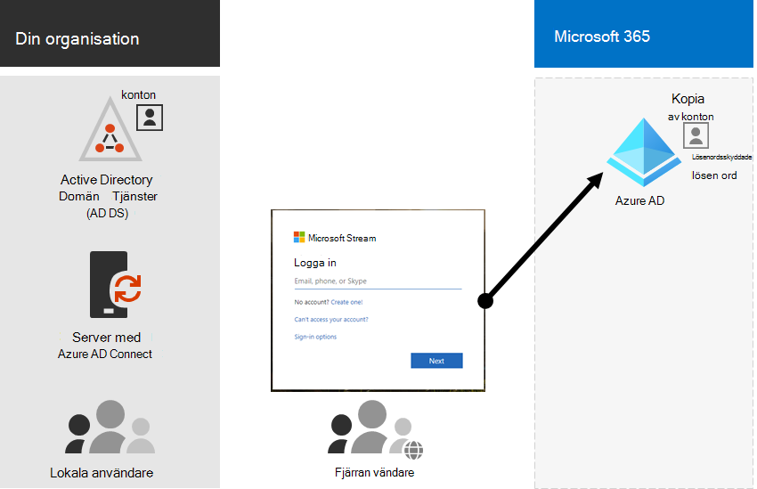
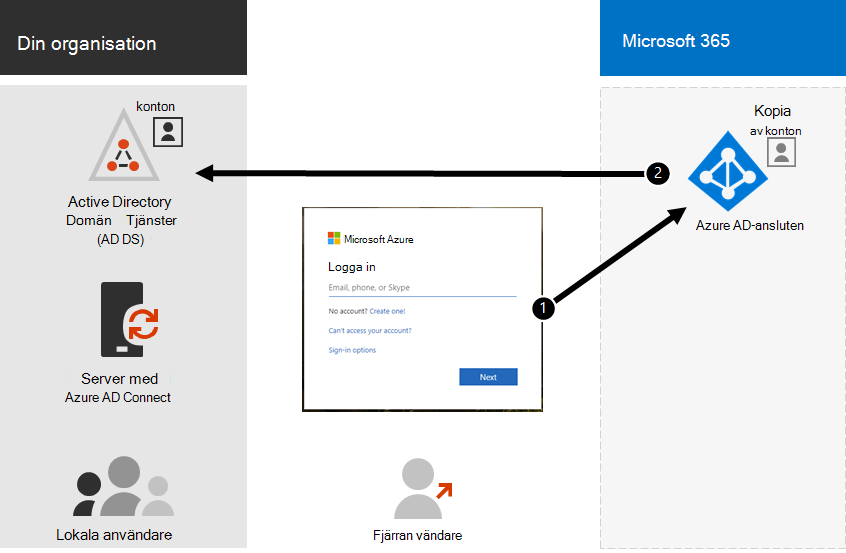

# Hybrididentitet och katalogsynkronisering för Microsoft 365Hybrid identity and directory synchronization for Microsoft 365

*Denna artikel gäller för både Microsoft 365 Enterprise och Office 365 Enterprise.**This article applies to both Microsoft 365 Enterprise and Office 365 Enterprise.*

Beroende på dina affärsbehov och tekniska krav är hybrididentitetsmodellen och katalogsynkroniseringen det vanligaste valet för företagskunder som inför Microsoft 365.Depending on your business needs and technical requirements, the hybrid identity model and directory synchronization is the most common choice for enterprise customers who are adopting Microsoft 365. Med katalogsynkronisering kan du hantera identiteter i AD DS (Active Directory Domain Services) och alla uppdateringar av användarkonton, grupper och kontakter synkroniseras till Azure Active Directory-klientorganisationen (Azure AD) för Microsoft 365-prenumerationen.Directory synchronization allows you to manage identities in your Active Directory Domain Services (AD DS) and all updates to user accounts, groups, and contacts are synchronized to the Azure Active Directory (Azure AD) tenant of your Microsoft 365 subscription.

>[!Note]
>När AD DS-användarkonton synkroniseras för första gången tilldelas de inte automatiskt en Microsoft 365-licens och kan inte komma åt Microsoft 365 tjänster, till exempel e-post.When AD DS user accounts are synchronized for the first time, they are not automatically assigned a Microsoft 365 license and cannot access Microsoft 365 services, such as email. Du måste först tilldela dem en användningsplats.You must first assign them a usage location. Tilldela sedan en licens till dessa användarkonton, antingen individuellt eller dynamiskt genom gruppmedlemskap.Then, assign a license to these user accounts, either individually or dynamically through group membership.
>

## Autentisering för hybrididentitetAuthentication for hybrid identity

Det finns två typer av autentisering när du använder hybrididentitetsmodellen:There are two types of authentication when using the hybrid identity model:

- Hanterad autentiseringManaged authentication

  Azure AD hanterar autentiseringsprocessen med hjälp av en lokalt lagrad hash-version av lösenordet eller skickar autentiseringsuppgifterna till en lokal programvaruagent som ska autentiseras av den lokala AD DS.Azure AD handles the authentication process by using a locally-stored hashed version of the password or sends the credentials to an on-premises software agent to be authenticated by the on-premises AD DS.

- Federerad autentiseringFederated authentication

  Azure AD omdirigerar klientdatorn och begär autentisering till en annan identitetsleverantör.Azure AD redirects the client computer requesting authentication to another identity provider.

### Hanterad autentiseringManaged authentication

Det finns två typer av hanterad autentisering:There are two types of managed authentication:

- Synkronisering av lösenordshashar (PHS)Password hash synchronization (PHS)

  Azure AD utför själva autentiseringen.Azure AD performs the authentication itself.

- Direktautentisering (PTA)Pass-through authentication (PTA)

  Azure AD har AD DS som utför autentiseringen.Azure AD has AD DS perform the authentication.

#### Synkronisering av lösenordshashar (PHS)Password hash synchronization (PHS)

Med PHS synkroniserar du dina AD DS-användarkonton med Microsoft 365 och hanterar användarna lokalt.With PHS, you synchronize your AD DS user accounts with Microsoft 365 and manage your users on-premises. Hash-koderna för användarlösenord synkroniseras från din AD DS till Azure AD så att användarna har samma lösenord lokalt och i molnet.Hashes of user passwords are synchronized from your AD DS to Azure AD so that the users have the same password on-premises and in the cloud. Det här är det enklaste sättet att aktivera autentisering för AD DS-identiteter i Azure AD.This is the simplest way to enable authentication for AD DS identities in Azure AD. 

När lösenord ändras eller återställs lokalt synkroniseras de nya lösenordshashararna till Azure AD så att användarna alltid kan använda samma lösenord för molnresurser och lokala resurser.When passwords are changed or reset on-premises, the new password hashes are synchronized to Azure AD so that your users can always use the same password for cloud resources and on-premises resources. Användarlösenorden skickas aldrig till Azure AD eller lagras i Azure AD i klartext.The user passwords are never sent to Azure AD or stored in Azure AD in clear text. Vissa premiumfunktioner i Azure AD, till exempel Identity Protection, kräver PHS oavsett vilken autentiseringsmetod som valts.Some premium features of Azure AD, such as Identity Protection, require PHS regardless of which authentication method is selected.
  
Mer [information finns i Välja rätt autentiseringsmetod.](/azure/active-directory/hybrid/choose-ad-authn)See [choosing the right authentication method](/azure/active-directory/hybrid/choose-ad-authn) to learn more.
  
#### Direktautentisering (PTA)Pass-through authentication (PTA)

PTA tillhandahåller en enkel lösenordsverifiering för Azure AD-autentiseringstjänster med en programagent som körs på en eller flera lokala servrar för att verifiera användare direkt med din AD DS.PTA provides a simple password validation for Azure AD authentication services using a software agent running on one or more on-premises servers to validate the users directly with your AD DS. Med PTA synkroniserar du AD DS-användarkonton med Microsoft 365 och hanterar användarna lokalt.With PTA, you synchronize AD DS user accounts with Microsoft 365 and manage your users on-premises. 

Med PTA kan användarna logga in både lokalt och via Microsoft 365 och program med sina lokala konton och lösenord.PTA allows your users to sign in to both on-premises and Microsoft 365 resources and applications using their on-premises account and password. Den här konfigurationen validerar användarnas lösenord direkt mot din lokala AD DS utan att lagra lösenordshashar i Azure AD.This configuration validates users passwords directly against your on-premises AD DS without storing password hashes in Azure AD. 

PTA är även för organisationer med säkerhetskrav att omedelbart framtvinga lokala användarkonton, lösenordsprinciper och inloggningstimmar.PTA is also for organizations with a security requirement to immediately enforce on-premises user account states, password policies, and logon hours. 
  
Mer [information finns i Välja rätt autentiseringsmetod.](/azure/active-directory/hybrid/choose-ad-authn)See [choosing the right authentication method](/azure/active-directory/hybrid/choose-ad-authn) to learn more.
  
### Federerad autentiseringFederated authentication

Federerad autentisering är främst för stora företag med mer komplexa autentiseringskrav.Federated authentication is primarily for large enterprise organizations with more complex authentication requirements. AD DS-identiteter synkroniseras Microsoft 365 användarnas konton hanteras lokalt.AD DS identities are synchronized with Microsoft 365 and users accounts are managed on-premises. Med federerad autentisering har användarna samma lösenord lokalt och i molnet och de behöver inte logga in igen för att använda Microsoft 365.With federated authentication, users have the same password on-premises and in the cloud and they do not have to sign in again to use Microsoft 365. 

Federerad autentisering kan ha stöd för ytterligare autentiseringskrav, till exempel smartkortsbaserad autentisering eller multifaktorautentisering från tredje part, och krävs vanligtvis om organisationer har ett autentiseringskrav som inte stöds inbyggt av Azure AD.Federated authentication can support additional authentication requirements, such as smartcard-based authentication or a third-party multi-factor authentication and is typically required when organizations have an authentication requirement not natively supported by Azure AD.
 
Mer [information finns i Välja rätt autentiseringsmetod.](/azure/active-directory/hybrid/choose-ad-authn)See [choosing the right authentication method](/azure/active-directory/hybrid/choose-ad-authn) to learn more.
  
#### Autentisering och identitetsproviders från tredje partThird-party authentication and identity providers

Lokala katalogobjekt kan synkroniseras med hjälp Microsoft 365 och tillgång till molnresurser hanteras främst av en tredjepartsidentitetsleverantör (IdP).On-premises directory objects may be synchronized to Microsoft 365 and cloud resource access is primarily managed by a third-party identity provider (IdP). Om organisationen använder en federeringslösning från tredje part kan du konfigurera inloggningen med lösningen för Microsoft 365 förutsatt att federeringslösningen från tredje part är kompatibel med Azure AD.If your organization uses a third-party federation solution, you can configure sign-on with that solution for Microsoft 365 provided that the third-party federation solution is compatible with Azure AD.
  
Se Azure [AD federation compatibility list](/azure/active-directory/connect/active-directory-aadconnect-federation-compatibility) to learn more.See the [Azure AD federation compatibility list](/azure/active-directory/connect/active-directory-aadconnect-federation-compatibility) to learn more.
  
## Förberedelse av AD DSAD DS Preparation

För att säkerställa en smidig övergång till Microsoft 365 med hjälp av synkronisering måste du förbereda AD DS-skogen innan du påbörjar distributionen Microsoft 365 katalogsynkronisering.To help ensure a seamless transition to Microsoft 365 by using synchronization, you must prepare your AD DS forest before you begin your Microsoft 365 directory synchronization deployment.
  
Katalogförberedelser bör fokusera på följande uppgifter:Your directory preparation should focus on the following tasks:

- Ta bort **dubbletter av proxyAddress-** **och userPrincipalName-attribut.**Remove duplicate **proxyAddress** and **userPrincipalName** attributes.
- Uppdatera tomma och **ogiltiga userPrincipalName-attribut** med giltiga **userPrincipalName-attribut.**Update blank and invalid **userPrincipalName** attributes with valid **userPrincipalName** attributes.
- Ta bort ogiltiga och tveksamma tecken i attributen **givenName**, efternamn ( **sn** ), **sAMAccountName**, **displayName,** **mail,** **proxyAddresses,** **mailNickname** och **userPrincipalName.**Remove invalid and questionable characters in the **givenName**, surname ( **sn** ), **sAMAccountName**, **displayName**, **mail**, **proxyAddresses**, **mailNickname**, and **userPrincipalName** attributes. Mer information om hur du förbereder attribut finns i listan över attribut som [synkroniseras av Azure Active Directory synkroniseringsverktyget.](https://go.microsoft.com/fwlink/p/?LinkId=396719)For details about preparing attributes, see [List of attributes that are synced by the Azure Active Directory Sync Tool](https://go.microsoft.com/fwlink/p/?LinkId=396719).

    > [!NOTE]
    > Det här är samma attribut som Azure AD Anslut synkroniserar.These are the same attributes that Azure AD Connect synchronizes. 
  
## Distributionsöverväganden för flera skogarMulti-forest deployment considerations

För flera skogar och SSO-alternativ använder du [en anpassad installation av Azure AD Anslut.](/azure/active-directory/hybrid/how-to-connect-install-custom)For multiple forests and SSO options, use a [Custom Installation of Azure AD Connect](/azure/active-directory/hybrid/how-to-connect-install-custom).
  
Om din organisation har flera skogar för autentisering (skogar för inloggning) rekommenderar vi följande:If your organization has multiple forests for authentication (logon forests), we highly recommend the following:
  
- **Överväg att konsolidera dina skogar.****Consider consolidating your forests.** I allmänhet går det att underhålla flera skogar omkostnader.In general, there's more overhead required to maintain multiple forests. Om organisationen inte har säkerhetsbegränsningar som kräver separata skogar kan du överväga att förenkla din lokala miljö.Unless your organization has security constraints that dictate the need for separate forests, consider simplifying your on-premises environment.
- **Använd endast i din primära skog för inloggning.****Use only in your primary logon forest.** Överväg att Microsoft 365 endast i din primära skog för inloggning för din inledande distribution av Microsoft 365.Consider deploying Microsoft 365 only in your primary logon forest for your initial rollout of Microsoft 365. 

Om du inte kan konsolidera din AD DS-distribution med flera skogar eller använder andra katalogtjänster för att hantera identiteter kan du eventuellt synkronisera dessa med hjälp av Microsoft eller en partner.If you can't consolidate your multi-forest AD DS deployment or are using other directory services to manage identities, you may be able to synchronize these with the help of Microsoft or a partner.
  
Mer information [finns i Topologier för Azure AD Anslut](/azure/active-directory/hybrid/plan-connect-topologies) mer information.See [Topologies for Azure AD Connect](/azure/active-directory/hybrid/plan-connect-topologies) for more information.
  
## Funktioner som är beroende av katalogsynkroniseringFeatures that are dependent on directory synchronization
  
Katalogsynkronisering krävs för följande funktioner och funktioner:Directory synchronization is required for the following features and functionality:
  
- Smidig och enkel Sign-On i Azure AD (SSO)Azure AD Seamless Single Sign-On (SSO)
- Skype samexistensSkype coexistence
- Exchange till hybriddistribution, inklusive:Exchange hybrid deployment, including:
  - Fullständigt delad global adresslista (GAL) mellan din lokala Exchange och Microsoft 365.Fully shared global address list (GAL) between your on-premises Exchange environment and Microsoft 365.
  - Synkronisera GAL-information från olika e-postsystem.Synchronizing GAL information from different mail systems.
  - Möjligheten att lägga till och ta bort användare Microsoft 365 tjänsterbjudanden.The ability to add users to and remove users from Microsoft 365 service offerings. Det kräver följande:This requires the following:
  - Tvåvägssynkronisering måste konfigureras under katalogsynkroniseringskonfigurationen.Two-way synchronization must be configured during directory synchronization setup. Som standard skriver katalogsynkroniseringsverktyg bara kataloginformation till molnet.By default, directory synchronization tools write directory information only to the cloud. När du konfigurerar tvåvägssynkronisering kan du aktivera återskrivningsfunktioner så att ett begränsat antal objektattribut kopieras från molnet och sedan skrivs tillbaka till din lokala AD DS.When you configure two-way synchronization, you enable write-back functionality so that a limited number of object attributes are copied from the cloud, and then written them back to your local AD DS. Återskrivning kallas även för Exchange-hybridläge.Write-back is also referred to as Exchange hybrid mode. 
  - En lokal Exchange hybriddistributionAn on-premises Exchange hybrid deployment
  - Möjligheten att flytta vissa användarpostlådor till Microsoft 365 samtidigt som andra användarpostlådor finns kvar lokalt.The ability to move some user mailboxes to Microsoft 365 while keeping other user mailboxes on-premises.
  - Valv lokala avsändare och spärrade avsändare replikeras till Microsoft 365.Safe senders and blocked senders on-premises are replicated to Microsoft 365.
  - Grundläggande delegering och e-postfunktioner för att skicka för.Basic delegation and send-on-behalf-of email functionality.
  - Du har ett integrerat lokalt smartkort eller en multifaktorautentiseringslösning.You have an integrated on-premises smart card or multi-factor authentication solution.
- Synkronisering av foton, miniatyrer, konferensrum och säkerhetsgrupperSynchronization of photos, thumbnails, conference rooms, and security groups

## Nästa stegNext step

När du är redo att distribuera hybrididentitet kan du gå till [förbereda för katalogsynkronisering.](prepare-for-directory-synchronization.md)When you are ready to deploy hybrid identity, see [prepare for directory synchronization](prepare-for-directory-synchronization.md).
