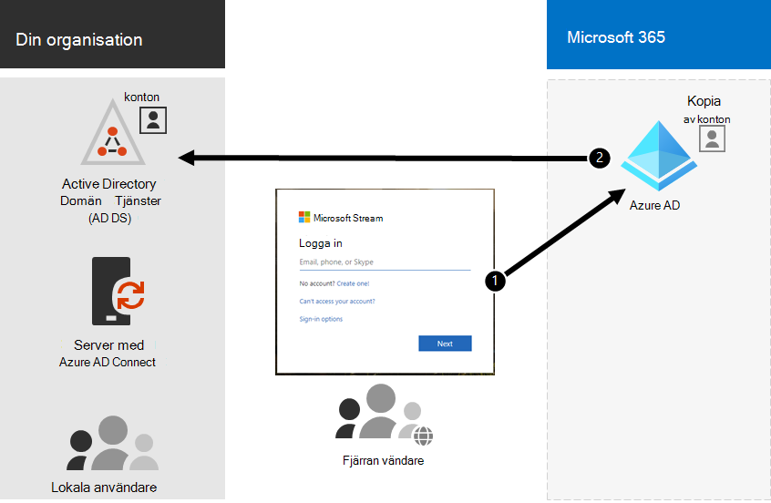

# Hybrididentitet och katalogsynkronisering för Microsoft 365

*Denna artikel gäller för både Microsoft 365 Enterprise och Office 365 Enterprise.*

Beroende på dina affärsbehov och tekniska krav är hybrididentitetsmodellen och katalogsynkroniseringen det vanligaste valet för företagskunder som inför Microsoft 365. Med katalogsynkronisering kan du hantera identiteter i AD DS (Active Directory Domain Services) och alla uppdateringar av användarkonton, grupper och kontakter synkroniseras till Azure Active Directory-klientorganisationen (Azure AD) för Microsoft 365-prenumerationen.

>[!Note]
>När AD DS-användarkonton synkroniseras för första gången tilldelas de inte automatiskt en Microsoft 365-licens och kan inte komma åt Microsoft 365 tjänster, till exempel e-post. Du måste först tilldela dem en användningsplats. Tilldela sedan en licens till dessa användarkonton, antingen individuellt eller dynamiskt genom gruppmedlemskap.
>

## Autentisering för hybrididentitet

Det finns två typer av autentisering när du använder hybrididentitetsmodellen:

- Hanterad autentisering

  Azure AD hanterar autentiseringsprocessen med hjälp av en lokalt lagrad hash-version av lösenordet eller skickar autentiseringsuppgifterna till en lokal programvaruagent som ska autentiseras av den lokala AD DS.

- Federerad autentisering

  Azure AD omdirigerar klientdatorn och begär autentisering till en annan identitetsleverantör.

### Hanterad autentisering

Det finns två typer av hanterad autentisering:

- Synkronisering av lösenordshashar (PHS)

  Azure AD utför själva autentiseringen.

- Direktautentisering (PTA)

  Azure AD har AD DS som utför autentiseringen.

#### Synkronisering av lösenordshashar (PHS)

Med PHS synkroniserar du dina AD DS-användarkonton med Microsoft 365 och hanterar användarna lokalt. Hash-koderna för användarlösenord synkroniseras från din AD DS till Azure AD så att användarna har samma lösenord lokalt och i molnet. Det här är det enklaste sättet att aktivera autentisering för AD DS-identiteter i Azure AD. 

När lösenord ändras eller återställs lokalt synkroniseras de nya lösenordshashararna till Azure AD så att användarna alltid kan använda samma lösenord för molnresurser och lokala resurser. Användarlösenorden skickas aldrig till Azure AD eller lagras i Azure AD i klartext. Vissa premiumfunktioner i Azure AD, till exempel Identity Protection, kräver PHS oavsett vilken autentiseringsmetod som valts.
  
Mer [information finns i Välja rätt autentiseringsmetod.](/azure/active-directory/hybrid/choose-ad-authn)
  
#### Direktautentisering (PTA)

PTA tillhandahåller en enkel lösenordsverifiering för Azure AD-autentiseringstjänster med en programagent som körs på en eller flera lokala servrar för att verifiera användare direkt med din AD DS. Med PTA synkroniserar du AD DS-användarkonton med Microsoft 365 och hanterar användarna lokalt. 

Med PTA kan användarna logga in både lokalt och via Microsoft 365 och program med sina lokala konton och lösenord. Den här konfigurationen validerar användarnas lösenord direkt mot din lokala AD DS utan att lagra lösenordshashar i Azure AD. 

PTA är även för organisationer med säkerhetskrav att omedelbart framtvinga lokala användarkonton, lösenordsprinciper och inloggningstimmar. 
  
Mer [information finns i Välja rätt autentiseringsmetod.](/azure/active-directory/hybrid/choose-ad-authn)
  
### Federerad autentisering

Federerad autentisering är främst för stora företag med mer komplexa autentiseringskrav. AD DS-identiteter synkroniseras Microsoft 365 användarnas konton hanteras lokalt. Med federerad autentisering har användarna samma lösenord lokalt och i molnet och de behöver inte logga in igen för att använda Microsoft 365. 

Federerad autentisering kan ha stöd för ytterligare autentiseringskrav, till exempel smartkortsbaserad autentisering eller multifaktorautentisering från tredje part, och krävs vanligtvis om organisationer har ett autentiseringskrav som inte stöds inbyggt av Azure AD.
 
Mer [information finns i Välja rätt autentiseringsmetod.](/azure/active-directory/hybrid/choose-ad-authn)
  
#### Autentisering och identitetsproviders från tredje part

Lokala katalogobjekt kan synkroniseras med hjälp Microsoft 365 och tillgång till molnresurser hanteras främst av en tredjepartsidentitetsleverantör (IdP). Om organisationen använder en federeringslösning från tredje part kan du konfigurera inloggningen med lösningen för Microsoft 365 förutsatt att federeringslösningen från tredje part är kompatibel med Azure AD.
  
Se Azure [AD federation compatibility list](/azure/active-directory/connect/active-directory-aadconnect-federation-compatibility) to learn more.
  
## Förberedelse av AD DS

För att säkerställa en smidig övergång till Microsoft 365 med hjälp av synkronisering måste du förbereda AD DS-skogen innan du påbörjar distributionen Microsoft 365 katalogsynkronisering.
  
Katalogförberedelser bör fokusera på följande uppgifter:

- Ta bort **dubbletter av proxyAddress-** **och userPrincipalName-attribut.**
- Uppdatera tomma och **ogiltiga userPrincipalName-attribut** med giltiga **userPrincipalName-attribut.**
- Ta bort ogiltiga och tveksamma tecken i attributen **givenName**, efternamn ( **sn** ), **sAMAccountName**, **displayName,** **mail,** **proxyAddresses,** **mailNickname** och **userPrincipalName.** Mer information om hur du förbereder attribut finns i listan över attribut som [synkroniseras av Azure Active Directory synkroniseringsverktyget.](https://go.microsoft.com/fwlink/p/?LinkId=396719)

    > [!NOTE]
    > Det här är samma attribut som Azure AD Anslut synkroniserar. 
  
## Distributionsöverväganden för flera skogar

För flera skogar och SSO-alternativ använder du [en anpassad installation av Azure AD Anslut.](/azure/active-directory/hybrid/how-to-connect-install-custom)
  
Om din organisation har flera skogar för autentisering (skogar för inloggning) rekommenderar vi följande:
  
- **Överväg att konsolidera dina skogar.** I allmänhet går det att underhålla flera skogar omkostnader. Om organisationen inte har säkerhetsbegränsningar som kräver separata skogar kan du överväga att förenkla din lokala miljö.
- **Använd endast i din primära skog för inloggning.** Överväg att Microsoft 365 endast i din primära skog för inloggning för din inledande distribution av Microsoft 365. 

Om du inte kan konsolidera din AD DS-distribution med flera skogar eller använder andra katalogtjänster för att hantera identiteter kan du eventuellt synkronisera dessa med hjälp av Microsoft eller en partner.
  
Mer information [finns i Topologier för Azure AD Anslut](/azure/active-directory/hybrid/plan-connect-topologies) mer information.
  
## Funktioner som är beroende av katalogsynkronisering
  
Katalogsynkronisering krävs för följande funktioner och funktioner:
  
- Smidig och enkel Sign-On i Azure AD (SSO)
- Skype samexistens
- Exchange till hybriddistribution, inklusive:
  - Fullständigt delad global adresslista (GAL) mellan din lokala Exchange och Microsoft 365.
  - Synkronisera GAL-information från olika e-postsystem.
  - Möjligheten att lägga till och ta bort användare Microsoft 365 tjänsterbjudanden. Det kräver följande:
  - Tvåvägssynkronisering måste konfigureras under katalogsynkroniseringskonfigurationen. Som standard skriver katalogsynkroniseringsverktyg bara kataloginformation till molnet. När du konfigurerar tvåvägssynkronisering kan du aktivera återskrivningsfunktioner så att ett begränsat antal objektattribut kopieras från molnet och sedan skrivs tillbaka till din lokala AD DS. Återskrivning kallas även för Exchange-hybridläge. 
  - En lokal Exchange hybriddistribution
  - Möjligheten att flytta vissa användarpostlådor till Microsoft 365 samtidigt som andra användarpostlådor finns kvar lokalt.
  - Valv lokala avsändare och spärrade avsändare replikeras till Microsoft 365.
  - Grundläggande delegering och e-postfunktioner för att skicka för.
  - Du har ett integrerat lokalt smartkort eller en multifaktorautentiseringslösning.
- Synkronisering av foton, miniatyrer, konferensrum och säkerhetsgrupper

## Nästa steg

När du är redo att distribuera hybrididentitet kan du gå till [förbereda för katalogsynkronisering.](prepare-for-directory-synchronization.md)
