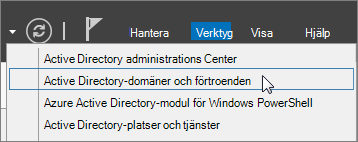
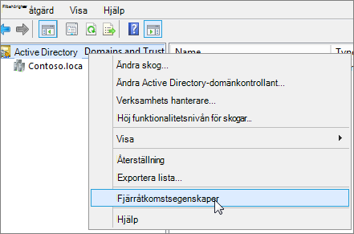
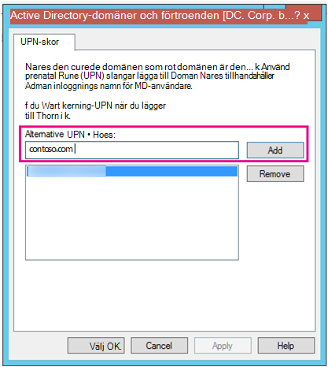
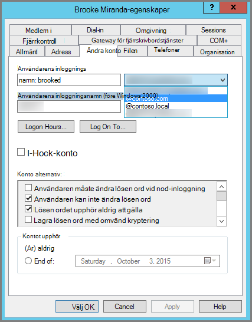

# <a name="prepare-a-non-routable-domain-for-directory-synchronization"></a>Förbereda en icke-dirigerbar domän för katalogsynkronisering

När du synkroniserar din lokala katalog med Microsoft 365 måste du ha en verifierad domän i Azure Active Directory (Azure AD). Endast de upn-namn (User Principal Names) som är kopplade till den lokala Active Directory Domain Services-domänen (AD DS) synkroniseras. Men ALLA UPN som innehåller en icke-dirigerbar domän, till exempel ".local" (exempel: billa@contoso.local), synkroniseras med en .onmicrosoft.com domän (exempel: billa@contoso.onmicrosoft.com). 

Om du använder en .local-domän för dina användarkonton i AD DS rekommenderar vi att du ändrar dem till att använda en verifierad domän, till exempel billa@contoso.com, för att synkronisera dem med din Microsoft 365-domän.
  
## <a name="what-if-i-only-have-a-local-on-premises-domain"></a>Vad händer om jag bara har en lokal ".local"-domän?

Du använder Azure AD Connect för att synkronisera din AD DS till Azure AD-klientorganisationen i din Microsoft 365-klientorganisation. Mer information finns i [Integrera lokala identiteter med Azure AD.](/azure/architecture/reference-architectures/identity/azure-ad)
  
Azure AD Connect synkroniserar användarnas UPN och lösenord så att användarna kan logga in med samma inloggningsuppgifter som de använder lokalt. Men Azure AD Connect synkroniserar bara användare med domäner som verifieras av Microsoft 365. Det innebär att domänen också verifieras av Azure AD eftersom Microsoft 365-identiteter hanteras av Azure AD. Med andra ord måste domänen vara en giltig Internetdomän (till exempel .com, .org, .net, .us). Om din interna AD DS endast använder en icke-dirigerbar domän (till exempel ".local") kan den inte matcha den verifierade domänen du har för Microsoft 365-klienten. Du kan åtgärda problemet genom att antingen ändra din primära domän i din lokala AD DS eller genom att lägga till ett eller flera UPN-suffix.
  
### <a name="change-your-primary-domain"></a>Ändra din primära domän

Ändra din primära domän till en domän som du har verifierat i Microsoft 365, till exempel contoso.com. Alla användare som har domänen contoso.local uppdateras sedan till contoso.com. Det här är en process som är mycket involverad och en enklare lösning beskrivs i följande avsnitt.
  
### <a name="add-upn-suffixes-and-update-your-users-to-them"></a>Lägga till UPN-suffix och uppdatera användarna till dem

Du kan lösa problemet med ".local" genom att registrera nya UPN-suffix eller -suffix i AD DS så att de matchar den eller de domäner du verifierade i Microsoft 365. När du har registrerat det nya suffixet uppdaterar du användarnas UPN så att de ersätter ".local" med det nya domännamnet, så att ett användarkonto ser ut som billa@contoso.com.
  
När du har uppdaterat UPN-namn för att använda den verifierade domänen är du redo att synkronisera din lokala AD DS med Microsoft 365.
  
#### <a name="step-1-add-the-new-upn-suffix"></a>Steg 1: Lägg till det nya UPN-suffixet**
  
1. I Serverhanteraren på AD DS-domänkontrollanten väljer **du Verktyg** \> **Active Directory - domäner och förtroenden.**
    
    **Eller om du inte har Windows Server 2012**
    
    Tryck **på Windows-tangenten + R** för **att** öppna dialogrutan Kör, skriv Domain.msc och välj sedan **OK.**
    
    
  
2. I fönstret **Active Directory - domäner och** förtroenden högerklickar du på Active Directory **-** domäner och förtroenden och väljer sedan **Egenskaper**.
    
    
  
3. På fliken **UPN-suffix,** i rutan Alternativa **UPN-suffix,** skriver du det nya UPN-suffixet eller -suffixen och väljer sedan **Lägg till** \> **Använd.**
    
    
  
    Välj **OK** när du är klar med att lägga till suffix. 
    
 #### <a name="step-2-change-the-upn-suffix-for-existing-users"></a>Steg 2: Ändra UPN-suffixet för befintliga användare
  
1. I Serverhanteraren på AD DS-domänkontrollanten väljer du **Verktyg** \> **Active Directory - användare och datorer.**
    
    **Eller om du inte har Windows Server 2012**
    
    Tryck **på Windows-tangenten + R** för att öppna dialogrutan Kör, skriv Dsa.msc och klicka sedan på **OK** 
    
2. Välj en användare, högerklicka och välj sedan **Egenskaper**.
    
3. Välj **det nya** UPN-suffixet i listrutan UPN-suffix på fliken Konto och välj sedan **OK.**
    
    
  
4. Utför de här stegen för alla användare.
    
   
### <a name="use-powershell-to-change-the-upn-suffix-for-all-of-your-users"></a>Använda PowerShell för att ändra UPN-suffixet för alla användare

Om du har många användarkonton att uppdatera är det enklare att använda PowerShell. I följande exempel används cmdletarna [Get-ADUser](/previous-versions/windows/it-pro/windows-server-2008-R2-and-2008/ee617241(v=technet.10)) och [Set-ADUser](/previous-versions/windows/it-pro/windows-server-2008-R2-and-2008/ee617215(v=technet.10)) för att ändra alla contoso.local-suffix till contoso.com i AD DS. 

Du kan till exempel köra följande PowerShell-kommandon för att uppdatera alla contoso.local-suffix till contoso.com:
    
  ```powershell
  $LocalUsers = Get-ADUser -Filter "UserPrincipalName -like '*contoso.local'" -Properties userPrincipalName -ResultSetSize $null
  $LocalUsers | foreach {$newUpn = $_.UserPrincipalName.Replace("@contoso.local","@contoso.com"); $_ | Set-ADUser -UserPrincipalName $newUpn}
  ```

Mer information om hur du använder Windows PowerShell i AD DS finns i Modulen [Active Directory Windows PowerShell.](/previous-versions/windows/it-pro/windows-server-2008-R2-and-2008/ee617195(v=technet.10))