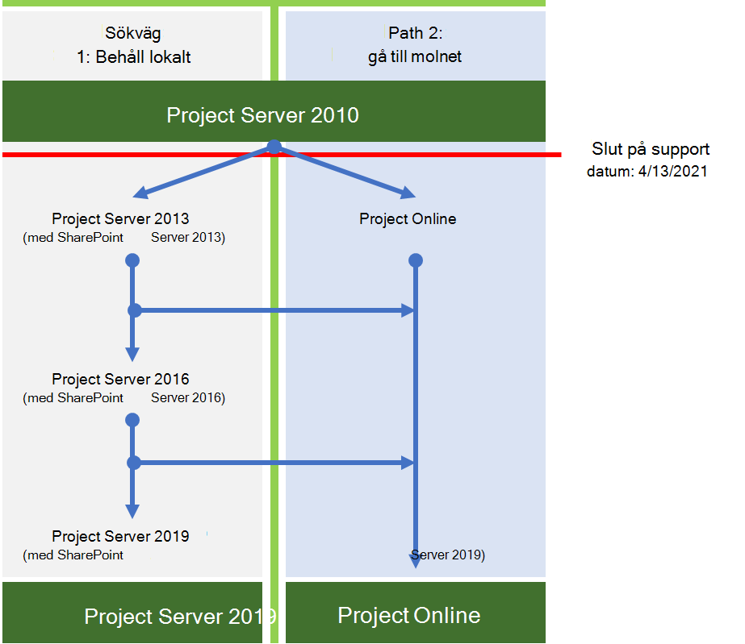

# Project Server 2010 slut på support översiktProject Server 2010 end of support roadmap

*Den här artikeln gäller både Microsoft 365 Enterprise och Office 365 Enterprise.**This article applies to both Microsoft 365 Enterprise and Office 365 Enterprise.*

Project Server 2010 når supporten den **13 April 2021**.Project Server 2010 will reach end of support on **April 13, 2021**. Detta datum har förlängts från föregående sista support datum den 13 oktober 2020.This date has been extended from the previous end-of-support date of October 13, 2020. Om du för närvarande använder Project Server 2010 ska du tänka på att dessa andra relaterade produkter har följande slut på support datum:If you are currently using Project Server 2010, note that these other related products have the following end of support dates:
  
| ProduktProduct |Slut på support datumetEnd of support date|
|:-----|:-----|
|Project 2010-standardProject 2010 Standard   |Den 13 oktober 2020October 13, 2020    |
|Project 2010 ProfessionalProject 2010 Professional    |Den 13 oktober 2020October 13, 2020    |

   
Mer information om Office 2010-servrar som når support finns i [Uppgradera från Office 2010-servrar och-klient produkter](plan-upgrade-previous-versions-office.md).For more information about Office 2010 servers reaching end of support, see [Upgrade from Office 2010 servers and client products](plan-upgrade-previous-versions-office.md).
  
## Vad innebär slut på support?What does end of support mean?

Project Server, till exempel nästan alla Microsoft-produkter, har en support livs cykel under vilken vi tillhandahåller nya funktioner, fel korrigeringar och säkerhets uppdateringar.Project Server, like almost all Microsoft products, has a support lifecycle during which we provide new features, bug fixes, and security updates. Denna livs cykel räcker normalt i 10 år från datumet för produktens första utgivning och slutet av den här livs cykeln kallas produkt Supportens slut.This lifecycle typically lasts for 10 years from the date of the product's initial release, and the end of this lifecycle is known as the product's end of support. När Project Server 2010 når Supportens slut den 13 april 2021 kommer Microsoft inte längre att tillhandahålla:When Project Server 2010 reaches its end of support on April 13, 2021, Microsoft will no longer provide:
  
- Teknisk support för problem som kan uppstå.Technical support for problems that may occur.
    
- Program korrigeringar för problem som upptäcks och som kan påverka serverns stabilitet och användbarhet.Bug fixes for issues that are discovered and that may impact the stability and usability of the server.
    
- Säkerhets korrigeringar för säkerhets problem som upptäcks och som kan göra servern sårbar för säkerhets brott.Security fixes for vulnerabilities that are discovered and that may make the server vulnerable to security breaches.
    
- Tids zons uppdateringar.Time zone updates.
    
Din installation av Project Server 2010 fortsätter att köras efter detta datum.Your installation of Project Server 2010 will continue to run after this date. Vi rekommenderar att du migrerar från Project Server 2010 så snart som möjligt.However, because of the changes listed above, we strongly recommend that you migrate from Project Server 2010 as soon as possible.
  
## Vilka alternativ har jag?What are my options?

Om du använder Project Server 2010 måste du utforska alternativen för migrering, som är:If you are using Project Server 2010, you need to explore your migration options, which are:
  
- Migrera till Project OnlineMigrate to Project Online
    
- Migrera till en nyare lokal version av Project Server (helst Project Server 2019).Migrate to a newer on-premises version of Project Server (preferably Project Server 2019).

Här är de två sökvägar du kan vidta för att undvika att stöd saknas för Project Server 2010.Here are the two paths you can take to avoid the end of support for Project Server 2010.

    

|**Varför skulle jag föredra att migrera till Project Server 2019?****Why would I prefer to migrate to Project Server 2019?**|**Varför skulle jag föredra att migrera till Project Online?****Why would I prefer to migrate to Project Online?**|
|:-----|:-----|
|Företags regler begränsar mig från att arbeta mitt företag i molnet.Business rules restrict me from operating my business in the cloud.     Jag behöver kontroll över uppdateringar av min miljö.I need control of updates to my environment.    | Jag har mobila användare eller fjärran vändare.I have mobile or remote users.     Kostnader för att migrera lokala servrar är en stor angelägenhet (maskin vara, program vara, tid och ansträngning att genomföra).Costs to migrate on-premises servers are a big concern (hardware, software, hours and effort to implement, etc.).     Efter migreringen är kostnader för att underhålla min miljö en stor angelägenhet (till exempel automatiska uppdateringar, garanterad drifts tid osv.).After migration, costs to maintain my environment are a big concern (for example, automatic updates, guaranteed uptime, etc.).     |

   
> [!NOTE]
> Mer information om alternativ för att flytta från dina Office 2010-servrar finns i [resurser som hjälper dig att uppgradera från office 2010-servrar och-klienter](upgrade-from-office-2010-servers-and-products.md).For more information about options for moving from your Office 2010 servers, see [Resources to help you upgrade from Office 2010 servers and clients](upgrade-from-office-2010-servers-and-products.md). Observera att Project Server inte stöder en hybrid konfiguration eftersom Project Server och Project Online inte kan dela samma resurspool.Note that Project Server does not support a hybrid configuration since Project Server and Project Online cannot share the same resource pool. 

### Vilka är mina alternativ för Project-klienten?What are my options for Project client?
Om du använder Project Professional 2010 eller Project Standard 2010 och vill utforska alternativen för migrering kan du välja mellan:If you are using Project Professional 2010 or Project Standard 2010 and want to explore your migration options, you have the choice of:
- Flytta till en nyare version av Project Professional eller Project Standard.Moving to a newer version of Project Professional or Project Standard.
- Flytta till en online-lösning, till exempel Project Online eller Project för webben.Moving to an online solution such as Project Online or Project for the web.
 
#### Flytta till en nyare version av Project-klientenMoving to a newer version of Project client

Om du migrerar från Project Standard 2010 kan du migrera till en nyare version av Project Standard (Project Standard 2016 eller Project Standard 2019).If you are migrating from Project Standard 2010, you can migrate to a newer version of Project Standard (Project Standard 2016 or Project Standard 2019).  Vi rekommenderar att du flyttar till den senaste versionen för att kunna använda de senaste funktionerna.We recommend moving to the newest version to take advantage of the latest features and functionality. Om du migrerar till en mindre aktuell version (Project Standard 2016) innebär det att du måste migrera från den här versionen när support datumet uppfylls.Also, migrating to a less current version (Project Standard 2016) means that you will need to migrate from this version sooner as its end of support date comes up.

Om du migrerar från Project Professional 2010 kan du till och med välja att migrera till en nyare version (Project Professional 2019 eller Project Professional 2016).Similarly, if you are migrating from Project Professional 2010, you can choose to migrate to a newer version (Project Professional 2019 or Project Professional 2016). Vi rekommenderar att du flyttar till den senaste versionen om det är möjligt.We recommend moving to the newest version if possible.  Om du använder Project Professional för att ansluta till Project Server bör du kontrol lera att du migrerar till en version av Project Professional som stöds för att ansluta till den version av Project Server som du använder.If you are using Project Professional to connect to Project Server, make sure that you migrate to a version of Project Professional that is supported to connect with the version of Project Server that you are using.

Project Professional 2010-användare kan också välja att migrera till Project Online-klienten.Project Professional 2010 users can also choose to migrate to the Project Online Desktop client. Det är en programbaserad version av Project Professional 2019 och ingår i Project plan 3-och Project abonnemang 5-prenumerationer.It is a subscription-based version of Project Professional 2019, and is included in Project Plan 3 and Project Plan 5 subscriptions. 

#### Flytta till en online-lösningMoving to an online solution

Du kan också välja att migrera från Project Professional 2010 eller Project Standard 2010 till projektets prenumerations online-lösningar.You can also choose to migrate from Project Professional 2010 or Project Standard 2010 to Project's subscription-based online solutions. Både Project-abonnemang 3 och abonnemang 5 inkluderar Project Online och det senaste moln erbjudandet, [Project för webben](https://support.office.com/article/what-can-you-do-with-project-for-the-web-b30f5442-be5f-43d2-9072-c95bff778ea1).Both Project Plan 3 and Plan 5 include Project Online and the latest cloud offering, [Project for the web](https://support.office.com/article/what-can-you-do-with-project-for-the-web-b30f5442-be5f-43d2-9072-c95bff778ea1). Båda erbjuder ett antal nya funktioner som är värda att utforska.Both offer a number of new features and benefits that are worth exploring.

Mer information om funktioner som ingår i både och även projekt planerings licenser som de ingår i finns i Beskrivning av [Microsoft Project-tjänsten](https://docs.microsoft.com/office365/servicedescriptions/project-online-service-description/project-online-service-description).For more information about features included in both, as well as Project Plan licenses they are included in, see the [Microsoft Project service description](https://docs.microsoft.com/office365/servicedescriptions/project-online-service-description/project-online-service-description).

  
## Viktigt att tänka på när du planerar att migrera från Project Server 2010Important considerations you need to make when planning to migrate from Project Server 2010

Du måste tänka på följande när du planerar att migrera från Project Server 2010:You need to consider the following when planning to migrate from Project Server 2010:
  
- **Få hjälp från en Microsoft Solution-leverantör** – uppgradering från Project Server 2010 kan vara en utmaning och kräver förberedelser och planering.**Get help from a Microsoft solution provider** - Upgrading from Project Server 2010 can be a challenge and requires much preparation and planning. Det kan vara särskilt svårt om du inte var den som är konfigurerad för att installera och konfigurera Project Server 2010.It can be especially challenging if you were not the one to setup and configure Project Server 2010 originally. Som tur är, det finns Microsoft Solution providers som du kan göra till en boende, oavsett om du planerar att migrera till Project Server 2019 eller Project Online.Luckily, there are Microsoft solution providers you can turn to who do this for a living, whether you plan on migrating to Project Server 2019 or to Project Online. Du kan söka efter en Microsoft Solution-leverantör för att få hjälp med migreringen i [Microsoft Solution Provider Center](https://go.microsoft.com/fwlink/p/?linkid=841249).You can search for a Microsoft solution provider to help with your migration on the [Microsoft solution provider center](https://go.microsoft.com/fwlink/p/?linkid=841249). 
    
- **Planera för dina anpassningar** -Tänk på att många av de anpassningar som du har arbetat med i project Server 2010-miljön kanske inte fungerar när du migrerar till project Server 2019 eller Project Online.**Plan for your customizations** - Be aware that many of the customizations you have working in your Project Server 2010 environment might not work when migrating to Project Server 2019 or to Project Online. Det finns stora skillnader i Project Server-arkitekturen mellan versioner, samt nödvändiga operativ system, databas servrar och klient webbläsare som stöds för att fungera med den nyare versionen.There are big differences in Project Server architecture between versions, as well as the required operating systems, database servers, and client web browsers that are supported to work with the newer version. Få en plan på plats för hur du kan testa eller återskapa anpassningarna som behövs i din nya miljö.Have a plan in place on how to test or rebuild your customizations as needed in your new environment. Planering för din uppgradering kommer också att vara en god chans att kontrol lera om en viss anpassning behövs när du går vidare.Planning for your upgrade will also be a good opportunity to verify if a specific customization is really needed as you move forward. [Skapa en plan för aktuella anpassningar under uppgradering till SharePoint 2013]( https://docs.microsoft.com/SharePoint/upgrade-and-update/create-a-plan-for-current-customizations-during-upgrade-to-sharepoint-2013) har lite allmän information om utvärdering och planering av dina aktuella anpassningar när du uppgraderar.[Create a plan for current customizations during upgrade to SharePoint 2013]( https://docs.microsoft.com/SharePoint/upgrade-and-update/create-a-plan-for-current-customizations-during-upgrade-to-sharepoint-2013) has some great general information about evaluating and planning for your current customizations when upgrading. 
    
- **Tid och tålamod** -uppgradering, exekvering och testning tar mycket tid och ansträngning, särskilt om du uppgraderar till Project Server 2019.**Time and patience** - Upgrade planning, execution, and testing will take much time and effort, especially if you are upgrading to Project Server 2019. Om du till exempel migrerar från Project Server 2010 till Project Server 2019 måste du först migrera från Project Server 2010 till Project Server 2013 och sedan kontrol lera dina data och sedan göra samma sak när du migrerar till varje senare version (till Project Server 2016 och sedan till Project Server 2019).For example, if you are migrating from Project Server 2010 to Project Server 2019, you will first need to migrate from Project Server 2010 to Project Server 2013, and then check your data, and then do the same thing when you migrate to each successive version (to Project Server 2016 and then to Project Server 2019). Det kan vara bra att kontrol lera om du har en Microsoft Solution Provider som jämför dina beräknade kostnader med deras uppskattningar av hur lång tid det tar för dem att göra det och hur mycket det kostar.You might want to check with a Microsoft solution provider to compare your estimated costs with their estimates of how long it will take for them to do it, and at what cost. 
    
## Migrera till Project OnlineMigrate to Project Online

Om du väljer att migrera från Project Server 2010 till Project Online kan du göra följande för att manuellt migrera dina projekt Plans data:If you choose to migrate from Project Server 2010 to Project Online, you can do the following to manually migrate your project plan data:
  
1. Spara dina projektplaner från Project Server 2010 till. MPP-format.Save your project plans from Project Server 2010 to .MPP format.
    
2. Använd Project Professional 2016, Project Professional 2019 eller Project Online-klienten, öppna alla. mpp-filer och spara och publicera dem i Project Online.Using Project Professional 2016, Project Professional 2019, or the Project Online Desktop Client, open each .mpp file, and then save and publish it to Project Online.
    
Du kan skapa din PWA-konfiguration manuellt i Project Online (om du till exempel vill skapa eventuella anpassade fält eller företags kalendrar).You can manually create your PWA configuration in Project Online (for example, recreate any needed custom fields or enterprise calendars). Microsoft Solution providers kan också hjälpa dig med detta.Microsoft solution providers can also help you with this.
  
Viktiga resurser:Key resources:
  
|**Resurspool****Resource**|**Beskrivning****Description**|
|:-----|:-----|
|[Komma igång med Project OnlineGet started with Project Online](https://support.office.com/article/e3e5f64f-ada5-4f9d-a578-130b2d4e5f11)   |Hur du installerar och använder Project Online.How to setup and use Project Online.    |
|[Tjänstbeskrivning för Project OnlineProject Online Service Description](https://go.microsoft.com/fwlink/p/?linkid=829088)   |Information om de olika Project Online-abonnemangen som är tillgängliga för dig.Information about the different Project Online plans that are available to you.    |
   
## Migrera till en nyare lokal version av Project ServerMigrate to a newer on-premises version of Project Server

Vi tror att du kan nå det bästa värdet och användar upplevelsen genom att migrera till Project Online, men vi förstår också att vissa organisationer måste ha projekt data i en lokal miljö.While we strongly believe that you can achieve the best value and user experience by migrating to Project Online, we also understand that some organizations need to keep project data in an on-premises environment. Om du väljer att hålla dina Project-data lokala kan du migrera din Project Server 2010-miljö till Project Server 2013, Project Server 2016 eller Project Server 2019.If you choose to keep your project data on-premises, you can migrate your Project Server 2010 environment to Project Server 2013, Project Server 2016, or Project Server 2019.
  
Vi rekommenderar att du migrerar till Project Server 2019 om du inte kan migrera till Project Online.We recommend that you migrate to Project Server 2019 if you can't migrate to Project Online. Project Server 2019 innehåller de flesta nycklar som är de funktioner och framsteg som ingår i tidigare versioner av Project Server, och det stämmer närmast de funktioner som är tillgängliga med Project OnlineProject Server 2019 includes most of the key the features and advancements included with previous releases of Project Server, and it most closely matches the experience available with Project Online (although some features are available only in Project Online).
  
När du har slutfört varje migrering bör du kontrol lera att dina data har migrerats.After completing each migration, you should check your data to make sure that it has migrated successfully.
  
> [!NOTE]
> Om du funderar på att bara migrera till Project Server 2013 om du är begränsad till en lokal lösning är det viktigt att Observera att det bara har några fler års support kvar.If you are considering only migrating to Project Server 2013 if you are limited to an on-premises solution, it is important to note that it only has a few more years of support left. Project Server 2013 med Service Pack 2 slut på support datumet är 10/13/2023.Project Server 2013 with Service Pack 2 end of support date is 10/13/2023. Mer information om slut på support datum finns i [Microsofts produkt livs cykel policy](https://go.microsoft.com/fwlink/p/?linkid=842066).For more information about end of support dates, see [Microsoft Product Lifecycle Policy](https://go.microsoft.com/fwlink/p/?linkid=842066). 
  
### Hur migrerar jag till Project Server 2019?How do I migrate to Project Server 2019?

Arkitekturen mellan Project Server 2010 och Project Server 2019 förhindrar en direkt migrering.The architectural differences between Project Server 2010 and Project Server 2019 prevents a direct migration path. Det innebär att du måste migrera dina Project Server 2010-data till nästa efterföljande version av Project Server tills du uppgraderar till Project Server 2019.This means that you will need to migrate your Project Server 2010 data to the next successive version of Project Server until you upgrade to Project Server 2019.
  
Du måste göra följande för att uppgradera Project Server 2010 till Project Server 2019:You will need to do the following steps to upgrade Project Server 2010 to Project Server 2019:
  
1. Migrera till Project Server 2013.Migrate to Project Server 2013.
    
2. Migrera från Project servar 2013 till Project Server 2016.Migrate from Project Serve 2013 to Project Server 2016.
    
3. Migrera från Project Server 2016 till Project Server 2019.Migrate from Project Server 2016 to Project Server 2019.
    
När du har slutfört varje migrering bör du kontrol lera att dina data har migrerats.After completing each migration, you should check your data to make sure that it has migrated successfully.
  
    
### Steg 1: migrera till Project Server 2013Step 1: Migrate to Project Server 2013

Ditt första steg med att migrera Project Server 2010-data till Project Server 2019 är att först migrera till Project Server 2013.Your first step in migrating your Project Server 2010 data to Project Server 2019 is to first migrate to Project Server 2013. 
  
Mer information om vad du behöver göra för att uppgradera från Project Server 2010 till Project Server 2013 finns i [Uppgradera till Project server 2013](https://go.microsoft.com/fwlink/p/?linkid=841822).For a comprehensive understanding of what you need to do to upgrade from Project Server 2010 to Project Server 2013, see [Upgrade to Project Server 2013](https://go.microsoft.com/fwlink/p/?linkid=841822). 
  
Viktiga resurser:Key resources:
  
- [Översikt över uppgraderings processen för Project Server 2013Overview of the Project Server 2013 upgrade process](https://go.microsoft.com/fwlink/p/?linkid=841822)

  Läs mer om vad du behöver göra för att uppgradera från Project Server 2010 till Project Server 2013.Get a high-level understanding of what you need to do to upgrade from Project Server 2010 to Project Server 2013.
- [Planera att uppgradera till Project Server 2013Plan to upgrade to Project Server 2013](https://go.microsoft.com/fwlink/p/?linkid=841823) 

  Titta på de överväganden du behöver göra när du uppgraderar från Project Server 2010 till Project Server 2013, inklusive system krav.Look at planning considerations you need to make when upgrading from Project Server 2010 to Project Server 2013, including System Requirements.
   
[Nyheter i 2013-uppgraderingen för Project Server](https://go.microsoft.com/fwlink/p/?linkid=841824) visar en del viktiga ändringar för uppgraderingen för den här versionen, som är viktigast:[What's new in Project Server 2013 upgrade](https://go.microsoft.com/fwlink/p/?linkid=841824) tells you some important changes for upgrade for this version, the most notable being: 
  
- Det finns ingen uppgradering på plats för Project Server 2013.There is no in-place upgrade to Project Server 2013. Metoden databas koppling är den enda metod som stöds för uppgradering från Project Server 2010 till Project Server 2013.The database-attach method is the only supported method for upgrading from Project Server 2010 to Project Server 2013.
    
- Uppgraderings processen konverterar inte bara Project Server 2010-data till Project Server 2013-format, men den sammanlänkas också de fyra Project Server 2010-databaserna till en enda Project Web App-databas.The upgrade process will not only convert your Project Server 2010 data to Project Server 2013 format, but will also consolidate the four Project Server 2010 databases to a single Project Web App database.
    
- Både SharePoint Server 2013 och Project Server 2013 ändras till anspråksbaserad auktorisering från den föregående versionen.Both SharePoint Server 2013 and Project Server 2013 changed to claims-based authentication from the previous version. Du måste tänka på när du uppgraderar om du använder klassisk behörighet.You will need to make considerations when upgrading if you are using classic authentication. Mer information finns i [Migrera från klassiskt läge till anspråksbaserad identifiering i SharePoint 2013]( https://docs.microsoft.com/sharepoint/upgrade-and-update/migrate-from-classic-mode-to-claims-based-authentication-in-sharepoint-2013).For more information, see [Migrate from classic-mode to claims-based authentication in SharePoint 2013]( https://docs.microsoft.com/sharepoint/upgrade-and-update/migrate-from-classic-mode-to-claims-based-authentication-in-sharepoint-2013).
    
Viktiga resurser:Key resources:
  
- [Översikt över uppgraderings processen till Project Server 2013Overview of the upgrade process to Project Server 2013](https://go.microsoft.com/fwlink/p/?linkid=841274)
    
- [Uppgradera dina databaser och webbplats samlingar för Project Web App (Project Server 2013)Upgrade your databases and Project Web App site collections (Project Server 2013)](https://go.microsoft.com/fwlink/p/?linkid=841272)
    
- [Microsoft Project Server-uppgraderings process diagramMicrosoft Project Server upgrade process diagram](https://go.microsoft.com/fwlink/p/?linkid=841270)
    
- [Den fantastiska databas konsolideringen, Project Server 2010 till 2013-migrering i 8 enkla stegThe Great Database Consolidation, Project Server 2010 to 2013 Migration in 8 Easy Steps](https://go.microsoft.com/fwlink/p/?linkid=841271)
    
### Steg 2: migrera till Project Server 2016Step 2: Migrate to Project Server 2016

När du har migrerat till Project Server 2013 och kontrollerat att dina data har migrerats, är nästa steg att migrera dina data till Project Server 2016.After migrating to Project Server 2013 and verifying that your data has migrated successfully, the next step is to migrate your data to Project Server 2016.
  
Mer information om vad du behöver göra för att uppgradera från Project Server 2013 till Project Server 2016 finns i [Uppgradera till Project server 2016](https://docs.microsoft.com/Project/upgrade-to-project-server-2016).For a comprehensive understanding of what you need to do to upgrade from Project Server 2013 to Project Server 2016, see [Upgrade to Project Server 2016](https://docs.microsoft.com/Project/upgrade-to-project-server-2016).
  
Viktiga resurser:Key resources:
  
- [Översikt över uppgraderings processen för Project Server 2016Overview of the Project Server 2016 upgrade process](https://docs.microsoft.com/Project/overview-of-the-project-server-2016-upgrade-process)

  Läs mer om vad du behöver göra för att uppgradera från Project Server 2013 till Project Server 2016.Get a high-level understanding of what you need to do to upgrade from Project Server 2013 to Project Server 2016.

- [Planera för uppgradering till Project Server 2016Plan for upgrade to Project Server 2016](https://docs.microsoft.com/Project/plan-for-upgrade-to-project-server-2016)

  Titta på de överväganden du behöver göra när du uppgraderar från Project Server 2013 till Project Server 2016.Look at planning considerations you need to make when upgrading from Project Server 2013 to Project Server 2016.
   
[Saker du behöver veta om Project Server 2016-uppgraderingen](https://docs.microsoft.com/project/plan-for-upgrade-to-project-server-2016#thingknow) ger dig viktiga ändringar för att uppgradera till den här versionen, som omfattar:[Things you need to know about Project Server 2016 upgrade](https://docs.microsoft.com/project/plan-for-upgrade-to-project-server-2016#thingknow) tells you some important changes for upgrading to this version, which include: 
  
- När du skapar din Project Server 2016-miljö som du migrerar dina Project Server 2013-data till kan du tänka på att Project Server 2016-installationsfilerna ingår i SharePoint Server 2016.When you create your Project Server 2016 environment to which you will migrate your Project Server 2013 data, note that the Project Server 2016 installation files are included in SharePoint Server 2016. Mer information finns i [distribuera Project Server 2016](https://go.microsoft.com/fwlink/p/?linkid=841829).For more information, see [Deploy Project Server 2016](https://go.microsoft.com/fwlink/p/?linkid=841829).
    
- Resurs planer är föråldrade i Project Server 2016.Resource plans are deprecated in Project Server 2016. Resurs abonnemang för Project Server 2013 migreras till resurs åtaganden i Project Server 2016 och i Project Online.Your Project Server 2013 resource plans will be migrated to Resource Engagements in Project Server 2016 and in Project Online. Se [Översikt: eventuella resurs åtaganden](https://support.office.com/article/73eefb5a-81fe-42bf-980e-9532b1bdc870) för mer information.See [Overview: Resource engagements](https://support.office.com/article/73eefb5a-81fe-42bf-980e-9532b1bdc870) for more information. 
    
### Steg 3: migrera till Project Server 2019Step 3: Migrate to Project Server 2019

När du har migrerat till Project Server 2016 och kontrollerat att dina data har migrerats, är nästa steg att migrera dina data till Project Server 2019.After migrating to Project Server 2016 and verifying that your data has migrated successfully, the next step is to migrate your data to Project Server 2019.
  
Mer information om vad du behöver göra för att uppgradera från Project Server 2016 till Project Server 2019 finns i [Uppgradera till Project server 2019](https://docs.microsoft.com/Project/upgrade-to-project-server-2016).For a comprehensive understanding of what you need to do to upgrade from Project Server 2016 to Project Server 2019, see [Upgrade to Project Server 2019](https://docs.microsoft.com/Project/upgrade-to-project-server-2016).
  
Viktiga resurser:Key resources:
  
- [Översikt över uppgraderings processen för Project Server 2019Overview of the Project Server 2019 upgrade process](https://docs.microsoft.com/project/overview-of-the-project-server-2019-upgrade-process)

  Läs mer om vad du behöver göra för att uppgradera från Project Server 2013 till Project Server 2016.Get a high-level understanding of what you need to do to upgrade from Project Server 2013 to Project Server 2016.

- [Planera för uppgradering till Project Server 2019Plan for upgrade to Project Server 2019](https://docs.microsoft.com/project/plan-for-upgrade-to-project-server-2019)

  Titta på de överväganden du behöver göra när du uppgraderar från Project Server 2016 till Project Server 2019.Look at planning considerations you need to make when upgrading from Project Server 2016 to Project Server 2019.
   
[Saker du behöver veta om Project Server 2019-uppgraderingen](https://go.microsoft.com/fwlink/p/?linkid=841827) ger dig viktiga ändringar för att uppgradera till den här versionen, som omfattar:[Things you need to know about Project Server 2019 upgrade](https://go.microsoft.com/fwlink/p/?linkid=841827) tells you some important changes for upgrading to this version, which include: 
  
- Uppgraderings processen migrerar data från din Project Server 2016-databas till SharePoint Server 2019-innehålls databasen.The upgrade process will migrate your data from your Project Server 2016 database to the SharePoint Server 2019 Content database.  Project Server 2019 kommer inte längre att skapa en egen Project Server-databas i SharePoint Server-gruppen.Project Server 2019 will no longer create its own Project Server database in the SharePoint Server farm.

- Efter uppgraderingen bör du tänka på flera ändringar i Project Web App.After upgrade, be aware of several changes in Project Web App.  En beskrivning av dessa finns i [Nyheter i Project Server 2019](https://docs.microsoft.com/project/what-s-new-for-it-pros-in-project-server-2019#PWAChanges).For a description of these, see [What's new in Project Server 2019](https://docs.microsoft.com/project/what-s-new-for-it-pros-in-project-server-2019#PWAChanges).

  
Andra resurser:Other resources:
  
- [Beskrivningar för Project Online-tjänster](https://go.microsoft.com/fwlink/p/?linkid=841280): se de funktioner för portfölj hantering som ingår i project Server 2016 och Project Online Premium.[Project Online Service Descriptions](https://go.microsoft.com/fwlink/p/?linkid=841280): See the portfolio management features that are included with Project Server 2016 and Project Online Premium.
    
- [Migreringsguiden för Microsoft Office Project Portfolio Server 2010Microsoft Office Project Portfolio Server 2010 migration guide](https://go.microsoft.com/fwlink/p/?linkid=841279)

## Översikt över alternativ för Office 2010-klient och servrar och Windows 7Summary of options for Office 2010 client and servers and Windows 7

En visuell Sammanfattning av alternativen uppgradera, migrera och flytta till moln för Office 2010-klienter och-servrar och Windows 7 finns i avsnittet [support affisch](../downloads/Office2010Windows7EndOfSupport.pdf).For a visual summary of the upgrade, migrate, and move-to-the-cloud options for Office 2010 clients and servers and Windows 7, see the [end of support poster](../downloads/Office2010Windows7EndOfSupport.pdf).

Den här affischen är ett snabbt sätt att förstå de olika vägarna som du kan vidta för att förhindra att Office 2010-klient och Server produkter och Windows 7 når supporten, med önskade sökvägar och alternativ support i Microsoft 365 Enterprise markerat.This one-page poster is a quick way to understand the various paths you can take to prevent Office 2010 client and server products and Windows 7 from reaching end of support, with preferred paths and option support in Microsoft 365 Enterprise highlighted.

Du kan också [Ladda ned](https://github.com/MicrosoftDocs/microsoft-365-docs/raw/public/microsoft-365/media/migration-microsoft-365-enterprise-workload/Office2010Windows7EndOfSupport.pdf) den här affischen och skriva ut den i Letter-, Legal-och Tabloid-format (11 x 17).You can also [download](https://github.com/MicrosoftDocs/microsoft-365-docs/raw/public/microsoft-365/media/migration-microsoft-365-enterprise-workload/Office2010Windows7EndOfSupport.pdf) this poster and print it in letter, legal, or tabloid (11 x 17) formats.
   
## Relaterade ämnenRelated topics

[Uppgraderar från SharePoint 2010Upgrading from SharePoint 2010](upgrade-from-sharepoint-2010.md)
  
[Uppgradera från Office 2010-servrar och-klienterUpgrade from Office 2010 servers and clients](upgrade-from-office-2010-servers-and-products.md)
  

