# Återskapa borttagna objekt i en användar post lådaRecover deleted items in a user mailbox

**Den här artikeln gäller för administratörer. Försöker du återställa borttagna objekt i din egen post låda?****This article is for administrators. Are you trying to recover deleted items in your own mailbox?** Prova något av följande:Try one of the following:
- [Återskapa borttagna objekt i Outlook för WindowsRecover deleted items in Outlook for Windows](https://support.office.com/article/49e81f3c-c8f4-4426-a0b9-c0fd751d48ce)
- [Återskapa borttagna objekt eller e-post i Outlook Web AppRecover deleted items or email in Outlook Web App](https://support.office.com/article/c3d8fc15-eeef-4f1c-81df-e27964b7edd4)
- [Återställa borttagna e-postmeddelanden i Outlook på webbenRestore deleted email messages in Outlook on the web](https://support.office.com/article/a8ca78ac-4721-4066-95dd-571842e9fb11)
- [Outlook.comOutlook.com](https://go.microsoft.com/fwlink/p/?LinkID=623435)
   
Tog en användare permanent att ta bort objekt från post lådan i Outlook?Did a user permanently delete items from their Outlook mailbox? Användaren vill ha tillbaka dem men kan inte återställa dem.The user wants them back but can't recover them. Du kanske kan återställa borttagna objekt om de inte har tagits bort permanent från användarens post låda.You may be able recover the purged items if they haven't been permanently removed from the user's mailbox. Det gör du genom att använda eDiscovery-verktyget i Exchange Online för att söka efter borttagna e-postmeddelanden och andra objekt – och till exempel kontakter, kalender möten och uppgifter – i en användares post låda.You do this by using the In-Place eDiscovery tool in Exchange Online to search for deleted email and other items—and such as contacts, calendar appointments, and tasks—in a user's mailbox. Om du hittar borttagna objekt kan du exportera dem till en PST-fil (kallas även för en Outlook-datafil) som användaren sedan kan använda för att återställa objekten till post lådan.If you find the deleted items, you can export them to a PST file (also called an Outlook Data File), which the user can then use to restore the items back to their mailbox.
  
Här är de här stegen för att återställa borttagna objekt i en användares post låda.Here are the steps for recovering deleted items in a user's mailbox. Hur lång tid tar det?How long will this take? Första gången kan det ta 20 eller 30 minuter att slutföra alla stegen, beroende på hur många objekt du försöker återställa.The first time might take 20 or 30 minutes to complete all the steps, depending on how many items you're trying to recover.
  
> [!NOTE]
> Du måste vara Exchange- **administratör** eller **Global administratör** i Microsoft 365 eller vara medlem i roll gruppen organisations hantering i Exchange Online för att kunna utföra stegen i den här artikeln.You have to be an **Exchange administrator** or **Global administrator** in Microsoft 365 or be a member of the Organization Management role group in Exchange Online to perform the steps in this article. Mer information finns i [Om Microsoft 365-administratörsroller](https://support.office.com/article/da585eea-f576-4f55-a1e0-87090b6aaa9d).For more information, see [About Microsoft 365 admin roles](https://support.office.com/article/da585eea-f576-4f55-a1e0-87090b6aaa9d). 
  
## Steg 1: tilldela dig själv eDiscovery-behörigheterStep 1: Assign yourself eDiscovery permissions

Det första steget är att tilldela dig själv nödvändiga behörigheter i Exchange Online, så att du kan använda det på plats eDiscovery för att söka i en användares post låda.The first step is to assign yourself the necessary permissions in Exchange Online so you can use the In-Place eDiscovery tool to search a user's mailbox. Du behöver bara göra detta en gång.You only have to do this once. Om du behöver söka efter en annan post låda i framtiden kan du hoppa över det här steget.If you have to search another mailbox in the future, you can skip this step.
  
1. [Här loggar du in i Microsoft 365 för företag](https://support.microsoft.com/office/where-to-sign-into-microsoft-365-for-business-e9eb7d51-5430-4929-91ab-6157c5a050b4) med ditt arbets-eller skol konto.[Where to sign in to Microsoft 365 for business](https://support.microsoft.com/office/where-to-sign-into-microsoft-365-for-business-e9eb7d51-5430-4929-91ab-6157c5a050b4) with your work or school account. 
    
2. Välj ikonen för Start programmet Start  i det övre vänstra hörnet och klicka på **administratör**.Select the app launcher icon  in the upper-left and click **Admin**.
    
3. I det vänstra navigerings fältet i administrations centret för Microsoft 365 expanderar du **administrations**Center och klickar sedan på **Exchange**.In the left navigation in the Microsoft 365 admin center, expand **Admin centers**, and then click **Exchange**.
    
    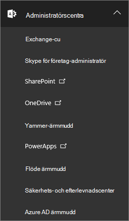
  
4. I Exchange Admin Center klickar du på **behörigheter**och sedan på **Administratörs roller**.In the Exchange admin center, click **Permissions**, and then click **Admin roles**.
    
5. I listvyn väljer du **identifierings hantering**och klickar sedan på **Redigera**  .In the list view, select **Discovery Management**, and then click **Edit**.
    
    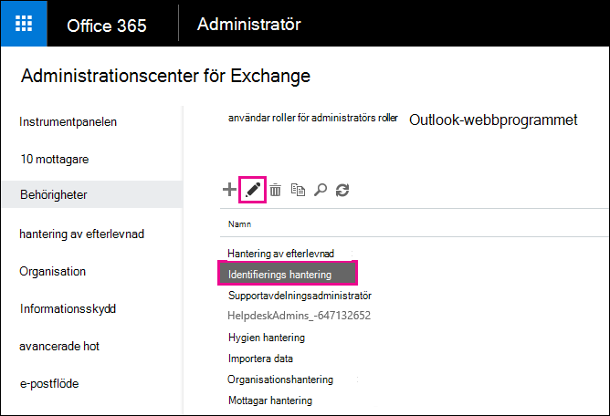
  
6. Klicka på **Lägg**till ikon under **medlemmar**i **roll gruppen**  .In **Role Group**, under **Members**, click **Add**.
    
7. I **Välj medlemmar**väljer du dig själv från listan med namn, klickar på **Lägg till**och sedan på **OK**.In **Select Members**, select yourself from the list of names, click **Add**, and then click **OK**.
    
    > [!NOTE]
    > Du kan också lägga till en grupp som du är medlem i, till exempel organisations hantering eller TenantAdmins.You can also add a group that you are a member of, such as Organization Management or TenantAdmins. Om du lägger till en grupp tilldelas andra medlemmar i gruppen de behörigheter som krävs för att köra eDiscovery-verktyget på plats.If you add a group, other members of the group will be assigned the necessary permissions to run the In-Place eDiscovery tool. 
  
8. Klicka på **Spara**i **roll grupp**.In **Role Group**, click **Save**.
    
9. Logga ut från Microsoft 365.Sign out of Microsoft 365.
    
    Du måste logga ut innan du börjar nästa steg så att den nya behörigheten börjar gälla.You have to sign out before you start the next step so the new permissions will take effect.
    
> [!CAUTION]
> Medlemmar i roll gruppen identifierings hantering kan komma åt känsligt meddelande innehåll.Members of the Discovery Management role group can access sensitive message content. Detta inkluderar sökning i alla post lådor i organisationen, för att förhandsgranska Sök resultaten (och andra objekt i post lådan), kopiera resultatet till en identifierings post låda och exportera Sök resultatet till en PST-fil.This includes searching all mailboxes in your organization, previewing the search results (and other mailbox items), copying the results to a discovery mailbox, and exporting the search results to a PST file. 
  
[Return to topReturn to top](recover-deleted-items-in-a-mailbox.md)
  
## Steg 2: Sök efter borttagna objekt i användarens post lådaStep 2: Search the user's mailbox for deleted items

När du kör en eDiscovery-sökning på plats tas mappen återställnings bara objekt i den post låda som du söker automatiskt med i sökningen.When you run an In-Place eDiscovery search, the Recoverable Items folder in the mailbox that you search is automatically included in the search. Mappen återställnings bara objekt är den plats där permanent borttagna objekt lagras tills de tas bort (permanent borttagna) från post lådan.The Recoverable Items folder is where permanently deleted items are stored until they're purged (permanently removed) from the mailbox. Om ett objekt inte har rensats bör du kunna hitta det med hjälp av eDiscovery-verktyget på plats.So, if an item hasn't been purged, you should be able to find it by using the In-Place eDiscovery tool.
  
1. [Här loggar du in i Microsoft 365 för företag](https://support.microsoft.com/office/where-to-sign-into-microsoft-365-for-business-e9eb7d51-5430-4929-91ab-6157c5a050b4) med ditt arbets-eller skol konto.[Where to sign in to Microsoft 365 for business](https://support.microsoft.com/office/where-to-sign-into-microsoft-365-for-business-e9eb7d51-5430-4929-91ab-6157c5a050b4) with your work or school account. 
    
2. Välj ikonen för Start programmet Start  i det övre vänstra hörnet och klicka på **administratör**.Select the app launcher icon  in the upper-left and click **Admin**.
    
3. I det vänstra navigerings fältet i administrations centret för Microsoft 365 expanderar du **admin**och klickar sedan på **Exchange**.In the left navigation in the Microsoft 365 admin center, expand **Admin**, and then click **Exchange**.
    
4. Klicka på **hantering av efterlevnad**i administrations centret för Exchange, klicka på **i ett eDiscovery- &amp; undantag**och klicka sedan på **ny**ikon för att  .In the Exchange admin center, click **Compliance management**, click **In-Place eDiscovery &amp; Hold**, and then click **New**.
    
    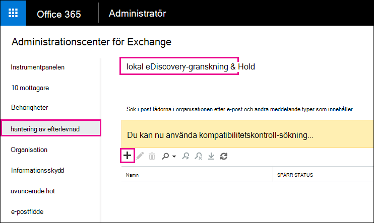
  
5. Skriv ett namn för sökningen (till exempel namnet på den användare som du återställer e-post för) på sidan **namn och beskrivning** och klicka sedan på **Nästa**.On the **Name and description** page, type a name for the search (such as the name of the user you're recovering email for), an optional description, and then click **Next**.
    
6. Klicka på **Ange post lådor att söka efter**på sidan **post lådor** och klicka sedan på **Lägg till**  .On the **Mailboxes** page, click **Specify mailboxes to search**, and then click **Add**.
    
    
  
7. Leta reda på och välj namnet på den användare som du återställer det borttagna e-postmeddelandet för, klicka på **Lägg till**och sedan på **OK**.Find and select the name of the user that you're recovering the deleted email for, click **Add**, and then click **OK**.
    
8. Klicka på **Nästa**.Click **Next**.
    
    Sidan **Sök fråga** visas.The **Search query** page is displayed. Här definierar du Sök villkoren som hjälper dig att hitta de saknade objekten i användarens post låda.This is where you define the search criteria that will help you find the missing items in user's mailbox. 
    
9. Fyll i följande fält på sidan **Sök fråga** :On the **Search query** page, complete the following fields: 
    
  - **Ta med allt innehåll** Välj det här alternativet om du vill inkludera allt innehåll i användarens post låda i Sök resultatet.**Include all content** Select this option to include all content in the user's mailbox in the search results. Om du väljer det här alternativet kan du inte ange fler Sök villkor.If you select this option, you can't specify additional search criteria. 
    
  - **Filter utifrån villkor** Välj det här alternativet om du vill ange Sök villkor, inklusive nyckelord, start-och slutdatum, avsändare och mottagar adresser samt meddelande typer.**Filter based on criteria** Select this option to specify the search criteria, including keywords, start and end dates, sender and recipient addresses, and message types. 
    
    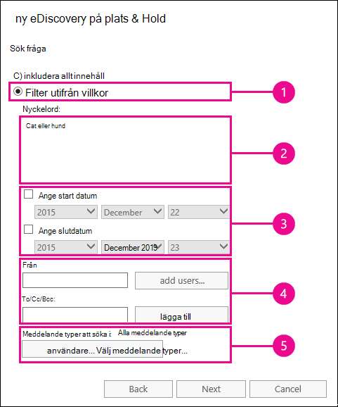
  
|**Fält****Field**|**Använd detta för att...****Use this to...**|
|:-----|:-----|
|             |Ange nyckelord, datum intervall, mottagare och meddelande typer.Specify keywords, date range, recipients, and message types.    |
|             |Sök efter meddelanden med nyckelord eller fraser och Använd logiska operatorer som **och** eller **eller**.Search for messages with keywords or phrases, and use logical operators such as **AND** or **OR**.    |
|             |Sök efter meddelanden som skickats eller tagits emot inom ett datum intervall.Search for messages sent or received within a date range.    |
|             |Sök efter meddelanden som tas emot från eller skickas till vissa personer.Search for messages received from or sent to specific people.    |
|             |Sök efter alla meddelande typer eller Välj specifika.Search for all message types or select specific ones.    |
   
   > [!TIP]
   >  Här är några tips om hur du skapar en Sök fråga för att hitta saknade objekt.Here are a few tips about how to build a search query to find missing items. Försök att få så mycket information från användaren som hjälper dig att skapa en Sök fråga så att du kan hitta det du letar efter.Try to get as much information from the user to help you create a search query so you can find what you're looking for. Om du inte är säker på hur du hittar ett meddelande som saknas kan du använda alternativet **Inkludera allt innehåll** .If you are not sure how to find a missing message, consider using the **Include all content** option. Sök resultatet inkluderar alla objekt i användarens mapp för återställnings bara objekt, inklusive den dolda mappen (kallas mappen rensar) som innehåller objekt som har tömts av användaren.The search results will include all items in the user's Recoverable Items folder, including the hidden folder (called the Purges folder) that contain items that have been purged by the user. Sedan kan du gå till steg 3, kopiera resultatet till en Discovery-postlåda och titta på meddelandet i den dolda mappen.Then you can go to Step 3, copy the results to a discovery mailbox, and look at the message in the hidden folder. Om du vet ungefär när det saknade meddelandet ursprungligen skickades eller togs emot av användaren använder du alternativen **Ange start datum** och **Ange slutdatum** för att ange ett datum intervall.If you know approximately when the missing message was originally sent or received by the user, use the **Specify start date** and **Specify end date** options to provide a date range. Då returneras alla meddelanden som skickas eller tas emot av användaren inom det datum intervallet.This will return all messages sent or received by the user within that date range. Att ange ett datum intervall är ett mycket bra sätt att begränsa Sök resultaten.Specifying a date range is a really good way to narrow the search results. Om du vet vem som har skickat den saknade e-postmeddelandet, Använd rutan **från** för att ange den avsändaren.If you know who sent the missing email, use the **From** box to specify this sender. Om du vill begränsa Sök resultaten till olika typer av post lådor klickar du på **Välj meddelande typer**, klickar på **Välj meddelande typer för att söka**och väljer sedan en specifik meddelande typ att söka efter.If you want to narrow the search results to different types of mailbox items, click **Select message types**, click **Select the message types to search**, and then choose a specific message type to search for. Du kan till exempel bara söka efter Kalender objekt eller kontakter.For example, you can search only for calendar items or contacts. Här är en skärm bild av de olika meddelande typer som du kan söka efter; Standardinställningen är att söka efter alla meddelande typer.Here's a screenshot of the different message types you can search for; the default is to search for all message types. 
  
   Klicka på **Nästa** när du är klar med sidan **Sök fråga** .Click **Next** when you've completed the **Search query** page. 
    
10. På sidan **in-Place Hold-inställningar** klickar du på **Slutför** för att starta sökningen.On the **In-Place Hold settings** page, click **Finish** to start the search. För att återställa borttagna e-postmeddelanden finns det ingen anledning att hålla användarens post låda stoppad.To recover deleted email, there's no reason to place the user's mailbox on hold. 
    
    När du har startat sökningen visar Exchange en uppskattning av den totala storleken och antalet objekt som returneras av sökningen baserat på de kriterier du angett.After you start the search, Exchange will display an estimate of the total size and number of items that will be returned by the search based on the criteria you specified.
    
11. Välj den sökning du just har skapat och klicka på **Uppdatera**  för att uppdatera informationen som visas i informations fönstret.Select the search you just created and click **Refresh** to update the information displayed in the details pane. Statusen för **uppskattningen lyckades** indikerar att sökningen är klar.The status of **Estimate Succeeded** indicates that the search has finished. Dessutom visar Exchange en uppskattning av det totala antalet objekt (och storlek) som hittats i sökningen baserat på Sök villkoren du angav i steg 9.Exchange also displays an estimate of the total number of items (and their size) found by the search based on the search criteria you specified in step 9. 
    
12. Klicka på **Förhandsgranska Sök Resultat** i informations fönstret för att visa de objekt som hittades.In the details pane, click **Preview search results** to view the items that were found. Det här kan hjälpa dig att identifiera de objekt som du letar efter.This might help you identify the item(s) that you're looking for. Om du hittar de objekt du försöker återställa går du till steg 4 för att exportera Sök resultaten till en PST-fil.If you find the item(s) you're trying to recover, go to step 4 to export the search results to a PST file. 
    
    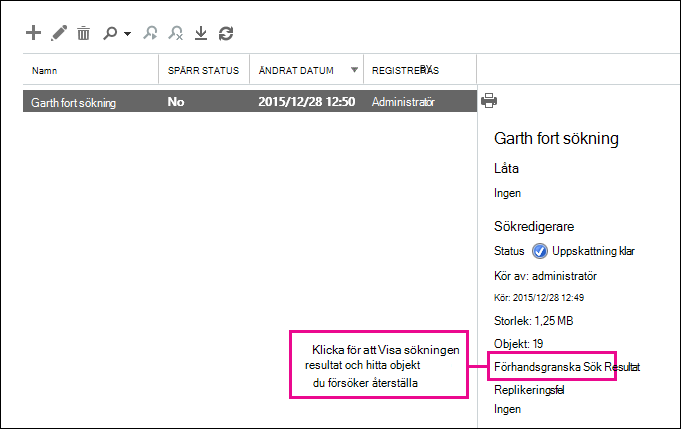
  
13. Om du inte hittar det du letar efter kan du ändra Sök villkoren genom att välja Sök, klicka på **Redigera**  -ikonen och sedan klicka på **Sök fråga**.If you don't find what you're looking for, you can revise your search criteria by selecting the search, clicking **Edit**, and then clicking **Search query**. Ändra Sök villkoren och kör sedan sökningen igen.Change the search criteria and then rerun the search.
    
[Return to topReturn to top](recover-deleted-items-in-a-mailbox.md)
  
## Skriver Steg 3: kopiera Sök resultatet till en identifierings post låda(Optional) Step 3: Copy the search results to a discovery mailbox

Om du inte kan hitta ett objekt genom att förhandsgranska Sök resultaten eller om du vill se vilka objekt som finns i användarens mapp för återställnings bara objekt kan du kopiera Sök resultaten till en särskild post låda (kallas för en identifierings post låda) och sedan öppna den post lådan i Outlook på webben för att visa de faktiska objekten.If you can't find an items by previewing the search results or if you want to see which items are in the user's Recoverable Items folder, then you can copy the search results to a special mailbox (called a discovery mailbox) and then open that mailbox in Outlook on the web to view the actual items. Det bästa skälet till att kopiera Sök resultaten är att visa objekten i användarens mapp för återställnings bara objekt.The best reason to copy the search results is so you can view the items in the user's Recoverable Items folder. Mer än troligt vis finns objektet du försöker återställa finns i undermappen rensar.More than likely, the item you're trying to recover is located in the Purges subfolder. 
  
1. I Exchange Admin Center går du till **hantering** \> \*\*av efterlevnadsprincip på plats &amp; \*\*.In the Exchange admin center, go to **Compliance management** \> **In-Place eDiscovery &amp; Hold**.
    
2. I listan med sökningar väljer du den sökning som du skapade i steg 2.In the list of searches, select the search that you created in Step 2.
    
3. Klicka på **Sök**  och sedan på **Kopiera Sök Resultat** i list rutan.Click **Search**, and then click **Copy search results** from the drop-down list. 
    
    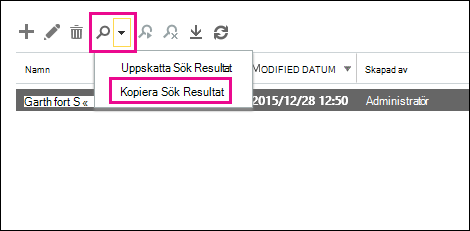
  
4. Klicka på **Bläddra**på sidan **Kopiera Sök Resultat** .On the **Copy Search Results** page, click **Browse**.
    
    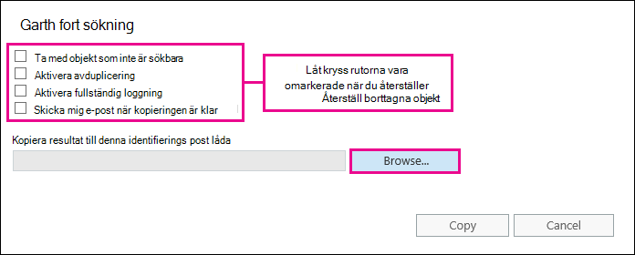
  
5. Klicka på **post låda för identifierings sökning**under **visnings namn**och klicka sedan på **OK**.Under **Display Name**, click **Discovery Search Mailbox**, and then click **OK**.
    
    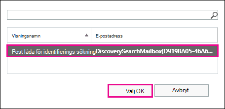
  
    > [!NOTE]
    > Identifierings post lådan är en standard Sök brev låda som skapas automatiskt i din Microsoft 365-organisation.The Discovery Search Mailbox is a default discovery mailbox that is automatically created in your Microsoft 365 organization. 
  
6. Klicka på **Kopiera** på sidan **Kopiera Sök Resultat** för att starta processen för att kopiera Sök resultatet till post lådan för identifierings sökning.Back on the **Copy Search Results** page, click **Copy** to start the process to copy the search results to the Discovery Search Mailbox. 
    
    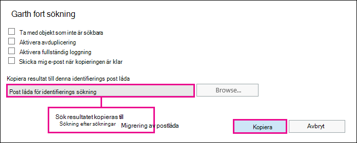
  
7. Klicka på **Uppdatera**  för att uppdatera informationen om den kopierings status som visas i informations fönstret.Click **Refresh** to update the information about the copying status that is displayed in the details pane. 
    
8. När kopieringen är klar klickar du på **Öppna** för att öppna post lådan för identifierings sökning för att Visa Sök resultaten.When the copying is complete, click **Open** to open the Discovery Search Mailbox to view the search results. 
    
    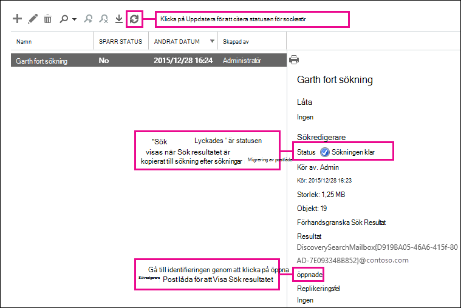
  
    Sök resultatet som kopierats till post lådan för identifierings sökning placeras i en mapp som har samma namn som den eDiscovery-sökning som finns på plats.The search results copied to the Discovery Search Mailbox are placed in a folder that has the same name as the In-Place eDiscovery search. Du kan klicka på en mapp för att visa objekten i den mappen.You can click a folder to display the items in that folder.
    
    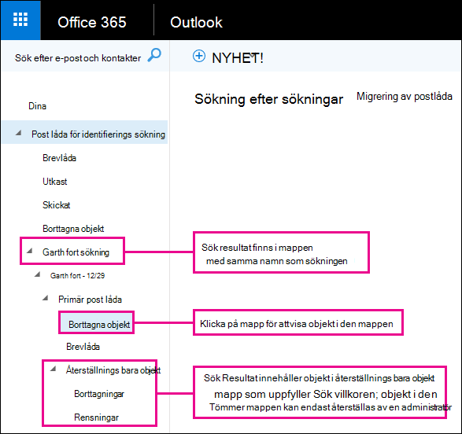
  
    När du kör en sökning genomsöks också användarens mapp för återställnings bara objekt.When you run a search, the user's Recoverable Items folder is also searched. Det innebär att om objekt i mappen för att återställa objekt motsvarar Sök villkoren inkluderas de i Sök resultaten.That means if items in the Recoverable Items folder meet the search criteria, they are included in the search results. Objekt i mappen borttagningar är objekt som användaren permanent tar bort (genom att ta bort ett objekt från mappen Borttaget eller genom att klicka på **SKIFT + DELETE**.Items in the Deletions folder are items that the user permanently deleted (by deleting an item from the Deleted Items folder or by selecting it and pressing **Shift+Delete**. En användare kan använda verktyget Återställ borttagna objekt i Outlook eller Outlook på webben för att återskapa objekt i mappen Borttaget.A user can use the Recover Deleted Items tool in Outlook or Outlook on the web to recover items in the Deletions folder. Objekt i mappen rensar är objekt som användaren har rensat med verktyget Återställ borttagna objekt eller objekt som de rensades automatiskt av en princip som lagts till i post lådan.Items in the Purges folder are items that the user purged by using the Recover Deleted Items tool or items they were automatically purged by a policy applied to the mailbox. I båda fallen kan bara administratörer återskapa objekt i mappen rensningar.In either case, only an admin can recover items in the Purges folder. 
    
    > [!TIP]
    > Om en användare inte kan hitta ett borttaget objekt med hjälp av verktyget återställnings bara objekt, men objektet är fortfarande återställbart (vilket innebär att det inte har tagits bort permanent från post lådan) är det mer än troligt i mappen rensningar.If a user can't find a deleted item using the Recoverable Items tool, but that item is still recoverable (meaning that it hasn't been permanently removed from the mailbox), it's more than likely located in the Purges folder. Se till att du letar i mappen rensningar för det borttagna objekt som du försöker återställa för en användare.So, be sure to look in the Purges folder for the deleted item you're trying to recover for a user. 
  
[Return to topReturn to top](recover-deleted-items-in-a-mailbox.md)
  
## Steg 4: exportera Sök resultatet till en PST-filStep 4: Export the search results to a PST file

När du hittar objektet du försöker återställa för en användare är nästa steg att exportera resultaten från den sökning du körde i steg 2 till en PST-fil.After you find the item you're trying to recover for a user, the next step is to export the results from the search you ran in Step 2 to a PST file. Användaren kommer att använda den här PST-filen i nästa steg för att återställa det borttagna objektet till post lådan.The user will use this PST file in the next step to restore the deleted item to their mailbox.
  
1. I Exchange Admin Center går du till **hantering** \> \*\*av efterlevnadsprincip på plats &amp; \*\*.In the Exchange admin center, go to **Compliance management** \> **In-Place eDiscovery &amp; Hold**.
    
2. I listan med sökningar väljer du den sökning som du skapade i steg 2.In the list of searches, select the search that you created in Step 2.
    
3. Klicka på **Exportera till en PST-fil**.Click **Export to a PST file**.
    
    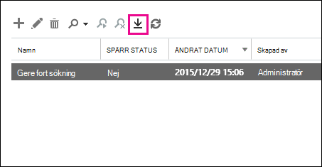
  
4. Om du uppmanas att installera verktyget för eDiscovery-export klickar du på **Kör**.If you're prompted to install the eDiscovery Export Tool, click **Run**.
    
5. I export verktyget för det här eDiscovery-programmet klickar du på **Bläddra** och anger den plats där du vill ladda ned PST-filen.In the eDiscovery PST Export Tool, click **Browse** to specify the location where you want to download the PST file. 
    
    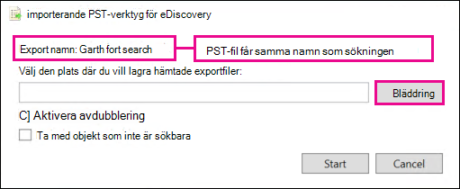
  
    Du kan ignorera alternativen för att aktivera avduplicering och ta med sökbara objekt.You can ignore the options to enable deduplication and include unsearchable items.
    
6. Klicka på **Start** för att ladda ned PST-filen till datorn.Click **Start** to download the PST file to your computer. 
    
    I import **verktyget för eDiscovery-PST** visas statusinformation om exporten.The **eDiscovery PST Export Tool** displays status information about the export process. När exporten är klar kan du komma åt filen på den plats där den laddades ned.When the export is complete, you can access the file in the location where it was downloaded. 
    
[Return to topReturn to top](recover-deleted-items-in-a-mailbox.md)
  
## Steg 5: återställa återställda objekt till användarens post lådaStep 5: Restore the recovered items to the user's mailbox

Det sista steget är att använda PST-filen som exporterades i steg 4 för att återställa de återställda objekten till användarens post låda.The final step is to use the PST file that was exported in step 4 to restore the recovered items to the user's mailbox. När du har skickat PST-filen till användaren utförs resten av det här steget av användaren för att öppna PST-filen och sedan flytta de återställda objekten till en annan mapp i post lådan.After you send the PST file to the user, the remainder of this step is performed by the user to open the PST file and then move the recovered items to another folder in their mailbox. Stegvisa anvisningar kan du också skicka en länk till det här avsnittet: [öppna och Stäng Outlook-datafiler (. pst)](https://support.office.com/article/381b776d-7511-45a0-953a-0935c79d24f2).For step-by-step instructions, you can also send the user a link to this topic: [Open and close Outlook Data Files (.pst)](https://support.office.com/article/381b776d-7511-45a0-953a-0935c79d24f2). Eller så kan du skicka en länk till användaren [Återställ borttagna objekt till en post låda med hjälp av en PST-fil](recover-deleted-items-in-a-mailbox.md#restoredeleteditems) nedan och be dem att utföra de här stegen.Or you can send the user a link to the [Restore deleted items to a mailbox using a PST file](recover-deleted-items-in-a-mailbox.md#restoredeleteditems) section below and ask them to perform these steps. 
  
 **Skicka PST-filen till användaren****Send the PST file to the user**
  
Det sista steget som du måste utföra när du skickar PST-filen som exporterades i steg 4 till användaren.The final step that you need to perform is sending the PST file that was exported in step 4 to the user. Det finns några olika sätt att göra detta:There are a few ways to do this:
  
- Bifoga PST-filen i ett e-postmeddelande.Attach the PST file to an email message. Om Outlook är konfigurerat för att blockera PST-filer måste du zippa filen och sedan bifoga den i meddelandet.If Outlook is configured to block PST files, then you will have to zip the file and then attach it to the message. Så här gör du:Here's how:
    
1. Bläddra till PST-filen i Utforskaren i Windows.In Windows Explorer or File Explorer, browse to the PST file.
    
2. Högerklicka på filen och välj sedan **Skicka till** \> **komprimerad mapp**.Right-click the file, and then select **Send to** \> **Compressed (zipped) folder**. Windows skapar en ny zip-fil och ger den ett identiskt namn som PST-fil.Windows creates a new zip file and gives it an identical name as the PST file.
    
3. Bifoga den komprimerade PST-filen i ett e-postmeddelande och skicka den till användaren, som sedan kan expandera filen genom att klicka på den.Attach the compressed PST file to an email message and send it to the user, who can then decompress the file just by clicking it.
    
- Kopiera PST-filen till en delad mapp som användaren kan komma åt och hämta.Copy the PST file to a shared folder that the user can access and retrieve it.
    
Stegen i nästa avsnitt utförs av användaren för att återställa borttagna objekt till post lådan.The steps in the next section are performed by the user to restore the deleted items to their mailbox.
  
 
**Återställa borttagna objekt till en post låda med hjälp av en PST-fil****Restore deleted items to a mailbox using a PST file**
  
Du måste använda Outlook-programmet för att återställa ett borttaget objekt med hjälp av en PST-fil.You have to use the Outlook desktop app to restore a deleted item by using a PST file. Du kan inte använda Outlook Web App eller Outlook på webben för att öppna en PST-fil.You can't use Outlook Web App or Outlook on the web to open a PST file.
  
1. Klicka på fliken **Arkiv** i Outlook 2013 eller Outlook 2016.In Outlook 2013 or Outlook 2016, click the **File** tab. 
    
2. Klicka på **Öppna &amp; export**och sedan på **Öppna Outlook-datafil**.Click **Open &amp; Export**, and then click **Open Outlook Data File**.
    
3. Bläddra till den plats där du sparade PST-filen som administratören skickade.Browse to the location where you saved the PST file that your administrator sent.
    
4. Markera PST-filen och klicka på **Öppna**.Select the PST and then click **Open**.
    
    PST-filen visas i det vänstra navigerings fältet i Outlook.The PST file appears in the left-nav bar in Outlook.
    
    
  
5. Klicka på pilarna för att expandera PST-filen och mapparna under den för att hitta det objekt du vill återställa.Click the arrows to expand the PST file and the folders under it to locate the item you want to recover.
    
    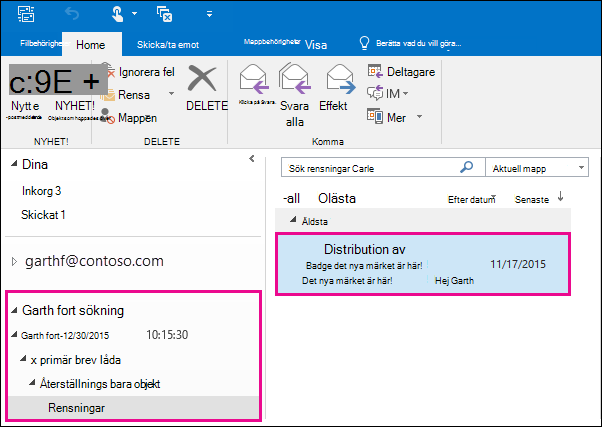
  
    > [!TIP]
    > Leta i mappen rensningar för det objekt du vill återställa.Look in the Purges folder for the item you want to recover. Det här är en dold mapp där borttagna objekt flyttas till.This is a hidden folder that purged items are moved to. Det objekt som administratören har återskapat finns i den här mappen.It's likely the item that your administrator recovered is in this folder. 
  
6. Högerklicka på objektet som du vill återställa och klicka sedan på **Flytta** \> **andra mappen**.Right-click the item you want to recover and then click **Move** \> **Other Folder**.
    
    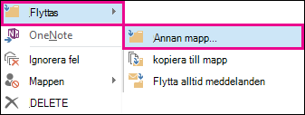
  
7. Om du vill flytta objektet till Inkorgen klickar du på **Inkorgen**och sedan på **OK**.To move the item to your inbox, click **Inbox**, and then click **OK**.
    
    **Tips:** Gör något av följande om du vill återställa andra typer av objekt:**Tip:** To recover other types of items, do one of the following: 
    
  - Om du vill återställa ett Kalender objekt högerklickar du på det och klickar sedan på **Flytta** \> **annan** \> **kalendermapp**.To recover a calendar item, right-click it, and then click **Move** \> **Other Folder** \> **Calendar**.
    
  - Om du vill återställa en kontakt högerklickar du på den och klickar sedan på **Flytta** \> **andra** \> **kontakter**.To recover a contact, right-click it, and then click **Move** \> **Other Folder** \> **Contacts**.
    
  - Om du vill återställa en uppgift högerklickar du på den och klickar sedan på **Flytta** \> **andra mappaktiviteter** \> **Tasks**.To recover a task, right-click it, and then click **Move** \> **Other Folder** \> **Tasks**.
    
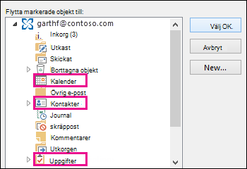
  
   > [!NOTE]
   > Kalender objekt, kontakter och uppgifter placeras direkt i mappen rensa och inte i en mapp för kalender, kontakter eller uppgifter.Calendar items, contacts, and tasks are located directly in the Purges folder, and not in a Calendar, Contacts, or Tasks subfolder. Du kan sortera efter **typ** för att gruppera liknande typer av objekt.However, you can sort by **Type** to group similar types of items. 
    
8. När du är klar med att återställa borttagna objekt högerklickar du på PST-filen i det vänstra navigerings fältet och väljer **Stäng "namn på PST-fil"**.When you're finished recovering deleted items, right-click the PST file in the left-nav bar and select **Close "name of PST file"**.
    
[Return to topReturn to top](recover-deleted-items-in-a-mailbox.md)
  
## Mer informationMore information

- Det kan vara möjligt för en användare att återställa ett permanent borttaget objekt om objektets lagrings period för borttagna artiklar inte har gått ut.It might be possible for a user to recover a permanently deleted item if the deleted item retention period for the item hasn't expired. Som administratör kan du ha angett hur länge objekt i mappen för återställnings bara objekt är tillgängliga för återställning.As an admin you may have specified how long items in the Recoverable Items folder are available for recovery. Det kan till exempel finnas en policy som tar bort allt som finns i en användares borttagna objekt-mappen i 30 dagar, och en annan princip som gör att användare kan återskapa objekt i mappen för återställnings bara objekt i upp till en annan 14 dagar.For example, there might be a policy that deletes anything that's been in a user's Deleted Items folder for 30 days, and another policy that lets users recover items in the Recoverable Items folder for up to another 14 days. Men efter den här 14 dagarna kan du fortfarande kunna återskapa ett objekt i en användares post låda genom att följa procedurerna i det här avsnittet.However, after this 14 days, you may still be able to recover an item in a user's mailbox by using the procedures in this topic.
    
- Användare kan återställa ett borttaget objekt om det inte har tagits bort och om den lagrings tid för borttaget objekt inte har gått ut.Users can recover a deleted item if it hasn't been purged and if the deleted item retention period for that item hasn't expired. Om du vill hjälpa användare att återställa borttagna objekt i post lådan pekar du på något av följande avsnitt:To help users recover deleted items in their mailbox, point them to one of the following topics:
    
  - [Återskapa borttagna objekt i Outlook för WindowsRecover deleted items in Outlook for Windows](https://support.office.com/article/49e81f3c-c8f4-4426-a0b9-c0fd751d48ce)
    
  - [Återskapa borttagna objekt i Outlook 2010Recover deleted items in Outlook 2010](https://support.office.com/article/cd9dfe12-8e8c-4a21-bbbf-4bd103a3f1fe)
    
  - [Återskapa borttagna objekt eller e-post i Outlook Web AppRecover deleted items or email in Outlook Web App](https://support.office.com/article/c3d8fc15-eeef-4f1c-81df-e27964b7edd4)
    
  - [Återställa borttagna e-postmeddelanden i Outlook på webbenRestore deleted email messages in Outlook on the web](https://support.office.com/article/a8ca78ac-4721-4066-95dd-571842e9fb11)
    
  - [Återställa en borttagen kontakt i OutlookRecover a deleted contact in Outlook](https://support.office.com/article/51c83288-6888-4dcd-8c99-4932daabf643)
    
  - [Återställa borttagna e-postmeddelanden i Outlook.comRestore deleted email messages in Outlook.com](https://go.microsoft.com/fwlink/p/?LinkID=623435)
    
[Return to topReturn to top](recover-deleted-items-in-a-mailbox.md)
  

