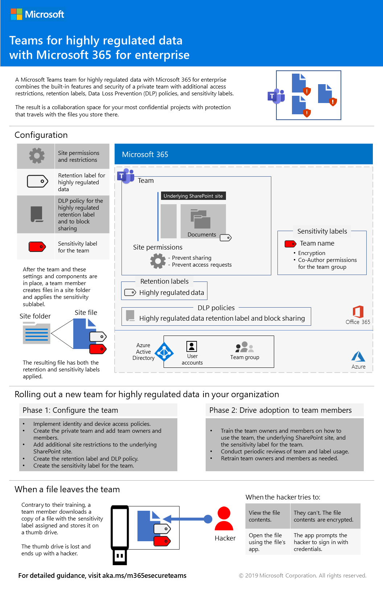
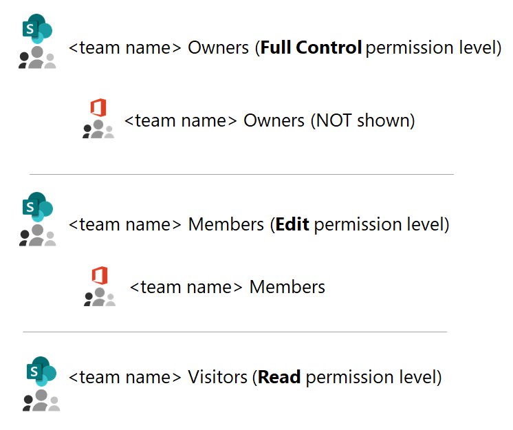
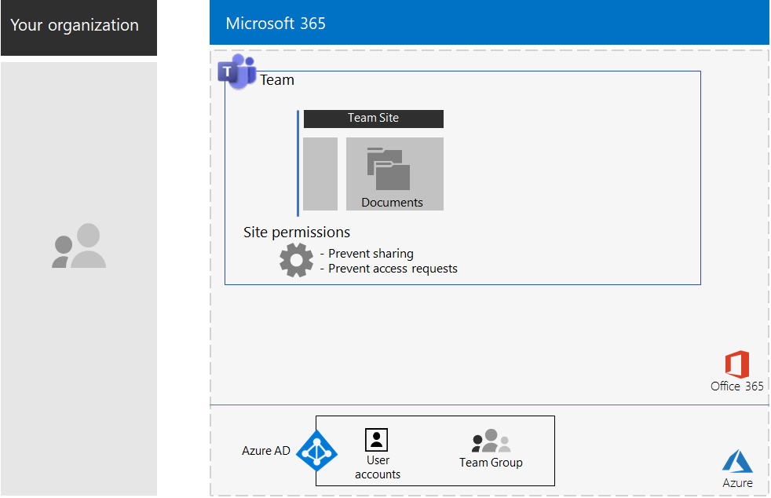
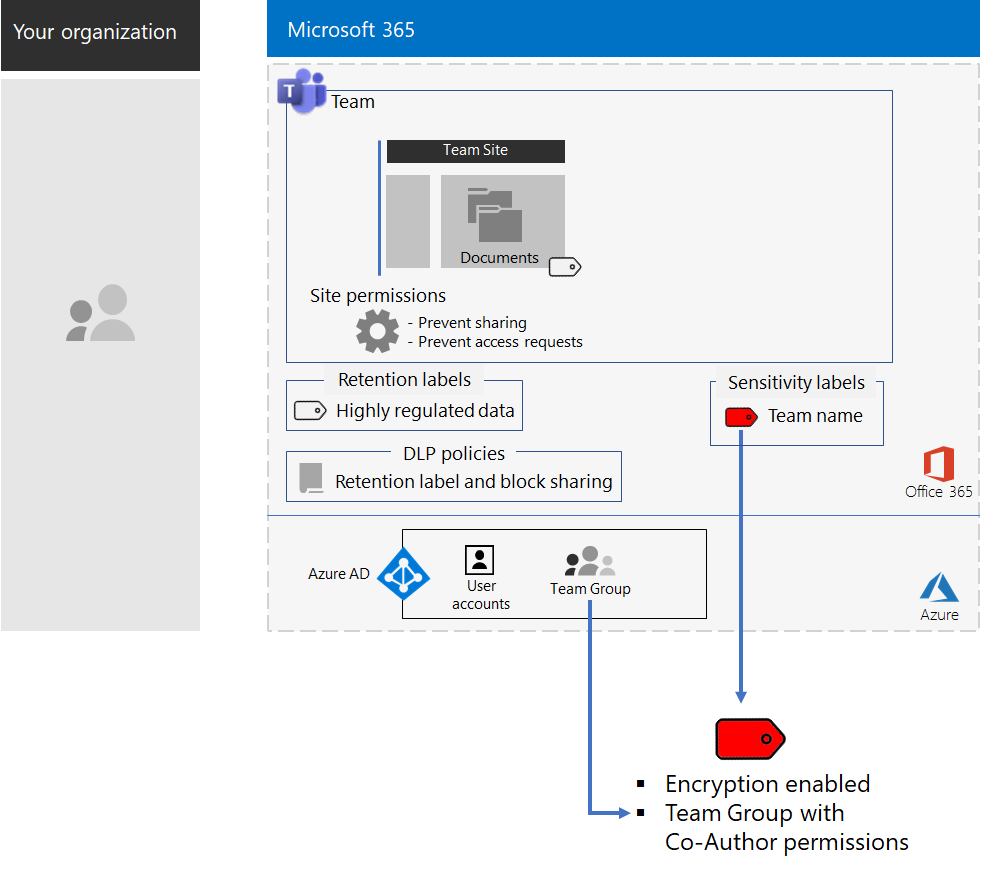

# Teams för strikt reglerade data

I den här artikeln får du rekommendationer och anvisningar om hur du konfigurerar ett privat team i Microsoft Teams som låser åtkomsten till Teams-funktioner – till exempel chattar, möten och filer – till endast medlemmar och ägare av Office 365-gruppen för teamet. 

Utöver den privata åtkomst som baseras på 365-gruppen beskrivs i artikeln hur du konfigurerar den underliggande privata SharePoint-gruppwebbplatsen, som du når via avsnittet **Filer** i en teamkanal, så att du får den extra säkerhet som krävs för lagring av strikt reglerade data. På den här SharePoint-gruppwebbplatsen kan du lagra och jobba tillsammans med filer, sidor, en delad kalender, uppgifter, en anteckningsbok och listor.

>[!Note]
> Ett liknande scenario med SharePoint finns [här](teams-sharepoint-online-sites-highly-regulated-data.md).
>

De olika elementen för konfigurationen av strikt reglerade data för ett team är:

- Ett privat team med en motsvarande Office 365-grupp som har en ägare och medlemsanvändarkonton.
- Ytterligare säkerhet på den underliggande SharePoint-webbplatsen för teamet som:
  - hindrar medlemmar av webbplatsen att ge åtkomst till andra,
  - hindrar icke-medlemmar av webbplatsen att begära åtkomst till webbplatsen.
- En Office 365-kvarhållningsetikett för den underliggande SharePoint-webbplatsen som automatiskt tillämpas på nya filer på webbplatsen som standardmetod för att definiera kvarhållningsprinciper.
- En DLP-princip (princip för dataförlustskydd) som använder kvarhållningsetiketten och blockerar användare från att dela eller skicka filer utanför organisationen.
- En Office 365-känslighetsetikett eller en underetikett för en strikt reglerade-etikett som har kryptering aktiverat och samredigeringsbehörighet för teamets Office 365-grupp. Användare tillämpar etiketten eller underetiketten som lagras avsnittet **Filer** för teamet via menyfältsalternativet **Känslighet** i Word, Excel och PowerPoint.

Här är den resulterande konfigurationen med en känslighetsetikett.

Titta på den här korta videon så får du en snabb översikt.

> [!VIDEO https://www.microsoft.com/videoplayer/embed/RE4mGHf]

 En sammanfattning på en sida finns på [affischen Teams för strikt reglerade data](../media/secure-teams-highly-regulated-data-scenario/TeamsHighlyRegulatedData.pdf).

Du kan också ladda ned den här affischen i [PDF](https://github.com/MicrosoftDocs/microsoft-365-docs/raw/public/microsoft-365/enterprise/media/secure-teams-highly-regulated-data-scenario/TeamsHighlyRegulatedData.pdf)- eller [PowerPoint](https://github.com/MicrosoftDocs/microsoft-365-docs/raw/public/microsoft-365/enterprise/media/secure-teams-highly-regulated-data-scenario/Teams-Highly-Regulated-Data-Poster.pptx)-format och skriva ut den i pappersstorleken letter, legal eller tabloid (11 x 17).

## Fas 1: Konfigurera ett team för strikt reglerade data

Konfigurationen från slutpunkt till slutpunkt består av följande steg:

1. Konfigurera identitet och enhetsåtkomst.
2. Skapa ett privat team.
3. Konfigurera den underliggande SharePoint-webbplatsen för ytterligare säkerhet.
4. Skapa en kvarhållningsetikett och DLP-princip.
5. Skapa etiketten eller underetiketten för strikt reglerade-etiketten.

### Steg 1: Konfigurera identitet och enhetsåtkomst

För att skydda åtkomsten till teamet och dess underliggande SharePoint-webbplats ska du se till att du har konfigurerat [principer för identitet och enhetsåtkomst](https://docs.microsoft.com/microsoft-365/enterprise/identity-access-policies) och de rekommenderade [principerna för SharePoint Online-åtkomst](https://docs.microsoft.com/microsoft-365/enterprise/sharepoint-file-access-policies).

### Steg 2: Skapa ett privat team

Skapa ett privat team med hjälp av [de här instruktionerna](https://support.office.com/article/create-a-team-from-scratch-174adf5f-846b-4780-b765-de1a0a737e2b).

När du skapar ett privat team finns följande standardbehörigheter:

- Office 365-gruppen för teamet (teamgruppen) har gruppägare och gruppmedlemmar.
- För den underliggande SharePoint-webbplatsen (gruppwebbplatsen):
  - Administratörerna för webbplatssamlingar konfigureras för teamgruppens ägare
  - För gruppwebbplatsen: 
    - SharePoint-gruppen Gruppwebbplatsägare – med behörighetsnivån Fullständig kontroll – ställs in på teamgruppens ägare
    - SharePoint-gruppen Gruppwebbplatsmedlemmar – med behörighetsnivån Redigera – ställs in på teamgruppens medlemmar
    - SharePoint-gruppen Gruppwebbplatsbesökare – med behörighetsnivån Läsa – har inga grupper eller användarkonton

Här är standardbehörigheterna för gruppwebbplatsen.

 
>[!Note]
>Om du visar SharePoint-gruppen för ägare, \<teamets namn> för behörighetsnivån Redigera visas inte Ägare för \<teamets namn>.
>

De resulterande behörigheterna tillåter följande:

- Teamgruppens ägare kan administrera webbplatsen och har fullständig kontroll över webbplatsens innehåll.
- Teamgruppens medlemmar kan skapa och redigera filer på webbplatsen. 

Underhåll av behörigheter är samma som teammedlems- och ägarunderhåll.

Här är konfigurationsresultatet hittills.

 
### Steg 3: Konfigurera den underliggande SharePoint-webbplatsen för ytterligare säkerhet

Konfigurera de här behörighetsinställningarna på gruppwebbplatsen.

1. Klicka i verktygsfältet på inställningsikonen och klicka sedan på **Webbplatsbehörigheter**.
2. I fönstret **Webbplatsbehörigheter** under **Delningsinställningar** klickar du på **Ändra delningsinställningar**.
3. Under **Delningsbehörigheter** väljer du **Endast webbplatsägare kan dela filer, mappar och webbplats**.
4. Inaktivera **Tillåt åtkomstbegäranden** och klicka sedan på **Spara**.

Med de här inställningarna inaktiveras funktionen för teamgruppens medlemmar att dela gruppwebbplatsen med andra medlemmar eller för icke-medlemmar att begära åtkomst till gruppwebbplatsen.

Här är konfigurationsresultatet hittills.

 
### Steg 4: Skapa en kvarhållningsetikett och DLP-princip

Med [de här instruktionerna](https://docs.microsoft.com/microsoft-365/security/office-365-security/deploy-teams-retention-dlp) gör du följande:

1. Skapar och publicerar en kvarhållningsetikett för strikt reglerade data (om det behövs).
2. Konfigurerar gruppwebbplatsen för kvarhållningsetiketten som skapats i steg 1.
3. Skapar en DLP-princip för strikt reglerade data som använder kvarhållningsetiketten som skapats i steg 2 och hindrar användare att skicka filer utanför organisationen. Du kan också konfigurera principen för fler behov, till exempel för bestämmelser i hälsovårds- och finansbranschen, utifrån [DLP-principmallar](https://docs.microsoft.com/microsoft-365/compliance/data-loss-prevention-policies#dlp-policy-templates).

Här är konfigurationsresultatet hittills.

 
### Step 5: Skapa en känslighetsetikett eller en underetiketten för känslighetsetiketten för strikt reglerade data

Till skillnad från en känslighetsetikett för strikt reglerade data som alla kan tillämpa på valfri fil behöver ett säkert team en egen etikett eller underetikett så att tilldelade filer:

- krypteras och krypteringen följer med filen,
- innehåller anpassade behörigheter så att bara medlemmar i teamgruppen kan öppna den.

För att åstadkomma den här extra säkerhetsnivån på gruppwebbplatsen måste du konfigurera en känslighetsetikett som antingen är en egen etikett eller en underetikett för den allmänna etiketten för strikt reglerade filer. Det är bara teamgruppens medlemmar som ser den i deras lista med etiketter.

Använd en känslighetsetikett när du behöver ett litet antal etiketter får både global användning och enskilda privata team. Använd en underetikett för känslighet när du har ett stort antal etiketter eller vill ordna etiketter för privata team under strikt reglerade-etiketten.

[Använd de här instruktionerna](https://docs.microsoft.com/microsoft-365/compliance/encryption-sensitivity-labels) till att konfigurera en separat etikett eller en underetikett med följande inställningar:

- Namnet på etiketten innehåller teamets namn
- Kryptering är aktiverat
- Teamgruppen har samredigheringsbehörighet

Här är konfigurationsresultatet med den nya etiketten.

Här är relationen mellan känslighetsetiketten och teamgruppen.

>[!Note]
>Om du konfigurerar känslighetsetiketten eller underetiketten för användardefinierade behörigheter eller med ett utgångsdatum kan du inte öppna filen i Teams eller SharePoint. Du måste använda en Office-app.
>

### Anpassade behörigheter

Du kan även konfigurera anpassade SharePoint-webbplatsbehörigheter för gruppwebbplatsen och, om det behövs, dess motsvarande känslighetsetikett. Här är två exempel:

#### Exempel 1: Delegera SharePoint-webbplatsens administration

Om teamägaren inte har erfarenhet av SharePoint-administration eller vill delegera administrationen av gruppwebbplatsen kan ägaren lägga till användarkontot för en SharePoint-administrator i listan över teamägare. Men då skulle SharePoint-administratören har fullständig åtkomst till teamet och alla dess resurser och skulle kunna öppna en fil med känslighetsetiketten tillämpad. 

För att förhindra den här övertilldelningen av behörigheter lägger du till användarkontot för SharePoint-administratören i SharePoint-gruppen Gruppwebbplatsägare i webbplatsens avancerade behörighetsinställningar. SharePoint-administratören kan administrera webbplatsen men kan inte komma åt teamet och några av dess resurser eller öppna filerna med den tilldelade känslighetsetiketten.

#### Exempel 2: Tillåta åtkomst med endast visning av etiketterade filer

Om vissa i personalen behöver se innehållet i etiketterade filer i gruppwebbplatsen lägger du till deras egna användarkonton i:

- SharePoint-gruppen Besökare av \<teamets namn>, vars standardinställning är läsbehörighet. 
- Känslighetsetiketten med behörigheten Läsare.

Här är behörighetsresultatet för etiketten.

 
Webbplatsbesökarna kommer åt gruppwebbplatsen direkt och kan visa innehållet som har underetiketten. Men eftersom de inte är medlemmar i teamgruppen kan de inte komma åt teamet eller dess resurser.

## Fas 2: Driva på teammedlemmarnas användning

Med teamet på plats är det dags att driva på teamets användning och den extra säkerheten för teammedlemmar.

### Steg 1: Utbilda dina användare

Medlemmar i teamgruppen kan komma åt teamet och alla dess resurser, inklusive chattar, möten och andra appar. När du arbetar med filer i avsnittet **Filer** i en kanal måste medlemmarna i teamgruppen tilldela känslighetsetiketten eller underetiketten till filer som skapats för det säkra teamet. Här följer ett exempel.

 
När etiketten tillämpas på filen så skyddas den. Medlemmar i teamgruppen kan öppna den i Teams och samarbeta i realtid. Den är krypterad och innehåller behörigheter för samredigering som angetts för teamgruppens medlemmar. Om filen lämnar webbplatsen och vidarebefordras till en illvillig användare måste användaren ange autentiseringsuppgifterna för ett användarkonto som är medlem i teamgruppen för att öppna filen och visa innehållet. 

Utbilda dina teammedlemmar i följande:

- Om vikten av att använda det nya teamet för chattar, möten, filer och andra resurser för gruppwebbplatsen och konsekvenserna av en läcka av strikt reglerade data, till exempel juridiska aspekter, tillsynsböter, utpressningstrojaner eller förlust av konkurrensfördelar.
- Hur du får åtkomst till teamet.
- Hur du skapar nya filer på webbplatsen och laddar upp nya filer som lagras lokalt.
- Hur DLP-principen förhindrar dem att dela filer externt.
- Hur du etiketterar filer med den anpassade etiketten eller underetiketten för teamet.
- Hur etiketten eller underetiketten skyddar filer även när de läcker från webbplatsen.

I den här utbildningen ska det ingå praktiska övningar så att teamets medlemmar kan uppleva funktionerna och deras resultat.

### Steg 2: Utföra regelbundna granskningar av användning och hantera feedback för teammedlemmar

I veckorna efter utbildningen:

- Snabbt hantera feedback för teammedlemmar och finjustera principer och konfigurationer.
- Analysera användningen av teamet och jämföra den med förväntningarna på användningen.
- Kontrollera att strikt reglerade filer har etiketterats korrekt med den anpassade känslighetsetiketten eller underetiketten.

  Du kan se vilka filer som har tilldelats genom att visa en mapp i SharePoint och lägga till kolumnen **Känslighet** genom alternativet **Visa/dölj kolumner** i **Lägg till kolumn**.

Utbilda dina användare efter behov.

## Visa det här i en testmiljö

Om du vill skapa en egen testmiljö för att testa teamens känslighet och mycket konfidentiella filer läser du [de här instruktionerna](https://docs.microsoft.com/microsoft-365/security/office-365-security/secure-team-for-files-in-a-dev-test-environment). 

## Hur Contoso Corporation använde ett säkert team för ett topphemligt projekt

Contoso Corporation är ett fiktivt men representativt globalt tillverkningskonglomerat. Se hur Contoso konfigurerade och arbetade på införandet av ett [säkert team](contoso-team-for-top-secret-project.md) för ett topphemligt projekt för att utveckla och marknadsföra nya produkter och tjänster. 

## Se även

[SharePoint-webbplatser för strikt reglerade data](teams-sharepoint-online-sites-highly-regulated-data.md)

[Arbetsbelastningar och scenarier i Microsoft 365 Enterprise](deploy-workloads.md)

[Produktivitetsbiblioteket för Microsoft 365](https://aka.ms/productivitylibrary) (https://aka.ms/productivitylibrary)

[Distributionsguide](deploy-microsoft-365-enterprise.md)
