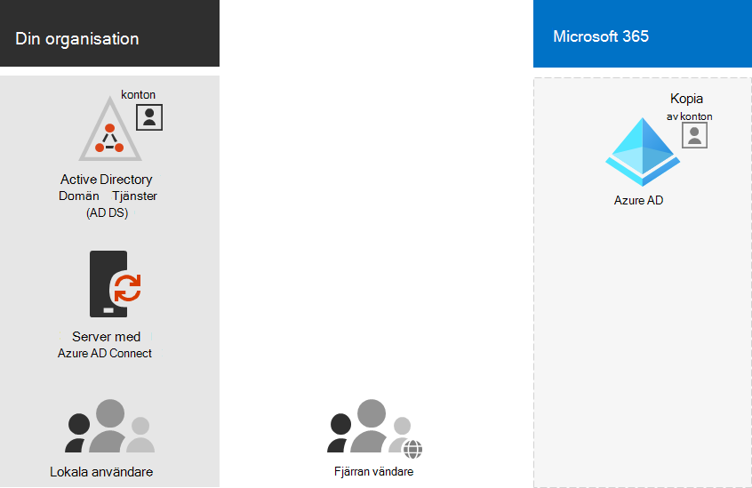

# Konfigurera katalogsynkronisering för Microsoft 365Set up directory synchronization for Microsoft 365

*Denna artikel gäller för både Microsoft 365 Enterprise och Office 365 Enterprise.**This article applies to both Microsoft 365 Enterprise and Office 365 Enterprise.*

Microsoft 365 använder en Azure Active Directory -klientorganisation (Azure AD) för att lagra och hantera identiteter för autentisering och behörigheter för åtkomst till molnbaserade resurser.Microsoft 365 uses an Azure Active Directory (Azure AD) tenant to store and manage identities for authentication and permissions to access cloud-based resources. 

Om du har en lokal AD DS-domän (Active Directory Domain Services) eller skog kan du synkronisera dina AD DS-användarkonton, grupper och kontakter med Azure AD-klientorganisationen för Microsoft 365-prenumerationen.If you have an on-premises Active Directory Domain Services (AD DS) domain or forest, you can synchronize your AD DS user accounts, groups, and contacts with the Azure AD tenant of your Microsoft 365 subscription. Det här är hybrididentitet för Microsoft 365.This is hybrid identity for Microsoft 365. Här är dess komponenter.Here are its components.

Azure AD Anslut på en lokal server och synkroniserar din AD DS med Azure AD-klientorganisationen.Azure AD Connect runs on an on-premises server and synchronizes your AD DS with the Azure AD tenant. Tillsammans med katalogsynkronisering kan du också ange följande autentiseringsalternativ:Along with directory synchronization, you can also specify these authentication options:

- Synkronisering av lösenordshashar (PHS)Password hash synchronization (PHS)

  Azure AD utför själva autentiseringen.Azure AD performs the authentication itself.

- Direktautentisering (PTA)Pass-through authentication (PTA)

  Azure AD har AD DS som utför autentiseringen.Azure AD has AD DS perform the authentication.

- Federerad autentiseringFederated authentication

  Azure AD refererar klientdatorn och begär autentisering till en annan identitetsleverantör.Azure AD refers the client computer requesting authentication to another identity provider.

Mer information [finns i Hybrididentiteter.](plan-for-directory-synchronization.md)See [Hybrid identities](plan-for-directory-synchronization.md) for more information.
  
## 1. Granska kraven för Azure AD Anslut1. Review prerequisites for Azure AD Connect

Du får en kostnadsfri Azure AD-prenumeration med din Microsoft 365 prenumeration.You get a free Azure AD subscription with your Microsoft 365 subscription. När du installerar katalogsynkronisering installerar du Azure AD Anslut på någon av dina lokala servrar.When you set up directory synchronization, you will install Azure AD Connect on one of your on-premises servers.
  
För Microsoft 365 behöver du:For Microsoft 365 you'll need to:
  
- Verifiera din lokala domän.Verify your on-premises domain. Guiden för Azure AD Anslut vägleder dig genom detta.The Azure AD Connect wizard guides you through this.
- Hämta användarnamn och lösenord för administratörskontona i din klientorganisation Microsoft 365 AD DS.Obtain the user names and passwords for the admin accounts of your Microsoft 365 tenant and AD DS.

För den lokala server där du installerar Azure AD Anslut behöver du:For your on-premises server on which you install Azure AD Connect, you'll need:
  
|**Serveroperativsystem****Server OS**|**Annan programvara****Other software**|
|:-----|:-----|
|Windows Server 2012 R2 och senareWindows Server 2012 R2 and later | - PowerShell installeras som standard, ingen åtgärd krävs.- PowerShell is installed by default, no action is required.    - Net 4.5.1 och senare versioner erbjuds via Windows Update.- Net 4.5.1 and later releases are offered through Windows Update. Kontrollera att du har installerat de senaste uppdateringarna Windows server i Kontrollpanelen.Make sure you have installed the latest updates to Windows Server in the Control Panel. |
|Windows Server 2008 R2 med Service Pack 1 (SP1)\*\* eller Windows Server 2012Windows Server 2008 R2 with Service Pack 1 (SP1)\*\* or Windows Server 2012 | – Den senaste versionen av PowerShell finns i Windows Management Framework 4.0.- The latest version of PowerShell is available in Windows Management Framework 4.0. Sök efter den på [Microsoft Download Center](https://go.microsoft.com/fwlink/p/?LinkId=717996).Search for it on [Microsoft Download Center](https://go.microsoft.com/fwlink/p/?LinkId=717996).    - .Net 4.5.1 och senare versioner finns på [Microsoft Download Center.](https://go.microsoft.com/fwlink/p/?LinkId=717996)- .Net 4.5.1 and later releases are available on [Microsoft Download Center](https://go.microsoft.com/fwlink/p/?LinkId=717996). |
|Windows Server 2008Windows Server 2008 | - Den senaste versionen av PowerShell som stöds finns i Windows Management Framework 3.0, tillgänglig på [Microsoft Download Center.](https://go.microsoft.com/fwlink/p/?LinkId=717996)- The latest supported version of PowerShell is available in Windows Management Framework 3.0, available on [Microsoft Download Center](https://go.microsoft.com/fwlink/p/?LinkId=717996).    - .Net 4.5.1 och senare versioner finns på [Microsoft Download Center.](https://go.microsoft.com/fwlink/p/?LinkId=717996)- .Net 4.5.1 and later releases are available on [Microsoft Download Center](https://go.microsoft.com/fwlink/p/?LinkId=717996). |

Se Krav för Azure Active Directory Anslut information om maskinvara, programvara, konto- och [behörighetskrav,](/azure/active-directory/hybrid/how-to-connect-install-prerequisites) SSL-certifikatkrav och objektbegränsningar för Azure AD Anslut.See [Prerequisites for Azure Active Directory Connect](/azure/active-directory/hybrid/how-to-connect-install-prerequisites) for the details of hardware, software, account and permissions requirements, SSL certificate requirements, and object limits for Azure AD Connect.
  
Du kan också läsa historiken för Anslut versionen i Azure AD [om](/azure/active-directory/hybrid/reference-connect-version-history) du vill se vad som ingår och korrigerats i varje version.You can also review the Azure AD Connect [version release history](/azure/active-directory/hybrid/reference-connect-version-history) to see what is included and fixed in each release.

## 2. Installera Azure AD Anslut och konfigurera katalogsynkronisering2. Install Azure AD Connect and configure directory synchronization

Innan du börjar kontrollerar du att du har:Before you begin, make sure you have:

- Användarnamn och lösenord för en global Microsoft 365 administratörThe user name and password of a Microsoft 365 global admin
- Användarnamnet och lösenordet för en AD DS-domänadministratörThe user name and password of an AD DS domain administrator
- Vilken autentiseringsmetod (PHS, PTA, federerad)Which authentication method (PHS, PTA, federated)
- Om du vill använda [sömlös enkel inloggning (SSO) i Azure AD](/azure/active-directory/hybrid/how-to-connect-sso)Whether you want to use [Azure AD Seamless Single Sign-on (SSO)](/azure/active-directory/hybrid/how-to-connect-sso)

Gör så här:Follow these steps:

1. Logga in på [Microsoft 365 (och](https://admin.microsoft.com) https://admin.microsoft.com) välj **Användare** \> **aktiva användare i** det vänstra navigeringsfältet.Sign in to the [Microsoft 365 admin center](https://admin.microsoft.com) (https://admin.microsoft.com) and choose **Users** \> **Active Users** on the left navigation.
2. På sidan **Aktiva användare** väljer du **Mer** (tre punkter) \> **Katalogsynkronisering**.On the **Active users** page, choose **More** (three dots) \> **Directory synchronization**.
  
3. På **förberedelsesidan Azure Active Directory du** gå till Download Center för att komma igång genom Anslut Azure AD-Anslut-verktyget. On the **Azure Active Directory preparation** page, select the **Go to the Download center to get the Azure AD Connect tool** link to get started. 
4. Följ stegen i [Azure AD Anslut och Azure AD Anslut Health-installationsöversikten.](/azure/active-directory/hybrid/how-to-connect-install-roadmap)Follow the steps in [Azure AD Connect and Azure AD Connect Health installation roadmap](/azure/active-directory/hybrid/how-to-connect-install-roadmap).

## 3. Slutföra domäninstallationen3. Finish setting up domains

Följ stegen i Skapa [DNS-poster för Microsoft 365 du hanterar dina DNS-poster för](/office365/admin/get-help-with-domains/create-dns-records-at-any-dns-hosting-provider) att slutföra domänerna.Follow the steps in [Create DNS records for Microsoft 365 when you manage your DNS records](/office365/admin/get-help-with-domains/create-dns-records-at-any-dns-hosting-provider) to finish setting up your domains.

## Nästa stegNext step

[Tilldela licenser till användarkontonAssign licenses to user accounts](assign-licenses-to-user-accounts.md)