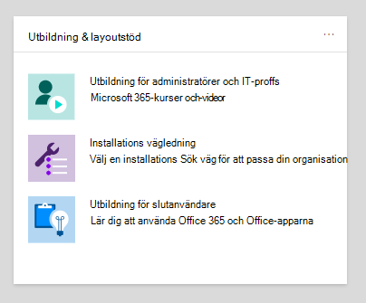
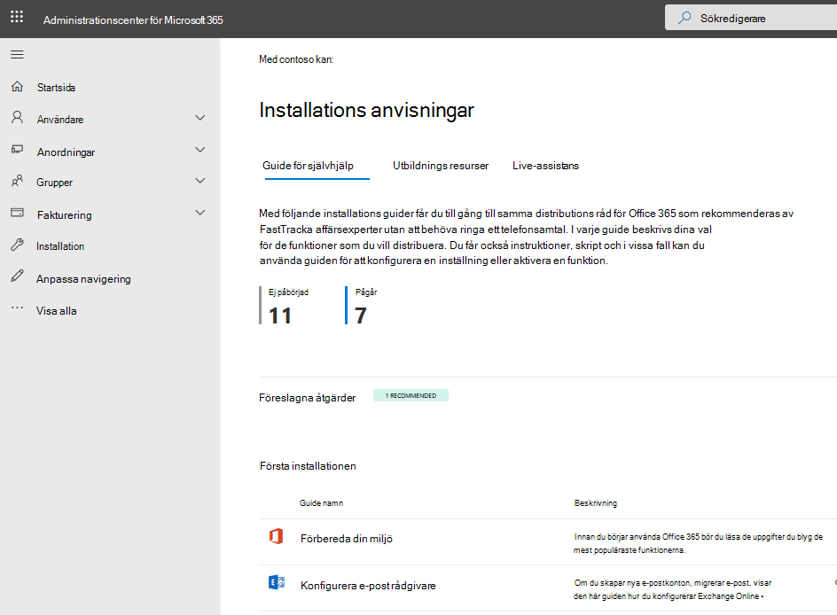

# Installations guider för Microsoft 365 och Office 365-tjänsterSetup guides for Microsoft 365 and Office 365 services

Installations guider för Microsoft 365 och Office 365 ger dig skräddarsydda vägledningar och resurser för planering och distribution av klient organisation, appar och tjänster.Microsoft 365 and Office 365 setup guides give you tailored guidance and resources for planning and deploying your tenant, apps, and services. De här guiderna skapas med hjälp av de bästa metoderna för att [Microsoft 365 FastTrack](https://www.microsoft.com/fasttrack/microsoft-365) -specialister delar i enskilda interaktioner, och de är tillgängliga för alla administratörer i administrations centret för Microsoft 365.These guides are created using the same best practices that [Microsoft 365 FastTrack](https://www.microsoft.com/fasttrack/microsoft-365) onboarding specialists share in individual interactions, and they're available to all admins within the Microsoft 365 admin center. De ger information om produkt inställningar, aktiverar säkerhetsfunktioner, distribuerar samarbets verktyg och ger skript för att snabba på avancerade distributioner.They give information on product setup, enabling security features, deploying collaboration tools, and provide scripts to speed up advanced deployments.

## Komma åt inställnings guider i administrations centret för Microsoft 365How to access setup guides in the Microsoft 365 admin center

Installations guiderna är tillgängliga från sidan [konfigurations vägledning](https://aka.ms/setupguidance) i administrations centret för Microsoft 365.The setup guides are accessible from the [Setup guidance](https://aka.ms/setupguidance) page in the Microsoft 365 admin center. Du kan hålla reda på statusen för dina framsteg och välja att återvända när som helst för att slutföra en guide.You can keep track of the status of your progress and you have the option to return at any time to complete a guide. Så här når du sidan **konfigurations vägledning** :To reach the **Setup guidance** page:

1. Gå till **Start** sidan i [administrations centret för Microsoft 365](https://admin.microsoft.com/).In the [Microsoft 365 admin center](https://admin.microsoft.com/), go to the **Home** page.

2. Hitta kortet **utbildning & stöd linjer** .Find the **Training & guides** card. 

   

3. Välj **anpassad konfigurations vägledning**.Select **Customized setup guidance**.

   

>[!NOTE]
>Behörigheter för innehavaradministration krävs för att få åtkomst till administrations centret för Microsoft 365.Tenant administrator permissions are required to access the Microsoft 365 admin center.

## Hur fungerar inställnings guider i administrations centret för Microsoft 365?How do setup guides work in the Microsoft 365 admin center?

Varje guide innehåller steg-för-steg-instruktioner, resurser, artiklar och när så behövs, skript som du kan använda för att göra konfigurations ändringar.Each guide provides you with step-by-step instructions, resources, articles, and when needed, scripts you can use to make configuration changes. De här guiderna innehåller alternativ som återspeglar de särskilda behoven hos både små och stora organisationer.These guides provide you with choices that reflect the specific needs of both small and large organizations. Dessutom innehåller vägledningen hjälp för både nya och mer erfarna administratörer.Additionally, the guidance includes assistance for both new and more experienced admins.

Du kan använda guiderna för att lära dig mer om specifika funktioner i Microsoft 365 och Office 365 under planerings fasen, under distribution och utgivning eller för att gå tillbaka till dem när du har slutfört en distribution för att ändra en inställning.You can use the guides to learn more about specific Microsoft 365 and Office 365 features during the planning phase, during deployment and rollout, or to revisit them after you've completed a deployment to modify a setting.

## Stöd linjer för första installationenGuides for initial setup

### Förbereda din miljöPrepare your environment

Med [förbereda din miljö](https://aka.ms/prepareyourenvironment) guide kan du förbereda organisationens miljö för Microsoft 365 och Office 365-tjänsterna.The [Prepare your environment](https://aka.ms/prepareyourenvironment) guide helps you prepare your organization's environment for Microsoft 365 and Office 365 services. Oavsett dina mål finns det uppgifter du måste utföra för att få en lyckad distribution.Regardless of your goals, there are tasks you'll need to complete to ensure a successful deployment. För att undvika fel när du förbereder miljön får du stegvisa instruktioner om hur du ansluter domänen, lägger till användare, tilldelar licenser, konfigurerar e-post med Exchange Online och installerar eller distribuerar Office-appar.To avoid any errors while preparing your environment, you're provided with step-by-step instructions to connect your domain, add users, assign licenses, set up email with Exchange Online, and install or deploy Office apps. 

### Konfigurera e-post rådgivareEmail setup advisor

Med [guiden för e-postkonfiguration](https://aka.ms/office365setup) får du stegvisa instruktioner för hur du konfigurerar Exchange Online för din organisation.The [Email setup advisor](https://aka.ms/office365setup) provides you with the step-by-step guidance needed for configuring Exchange Online for your organization. Här ingår att konfigurera nya e-postkonton, migrera e-post och konfigurera e-postskydd.This includes setting up new email accounts, migrating email, and configuring email protection. Använd den här rådgivaren för att få en lyckad e-postinstallation, med den rekommenderade autentiseringsmetoden baserat på din organisations aktuella e-postsystem, antalet post lådor som migreras och hur du vill hantera användare och deras åtkomst.For a successful email set up, use this advisor and you'll receive the recommended migration method based on your organization's current mail system, the number of mailboxes being migrated, and how you want to manage users and their access.

### Gmail-kontakter och kalender klassificeringGmail contacts and calendar advisor

När du migrerar en Gmail-användares post låda till Microsoft 365 migreras e-postmeddelanden, men inte kontakter och Kalender objekt.When you migrate a Gmail user's mailbox to Microsoft 365, email messages are migrated, but contacts and calendar items are not. [Gmail-kontakter och kalender rådgivare](https://aka.ms/gmailcontactscalendar) innehåller anvisningar för hur du importerar Google-kontakter och Google Kalender-objekt till Microsoft 365 med hjälp av import-och export metoder med Outlook.com, Outlook-klienten eller PowerShell.The [Gmail contacts and calendar advisor](https://aka.ms/gmailcontactscalendar) provides steps for importing Google contacts and Google calendar items to Microsoft 365 using import and export methods with Outlook.com, the Outlook client, or PowerShell.

### Microsoft 365 Deployment AdvisorMicrosoft 365 deployment advisor

Med [Microsoft 365 Deployment Advisor](https://aka.ms/microsoft365setupguide) får du vägledning när du konfigurerar produktivitets verktyg, säkerhets principer och funktioner för enhets hantering.The [Microsoft 365 deployment advisor](https://aka.ms/microsoft365setupguide) provides you with guidance when setting up productivity tools, security policies, and device management capabilities. Med ett Microsoft 365 Business Premium-eller Microsoft 365-abonnemang för företag kan du använda denna rådgivare för att konfigurera och konfigurera organisationens enheter.With a Microsoft 365 Business Premium or Microsoft 365 for enterprise subscription, you can use this advisor to set up and configure your organization's devices. 

Du får vägledning och åtkomst till resurser för att aktivera dina moln tjänster, uppdatera enheter till den senaste versionen av Windows 10 och ansluta enheter till Azure Active Directory (Azure AD), allt på en central plats.You'll receive guidance and access to resources to enable your cloud services, update devices to the latest supported version of Windows 10, and join devices to Azure Active Directory (Azure AD), all in one central location.

### Konfigurations guide för FjärrhjälpRemote work setup guide

[Konfigurations guiden för Fjärrjobb](https://aka.ms/remoteworksetup) ger organisationer med tips och resurser som behövs för att säkerställa att användarna kan arbeta på ett säkert sätt, att dina data är säkra och att användarnas autentiseringsuppgifter skyddas.The [Remote work setup guide](https://aka.ms/remoteworksetup) provides organizations with the tips and resources needed to ensure your users can successfully work remotely, your data is secure, and users' credentials are safeguarded. 

Du får vägledning för att optimera fjär arbets tagarnas enhets trafik till båda Microsoft 365-resurserna i molnet och organisationens nätverk, vilket minskar belastningen på din VPN-infrastruktur för fjärråtkomst.You'll receive guidance to optimize remote workers' device traffic to both Microsoft 365 resources in the cloud and your organization's network, which will reduce the strain on your remote access VPN infrastructure. 

### Installations guide för virtuellt skriv bord i WindowsWindows Virtual Desktop setup guide

Windows Virtual Desktop är en omfattande tjänst för dator-och program virtualisering som körs i molnet.Windows Virtual Desktop is a comprehensive desktop and app virtualization service running in the cloud. Det är den enda virtuella Skriv bords infrastrukturen (VDI) som ger förenklad hantering, multi-session Windows 10, optimeringar för Microsoft 365-appar och stöd för fjärr skrivbords tjänster (RDS).It's the only virtual desktop infrastructure (VDI) that delivers simplified management, multi-session Windows 10, optimizations for Microsoft 365 Apps, and support for Remote Desktop Services (RDS) environments. Distribuera och skala dina Windows-datorer och appar till Azure i minuter och få inbyggda funktioner för säkerhet och efterlevnad.Deploy and scale your Windows desktops and apps to Azure in minutes and get built-in security and compliance features. 

[Installations guiden för Windows Virtual Desktop](https://aka.ms/wvdsetupguide) innehåller administratörer med planerings resurser och förutsättningar för distribution, konfigurations vägledning och ytterligare resurser.The [Windows Virtual Desktop setup guide](https://aka.ms/wvdsetupguide) provides administrators with planning resources and the prerequisites for deployment, setup guidance, and additional resources. 

## Stöd linjer för inloggningsautentisering och åtkomstGuides for authentication and access

### Konfigurations guide för Azure ADAzure AD setup guide

[Konfigurations guiden för Azure AD](https://aka.ms/aadpguidance) tillhandahåller information för att säkerställa att organisationen har en stark säkerhets bas.The [Azure AD setup guide](https://aka.ms/aadpguidance) provides information to ensure your organization has a strong security foundation. I den här guiden ska du konfigurera inledande funktioner, till exempel Azure Role-baserad åtkomst kontroll (Azure RBAC) för administratörer, Azure AD Connect för den lokala katalogen och Azure AD Connect-hälsa, så att du kan övervaka din hybrid identitets hälsa under automatiserade synkroniseringar.In this guide you’ll set up initial features, like Azure role-based access control (Azure RBAC) for admins, Azure AD Connect for your on-premises directory, and Azure AD Connect Health, so you can monitor your hybrid identity's health during automated syncs. 

Det inkluderar också viktig information om att aktivera standard lösen ords återställning, villkorlig åtkomst och integrerad inloggning från tredje part, inklusive valfritt Avancerat identitets skydd och användar konfiguration.It also includes essential information on enabling self-service password resets, conditional access and integrated third-party sign-on including optional advanced identity protection and user provisioning automation.

### Planera din lösenordsskyddade distributionPlan your passwordless deployment

Uppgradera till en alternativ inloggnings metod som gör att användare kan komma åt sina enheter på ett säkert sätt med någon av följande lösenordsskyddade autentiseringsmetoder:Upgrade to an alternative sign-in approach that allows users to access their devices securely with one of the following passwordless authentication methods: 

- Windows Hello för företagWindows Hello for Business
- Microsoft Authenticator-appenThe Microsoft Authenticator app
- Säkerhets nycklarSecurity keys 

Använd [guiden planera lösenordsskyddad distribution](https://aka.ms/passwordlesssetup) för att upptäcka de bästa autentiseringsmetoderna för lösen ords hantering för att använda och få vägledning om hur du distribuerar dem.Use the [Plan your passwordless deployment wizard](https://aka.ms/passwordlesssetup) to discover the best passwordless authentication methods to use and receive guidance on how to deploy them. 

### Planera distribution av självbetjänings återställning (SSPR)Plan your self-service password reset (SSPR) deployment

Ge användarna möjligheten att ändra lösen ord oberoende av varandra, om deras konto är låst, eller om de glömmer bort sitt lösen ord utan att behöva kontakta supportavdelningen.Give users the ability to change or reset their password independently, if their account is locked, or they forget their password without the need to contact a helpdesk engineer. 

Använd [guiden för automatisk distribution av lösen ords återställning](https://aka.ms/SSPRSetupGuide) för att få relevanta artiklar och anvisningar för hur du konfigurerar lämpliga alternativ för Azure-portalen som hjälper dig att distribuera SSPR i miljön.Use the [Plan your self-service password reset deployment wizard](https://aka.ms/SSPRSetupGuide) to receive relevant articles and instructions for configuring the appropriate Azure portal options to help you deploy SSPR in your environment.

### Distributions rådgivare för Active Directory Federation Services (AD FS)Active Directory Federation Services (AD FS) deployment advisor

Med [AD FS Deployment Advisor](https://aka.ms/adfsguidance) får du stegvisa instruktioner om hur du distribuerar en lokal AD FS-infrastruktur som autentiserar användare för Microsoft 365 och Office 365-tjänsterna.The [AD FS deployment advisor](https://aka.ms/adfsguidance) provides you with step-by-step guidance on deploying an on-premises AD FS infrastructure that authenticates users for Microsoft 365 and Office 365 services. Med den här guiden kan din organisation granska AD FS-komponenter och-krav, skaffa och installera SSL-certifikat som behövs för distribution och installera en nödvändig Web Application-proxyserver.With this guide, your organization can review AD FS components and requirements, acquire and install SSL certificates that are necessary for deployment, and install a required web application proxy server. 

## Rikt linjer för säkerhet och efterlevnadGuides for security and compliance

### Microsoft Defender (avancerat) rådgivareMicrosoft Defender Advanced Threat Protection (ATP) advisor

[Microsoft Defender Avancerat skydds guide](https://aka.ms/mdatpsetup) innehåller instruktioner som hjälper företags nätverket att förhindra, upptäcka, undersöka och reagera på avancerade hot.The [Microsoft Defender Advanced Threat Protection advisor](https://aka.ms/mdatpsetup) provides instructions that will help your enterprise network prevent, detect, investigate, and respond to advanced threats. Gör en välgrundad utvärdering av organisationens sårbarhet och bestäm vilka distributions paket och konfigurations metoder som är bäst.Make an informed assessment of your organization's vulnerability and decide which deployment package and configuration methods are best. 

>[!NOTE]
>Du måste ha en Microsoft Volume-licens för Microsoft Defender ATP.A Microsoft Volume License is required for Microsoft Defender ATP.

### Installations guide för Exchange Online ProtectionExchange Online Protection setup guide

Microsoft Exchange Online Protection (EOP) är en molnbaserad tjänst för e-postfiltrering för skydd mot skräp post och skadlig program vara, med funktioner för att skydda din organisation från överträdelser av meddelande principer.Microsoft Exchange Online Protection (EOP) is a cloud-based email filtering service for protection against spam and malware, with features to safeguard your organization from messaging policy violations. 

Använd [installations guiden för Exchange Online Protection](https://aka.ms/EOPguidance) för att konfigurera EOP genom att välja vilka av de tre olika distributions scenarierna &mdash; (blandning av lokala och molnbaserade post lådor) eller alla moln post lådor som &mdash; passar din organisation.Use the [Exchange Online Protection setup guide](https://aka.ms/EOPguidance) to set up EOP by selecting which of the three deployment scenarios&mdash;on-premises mailboxes, hybrid (mix of on-premises and cloud) mailboxes, or all cloud mailboxes&mdash;fits your organization. Guiden innehåller information och resurser som du kan använda för att konfigurera och granska användarens licensiering, tilldela behörigheter i administrations centret för Microsoft 365 och konfigurera organisationens principer mot skadlig program vara och skräp post i säkerhets & Compliance Center.The guide provides information and resources to set up and review your user's licensing, assign permissions in the Microsoft 365 admin center, and configure your organization's anti-malware and spam policies in the Security & Compliance Center. 

### Office 365 rådgivare för avancerat skyddOffice 365 Advanced Threat Protection advisor

[Office 365-rådgivaren för avancerat skydd](https://aka.ms/oatpsetup) skyddar din organisation mot skadliga hot som kan uppstå via e-postmeddelanden, länkar och samarbets verktyg från tredje part.The [Office 365 Advanced Threat Protection advisor](https://aka.ms/oatpsetup) safeguards your organization against malicious threats that your environment might encounter through email messages, links, and third-party collaboration tools. I den här guiden får du hjälp att förbereda och identifiera det avancerade hotets skydds abonnemanget för att passa organisationens behov.This guide provides you with the resources and information to help you prepare and identify the advanced threat protection plan to fit your organization's needs. 

### Installations guide för Microsoft informations skyddMicrosoft information protection setup guide

Få en översikt över de funktioner som du kan använda i informations skydds strategin så att du kan vara säker på att känslig information är skyddad.Get an overview of the capabilities you can apply to your Information Protection strategy so you can be confident your sensitive information is protected. Använd en livs cykel metod med fyra faser för att upptäcka, klassificera, skydda och övervaka känslig information.Use a four-stage lifecycle approach in which you discover, classify, protect, and monitor sensitive information. [Installations guiden för Microsoft informations skydd](https://aka.ms/mipsetupguide) ger råd om hur du utför dessa steg.The [Microsoft information protection setup guide](https://aka.ms/mipsetupguide) provides guidance for completing each of these stages.

### Installations guide för Microsoft information styrelseMicrosoft information governance setup guide

[Installations guiden för Microsoft information styrelse](https://aka.ms/migsetupguide) tillhandahåller den information du behöver för att konfigurera och hantera organisationens styrnings strategi, för att säkerställa att dina data klassificeras och hanteras enligt de särskilda rikt linjer för livs cykeln som du anger.The [Microsoft Information governance setup guide](https://aka.ms/migsetupguide) provides you with the information you'll need to set up and manage your organization's governance strategy, to ensure that your data is classified and managed according to the specific lifecycle guidelines you set. Med den här guiden får du lära dig hur du skapar, lägger till eller publicerar etiketter, etikett principer och bevarande principer som tillämpas på organisationens åter användnings Bart innehåll och efterlevnad.With this guide, you'll learn how to create, auto-apply, or publish labels, label policies, and retention policies that are applied to your organization's reusable content and compliance records. Du får också information om hur du importerar CSV-filer med en fil plan för flera olika scenarier eller för att tillämpa dem manuellt på enskilda dokument.You'll also get information on importing CSV files with a file plan for bulk scenarios or for applying them manually to individual documents. 

## Stöd linjer för samarbeteGuides for collaboration

### Distributions guide för Microsoft 365-apparMicrosoft 365 Apps deployment advisor

Med [distributions guiden för Microsoft 365-appar](https://aka.ms/OPPquickstartguide) kan du få dina användar enheter att köra den senaste versionen av Office-produkter som Word, Excel, PowerPoint och OneNote.The [Microsoft 365 Apps deployment advisor](https://aka.ms/OPPquickstartguide) helps you get your users' devices running the latest version of Office products like Word, Excel, PowerPoint, and OneNote. Du får vägledning om olika distributions metoder som inkluderar enkla installations alternativ för företags distributioner med hanterings verktyg.You'll get guidance on the various deployment methods that include easy self-install options to enterprise deployments with management tools. Anvisningarna hjälper dig att utvärdera din miljö, ta reda på dina specifika distributions krav och implementera nödvändiga support verktyg för att säkerställa en lyckad installation.The instructions will help you assess your environment, figure out your specific deployment requirements, and implement the necessary support tools to ensure a successful install. 

### Installations assistenten för Office Mobile-apparOffice mobile apps setup assistant

[Installations assistenten för Office Mobile-appar](https://aka.ms/officeappguidance) innehåller instruktioner för hur du laddar ner och installerar Office-appar på dina mobila enheter för Windows, iOS och Android.The [Office mobile apps setup assistant](https://aka.ms/officeappguidance) provides instructions for the download and installation of Office apps on your Windows, iOS, and Android mobile devices. I den här guiden får du stegvisa instruktioner för hur du laddar ned och installerar Microsoft 365-och Office 365-appar på din telefon och surfplatta.This guide provides you with step-by-step information to download and install Microsoft 365 and Office 365 apps on your phone and tablet devices.

### Installations guide för Microsoft TeamsMicrosoft Teams setup guide

[Installations guiden för Microsoft Teams](https://aka.ms/teamsguidance) ger din organisation vägledning för att konfigurera grupp arbets ytor som är värda i real tid via meddelanden, samtal och ljud-eller video möten för både grupp och privat kommunikation.The [Microsoft Teams setup guide](https://aka.ms/teamsguidance) provides your organization with guidance to set up team workspaces that host real-time conversations through messaging, calls, and audio or video meetings for both team and private communication. Du får instruktioner för hur du avgör organisationens nätverks krav med hjälp av verktyget för nätverks planering och team rådgivare i administrations centret för Teams.You'll receive the instructions for determining your organization's network requirements by using the Network Planner tool and the Teams advisor within the Teams admin center. När distributionen är klar innehåller guiden användbara resurser för att komma igång med Teams.Once your deployment is complete, the guide includes helpful resources to get started using Teams.

### Installations guide för SharePointSharePoint setup guide

[Installations guiden för SharePoint](https://aka.ms/spoguidance) hjälper dig att konfigurera lagringen och innehålls hanteringen för SharePoint-dokument, skapa webbplatser, konfigurera extern delning, migrera data och konfigurera avancerade inställningar samt att hantera användare och kommunikation i din organisation.The [SharePoint setup guide](https://aka.ms/spoguidance) helps you set up your SharePoint document storage and content management, create sites, configure external sharing, migrate data and configure advanced settings, and drive user engagement and communication within your organization. Du följer anvisningarna för hur du konfigurerar behörighets principer för innehålls delning, väljer verktyg för migrering och aktiverar säkerhets inställningarna för SharePoint-miljön.You'll follow steps for configuring your content-sharing permission policies, choose your migration sync tools, as well as enable the security settings for your SharePoint environment. 

### Installations guide för OneDriveOneDrive setup guide

Använd [konfigurations guiden för OneDrive](https://aka.ms/ODfBquickstartguide) för att komma igång med OneDrive för fil lagring, delning, samarbete och synkronisering.Use the [OneDrive setup guide](https://aka.ms/ODfBquickstartguide) to get started with OneDrive file storage, sharing, collaboration, and syncing capabilities. OneDrive tillhandahåller en central plats där användare kan synkronisera sina Microsoft 365-Apps-filer, konfigurera extern delning, migrera användar data och konfigurera avancerade inställningar för säkerhet och enhets åtkomst.OneDrive provides a central location where users can sync their Microsoft 365 Apps files, configure external sharing, migrate user data, and configure advanced security and device access settings. Installations guiden för OneDrive kan distribueras med hjälp av en OneDrive-prenumeration eller en fristående OneDrive-plan.The OneDrive setup guide can be deployed using a OneDrive subscription or a standalone OneDrive plan. 

### Yammer Deployment AdvisorYammer deployment advisor

Anslut och delta i hela organisationen med Yammer.Connect and engage across your organization with Yammer. Med [Yammer-distributionspaketet](https://aka.ms/yammerdeploymentguide) kan du lägga till domäner, definiera administratörer och kombinera Yammer-nätverk.The [Yammer deployment advisor](https://aka.ms/yammerdeploymentguide) prepares your Yammer network by adding domains, defining admins, and combining Yammer networks. Du får vägledning för att distribuera Yammer och sedan anpassa utseendet, Konfigurera säkerhet och efterlevnad och förfina inställningarna.You'll get guidance to deploy Yammer and then customize the look, configure security and compliance, and refine the settings.

## Avancerade guiderAdvanced wizards

### På-plats-uppgradering med Configuration ManagerIn-place upgrade with Configuration Manager

Använd [konfigurations guiden på plats](https://aka.ms/win10upgradedemo) när du uppgraderar Windows 7-och Windows 8,1-enheter till den senaste versionen av Windows 10.Use the [In-place upgrade with Configuration Manager guide](https://aka.ms/win10upgradedemo) when upgrading Windows 7 and Windows 8.1 devices to the latest version of Windows 10. Du kommer att använda det skript som tillhandahålls för att kontrol lera kraven och automatiskt konfigurera en uppgradering på plats.You'll use the script provided to check the prerequisites and automatically configure an in-place upgrade.

### Distribuera Office till dina användareDeploy Office to your users

Distribuera Office-appar från molnet så att du kan anpassa installationen med hjälp av distributions verktyget för Office.Deploy Office apps from the cloud with the ability to customize your installation by using the Office Deployment Tool. Med hjälp av funktionen [distribuera Office till din användare ](https://aka.ms/proplusodt) kan du skapa en anpassad Office-konfiguration med avancerade inställningar, eller så kan du använda en fördefinierad Rekommenderad konfiguration.The [Deploy Office to your users guide ](https://aka.ms/proplusodt) helps you create a customized Office configuration with advanced settings, or you can use a pre-built recommended configuration. Oavsett om användarna utför en själv installation eller om du distribuerar till dina användare individuellt eller i bulk ger den här avancerade guiden stegvisa instruktioner för att ge användarna en Office-installation som är skräddarsydd för din organisation.Whether your users are conducting a self-install or you're deploying to your users individually or in bulk, this advanced wizard provides you with step-by-step instructions to give users an Office installation tailored to your organization.

### Distribuera Office till fjärran vändareDeploy Office to remote users

Nu när du arbetar på en fjärran sluten dator är det viktigt att användarna tar emot organisationens Office-inställningar när de inte är anslutna till det interna nätverket eller när de använder sina egna enheter.Now that working remotely is the norm, users need to receive your organization's Office settings when they're not connected to your internal network or when using their own devices. 

Använd [guiden distribuera Office to Remote Users](https://aka.ms/officeremoteinstall) för att skapa en anpassad Office-installation och sedan skicka användare ett genererat PowerShell-skript som smidigt kan installera Office med din konfiguration.Use the [Deploy Office to remote users guide](https://aka.ms/officeremoteinstall) to create a customized Office installation and then send users a generated PowerShell script that will seamlessly install Office with your configuration.

### Distribuera och uppdatera Microsoft 365-appar med Configuration ManagerDeploy and update Microsoft 365 Apps with Configuration Manager

För organisationer som använder Configuration Manager kan du använda [distribuera och uppdatera Microsoft 365-appar med Configuration Manager Advisor](https://aka.ms/oppinstall) för att skapa ett skript som automatiskt konfigurerar din distribution av Microsoft 365-appar med de bästa metoderna som rekommenderas av FastTrack-tekniker.For organizations using Configuration Manager, you can use the [Deploy and update Microsoft 365 Apps with Configuration Manager advisor](https://aka.ms/oppinstall) to generate a script that will automatically configure your Microsoft 365 Apps deployment using best practices recommended by FastTrack engineers. Använd den här guiden för att skapa distributions grupper, anpassa dina Office-appar och-funktioner, konfigurera dynamiska installationer eller anläggningar och sedan köra skriptet för att skapa program, automatiska distributions regler och enhets samlingar som du behöver för att kunna använda din distribution.Use this guide to build your deployment groups, customize your Office apps and features, configure dynamic or lean installations, and then run the script to create the applications, automatic deployment rules, and device collections you need to target your deployment. 
