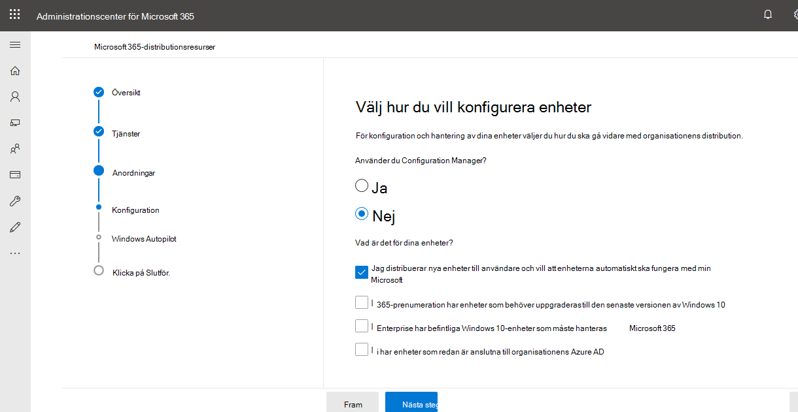

# Installationsguider för Microsoft 365- och Office 365-tjänster

I installationsguiderna för Microsoft 365 och Office 365 får du skräddarsydd vägledning och resurser för planering och distribution av klientorganisationen, appar och tjänster. De här guiderna skapas med samma metodtips som [Microsoft 365 FastTrack-specialister](https://www.microsoft.com/fasttrack/microsoft-365) delar på enskilda interaktioner, och de är tillgängliga för alla administratörer i administrationscentret för Microsoft 365. De ger information om produktkonfiguration, säkerhetsfunktioner, distribution av samarbetsverktyg och skript för att snabba upp avancerade distributioner.

## Så här kommer du åt installationsguiderna i administrationscentret för Microsoft 365

Installationsguiderna är tillgängliga från sidan [Konfigurationsvägledning](https://aka.ms/setupguidance) i administrationscentret för Microsoft 365. Du kan hålla reda på statusen för din status och du kan när som helst gå tillbaka för att slutföra en guide. Så här kommer du **till sidan Konfigurationsvägledning:**

1. Gå till [startsidan i administrationscentret för Microsoft 365.](https://admin.microsoft.com/) 

2. Gå till **kortet & utbildningsguider.** 

   

3. Välj **Anpassad konfigurationsvägledning**.

   

>[!NOTE]
>Behörigheter som innehavaradministratör krävs för att få åtkomst till administrationscentret för Microsoft 365.

## Hur fungerar installationsguiderna i administrationscentret för Microsoft 365?

I varje guide får du stegvisa instruktioner, resurser, artiklar och vid behov skript som du kan använda för att göra konfigurationsändringar. I de här guiderna får du val som avspeglar små och stora organisationers specifika behov. Dessutom innehåller vägledningen hjälp för både nya och mer erfarna administratörer.

Du kan använda guiderna om du vill lära dig mer om specifika Microsoft 365- och Office 365-funktioner under planeringsfasen, under distribution och distribution, eller för att gå tillbaka till dem när du har slutfört en distribution för att ändra en inställning.

## Guider för första installationen

### Förbereda din miljö

Med [Hjälp av Förbered](https://aka.ms/prepareyourenvironment) din miljöguide kan du förbereda organisationens miljö för Microsoft 365- och Office 365-tjänster. Oavsett dina mål finns det uppgifter som du måste slutföra för att säkerställa en lyckad distribution. För att undvika fel när du förbereder miljön får du stegvisa instruktioner för att ansluta din domän, lägga till användare, tilldela licenser, konfigurera e-post med Exchange Online och installera eller distribuera Office-program. 

### E-postkonfigurationsrådgivare

Rådgivaren [för e-postkonfiguration](https://aka.ms/office365setup) ger dig de stegvisa instruktioner som behövs för att konfigurera Exchange Online för din organisation. Det omfattar att konfigurera nya e-postkonton, migrera e-post och konfigurera e-postskydd. Använd den här rådgivaren för att få en lyckad e-postuppsättning. Du får den rekommenderade migreringsmetoden baserat på organisationens aktuella e-postsystem, antalet postlådor som migreras och hur du vill hantera användare och deras åtkomst.

### Migrera Gmail-kontakter och kalenderobjekt

När du migrerar en Gmail-användares postlåda till Microsoft 365 migreras e-postmeddelanden, men inte kontakter och kalenderobjekt. Rådgivaren [för Gmail-kontakter och](https://aka.ms/gmailcontactscalendar) -kalendrar tillhandahåller steg för import av Google-kontakter och Google-kalenderobjekt till Microsoft 365 med import- och exportmetoder med Outlook.com, Outlook-klienten eller PowerShell.

### Distributionsrådgivaren för Microsoft 365

[Distributionsrådgivaren för Microsoft 365](https://aka.ms/microsoft365setupguide) ger dig vägledning vid installation av produktivitetsverktyg, säkerhetsprinciper och funktioner för enhetshantering. Med en Microsoft 365 Business Premium- eller Microsoft 365 för företag-prenumeration kan du använda den här rådgivaren för att konfigurera och konfigurera din organisations enheter. 

Du får vägledning och åtkomst till resurser för att aktivera dina molntjänster, uppdatera enheter till den senaste versionen av Windows 10 som stöds och ansluta enheter till Azure Active Directory (Azure AD), allt på en central plats.

### Guide för fjärrinstallation av arbete

Guiden [för fjärrinstallation ger](https://aka.ms/remoteworksetup) organisationer de tips och resurser som behövs för att säkerställa att användarna kan arbeta på distans, att dina data är säkra och att användarnas autentiseringsuppgifter är skyddade. 

Du får vägledning för att optimera distansarbetares enhetstrafik till både Microsoft 365-resurser i molnet och organisationens nätverk, vilket minskar belastningen på VPN-infrastrukturen för fjärråtkomst. 

### Installationsguide för Windows Virtual Desktop

Windows Virtual Desktop är en omfattande virtualiseringstjänst för skrivbord och appar som körs i molnet. Det är den enda virtuella skrivbordsinfrastrukturen (VDI) som levererar förenklad hantering, Windows 10-flersessionsoptimeringar, optimeringar för Microsoft 365-appar och stöd för fjärrskrivbordstjänster (RDS). Distribuera och skala dina Windows-skrivbord och appar till Azure på några minuter och få inbyggda säkerhets- och efterlevnadsfunktioner. 

Installationsguiden [för Windows virtual desktop](https://aka.ms/wvdsetupguide) förser administratörerna med planeringsresurser och förutsättningar för distribution, konfigurationsvägledning och ytterligare resurser. 

### Installationsguide för Microsoft Edge

Microsoft Edge har återskapats från grunden för att ge dig förstklassig kompatibilitet och prestanda, den säkerhet och sekretess du behöver samt nya funktioner som är utformade för att du ska få ut så bra som helst på webben.

Installationsguiden [för Microsoft Edge](https://aka.ms/edgeadvisor) hjälper dig att konfigurera webbplatsidentifiering för företag för att se vilka webbplatser som har åtkomst i din organisation kan behöva använda IE-läge, granska och konfigurera viktiga säkerhetsfunktioner, konfigurera sekretesspolicyer och ytterligare principer för att uppfylla organisationens krav och hantera webbåtkomst på dina enheter. Du kan ladda ned Microsoft Edge till enskilda enheter, eller så visar vi dig hur du distribuerar till flera användare i din organisation med Configuration Manager eller Microsoft Intune. 

### Installationsguide för Microsoft Search

Microsoft Search hjälper din organisation att hitta vad de behöver för att slutföra vad de arbetar med. Oavsett om det handlar om att söka efter personer, filer, organisationsscheman, webbplatser eller svar på vanliga frågor kan organisationen använda Microsoft Search under arbetsdagen för att få svar.

Installationsguiden [för Microsoft Search](https://aka.ms/MicrosoftSearchSetup) hjälper dig att konfigurera Microsoft Search oavsett om du vill pilottesta den till en grupp användare eller distribuera den till alla i organisationen. Du tilldelar sökadministratörer och sökredigerare och anpassar sedan sökupplevelsen för användarna med svar och ytterligare alternativ, som att lägga till Bing-tillägget till Chrome eller ange Bing som standardsökmotor.

### Konfigurationsguide för Intune Configuration Manager för samtidig hantering

Använd konfigurationsguiden för konfigurationshanteraren för [Intune](https://aka.ms/comanagementsetup) Configuration Manager för befintliga Configuration Manager-klientenheter och nya Internetbaserade enheter som din organisation vill hantera tillsammans med både Microsoft Intune och Configuration Manager. Med den här distributionsguiden för samtidig hantering kan du hantera Windows 10-enheter och lägga till nya funktioner på din organisations enheter, samtidigt som du får fördelarna med båda lösningarna.

## Guider för autentisering och åtkomst

### Konfigurationsguide för Azure AD

[Konfigurationsguiden för Azure AD](https://aka.ms/aadpguidance) innehåller information för att säkerställa att din organisation har en stark säkerhetsgrund. I den här guiden kommer du att konfigurera initiala funktioner som Azure rollbaserad åtkomstkontroll (Azure RBAC) för administratörer, Azure AD Connect för din lokala katalog och Azure AD Connect Health, så att du kan övervaka hybrididentitetens hälsa vid automatiska synkroniseringar. 

Den innehåller även viktig information om hur du aktiverar självbetjäning för återställning av lösenord, villkorsstyrd åtkomst och integrerad inloggning från tredje part, inklusive valfritt avancerat identitetsskydd och automatisering av användaretablering.

### Synkronisera användare från organisationens katalog

Du [får hjälp med att aktivera katalogsynkronisering](https://aka.ms/directorysyncsetup) med hjälp av guiden Synkronisera användare från organisationens katalog. Detta sammanför dina lokala och molnbaserade identiteter för enklare åtkomst och förenklad hantering. Lås upp nya funktioner som enkel inloggning, självbetjäningsalternativ, automatisk kontoetablering, kontroller för villkorsstyrd åtkomst och efterlevnadsprinciper. Det säkerställer att användarna har åtkomst till de resurser de behöver var de än är.

### Planera lösenordslös distribution

Uppgradera till en alternativ inloggningsmetod som gör att användarna kan komma åt sina enheter på ett säkert sätt med någon av följande lösenordslösa autentiseringsmetoder: 

- Windows Hello för företag
- Microsoft Authenticator-appen
- Säkerhetsnycklar 

Använd [distributionsguiden Planera din lösenordslösa distribution](https://aka.ms/passwordlesssetup) för att hitta de bästa lösenordslösa autentiseringsmetoderna att använda och få vägledning om hur du distribuerar dem. 

### Planera självbetjäning för återställning av lösenord (SSPR)

Ge användare möjlighet att ändra eller återställa sitt lösenord oberoende av varandra, om deras konto är låst eller så glömmer de sitt lösenord utan att behöva kontakta en supporttekniker. 

Använd guiden [Planera självbetjäning](https://aka.ms/SSPRSetupGuide) för återställning av lösenord för att få relevanta artiklar och instruktioner för hur du konfigurerar lämpliga Azure Portal-alternativ för att distribuera SSPR i din miljö.

### Distributionsrådgivaren för AD FS (Active Directory Federation Services)

Distributionsrådgivaren för [AD FS](https://aka.ms/adfsguidance) ger dig stegvisa instruktioner om hur du distribuerar en lokal AD FS-infrastruktur som autentiserar användare för Microsoft 365- och Office 365-tjänster. Med den här guiden kan organisationen granska AD FS-komponenter och krav, skaffa och installera SSL-certifikat som behövs för distributionen och installera en webbprogramproxyserver som krävs. 

## Riktlinjer för säkerhet och efterlevnad

### Konfigurationsguide för Microsoft Intune 

Konfigurera Microsoft Intune för att hantera enheter i din organisation. Om du vill ha fullständig kontroll över företagets enheter använder du Intune-funktionerna för hantering av mobila enheter (MDM). Om du vill hantera organisationens data på delade och personliga enheter kan du använda Intune-funktionerna för hantering av mobilprogram (MAM). 

Med [installationsguiden för Microsoft Intune](https://aka.ms/intunesetupguide)kan du konfigurera principer för enhets- och appefterlevnad, tilldela principer för appskydd och övervaka status för enhet och programskydd. 

### Microsoft Defender för slutpunktsrådgivare

Rådgivaren [för Microsoft Defender för slutpunkt](https://aka.ms/mdatpsetup) tillhandahåller instruktioner som hjälper företagsnätverket att förhindra, upptäcka, undersöka och hantera avancerade hot. Gör en välinformerad bedömning av organisationens sårbarhet och bestäm vilka distributionspaket och konfigurationsmetoder som passar bäst. 

>[!NOTE]
>En Microsoft-volymlicens krävs för Microsoft Defender för Endpoint.

### Konfigurationsguide för Exchange Online Protection

Microsoft Exchange Online Protection (EOP) är en molnbaserad tjänst för e-postfiltrering för skydd mot skräppost och skadlig programvara, med funktioner som skyddar organisationen från att bryter mot meddelandeprinciper. 

Använd [konfigurationsguiden](https://aka.ms/EOPguidance) för Exchange Online Protection för att konfigurera EOP genom att välja vilka av de tre distributionsscenarierna för lokala postlådor, hybridpostlådor (blandning av lokala postlådor och molnpostlådor) eller alla molnbaserade postlådor passar din &mdash; &mdash; organisation. Guiden innehåller information och resurser för att konfigurera och granska användarnas licensiering, tilldela behörigheter i administrationscentret för Microsoft 365 och konfigurera organisationens principer för skydd mot skadlig programvara och skräppost i Säkerhets- och & efterlevnadscenter. 

### Microsoft Defender för Office 365-rådgivare

Rådgivaren i Microsoft Defender för [Office 365](https://aka.ms/oatpsetup) skyddar organisationen mot skadliga hot som kan uppstå i miljön via e-postmeddelanden, länkar och samarbetsverktyg från tredje part. Den här guiden innehåller resurser och information som hjälper dig att förbereda och identifiera Defender för Office 365-planen efter organisationens behov. 

### Konfigurationsguide för Microsoft informationsskydd

Få en översikt över de funktioner som du kan använda för din strategi för informationsskydd så att du kan vara säker på att känslig information skyddas. Använd en livscykel i fyra steg där du identifierar, klassificerar, skyddar och övervakar känslig information. Installationsguiden för [Microsofts informationsskydd](https://aka.ms/mipsetupguide) ger anvisningar för hur du slutför vart och ett av dessa steg.

### Konfigurationsguide för informationsstyrning från Microsoft

I konfigurationsguiden för microsoft [informationsstyrning](https://aka.ms/migsetupguide) får du den information du behöver för att konfigurera och hantera organisationens hanteringsstrategi för att se till att dina data klassificeras och hanteras i enlighet med de specifika livscykelriktlinjer som du anger. Med den här guiden får du lära dig hur du skapar, tillämpar automatiskt eller publicerar etiketter, etikettprinciper och bevarandeprinciper som används i organisationens återanvändningsbara innehåll och efterlevnadsposter. Du får också information om hur du importerar CSV-filer med en filplan för massscenarier eller för att använda dem manuellt på enskilda dokument. 

## Guider för samarbete

### Distributionsrådgivaren för Microsoft 365-appar

[Distributionsrådgivaren för Microsoft 365-appar](https://aka.ms/OPPquickstartguide) hjälper dig att få användarnas enheter att köra den senaste versionen av Office-produkter som Word, Excel, PowerPoint och OneNote. Du får vägledning om de olika distributionsmetoderna som innehåller enkla självinstallationsalternativ för företagsdistributioner med hanteringsverktyg. Instruktionerna hjälper dig att bedöma miljön, ta reda på dina specifika distributionskrav och implementera nödvändiga supportverktyg för att säkerställa en lyckad installation. 

### Installationsguide för mobilappar

Installationsguiden [för mobilappar](https://aka.ms/officeappguidance) innehåller instruktioner för nedladdning och installation av Office-appar på dina Windows-, iOS- och Android-mobila enheter. Den här guiden innehåller stegvis information om hur du laddar ned och installerar Microsoft 365- och Office 365-program på din telefon och surfplatta.

### Konfigurationsguide för Microsoft Teams

[Konfigurationsguiden för Microsoft Teams](https://aka.ms/teamsguidance) ger organisationen vägledning för att konfigurera teamarbetsytor som kan vara värd för konversationer i realtid via meddelanden, samtal och ljud- eller videomöten för både teamkommunikation och privat kommunikation. Du får instruktioner för att fastställa organisationens nätverkskrav med hjälp av verktyget Nätverksplanering och Teams-rådgivaren i administrationscentret för Teams. När distributionen är klar innehåller guiden användbara resurser för att komma igång med användningen av Teams.

### Konfigurationsguide för SharePoint

Med [hjälp av installationsguiden](https://aka.ms/spoguidance) för SharePoint kan du konfigurera lagring och innehållshantering för SharePoint-dokument, skapa webbplatser, konfigurera extern delning, migrera data och konfigurera avancerade inställningar och få användarna att engagera sig och kommunicera inom organisationen. Du följer anvisningarna för att konfigurera behörighetsprinciper för innehållsdelning, välja synkroniseringsverktyg för migrering och aktivera säkerhetsinställningarna för SharePoint-miljön. 

### Installationsguide för OneDrive

Använd [installationsguiden för OneDrive för](https://aka.ms/ODfBquickstartguide) att komma igång med fillagring, delning, samarbete och synkroniseringsfunktioner i OneDrive. OneDrive tillhandahåller en central plats där användarna kan synkronisera sina Microsoft 365-programfiler, konfigurera extern delning, migrera användardata och konfigurera avancerade inställningar för säkerhet och enhetsåtkomst. Installationsguiden för OneDrive kan distribueras med en OneDrive-prenumeration eller ett fristående OneDrive-abonnemang. 

### Distributionsrådgivaren för Yammer

Ta kontakt och engagera andra i hela organisationen med Yammer. [Distributionsrådgivaren för Yammer](https://aka.ms/yammerdeploymentguide) förbereder Yammer-nätverket genom att lägga till domäner, definiera administratörer och kombinera Yammer-nätverk. Du får vägledning för att distribuera Yammer och sedan anpassa utseendet, konfigurera säkerhet och efterlevnad samt förfina inställningarna.

## Avancerade guider

### Uppgradering på plats med Konfigurationshanteraren

Använd på [plats-uppgraderingen med](https://aka.ms/win10upgradedemo) konfigurationshanteraren när du uppgraderar Windows 7 och Windows 8.1-enheter till den senaste versionen av Windows 10. Du använder skriptet som tillhandahålls för att kontrollera förutsättningarna och automatiskt konfigurera en på plats-uppgradering.

### Distribuera Office till användarna

Distribuera Office-program från molnet med möjlighet att anpassa installationen med hjälp av distributionsverktyget för Office. Guiden [Distribuera Office till användarna hjälper ](https://aka.ms/proplusodt) dig att skapa en anpassad Office-konfiguration med avancerade inställningar, eller så kan du använda en inbyggd rekommenderad konfiguration. Oavsett om användarna utför en självinstallation eller om du distribuerar till användarna enskilt eller i grupp får du i den här avancerade guiden stegvisa instruktioner för att ge användarna en Office-installation anpassad efter din organisation.

### Distribuera Office till fjärranvändare

Nu när det är normen att arbeta på distans måste användarna få organisationens Office-inställningar när de inte är anslutna till ditt interna nätverk eller när de använder sina egna enheter. 

Använd guiden [Distribuera Office till fjärranvändare](https://aka.ms/officeremoteinstall) om du vill skapa en anpassad Office-installation och sedan skicka ett genererat PowerShell-skript till användarna som smidigt installerar Office med din konfiguration.

### Distribuera och uppdatera Microsoft 365-program med Konfigurationshanteraren

Organisationer som använder Configuration Manager kan använda distribuera och uppdatera [Microsoft 365-appar](https://aka.ms/oppinstall) med Konfigurationshanteraren för att generera ett skript som automatiskt konfigurerar distributionen av Microsoft 365-appar med de bästa metoder som rekommenderas av FastTrack-tekniker. Använd den här guiden för att skapa distributionsgrupper, anpassa Office-program och -funktioner, konfigurera dynamiska eller magera installationer och kör sedan skriptet för att skapa de program, automatiska distributionsregler och enhetssamlingar som du behöver för att rikta distributionen. 

