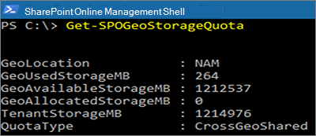

# <a name="sharepoint-storage-quotas-in-multi-geo-environments"></a>SharePoint för flera geografiska miljöer

Som standard delar alla geoplatser i en multigeomiljö den tillgängliga lagringskvoten för klientorganisationen.

Med de SharePoint för geolagringskvot kan du hantera lagringskvoten för varje geoplats. När du tilldelar en lagringskvot för en geoplats blir den största tillgängliga lagringsmängden för den geoplatsen och dras av från den tillgängliga klientorganisationens lagringskvot. Den återstående tillgängliga lagringskvoten för klientorganisationen delas sedan över de konfigurerade geoplatser som inte har tilldelats en viss lagringskvot.

Lagringskvoten SharePoint geoplats kan tilldelas av SharePoint Online-administratören genom att ansluta till den centrala platsen. Geoadministratörer för satellitplatser kan visa lagringskvoten men kan inte tilldela den.

## <a name="configure-a-storage-quota-for-a-geo-location"></a>Konfigurera en lagringskvot för en geoplats

Använd Microsoft Office SharePoint Online [och anslut](https://www.microsoft.com/download/details.aspx?id=35588) till den centrala platsen för att tilldela lagringskvoten för en geoplats.

För att tilldela Storage för en plats kör du cmdlet:

```powershell
Set-SPOGeoStorageQuota -GeoLocation <geolocationcode> -StorageQuotaMB <value>
```

Visa Storage för den aktuella geoplatsen genom att köra:

```powershell
Get-SPOGeoStorageQuota
```



Visa Storage för alla geografiska platser genom att köra:

```powershell
Get-SPOGeoStorageQuota -AllLocations
```

Ta bort den tilldelade lagringskvoten för en geoplats genom att `StorageQuota value = 0` ange:

```powershell
Set-SPOGeoStorageQuota -GeoLocation <geolocationcode> -StorageQuotaMB 0
```
