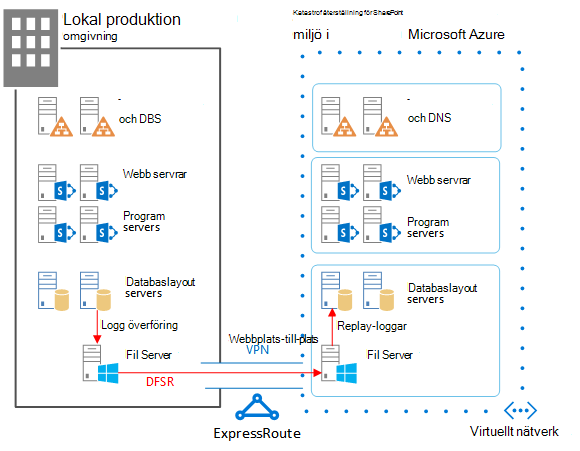
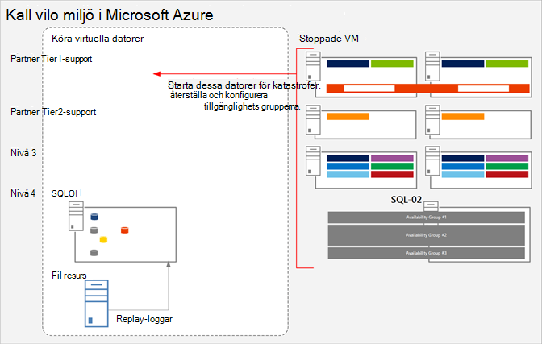
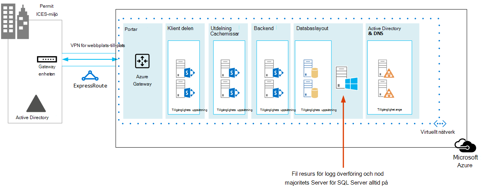
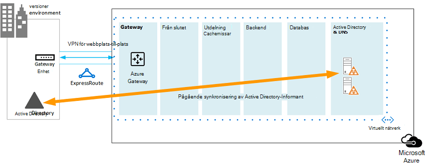

# <a name="sharepoint-server-2013-disaster-recovery-in-microsoft-azure"></a><span data-ttu-id="c8323-103">SharePoint Server 2013 katastrof återställning i Microsoft Azure</span><span class="sxs-lookup"><span data-stu-id="c8323-103">SharePoint Server 2013 Disaster Recovery in Microsoft Azure</span></span>

 <span data-ttu-id="c8323-104">Med Azure kan du skapa en katastrof återställnings miljö för den lokala SharePoint-servergruppen.</span><span class="sxs-lookup"><span data-stu-id="c8323-104">Using Azure, you can create a disaster-recovery environment for your on-premises SharePoint farm.</span></span> <span data-ttu-id="c8323-105">I den här artikeln beskrivs hur du utformar och implementerar den här lösningen.</span><span class="sxs-lookup"><span data-stu-id="c8323-105">This article describes how to design and implement this solution.</span></span>

 <span data-ttu-id="c8323-106">**Titta på videon om återställning av Disaster Recovery-funktioner i SharePoint Server 2013**</span><span class="sxs-lookup"><span data-stu-id="c8323-106">**Watch the SharePoint Server 2013 disaster recovery overview video**</span></span>
> [!VIDEO https://www.microsoft.com/videoplayer/embed/1b73ec8f-29bd-44eb-aa3a-f7932784bfd9?autoplay=false]
  
 <span data-ttu-id="c8323-107">När en katastrof träffar den lokala SharePoint-miljön är din bästa prioritet att snabbt komma igång med systemet.</span><span class="sxs-lookup"><span data-stu-id="c8323-107">When disaster strikes your SharePoint on-premises environment, your top priority is to get the system running again quickly.</span></span> <span data-ttu-id="c8323-108">En katastrof återställning med SharePoint är snabbare och enklare när du redan har en säkerhets kopierings miljö i Microsoft Azure.</span><span class="sxs-lookup"><span data-stu-id="c8323-108">Disaster recovery with SharePoint is quicker and easier when you have a backup environment already running in Microsoft Azure.</span></span> <span data-ttu-id="c8323-109">I det här videoklippet lär du dig de viktigaste begreppen i en SharePoint varm failover-miljö och kompletterar alla uppgifter som är tillgängliga i den här artikeln.</span><span class="sxs-lookup"><span data-stu-id="c8323-109">This video explains the main concepts of a SharePoint warm failover environment and complements the full details available in this article.</span></span>
  
<span data-ttu-id="c8323-110">Använd den här artikeln med följande lösnings modell: **katastrof återställning för SharePoint i Microsoft Azure**.</span><span class="sxs-lookup"><span data-stu-id="c8323-110">Use this article with the following solution model: **SharePoint Disaster Recovery in Microsoft Azure**.</span></span>
  
<span data-ttu-id="c8323-111">[](https://go.microsoft.com/fwlink/p/?LinkId=392555)</span><span class="sxs-lookup"><span data-stu-id="c8323-111">[](https://go.microsoft.com/fwlink/p/?LinkId=392555)</span></span>
  
 <span data-ttu-id="c8323-112">[PDF](https://go.microsoft.com/fwlink/p/?LinkId=392555) |  [Visio](https://go.microsoft.com/fwlink/p/?LinkId=392554)</span><span class="sxs-lookup"><span data-stu-id="c8323-112">[PDF](https://go.microsoft.com/fwlink/p/?LinkId=392555) |  [Visio](https://go.microsoft.com/fwlink/p/?LinkId=392554)</span></span>
  
## <a name="use-azure-infrastructure-services-for-disaster-recovery"></a><span data-ttu-id="c8323-113">Använd Azure Infrastructure Services för katastrof återställning</span><span class="sxs-lookup"><span data-stu-id="c8323-113">Use Azure Infrastructure Services for disaster recovery</span></span>

<span data-ttu-id="c8323-114">Många organisationer har ingen katastrof återställnings miljö för SharePoint, vilket kan vara dyrt att bygga och underhålla lokalt.</span><span class="sxs-lookup"><span data-stu-id="c8323-114">Many organizations do not have a disaster recovery environment for SharePoint, which can be expensive to build and maintain on-premises.</span></span> <span data-ttu-id="c8323-115">Azure Infrastructure Services tillhandahåller övertygande alternativ för katastrof återställnings miljöer som är mer flexibla och billigare än de lokala alternativen.</span><span class="sxs-lookup"><span data-stu-id="c8323-115">Azure Infrastructure Services provides compelling options for disaster recovery environments that are more flexible and less expensive than the on-premises alternatives.</span></span>
  
<span data-ttu-id="c8323-116">Fördelarna med att använda Azure Infrastructure-tjänsterna är:</span><span class="sxs-lookup"><span data-stu-id="c8323-116">The advantages for using Azure Infrastructure Services include:</span></span>
  
- <span data-ttu-id="c8323-117">**Färre dyra resurser** Underhåll och betala för färre resurser än lokal katastrof återställnings miljö.</span><span class="sxs-lookup"><span data-stu-id="c8323-117">**Fewer costly resources** Maintain and pay for fewer resources than on-premises disaster recovery environments.</span></span> <span data-ttu-id="c8323-118">Antalet resurser beror på vilken katastrof-återställning du väljer: kall standby, varm standby eller snabb standby.</span><span class="sxs-lookup"><span data-stu-id="c8323-118">The number of resources depends on which disaster-recovery environment you choose: cold standby, warm standby, or hot standby.</span></span>
    
- <span data-ttu-id="c8323-119">**Bättre flexibilitet för resurser** I händelse av en katastrof kan du enkelt utöka din återställning av SharePoint-servergruppen för att uppfylla laddnings kraven.</span><span class="sxs-lookup"><span data-stu-id="c8323-119">**Better resource flexibility** In the event of a disaster, easily scale out your recovery SharePoint farm to meet load requirements.</span></span> <span data-ttu-id="c8323-120">Skala in när du inte längre behöver resurserna.</span><span class="sxs-lookup"><span data-stu-id="c8323-120">Scale in when you no longer need the resources.</span></span>
    
- <span data-ttu-id="c8323-121">**Mindre data Center engagemang** Använd Azure Infrastructure Services i stället för att investera i ett sekundärt Data Center i en annan region.</span><span class="sxs-lookup"><span data-stu-id="c8323-121">**Lower datacenter commitment** Use Azure Infrastructure Services instead of investing in a secondary datacenter in a different region.</span></span>
    
<span data-ttu-id="c8323-122">Det finns mindre komplexa alternativ för organisationer som bara kommer igång med katastrof återställning och avancerade alternativ för organisationer med hög återhämtnings krav.</span><span class="sxs-lookup"><span data-stu-id="c8323-122">There are less-complex options for organizations just getting started with disaster recovery and advanced options for organizations with high-resilience requirements.</span></span> <span data-ttu-id="c8323-123">Definitionerna för miljöer med kall, varm och hot standby är lite annorlunda när miljön är värd för en moln plattform.</span><span class="sxs-lookup"><span data-stu-id="c8323-123">The definitions for cold, warm, and hot standby environments are a little different when the environment is hosted on a cloud platform.</span></span> <span data-ttu-id="c8323-124">I följande tabell beskrivs dessa miljöer för att skapa en SharePoint-återställnings grupp i Azure.</span><span class="sxs-lookup"><span data-stu-id="c8323-124">The following table describes these environments for building a SharePoint recovery farm in Azure.</span></span>
  
<span data-ttu-id="c8323-125">**Tabell: återställnings miljöer**</span><span class="sxs-lookup"><span data-stu-id="c8323-125">**Table: Recovery environments**</span></span>

|<span data-ttu-id="c8323-126">**Typ av återställnings miljö**</span><span class="sxs-lookup"><span data-stu-id="c8323-126">**Type of recovery environment**</span></span>|<span data-ttu-id="c8323-127">**Beskrivning**</span><span class="sxs-lookup"><span data-stu-id="c8323-127">**Description**</span></span>|
|:-----|:-----|
|<span data-ttu-id="c8323-128">Hot</span><span class="sxs-lookup"><span data-stu-id="c8323-128">Hot</span></span>  <br/> |<span data-ttu-id="c8323-129">En Server grupp är etablerad, uppdaterad och körs i standby.</span><span class="sxs-lookup"><span data-stu-id="c8323-129">A fully sized farm is provisioned, updated, and running on standby.</span></span>  <br/> |
|<span data-ttu-id="c8323-130">Bränn</span><span class="sxs-lookup"><span data-stu-id="c8323-130">Warm</span></span>  <br/> |<span data-ttu-id="c8323-131">Server gruppen är byggd och virtuella datorer körs och uppdateras.</span><span class="sxs-lookup"><span data-stu-id="c8323-131">The farm is built and virtual machines are running and updated.</span></span>  <br/> <span data-ttu-id="c8323-132">Med återställning kan du bifoga innehålls databaser, tjänst program och Crawla innehåll.</span><span class="sxs-lookup"><span data-stu-id="c8323-132">Recovery includes attaching content databases, provisioning service applications, and crawling content.</span></span>  <br/> <span data-ttu-id="c8323-133">Server gruppen kan vara en mindre version av produktions gruppen och sedan byggas ut för att hantera hela användar basen.</span><span class="sxs-lookup"><span data-stu-id="c8323-133">The farm can be a smaller version of the production farm and then scaled out to serve the full user base.</span></span>  <br/> |
|<span data-ttu-id="c8323-134">Huset</span><span class="sxs-lookup"><span data-stu-id="c8323-134">Cold</span></span>  <br/> |<span data-ttu-id="c8323-135">Server gruppen är helt inbyggd men de virtuella datorerna stoppas.</span><span class="sxs-lookup"><span data-stu-id="c8323-135">The farm is fully built, but the virtual machines are stopped.</span></span>  <br/> <span data-ttu-id="c8323-136">Att underhålla miljön inkluderar att starta de virtuella datorerna, då och då, korrigera, uppdatera och verifiera miljön.</span><span class="sxs-lookup"><span data-stu-id="c8323-136">Maintaining the environment includes starting the virtual machines from time to time, patching, updating, and verifying the environment.</span></span>  <br/> <span data-ttu-id="c8323-137">Starta hela miljön i händelse av en katastrof.</span><span class="sxs-lookup"><span data-stu-id="c8323-137">Start the full environment in the event of a disaster.</span></span>  <br/> |
   
<span data-ttu-id="c8323-138">Det är viktigt att utvärdera organisationens återställnings tids mål (RTOs) och återställnings punkt mål (RPOs).</span><span class="sxs-lookup"><span data-stu-id="c8323-138">It's important to evaluate your organization's Recovery Time Objectives (RTOs) and Recovery Point Objectives (RPOs).</span></span> <span data-ttu-id="c8323-139">Dessa krav avgör vilken miljö som är den mest lämpliga investeringen för din organisation.</span><span class="sxs-lookup"><span data-stu-id="c8323-139">These requirements determine which environment is the most appropriate investment for your organization.</span></span>
  
<span data-ttu-id="c8323-140">I den här artikeln beskrivs hur du implementerar en miljö för varma vänte läge.</span><span class="sxs-lookup"><span data-stu-id="c8323-140">The guidance in this article describes how to implement a warm standby environment.</span></span> <span data-ttu-id="c8323-141">Du kan också anpassa den till en kall standby-miljö, men du måste följa ytterligare procedurer för att kunna använda den här typen av miljö.</span><span class="sxs-lookup"><span data-stu-id="c8323-141">You can also adapt it to a cold standby environment, although you need to follow additional procedures to support this kind of environment.</span></span> <span data-ttu-id="c8323-142">I den här artikeln beskrivs inte hur du implementerar en miljö för snabb växling.</span><span class="sxs-lookup"><span data-stu-id="c8323-142">This article does not describe how to implement a hot standby environment.</span></span>
  
<span data-ttu-id="c8323-143">Mer information om lösningar för katastrof återställning finns i [koncept för hög tillgänglighet och katastrof återställning i sharepoint 2013](https://go.microsoft.com/fwlink/p/?LinkID=393114) och [välja en strategi för katastrof återställning för SharePoint 2013](https://go.microsoft.com/fwlink/p/?linkid=203228).</span><span class="sxs-lookup"><span data-stu-id="c8323-143">For more information about disaster recovery solutions, see [High availability and disaster recovery concepts in SharePoint 2013](https://go.microsoft.com/fwlink/p/?LinkID=393114) and [Choose a disaster recovery strategy for SharePoint 2013](https://go.microsoft.com/fwlink/p/?linkid=203228).</span></span>
  
## <a name="solution-description"></a><span data-ttu-id="c8323-144">Lösnings Beskrivning</span><span class="sxs-lookup"><span data-stu-id="c8323-144">Solution description</span></span>

<span data-ttu-id="c8323-145">Katastrof för nöd situationer med återställning kräver följande miljö:</span><span class="sxs-lookup"><span data-stu-id="c8323-145">The warm standby disaster-recovery solution requires the following environment:</span></span>
  
- <span data-ttu-id="c8323-146">En lokal SharePoint-servergrupp</span><span class="sxs-lookup"><span data-stu-id="c8323-146">An on-premises SharePoint production farm</span></span>
    
- <span data-ttu-id="c8323-147">En återställnings-SharePoint-servergrupp i Azure</span><span class="sxs-lookup"><span data-stu-id="c8323-147">A recovery SharePoint farm in Azure</span></span>
    
- <span data-ttu-id="c8323-148">En VPN-anslutning mellan två miljöer</span><span class="sxs-lookup"><span data-stu-id="c8323-148">A site-to-site VPN connection between the two environments</span></span>
    
<span data-ttu-id="c8323-149">Följande bild illustrerar dessa tre element.</span><span class="sxs-lookup"><span data-stu-id="c8323-149">The following figure illustrates these three elements.</span></span>
  
<span data-ttu-id="c8323-150">**Bild: element i en lösning för varm standby i Azure**</span><span class="sxs-lookup"><span data-stu-id="c8323-150">**Figure: Elements of a warm standby solution in Azure**</span></span>


  
<span data-ttu-id="c8323-152">SQL Server-loggning med Distributed File System Replication (DFSR) används för att kopiera databas säkerhets kopior och transaktions loggar till återställnings gruppen i Azure:</span><span class="sxs-lookup"><span data-stu-id="c8323-152">SQL Server log shipping with Distributed File System Replication (DFSR) is used to copy database backups and transaction logs to the recovery farm in Azure:</span></span> 
  
- <span data-ttu-id="c8323-153">DFSR överför loggar från produktions miljön till återställnings miljön.</span><span class="sxs-lookup"><span data-stu-id="c8323-153">DFSR transfers logs from the production environment to the recovery environment.</span></span> <span data-ttu-id="c8323-154">I ett WAN-scenario är DFSR effektivare än att leverera loggarna direkt till den sekundära servern i Azure.</span><span class="sxs-lookup"><span data-stu-id="c8323-154">In a WAN scenario, DFSR is more efficient than shipping the logs directly to the secondary server in Azure.</span></span>
    
- <span data-ttu-id="c8323-155">Loggar spelas upp på SQL-servern i återställnings miljön i Azure.</span><span class="sxs-lookup"><span data-stu-id="c8323-155">Logs are replayed to the SQL Server in the recovery environment in Azure.</span></span>
    
- <span data-ttu-id="c8323-156">Du lägger inte till en uppringd databas för SharePoint-innehåll i återställnings miljön förrän en återställnings övning utförs.</span><span class="sxs-lookup"><span data-stu-id="c8323-156">You don't attach log-shipped SharePoint content databases in the recovery environment until a recovery exercise is performed.</span></span>
    
<span data-ttu-id="c8323-157">Återställ Server gruppen genom att utföra följande steg:</span><span class="sxs-lookup"><span data-stu-id="c8323-157">Perform the following steps to recover the farm:</span></span>
  
1. <span data-ttu-id="c8323-158">Avbryt leverans.</span><span class="sxs-lookup"><span data-stu-id="c8323-158">Stop log shipping.</span></span>
    
2. <span data-ttu-id="c8323-159">Sluta acceptera trafik till den primära server gruppen.</span><span class="sxs-lookup"><span data-stu-id="c8323-159">Stop accepting traffic to the primary farm.</span></span>
    
3. <span data-ttu-id="c8323-160">Repetera de slutliga transaktions loggarna igen.</span><span class="sxs-lookup"><span data-stu-id="c8323-160">Replay the final transaction logs.</span></span>
    
4. <span data-ttu-id="c8323-161">Bifoga innehålls databaserna till Server gruppen.</span><span class="sxs-lookup"><span data-stu-id="c8323-161">Attach the content databases to the farm.</span></span>
    
5. <span data-ttu-id="c8323-162">Återställ tjänst program från replikerade tjänst databaser.</span><span class="sxs-lookup"><span data-stu-id="c8323-162">Restore service applications from the replicated services databases.</span></span>
    
6. <span data-ttu-id="c8323-163">Uppdatera DNS-poster (Domain Name System) så att de pekar på återställnings gruppen.</span><span class="sxs-lookup"><span data-stu-id="c8323-163">Update Domain Name System (DNS) records to point to the recovery farm.</span></span>
    
7. <span data-ttu-id="c8323-164">Starta en fullständig crawlning.</span><span class="sxs-lookup"><span data-stu-id="c8323-164">Start a full crawl.</span></span>
    
<span data-ttu-id="c8323-165">Vi rekommenderar att du regelbundet upprepar de här stegen och kan dokumentera dem för att säkerställa att din Live-återställning fungerar smidigt.</span><span class="sxs-lookup"><span data-stu-id="c8323-165">We recommend that you rehearse these steps regularly and document them to help ensure that your live recovery runs smoothly.</span></span> <span data-ttu-id="c8323-166">Det kan ta en stund att bifoga innehålls databaser och återställa tjänst program och det innebär normalt en del manuell konfiguration.</span><span class="sxs-lookup"><span data-stu-id="c8323-166">Attaching content databases and restoring service applications can take some time and typically involves some manual configuration.</span></span>
  
<span data-ttu-id="c8323-167">När en återställning har utförts tillhandahåller den här lösningen objekten som visas i följande tabell.</span><span class="sxs-lookup"><span data-stu-id="c8323-167">After a recovery is performed, this solution provides the items listed in the following table.</span></span>
  
<span data-ttu-id="c8323-168">**Tabell: mål för lösnings återställning**</span><span class="sxs-lookup"><span data-stu-id="c8323-168">**Table: Solution recovery objectives**</span></span>

|<span data-ttu-id="c8323-169">**Objekt**</span><span class="sxs-lookup"><span data-stu-id="c8323-169">**Item**</span></span>|<span data-ttu-id="c8323-170">**Beskrivning**</span><span class="sxs-lookup"><span data-stu-id="c8323-170">**Description**</span></span>|
|:-----|:-----|
|<span data-ttu-id="c8323-171">Webbplatser och innehåll</span><span class="sxs-lookup"><span data-stu-id="c8323-171">Sites and content</span></span>  <br/> |<span data-ttu-id="c8323-172">Webbplatser och innehåll är tillgängliga i återställnings miljön.</span><span class="sxs-lookup"><span data-stu-id="c8323-172">Sites and content are available in the recovery environment.</span></span>  <br/> |
|<span data-ttu-id="c8323-173">En ny instans av sökning</span><span class="sxs-lookup"><span data-stu-id="c8323-173">A new instance of search</span></span>  <br/> |<span data-ttu-id="c8323-174">I denna varm standby-lösning återställs inte sökningen från Sök databaser.</span><span class="sxs-lookup"><span data-stu-id="c8323-174">In this warm standby solution, search is not restored from search databases.</span></span> <span data-ttu-id="c8323-175">Sök komponenter i återställnings gruppen är konfigurerade så lika som möjligt till produktions gruppen.</span><span class="sxs-lookup"><span data-stu-id="c8323-175">Search components in the recovery farm are configured as similarly as possible to the production farm.</span></span> <span data-ttu-id="c8323-176">När webbplatserna och innehållet har återställts startas en fullständig crawlning för att återskapa Sök indexet.</span><span class="sxs-lookup"><span data-stu-id="c8323-176">After the sites and content are restored, a full crawl is started to rebuild the search index.</span></span> <span data-ttu-id="c8323-177">Du behöver inte vänta på att crawlningen ska slutföras för att webbplatser och innehåll ska vara tillgängligt.</span><span class="sxs-lookup"><span data-stu-id="c8323-177">You do not need to wait for the crawl to complete to make the sites and content available.</span></span>  <br/> |
|<span data-ttu-id="c8323-178">Uthyrning</span><span class="sxs-lookup"><span data-stu-id="c8323-178">Services</span></span>  <br/> | <span data-ttu-id="c8323-179">Tjänster som lagrar data i databaser återställs från den loggade databasen.</span><span class="sxs-lookup"><span data-stu-id="c8323-179">Services that store data in databases are restored from the log-shipped databases.</span></span> <span data-ttu-id="c8323-180">Tjänster som inte lagrar data i databaser startas helt enkelt.</span><span class="sxs-lookup"><span data-stu-id="c8323-180">Services that do not store data in databases are simply started.</span></span> <br/>  <span data-ttu-id="c8323-181">Alla tjänster med databaser behöver inte återställas.</span><span class="sxs-lookup"><span data-stu-id="c8323-181">Not all services with databases need to be restored.</span></span> <span data-ttu-id="c8323-182">Följande tjänster behöver inte återställas från databaser och kan bara startas efter redundans:</span><span class="sxs-lookup"><span data-stu-id="c8323-182">The following services do not need to be restored from databases and can simply be started after failover:</span></span> <br/>  <span data-ttu-id="c8323-183">Insamling av användnings-och hälso data</span><span class="sxs-lookup"><span data-stu-id="c8323-183">Usage and Health Data Collection</span></span> <br/>  <span data-ttu-id="c8323-184">Tillstånds tjänst</span><span class="sxs-lookup"><span data-stu-id="c8323-184">State service</span></span> <br/>  <span data-ttu-id="c8323-185">Word-automatisering</span><span class="sxs-lookup"><span data-stu-id="c8323-185">Word automation</span></span> <br/>  <span data-ttu-id="c8323-186">Alla andra tjänster som inte använder en databas</span><span class="sxs-lookup"><span data-stu-id="c8323-186">Any other service that doesn't use a database</span></span> <br/> |
   
<span data-ttu-id="c8323-187">Du kan arbeta med Microsoft Consulting Services (MCS) eller en partner för att adressera mer-komplexa återställnings mål.</span><span class="sxs-lookup"><span data-stu-id="c8323-187">You can work with Microsoft Consulting Services (MCS) or a partner to address more-complex recovery objectives.</span></span> <span data-ttu-id="c8323-188">Dessa sammanfattas i följande tabell.</span><span class="sxs-lookup"><span data-stu-id="c8323-188">These are summarized in the following table.</span></span>
  
<span data-ttu-id="c8323-189">**Tabell: andra objekt som kan adresseras av MCS eller en partner**</span><span class="sxs-lookup"><span data-stu-id="c8323-189">**Table: Other items that can be addressed by MCS or a partner**</span></span>

|<span data-ttu-id="c8323-190">**Objekt**</span><span class="sxs-lookup"><span data-stu-id="c8323-190">**Item**</span></span>|<span data-ttu-id="c8323-191">**Beskrivning**</span><span class="sxs-lookup"><span data-stu-id="c8323-191">**Description**</span></span>|
|:-----|:-----|
|<span data-ttu-id="c8323-192">Synkronisera anpassade Server grupps lösningar</span><span class="sxs-lookup"><span data-stu-id="c8323-192">Synchronizing custom farm solutions</span></span>  <br/> |<span data-ttu-id="c8323-193">Det bästa är att återställnings gruppens konfiguration är identisk med produktions gruppen.</span><span class="sxs-lookup"><span data-stu-id="c8323-193">Ideally, the recovery farm configuration is identical to the production farm.</span></span> <span data-ttu-id="c8323-194">Du kan arbeta med en konsult eller partner för att utvärdera om anpassade Server grupps lösningar har repliker ATS och om processen finns för att hålla ned de båda miljöerna.</span><span class="sxs-lookup"><span data-stu-id="c8323-194">You can work with a consultant or partner to evaluate whether custom farm solutions are replicated and whether the process is in place for keeping the two environments synchronized.</span></span>  <br/> |
|<span data-ttu-id="c8323-195">Anslutningar till data källor lokalt</span><span class="sxs-lookup"><span data-stu-id="c8323-195">Connections to data sources on-premises</span></span>  <br/> |<span data-ttu-id="c8323-196">Det är kanske inte möjligt att replikera anslutningar till backend-datasystem, till exempel BDC-anslutningar (reservdomänkontrollant) och Sök innehålls källor.</span><span class="sxs-lookup"><span data-stu-id="c8323-196">It might not be practical to replicate connections to back-end data systems, such as backup domain controller (BDC) connections and search content sources.</span></span>  <br/> |
|<span data-ttu-id="c8323-197">Scenarier för Sök återställning</span><span class="sxs-lookup"><span data-stu-id="c8323-197">Search restore scenarios</span></span>  <br/> |<span data-ttu-id="c8323-198">Eftersom distributioner av företags sökningar tenderar att vara ganska unikt och komplicerat kräver en större investering att du kan återställa sökning från databaser.</span><span class="sxs-lookup"><span data-stu-id="c8323-198">Because enterprise search deployments tend to be fairly unique and complex, restoring search from databases requires a greater investment.</span></span> <span data-ttu-id="c8323-199">Du kan arbeta med en konsult eller partner för att identifiera och implementera scenarier för Sök återställning som din organisation kan behöva.</span><span class="sxs-lookup"><span data-stu-id="c8323-199">You can work with a consultant or partner to identify and implement search restore scenarios that your organization might require.</span></span>  <br/> |
   
<span data-ttu-id="c8323-200">Vägledningarna i den här artikeln förutsätter att den lokala server gruppen redan är utformad och distribuerad.</span><span class="sxs-lookup"><span data-stu-id="c8323-200">The guidance provided in this article assumes that the on-premises farm is already designed and deployed.</span></span>
  
## <a name="detailed-architecture"></a><span data-ttu-id="c8323-201">Detaljerad arkitektur</span><span class="sxs-lookup"><span data-stu-id="c8323-201">Detailed architecture</span></span>

<span data-ttu-id="c8323-202">Det bästa är att konfiguration av återställnings grupp i Azure är identiskt med den lokala tillverknings gruppen, inklusive följande:</span><span class="sxs-lookup"><span data-stu-id="c8323-202">Ideally, the recovery farm configuration in Azure is identical to the production farm on-premises, including the following:</span></span>
  
- <span data-ttu-id="c8323-203">Samma representation av Server roller</span><span class="sxs-lookup"><span data-stu-id="c8323-203">The same representation of server roles</span></span>
    
- <span data-ttu-id="c8323-204">Samma konfiguration av anpassningar</span><span class="sxs-lookup"><span data-stu-id="c8323-204">The same configuration of customizations</span></span>
    
- <span data-ttu-id="c8323-205">Samma konfiguration för Sök komponenter</span><span class="sxs-lookup"><span data-stu-id="c8323-205">The same configuration of search components</span></span>
    
<span data-ttu-id="c8323-206">Miljön i Azure kan vara en mindre version av produktions gruppen.</span><span class="sxs-lookup"><span data-stu-id="c8323-206">The environment in Azure can be a smaller version of the production farm.</span></span> <span data-ttu-id="c8323-207">Om du planerar att bygga ut återställnings gruppen efter redundans är det viktigt att varje typ av server roll först visas.</span><span class="sxs-lookup"><span data-stu-id="c8323-207">If you plan to scale out the recovery farm after failover, it's important that each type of server role be initially represented.</span></span>
  
<span data-ttu-id="c8323-208">Vissa konfigurationer kanske inte är praktiska att replikera i failover-miljön.</span><span class="sxs-lookup"><span data-stu-id="c8323-208">Some configurations might not be practical to replicate in the failover environment.</span></span> <span data-ttu-id="c8323-209">Se till att testa rutiner och miljön för växling vid fel för att säkerställa att failover-serverns tjänst nivå tillhandahålls.</span><span class="sxs-lookup"><span data-stu-id="c8323-209">Be sure to test the failover procedures and environment to help ensure that the failover farm provides the expected service level.</span></span>
  
<span data-ttu-id="c8323-210">Denna lösning föreskriver inte en speciell topologi för en SharePoint-grupp.</span><span class="sxs-lookup"><span data-stu-id="c8323-210">This solution doesn't prescribe a specific topology for a SharePoint farm.</span></span> <span data-ttu-id="c8323-211">Fokus för den här lösningen är att använda Azure för failover-gruppen och implementera logg överföring och DFSR mellan de båda miljöerna.</span><span class="sxs-lookup"><span data-stu-id="c8323-211">The focus of this solution is to use Azure for the failover farm and to implement log shipping and DFSR between the two environments.</span></span>
  
### <a name="warm-standby-environments"></a><span data-ttu-id="c8323-212">Miljöer för varm standby</span><span class="sxs-lookup"><span data-stu-id="c8323-212">Warm standby environments</span></span>

<span data-ttu-id="c8323-213">I en miljö med varmt standby körs alla virtuella datorer i Azure-miljön.</span><span class="sxs-lookup"><span data-stu-id="c8323-213">In a warm standby environment, all virtual machines in the Azure environment are running.</span></span> <span data-ttu-id="c8323-214">Miljön är klar för en träningsverksamhet eller händelse.</span><span class="sxs-lookup"><span data-stu-id="c8323-214">The environment is ready for a failover exercise or event.</span></span>
  
<span data-ttu-id="c8323-215">Följande bild illustrerar en katastrof återställnings lösning från en lokal SharePoint-servergrupp till en Azure-baserad SharePoint-servergrupp som är konfigurerad som en miljö för varmt standby.</span><span class="sxs-lookup"><span data-stu-id="c8323-215">The following figure illustrates a disaster recovery solution from an on-premises SharePoint farm to an Azure-based SharePoint farm that is configured as a warm standby environment.</span></span>
  
<span data-ttu-id="c8323-216">**Bild: topologi och viktiga element i en produktions grupp och en återställnings Server för varm vänte tid**</span><span class="sxs-lookup"><span data-stu-id="c8323-216">**Figure: Topology and key elements of a production farm and a warm standby recovery farm**</span></span>


  
<span data-ttu-id="c8323-218">I det här diagrammet:</span><span class="sxs-lookup"><span data-stu-id="c8323-218">In this diagram:</span></span>
  
- <span data-ttu-id="c8323-219">Två miljöer illustreras sida vid sida: den lokala SharePoint-servergruppen och varm standby-servergruppen i Azure.</span><span class="sxs-lookup"><span data-stu-id="c8323-219">Two environments are illustrated side by side: the on-premises SharePoint farm and the warm standby farm in Azure.</span></span>
    
- <span data-ttu-id="c8323-220">Varje miljö inkluderar en fil resurs.</span><span class="sxs-lookup"><span data-stu-id="c8323-220">Each environment includes a file share.</span></span>
    
- <span data-ttu-id="c8323-221">Varje server grupp innehåller fyra nivåer.</span><span class="sxs-lookup"><span data-stu-id="c8323-221">Each farm includes four tiers.</span></span> <span data-ttu-id="c8323-222">För att få hög tillgänglighet inkluderar varje nivå två servrar eller virtuella datorer som är konfigurerade identiskt för en viss roll, till exempel frontend-tjänster, distribuerad cache, backend-tjänster och databaser.</span><span class="sxs-lookup"><span data-stu-id="c8323-222">To achieve high availability, each tier includes two servers or virtual machines that are configured identically for a specific role, such as front-end services, distributed cache, back-end services, and databases.</span></span> <span data-ttu-id="c8323-223">Det är inte viktigt i den här bilden för att ringa ut specifika komponenter.</span><span class="sxs-lookup"><span data-stu-id="c8323-223">It isn't important in this illustration to call out specific components.</span></span> <span data-ttu-id="c8323-224">De två Server grupperna är identiska.</span><span class="sxs-lookup"><span data-stu-id="c8323-224">The two farms are configured identically.</span></span>
    
- <span data-ttu-id="c8323-225">Den fjärde nivån är databas nivån.</span><span class="sxs-lookup"><span data-stu-id="c8323-225">The fourth tier is the database tier.</span></span> <span data-ttu-id="c8323-226">Logg överföring används för att kopiera loggar från den sekundära databas servern i den lokala miljön till fil resursen i samma miljö.</span><span class="sxs-lookup"><span data-stu-id="c8323-226">Log shipping is used to copy logs from the secondary database server in the on-premises environment to the file share in the same environment.</span></span>
    
- <span data-ttu-id="c8323-227">DFSR kopierar filer från fil resursen i den lokala miljön till fil resursen i Azure-miljön.</span><span class="sxs-lookup"><span data-stu-id="c8323-227">DFSR copies files from the file share in the on-premises environment to the file share in the Azure environment.</span></span>
    
- <span data-ttu-id="c8323-228">Med loggning kan du spela upp loggar från fil resursen i Azure-miljön till den primära repliken i SQL Server AlwaysOn-tillgänglighetsgruppen i återställnings miljön.</span><span class="sxs-lookup"><span data-stu-id="c8323-228">Log shipping replays the logs from the file share in the Azure environment to the primary replica in the SQL Server AlwaysOn availability group in the recovery environment.</span></span>
    
### <a name="cold-standby-environments"></a><span data-ttu-id="c8323-229">Miljöer med kall vilo läge</span><span class="sxs-lookup"><span data-stu-id="c8323-229">Cold standby environments</span></span>

<span data-ttu-id="c8323-230">I en kall standby-miljö kan de flesta av de virtuella SharePoint-gruppdatorerna vara avstängda.</span><span class="sxs-lookup"><span data-stu-id="c8323-230">In a cold standby environment, most of the SharePoint farm virtual machines can be shut down.</span></span> <span data-ttu-id="c8323-231">(Vi rekommenderar att starta de virtuella datorerna ibland, till exempel varannan vecka eller en gång i månaden, så att varje virtuell dator kan synkroniseras med domänen.) Följande virtuella datorer i Azure Recovery Environment måste fortsätta att fungera för att det ska gå att säkerställa kontinuerliga operationer med att logga in och DFSR:</span><span class="sxs-lookup"><span data-stu-id="c8323-231">(We recommend occasionally starting the virtual machines, such as every two weeks or once a month, so that each virtual machine can sync with the domain.) The following virtual machines in the Azure recovery environment must remain running to help ensure continuous operations of log shipping and DFSR:</span></span>
  
- <span data-ttu-id="c8323-232">Fil resursen</span><span class="sxs-lookup"><span data-stu-id="c8323-232">The file share</span></span>
    
- <span data-ttu-id="c8323-233">Den primära databas servern</span><span class="sxs-lookup"><span data-stu-id="c8323-233">The primary database server</span></span>
    
- <span data-ttu-id="c8323-234">Minst en virtuell dator med Windows Server Active Directory Domain Services och DNS</span><span class="sxs-lookup"><span data-stu-id="c8323-234">At least one virtual machine running Windows Server Active Directory Domain Services and DNS</span></span>
    
<span data-ttu-id="c8323-235">I bilden nedan visas en Azure failover-miljö där den virtuella dator resursen och den primära SharePoint-databasen körs.</span><span class="sxs-lookup"><span data-stu-id="c8323-235">The following figure shows an Azure failover environment in which the file share virtual machine and the primary SharePoint database virtual machine are running.</span></span> <span data-ttu-id="c8323-236">Alla andra virtuella SharePoint-datorer stoppas.</span><span class="sxs-lookup"><span data-stu-id="c8323-236">All other SharePoint virtual machines are stopped.</span></span> <span data-ttu-id="c8323-237">Den virtuella datorn som kör Windows Server Active Directory och DNS visas inte.</span><span class="sxs-lookup"><span data-stu-id="c8323-237">The virtual machine that is running Windows Server Active Directory and DNS is not shown.</span></span>
  
<span data-ttu-id="c8323-238">**Bild: återställnings Server för kall återställning med aktiva virtuella datorer**</span><span class="sxs-lookup"><span data-stu-id="c8323-238">**Figure: Cold standby recovery farm with running virtual machines**</span></span>


  
<span data-ttu-id="c8323-240">Efter redundans till en kall vilo miljö startas alla virtuella datorer, och metoden för att uppnå en hög tillgänglighet för databas servrar måste vara konfigurerad, till exempel SQL Server AlwaysOn-tillgänglighetsgruppen.</span><span class="sxs-lookup"><span data-stu-id="c8323-240">After failover to a cold standby environment, all virtual machines are started, and the method to achieve high availability of the database servers must be configured, such as SQL Server AlwaysOn availability groups.</span></span>
  
<span data-ttu-id="c8323-241">Om flera lagrings grupper implementeras (databaserna sprids över fler än en SQL Server-uppsättning med hög tillgänglighet) måste den primära databasen för varje lagrings grupp vara igång för att acceptera de loggar som är kopplade till lagrings gruppen.</span><span class="sxs-lookup"><span data-stu-id="c8323-241">If multiple storage groups are implemented (databases are spread across more than one SQL Server high availability set), the primary database for each storage group must be running to accept the logs associated with its storage group.</span></span>
  
### <a name="skills-and-experience"></a><span data-ttu-id="c8323-242">Färdigheter och erfarenheter</span><span class="sxs-lookup"><span data-stu-id="c8323-242">Skills and experience</span></span>

<span data-ttu-id="c8323-243">Flera tekniker används i denna lösning för katastrof återställning.</span><span class="sxs-lookup"><span data-stu-id="c8323-243">Multiple technologies are used in this disaster recovery solution.</span></span> <span data-ttu-id="c8323-244">För att säkerställa att dessa tekniker interagerar som förväntat måste varje komponent i lokala och Azure-miljö vara installerad och korrekt konfigurerad.</span><span class="sxs-lookup"><span data-stu-id="c8323-244">To help ensure that these technologies interact as expected, each component in the on-premises and Azure environment must be installed and configured correctly.</span></span> <span data-ttu-id="c8323-245">Vi rekommenderar att den person eller det team som konfigurerar denna lösning har ett starkt arbets kunnande med de tekniker som beskrivs i följande artiklar:</span><span class="sxs-lookup"><span data-stu-id="c8323-245">We recommend that the person or team who sets up this solution have a strong working knowledge of and hands-on skills with the technologies described in the following articles:</span></span>
  
- [<span data-ttu-id="c8323-246">DFS-replikeringstjänsten (Distributed File System)</span><span class="sxs-lookup"><span data-stu-id="c8323-246">Distributed File System (DFS) Replication Services</span></span>](https://go.microsoft.com/fwlink/p/?LinkId=392698)
    
- [<span data-ttu-id="c8323-247">Windows Server Failover Clustering (WSFC) med SQL Server</span><span class="sxs-lookup"><span data-stu-id="c8323-247">Windows Server Failover Clustering (WSFC) with SQL Server</span></span>](https://go.microsoft.com/fwlink/p/?LinkId=392701)
    
- [<span data-ttu-id="c8323-248">AlwaysOn-tillgänglighetsgruppen (SQL Server)</span><span class="sxs-lookup"><span data-stu-id="c8323-248">AlwaysOn Availability Groups (SQL Server)</span></span>](https://go.microsoft.com/fwlink/p/?LinkId=392725)
    
- [<span data-ttu-id="c8323-249">Säkerhetskopiera och återställa SQL Server-databaser</span><span class="sxs-lookup"><span data-stu-id="c8323-249">Back Up and Restore of SQL Server Databases</span></span>](https://go.microsoft.com/fwlink/p/?LinkId=392728)
    
- [<span data-ttu-id="c8323-250">SharePoint Server 2013-installation och Server grupp distribution</span><span class="sxs-lookup"><span data-stu-id="c8323-250">SharePoint Server 2013 installation and farm deployment</span></span>](https://go.microsoft.com/fwlink/p/?LinkId=393119)
    
- [<span data-ttu-id="c8323-251">Microsoft Azure</span><span class="sxs-lookup"><span data-stu-id="c8323-251">Microsoft Azure</span></span>](https://go.microsoft.com/fwlink/p/?LinkId=392729)
    
<span data-ttu-id="c8323-252">Slutligen rekommenderar vi skript kunskaper som du kan använda för att automatisera uppgifter som är kopplade till dessa tekniker.</span><span class="sxs-lookup"><span data-stu-id="c8323-252">Finally, we recommend scripting skills that you can use to automate tasks associated with these technologies.</span></span> <span data-ttu-id="c8323-253">Det går att använda de tillgängliga gränssnitten för att slutföra alla aktiviteter som beskrivs i den här lösningen.</span><span class="sxs-lookup"><span data-stu-id="c8323-253">It's possible to use the available user interfaces to complete all the tasks described in this solution.</span></span> <span data-ttu-id="c8323-254">Men en manuell metod kan vara tidsödande och vara fel känslig och ger inkonsekventa resultat.</span><span class="sxs-lookup"><span data-stu-id="c8323-254">However, a manual approach can be time consuming and error prone and delivers inconsistent results.</span></span>
  
<span data-ttu-id="c8323-255">Utöver Windows PowerShell finns det också Windows PowerShell-bibliotek för SQL Server, SharePoint Server och Azure.</span><span class="sxs-lookup"><span data-stu-id="c8323-255">In addition to Windows PowerShell, there are also Windows PowerShell libraries for SQL Server, SharePoint Server, and Azure.</span></span> <span data-ttu-id="c8323-256">Glöm inte T-SQL, vilket kan bidra till att minska tiden för att konfigurera och underhålla din katastrof-återställning.</span><span class="sxs-lookup"><span data-stu-id="c8323-256">Don't forget T-SQL, which can also help reduce the time to configure and maintain your disaster-recovery environment.</span></span>
  
## <a name="disaster-recovery-roadmap"></a><span data-ttu-id="c8323-257">Översikt över katastrof återställning</span><span class="sxs-lookup"><span data-stu-id="c8323-257">Disaster recovery roadmap</span></span>


  
<span data-ttu-id="c8323-259">Denna översikt förutsätter att du redan har en SharePoint Server 2013-servergrupp distribuerad i produktion.</span><span class="sxs-lookup"><span data-stu-id="c8323-259">This roadmap assumes that you already have a SharePoint Server 2013 farm deployed in production.</span></span>
  
<span data-ttu-id="c8323-260">**Tabell: översikt för katastrof återställning**</span><span class="sxs-lookup"><span data-stu-id="c8323-260">**Table: Roadmap for disaster recovery**</span></span>

|<span data-ttu-id="c8323-261">**Fas**</span><span class="sxs-lookup"><span data-stu-id="c8323-261">**Phase**</span></span>|<span data-ttu-id="c8323-262">**Beskrivning**</span><span class="sxs-lookup"><span data-stu-id="c8323-262">**Description**</span></span>|
|:-----|:-----|
|<span data-ttu-id="c8323-263">Fas 1</span><span class="sxs-lookup"><span data-stu-id="c8323-263">Phase 1</span></span>  <br/> |<span data-ttu-id="c8323-264">Designa en katastrof återställnings miljö.</span><span class="sxs-lookup"><span data-stu-id="c8323-264">Design the disaster recovery environment.</span></span>  <br/> |
|<span data-ttu-id="c8323-265">Fas 2</span><span class="sxs-lookup"><span data-stu-id="c8323-265">Phase 2</span></span>  <br/> |<span data-ttu-id="c8323-266">Skapa ett Azure Virtual Network-och VPN-anslutning.</span><span class="sxs-lookup"><span data-stu-id="c8323-266">Create the Azure virtual network and VPN connection.</span></span>  <br/> |
|<span data-ttu-id="c8323-267">Fas 3</span><span class="sxs-lookup"><span data-stu-id="c8323-267">Phase 3</span></span>  <br/> |<span data-ttu-id="c8323-268">Distribuera Windows Active Directory och domän namn tjänster till det virtuella Azure-nätverket.</span><span class="sxs-lookup"><span data-stu-id="c8323-268">Deploy Windows Active Directory and Domain Name Services to the Azure virtual network.</span></span>  <br/> |
|<span data-ttu-id="c8323-269">Fas 4</span><span class="sxs-lookup"><span data-stu-id="c8323-269">Phase 4</span></span>  <br/> |<span data-ttu-id="c8323-270">Distribuera SharePoint-återställnings gruppen i Azure.</span><span class="sxs-lookup"><span data-stu-id="c8323-270">Deploy the SharePoint recovery farm in Azure.</span></span>  <br/> |
|<span data-ttu-id="c8323-271">Fas 5</span><span class="sxs-lookup"><span data-stu-id="c8323-271">Phase 5</span></span>  <br/> |<span data-ttu-id="c8323-272">Konfigurera DFSR mellan Server grupperna.</span><span class="sxs-lookup"><span data-stu-id="c8323-272">Set up DFSR between the farms.</span></span>  <br/> |
|<span data-ttu-id="c8323-273">Fas 6</span><span class="sxs-lookup"><span data-stu-id="c8323-273">Phase 6</span></span>  <br/> |<span data-ttu-id="c8323-274">Konfigurera logg överföring till återställnings gruppen.</span><span class="sxs-lookup"><span data-stu-id="c8323-274">Set up log shipping to the recovery farm.</span></span>  <br/> |
|<span data-ttu-id="c8323-275">Fas 7</span><span class="sxs-lookup"><span data-stu-id="c8323-275">Phase 7</span></span>  <br/> | <span data-ttu-id="c8323-276">Validera lösningar för redundans och återställning.</span><span class="sxs-lookup"><span data-stu-id="c8323-276">Validate failover and recovery solutions.</span></span> <span data-ttu-id="c8323-277">Detta inkluderar följande procedurer och tekniker:</span><span class="sxs-lookup"><span data-stu-id="c8323-277">This includes the following procedures and technologies:</span></span> <br/>  <span data-ttu-id="c8323-278">Avbryt leverans.</span><span class="sxs-lookup"><span data-stu-id="c8323-278">Stop log shipping.</span></span> <br/>  <span data-ttu-id="c8323-279">Återställ säkerhets kopiorna.</span><span class="sxs-lookup"><span data-stu-id="c8323-279">Restore the backups.</span></span> <br/>  <span data-ttu-id="c8323-280">Crawlar innehåll.</span><span class="sxs-lookup"><span data-stu-id="c8323-280">Crawl content.</span></span> <br/>  <span data-ttu-id="c8323-281">Återställ tjänster.</span><span class="sxs-lookup"><span data-stu-id="c8323-281">Recover services.</span></span> <br/>  <span data-ttu-id="c8323-282">Hantera DNS-poster.</span><span class="sxs-lookup"><span data-stu-id="c8323-282">Manage DNS records.</span></span> <br/> |
   
## <a name="phase-1-design-the-disaster-recovery-environment"></a><span data-ttu-id="c8323-283">Fas 1: designa katastrof återställnings miljön</span><span class="sxs-lookup"><span data-stu-id="c8323-283">Phase 1: Design the disaster recovery environment</span></span>

<span data-ttu-id="c8323-284">Använd vägledningen i [Microsoft Azure-arkitekturer för SharePoint 2013](microsoft-azure-architectures-for-sharepoint-2013.md) för att designa katastrof-och återställnings miljön, inklusive SharePoint Recovery-gruppen.</span><span class="sxs-lookup"><span data-stu-id="c8323-284">Use the guidance in [Microsoft Azure Architectures for SharePoint 2013](microsoft-azure-architectures-for-sharepoint-2013.md) to design the disaster-recovery environment, including the SharePoint recovery farm.</span></span> <span data-ttu-id="c8323-285">Du kan använda grafiken i lösningen för [katastrof återställning för SharePoint i Azure](https://go.microsoft.com/fwlink/p/?LinkId=392554) Visio-filen för att starta design processen.</span><span class="sxs-lookup"><span data-stu-id="c8323-285">You can use the graphics in the [SharePoint Disaster Recovery Solution in Azure](https://go.microsoft.com/fwlink/p/?LinkId=392554) Visio file to start the design process.</span></span> <span data-ttu-id="c8323-286">Vi rekommenderar att du utformar hela miljön innan du påbörjar något arbete i Azure-miljön.</span><span class="sxs-lookup"><span data-stu-id="c8323-286">We recommend that you design the entire environment before beginning any work in the Azure environment.</span></span>
  
<span data-ttu-id="c8323-287">Utöver vägledningen i [Microsoft Azure-arkitekturer för SharePoint 2013](microsoft-azure-architectures-for-sharepoint-2013.md) för att designa det virtuella nätverket, VPN-anslutning, Active Directory och SharePoint-servergruppen bör du lägga till en fil resurs roll i Azure-miljön.</span><span class="sxs-lookup"><span data-stu-id="c8323-287">In addition to the guidance provided in [Microsoft Azure Architectures for SharePoint 2013](microsoft-azure-architectures-for-sharepoint-2013.md) for designing the virtual network, VPN connection, Active Directory, and SharePoint farm, be sure to add a file share role to the Azure environment.</span></span>
  
<span data-ttu-id="c8323-288">För att du ska kunna använda logg överföring i en katastrof lösning för återställning, läggs en virtuell dator för fil delning till under nätet där databas roller lagras.</span><span class="sxs-lookup"><span data-stu-id="c8323-288">To support log shipping in a disaster-recovery solution, a file share virtual machine is added to the subnet where the database roles reside.</span></span> <span data-ttu-id="c8323-289">Fil resursen fungerar också som den tredje noden i Node majoritet för SQL Server AlwaysOn-tillgänglighetsgruppen.</span><span class="sxs-lookup"><span data-stu-id="c8323-289">The file share also serves as the third node of a Node Majority for the SQL Server AlwaysOn availability group.</span></span> <span data-ttu-id="c8323-290">Det här är den rekommenderade konfigurationen för en standard-SharePoint-servergrupp som använder SQL Server AlwaysOn-tillgänglighetsgruppen.</span><span class="sxs-lookup"><span data-stu-id="c8323-290">This is the recommended configuration for a standard SharePoint farm that uses SQL Server AlwaysOn availability groups.</span></span> 
  
> [!NOTE]
> <span data-ttu-id="c8323-291">Det är viktigt att kontrol lera förutsättningarna för att en databas ska ingå i en SQL Server AlwaysOn-tillgänglighetsgruppen.</span><span class="sxs-lookup"><span data-stu-id="c8323-291">It is important to review the prerequisites for a database to participate in a SQL Server AlwaysOn availability group.</span></span> <span data-ttu-id="c8323-292">Mer information finns i [förutsättningar, begränsningar och rekommendationer för grupper med AlwaysOn-tillgänglighet](https://go.microsoft.com/fwlink/p/?LinkId=510870).</span><span class="sxs-lookup"><span data-stu-id="c8323-292">For more information, see [Prerequisites, Restrictions, and Recommendations for AlwaysOn Availability Groups](https://go.microsoft.com/fwlink/p/?LinkId=510870).</span></span> 
  
<span data-ttu-id="c8323-293">**Bild: placering av en fil server som används för en katastrof återställnings lösning**</span><span class="sxs-lookup"><span data-stu-id="c8323-293">**Figure: Placement of a file server used for a disaster recovery solution**</span></span>


  
<span data-ttu-id="c8323-295">I det här diagrammet läggs en virtuell dator för fil resurs till i samma undernät i Azure som innehåller databas server rollerna.</span><span class="sxs-lookup"><span data-stu-id="c8323-295">In this diagram, a file share virtual machine is added to the same subnet in Azure that contains the database server roles.</span></span> <span data-ttu-id="c8323-296">Lägg inte till den virtuella datorn för fil delning i en tillgänglighets uppsättning med andra Server roller, till exempel SQL Server-roller.</span><span class="sxs-lookup"><span data-stu-id="c8323-296">Do not add the file share virtual machine to an availability set with other server roles, such as the SQL Server roles.</span></span>
  
<span data-ttu-id="c8323-297">Om du är orolig för att loggarna är mer lättillgängliga kan du överväga att använda [säkerhets kopiering och återställning i SQL Server med Azure Blob Storage-tjänsten](https://go.microsoft.com/fwlink/p/?LinkId=393113).</span><span class="sxs-lookup"><span data-stu-id="c8323-297">If you are concerned about the high availability of the logs, consider taking a different approach by using [SQL Server backup and restore with Azure Blob Storage Service](https://go.microsoft.com/fwlink/p/?LinkId=393113).</span></span> <span data-ttu-id="c8323-298">Det här är en ny funktion i Azure som sparar loggar direkt i en BLOB-lagringsenhet.</span><span class="sxs-lookup"><span data-stu-id="c8323-298">This is a new feature in Azure that saves logs directly to a blob storage URL.</span></span> <span data-ttu-id="c8323-299">Den här lösningen innehåller ingen vägledning om hur du använder den här funktionen.</span><span class="sxs-lookup"><span data-stu-id="c8323-299">This solution does not include guidance about using this feature.</span></span>
  
<span data-ttu-id="c8323-300">När du utformar återställnings gruppen bör du tänka på att en lyckad katastrof återställnings miljö exakt återspeglar den produktions grupp som du vill återställa.</span><span class="sxs-lookup"><span data-stu-id="c8323-300">When you design the recovery farm, keep in mind that a successful disaster recovery environment accurately reflects the production farm that you want to recover.</span></span> <span data-ttu-id="c8323-301">Storleken på återställnings gruppen är inte det viktigaste i återställnings gruppens design, distribution och testning.</span><span class="sxs-lookup"><span data-stu-id="c8323-301">The size of the recovery farm is not the most important thing in the recovery farm's design, deployment, and testing.</span></span> <span data-ttu-id="c8323-302">Server gruppens skala varierar från organisation till organisation baserat på företagets behov.</span><span class="sxs-lookup"><span data-stu-id="c8323-302">Farm scale varies from organization to organization based on business requirements.</span></span> <span data-ttu-id="c8323-303">Det kan vara möjligt att använda en skalad upphöjd Server för ett kort avbrott eller till att prestanda-och kapacitets kraven kräver att du skalar Server gruppen.</span><span class="sxs-lookup"><span data-stu-id="c8323-303">It might be possible to use a scaled-down farm for a short outage or until performance and capacity demands require you to scale the farm.</span></span>
  
<span data-ttu-id="c8323-304">Konfigurera återställnings gruppen så exakt som möjligt till produktions gruppen så att den uppfyller villkoren för service nivå avtalet (SLA) och ger de funktioner som behövs för ditt företag.</span><span class="sxs-lookup"><span data-stu-id="c8323-304">Configure the recovery farm as identically as possible to the production farm so that it meets your service level agreement (SLA) requirements and provides the functionality that you need to support your business.</span></span> <span data-ttu-id="c8323-305">När du utformar en katastrof återställnings miljö kan du även titta på processen för ändrings hantering för din produktions miljö.</span><span class="sxs-lookup"><span data-stu-id="c8323-305">When you design the disaster recovery environment, also look at your change management process for your production environment.</span></span> <span data-ttu-id="c8323-306">Vi rekommenderar att du utökar processen för ändrings hantering till återställnings miljön genom att uppdatera återställnings miljön till samma intervall som produktions miljön.</span><span class="sxs-lookup"><span data-stu-id="c8323-306">We recommend that you extend the change management process to the recovery environment by updating the recovery environment at the same interval as the production environment.</span></span> <span data-ttu-id="c8323-307">Som en del av processen för ändrings hantering rekommenderar vi att du underhåller en detaljerad inventering av din konfiguration, dina program och användare.</span><span class="sxs-lookup"><span data-stu-id="c8323-307">As part of the change management process, we recommend maintaining a detailed inventory of your farm configuration, applications, and users.</span></span> 
  
## <a name="phase-2-create-the-azure-virtual-network-and-vpn-connection"></a><span data-ttu-id="c8323-308">Fas 2: skapa ett Azure Virtual Network-och VPN-anslutning</span><span class="sxs-lookup"><span data-stu-id="c8323-308">Phase 2: Create the Azure virtual network and VPN connection</span></span>

<span data-ttu-id="c8323-309">[Ansluta ett lokalt nätverk till ett Microsoft Azure-nätverk](connect-an-on-premises-network-to-a-microsoft-azure-virtual-network.md) visar dig hur du planerar och distribuerar det virtuella nätverket i Azure och hur du skapar VPN-anslutningen.</span><span class="sxs-lookup"><span data-stu-id="c8323-309">[Connect an on-premises network to a Microsoft Azure virtual network](connect-an-on-premises-network-to-a-microsoft-azure-virtual-network.md) shows you how to plan and deploy the virtual network in Azure and how to create the VPN connection.</span></span> <span data-ttu-id="c8323-310">Följ anvisningarna i avsnittet för att utföra följande procedurer:</span><span class="sxs-lookup"><span data-stu-id="c8323-310">Follow the guidance in the topic to complete the following procedures:</span></span>
  
- <span data-ttu-id="c8323-311">Planera det privata IP-adressutrymmet för det virtuella nätverket.</span><span class="sxs-lookup"><span data-stu-id="c8323-311">Plan the private IP address space of the Virtual Network.</span></span>
    
- <span data-ttu-id="c8323-312">Planera ändringar i infrastrukturen för routning för det virtuella nätverket.</span><span class="sxs-lookup"><span data-stu-id="c8323-312">Plan the routing infrastructure changes for the Virtual Network.</span></span>
    
- <span data-ttu-id="c8323-313">Planera brand Väggs regler för trafik till och från den lokala VPN-enheten.</span><span class="sxs-lookup"><span data-stu-id="c8323-313">Plan firewall rules for traffic to and from the on-premises VPN device.</span></span>
    
- <span data-ttu-id="c8323-314">Skapa det korslänkade virtuella nätverket i Azure.</span><span class="sxs-lookup"><span data-stu-id="c8323-314">Create the cross-premises virtual network in Azure.</span></span>
    
- <span data-ttu-id="c8323-315">Konfigurera routning mellan det lokala nätverket och det virtuella nätverket.</span><span class="sxs-lookup"><span data-stu-id="c8323-315">Configure routing between your on-premises network and the Virtual Network.</span></span>
    
## <a name="phase-3-deploy-active-directory-and-domain-name-services-to-the-azure-virtual-network"></a><span data-ttu-id="c8323-316">Fas 3: distribuera Active Directory och domän namn tjänster till det virtuella Azure-nätverket</span><span class="sxs-lookup"><span data-stu-id="c8323-316">Phase 3: Deploy Active Directory and Domain Name Services to the Azure virtual network</span></span>

<span data-ttu-id="c8323-317">I den här fasen kan du distribuera både Windows Server Active Directory och DNS till det virtuella nätverket i ett hybrid scenario som beskrivs i [Microsoft Azure-arkitekturer för SharePoint 2013](microsoft-azure-architectures-for-sharepoint-2013.md) och som illustreras i följande bild.</span><span class="sxs-lookup"><span data-stu-id="c8323-317">This phase includes deploying both Windows Server Active Directory and DNS to the Virtual Network in a hybrid scenario as described in [Microsoft Azure Architectures for SharePoint 2013](microsoft-azure-architectures-for-sharepoint-2013.md) and as illustrated in the following figure.</span></span>
  
<span data-ttu-id="c8323-318">**Bild: konfiguration av hybrid Active Directory-domäner**</span><span class="sxs-lookup"><span data-stu-id="c8323-318">**Figure: Hybrid Active Directory domain configuration**</span></span>


  
<span data-ttu-id="c8323-320">I bilden distribueras två virtuella datorer till samma undernät.</span><span class="sxs-lookup"><span data-stu-id="c8323-320">In the illustration, two virtual machines are deployed to the same subnet.</span></span> <span data-ttu-id="c8323-321">De här virtuella datorerna är båda roller: Active Directory och DNS.</span><span class="sxs-lookup"><span data-stu-id="c8323-321">These virtual machines are each hosting two roles: Active Directory and DNS.</span></span>
  
<span data-ttu-id="c8323-322">Innan du distribuerar Active Directory i Azure läser du [rikt linjer för distribution av Windows Server Active Directory på virtuella Azure-datorer](https://go.microsoft.com/fwlink/p/?linkid=392681).</span><span class="sxs-lookup"><span data-stu-id="c8323-322">Before deploying Active Directory in Azure, read [Guidelines for Deploying Windows Server Active Directory on Azure Virtual Machines](https://go.microsoft.com/fwlink/p/?linkid=392681).</span></span> <span data-ttu-id="c8323-323">Dessa rikt linjer hjälper dig att avgöra om du behöver en annan arkitektur eller olika konfigurations inställningar för din lösning.</span><span class="sxs-lookup"><span data-stu-id="c8323-323">These guidelines help you determine whether you need a different architecture or different configuration settings for your solution.</span></span>
  
<span data-ttu-id="c8323-324">Utförlig information om hur du konfigurerar en domänkontrollant i Azure finns i [installera en Active Directory-domänkontrollant i Azure Virtual Networks](https://go.microsoft.com/fwlink/p/?LinkId=392687).</span><span class="sxs-lookup"><span data-stu-id="c8323-324">For detailed guidance on setting up a domain controller in Azure, see [Install a Replica Active Directory Domain Controller in Azure Virtual Networks](https://go.microsoft.com/fwlink/p/?LinkId=392687).</span></span>
  
<span data-ttu-id="c8323-325">Före den här fasen distribuerades inte virtuella datorer till det virtuella nätverket.</span><span class="sxs-lookup"><span data-stu-id="c8323-325">Before this phase, you didn't deploy virtual machines to the Virtual Network.</span></span> <span data-ttu-id="c8323-326">De virtuella datorerna för att vara värd för Active Directory och DNS är förmodligen inte de största virtuella datorerna som behövs för lösningen.</span><span class="sxs-lookup"><span data-stu-id="c8323-326">The virtual machines for hosting Active Directory and DNS are likely not the largest virtual machines you need for the solution.</span></span> <span data-ttu-id="c8323-327">Innan du distribuerar de här virtuella datorerna måste du först skapa den största virtuella dator som du planerar att använda i ditt virtuella nätverk.</span><span class="sxs-lookup"><span data-stu-id="c8323-327">Before you deploy these virtual machines, first create the largest virtual machine that you plan to use in your Virtual Network.</span></span> <span data-ttu-id="c8323-328">På så sätt ser du till att lösningen hamnar på en tagg i Azure som gör den största storleken du behöver.</span><span class="sxs-lookup"><span data-stu-id="c8323-328">This helps ensure that your solution lands on a tag in Azure that allows the largest size you need.</span></span> <span data-ttu-id="c8323-329">Du behöver inte konfigurera den här virtuella datorn för närvarande.</span><span class="sxs-lookup"><span data-stu-id="c8323-329">You do not need to configure this virtual machine at this time.</span></span> <span data-ttu-id="c8323-330">Det är bara att skapa det och sätta undan det.</span><span class="sxs-lookup"><span data-stu-id="c8323-330">Simply create it, and set it aside.</span></span> <span data-ttu-id="c8323-331">Om du inte gör det kanske du stöter på en begränsning när du försöker att skapa större virtuella datorer senare, vilket var ett problem när den här artikeln skrevs.</span><span class="sxs-lookup"><span data-stu-id="c8323-331">If you do not do this, you might run into a limitation when you try to create larger virtual machines later, which was an issue at the time this article was written.</span></span> 
  
## <a name="phase-4-deploy-the-sharepoint-recovery-farm-in-azure"></a><span data-ttu-id="c8323-332">Fas 4: Distribuera återställnings gruppen för SharePoint i Azure</span><span class="sxs-lookup"><span data-stu-id="c8323-332">Phase 4: Deploy the SharePoint recovery farm in Azure</span></span>

<span data-ttu-id="c8323-333">Distribuera SharePoint-servergruppen i ditt virtuella nätverk enligt dina design planer.</span><span class="sxs-lookup"><span data-stu-id="c8323-333">Deploy the SharePoint farm in your Virtual Network according to your design plans.</span></span> <span data-ttu-id="c8323-334">Det kan vara bra att granska [planering för sharepoint 2013 i Azure Infrastructure Services](https://go.microsoft.com/fwlink/p/?LinkId=400984) innan du distribuerar SharePoint-roller i Azure.</span><span class="sxs-lookup"><span data-stu-id="c8323-334">It might be helpful to review [Planning for SharePoint 2013 on Azure Infrastructure Services](https://go.microsoft.com/fwlink/p/?LinkId=400984) before you deploy SharePoint roles in Azure.</span></span>
  
<span data-ttu-id="c8323-335">Tänk på följande saker som vi lärt dig genom att bygga vår proof of Concept-miljön:</span><span class="sxs-lookup"><span data-stu-id="c8323-335">Consider the following practices that we learned by building our proof of concept environment:</span></span>
  
- <span data-ttu-id="c8323-336">Skapa virtuella datorer med Azure-portalen eller PowerShell.</span><span class="sxs-lookup"><span data-stu-id="c8323-336">Create virtual machines by using the Azure portal or PowerShell.</span></span>
    
- <span data-ttu-id="c8323-337">Azure och Hyper-V stöder inte dynamiskt minne.</span><span class="sxs-lookup"><span data-stu-id="c8323-337">Azure and Hyper-V do not support dynamic memory.</span></span> <span data-ttu-id="c8323-338">Se till att det här är en faktor för dina prestanda-och kapacitets planer.</span><span class="sxs-lookup"><span data-stu-id="c8323-338">Be sure this is factored into your performance and capacity plans.</span></span>
    
- <span data-ttu-id="c8323-339">Starta om virtuella datorer via Azure-gränssnittet, inte från den virtuella dator inloggningen.</span><span class="sxs-lookup"><span data-stu-id="c8323-339">Restart virtual machines through the Azure interface, not from the virtual machine logon itself.</span></span> <span data-ttu-id="c8323-340">Att använda Azure-gränssnittet fungerar bättre och kan förutsägbart.</span><span class="sxs-lookup"><span data-stu-id="c8323-340">Using the Azure interface works better and is more predictable.</span></span>
    
- <span data-ttu-id="c8323-341">Om du vill stänga av en virtuell dator för att spara kostnaderna använder du Azure-gränssnittet.</span><span class="sxs-lookup"><span data-stu-id="c8323-341">If you want to shut down a virtual machine to save costs, use the Azure interface.</span></span> <span data-ttu-id="c8323-342">Om du stänger av den virtuella dator inloggningen fortsätter avgifterna att påföras.</span><span class="sxs-lookup"><span data-stu-id="c8323-342">If you shut down from the virtual machine logon, charges continue to accrue.</span></span>
    
- <span data-ttu-id="c8323-343">Använd en namngivnings konvention för de virtuella datorerna.</span><span class="sxs-lookup"><span data-stu-id="c8323-343">Use a naming convention for the virtual machines.</span></span>
    
- <span data-ttu-id="c8323-344">Observera att den data Center plats som de virtuella datorerna distribueras till är uppmärksam.</span><span class="sxs-lookup"><span data-stu-id="c8323-344">Pay attention to which datacenter location the virtual machines are being deployed.</span></span>
    
- <span data-ttu-id="c8323-345">Funktionen för automatisk skalning i Azure stöds inte för SharePoint-roller.</span><span class="sxs-lookup"><span data-stu-id="c8323-345">The automatic scaling feature in Azure is not supported for SharePoint roles.</span></span>
    
- <span data-ttu-id="c8323-346">Konfigurera inte objekt i Server gruppen som ska återställas, till exempel webbplats samlingar.</span><span class="sxs-lookup"><span data-stu-id="c8323-346">Do not configure items in the farm that will be restored, such as site collections.</span></span> 
    
## <a name="phase-5-set-up-dfsr-between-the-farms"></a><span data-ttu-id="c8323-347">Fas 5: Konfigurera DFSR mellan Server grupperna</span><span class="sxs-lookup"><span data-stu-id="c8323-347">Phase 5: Set up DFSR between the farms</span></span>

<span data-ttu-id="c8323-348">Om du vill konfigurera filreplikering med hjälp av DFSR använder du snapin-modulen DNS-hantering.</span><span class="sxs-lookup"><span data-stu-id="c8323-348">To set up file replication by using DFSR, use the DNS Management snap-in.</span></span> <span data-ttu-id="c8323-349">Men innan DFSR-installationen loggar du in på lokal fil server och Azure-filserver och aktiverar tjänsten i Windows.</span><span class="sxs-lookup"><span data-stu-id="c8323-349">However, before the DFSR setup, log on to your on-premises file server and Azure file server and enable the service in Windows.</span></span>
  
<span data-ttu-id="c8323-350">Utför följande steg från instrument panelen i Server hanteraren:</span><span class="sxs-lookup"><span data-stu-id="c8323-350">From the Server Manager Dashboard, complete the following steps:</span></span>
  
- <span data-ttu-id="c8323-351">Konfigurera den lokala servern.</span><span class="sxs-lookup"><span data-stu-id="c8323-351">Configure the local server.</span></span>
    
- <span data-ttu-id="c8323-352">Starta **guiden Lägg till roller och funktioner**.</span><span class="sxs-lookup"><span data-stu-id="c8323-352">Start the **Add Roles and Features Wizard**.</span></span>
    
- <span data-ttu-id="c8323-353">Öppna noden **fil-och lagrings tjänster** .</span><span class="sxs-lookup"><span data-stu-id="c8323-353">Open the **File and Storage Services** node.</span></span>
    
- <span data-ttu-id="c8323-354">Välj **DFS-namnområden** och **DFS-replikering**.</span><span class="sxs-lookup"><span data-stu-id="c8323-354">Select **DFS Namespaces** and **DFS replication**.</span></span>
    
- <span data-ttu-id="c8323-355">Avsluta guiden genom att klicka på **Nästa** .</span><span class="sxs-lookup"><span data-stu-id="c8323-355">Click **Next** to finish the wizard steps.</span></span>
    
<span data-ttu-id="c8323-356">Följande tabell innehåller länkar till DFSR-referenser och blogg inlägg.</span><span class="sxs-lookup"><span data-stu-id="c8323-356">The following table provides links to DFSR reference articles and blog posts.</span></span>
  
<span data-ttu-id="c8323-357">**Tabell: referens artiklar för DFSR**</span><span class="sxs-lookup"><span data-stu-id="c8323-357">**Table: Reference articles for DFSR**</span></span>

|<span data-ttu-id="c8323-358">**Title**</span><span class="sxs-lookup"><span data-stu-id="c8323-358">**Title**</span></span>|<span data-ttu-id="c8323-359">**Beskrivning**</span><span class="sxs-lookup"><span data-stu-id="c8323-359">**Description**</span></span>|
|:-----|:-----|
|[<span data-ttu-id="c8323-360">Replikeringsgrupp</span><span class="sxs-lookup"><span data-stu-id="c8323-360">Replication</span></span>](https://go.microsoft.com/fwlink/p/?LinkId=392732) <br/> |<span data-ttu-id="c8323-361">DFS-hantering TechNet-ämne med länkar för replikering</span><span class="sxs-lookup"><span data-stu-id="c8323-361">DFS Management TechNet topic with links for replication</span></span>  <br/> |
|[<span data-ttu-id="c8323-362">DFS-replikering: livräddnings guide</span><span class="sxs-lookup"><span data-stu-id="c8323-362">DFS Replication: Survival Guide</span></span>](https://go.microsoft.com/fwlink/p/?LinkId=392737) <br/> |<span data-ttu-id="c8323-363">Wiki med länkar till DFS-information</span><span class="sxs-lookup"><span data-stu-id="c8323-363">Wiki with links to DFS information</span></span>  <br/> |
|[<span data-ttu-id="c8323-364">DFS-replikering: vanliga frågor och svar</span><span class="sxs-lookup"><span data-stu-id="c8323-364">DFS Replication: Frequently Asked Questions</span></span>](https://go.microsoft.com/fwlink/p/?LinkId=392738) <br/> |<span data-ttu-id="c8323-365">DFS-replikering, TechNet-ämne</span><span class="sxs-lookup"><span data-stu-id="c8323-365">DFS Replication TechNet topic</span></span>  <br/> |
|[<span data-ttu-id="c8323-366">Jose Barretos blogg</span><span class="sxs-lookup"><span data-stu-id="c8323-366">Jose Barreto's Blog</span></span>](https://go.microsoft.com/fwlink/p/?LinkId=392739) <br/> |<span data-ttu-id="c8323-367">Blogg skriven av en huvudsaklig program chef i fil Server gruppen på Microsoft</span><span class="sxs-lookup"><span data-stu-id="c8323-367">Blog written by a Principal Program Manager on the File Server team at Microsoft</span></span>  <br/> |
|[<span data-ttu-id="c8323-368">Lagrings gruppen på bloggen Microsoft-Arkiv skåp</span><span class="sxs-lookup"><span data-stu-id="c8323-368">The Storage Team at Microsoft - File Cabinet Blog</span></span>](https://go.microsoft.com/fwlink/p/?LinkId=392740) <br/> |<span data-ttu-id="c8323-369">Blogg om fil tjänster och lagrings funktioner i Windows Server</span><span class="sxs-lookup"><span data-stu-id="c8323-369">Blog about file services and storage features in Windows Server</span></span>  <br/> |
   
## <a name="phase-6-set-up-log-shipping-to-the-recovery-farm"></a><span data-ttu-id="c8323-370">Fas 6: Konfigurera en logg överföring till återställnings gruppen</span><span class="sxs-lookup"><span data-stu-id="c8323-370">Phase 6: Set up log shipping to the recovery farm</span></span>

<span data-ttu-id="c8323-371">Logg överföring är den kritiska komponenten för att konfigurera en katastrof återställning i den här miljön.</span><span class="sxs-lookup"><span data-stu-id="c8323-371">Log shipping is the critical component for setting up disaster recovery in this environment.</span></span> <span data-ttu-id="c8323-372">Du kan använda logg överföring för att automatiskt skicka transaktionsloggfiler för databaser från en primär databas Server instans till en sekundär databas Server instans.</span><span class="sxs-lookup"><span data-stu-id="c8323-372">You can use log shipping to automatically send transaction log files for databases from a primary database server instance to a secondary database server instance.</span></span> <span data-ttu-id="c8323-373">Information om hur du ställer in logg överföring finns i [Konfigurera logg överföring i SharePoint 2013](https://docs.microsoft.com/sharepoint/administration/configure-log-shipping).</span><span class="sxs-lookup"><span data-stu-id="c8323-373">To set up log shipping, see [Configure log shipping in SharePoint 2013](https://docs.microsoft.com/sharepoint/administration/configure-log-shipping).</span></span> 
  
> [!IMPORTANT]
> <span data-ttu-id="c8323-374">Stöd för loggnings leverans i SharePoint Server är begränsat till vissa databaser.</span><span class="sxs-lookup"><span data-stu-id="c8323-374">Log shipping support in SharePoint Server is limited to certain databases.</span></span> <span data-ttu-id="c8323-375">Mer information finns i [alternativ för hög tillgänglighet och katastrof återställning för SharePoint-databaser (sharepoint 2013)](https://go.microsoft.com/fwlink/p/?LinkId=393121).</span><span class="sxs-lookup"><span data-stu-id="c8323-375">For more information, see [Supported high availability and disaster recovery options for SharePoint databases (SharePoint 2013)](https://go.microsoft.com/fwlink/p/?LinkId=393121).</span></span> 
  
## <a name="phase-7-validate-failover-and-recovery"></a><span data-ttu-id="c8323-376">Fas 7: verifiera redundans och återställning</span><span class="sxs-lookup"><span data-stu-id="c8323-376">Phase 7: Validate failover and recovery</span></span>

<span data-ttu-id="c8323-377">Målet med den här sista fasen är att kontrol lera att lösningen för katastrof återställning fungerar som planerat.</span><span class="sxs-lookup"><span data-stu-id="c8323-377">The goal of this final phase is to verify that the disaster recovery solution works as planned.</span></span> <span data-ttu-id="c8323-378">Det gör du genom att skapa en redundansrelation som stänger av produktions gruppen och startar återställnings gruppen som en ersättning.</span><span class="sxs-lookup"><span data-stu-id="c8323-378">To do this, create a failover event that shuts down the production farm and starts up the recovery farm as a replacement.</span></span> <span data-ttu-id="c8323-379">Du kan starta ett failover-scenario manuellt eller med hjälp av skript.</span><span class="sxs-lookup"><span data-stu-id="c8323-379">You can start a failover scenario manually or by using scripts.</span></span>
  
<span data-ttu-id="c8323-380">Det första steget är att stoppa inkommande användar förfrågningar för Server gruppen eller innehållet.</span><span class="sxs-lookup"><span data-stu-id="c8323-380">The first step is to stop incoming user requests for farm services or content.</span></span> <span data-ttu-id="c8323-381">Du kan göra detta genom att inaktivera DNS-poster eller stänga av front webb servrarna.</span><span class="sxs-lookup"><span data-stu-id="c8323-381">You can do this by disabling DNS entries or by shutting down the front-end web servers.</span></span> <span data-ttu-id="c8323-382">Efter att Server gruppen är "ner" kan du växla över till återställnings gruppen.</span><span class="sxs-lookup"><span data-stu-id="c8323-382">After the farm is "down," you can fail over to the recovery farm.</span></span>
  
### <a name="stop-log-shipping"></a><span data-ttu-id="c8323-383">Stoppa logg överföring</span><span class="sxs-lookup"><span data-stu-id="c8323-383">Stop log shipping</span></span>

<span data-ttu-id="c8323-384">Du måste stoppa logg överföring innan Server återställning.</span><span class="sxs-lookup"><span data-stu-id="c8323-384">You must stop log shipping before farm recovery.</span></span> <span data-ttu-id="c8323-385">Stoppa loggning på den sekundära servern i Azure först och stoppa den sedan på den primära lokala servern.</span><span class="sxs-lookup"><span data-stu-id="c8323-385">Stop log shipping on the secondary server in Azure first, and then stop it on the primary server on-premises.</span></span> <span data-ttu-id="c8323-386">Använd följande skript för att avsluta loggning på den sekundära servern först och sedan på den primära servern.</span><span class="sxs-lookup"><span data-stu-id="c8323-386">Use the following script to stop log shipping on the secondary server first and then on the primary server.</span></span> <span data-ttu-id="c8323-387">Databas namnen i skriptet kan variera beroende på din miljö.</span><span class="sxs-lookup"><span data-stu-id="c8323-387">The database names in the script might be different, depending on your environment.</span></span>
  
```
-- This script removes log shipping from the server.
-- Commands must be executed on the secondary server first and then on the primary server.

SET NOCOUNT ON
DECLARE  @PriDB nvarchar(max)
,@SecDB nvarchar(250)
,@PriSrv nvarchar(250)
,@SecSrv nvarchar(250)

Set @PriDB= ''
SET @PriDB = UPPER(@PriDB)
SET @PriDB = REPLACE(@PriDB, ' ', '')
SET @PriDB = '''' + REPLACE(@PriDB, ',', ''', ''') + ''''

Set @SecDB = @PriDB

Exec ( 'Select  ''exec master..sp_delete_log_shipping_secondary_database '' + '''''''' + prm.primary_database +  ''''''''   
from msdb.dbo.log_shipping_monitor_primary prm INNER JOIN msdb.dbo.log_shipping_primary_secondaries sec  ON  prm.primary_database=sec.secondary_database
where prm.primary_database in ( ' + @PriDB + ' )')

Exec ( 'Select  ''exec master..sp_delete_log_shipping_primary_secondary '' + '''''''' + prm.Primary_Database + '''''', '''''' + sec.Secondary_Server + '''''', '''''' + sec.Secondary_database + ''''''''   
from msdb.dbo.log_shipping_monitor_primary prm INNER JOIN msdb.dbo.log_shipping_primary_secondaries sec  ON  prm.primary_database=sec.secondary_database
where prm.primary_database in ( ' + @PriDB + ' )')

Exec ( 'Select  ''exec master..sp_delete_log_shipping_primary_database '' + '''''''' + prm.primary_database +  ''''''''   
from msdb.dbo.log_shipping_monitor_primary prm INNER JOIN msdb.dbo.log_shipping_primary_secondaries sec  ON  prm.primary_database=sec.secondary_database
where prm.primary_database in ( ' + @PriDB + ' )')

Exec ( 'Select  ''exec master..sp_delete_log_shipping_secondary_primary '' + '''''''' + prm.primary_server + '''''', '''''' + prm.primary_database +  ''''''''   
from msdb.dbo.log_shipping_monitor_primary prm INNER JOIN msdb.dbo.log_shipping_primary_secondaries sec  ON  prm.primary_database=sec.secondary_database
where prm.primary_database in ( ' + @PriDB + ' )')

```

### <a name="restore-the-backups"></a><span data-ttu-id="c8323-388">Återställa säkerhets kopiorna</span><span class="sxs-lookup"><span data-stu-id="c8323-388">Restore the backups</span></span>

<span data-ttu-id="c8323-389">Säkerhets kopior måste återställas i den ordning som de skapades.</span><span class="sxs-lookup"><span data-stu-id="c8323-389">Backups must be restored in the order in which they were created.</span></span> <span data-ttu-id="c8323-390">Innan du kan återställa en särskild säkerhets kopia av en transaktions logg måste du först återställa följande tidigare säkerhets kopior utan att ångra en obekräftad transaktion (d.v.s. genom att använda  `WITH NORECOVERY` ):</span><span class="sxs-lookup"><span data-stu-id="c8323-390">Before you can restore a particular transaction log backup, you must first restore the following previous backups without rolling back uncommitted transactions (that is, by using  `WITH NORECOVERY`):</span></span>
  
- <span data-ttu-id="c8323-391">Den fullständiga säkerhets kopieringen av databasen och den senaste differentiella säkerhets kopian – återställer dessa säkerhets kopior, om sådana finns, före den aktuella säkerhets kopieringen av transaktions logg.</span><span class="sxs-lookup"><span data-stu-id="c8323-391">The full database backup and the last differential backup - Restore these backups, if any exist, taken before the particular transaction log backup.</span></span> <span data-ttu-id="c8323-392">Innan den senaste fullständiga eller differentiella databas säkerhets kopian skapades användes den fullständiga återställnings modellen eller återställnings modellen för Mass utloggning.</span><span class="sxs-lookup"><span data-stu-id="c8323-392">Before the most recent full or differential database backup was created, the database was using the full recovery model or bulk-logged recovery model.</span></span>
    
- <span data-ttu-id="c8323-393">Alla säkerhets kopior av transaktions loggar – Återställ eventuella säkerhets kopior av transaktions loggar som gjorts efter den fullständiga säkerhets kopieringen av databasen eller den differentiella säkerhets kopian (om du återställer en) och före den specifika säkerhets kopiering</span><span class="sxs-lookup"><span data-stu-id="c8323-393">All transaction log backups - Restore any transaction log backups taken after the full database backup or the differential backup (if you restore one) and before the particular transaction log backup.</span></span> <span data-ttu-id="c8323-394">Logg säkerhets kopior måste tillämpas i den ordning som de skapades, utan luckor i logg kedjan.</span><span class="sxs-lookup"><span data-stu-id="c8323-394">Log backups must be applied in the sequence in which they were created, without any gaps in the log chain.</span></span>
    
<span data-ttu-id="c8323-395">Om du vill återställa innehålls databasen på den sekundära servern så att webbplatserna renderas tar du bort alla databas anslutningar innan återställning.</span><span class="sxs-lookup"><span data-stu-id="c8323-395">To recover the content database on the secondary server so that the sites render, remove all database connections before recovery.</span></span> <span data-ttu-id="c8323-396">Om du vill återställa databasen kör du följande SQL-uttryck.</span><span class="sxs-lookup"><span data-stu-id="c8323-396">To restore the database, run the following SQL statement.</span></span>
  
```
restore database WSS_Content with recovery

```

> [!IMPORTANT]
> <span data-ttu-id="c8323-397">När du använder T-SQL explicit kan du ange antingen **med NORECOVERY** eller **med återställning** i varje Restore-sats för att undvika tvetydighet – det här är mycket viktigt när du skriver skript.</span><span class="sxs-lookup"><span data-stu-id="c8323-397">When you use T-SQL explicitly, specify either **WITH NORECOVERY** or **WITH RECOVERY** in every RESTORE statement to eliminate ambiguity—this is very important when writing scripts.</span></span> <span data-ttu-id="c8323-398">När alla säkerhets kopior har återställts kan transaktions loggar återställas i SQL Server Management Studio.</span><span class="sxs-lookup"><span data-stu-id="c8323-398">After the full and differential backups are restored, the transaction logs can be restored in SQL Server Management Studio.</span></span> <span data-ttu-id="c8323-399">Eftersom logg överföring redan har stoppats är innehålls databasen i vänte läge, så du måste ändra tillståndet till full åtkomst.</span><span class="sxs-lookup"><span data-stu-id="c8323-399">Also, because log shipping is already stopped, the content database is in a standby state, so you must change the state to full access.</span></span>
  
<span data-ttu-id="c8323-400">I SQL Server Management Studio högerklickar du på **WSS_Content** databasen, pekar på **uppgifter**  >  **Återställ**och klickar sedan på **transaktions logg** (om du inte har återställt den fullständiga säkerhets kopian är det inte tillgängligt).</span><span class="sxs-lookup"><span data-stu-id="c8323-400">In SQL Server Management Studio, right-click the **WSS_Content** database, point to **Tasks** > **Restore**, and then click **Transaction Log** (if you have not restored the full backup, this is not available).</span></span> <span data-ttu-id="c8323-401">Mer information finns i[återställa en säkerhets kopia av en transaktions logg (SQL Server)](https://go.microsoft.com/fwlink/p/?LinkId=392778).</span><span class="sxs-lookup"><span data-stu-id="c8323-401">For more information, see[Restore a Transaction Log Backup (SQL Server)](https://go.microsoft.com/fwlink/p/?LinkId=392778).</span></span>
  
### <a name="crawl-the-content-source"></a><span data-ttu-id="c8323-402">Crawla innehålls källan</span><span class="sxs-lookup"><span data-stu-id="c8323-402">Crawl the content source</span></span>

<span data-ttu-id="c8323-403">Du måste påbörja en fullständig crawlning för varje innehålls källa för att återställa Sök tjänsten.</span><span class="sxs-lookup"><span data-stu-id="c8323-403">You must start a full crawl for each content source to restore the Search Service.</span></span> <span data-ttu-id="c8323-404">Observera att du förlorar lite analys information från den lokala server gruppen, till exempel Sök rekommendationer.</span><span class="sxs-lookup"><span data-stu-id="c8323-404">Note that you lose some analytics information from the on-premises farm, such as search recommendations.</span></span> <span data-ttu-id="c8323-405">Innan du börjar med fullständig crawlning kan du använda Windows PowerShell cmdlet **restore-SPEnterpriseSearchServiceApplication** och ange den loggade och replikerade Sök administrations databasen **, <GUID> Search_Service__DB_**.</span><span class="sxs-lookup"><span data-stu-id="c8323-405">Before you start the full crawls, use the Windows PowerShell cmdlet **Restore-SPEnterpriseSearchServiceApplication** and specify the log-shipped and replicated Search Administration database, **Search_Service__DB_<GUID>**.</span></span> <span data-ttu-id="c8323-406">Denna cmdlet ger Sök konfiguration, schema, hanterade egenskaper, regler och källor och skapar en standard uppsättning med andra komponenter.</span><span class="sxs-lookup"><span data-stu-id="c8323-406">This cmdlet gives the search configuration, schema, managed properties, rules, and sources and creates a default set of the other components.</span></span>
  
<span data-ttu-id="c8323-407">Gör så här om du vill starta en fullständig crawlning:</span><span class="sxs-lookup"><span data-stu-id="c8323-407">To start a full crawl, complete the following steps:</span></span>
  
1. <span data-ttu-id="c8323-408">Gå till **program hanterings**  >  **tjänst program**  >  **Hantera tjänst program**i SharePoint 2013 Central administration och klicka sedan på det Sök tjänst program som du vill crawla.</span><span class="sxs-lookup"><span data-stu-id="c8323-408">In the SharePoint 2013 Central Administration, go to **Application Management** > **Service Applications** > **Manage service applications**, and then click the Search Service application that you want to crawl.</span></span>
    
2. <span data-ttu-id="c8323-409">Klicka på **innehålls källor**på sidan **Sök administration** , peka på den innehålls källa som du vill använda, klicka på pilen och klicka sedan på **Starta fullständig crawlning**.</span><span class="sxs-lookup"><span data-stu-id="c8323-409">On the **Search Administration** page, click **Content Sources**, point to the content source that you want, click the arrow, and then click **Start Full Crawl**.</span></span>
    
### <a name="recover-farm-services"></a><span data-ttu-id="c8323-410">Återställa Server grupps tjänster</span><span class="sxs-lookup"><span data-stu-id="c8323-410">Recover farm services</span></span>

<span data-ttu-id="c8323-411">I följande tabell visas hur du återställer tjänster som har en databas som har loggats fram, tjänster som har databaser men inte rekommenderas att återställa med logg överföring och de tjänster som inte har databaser.</span><span class="sxs-lookup"><span data-stu-id="c8323-411">The following table shows how to recover services that have log-shipped databases, the services that have databases but are not recommended to restore with log shipping, and the services that do not have databases.</span></span>
  
> [!IMPORTANT]
> <span data-ttu-id="c8323-412">Återställning av en lokal SharePoint-databas till Azure-miljön återställer inte några SharePoint-tjänster som du inte redan har installerat i Azure manuellt.</span><span class="sxs-lookup"><span data-stu-id="c8323-412">Restoring an on-premises SharePoint database into the Azure environment will not recover any SharePoint services that you did not already install in Azure manually.</span></span> 
  
<span data-ttu-id="c8323-413">**Tabell: databas referens för tjänst program**</span><span class="sxs-lookup"><span data-stu-id="c8323-413">**Table: Service application database reference**</span></span>

|<span data-ttu-id="c8323-414">**Återställ dessa tjänster från en log-skeppade databaser**</span><span class="sxs-lookup"><span data-stu-id="c8323-414">**Restore these services from log-shipped databases**</span></span>|<span data-ttu-id="c8323-415">**De här tjänsterna har databaser, men vi rekommenderar att du startar dessa tjänster utan att återställa sina databaser**</span><span class="sxs-lookup"><span data-stu-id="c8323-415">**These services have databases, but we recommend that you start these services without restoring their databases**</span></span>|<span data-ttu-id="c8323-416">**Dessa tjänster lagrar inte data i databaser; starta de här tjänsterna efter redundans**</span><span class="sxs-lookup"><span data-stu-id="c8323-416">**These services do not store data in databases; start these services after failover**</span></span>|
|:-----|:-----|:-----|
| <span data-ttu-id="c8323-417">Maskin översättnings tjänst</span><span class="sxs-lookup"><span data-stu-id="c8323-417">Machine Translation Service</span></span> <br/>  <span data-ttu-id="c8323-418">Hanterad metadatatjänst</span><span class="sxs-lookup"><span data-stu-id="c8323-418">Managed Metadata Service</span></span> <br/>  <span data-ttu-id="c8323-419">Säker lagrings tjänst</span><span class="sxs-lookup"><span data-stu-id="c8323-419">Secure Store Service</span></span> <br/>  <span data-ttu-id="c8323-420">Användar profil.</span><span class="sxs-lookup"><span data-stu-id="c8323-420">User Profile.</span></span> <span data-ttu-id="c8323-421">(Det går bara att använda databaserna profil och sociala taggar.</span><span class="sxs-lookup"><span data-stu-id="c8323-421">(Only the Profile and Social Tagging databases are supported.</span></span> <span data-ttu-id="c8323-422">Databasen synkronisering stöds inte.)</span><span class="sxs-lookup"><span data-stu-id="c8323-422">The Synchronization database is not supported.)</span></span> <br/>  <span data-ttu-id="c8323-423">Tjänst för prenumerations inställningar för Microsoft SharePoint Foundation</span><span class="sxs-lookup"><span data-stu-id="c8323-423">Microsoft SharePoint Foundation Subscription Settings Service</span></span> <br/> | <span data-ttu-id="c8323-424">Insamling av användnings-och hälso data</span><span class="sxs-lookup"><span data-stu-id="c8323-424">Usage and Health Data Collection</span></span> <br/>  <span data-ttu-id="c8323-425">Tillstånds tjänst</span><span class="sxs-lookup"><span data-stu-id="c8323-425">State service</span></span> <br/>  <span data-ttu-id="c8323-426">Word-automatisering</span><span class="sxs-lookup"><span data-stu-id="c8323-426">Word automation</span></span> <br/> | <span data-ttu-id="c8323-427">Excel-tjänster</span><span class="sxs-lookup"><span data-stu-id="c8323-427">Excel Services</span></span> <br/>  <span data-ttu-id="c8323-428">PerformancePoint-tjänster</span><span class="sxs-lookup"><span data-stu-id="c8323-428">PerformancePoint Services</span></span> <br/>  <span data-ttu-id="c8323-429">PowerPoint-konvertering</span><span class="sxs-lookup"><span data-stu-id="c8323-429">PowerPoint Conversion</span></span> <br/>  <span data-ttu-id="c8323-430">Visio-grafiktjänsten</span><span class="sxs-lookup"><span data-stu-id="c8323-430">Visio Graphics Service</span></span> <br/>  <span data-ttu-id="c8323-431">Arbets hantering</span><span class="sxs-lookup"><span data-stu-id="c8323-431">Work Management</span></span> <br/> |
   
<span data-ttu-id="c8323-432">I följande exempel visas hur du återställer den hanterade metadatatjänsten från en databas.</span><span class="sxs-lookup"><span data-stu-id="c8323-432">The following example shows how to restore the Managed Metadata service from a database.</span></span>
  
<span data-ttu-id="c8323-433">Då används den befintliga Managed_Metadata_DB-databasen.</span><span class="sxs-lookup"><span data-stu-id="c8323-433">This uses the existing Managed_Metadata_DB database.</span></span> <span data-ttu-id="c8323-434">Denna databas är loggad, men det finns inget aktivt tjänst program i den sekundära Server gruppen, så den måste anslutas efter att tjänst programmet är på plats.</span><span class="sxs-lookup"><span data-stu-id="c8323-434">This database is log shipped, but there is no active service application on the secondary farm, so it needs to be connected after the service application is in place.</span></span>
  
<span data-ttu-id="c8323-435">Använd först  `New-SPMetadataServiceApplication` och ange  `DatabaseName` namnet på den återställda databasen.</span><span class="sxs-lookup"><span data-stu-id="c8323-435">First, use  `New-SPMetadataServiceApplication`, and specify the  `DatabaseName` switch with the name of the restored database.</span></span>
  
<span data-ttu-id="c8323-436">Konfigurera sedan den nya hanterade metadatatjänsten på den sekundära servern så här:</span><span class="sxs-lookup"><span data-stu-id="c8323-436">Next, configure the new Managed Metadata Service Application on the secondary server, as follows:</span></span>
  
- <span data-ttu-id="c8323-437">Namn: hanterad metadatatjänst</span><span class="sxs-lookup"><span data-stu-id="c8323-437">Name: Managed Metadata Service</span></span>
    
- <span data-ttu-id="c8323-438">Databas server: databas namnet från den skickade transaktions loggen</span><span class="sxs-lookup"><span data-stu-id="c8323-438">Database server: The database name from the shipped transaction log</span></span>
    
- <span data-ttu-id="c8323-439">Databas namn: Managed_Metadata_DB</span><span class="sxs-lookup"><span data-stu-id="c8323-439">Database name: Managed_Metadata_DB</span></span>
    
- <span data-ttu-id="c8323-440">Programpool: SharePoint-tjänstprogram</span><span class="sxs-lookup"><span data-stu-id="c8323-440">Application pool: SharePoint Service Applications</span></span> 
    
### <a name="manage-dns-records"></a><span data-ttu-id="c8323-441">Hantera DNS-poster</span><span class="sxs-lookup"><span data-stu-id="c8323-441">Manage DNS records</span></span>

<span data-ttu-id="c8323-442">Du måste manuellt skapa DNS-poster för att kunna peka på SharePoint-servergruppen.</span><span class="sxs-lookup"><span data-stu-id="c8323-442">You must manually create DNS records to point to your SharePoint farm.</span></span>
  
<span data-ttu-id="c8323-443">I de flesta fall där du har flera front webb servrar är det lämpligt att utnyttja funktionen Utjämning av nätverks belastning i Windows Server 2012 eller en maskinvarubaserad belastnings fördelning för att distribuera förfrågningar mellan webb frontend-servrarna i Server gruppen.</span><span class="sxs-lookup"><span data-stu-id="c8323-443">In most cases where you have multiple front-end web servers, it makes sense to take advantage of the Network Load Balancing feature in Windows Server 2012 or a hardware load balancer to distribute requests among the web-front-end servers in your farm.</span></span> <span data-ttu-id="c8323-444">Belastnings utjämning kan minska risken genom att distribuera förfrågningar till de andra servrarna om en av dina webb servrar Miss lyckas.</span><span class="sxs-lookup"><span data-stu-id="c8323-444">Network load balancing can also help reduce risk by distributing requests to the other servers if one of your web-front-end servers fails.</span></span> 
  
<span data-ttu-id="c8323-445">När du konfigurerar utjämning av nätverks belastning är ditt kluster till en enda IP-adress.</span><span class="sxs-lookup"><span data-stu-id="c8323-445">Typically, when you set up network load balancing, your cluster is assigned a single IP address.</span></span> <span data-ttu-id="c8323-446">Du skapar sedan en DNS-värd för det nätverk som pekar på klustret.</span><span class="sxs-lookup"><span data-stu-id="c8323-446">You then create a DNS host record in the DNS provider for your network that points to the cluster.</span></span> <span data-ttu-id="c8323-447">(För det här projektet lägger vi till en DNS-server i Azure för återhämtning i händelse av ett lokalt Data Center fel.) Du kan t ex skapa en DNS-post i DNS Manager i Active Directory, till exempel called  `https://sharepoint.contoso.com` , som pekar mot IP-adressen för ditt belastningsutjämnade kluster.</span><span class="sxs-lookup"><span data-stu-id="c8323-447">(For this project, we put a DNS server in Azure for resiliency in case of an on-premises datacenter failure.) For instance, you can create a DNS record, in DNS Manager in Active Directory, for example, called  `https://sharepoint.contoso.com`, that points to the IP address for your load-balanced cluster.</span></span>
  
<span data-ttu-id="c8323-448">För extern åtkomst till SharePoint-servergruppen kan du skapa en värd post på en extern DNS-server med samma URL som klienterna använder på intranätet (till exempel `https://sharepoint.contoso.com` ) som pekar på en extern IP-adress i brand väggen.</span><span class="sxs-lookup"><span data-stu-id="c8323-448">For external access to your SharePoint farm, you can create a host record on an external DNS server with the same URL that clients use on your intranet (for example, `https://sharepoint.contoso.com`) that points to an external IP address in your firewall.</span></span> <span data-ttu-id="c8323-449">(Det här exemplet är ett bra sätt att konfigurera delad DNS så att den interna DNS-servern är auktoritär för `contoso.com` och dirigerar begär Anden direkt till SharePoint-servergruppen, i stället för att dirigera DNS-begäranden till din externa DNS-server.) Du kan sedan mappa den externa IP-adressen till det lokala klustrets interna IP-adress så att klienter hittar de resurser de letar efter.</span><span class="sxs-lookup"><span data-stu-id="c8323-449">(A best practice, using this example, is to set up split DNS so that the internal DNS server is authoritative for `contoso.com` and routes requests directly to the SharePoint farm cluster, rather than routing DNS requests to your external DNS server.) You can then map the external IP address to the internal IP address of your on-premises cluster so that clients find the resources they are looking for.</span></span>
  
<span data-ttu-id="c8323-450">Härifrån kan du stöta på ett par olika katastrof-återställning:</span><span class="sxs-lookup"><span data-stu-id="c8323-450">From here, you might run into a couple of different disaster-recovery scenarios:</span></span>
  
 <span data-ttu-id="c8323-451">**Exempel på scenario: den lokala SharePoint-servergruppen är inte tillgänglig på grund av maskin varu fel i den lokala SharePoint-servergruppen.**</span><span class="sxs-lookup"><span data-stu-id="c8323-451">**Example scenario: The on-premises SharePoint farm is unavailable because of hardware failure in the on-premises SharePoint farm.**</span></span> <span data-ttu-id="c8323-452">I det här fallet när du har slutfört stegen för redundans till Azure SharePoint-servergruppen kan du konfigurera utjämning av nätverks belastning på återställnings Server gruppens front servrar på samma sätt som du använde den lokala server gruppen.</span><span class="sxs-lookup"><span data-stu-id="c8323-452">In this case, after you have completed the steps for failover to the Azure SharePoint farm, you can configure network load balancing on the recovery SharePoint farm's web-front-end servers, the same way you did with the on-premises farm.</span></span> <span data-ttu-id="c8323-453">Du kan sedan omdirigera värd posten i den interna DNS-leverantören så att den pekar på återställnings gruppens kluster-IP-adress.</span><span class="sxs-lookup"><span data-stu-id="c8323-453">You can then redirect the host record in your internal DNS provider to point to the recovery farm's cluster IP address.</span></span> <span data-ttu-id="c8323-454">Observera att det kan ta en stund innan cachade DNS-poster på klienter uppdateras och peka på återställnings gruppen.</span><span class="sxs-lookup"><span data-stu-id="c8323-454">Note that it can take some time before cached DNS records on clients are refreshed and point to the recovery farm.</span></span>
  
 <span data-ttu-id="c8323-455">**Exempel på scenario: det lokala data centret försvinner helt.**</span><span class="sxs-lookup"><span data-stu-id="c8323-455">**Example scenario: The on-premises datacenter is lost completely.**</span></span> <span data-ttu-id="c8323-456">Det här scenariot kan uppstå på grund av en natur katastrof, till exempel en brand eller översvämning.</span><span class="sxs-lookup"><span data-stu-id="c8323-456">This scenario might occur due to a natural disaster, such as a fire or flood.</span></span> <span data-ttu-id="c8323-457">I det här fallet är det troligt att ett sekundärt Data Center hanteras i en annan region samt ditt Azure-undernät som har sina egna katalog tjänster och DNS.</span><span class="sxs-lookup"><span data-stu-id="c8323-457">In this case, for an enterprise, you would likely have a secondary datacenter hosted in another region as well as your Azure subnet that has its own directory services and DNS.</span></span> <span data-ttu-id="c8323-458">Precis som i föregående katastrof scenario kan du omdirigera de interna och externa DNS-posterna så att de pekar på Azure SharePoint-servergruppen.</span><span class="sxs-lookup"><span data-stu-id="c8323-458">As in the previous disaster scenario, you can redirect your internal and external DNS records to point to the Azure SharePoint farm.</span></span> <span data-ttu-id="c8323-459">Observera att DNS-postdistribution kan ta lite tid.</span><span class="sxs-lookup"><span data-stu-id="c8323-459">Again, take note that DNS-record propagation can take some time.</span></span>
  
<span data-ttu-id="c8323-460">Om du använder en webbplats samling med värden som heter värd, som rekommenderas i en [arkitektur och distribution (SharePoint 2013) av värd-namn](https://docs.microsoft.com/SharePoint/administration/host-named-site-collection-architecture-and-deployment), kan du ha flera webbplats samlingar som hanteras av samma webb program i SharePoint-servergruppen, med unika DNS-namn (till exempel `https://sales.contoso.com` och `https://marketing.contoso.com` ).</span><span class="sxs-lookup"><span data-stu-id="c8323-460">If you are using host-named site collections, as recommended in [Host-named site collection architecture and deployment (SharePoint 2013)](https://docs.microsoft.com/SharePoint/administration/host-named-site-collection-architecture-and-deployment), you might have several site collections hosted by the same web application in your SharePoint farm, with unique DNS names (for example, `https://sales.contoso.com` and `https://marketing.contoso.com`).</span></span> <span data-ttu-id="c8323-461">I det här fallet kan du skapa DNS-poster för varje webbplats samling som pekar på klustrets IP-adress.</span><span class="sxs-lookup"><span data-stu-id="c8323-461">In this case, you can create DNS records for each site collection that point to your cluster IP address.</span></span> <span data-ttu-id="c8323-462">När en begäran når dina SharePoint-webbservrar kan de cirkulera varje begäran till en lämplig webbplats samling.</span><span class="sxs-lookup"><span data-stu-id="c8323-462">After a request reaches your SharePoint web-front-end servers, they handle routing each request to the appropriate site collection.</span></span>
  
## <a name="microsoft-proof-of-concept-environment"></a><span data-ttu-id="c8323-463">Microsoft proof-of-Concept-miljö</span><span class="sxs-lookup"><span data-stu-id="c8323-463">Microsoft proof-of-concept environment</span></span>

<span data-ttu-id="c8323-464">Vi har utformat och testat en miljö för koncept bevis för den här lösningen.</span><span class="sxs-lookup"><span data-stu-id="c8323-464">We designed and tested a proof-of-concept environment for this solution.</span></span> <span data-ttu-id="c8323-465">Design målet för vår test miljö var att distribuera och återställa en SharePoint-servergrupp som vi kan hitta i en kund miljö.</span><span class="sxs-lookup"><span data-stu-id="c8323-465">The design goal for our test environment was to deploy and recover a SharePoint farm that we might find in a customer environment.</span></span> <span data-ttu-id="c8323-466">Vi har gjort flera antaganden, men vi visste att Server gruppen behövde tillhandahålla alla infärdiga funktioner utan några anpassningar.</span><span class="sxs-lookup"><span data-stu-id="c8323-466">We made several assumptions, but we knew that the farm needed to provide all of the out-of-the-box functionality without any customizations.</span></span> <span data-ttu-id="c8323-467">Topologin är utformad för hög tillgänglighet genom att använda vägledning från fältet och produkt gruppen.</span><span class="sxs-lookup"><span data-stu-id="c8323-467">The topology was designed for high availability by using best practice guidance from the field and product group.</span></span>
  
<span data-ttu-id="c8323-468">I följande tabell beskrivs de virtuella Hyper-V-datorer som vi har skapat och konfigurerat för den lokala test miljön.</span><span class="sxs-lookup"><span data-stu-id="c8323-468">The following table describes the Hyper-V virtual machines that we created and configured for the on-premises test environment.</span></span>
  
<span data-ttu-id="c8323-469">**Tabell: virtuella datorer för lokalt test**</span><span class="sxs-lookup"><span data-stu-id="c8323-469">**Table: Virtual machines for on-premises test**</span></span>

|<span data-ttu-id="c8323-470">**Server namn**</span><span class="sxs-lookup"><span data-stu-id="c8323-470">**Server name**</span></span>|<span data-ttu-id="c8323-471">**Roll**</span><span class="sxs-lookup"><span data-stu-id="c8323-471">**Role**</span></span>|<span data-ttu-id="c8323-472">**Konfiguration**</span><span class="sxs-lookup"><span data-stu-id="c8323-472">**Configuration**</span></span>|
|:-----|:-----|:-----|
|<span data-ttu-id="c8323-473">DC1</span><span class="sxs-lookup"><span data-stu-id="c8323-473">DC1</span></span>  <br/> |<span data-ttu-id="c8323-474">Domänkontrollant med Active Directory.</span><span class="sxs-lookup"><span data-stu-id="c8323-474">Domain controller with Active Directory.</span></span>  <br/> |<span data-ttu-id="c8323-475">Två processorer</span><span class="sxs-lookup"><span data-stu-id="c8323-475">Two processors</span></span>  <br/> <span data-ttu-id="c8323-476">Från 512 MB till 4 GB RAM-minne</span><span class="sxs-lookup"><span data-stu-id="c8323-476">From 512 MB through 4 GB of RAM</span></span>  <br/> <span data-ttu-id="c8323-477">1 x 127-GB hård disk</span><span class="sxs-lookup"><span data-stu-id="c8323-477">1 x 127-GB hard disk</span></span>  <br/> |
|<span data-ttu-id="c8323-478">TJÄNSTEN</span><span class="sxs-lookup"><span data-stu-id="c8323-478">RRAS</span></span>  <br/> |<span data-ttu-id="c8323-479">Server som konfigureras med RRAS-rollen (Routing and Remote Access Service).</span><span class="sxs-lookup"><span data-stu-id="c8323-479">Server configured with the Routing and Remote Access Service (RRAS) role.</span></span>  <br/> |<span data-ttu-id="c8323-480">Två processorer</span><span class="sxs-lookup"><span data-stu-id="c8323-480">Two processors</span></span>  <br/> <span data-ttu-id="c8323-481">2-8 GB RAM</span><span class="sxs-lookup"><span data-stu-id="c8323-481">2-8 GB of RAM</span></span>  <br/> <span data-ttu-id="c8323-482">1 x 127-GB hård disk</span><span class="sxs-lookup"><span data-stu-id="c8323-482">1 x 127-GB hard disk</span></span>  <br/> |
|<span data-ttu-id="c8323-483">FS1</span><span class="sxs-lookup"><span data-stu-id="c8323-483">FS1</span></span>  <br/> |<span data-ttu-id="c8323-484">Fil server med resurser för säkerhets kopior och en slut punkt för DFSR.</span><span class="sxs-lookup"><span data-stu-id="c8323-484">File server with shares for backups and an end point for DFSR.</span></span>  <br/> |<span data-ttu-id="c8323-485">Fyra processorer</span><span class="sxs-lookup"><span data-stu-id="c8323-485">Four processors</span></span>  <br/> <span data-ttu-id="c8323-486">2-12 GB RAM</span><span class="sxs-lookup"><span data-stu-id="c8323-486">2-12 GB of RAM</span></span>  <br/> <span data-ttu-id="c8323-487">1 x 127-GB hård disk</span><span class="sxs-lookup"><span data-stu-id="c8323-487">1 x 127-GB hard disk</span></span>  <br/> <span data-ttu-id="c8323-488">1 x 1-TB hård disk (SAN)</span><span class="sxs-lookup"><span data-stu-id="c8323-488">1 x 1-TB hard disk (SAN)</span></span>  <br/> <span data-ttu-id="c8323-489">1 x 750-GB hård disk</span><span class="sxs-lookup"><span data-stu-id="c8323-489">1 x 750-GB hard disk</span></span>  <br/> |
|<span data-ttu-id="c8323-490">SP-WFE1, SP-WFE2</span><span class="sxs-lookup"><span data-stu-id="c8323-490">SP-WFE1, SP-WFE2</span></span>  <br/> |<span data-ttu-id="c8323-491">Front webb servrar.</span><span class="sxs-lookup"><span data-stu-id="c8323-491">Front-end web servers.</span></span>  <br/> |<span data-ttu-id="c8323-492">Fyra processorer</span><span class="sxs-lookup"><span data-stu-id="c8323-492">Four processors</span></span>  <br/> <span data-ttu-id="c8323-493">16 GB RAM</span><span class="sxs-lookup"><span data-stu-id="c8323-493">16 GB of RAM</span></span>  <br/> |
|<span data-ttu-id="c8323-494">SP-APP1, SP-APP2, SP-APP3</span><span class="sxs-lookup"><span data-stu-id="c8323-494">SP-APP1, SP-APP2, SP-APP3</span></span>  <br/> |<span data-ttu-id="c8323-495">Program servrar.</span><span class="sxs-lookup"><span data-stu-id="c8323-495">Application servers.</span></span>  <br/> |<span data-ttu-id="c8323-496">Fyra processorer</span><span class="sxs-lookup"><span data-stu-id="c8323-496">Four processors</span></span>  <br/> <span data-ttu-id="c8323-497">2-16 GB RAM</span><span class="sxs-lookup"><span data-stu-id="c8323-497">2-16 GB of RAM</span></span>  <br/> |
|<span data-ttu-id="c8323-498">SP-SQL-HA1, SP-SQL-HA2</span><span class="sxs-lookup"><span data-stu-id="c8323-498">SP-SQL-HA1, SP-SQL-HA2</span></span>  <br/> |<span data-ttu-id="c8323-499">Databas servrar, konfigurerade med SQL Server 2012 AlwaysOn-tillgänglighetsgruppen för att ge hög tillgänglighet.</span><span class="sxs-lookup"><span data-stu-id="c8323-499">Database servers, configured with SQL Server 2012 AlwaysOn availability groups to provide high availability.</span></span> <span data-ttu-id="c8323-500">Denna konfiguration använder SP-SQL-HA1 och SP-SQL-HA2 som primär-och sekundär repliker.</span><span class="sxs-lookup"><span data-stu-id="c8323-500">This configuration uses SP-SQL-HA1 and SP-SQL-HA2 as the primary and secondary replicas.</span></span>  <br/> |<span data-ttu-id="c8323-501">Fyra processorer</span><span class="sxs-lookup"><span data-stu-id="c8323-501">Four processors</span></span>  <br/> <span data-ttu-id="c8323-502">2-16 GB RAM</span><span class="sxs-lookup"><span data-stu-id="c8323-502">2-16 GB of RAM</span></span>  <br/> |
   
<span data-ttu-id="c8323-503">I följande tabell beskrivs de olika poolinställningarna för de virtuella Hyper-V-datorerna som vi har skapat och konfigurerat för front webb-och program servrar för den lokala test miljön.</span><span class="sxs-lookup"><span data-stu-id="c8323-503">The following table describes drive configurations for the Hyper-V virtual machines that we created and configured for the front-end web and application servers for the on-premises test environment.</span></span>
  
<span data-ttu-id="c8323-504">**Tabell: enhets krav för virtuell dator för front webb och program servrar för det lokala testet**</span><span class="sxs-lookup"><span data-stu-id="c8323-504">**Table: Virtual machine drive requirements for the Front End Web and Application servers for the on-premises test**</span></span>

|<span data-ttu-id="c8323-505">**Enhets beteckning**</span><span class="sxs-lookup"><span data-stu-id="c8323-505">**Drive letter**</span></span>|<span data-ttu-id="c8323-506">**Storlek**</span><span class="sxs-lookup"><span data-stu-id="c8323-506">**Size**</span></span>|<span data-ttu-id="c8323-507">**Katalog namn**</span><span class="sxs-lookup"><span data-stu-id="c8323-507">**Directory name**</span></span>|<span data-ttu-id="c8323-508">**Bana**</span><span class="sxs-lookup"><span data-stu-id="c8323-508">**Path**</span></span>|
|:-----|:-----|:-----|:-----|
|<span data-ttu-id="c8323-509">F</span><span class="sxs-lookup"><span data-stu-id="c8323-509">C</span></span>  <br/> |<span data-ttu-id="c8323-510">80</span><span class="sxs-lookup"><span data-stu-id="c8323-510">80</span></span>  <br/> |<span data-ttu-id="c8323-511">Systemen het</span><span class="sxs-lookup"><span data-stu-id="c8323-511">System drive</span></span>  <br/> |<span data-ttu-id="c8323-512"><DriveLetter>: \\ Program \\ Microsoft SQL Server</span><span class="sxs-lookup"><span data-stu-id="c8323-512"><DriveLetter>:\\Program Files\\Microsoft SQL Server</span></span>\\  <br/> |
|<span data-ttu-id="c8323-513">Tomé</span><span class="sxs-lookup"><span data-stu-id="c8323-513">E</span></span>  <br/> |<span data-ttu-id="c8323-514">80</span><span class="sxs-lookup"><span data-stu-id="c8323-514">80</span></span>  <br/> |<span data-ttu-id="c8323-515">Loggen het (40 GB)</span><span class="sxs-lookup"><span data-stu-id="c8323-515">Log drive (40 GB)</span></span>  <br/> |<span data-ttu-id="c8323-516"><DriveLetter>: \\ Program \\ Microsoft SQL Server \\ MSSQL10_50. MSSQLSERVER \\ MSSQL- \\ data</span><span class="sxs-lookup"><span data-stu-id="c8323-516"><DriveLetter>:\\Program Files\\Microsoft SQL Server\\MSSQL10_50.MSSQLSERVER\\MSSQL\\DATA</span></span>  <br/> |
|<span data-ttu-id="c8323-517">D</span><span class="sxs-lookup"><span data-stu-id="c8323-517">F</span></span>  <br/> |<span data-ttu-id="c8323-518">80</span><span class="sxs-lookup"><span data-stu-id="c8323-518">80</span></span>  <br/> |<span data-ttu-id="c8323-519">Sida (36 GB)</span><span class="sxs-lookup"><span data-stu-id="c8323-519">Page (36 GB)</span></span>  <br/> |<span data-ttu-id="c8323-520"><DriveLetter>: \\ Program \\ data för Microsoft SQL Server \\ MSSQL \\</span><span class="sxs-lookup"><span data-stu-id="c8323-520"><DriveLetter>:\\Program Files\\Microsoft SQL Server\\MSSQL\\DATA</span></span>  <br/> |
   
<span data-ttu-id="c8323-521">I följande tabell beskrivs poolinställningarna för de virtuella Hyper-V-datorer som skapas och konfigureras för att fungera som lokala databas servrar.</span><span class="sxs-lookup"><span data-stu-id="c8323-521">The following table describes drive configurations for the Hyper-V virtual machines created and configured to serve as the on-premises database servers.</span></span> <span data-ttu-id="c8323-522">På sidan **databas motor konfiguration** går du till fliken **data kataloger** för att ange och bekräfta inställningarna i följande tabell.</span><span class="sxs-lookup"><span data-stu-id="c8323-522">On the **Database Engine Configuration** page, access the **Data Directories** tab to set and confirm the settings shown in the following table.</span></span>
  
<span data-ttu-id="c8323-523">**Tabell: enhets krav för virtuell dator för databas servern för det lokala testet**</span><span class="sxs-lookup"><span data-stu-id="c8323-523">**Table: Virtual machine drive requirements for the database server for the on-premises test**</span></span>

|<span data-ttu-id="c8323-524">**Enhets beteckning**</span><span class="sxs-lookup"><span data-stu-id="c8323-524">**Drive letter**</span></span>|<span data-ttu-id="c8323-525">**Storlek**</span><span class="sxs-lookup"><span data-stu-id="c8323-525">**Size**</span></span>|<span data-ttu-id="c8323-526">**Katalog namn**</span><span class="sxs-lookup"><span data-stu-id="c8323-526">**Directory name**</span></span>|<span data-ttu-id="c8323-527">**Bana**</span><span class="sxs-lookup"><span data-stu-id="c8323-527">**Path**</span></span>|
|:-----|:-----|:-----|:-----|
|<span data-ttu-id="c8323-528">F</span><span class="sxs-lookup"><span data-stu-id="c8323-528">C</span></span>  <br/> |<span data-ttu-id="c8323-529">80</span><span class="sxs-lookup"><span data-stu-id="c8323-529">80</span></span>  <br/> |<span data-ttu-id="c8323-530">Data rot Katalog</span><span class="sxs-lookup"><span data-stu-id="c8323-530">Data root directory</span></span>  <br/> |<span data-ttu-id="c8323-531"><DriveLetter>: \\ Program \\ Microsoft SQL Server</span><span class="sxs-lookup"><span data-stu-id="c8323-531"><DriveLetter>:\\Program Files\\Microsoft SQL Server</span></span>\\  <br/> |
|<span data-ttu-id="c8323-532">Tomé</span><span class="sxs-lookup"><span data-stu-id="c8323-532">E</span></span>  <br/> |<span data-ttu-id="c8323-533">500</span><span class="sxs-lookup"><span data-stu-id="c8323-533">500</span></span>  <br/> |<span data-ttu-id="c8323-534">Katalog för användar databas</span><span class="sxs-lookup"><span data-stu-id="c8323-534">User database directory</span></span>  <br/> |<span data-ttu-id="c8323-535"><DriveLetter>: \\ Program \\ Microsoft SQL Server \\ MSSQL10_50. MSSQLSERVER \\ MSSQL- \\ data</span><span class="sxs-lookup"><span data-stu-id="c8323-535"><DriveLetter>:\\Program Files\\Microsoft SQL Server\\MSSQL10_50.MSSQLSERVER\\MSSQL\\DATA</span></span>  <br/> |
|<span data-ttu-id="c8323-536">D</span><span class="sxs-lookup"><span data-stu-id="c8323-536">F</span></span>  <br/> |<span data-ttu-id="c8323-537">500</span><span class="sxs-lookup"><span data-stu-id="c8323-537">500</span></span>  <br/> |<span data-ttu-id="c8323-538">Katalog för användar databas logg</span><span class="sxs-lookup"><span data-stu-id="c8323-538">User database log directory</span></span>  <br/> |<span data-ttu-id="c8323-539"><DriveLetter>: \\ Program \\ Microsoft SQL Server \\ MSSQL10_50. MSSQLSERVER \\ MSSQL- \\ data</span><span class="sxs-lookup"><span data-stu-id="c8323-539"><DriveLetter>:\\Program Files\\Microsoft SQL Server\\MSSQL10_50.MSSQLSERVER\\MSSQL\\DATA</span></span>  <br/> |
|<span data-ttu-id="c8323-540">Gram</span><span class="sxs-lookup"><span data-stu-id="c8323-540">G</span></span>  <br/> |<span data-ttu-id="c8323-541">500</span><span class="sxs-lookup"><span data-stu-id="c8323-541">500</span></span>  <br/> |<span data-ttu-id="c8323-542">Tillfällig DB-katalog</span><span class="sxs-lookup"><span data-stu-id="c8323-542">Temp DB directory</span></span>  <br/> |<span data-ttu-id="c8323-543"><DriveLetter>: \\ Program \\ Microsoft SQL Server \\ MSSQL10_50. MSSQLSERVER \\ MSSQL- \\ data</span><span class="sxs-lookup"><span data-stu-id="c8323-543"><DriveLetter>:\\Program Files\\Microsoft SQL Server\\MSSQL10_50.MSSQLSERVER\\MSSQL\\DATA</span></span>  <br/> |
|<span data-ttu-id="c8323-544">T</span><span class="sxs-lookup"><span data-stu-id="c8323-544">H</span></span>  <br/> |<span data-ttu-id="c8323-545">500</span><span class="sxs-lookup"><span data-stu-id="c8323-545">500</span></span>  <br/> |<span data-ttu-id="c8323-546">Temp DB log-katalog</span><span class="sxs-lookup"><span data-stu-id="c8323-546">Temp DB log directory</span></span>  <br/> |<span data-ttu-id="c8323-547"><DriveLetter>: \\ Program \\ Microsoft SQL Server \\ MSSQL10_50. MSSQLSERVER \\ MSSQL- \\ data</span><span class="sxs-lookup"><span data-stu-id="c8323-547"><DriveLetter>:\\Program Files\\Microsoft SQL Server\\MSSQL10_50.MSSQLSERVER\\MSSQL\\DATA</span></span>  <br/> |
   
### <a name="setting-up-the-test-environment"></a><span data-ttu-id="c8323-548">Ställa in test miljön</span><span class="sxs-lookup"><span data-stu-id="c8323-548">Setting up the test environment</span></span>

<span data-ttu-id="c8323-549">Under de olika distributions faserna fungerade test gruppen normalt på den lokala arkitekturen och sedan i motsvarande Azure-miljö.</span><span class="sxs-lookup"><span data-stu-id="c8323-549">During the different deployment phases, the test team typically worked on the on-premises architecture first and then on the corresponding Azure environment.</span></span> <span data-ttu-id="c8323-550">Detta återspeglar de allmänna reella ärenden där anläggnings anläggningar redan körs.</span><span class="sxs-lookup"><span data-stu-id="c8323-550">This reflects the general real-world cases where in-house production farms are already running.</span></span> <span data-ttu-id="c8323-551">Vad är ännu viktigare är att du bör känna till aktuell arbets belastning, kapacitet och typisk prestanda.</span><span class="sxs-lookup"><span data-stu-id="c8323-551">What is even more important is that you should know the current production workload, capacity, and typical performance.</span></span> <span data-ttu-id="c8323-552">Förutom att skapa en katastrof återställnings modell som kan uppfylla företags krav bör du ställa in en storlek på Server för återställnings servrar för att tillhandahålla en minimal tjänste nivå.</span><span class="sxs-lookup"><span data-stu-id="c8323-552">In addition to building a disaster recovery model that can meet business requirements, you should size the recovery farm servers to deliver a minimum level of service.</span></span> <span data-ttu-id="c8323-553">I en miljö med kall och varm-standby är en återställnings Server normalt mindre än en produktions grupp.</span><span class="sxs-lookup"><span data-stu-id="c8323-553">In a cold or warm standby environment, a recovery farm is typically smaller than a production farm.</span></span> <span data-ttu-id="c8323-554">När återställnings gruppen är stabil och i produktion kan Server gruppen skalas upp och ut för att uppfylla arbets belastnings kraven.</span><span class="sxs-lookup"><span data-stu-id="c8323-554">After the recovery farm is stable and in production, the farm can be scaled up and out to meet workload requirements.</span></span>
  
<span data-ttu-id="c8323-555">Vi har distribuerat vår test miljö i följande tre faser:</span><span class="sxs-lookup"><span data-stu-id="c8323-555">We deployed our test environment in the following three phases:</span></span>
  
- <span data-ttu-id="c8323-556">Konfigurera hybrid infrastrukturen</span><span class="sxs-lookup"><span data-stu-id="c8323-556">Set up the hybrid infrastructure</span></span>
    
- <span data-ttu-id="c8323-557">Etablera servrar</span><span class="sxs-lookup"><span data-stu-id="c8323-557">Provision the servers</span></span>
    
- <span data-ttu-id="c8323-558">Distribuera SharePoint-servergrupperna</span><span class="sxs-lookup"><span data-stu-id="c8323-558">Deploy the SharePoint farms</span></span>
    
#### <a name="set-up-the-hybrid-infrastructure"></a><span data-ttu-id="c8323-559">Konfigurera hybrid infrastrukturen</span><span class="sxs-lookup"><span data-stu-id="c8323-559">Set up the hybrid infrastructure</span></span>

<span data-ttu-id="c8323-560">Den här fasen berör konfiguration av en domän miljö för den lokala server gruppen och för återställnings gruppen i Azure.</span><span class="sxs-lookup"><span data-stu-id="c8323-560">This phase involved setting up a domain environment for the on-premises farm and for the recovery farm in Azure.</span></span> <span data-ttu-id="c8323-561">Utöver de vanliga uppgifter som är kopplade till att konfigurera Active Directory implementerar test gruppen en lösning för Routning och en VPN-anslutning mellan de båda miljöerna.</span><span class="sxs-lookup"><span data-stu-id="c8323-561">In addition to the normal tasks associated with configuring Active Directory, the test team implemented a routing solution and a VPN connection between the two environments.</span></span>
  
#### <a name="provision-the-servers"></a><span data-ttu-id="c8323-562">Etablera servrar</span><span class="sxs-lookup"><span data-stu-id="c8323-562">Provision the servers</span></span>

<span data-ttu-id="c8323-563">Utöver Server grupperna är det nödvändigt att etablera servrar för domän kontrol Lanterna och konfigurera en server för att hantera RRAS samt webbplats-till-plats-VPN.</span><span class="sxs-lookup"><span data-stu-id="c8323-563">In addition to the farm servers, it was necessary to provision servers for the domain controllers and configure a server to handle RRAS as well as the site-to-site VPN.</span></span> <span data-ttu-id="c8323-564">Två fil servrar etablerades för DFSR-tjänsten och flera klient datorer etablerades för testare.</span><span class="sxs-lookup"><span data-stu-id="c8323-564">Two file servers were provisioned for the DFSR service, and several client computers were provisioned for testers.</span></span>
  
#### <a name="deploy-the-sharepoint-farms"></a><span data-ttu-id="c8323-565">Distribuera SharePoint-servergrupperna</span><span class="sxs-lookup"><span data-stu-id="c8323-565">Deploy the SharePoint farms</span></span>

<span data-ttu-id="c8323-566">SharePoint-servergrupperna distribuerades i två steg för att förenkla miljö stabilisering och fel sökning, om så behövs.</span><span class="sxs-lookup"><span data-stu-id="c8323-566">The SharePoint farms were deployed in two stages in order to simplify environment stabilization and troubleshooting, if required.</span></span> <span data-ttu-id="c8323-567">Under det första steget distribuerades varje server grupp på det minsta antalet servrar för varje nivå i topologin som stöd för de nödvändiga funktionerna.</span><span class="sxs-lookup"><span data-stu-id="c8323-567">During the first stage, each farm was deployed on the minimum number of servers for each tier of the topology to support the required functionality.</span></span>
  
<span data-ttu-id="c8323-568">Vi har skapat databas servrar med SQL Server installerat innan du skapar SharePoint 2013-servrarna.</span><span class="sxs-lookup"><span data-stu-id="c8323-568">We created the database servers with SQL Server installed before creating the SharePoint 2013 servers.</span></span> <span data-ttu-id="c8323-569">Eftersom det var en ny distribution skapade vi tillgänglighets grupperna innan du distribuerade SharePoint.</span><span class="sxs-lookup"><span data-stu-id="c8323-569">Because this was a new deployment, we created the availability groups before deploying SharePoint.</span></span> <span data-ttu-id="c8323-570">Vi har skapat tre grupper baserat på MCS-vägledningen för bästa praxis.</span><span class="sxs-lookup"><span data-stu-id="c8323-570">We created three groups based on MCS best practice guidance.</span></span> 
  
> [!NOTE]
> <span data-ttu-id="c8323-571">Skapa databas plats hållare så att du kan skapa tillgänglighets grupper före SharePoint-installationen.</span><span class="sxs-lookup"><span data-stu-id="c8323-571">Create placeholder databases so that you can create availability groups before the SharePoint installation.</span></span> <span data-ttu-id="c8323-572">Mer information finns i [Konfigurera SQL Server 2012 AlwaysOn-tillgänglighetsgruppen för SharePoint 2013](https://go.microsoft.com/fwlink/p/?LinkId=517626)</span><span class="sxs-lookup"><span data-stu-id="c8323-572">For more information, see [Configure SQL Server 2012 AlwaysOn Availability Groups for SharePoint 2013](https://go.microsoft.com/fwlink/p/?LinkId=517626)</span></span>
  
<span data-ttu-id="c8323-573">Vi skapade Server gruppen och anslöt till ytterligare servrar i följande ordning:</span><span class="sxs-lookup"><span data-stu-id="c8323-573">We created the farm and joined additional servers in the following order:</span></span>
  
- <span data-ttu-id="c8323-574">Tillhandahålla SP-SQL-HA1 och SP-SQL-HA2.</span><span class="sxs-lookup"><span data-stu-id="c8323-574">Provision SP-SQL-HA1 and SP-SQL-HA2.</span></span>
    
- <span data-ttu-id="c8323-575">Konfigurera AlwaysOn och skapa de tre tillgänglighets grupperna för Server gruppen.</span><span class="sxs-lookup"><span data-stu-id="c8323-575">Configure AlwaysOn and create the three availability groups for the farm.</span></span> 
    
- <span data-ttu-id="c8323-576">Etablerar SP-APP1 som värd Central administration.</span><span class="sxs-lookup"><span data-stu-id="c8323-576">Provision SP-APP1 to host Central Administration.</span></span>
    
- <span data-ttu-id="c8323-577">Etablerar SP-WFE1 och SP-WFE2 som värd för det distribuerade cacheminnet.</span><span class="sxs-lookup"><span data-stu-id="c8323-577">Provision SP-WFE1 and SP-WFE2 to host the distributed cache.</span></span> 
    
<span data-ttu-id="c8323-578">Vi använde  _skipRegisterAsDistributedCachehost_ -parametern när vi körde **psconfig.exe** på kommando raden.</span><span class="sxs-lookup"><span data-stu-id="c8323-578">We used the  _skipRegisterAsDistributedCachehost_ parameter when we ran **psconfig.exe** at the command line.</span></span> <span data-ttu-id="c8323-579">Mer information finns i [Planera för feeds och tjänsten distribuerad cache i SharePoint Server 2013](https://docs.microsoft.com/sharepoint/administration/plan-for-feeds-and-the-distributed-cache-service).</span><span class="sxs-lookup"><span data-stu-id="c8323-579">For more information, see [Plan for feeds and the Distributed Cache service in SharePoint Server 2013](https://docs.microsoft.com/sharepoint/administration/plan-for-feeds-and-the-distributed-cache-service).</span></span> 
  
<span data-ttu-id="c8323-580">Vi har upprepat följande steg i återställnings miljön:</span><span class="sxs-lookup"><span data-stu-id="c8323-580">We repeated the following steps in the recovery environment:</span></span>
  
- <span data-ttu-id="c8323-581">Tillhandahåll AZ-SQL-HA1 och AZ-SQL-HA2.</span><span class="sxs-lookup"><span data-stu-id="c8323-581">Provision AZ-SQL-HA1 and AZ-SQL-HA2.</span></span>
    
- <span data-ttu-id="c8323-582">Konfigurera AlwaysOn och skapa de tre tillgänglighets grupperna för Server gruppen.</span><span class="sxs-lookup"><span data-stu-id="c8323-582">Configure AlwaysOn and create the three availability groups for the farm.</span></span>
    
- <span data-ttu-id="c8323-583">Tillhandahåll AZ-APP1 till Central administration.</span><span class="sxs-lookup"><span data-stu-id="c8323-583">Provision AZ-APP1 to host Central Administration.</span></span>
    
- <span data-ttu-id="c8323-584">Etablera AZ-WFE1 och AZ-WFE2 för att vara värd för det distribuerade cacheminnet.</span><span class="sxs-lookup"><span data-stu-id="c8323-584">Provision AZ-WFE1 and AZ-WFE2 to host the distributed cache.</span></span>
    
<span data-ttu-id="c8323-585">När vi har konfigurerat det distribuerade cacheminnet och lagt till test användare och test innehåll startade vi steg två av distributionen.</span><span class="sxs-lookup"><span data-stu-id="c8323-585">After we configured the distributed cache and added test users and test content, we started stage two of the deployment.</span></span> <span data-ttu-id="c8323-586">Detta erfordrar en skalning av nivåerna och konfigurering av Server gruppens servrar för att stödja topologi med hög tillgänglighet som beskrivs i Server gruppen.</span><span class="sxs-lookup"><span data-stu-id="c8323-586">This required scaling out the tiers and configuring the farm servers to support the high-availability topology described in the farm architecture.</span></span>
  
<span data-ttu-id="c8323-587">I följande tabell beskrivs de virtuella datorerna, undernät och tillgänglighets uppsättningar som vi har konfigurerat för vår återställnings Server.</span><span class="sxs-lookup"><span data-stu-id="c8323-587">The following table describes the virtual machines, subnets, and availability sets we set up for our recovery farm.</span></span>
  
<span data-ttu-id="c8323-588">**Tabell: återställnings infrastruktur för grupp**</span><span class="sxs-lookup"><span data-stu-id="c8323-588">**Table: Recovery farm infrastructure**</span></span>

|<span data-ttu-id="c8323-589">**Server namn**</span><span class="sxs-lookup"><span data-stu-id="c8323-589">**Server name**</span></span>|<span data-ttu-id="c8323-590">**Roll**</span><span class="sxs-lookup"><span data-stu-id="c8323-590">**Role**</span></span>|<span data-ttu-id="c8323-591">**Konfiguration**</span><span class="sxs-lookup"><span data-stu-id="c8323-591">**Configuration**</span></span>|<span data-ttu-id="c8323-592">**Under**</span><span class="sxs-lookup"><span data-stu-id="c8323-592">**Subnet**</span></span>|<span data-ttu-id="c8323-593">**Tillgänglighets uppsättning**</span><span class="sxs-lookup"><span data-stu-id="c8323-593">**Availability set**</span></span>|
|:-----|:-----|:-----|:-----|:-----|
|<span data-ttu-id="c8323-594">spDRAD</span><span class="sxs-lookup"><span data-stu-id="c8323-594">spDRAD</span></span>  <br/> |<span data-ttu-id="c8323-595">Domänkontrollant med Active Directory</span><span class="sxs-lookup"><span data-stu-id="c8323-595">Domain controller with Active Directory</span></span>  <br/> |<span data-ttu-id="c8323-596">Två processorer</span><span class="sxs-lookup"><span data-stu-id="c8323-596">Two processors</span></span>  <br/> <span data-ttu-id="c8323-597">Från 512 MB till 4 GB RAM-minne</span><span class="sxs-lookup"><span data-stu-id="c8323-597">From 512 MB through 4 GB of RAM</span></span>  <br/> <span data-ttu-id="c8323-598">1 x 127-GB hård disk</span><span class="sxs-lookup"><span data-stu-id="c8323-598">1 x 127-GB hard disk</span></span>  <br/> |<span data-ttu-id="c8323-599">SP-ADservers</span><span class="sxs-lookup"><span data-stu-id="c8323-599">sp-ADservers</span></span>  <br/> ||
|<span data-ttu-id="c8323-600">AZ-SP-FS</span><span class="sxs-lookup"><span data-stu-id="c8323-600">AZ-SP-FS</span></span>  <br/> |<span data-ttu-id="c8323-601">Fil server med resurser för säkerhets kopior och en slut punkt för DFSR</span><span class="sxs-lookup"><span data-stu-id="c8323-601">File server with shares for backups and an endpoint for DFSR</span></span>  <br/> | <span data-ttu-id="c8323-602">A5-konfiguration:</span><span class="sxs-lookup"><span data-stu-id="c8323-602">A5 configuration:</span></span> <br/>  <span data-ttu-id="c8323-603">Två processorer</span><span class="sxs-lookup"><span data-stu-id="c8323-603">Two processors</span></span> <br/>  <span data-ttu-id="c8323-604">14 GB RAM</span><span class="sxs-lookup"><span data-stu-id="c8323-604">14 GB of RAM</span></span> <br/>  <span data-ttu-id="c8323-605">1 x 127-GB hård disk</span><span class="sxs-lookup"><span data-stu-id="c8323-605">1 x 127-GB hard disk</span></span> <br/>  <span data-ttu-id="c8323-606">1 x 135-GB hård disk</span><span class="sxs-lookup"><span data-stu-id="c8323-606">1 x 135-GB hard disk</span></span> <br/>  <span data-ttu-id="c8323-607">1 x 127-GB hård disk</span><span class="sxs-lookup"><span data-stu-id="c8323-607">1 x 127-GB hard disk</span></span> <br/>  <span data-ttu-id="c8323-608">1 x 150-GB hård disk</span><span class="sxs-lookup"><span data-stu-id="c8323-608">1 x 150-GB hard disk</span></span> <br/> |<span data-ttu-id="c8323-609">SP-databaseservers</span><span class="sxs-lookup"><span data-stu-id="c8323-609">sp-databaseservers</span></span>  <br/> |<span data-ttu-id="c8323-610">DATA_SET</span><span class="sxs-lookup"><span data-stu-id="c8323-610">DATA_SET</span></span>  <br/> |
|<span data-ttu-id="c8323-611">AZ-WFE1, AZ-WFE2</span><span class="sxs-lookup"><span data-stu-id="c8323-611">AZ-WFE1, AZ -WFE2</span></span>  <br/> |<span data-ttu-id="c8323-612">Front webb servrar</span><span class="sxs-lookup"><span data-stu-id="c8323-612">Front End Web servers</span></span>  <br/> | <span data-ttu-id="c8323-613">A5-konfiguration:</span><span class="sxs-lookup"><span data-stu-id="c8323-613">A5 configuration:</span></span> <br/>  <span data-ttu-id="c8323-614">Två processorer</span><span class="sxs-lookup"><span data-stu-id="c8323-614">Two processors</span></span> <br/>  <span data-ttu-id="c8323-615">14 GB RAM</span><span class="sxs-lookup"><span data-stu-id="c8323-615">14 GB of RAM</span></span> <br/>  <span data-ttu-id="c8323-616">1 x 127-GB hård disk</span><span class="sxs-lookup"><span data-stu-id="c8323-616">1 x 127-GB hard disk</span></span> <br/> |<span data-ttu-id="c8323-617">SP-webserver</span><span class="sxs-lookup"><span data-stu-id="c8323-617">sp-webservers</span></span>  <br/> |<span data-ttu-id="c8323-618">WFE_SET</span><span class="sxs-lookup"><span data-stu-id="c8323-618">WFE_SET</span></span>  <br/> |
|<span data-ttu-id="c8323-619">AZ-APP1, AZ-APP2, AZ-APP3</span><span class="sxs-lookup"><span data-stu-id="c8323-619">AZ -APP1, AZ -APP2, AZ -APP3</span></span>  <br/> |<span data-ttu-id="c8323-620">Program servrar</span><span class="sxs-lookup"><span data-stu-id="c8323-620">Application servers</span></span>  <br/> | <span data-ttu-id="c8323-621">A5-konfiguration:</span><span class="sxs-lookup"><span data-stu-id="c8323-621">A5 configuration:</span></span> <br/>  <span data-ttu-id="c8323-622">Två processorer</span><span class="sxs-lookup"><span data-stu-id="c8323-622">Two processors</span></span> <br/>  <span data-ttu-id="c8323-623">14 GB RAM</span><span class="sxs-lookup"><span data-stu-id="c8323-623">14 GB of RAM</span></span> <br/>  <span data-ttu-id="c8323-624">1 x 127-GB hård disk</span><span class="sxs-lookup"><span data-stu-id="c8323-624">1 x 127-GB hard disk</span></span> <br/> |<span data-ttu-id="c8323-625">SP-applicationservers</span><span class="sxs-lookup"><span data-stu-id="c8323-625">sp-applicationservers</span></span>  <br/> |<span data-ttu-id="c8323-626">APP_SET</span><span class="sxs-lookup"><span data-stu-id="c8323-626">APP_SET</span></span>  <br/> |
|<span data-ttu-id="c8323-627">AZ-SQL-HA1, AZ-SQL-HA2</span><span class="sxs-lookup"><span data-stu-id="c8323-627">AZ -SQL-HA1, AZ -SQL-HA2</span></span>  <br/> |<span data-ttu-id="c8323-628">Databas servrar och primära och sekundära repliker för grupp för AlwaysOn-tillgänglighet</span><span class="sxs-lookup"><span data-stu-id="c8323-628">Database servers and primary and secondary replicas for AlwaysOn availability groups</span></span>  <br/> | <span data-ttu-id="c8323-629">A5-konfiguration:</span><span class="sxs-lookup"><span data-stu-id="c8323-629">A5 configuration:</span></span> <br/>  <span data-ttu-id="c8323-630">Två processorer</span><span class="sxs-lookup"><span data-stu-id="c8323-630">Two processors</span></span> <br/>  <span data-ttu-id="c8323-631">14 GB RAM</span><span class="sxs-lookup"><span data-stu-id="c8323-631">14 GB of RAM</span></span> <br/> |<span data-ttu-id="c8323-632">SP-databaseservers</span><span class="sxs-lookup"><span data-stu-id="c8323-632">sp-databaseservers</span></span>  <br/> |<span data-ttu-id="c8323-633">DATA_SET</span><span class="sxs-lookup"><span data-stu-id="c8323-633">DATA_SET</span></span>  <br/> |
   
### <a name="operations"></a><span data-ttu-id="c8323-634">Åtgärder</span><span class="sxs-lookup"><span data-stu-id="c8323-634">Operations</span></span>

<span data-ttu-id="c8323-635">Efter att test gruppen stabiliserat Server grupps miljö och utförde funktionell testning startade de följande åtgärder som krävs för att konfigurera den lokala återställnings miljön:</span><span class="sxs-lookup"><span data-stu-id="c8323-635">After the test team stabilized the farm environments and completed functional testing, they started the following operations tasks required to configure the on-premises recovery environment:</span></span>
  
- <span data-ttu-id="c8323-636">Konfigurera fullständig och differentiell säkerhets kopiering.</span><span class="sxs-lookup"><span data-stu-id="c8323-636">Configure full and differential backups.</span></span>
    
- <span data-ttu-id="c8323-637">Konfigurera DFSR på fil servrar som överför transaktions loggar mellan den lokala miljön och Azure-miljön.</span><span class="sxs-lookup"><span data-stu-id="c8323-637">Configure DFSR on the file servers that transfer transaction logs between the on-premises environment and the Azure environment.</span></span>
    
- <span data-ttu-id="c8323-638">Konfigurera logg överföring på den primära databas servern.</span><span class="sxs-lookup"><span data-stu-id="c8323-638">Configure log shipping on the primary database server.</span></span>
    
- <span data-ttu-id="c8323-639">Stabilisera, validera och Felsök logg överföring, efter behov.</span><span class="sxs-lookup"><span data-stu-id="c8323-639">Stabilize, validate, and troubleshoot log shipping, as required.</span></span> <span data-ttu-id="c8323-640">Detta gäller identifiering och dokumenterar alla funktioner som kan orsaka problem, till exempel nätverks svars tid, som orsakar misslyckade loggningar av överförings-eller DFSR-filer.</span><span class="sxs-lookup"><span data-stu-id="c8323-640">This included identifying and documenting any behavior that might cause issues, such as network latency, which would cause log shipping or DFSR file synchronization failures.</span></span>
    
### <a name="databases"></a><span data-ttu-id="c8323-641">Samling</span><span class="sxs-lookup"><span data-stu-id="c8323-641">Databases</span></span>

<span data-ttu-id="c8323-642">Våra failover-test involverade följande databaser:</span><span class="sxs-lookup"><span data-stu-id="c8323-642">Our failover tests involved the following databases:</span></span> 
  
- <span data-ttu-id="c8323-643">WSS_Content</span><span class="sxs-lookup"><span data-stu-id="c8323-643">WSS_Content</span></span>
    
- <span data-ttu-id="c8323-644">ManagedMetadata</span><span class="sxs-lookup"><span data-stu-id="c8323-644">ManagedMetadata</span></span>
    
- <span data-ttu-id="c8323-645">Profil databas</span><span class="sxs-lookup"><span data-stu-id="c8323-645">Profile DB</span></span>
    
- <span data-ttu-id="c8323-646">Synkronisera DB</span><span class="sxs-lookup"><span data-stu-id="c8323-646">Sync DB</span></span>
    
- <span data-ttu-id="c8323-647">Social DB</span><span class="sxs-lookup"><span data-stu-id="c8323-647">Social DB</span></span>
    
- <span data-ttu-id="c8323-648">Innehålls typs nav (en databas för dedikerade innehålls typs syndikering)</span><span class="sxs-lookup"><span data-stu-id="c8323-648">Content Type Hub (a database for a dedicated Content Type Syndication Hub)</span></span>
    
## <a name="troubleshooting-tips"></a><span data-ttu-id="c8323-649">Fel söknings tips</span><span class="sxs-lookup"><span data-stu-id="c8323-649">Troubleshooting tips</span></span>

<span data-ttu-id="c8323-650">I avsnittet förklaras de problem som vi påträffade när vi testar och deras lösningar.</span><span class="sxs-lookup"><span data-stu-id="c8323-650">The section explains the problems we encountered during our testing and their solutions.</span></span> 
  
### <a name="using-the-term-store-management-tool-caused-the-error-the-managed-metadata-store-or-connection-is-currently-not-available"></a><span data-ttu-id="c8323-651">Om du använder verktyget för hantering av term lagrings plats uppstod felet "den hanterade metadatalagret eller anslutningen är för tillfället inte tillgänglig."</span><span class="sxs-lookup"><span data-stu-id="c8323-651">Using the Term Store Management Tool caused the error, "The Managed Metadata Store or Connection is currently not available."</span></span>

<span data-ttu-id="c8323-652">Kontrol lera att programpoolskontot som används av webb programmet har Läs behörighet för term lagrings platsen.</span><span class="sxs-lookup"><span data-stu-id="c8323-652">Ensure that the application pool account used by the web application has the Read Access to Term Store permission.</span></span>
  
### <a name="custom-term-sets-are-not-available-in-the-site-collection"></a><span data-ttu-id="c8323-653">Anpassade term uppsättningar är inte tillgängliga i webbplats samlingen</span><span class="sxs-lookup"><span data-stu-id="c8323-653">Custom term sets are not available in the site collection</span></span>

<span data-ttu-id="c8323-654">Sök efter en tjänst program Association saknas mellan innehålls webbplats samlingen och innehålls typs navet.</span><span class="sxs-lookup"><span data-stu-id="c8323-654">Check for a missing service application association between your content site collection and your content type hub.</span></span> <span data-ttu-id="c8323-655">Under sidan Egenskaper för \*\*hanterade metadata kan <site collection name> \*\* du dessutom kontrol lera att det här alternativet är aktiverat: **det här tjänst programmet är standard lagrings platsen för kolumn specifika term uppsättningar.**</span><span class="sxs-lookup"><span data-stu-id="c8323-655">In addition, under the **Managed Metadata - <site collection name> Connection** properties screen, make sure this option is enabled: **This service application is the default storage location for column specific term sets.**</span></span>
  
### <a name="the-get-adforest-windows-powershell-command-generates-the-error-the-term-get-adforest-is-not-recognized-as-the-name-of-a-cmdlet-function-script-file-or-operable-program"></a><span data-ttu-id="c8323-656">Kommandot Get-ADForest Windows PowerShell genererar felet "termen ' Get-ADForest ' känns inte igen som namnet på en cmdlet, funktion, skript fil eller program."</span><span class="sxs-lookup"><span data-stu-id="c8323-656">The Get-ADForest Windows PowerShell command generates the error, "The term 'Get-ADForest' is not recognized as the name of a cmdlet, function, script file, or operable program."</span></span>

<span data-ttu-id="c8323-657">När du konfigurerar användar profiler behöver du Active Directory-skogens namn.</span><span class="sxs-lookup"><span data-stu-id="c8323-657">When setting up user profiles, you need the Active Directory forest name.</span></span> <span data-ttu-id="c8323-658">I guiden Lägg till roller och funktioner ser du till att du har aktiverat Active Directory-modulen för Windows PowerShell (under verktyg för **>fjärrserveradministration>AD DS och AD LDS-verktyg** ).</span><span class="sxs-lookup"><span data-stu-id="c8323-658">In the Add Roles and Features Wizard, ensure that you have enabled the Active Directory Module for Windows PowerShell (under the **Remote Server Administration Tools>Role Administration Tools>AD DS and AD LDS Tools** section).</span></span> <span data-ttu-id="c8323-659">Kör dessutom följande kommandon innan du använder **Get-ADForest** för att säkerställa att program varan är inläst.</span><span class="sxs-lookup"><span data-stu-id="c8323-659">In addition, run the following commands before using **Get-ADForest** to help ensure that your software dependencies are loaded.</span></span>
  
```
Import-module servermanager
Import-module activedirectory

```

### <a name="availability-group-creation-fails-at-starting-the-alwayson_health-xevent-session-on-server-name"></a><span data-ttu-id="c8323-660">Det går inte att skapa tillgänglighets gruppen genom att starta AlwaysOn_health XEvent-session på ' <server name> '</span><span class="sxs-lookup"><span data-stu-id="c8323-660">Availability group creation fails at Starting the 'AlwaysOn_health' XEvent session on '<server name>'</span></span>

<span data-ttu-id="c8323-661">Se till att båda noderna i ditt failover-kluster har statusen "upp" och inte "pausad" eller "stoppad".</span><span class="sxs-lookup"><span data-stu-id="c8323-661">Ensure that both nodes of your failover cluster are in the Status "Up" and not "Paused" or "Stopped".</span></span> 
  
### <a name="sql-server-log-shipping-job-fails-with-access-denied-error-trying-to-connect-to-the-file-share"></a><span data-ttu-id="c8323-662">SQL Server log-leveransen Miss lyckas med åtkomst nekad vid försök att ansluta till fil resursen</span><span class="sxs-lookup"><span data-stu-id="c8323-662">SQL Server log shipping job fails with access denied error trying to connect to the file share</span></span>

<span data-ttu-id="c8323-663">Kontrol lera att din SQL Server-Agent körs under nätverks referenser, i stället för standardinställningarna.</span><span class="sxs-lookup"><span data-stu-id="c8323-663">Ensure that your SQL Server Agent is running under network credentials, instead of the default credentials.</span></span>
  
### <a name="sql-server-log-shipping-job-indicates-success-but-no-files-are-copied"></a><span data-ttu-id="c8323-664">Överförings jobbet för SQL Server-loggning anger att det lyckades, men inga filer har kopierats</span><span class="sxs-lookup"><span data-stu-id="c8323-664">SQL Server log shipping job indicates success, but no files are copied</span></span>

<span data-ttu-id="c8323-665">Det här beror på att standard säkerhets kopierings inställningen för en tillgänglighets grupp **föredrar sekundärt**.</span><span class="sxs-lookup"><span data-stu-id="c8323-665">This happens because the default backup preference for an availability group is **Prefer Secondary**.</span></span> <span data-ttu-id="c8323-666">Se till att du kör logg leverans jobbet från den sekundära servern för tillgänglighets gruppen istället för den primära; annars kommer jobbet att Miss lyckas.</span><span class="sxs-lookup"><span data-stu-id="c8323-666">Ensure that you run the log shipping job from the secondary server for the availability group instead of the primary; otherwise, the job will fail silently.</span></span> 
  
### <a name="managed-metadata-service-or-other-sharepoint-service-fails-to-start-automatically-after-installation"></a><span data-ttu-id="c8323-667">Hanterad metadatatjänst (eller annan SharePoint-tjänst) kan inte starta automatiskt efter installationen</span><span class="sxs-lookup"><span data-stu-id="c8323-667">Managed Metadata service (or other SharePoint service) fails to start automatically after installation</span></span>

<span data-ttu-id="c8323-668">Det kan ta flera minuter att starta tjänster beroende på prestanda och aktuell belastning på SharePoint-servern.</span><span class="sxs-lookup"><span data-stu-id="c8323-668">Services might take several minutes to start, depending on the performance and current load of your SharePoint Server.</span></span> <span data-ttu-id="c8323-669">Klicka på **Starta** för tjänsten manuellt och ange lämplig tid för att starta och uppdatera sedan dess status med en gång.</span><span class="sxs-lookup"><span data-stu-id="c8323-669">Manually click **Start** for the service and provide adequate time for startup while occasionally refreshing the Services on Server screen to monitor its status.</span></span> <span data-ttu-id="c8323-670">Om tjänsten förblir stoppad kan du aktivera SharePoint-diagnostikloggning, försöka starta tjänsten igen och sedan kontrol lera om det finns fel i loggen.</span><span class="sxs-lookup"><span data-stu-id="c8323-670">In case the service remains stopped, enable SharePoint diagnostic logging, attempt to start the service again, and then check the log for errors.</span></span> <span data-ttu-id="c8323-671">Mer information finns i [Konfigurera diagnostikloggning i SharePoint 2013](https://docs.microsoft.com/sharepoint/administration/configure-diagnostic-logging)</span><span class="sxs-lookup"><span data-stu-id="c8323-671">For more information, see [Configure diagnostic logging in SharePoint 2013](https://docs.microsoft.com/sharepoint/administration/configure-diagnostic-logging)</span></span>
  
### <a name="after-changing-dns-to-the-azure-failover-environment-client-browsers-continue-to-use-the-old-ip-address-for-the-sharepoint-site"></a><span data-ttu-id="c8323-672">När du har ändrat DNS till Azure failover-miljön fortsätter klient webbläsarna att använda den gamla IP-adressen för SharePoint-webbplatsen</span><span class="sxs-lookup"><span data-stu-id="c8323-672">After changing DNS to the Azure failover environment, client browsers continue to use the old IP address for the SharePoint site</span></span>

<span data-ttu-id="c8323-673">Din DNS-ändring kanske inte syns för alla klienter omedelbart.</span><span class="sxs-lookup"><span data-stu-id="c8323-673">Your DNS change might not be visible to all clients immediately.</span></span> <span data-ttu-id="c8323-674">Utför följande kommando i en test klient med en upphöjd kommando tolk och försök att komma åt webbplatsen igen.</span><span class="sxs-lookup"><span data-stu-id="c8323-674">On a test client, perform the following command from an elevated command prompt and attempt to access the site again.</span></span>
  
```
Ipconfig /flushdns
```

## <a name="additional-resources"></a><span data-ttu-id="c8323-675">Ytterligare resurser</span><span class="sxs-lookup"><span data-stu-id="c8323-675">Additional resources</span></span>

[<span data-ttu-id="c8323-676">Stöd för hög tillgänglighet och katastrof återställning för SharePoint-databaser</span><span class="sxs-lookup"><span data-stu-id="c8323-676">Supported high availability and disaster recovery options for SharePoint databases</span></span>](https://docs.microsoft.com/sharepoint/administration/supported-high-availability-and-disaster-recovery-options-for-sharepoint-databas)
  
[<span data-ttu-id="c8323-677">Konfigurera SQL Server 2012 AlwaysOn-tillgänglighetsgruppen för SharePoint 2013</span><span class="sxs-lookup"><span data-stu-id="c8323-677">Configure SQL Server 2012 AlwaysOn Availability Groups for SharePoint 2013</span></span>](https://go.microsoft.com/fwlink/p/?LinkId=393122)
  
## <a name="see-also"></a><span data-ttu-id="c8323-678">Se även</span><span class="sxs-lookup"><span data-stu-id="c8323-678">See Also</span></span>

[<span data-ttu-id="c8323-679">Microsoft 365-center för lösningar och arkitektur</span><span class="sxs-lookup"><span data-stu-id="c8323-679">Microsoft 365 solution and architecture center</span></span>](../solutions/solution-architecture-center.md)


