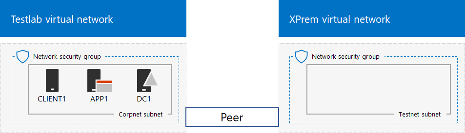

# <a name="simulated-cross-premises-virtual-network-in-a-microsoft-365-test-environment"></a><span data-ttu-id="62553-103">Simulerat virtuellt nätverk på flera platser i en Microsoft 365-testmiljö</span><span class="sxs-lookup"><span data-stu-id="62553-103">Simulated cross-premises virtual network in a Microsoft 365 test environment</span></span>

<span data-ttu-id="62553-104">*Den här testlabbguiden kan användas för både Microsoft 365 för företag Office 365 Enterprise för testmiljöer.*</span><span class="sxs-lookup"><span data-stu-id="62553-104">*This Test Lab Guide can be used for both Microsoft 365 for enterprise and Office 365 Enterprise test environments.*</span></span>

<span data-ttu-id="62553-105">I den här artikeln beskrivs hur du använder Microsoft Azure för att skapa en simulerad, hybridbaserad molnmiljö med två virtuella Azure-nätverk.</span><span class="sxs-lookup"><span data-stu-id="62553-105">This article steps you through creating a simulated hybrid cloud environment with Microsoft Azure using two Azure virtual networks.</span></span> <span data-ttu-id="62553-106">Här är konfigurationsresultatet.</span><span class="sxs-lookup"><span data-stu-id="62553-106">Here is the resulting configuration.</span></span> 
  

  
<span data-ttu-id="62553-108">Den simulerar en hybridbaserad Azure Iaas-produktionsmiljö i molnet och består av:</span><span class="sxs-lookup"><span data-stu-id="62553-108">This simulates an Azure IaaS hybrid cloud production environment and consists of:</span></span>
  
- <span data-ttu-id="62553-109">Ett simulerat och förenklat lokalt nätverk som finns i ett virtuellt Azure-nätverk (det virtuella TestLab-nätverket).</span><span class="sxs-lookup"><span data-stu-id="62553-109">A simulated and simplified on-premises network hosted in an Azure virtual network (the TestLab virtual network).</span></span>
    
- <span data-ttu-id="62553-110">Ett simulerat, virtuellt nätverk för flera platser som lagras i Azure (XPrem).</span><span class="sxs-lookup"><span data-stu-id="62553-110">A simulated cross-premises virtual network hosted in Azure (XPrem).</span></span>
    
- <span data-ttu-id="62553-111">Ett virtuellt nätverk för peeringrelation mellan de två virtuella nätverken.</span><span class="sxs-lookup"><span data-stu-id="62553-111">A VNet peering relationship between the two virtual networks.</span></span>
    
- <span data-ttu-id="62553-112">En sekundär domänkontrollant i det virtuella XPrem-nätverket.</span><span class="sxs-lookup"><span data-stu-id="62553-112">A secondary domain controller in the XPrem virtual network.</span></span>
    
<span data-ttu-id="62553-113">På så sätt får du en grund och en gemensam utgångspunkt från vilken du kan göra följande:</span><span class="sxs-lookup"><span data-stu-id="62553-113">This provides a basis and common starting point from which you can:</span></span> 
  
- <span data-ttu-id="62553-114">Utveckla och testa programmen i en simulerad, hybridbaserad Azure IaaS-molnmiljö.</span><span class="sxs-lookup"><span data-stu-id="62553-114">Develop and test applications in a simulated Azure IaaS hybrid cloud environment.</span></span>
    
- <span data-ttu-id="62553-115">Skapa testkonfigurationer med datorer, där vissa ingår i det virtuella TestLab-nätverket och vissa i det virtuella XPrem-nätverket, för att simulera hybrid- och molnbaserade IT-arbetsbelastningar.</span><span class="sxs-lookup"><span data-stu-id="62553-115">Create test configurations of computers, some within the TestLab virtual network and some within the XPrem virtual network, to simulate hybrid cloud-based IT workloads.</span></span>
    
<span data-ttu-id="62553-116">Konfigurationen av testmiljön består av tre huvudfaser:</span><span class="sxs-lookup"><span data-stu-id="62553-116">There are three major phases to setting up this test environment:</span></span>
  
1. <span data-ttu-id="62553-117">Konfigurera det virtuella TestLab-nätverket.</span><span class="sxs-lookup"><span data-stu-id="62553-117">Configure the TestLab virtual network.</span></span>
    
2. <span data-ttu-id="62553-118">Skapa det virtuella nätverket på flera platser.</span><span class="sxs-lookup"><span data-stu-id="62553-118">Create the cross-premises virtual network.</span></span>
    
3. <span data-ttu-id="62553-119">Konfigurera DC2.</span><span class="sxs-lookup"><span data-stu-id="62553-119">Configure DC2.</span></span>
    
> [!NOTE]
> <span data-ttu-id="62553-120">Konfigurationen kräver en betald Azure-prenumeration.</span><span class="sxs-lookup"><span data-stu-id="62553-120">This configuration requires a paid Azure subscription.</span></span> 

<span data-ttu-id="62553-121">Du kan använda den resulterande miljön för att testa funktionerna i Microsoft 365 för företag [med](https://www.microsoft.com/microsoft-365/enterprise) ytterligare [testlabbguider](m365-enterprise-test-lab-guides.md) eller på egen hand.</span><span class="sxs-lookup"><span data-stu-id="62553-121">You can use the resulting environment to test the features and functionality of [Microsoft 365 for enterprise](https://www.microsoft.com/microsoft-365/enterprise) with additional [Test Lab Guides](m365-enterprise-test-lab-guides.md) or on your own.</span></span>


> [!TIP]
> <span data-ttu-id="62553-123">Gå till [Microsoft 365 för företags testlabbguide](../downloads/Microsoft365EnterpriseTLGStack.pdf) stack för en visuell karta till alla artiklar i Microsoft 365 för företag Test lab guide stack.</span><span class="sxs-lookup"><span data-stu-id="62553-123">Go to [Microsoft 365 for enterprise Test Lab Guide Stack](../downloads/Microsoft365EnterpriseTLGStack.pdf) for a visual map to all the articles in the Microsoft 365 for enterprise Test Lab Guide stack.</span></span>

## <a name="phase-1-configure-the-testlab-virtual-network"></a><span data-ttu-id="62553-124">Fas 1: Konfigurera det virtuella TestLab-nätverket.</span><span class="sxs-lookup"><span data-stu-id="62553-124">Phase 1: Configure the TestLab virtual network</span></span>

<span data-ttu-id="62553-125">Använd anvisningarna i **Fas 1** av [baskonfigurationen för det simulerade företaget](simulated-ent-base-configuration-microsoft-365-enterprise.md) för att konfigurera DC1-, APP1-och KLIENT1-datorerna i det virtuella Azure-nätverket med namnet TestLab.</span><span class="sxs-lookup"><span data-stu-id="62553-125">Use the instructions in **Phase 1** of the [simulated enterprise base configuration](simulated-ent-base-configuration-microsoft-365-enterprise.md) to configure the DC1, APP1, and CLIENT1 computers in the Azure virtual network named TestLab.</span></span>
  
<span data-ttu-id="62553-126">Det här är den aktuella konfigurationen.</span><span class="sxs-lookup"><span data-stu-id="62553-126">This is your current configuration.</span></span> 
  

  
## <a name="phase-2-create-the-xprem-virtual-network"></a><span data-ttu-id="62553-128">Steg 2: Skapa det virtuella XPrem-nätverket</span><span class="sxs-lookup"><span data-stu-id="62553-128">Phase 2: Create the XPrem virtual network</span></span>

<span data-ttu-id="62553-129">I den här fasen skapar och konfigurerar du det nya virtuella XPrem-nätverket och ansluter det sedan till det virtuella TestLab-nätverket med VNet-peering.</span><span class="sxs-lookup"><span data-stu-id="62553-129">In this phase, you create and configure the new XPrem virtual network and then connect it to the TestLab virtual network with VNet peering.</span></span>
  
<span data-ttu-id="62553-130">Starta först en Azure PowerShell-kommandotolk på din lokala dator.</span><span class="sxs-lookup"><span data-stu-id="62553-130">First, start an Azure PowerShell prompt on your local computer.</span></span>
  
> [!NOTE]
> <span data-ttu-id="62553-131">Följande kommandouppsättningar använder den senaste versionen av Azure PowerShell.</span><span class="sxs-lookup"><span data-stu-id="62553-131">The following command sets use the latest version of Azure PowerShell.</span></span> <span data-ttu-id="62553-132">Se [Kom igång med Azure PowerShell-cmdletar](/powershell/azureps-cmdlets-docs/).</span><span class="sxs-lookup"><span data-stu-id="62553-132">See [Get started with Azure PowerShell cmdlets](/powershell/azureps-cmdlets-docs/).</span></span> 
  
<span data-ttu-id="62553-133">Logga in på ditt Azure-konto med det här kommandot.</span><span class="sxs-lookup"><span data-stu-id="62553-133">Sign in to your Azure account with this command.</span></span>
  
```powershell
Connect-AzAccount
```

<span data-ttu-id="62553-134">Hämta ditt prenumerationsnamn med det här kommandot.</span><span class="sxs-lookup"><span data-stu-id="62553-134">Get your subscription name using this command.</span></span>
  
```powershell
Get-AzSubscription | Sort Name | Select Name
```

<span data-ttu-id="62553-135">Ange din Azure-prenumeration.</span><span class="sxs-lookup"><span data-stu-id="62553-135">Set your Azure subscription.</span></span> <span data-ttu-id="62553-136">Ersätt allt inom citattecknen, inklusive \< and >-tecknen med de rätta namnen.</span><span class="sxs-lookup"><span data-stu-id="62553-136">Replace everything within the quotes, including the \< and > characters, with the correct names.</span></span>
  
```powershell
$subscrName="<subscription name>"
Select-AzSubscription -SubscriptionName $subscrName
```

<span data-ttu-id="62553-137">Skapa sedan det virtuella XPrem-nätverket och skydda det med en nätverkssäkerhetsgrupp med dessa kommandon.</span><span class="sxs-lookup"><span data-stu-id="62553-137">Next, create the XPrem virtual network and protect it with a network security group with these commands.</span></span>
  
```powershell
$rgName="<name of the resource group that you used for your TestLab virtual network>"
$locName=(Get-AzResourceGroup -Name $rgName).Location
$Testnet=New-AzVirtualNetworkSubnetConfig -Name "Testnet" -AddressPrefix 192.168.0.0/24
New-AzVirtualNetwork -Name "XPrem" -ResourceGroupName $rgName -Location $locName -AddressPrefix 192.168.0.0/16 -Subnet $Testnet -DNSServer 10.0.0.4
$rule1=New-AzNetworkSecurityRuleConfig -Name "RDPTraffic" -Description "Allow RDP to all VMs on the subnet" -Access Allow -Protocol Tcp -Direction Inbound -Priority 100 -SourceAddressPrefix Internet -SourcePortRange * -DestinationAddressPrefix * -DestinationPortRange 3389
New-AzNetworkSecurityGroup -Name "Testnet" -ResourceGroupName $rgName -Location $locName -SecurityRules $rule1
$vnet=Get-AzVirtualNetwork -ResourceGroupName $rgName -Name XPrem
$nsg=Get-AzNetworkSecurityGroup -Name "Testnet" -ResourceGroupName $rgName
Set-AzVirtualNetworkSubnetConfig -VirtualNetwork $vnet -Name "Testnet" -AddressPrefix 192.168.0.0/24 -NetworkSecurityGroup $nsg
$vnet | Set-AzVirtualNetwork
```

<span data-ttu-id="62553-138">Nästa steg är att skapa ett virtuellt nätverk för peeringrelation mellan de virtuella TestLab- och XPrem-nätverken med dessa kommandon.</span><span class="sxs-lookup"><span data-stu-id="62553-138">Next, you create the VNet peering relationship between the TestLab and XPrem VNets with these commands.</span></span>
  
```powershell
$rgName="<name of the resource group that you used for your TestLab virtual network>"
$vnet1=Get-AzVirtualNetwork -ResourceGroupName $rgName -Name TestLab
$vnet2=Get-AzVirtualNetwork -ResourceGroupName $rgName -Name XPrem
Add-AzVirtualNetworkPeering -Name TestLab2XPrem -VirtualNetwork $vnet1 -RemoteVirtualNetworkId $vnet2.Id
Add-AzVirtualNetworkPeering -Name XPrem2TestLab -VirtualNetwork $vnet2 -RemoteVirtualNetworkId $vnet1.Id
```

<span data-ttu-id="62553-139">Det här är den aktuella konfigurationen.</span><span class="sxs-lookup"><span data-stu-id="62553-139">This is your current configuration.</span></span> 
  

  
## <a name="phase-3-configure-dc2"></a><span data-ttu-id="62553-141">Fas 3: Konfigurera DC2</span><span class="sxs-lookup"><span data-stu-id="62553-141">Phase 3: Configure DC2</span></span>

<span data-ttu-id="62553-142">I den här fasen skapar du den virtuella DC2-datorn i det virtuella XPrem-nätverket och konfigurerar den sedan som en replikeringsdomänkontrollant.</span><span class="sxs-lookup"><span data-stu-id="62553-142">In this phase, you create the DC2 virtual machine in the XPrem virtual network and then configure it as a replica domain controller.</span></span>
  
<span data-ttu-id="62553-143">Börja med att skapa en virtuell dator för DC2.</span><span class="sxs-lookup"><span data-stu-id="62553-143">First, create a virtual machine for DC2.</span></span> <span data-ttu-id="62553-144">Kör dessa kommandon i Azure PowerShell-kommandotolken på din lokala dator.</span><span class="sxs-lookup"><span data-stu-id="62553-144">Run these commands at the Azure PowerShell command prompt on your local computer.</span></span>
  
```powershell
$rgName="<your resource group name>"
$locName=(Get-AzResourceGroup -Name $rgName).Location
$vnet=Get-AzVirtualNetwork -Name XPrem -ResourceGroupName $rgName
$pip=New-AzPublicIpAddress -Name DC2-PIP -ResourceGroupName $rgName -Location $locName -AllocationMethod Dynamic
$nic=New-AzNetworkInterface -Name DC2-NIC -ResourceGroupName $rgName -Location $locName -SubnetId $vnet.Subnets[0].Id -PublicIpAddressId $pip.Id -PrivateIpAddress 192.168.0.4
$vm=New-AzVMConfig -VMName DC2 -VMSize Standard_A2_V2
$cred=Get-Credential -Message "Type the name and password of the local administrator account for DC2."
$vm=Set-AzVMOperatingSystem -VM $vm -Windows -ComputerName DC2 -Credential $cred -ProvisionVMAgent -EnableAutoUpdate
$vm=Set-AzVMSourceImage -VM $vm -PublisherName MicrosoftWindowsServer -Offer WindowsServer -Skus 2016-Datacenter -Version "latest"
$vm=Add-AzVMNetworkInterface -VM $vm -Id $nic.Id
$vm=Set-AzVMOSDisk -VM $vm -Name "DC2-OS" -DiskSizeInGB 128 -CreateOption FromImage -StorageAccountType "Standard_LRS"
$diskConfig=New-AzDiskConfig -AccountType "Standard_LRS" -Location $locName -CreateOption Empty -DiskSizeGB 20
$dataDisk1=New-AzDisk -DiskName "DC2-DataDisk1" -Disk $diskConfig -ResourceGroupName $rgName
$vm=Add-AzVMDataDisk -VM $vm -Name "DC2-DataDisk1" -CreateOption Attach -ManagedDiskId $dataDisk1.Id -Lun 1
New-AzVM -ResourceGroupName $rgName -Location $locName -VM $vm
```

<span data-ttu-id="62553-145">Anslut sedan till den nya, virtuella DC2-datorn från [Azure-portalen](https://portal.azure.com) med hjälp av den lokala administratörens kontonamn och lösenord.</span><span class="sxs-lookup"><span data-stu-id="62553-145">Next, connect to the new DC2 virtual machine from the [Azure portal](https://portal.azure.com) using its local administrator account name and password.</span></span>
  
<span data-ttu-id="62553-146">Därefter konfigurerar du en Windows-brandväggsregel för att tillåta trafik för grundläggande anslutningstester.</span><span class="sxs-lookup"><span data-stu-id="62553-146">Next, configure a Windows Firewall rule to allow traffic for basic connectivity testing.</span></span> <span data-ttu-id="62553-147">Kör de här kommandona i en Windows PowerShell-kommandotolk på DC2 på administratörsnivå.</span><span class="sxs-lookup"><span data-stu-id="62553-147">From an administrator-level Windows PowerShell command prompt on DC2, run these commands.</span></span> 
  
```powershell
Set-NetFirewallRule -DisplayName "File and Printer Sharing (Echo Request - ICMPv4-In)" -enabled True
ping dc1.corp.contoso.com
```

<span data-ttu-id="62553-148">Ping-kommandot ska resultera i fyra lyckade svar från IP-adressen 10.0.0.4.</span><span class="sxs-lookup"><span data-stu-id="62553-148">The ping command should result in four successful replies from IP address 10.0.0.4.</span></span> <span data-ttu-id="62553-149">Det här är ett test av trafiken i det virtuella nätverket för peeringrelation.</span><span class="sxs-lookup"><span data-stu-id="62553-149">This is a test of traffic across the VNet peering relationship.</span></span> 
  
<span data-ttu-id="62553-150">Lägg sedan till den extra datadisken som en ny volym med enhetsbokstaven F: med det här kommandot i Windows PowerShell-kommandotolken på DC2.</span><span class="sxs-lookup"><span data-stu-id="62553-150">Next, add the extra data disk as a new volume with the drive letter F: with this command from the Windows PowerShell command prompt on DC2.</span></span>
  
```powershell
Get-Disk | Where PartitionStyle -eq "RAW" | Initialize-Disk -PartitionStyle MBR -PassThru | New-Partition -AssignDriveLetter -UseMaximumSize | Format-Volume -FileSystem NTFS -NewFileSystemLabel "WSAD Data"
```

<span data-ttu-id="62553-151">Därefter konfigurerar du DC2 som en replikeringsdomänkontrollant för domänen corp.contoso.com.</span><span class="sxs-lookup"><span data-stu-id="62553-151">Next, configure DC2 as a replica domain controller for the corp.contoso.com domain.</span></span> <span data-ttu-id="62553-152">Kör de här kommandona i Windows PowerShell-kommandotolken på DC2.</span><span class="sxs-lookup"><span data-stu-id="62553-152">Run these commands from the Windows PowerShell command prompt on DC2.</span></span>
  
```powershell
Install-WindowsFeature AD-Domain-Services -IncludeManagementTools
Install-ADDSDomainController -Credential (Get-Credential CORP\User1) -DomainName "corp.contoso.com" -InstallDns:$true -DatabasePath "F:\NTDS" -LogPath "F:\Logs" -SysvolPath "F:\SYSVOL"
```

<span data-ttu-id="62553-153">Observera att du uppmanas att ange både lösenordet CORP\\User1 och ett lösenord för återställningsläge för katalogtjänster, och att starta om DC2.</span><span class="sxs-lookup"><span data-stu-id="62553-153">Note that you are prompted to supply both the CORP\\User1 password and a Directory Services Restore Mode (DSRM) password, and to restart DC2.</span></span> 
  
<span data-ttu-id="62553-154">När det virtuella XPrem-nätverket nu har en egen DNS-server (DC2) måste du konfigurera det virtuella XPrem-nätverket så att det använder DNS-servern.</span><span class="sxs-lookup"><span data-stu-id="62553-154">Now that the XPrem virtual network has its own DNS server (DC2), you must configure the XPrem virtual network to use this DNS server.</span></span> <span data-ttu-id="62553-155">Kör dessa kommandon i Azure PowerShell-kommandotolken på din lokala dator.</span><span class="sxs-lookup"><span data-stu-id="62553-155">Run these commands from the Azure PowerShell command prompt on your local computer.</span></span>
  
```powershell
$vnet=Get-AzVirtualNetwork -ResourceGroupName $rgName -name "XPrem"
$vnet.DhcpOptions.DnsServers="192.168.0.4" 
Set-AzVirtualNetwork -VirtualNetwork $vnet
Restart-AzVM -ResourceGroupName $rgName -Name "DC2"
```

<span data-ttu-id="62553-156">Från Azure-portalen på din lokala dator ansluter du till DC1 med autentiseringsuppgifterna CORP\\User1.</span><span class="sxs-lookup"><span data-stu-id="62553-156">From the Azure portal on your local computer, connect to DC1 with the CORP\\User1 credentials.</span></span> <span data-ttu-id="62553-157">Om du vill konfigurera CORP-domänen så att datorerna och användarna använder den lokala domänkontrollanten för autentisering kör du dessa kommandon från en Windows PowerShell-kommandotolk på administratörsnivå på DC1.</span><span class="sxs-lookup"><span data-stu-id="62553-157">To configure the CORP domain so that computers and users use their local domain controller for authentication, run these commands from an administrator-level Windows PowerShell command prompt on DC1.</span></span>
  
```powershell
New-ADReplicationSite -Name "TestLab" 
New-ADReplicationSite -Name "XPrem"
New-ADReplicationSubnet -Name "10.0.0.0/8" -Site "TestLab"
New-ADReplicationSubnet -Name "192.168.0.0/16" -Site "XPrem"
```

<span data-ttu-id="62553-158">Det här är den aktuella konfigurationen.</span><span class="sxs-lookup"><span data-stu-id="62553-158">This is your current configuration.</span></span> 
  

  
<span data-ttu-id="62553-160">Din simulerade Azure-hybridmolnmiljö är nu redo att testas.</span><span class="sxs-lookup"><span data-stu-id="62553-160">Your simulated Azure hybrid cloud environment is now ready for testing.</span></span>
  
<span data-ttu-id="62553-161">Du är nu redo att experimentera med ytterligare funktioner i [Microsoft 365 för företag.](https://www.microsoft.com/microsoft-365/enterprise)</span><span class="sxs-lookup"><span data-stu-id="62553-161">You are now ready to experiment with additional features of [Microsoft 365 for enterprise](https://www.microsoft.com/microsoft-365/enterprise).</span></span>
  
## <a name="next-steps"></a><span data-ttu-id="62553-162">Nästa steg</span><span class="sxs-lookup"><span data-stu-id="62553-162">Next steps</span></span>

<span data-ttu-id="62553-163">Utforska dessa ytterligare uppsättningar testlabbguider:</span><span class="sxs-lookup"><span data-stu-id="62553-163">Explore these additional sets of Test Lab Guides:</span></span>
  
- [<span data-ttu-id="62553-164">Identitet</span><span class="sxs-lookup"><span data-stu-id="62553-164">Identity</span></span>](m365-enterprise-test-lab-guides.md#identity)
- [<span data-ttu-id="62553-165">Hantering av mobila enheter</span><span class="sxs-lookup"><span data-stu-id="62553-165">Mobile device management</span></span>](m365-enterprise-test-lab-guides.md#mobile-device-management)
- [<span data-ttu-id="62553-166">Informationsskydd</span><span class="sxs-lookup"><span data-stu-id="62553-166">Information protection</span></span>](m365-enterprise-test-lab-guides.md#information-protection)

## <a name="see-also"></a><span data-ttu-id="62553-167">Se även</span><span class="sxs-lookup"><span data-stu-id="62553-167">See also</span></span>

[<span data-ttu-id="62553-168">Testlabbguider för Microsoft 365 för företag</span><span class="sxs-lookup"><span data-stu-id="62553-168">Microsoft 365 for enterprise Test Lab Guides</span></span>](m365-enterprise-test-lab-guides.md)

[<span data-ttu-id="62553-169">Översikt över Microsoft 365 för företag</span><span class="sxs-lookup"><span data-stu-id="62553-169">Microsoft 365 for enterprise overview</span></span>](microsoft-365-overview.md)

[<span data-ttu-id="62553-170">Dokumentation om Microsoft 365 för företag</span><span class="sxs-lookup"><span data-stu-id="62553-170">Microsoft 365 for enterprise documentation</span></span>](/microsoft-365-enterprise/)