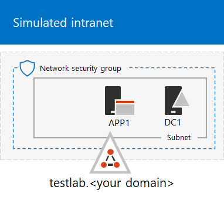

# <a name="the-simulated-enterprise-base-configuration"></a><span data-ttu-id="b405c-103">Baskonfiguration för simulerat företag</span><span class="sxs-lookup"><span data-stu-id="b405c-103">The simulated enterprise base configuration</span></span>

<span data-ttu-id="b405c-104">*Den här testlabbguiden kan användas för både Microsoft 365 för företag Office 365 Enterprise för testmiljöer.*</span><span class="sxs-lookup"><span data-stu-id="b405c-104">*This Test Lab Guide can be used for both Microsoft 365 for enterprise and Office 365 Enterprise test environments.*</span></span>

<span data-ttu-id="b405c-105">I den här artikeln beskrivs hur du skapar en förenklad miljö för Microsoft 365 företag som innehåller:</span><span class="sxs-lookup"><span data-stu-id="b405c-105">This article describes how to create a simplified environment for Microsoft 365 for enterprise that includes:</span></span>

- <span data-ttu-id="b405c-106">En utvärderingsprenumeration eller betald prenumeration på Microsoft 365 E5.</span><span class="sxs-lookup"><span data-stu-id="b405c-106">A Microsoft 365 E5 trial or paid subscription.</span></span>
- <span data-ttu-id="b405c-107">Ett förenklat organisations intranät som är anslutet till internet och består av tre virtuella datorer i ett virtuellt Azure-nätverk (DC1, APP1 och CLIENT1).</span><span class="sxs-lookup"><span data-stu-id="b405c-107">A simplified organization intranet connected to the internet, consisting of three virtual machines on an Azure virtual network (DC1, APP1, and CLIENT1).</span></span>
 


<span data-ttu-id="b405c-109">Att skapa en förenklad testmiljö omfattar två faser:</span><span class="sxs-lookup"><span data-stu-id="b405c-109">Creating a simplified test environment involves two phases:</span></span>
- [<span data-ttu-id="b405c-110">Fas 1: Skapa ett simulerat intranät</span><span class="sxs-lookup"><span data-stu-id="b405c-110">Phase 1: Create a simulated intranet</span></span>](#phase-1-create-a-simulated-intranet)
- [<span data-ttu-id="b405c-111">Fas 2: Skapa en Microsoft 365 E5-prenumeration</span><span class="sxs-lookup"><span data-stu-id="b405c-111">Phase 2: Create your Microsoft 365 E5 subscription</span></span>](#phase-2-create-your-microsoft-365-e5-subscription)

<span data-ttu-id="b405c-112">Du kan använda den resulterande miljön för att testa funktionerna i Microsoft 365 för företag [med](https://www.microsoft.com/microsoft-365/enterprise) ytterligare [testlabbguider](m365-enterprise-test-lab-guides.md) eller på egen hand.</span><span class="sxs-lookup"><span data-stu-id="b405c-112">You can use the resulting environment to test the features and functionality of [Microsoft 365 for enterprise](https://www.microsoft.com/microsoft-365/enterprise) with additional [Test Lab Guides](m365-enterprise-test-lab-guides.md) or on your own.</span></span>


> [!TIP]
> <span data-ttu-id="b405c-114">En visuell karta till alla artiklar i Microsoft 365 för företags testlabbguide stack finns i [Microsoft 365 för företags testlabbguide stack](../downloads/Microsoft365EnterpriseTLGStack.pdf).</span><span class="sxs-lookup"><span data-stu-id="b405c-114">For a visual map to all the articles in the Microsoft 365 for enterprise Test Lab Guide stack, go to [Microsoft 365 for enterprise Test Lab Guide Stack](../downloads/Microsoft365EnterpriseTLGStack.pdf).</span></span>

## <a name="phase-1-create-a-simulated-intranet"></a><span data-ttu-id="b405c-115">Fas 1: Skapa ett simulerat intranät</span><span class="sxs-lookup"><span data-stu-id="b405c-115">Phase 1: Create a simulated intranet</span></span>

<span data-ttu-id="b405c-116">I den här fasen ska du bygga ett simulerat intranät i Azure-infrastrukturtjänster som innehåller en AD DS-domänkontrollant (Active Directory Domain Services), en programserver och en klientdator.</span><span class="sxs-lookup"><span data-stu-id="b405c-116">In this phase, build a simulated intranet in Azure infrastructure services that includes an Active Directory Domain Services (AD DS) domain controller, an application server, and a client computer.</span></span>

<span data-ttu-id="b405c-117">Du kommer att använda dessa datorer i ytterligare [Microsoft 365 testlabbguider](m365-enterprise-test-lab-guides.md) för att konfigurera och visa hybrididentitet och andra funktioner.</span><span class="sxs-lookup"><span data-stu-id="b405c-117">You'll use these computers in additional [Microsoft 365 for enterprise Test Lab Guides](m365-enterprise-test-lab-guides.md) to configure and demonstrate hybrid identity and other capabilities.</span></span>

### <a name="method-1-build-your-simulated-intranet-with-an-azure-resource-manager-template"></a><span data-ttu-id="b405c-118">Metod 1: Skapa det simulerade intranätet med en Azure Resource Manager-mall</span><span class="sxs-lookup"><span data-stu-id="b405c-118">Method 1: Build your simulated intranet with an Azure Resource Manager template</span></span>

<span data-ttu-id="b405c-119">Med den här metoden använder du en Azure Resource Manager-mall för att bygga ut det simulerade intranätet.</span><span class="sxs-lookup"><span data-stu-id="b405c-119">In this method, you use an Azure Resource Manager template to build out the simulated intranet.</span></span> <span data-ttu-id="b405c-120">Azure Resource Manager-mallarna innehåller alla instruktioner för att skapa Azure-nätverksinfrastrukturen, virtuella maskinerna och deras konfiguration.</span><span class="sxs-lookup"><span data-stu-id="b405c-120">Azure Resource Manager templates contain all of the instructions to create the Azure networking infrastructure, the virtual machines, and their configuration.</span></span>

<span data-ttu-id="b405c-121">Innan du distribuerar mallen bör du läsa [igenom mallens LÄSME-sida](https://github.com/maxskunkworks/TLG/tree/master/tlg-base-config_3-vm.m365-ems) och ha följande information klar:</span><span class="sxs-lookup"><span data-stu-id="b405c-121">Before deploying the template, read through the [template README page](https://github.com/maxskunkworks/TLG/tree/master/tlg-base-config_3-vm.m365-ems) and have the following information ready:</span></span>

- <span data-ttu-id="b405c-122">Testmiljöns namn på den offentliga DNS-domänen (testlab.\<*your public domain*>)</span><span class="sxs-lookup"><span data-stu-id="b405c-122">The public DNS domain name of your test environment (testlab.\<*your public domain*>).</span></span> <span data-ttu-id="b405c-123">Du anger det här namnet i **fältet Domännamn** på sidan **Anpassad** distribution.</span><span class="sxs-lookup"><span data-stu-id="b405c-123">You'll enter this name in the **Domain Name** field of the **Custom deployment** page.</span></span>
- <span data-ttu-id="b405c-124">Ett DNS-etikettprefix för URL:erna för de virtuella datorernas offentliga IP-adresser.</span><span class="sxs-lookup"><span data-stu-id="b405c-124">A DNS label prefix for the URLs of the public IP addresses of your virtual machines.</span></span> <span data-ttu-id="b405c-125">Du måste ange det här namnet i fältet **Dns Label Prefix** (DNS-etikettprefix) på sidan **Custom deployment** (Anpassad distribution).</span><span class="sxs-lookup"><span data-stu-id="b405c-125">You'll need to enter this label in the **Dns Label Prefix** field of the **Custom deployment** page.</span></span>

<span data-ttu-id="b405c-126">När du har läst anvisningarna väljer du **Distribuera till Azure** på [readme-sidan för att](https://github.com/maxskunkworks/TLG/tree/master/tlg-base-config_3-vm.m365-ems) komma igång.</span><span class="sxs-lookup"><span data-stu-id="b405c-126">After you read through the instructions, select **Deploy to Azure** on the [template README page](https://github.com/maxskunkworks/TLG/tree/master/tlg-base-config_3-vm.m365-ems) to get started.</span></span>

>[!Note]
><span data-ttu-id="b405c-127">Det simulerade intranätet som byggs med Azure Resurshanteraren-mallen kräver en betald Azure-prenumeration.</span><span class="sxs-lookup"><span data-stu-id="b405c-127">The simulated intranet built by the Azure Resource Manager template requires a paid Azure subscription.</span></span>

<span data-ttu-id="b405c-128">När mallen är klar ser konfigurationen ut så här:</span><span class="sxs-lookup"><span data-stu-id="b405c-128">After the template is complete, your configuration looks like this:</span></span>


### <a name="method-2-build-your-simulated-intranet-with-azure-powershell"></a><span data-ttu-id="b405c-130">Metod 2: Skapa det simulerade intranätet med Azure PowerShell</span><span class="sxs-lookup"><span data-stu-id="b405c-130">Method 2: Build your simulated intranet with Azure PowerShell</span></span>

<span data-ttu-id="b405c-131">I den här metoden använder du Windows PowerShell och Azure PowerShell-modulen till att bygga upp nätverksinfrastrukturen, de virtuella datorerna och deras konfiguration.</span><span class="sxs-lookup"><span data-stu-id="b405c-131">In this method, you use Windows PowerShell and the Azure PowerShell module to build out the networking infrastructure, the virtual machines, and their configuration.</span></span>

<span data-ttu-id="b405c-132">Använd den här metoden om du vill skaffa dig erfarenhet av att skapa element i Azure-infrastrukturen ett steg i taget med PowerShell.</span><span class="sxs-lookup"><span data-stu-id="b405c-132">Use this method if you want to get experience creating elements of Azure infrastructure one step at a time with PowerShell.</span></span> <span data-ttu-id="b405c-133">Du kan sedan anpassa PowerShell-kommandoblocken för din egen distribution av andra virtuella datorer i Azure.</span><span class="sxs-lookup"><span data-stu-id="b405c-133">You can then customize the PowerShell command blocks for your own deployment of other virtual machines in Azure.</span></span>

#### <a name="step-1-create-dc1"></a><span data-ttu-id="b405c-134">Steg 1: Skapa DC1</span><span class="sxs-lookup"><span data-stu-id="b405c-134">Step 1: Create DC1</span></span>

<span data-ttu-id="b405c-135">I det här steget skapar du ett virtuellt Azure-nätverk och lägger till DC1, en virtuell dator som är en domänkontrollant för en AD DS-domän.</span><span class="sxs-lookup"><span data-stu-id="b405c-135">In this step, you create an Azure virtual network and add DC1, a virtual machine that is a domain controller for an AD DS domain.</span></span>

<span data-ttu-id="b405c-136">Starta först en Windows PowerShell-kommandotolk på din lokala dator.</span><span class="sxs-lookup"><span data-stu-id="b405c-136">First, start a Windows PowerShell command prompt on your local computer.</span></span>
  
> [!NOTE]
> <span data-ttu-id="b405c-137">Följande kommandouppsättningar använder den senaste versionen av Azure PowerShell.</span><span class="sxs-lookup"><span data-stu-id="b405c-137">The following command sets use the latest version of Azure PowerShell.</span></span> <span data-ttu-id="b405c-138">Se [Kom igång med Azure PowerShell-cmdletar](/powershell/azureps-cmdlets-docs/).</span><span class="sxs-lookup"><span data-stu-id="b405c-138">See [Get started with Azure PowerShell cmdlets](/powershell/azureps-cmdlets-docs/).</span></span> 
  
<span data-ttu-id="b405c-139">Logga in på ditt Azure-konto med följande kommando.</span><span class="sxs-lookup"><span data-stu-id="b405c-139">Sign in to your Azure account with the following command.</span></span>
  
```powershell
Connect-AzAccount
```

<span data-ttu-id="b405c-140">Hämta ditt prenumerationsnamn med följande kommando.</span><span class="sxs-lookup"><span data-stu-id="b405c-140">Get your subscription name using the following command.</span></span>
  
```powershell
Get-AzSubscription | Sort Name | Select Name
```

<span data-ttu-id="b405c-141">Ange din Azure-prenumeration.</span><span class="sxs-lookup"><span data-stu-id="b405c-141">Set your Azure subscription.</span></span> <span data-ttu-id="b405c-142">Ersätt allt inom citattecknen, inklusive vinkelparenteserna ("<" och ">"), med rätt namn.</span><span class="sxs-lookup"><span data-stu-id="b405c-142">Replace everything within the quotation marks, including the angle brackets ("<" and ">"), with the correct name.</span></span>
  
```powershell
$subscr="<subscription name>"
Get-AzSubscription -SubscriptionName $subscr | Select-AzSubscription
```

<span data-ttu-id="b405c-143">Skapa sedan en ny resursgrupp för det simulerade företagstestlabbet.</span><span class="sxs-lookup"><span data-stu-id="b405c-143">Next, create a new resource group for your simulated enterprise test lab.</span></span> <span data-ttu-id="b405c-144">Använd det är kommandot för att lista dina befintliga resursgrupper när du ska fastställa ett unikt resursgruppnamn.</span><span class="sxs-lookup"><span data-stu-id="b405c-144">To determine a unique resource group name, use this command to list your existing resource groups.</span></span>
  
```powershell
Get-AzResourceGroup | Sort ResourceGroupName | Select ResourceGroupName
```

<span data-ttu-id="b405c-145">Skapa den nya resursgruppen med dessa kommandon.</span><span class="sxs-lookup"><span data-stu-id="b405c-145">Create your new resource group with these commands.</span></span> <span data-ttu-id="b405c-146">Ersätt allt inom citattecknen, inklusive vinkelparenteserna, med rätt namn.</span><span class="sxs-lookup"><span data-stu-id="b405c-146">Replace everything within the quotation marks, including the angle brackets, with the correct names.</span></span>
  
```powershell
$rgName="<resource group name>"
$locName="<location name, such as West US>"
New-AzResourceGroup -Name $rgName -Location $locName
```

<span data-ttu-id="b405c-147">Skapa sedan det virtuella TestLab-nätverket som är värd för företagsnätverksundernätet i den simulerade företagsmiljön och skydda det med en nätverkssäkerhetsgrupp.</span><span class="sxs-lookup"><span data-stu-id="b405c-147">Next, create the TestLab virtual network that will host the corporate network subnet of the simulated enterprise environment and protect it with a network security group.</span></span> <span data-ttu-id="b405c-148">Fyll i namnet på resursgruppen och kör dessa kommandon vid kommandotolken i PowerShell på din lokala dator.</span><span class="sxs-lookup"><span data-stu-id="b405c-148">Fill in the name of your resource group and run these commands at the PowerShell command prompt on your local computer.</span></span>
  
```powershell
$rgName="<name of your new resource group>"
$locName=(Get-AzResourceGroup -Name $rgName).Location
$corpnetSubnet=New-AzVirtualNetworkSubnetConfig -Name Corpnet -AddressPrefix 10.0.0.0/24
New-AzVirtualNetwork -Name TestLab -ResourceGroupName $rgName -Location $locName -AddressPrefix 10.0.0.0/8 -Subnet $corpnetSubnet -DNSServer 10.0.0.4
$rule1=New-AzNetworkSecurityRuleConfig -Name "RDPTraffic" -Description "Allow RDP to all VMs on the subnet" -Access Allow -Protocol Tcp -Direction Inbound -Priority 100 -SourceAddressPrefix Internet -SourcePortRange * -DestinationAddressPrefix * -DestinationPortRange 3389
New-AzNetworkSecurityGroup -Name Corpnet -ResourceGroupName $rgName -Location $locName -SecurityRules $rule1
$vnet=Get-AzVirtualNetwork -ResourceGroupName $rgName -Name TestLab
$nsg=Get-AzNetworkSecurityGroup -Name Corpnet -ResourceGroupName $rgName
Set-AzVirtualNetworkSubnetConfig -VirtualNetwork $vnet -Name Corpnet -AddressPrefix "10.0.0.0/24" -NetworkSecurityGroup $nsg
$vnet | Set-AzVirtualNetwork
```

<span data-ttu-id="b405c-149">Nästa steg är att skapa den virtuella DC1-datorn och konfigurera den som domänkontrollant för **testlab.**\<your public domain></span><span class="sxs-lookup"><span data-stu-id="b405c-149">Next, you create the DC1 virtual machine and configure it as a domain controller for the **testlab.**\<your public domain></span></span> <span data-ttu-id="b405c-150">AD DS-domän och en DNS-server för de virtuella datorerna i TestLabs virtuella nätverk.</span><span class="sxs-lookup"><span data-stu-id="b405c-150">AD DS domain and a DNS server for the virtual machines of the TestLab virtual network.</span></span> <span data-ttu-id="b405c-151">Exempel: Om namnet på din offentliga domän är **<span>contoso</span>.com** blir den virtuella datorn DC1 domänkontrollant för domänen **<span>testlab</span>.contoso.com**.</span><span class="sxs-lookup"><span data-stu-id="b405c-151">For example, if your public domain name is **<span>contoso</span>.com**, the DC1 virtual machine will be a domain controller for the **<span>testlab</span>.contoso.com** domain.</span></span>
  
<span data-ttu-id="b405c-152">Om du vill skapa en virtuell Azure-dator för DC1 fyller du i namnet på din resursgrupp och kör dessa kommandon vid kommandotolken i PowerShell på din lokala dator.</span><span class="sxs-lookup"><span data-stu-id="b405c-152">To create an Azure virtual machine for DC1, fill in the name of your resource group and run these commands at the PowerShell command prompt on your local computer.</span></span>
  
```powershell
$rgName="<resource group name>"
$locName=(Get-AzResourceGroup -Name $rgName).Location
$vnet=Get-AzVirtualNetwork -Name TestLab -ResourceGroupName $rgName
$pip=New-AzPublicIpAddress -Name DC1-PIP -ResourceGroupName $rgName -Location $locName -AllocationMethod Dynamic
$nic=New-AzNetworkInterface -Name DC1-NIC -ResourceGroupName $rgName -Location $locName -SubnetId $vnet.Subnets[0].Id -PublicIpAddressId $pip.Id -PrivateIpAddress 10.0.0.4
$vm=New-AzVMConfig -VMName DC1 -VMSize Standard_A2_V2
$cred=Get-Credential -Message "Type the name and password of the local administrator account for DC1."
$vm=Set-AzVMOperatingSystem -VM $vm -Windows -ComputerName DC1 -Credential $cred -ProvisionVMAgent -EnableAutoUpdate
$vm=Set-AzVMSourceImage -VM $vm -PublisherName MicrosoftWindowsServer -Offer WindowsServer -Skus 2016-Datacenter -Version "latest"
$vm=Add-AzVMNetworkInterface -VM $vm -Id $nic.Id
$vm=Set-AzVMOSDisk -VM $vm -Name "DC1-OS" -DiskSizeInGB 128 -CreateOption FromImage
$diskConfig=New-AzDiskConfig -AccountType "Standard_LRS" -Location $locName -CreateOption Empty -DiskSizeGB 20
$dataDisk1=New-AzDisk -DiskName "DC1-DataDisk1" -Disk $diskConfig -ResourceGroupName $rgName
$vm=Add-AzVMDataDisk -VM $vm -Name "DC1-DataDisk1" -CreateOption Attach -ManagedDiskId $dataDisk1.Id -Lun 1
New-AzVM -ResourceGroupName $rgName -Location $locName -VM $vm
```

<span data-ttu-id="b405c-153">Du uppmanas att ange ett användarnamn och lösenord för det lokala administratörskontot på DC1.</span><span class="sxs-lookup"><span data-stu-id="b405c-153">You will be prompted for a user name and password for the local administrator account on DC1.</span></span> <span data-ttu-id="b405c-154">Använd ett starkt lösenord och spara både namnet och lösenordet på en säker plats.</span><span class="sxs-lookup"><span data-stu-id="b405c-154">Use a strong password and record both the name and password in a secure location.</span></span>
  
<span data-ttu-id="b405c-155">Anslut sedan till den virtuella DC1-datorn:</span><span class="sxs-lookup"><span data-stu-id="b405c-155">Next, connect to the DC1 virtual machine:</span></span>
  
1. <span data-ttu-id="b405c-156">Välj [Resursgrupper i](https://portal.azure.com) **Azure-portalen > <** namnet på den nya **_resursgruppen_ _ *> > _* DC1-Anslut**  >  .</span><span class="sxs-lookup"><span data-stu-id="b405c-156">In the [Azure portal](https://portal.azure.com), select **Resource Groups** > <**_the name of your new resource group_*_> > _\* DC1*\* > **Connect**.</span></span>
    
2. <span data-ttu-id="b405c-157">I det öppna fönstret väljer du Ladda **ned RDP-fil**.</span><span class="sxs-lookup"><span data-stu-id="b405c-157">In the open pane, select **Download RDP file**.</span></span> <span data-ttu-id="b405c-158">Öppna DC1.rdp-filen som laddas ned och välj sedan **Anslut**.</span><span class="sxs-lookup"><span data-stu-id="b405c-158">Open the DC1.rdp file that is downloaded, and then select **Connect**.</span></span>
    
3. <span data-ttu-id="b405c-159">Ange namnet på det lokala administratörskontot för DC1:</span><span class="sxs-lookup"><span data-stu-id="b405c-159">Specify the DC1 local administrator account name:</span></span>
    
   - <span data-ttu-id="b405c-160">I Windows 7:</span><span class="sxs-lookup"><span data-stu-id="b405c-160">For Windows 7:</span></span>
    
     <span data-ttu-id="b405c-161">I dialogrutan **Windows-säkerhet** väljer du Använd **ett annat konto**.</span><span class="sxs-lookup"><span data-stu-id="b405c-161">In the **Windows Security** dialog box, select **Use another account**.</span></span> <span data-ttu-id="b405c-162">I **Användarnamn anger du** namnet på det lokala **\\** < DC1-administratörskontot>.</span><span class="sxs-lookup"><span data-stu-id="b405c-162">In **User name**, enter **DC1\\**<*local administrator account name*>.</span></span>
    
   - <span data-ttu-id="b405c-163">För Windows 8 eller Windows 10:</span><span class="sxs-lookup"><span data-stu-id="b405c-163">For Windows 8 or Windows 10:</span></span>
    
     <span data-ttu-id="b405c-164">I **Windows-säkerhet** väljer du Fler **alternativ** och sedan Använd **ett annat konto.**</span><span class="sxs-lookup"><span data-stu-id="b405c-164">In the **Windows Security** dialog box, select **More choices**, and then select **Use a different account**.</span></span> <span data-ttu-id="b405c-165">I **Användarnamn anger du** namnet på det lokala **\\** < DC1-administratörskontot>.</span><span class="sxs-lookup"><span data-stu-id="b405c-165">In **User name**, enter **DC1\\**<*local administrator account name*>.</span></span>
    
4. <span data-ttu-id="b405c-166">I **Lösenord** anger du lösenordet för det lokala administratörskontot och väljer sedan **OK.**</span><span class="sxs-lookup"><span data-stu-id="b405c-166">In **Password**, enter the password of the local administrator account, and then select **OK**.</span></span>
    
5. <span data-ttu-id="b405c-167">Välj Ja när du uppmanas att **göra det.**</span><span class="sxs-lookup"><span data-stu-id="b405c-167">When prompted, select **Yes**.</span></span>
    
<span data-ttu-id="b405c-168">Lägg sedan till en extra datadisk som en ny volym med enhetsbokstaven F: med det här kommandot i Windows PowerShell-kommandotolk på administratörsnivå på DC1.</span><span class="sxs-lookup"><span data-stu-id="b405c-168">Next, add an extra data disk as a new volume with the drive letter F: with this command at an administrator-level Windows PowerShell command prompt on DC1.</span></span>
  
```powershell
Get-Disk | Where PartitionStyle -eq "RAW" | Initialize-Disk -PartitionStyle MBR -PassThru | New-Partition -AssignDriveLetter -UseMaximumSize | Format-Volume -FileSystem NTFS -NewFileSystemLabel "WSAD Data"
```

<span data-ttu-id="b405c-169">Konfigurera sedan DC1 som domänkontrollant och DNS-server för domänen **testlab.**\<*your public domain*></span><span class="sxs-lookup"><span data-stu-id="b405c-169">Next, configure DC1 as a domain controller and DNS server for the **testlab.**\<*your public domain*></span></span> <span data-ttu-id="b405c-170">domän.</span><span class="sxs-lookup"><span data-stu-id="b405c-170">domain.</span></span> <span data-ttu-id="b405c-171">Ange ditt offentliga domännamn, ta bort vinkelparenteserna och kör sedan dessa kommandon på en administratörsnivå Windows PowerShell kommandotolken i DC1.</span><span class="sxs-lookup"><span data-stu-id="b405c-171">Specify your public domain name, remove the angle brackets, and then run these commands at an administrator-level Windows PowerShell command prompt on DC1.</span></span>
  
```powershell
$yourDomain="<your public domain>"
Install-WindowsFeature AD-Domain-Services -IncludeManagementTools
Install-ADDSForest -DomainName testlab.$yourDomain -DatabasePath "F:\NTDS" -SysvolPath "F:\SYSVOL" -LogPath "F:\Logs"
```
<span data-ttu-id="b405c-172">Du måste ange ett administratörslösenord för felsäkert läge.</span><span class="sxs-lookup"><span data-stu-id="b405c-172">You will need to specify a safe mode administrator password.</span></span> <span data-ttu-id="b405c-173">Spara lösenordet på en säker plats.</span><span class="sxs-lookup"><span data-stu-id="b405c-173">Store this password in a secure location.</span></span>
  
<span data-ttu-id="b405c-174">Observera att dessa kommandon kan ta några minuter att slutföra.</span><span class="sxs-lookup"><span data-stu-id="b405c-174">Note that these commands can take a few minutes to complete.</span></span>
  
<span data-ttu-id="b405c-175">När DC1 har startat om återansluter du till den virtuella datorn DC1.</span><span class="sxs-lookup"><span data-stu-id="b405c-175">After DC1 restarts, reconnect to the DC1 virtual machine.</span></span>
  
1. <span data-ttu-id="b405c-176">I [Azure-portalen](https://portal.azure.com)väljer du **Resursgrupper > <** *resursgruppnamnet> >*   >  **DC1-Anslut.**</span><span class="sxs-lookup"><span data-stu-id="b405c-176">In the [Azure portal](https://portal.azure.com), select **Resource Groups** > <*your resource group name*> > **DC1** > **Connect**.</span></span>
    
2. <span data-ttu-id="b405c-177">Kör DC1.rdp-filen som laddas ned och välj sedan **Anslut**.</span><span class="sxs-lookup"><span data-stu-id="b405c-177">Run the DC1.rdp file that is downloaded, and then select **Connect**.</span></span>
    
3. <span data-ttu-id="b405c-178">I **Windows-säkerhet** väljer du **Använd ett annat konto**.</span><span class="sxs-lookup"><span data-stu-id="b405c-178">In **Windows Security**, select **Use another account**.</span></span> <span data-ttu-id="b405c-179">I **Användarnamn anger** du **testLAB-administratörens \\** namn < *>.*</span><span class="sxs-lookup"><span data-stu-id="b405c-179">In **User name**, enter **TESTLAB\\**<*local administrator account name*>.</span></span>
    
4. <span data-ttu-id="b405c-180">I rutan **Lösenord** anger du lösenordet för det lokala administratörskontot och väljer sedan **OK.**</span><span class="sxs-lookup"><span data-stu-id="b405c-180">In the **Password** box, enter the password of the local administrator account, and then select **OK**.</span></span>
    
5. <span data-ttu-id="b405c-181">Välj Ja när du uppmanas att **göra det.**</span><span class="sxs-lookup"><span data-stu-id="b405c-181">When prompted, select **Yes**.</span></span>
    
<span data-ttu-id="b405c-182">Skapa sedan ett användarkonto i Active Directory som ska användas när du loggar in på TESTLAB-domänmedlemsdatorer.</span><span class="sxs-lookup"><span data-stu-id="b405c-182">Next, create a user account in Active Directory that will be used when signing in to TESTLAB domain member computers.</span></span> <span data-ttu-id="b405c-183">Kör det här kommandot i en Windows PowerShell-kommandotolk på administratörsnivå.</span><span class="sxs-lookup"><span data-stu-id="b405c-183">Run this command at an administrator-level Windows PowerShell command prompt.</span></span>
  
```powershell
New-ADUser -SamAccountName User1 -AccountPassword (read-host "Set user password" -assecurestring) -name "User1" -enabled $true -PasswordNeverExpires $true -ChangePasswordAtLogon $false
```

<span data-ttu-id="b405c-184">Observera att du uppmanas att ange lösenordet för User1-kontot med detta kommando.</span><span class="sxs-lookup"><span data-stu-id="b405c-184">Note that this command prompts you to supply the User1 account password.</span></span> <span data-ttu-id="b405c-185">Det här kontot används för fjärrskrivbordsanslutningar för alla TESTLAB-domänmedlemsdatorer, så välj ett starkt lösenord.</span><span class="sxs-lookup"><span data-stu-id="b405c-185">This account will be used for remote desktop connections for all TESTLAB domain member computers, so choose a strong password.</span></span> <span data-ttu-id="b405c-186">Anteckna User1-kontots lösenord och spara det på en säker plats.</span><span class="sxs-lookup"><span data-stu-id="b405c-186">Record the User1 account password and store it in a secured location.</span></span>
  
<span data-ttu-id="b405c-187">Konfigurera sedan det nya User1-kontot som en domän-, företags- och schemaadministratör.</span><span class="sxs-lookup"><span data-stu-id="b405c-187">Next, configure the new User1 account as a domain, enterprise, and schema administrator.</span></span> <span data-ttu-id="b405c-188">Kör det här kommandot i en Windows PowerShell-kommandotolk på administratörsnivå.</span><span class="sxs-lookup"><span data-stu-id="b405c-188">Run this command at the administrator-level Windows PowerShell command prompt.</span></span>
  
```powershell
$yourDomain="<your public domain>"
$domainName = "testlab."+$yourDomain
$userName="user1@" + $domainName
$userSID=(New-Object System.Security.Principal.NTAccount($userName)).Translate([System.Security.Principal.SecurityIdentifier]).Value
$groupNames=@("Domain Admins","Enterprise Admins","Schema Admins")
ForEach ($name in $groupNames) {Add-ADPrincipalGroupMembership -Identity $userSID -MemberOf (Get-ADGroup -Identity $name).SID.Value}
```

<span data-ttu-id="b405c-189">Stäng fjärrskrivbordssessionen med DC1 och återanslut sedan med TESTLAB\\User1-kontot.</span><span class="sxs-lookup"><span data-stu-id="b405c-189">Close the Remote Desktop session with DC1 and then reconnect using the TESTLAB\\User1 account.</span></span>
  
<span data-ttu-id="b405c-190">För att sedan tillåta trafik för Ping-verktyget kör du det här kommandot i en Windows PowerShell-kommandotolk på administratörsnivå.</span><span class="sxs-lookup"><span data-stu-id="b405c-190">Next, to allow traffic for the Ping tool, run this command at an administrator-level Windows PowerShell command prompt.</span></span>
  
```powershell
Set-NetFirewallRule -DisplayName "File and Printer Sharing (Echo Request - ICMPv4-In)" -enabled True
```

<span data-ttu-id="b405c-191">Din aktuella konfiguration ser ut så här:</span><span class="sxs-lookup"><span data-stu-id="b405c-191">Your current configuration looks like this:</span></span>
  

  
#### <a name="step-2-configure-app1"></a><span data-ttu-id="b405c-193">Steg 2: Konfigurera APP1</span><span class="sxs-lookup"><span data-stu-id="b405c-193">Step 2: Configure APP1</span></span>

<span data-ttu-id="b405c-194">I det här steget skapar och konfigurerar du APP1, som är en programserver som till en början tillhandahåller webb- och fildelningstjänster.</span><span class="sxs-lookup"><span data-stu-id="b405c-194">In this step, you create and configure APP1, which is an application server that initially provides web and file sharing services.</span></span>

<span data-ttu-id="b405c-195">Om du vill skapa en virtuell Azure-dator för APP1 fyller du i namnet på din resursgrupp och kör dessa kommandon vid kommandotolken på din lokala dator.</span><span class="sxs-lookup"><span data-stu-id="b405c-195">To create an Azure Virtual Machine for APP1, fill in the name of your resource group and run these commands at the  command prompt on your local computer.</span></span>
  
```powershell
$rgName="<resource group name>"
$locName=(Get-AzResourceGroup -Name $rgName).Location
$vnet=Get-AzVirtualNetwork -Name TestLab -ResourceGroupName $rgName
$pip=New-AzPublicIpAddress -Name APP1-PIP -ResourceGroupName $rgName -Location $locName -AllocationMethod Dynamic
$nic=New-AzNetworkInterface -Name APP1-NIC -ResourceGroupName $rgName -Location $locName -SubnetId $vnet.Subnets[0].Id -PublicIpAddressId $pip.Id
$vm=New-AzVMConfig -VMName APP1 -VMSize Standard_A2_V2
$cred=Get-Credential -Message "Type the name and password of the local administrator account for APP1."
$vm=Set-AzVMOperatingSystem -VM $vm -Windows -ComputerName APP1 -Credential $cred -ProvisionVMAgent -EnableAutoUpdate
$vm=Set-AzVMSourceImage -VM $vm -PublisherName MicrosoftWindowsServer -Offer WindowsServer -Skus 2016-Datacenter -Version "latest"
$vm=Add-AzVMNetworkInterface -VM $vm -Id $nic.Id
$vm=Set-AzVMOSDisk -VM $vm -Name "APP1-OS" -DiskSizeInGB 128 -CreateOption FromImage
New-AzVM -ResourceGroupName $rgName -Location $locName -VM $vm
```

<span data-ttu-id="b405c-196">Anslut sedan till den virtuella datorn APP1 med namnet och lösenordet för det lokala administratörskontot för APP1 och öppna sedan en kommandotolk i Windows PowerShell.</span><span class="sxs-lookup"><span data-stu-id="b405c-196">Next, connect to the APP1 virtual machine using the APP1 local administrator account name and password, and then open a Windows PowerShell command prompt.</span></span>
  
<span data-ttu-id="b405c-197">Om du vill kontrollera namnmatchningen och nätverkskommunikationen mellan APP1 och DC1 kör **ping dc1.testlab.**\<*your public domain name*></span><span class="sxs-lookup"><span data-stu-id="b405c-197">To check name resolution and network communication between APP1 and DC1, run the **ping dc1.testlab.**\<*your public domain name*></span></span> <span data-ttu-id="b405c-198">kommandot och bekräfta att det finns fyra svar.</span><span class="sxs-lookup"><span data-stu-id="b405c-198">command and verify that there are four replies.</span></span>
  
<span data-ttu-id="b405c-199">Anslut sedan den virtuella datorn APP1 till TESTLAB-domänen med dessa kommandon i Windows PowerShell-kommandotolken.</span><span class="sxs-lookup"><span data-stu-id="b405c-199">Next, join the APP1 virtual machine to the TESTLAB domain with these commands at the Windows PowerShell prompt.</span></span>
  
```powershell
$yourDomain="<your public domain name>"
Add-Computer -DomainName ("testlab." + $yourDomain)
Restart-Computer
```

<span data-ttu-id="b405c-200">Observera att när du har kört kommandot **Add-Computer måste** du ange autentiseringsuppgifterna för TESTLAB \\ User1-domänkontot.</span><span class="sxs-lookup"><span data-stu-id="b405c-200">Note that you after you run the **Add-Computer** command, you must supply the TESTLAB\\User1 domain account credentials.</span></span>
  
<span data-ttu-id="b405c-201">När APP1 har startat om ansluter du den med TESTLAB\\User1-kontot och öppnar sedan en Windows PowerShell-kommandotolk på administratörsnivå.</span><span class="sxs-lookup"><span data-stu-id="b405c-201">After APP1 restarts, connect to it using the TESTLAB\\User1 account, and then open an administrator-level Windows PowerShell command prompt.</span></span>
  
<span data-ttu-id="b405c-202">Gör sedan APP1 till webbserver med det här kommandot i en Windows PowerShell-kommandotolk på administratörsnivå på APP1.</span><span class="sxs-lookup"><span data-stu-id="b405c-202">Next, make APP1 a web server with this command at an administrator-level Windows PowerShell command prompt on APP1.</span></span>
  
```powershell
Install-WindowsFeature Web-WebServer -IncludeManagementTools
```

<span data-ttu-id="b405c-203">Skapa sedan en delad mapp och en textfil i mappen på APP1 med dessa PowerShell-kommandon.</span><span class="sxs-lookup"><span data-stu-id="b405c-203">Next, create a shared folder and a text file within the folder on APP1 with these PowerShell commands.</span></span>
  
```powershell
New-Item -path c:\files -type directory
Write-Output "This is a shared file." | out-file c:\files\example.txt
New-SmbShare -name files -path c:\files -changeaccess TESTLAB\User1
```

<span data-ttu-id="b405c-204">Din aktuella konfiguration ser ut så här:</span><span class="sxs-lookup"><span data-stu-id="b405c-204">Your current configuration looks like this:</span></span>
  

  
#### <a name="step-3-configure-client1"></a><span data-ttu-id="b405c-206">Steg 3: Konfigurera CLIENT1</span><span class="sxs-lookup"><span data-stu-id="b405c-206">Step 3: Configure CLIENT1</span></span>

<span data-ttu-id="b405c-207">I det här steget skapar och konfigurerar du CLIENT1, som fungerar som en typisk bärbar dator, surfplatta eller stationär dator på intranätet.</span><span class="sxs-lookup"><span data-stu-id="b405c-207">In this step, you create and configure CLIENT1, which acts as a typical laptop, tablet, or desktop computer on the intranet.</span></span>

> [!NOTE]  
> <span data-ttu-id="b405c-208">Med följande kommandouppsättning skapas CLIENT1 med Windows Server 2016 Datacenter, vilket kan göras för alla typer av Azure-prenumerationer.</span><span class="sxs-lookup"><span data-stu-id="b405c-208">The following command set creates CLIENT1 running Windows Server 2016 Datacenter, which can be done for all types of Azure subscriptions.</span></span> <span data-ttu-id="b405c-209">Om du har en Visual Studio-baserad Azure-prenumeration kan du skapa CLIENT1 med Windows 10 med hjälp av [Azure Portal](https://portal.azure.com).</span><span class="sxs-lookup"><span data-stu-id="b405c-209">If you have a Visual Studio-based Azure subscription, you can create CLIENT1 running Windows 10 with the [Azure portal](https://portal.azure.com).</span></span>
  
<span data-ttu-id="b405c-210">Om du vill skapa en virtuell Azure-dator för CLIENT1 fyller du i namnet på resursgruppen och kör de här kommandona i kommandotolken på den lokala datorn.</span><span class="sxs-lookup"><span data-stu-id="b405c-210">To create an Azure Virtual Machine for CLIENT1, fill in the name of your resource group and run these commands at the command prompt on your local computer.</span></span>
  
```powershell
$rgName="<resource group name>"
$locName=(Get-AzResourceGroup -Name $rgName).Location
$vnet=Get-AzVirtualNetwork -Name TestLab -ResourceGroupName $rgName
$pip=New-AzPublicIpAddress -Name CLIENT1-PIP -ResourceGroupName $rgName -Location $locName -AllocationMethod Dynamic
$nic=New-AzNetworkInterface -Name CLIENT1-NIC -ResourceGroupName $rgName -Location $locName -SubnetId $vnet.Subnets[0].Id -PublicIpAddressId $pip.Id
$vm=New-AzVMConfig -VMName CLIENT1 -VMSize Standard_A2_V2
$cred=Get-Credential -Message "Type the name and password of the local administrator account for CLIENT1."
$vm=Set-AzVMOperatingSystem -VM $vm -Windows -ComputerName CLIENT1 -Credential $cred -ProvisionVMAgent -EnableAutoUpdate
$vm=Set-AzVMSourceImage -VM $vm -PublisherName MicrosoftWindowsServer -Offer WindowsServer -Skus 2016-Datacenter -Version "latest"
$vm=Add-AzVMNetworkInterface -VM $vm -Id $nic.Id
$vm=Set-AzVMOSDisk -VM $vm -Name "CLIENT1-OS" -DiskSizeInGB 128 -CreateOption FromImage
New-AzVM -ResourceGroupName $rgName -Location $locName -VM $vm
```

<span data-ttu-id="b405c-211">Anslut sedan till den virtuella datorn CLIENT1 med namnet och lösenordet för det lokala administratörskontot för CLIENT1 och öppna sedan en Windows PowerShell-kommandotolk på administratörsnivå.</span><span class="sxs-lookup"><span data-stu-id="b405c-211">Next, connect to the CLIENT1 virtual machine using the CLIENT1 local administrator account name and password, and then open an administrator-level Windows PowerShell command prompt.</span></span>
  
<span data-ttu-id="b405c-212">Om du vill kontrollera namnmatchningen och nätverkskommunikationen mellan CLIENT1 och DC1 kör **ping dc1.testlab.**\<*your public domain name*></span><span class="sxs-lookup"><span data-stu-id="b405c-212">To check name resolution and network communication between CLIENT1 and DC1, run the **ping dc1.testlab.**\<*your public domain name*></span></span> <span data-ttu-id="b405c-213">kommandot i Windows PowerShell kommandotolk och bekräfta att det finns fyra svar.</span><span class="sxs-lookup"><span data-stu-id="b405c-213">command at a Windows PowerShell command prompt and verify that there are four replies.</span></span>
  
<span data-ttu-id="b405c-214">Anslut sedan den virtuella datorn CLIENT1 till TESTLAB-domänen med dessa kommandon i Windows PowerShell-kommandotolken.</span><span class="sxs-lookup"><span data-stu-id="b405c-214">Next, join the CLIENT1 virtual machine to the TESTLAB domain with these commands at the Windows PowerShell prompt.</span></span>
  
```powershell
$yourDomain="<your public domain name>"
Add-Computer -DomainName ("testlab." + $yourDomain)
Restart-Computer
```

<span data-ttu-id="b405c-215">Observera att du måste ange autentiseringsuppgifterna för TESTLAB\\User1-domänkontot när du har kört kommandot **Add-Computer**.</span><span class="sxs-lookup"><span data-stu-id="b405c-215">Note that you must supply your TESTLAB\\User1 domain account credentials after running the **Add-Computer** command.</span></span>
  
<span data-ttu-id="b405c-216">När CLIENT1 har startat om ansluter du den med TESTLAB\\User1-kontots namn och lösenord och öppnar sedan en Windows PowerShell-kommandotolk på administratörsnivå.</span><span class="sxs-lookup"><span data-stu-id="b405c-216">After CLIENT1 restarts, connect to it using the TESTLAB\\User1 account name and password, and then open an administrator-level Windows PowerShell command prompt.</span></span>
  
<span data-ttu-id="b405c-217">Verifiera sedan att du har åtkomst till webb- och fildelningsresurser på APP1 från CLIENT1.</span><span class="sxs-lookup"><span data-stu-id="b405c-217">Next, verify that you can access web and file share resources on APP1 from CLIENT1.</span></span>
  
1. <span data-ttu-id="b405c-218">Välj Lokal server i trädfönstret i **Serverhanteraren.**</span><span class="sxs-lookup"><span data-stu-id="b405c-218">In Server Manager, in the tree pane, select **Local Server**.</span></span>
    
2. <span data-ttu-id="b405c-219">I **Egenskaper för CLIENT1** väljer du **På** bredvid **IE Enhanced Security Configuration**.</span><span class="sxs-lookup"><span data-stu-id="b405c-219">In **Properties for CLIENT1**, select **On** next to **IE Enhanced Security Configuration**.</span></span>
    
3. <span data-ttu-id="b405c-220">I **Internet Explorer Enhanced Security Configuration** väljer du **Av** **för Administratörer** och **Användare** och sedan **OK.**</span><span class="sxs-lookup"><span data-stu-id="b405c-220">In **Internet Explorer Enhanced Security Configuration**, select **Off** for **Administrators** and **Users**, and then select **OK**.</span></span>
    
4. <span data-ttu-id="b405c-221">På Start-skärmen väljer du **Internet Explorer** och sedan **OK.**</span><span class="sxs-lookup"><span data-stu-id="b405c-221">From the Start screen, select **Internet Explorer**, and then select **OK**.</span></span>
    
5. <span data-ttu-id="b405c-222">I adressfältet anger du **http <span>://</span>app1.testab.** \<*your public domain name*> **/** och trycker sedan på **Retur.**</span><span class="sxs-lookup"><span data-stu-id="b405c-222">In the address bar, enter **http <span>://</span>app1.testab.**\<*your public domain name*>**/**, and then press **Enter**.</span></span> <span data-ttu-id="b405c-223">Du bör se Internet Information Services-standardwebbsidan för APP1.</span><span class="sxs-lookup"><span data-stu-id="b405c-223">You should see the default Internet Information Services web page for APP1.</span></span>
    
6. <span data-ttu-id="b405c-224">I aktivitetsfältet på skrivbordet väljer du ikonen för Utforskaren.</span><span class="sxs-lookup"><span data-stu-id="b405c-224">On the desktop taskbar, select the File Explorer icon.</span></span>
    
7. <span data-ttu-id="b405c-225">I adressfältet anger du **\\ \\ app1 \\ Filer** och trycker sedan på **Retur.**</span><span class="sxs-lookup"><span data-stu-id="b405c-225">In the address bar, enter **\\\\app1\\Files**, and then press **Enter**.</span></span> <span data-ttu-id="b405c-226">Du bör nu se ett mappfönster med innehållet i den delade mappen Filer.</span><span class="sxs-lookup"><span data-stu-id="b405c-226">You should see a folder window with the contents of the Files shared folder.</span></span>
    
8. <span data-ttu-id="b405c-227">I fönstret för den delade mappen **Filer** dubbelklickar du på filen **Example.txt**.</span><span class="sxs-lookup"><span data-stu-id="b405c-227">In the **Files** shared folder window, double-click the **Example.txt** file.</span></span> <span data-ttu-id="b405c-228">Du bör se innehållet i filen Example.txt.</span><span class="sxs-lookup"><span data-stu-id="b405c-228">You should see the contents of the Example.txt file.</span></span>
    
9. <span data-ttu-id="b405c-229">Stäng fönstren för **example.txt – Anteckningar** och den delade mappen **Filer**.</span><span class="sxs-lookup"><span data-stu-id="b405c-229">Close the **example.txt - Notepad** and the **Files** shared folder windows.</span></span>
    
<span data-ttu-id="b405c-230">Din aktuella konfiguration ser ut så här:</span><span class="sxs-lookup"><span data-stu-id="b405c-230">Your current configuration looks like this:</span></span>
  


## <a name="phase-2-create-your-microsoft-365-e5-subscription"></a><span data-ttu-id="b405c-232">Fas 2: Skapa en Microsoft 365 E5-prenumeration</span><span class="sxs-lookup"><span data-stu-id="b405c-232">Phase 2: Create your Microsoft 365 E5 subscription</span></span>

<span data-ttu-id="b405c-233">I den här fasen skapar du en ny Microsoft 365 E5-prenumeration som använder en ny Azure AD-klientorganisation, en som är separat från din produktionsprenumeration.</span><span class="sxs-lookup"><span data-stu-id="b405c-233">In this phase, you create a new Microsoft 365 E5 subscription that uses a new Azure AD tenant, one that is separate from your production subscription.</span></span> <span data-ttu-id="b405c-234">Du kan göra det på två olika sätt:</span><span class="sxs-lookup"><span data-stu-id="b405c-234">You can do this in two ways:</span></span>

- <span data-ttu-id="b405c-235">Använd en utvärderingsprenumeration på Microsoft 365 E5.</span><span class="sxs-lookup"><span data-stu-id="b405c-235">Use a trial subscription of Microsoft 365 E5.</span></span>

  <span data-ttu-id="b405c-236">Utvärderingsprenumerationen på Microsoft 365 E5 är 30 dagar, som enkelt kan förlängas till 60 dagar.</span><span class="sxs-lookup"><span data-stu-id="b405c-236">The Microsoft 365 E5 trial subscription is 30 days, which can be easily extended to 60 days.</span></span> <span data-ttu-id="b405c-237">När utvärderingsprenumerationen går ut måste du göra om den till en betald prenumeration eller skapa en ny utvärderingsprenumeration.</span><span class="sxs-lookup"><span data-stu-id="b405c-237">When the trial subscription expires, you must either convert it to a paid subscription or create a new trial subscription.</span></span> <span data-ttu-id="b405c-238">När du skapar nya utvärderingsprenumerationer lämnar du konfigurationen, som kan innehålla komplexa scenarier.</span><span class="sxs-lookup"><span data-stu-id="b405c-238">Creating new trial subscriptions means you will leave your configuration, which could include complex scenarios, behind.</span></span>  

- <span data-ttu-id="b405c-239">Använd en separat produktionsprenumeration på Microsoft 365 E5 med ett litet antal licenser.</span><span class="sxs-lookup"><span data-stu-id="b405c-239">Use a separate production subscription of Microsoft 365 E5 with a small number of licenses.</span></span>

  <span data-ttu-id="b405c-240">Detta är en extra kostnad, men ser till att du har en arbetstestmiljö som inte upphör att gälla. i den kan du prova funktioner, konfigurationer och scenarier.</span><span class="sxs-lookup"><span data-stu-id="b405c-240">This is an additional cost, but ensures that you have a working test environment that doesn't expire; in it, you can try features, configurations, and scenarios.</span></span> <span data-ttu-id="b405c-241">Du kan använda samma testmiljö på lång sikt för koncepttest, demonstration för kollegor och företagsledning samt utveckling och testning av program.</span><span class="sxs-lookup"><span data-stu-id="b405c-241">You can use the same test environment over the long term for proofs of concept, demonstration to peers and management, and application development and testing.</span></span> <span data-ttu-id="b405c-242">Det är den rekommenderade metoden.</span><span class="sxs-lookup"><span data-stu-id="b405c-242">This is the recommended method.</span></span>

### <a name="sign-up-for-an-office-365-e5-trial-subscription"></a><span data-ttu-id="b405c-243">Registrera dig för en utvärderingsprenumeration på Office 365 E5</span><span class="sxs-lookup"><span data-stu-id="b405c-243">Sign up for an Office 365 E5 trial subscription</span></span>

<span data-ttu-id="b405c-244">Från Azure-portalen ansluter du till CLIENT1 med CORP\User1-kontot.</span><span class="sxs-lookup"><span data-stu-id="b405c-244">From the Azure portal, connect to CLIENT1 with the CORP\User1 account.</span></span>

<span data-ttu-id="b405c-245">Om du vill skapa en ny Office 365 E5-utvärderingsprenumeration följer du anvisningarna i [Fas 1](lightweight-base-configuration-microsoft-365-enterprise.md#phase-1-create-your-microsoft-365-e5-subscription) i den enkla baskonfigurationen i testlabbguiden.</span><span class="sxs-lookup"><span data-stu-id="b405c-245">To create a new Office 365 E5 trial subscription, perform the instructions in [Phase 1](lightweight-base-configuration-microsoft-365-enterprise.md#phase-1-create-your-microsoft-365-e5-subscription) of the lightweight base configuration Test Lab Guide.</span></span>

<span data-ttu-id="b405c-246">Om du vill konfigurera den nya Office 365 E5-utvärderingsprenumeration följer du anvisningarna i [Fas 2](lightweight-base-configuration-microsoft-365-enterprise.md#phase-2-configure-your-office-365-trial-subscription) i den enkla baskonfigurationen i testlabbguiden.</span><span class="sxs-lookup"><span data-stu-id="b405c-246">To configure your new Office 365 E5 trial subscription, perform the instructions in [Phase 2](lightweight-base-configuration-microsoft-365-enterprise.md#phase-2-configure-your-office-365-trial-subscription) of the lightweight base configuration Test Lab Guide.</span></span>

#### <a name="using-an-office-365-e5-test-environment"></a><span data-ttu-id="b405c-247">Använda en Office 365 E5-testmiljö</span><span class="sxs-lookup"><span data-stu-id="b405c-247">Using an Office 365 E5 test environment</span></span>

<span data-ttu-id="b405c-248">Om du bara behöver Office 365 en testmiljö behöver du inte läsa resten av den här artikeln.</span><span class="sxs-lookup"><span data-stu-id="b405c-248">If you need only an Office 365 test environment, you do not need to read the rest of this article.</span></span>

<span data-ttu-id="b405c-249">Fler testlabbguider som gäller för både Microsoft 365 och Office 365 finns [i Microsoft 365 för testlabbguider för företag.](m365-enterprise-test-lab-guides.md)</span><span class="sxs-lookup"><span data-stu-id="b405c-249">For additional Test Lab Guides that apply to both Microsoft 365 and Office 365, see [Microsoft 365 for enterprise Test Lab Guides](m365-enterprise-test-lab-guides.md).</span></span>

### <a name="add-a-microsoft-365-e5-trial-subscription"></a><span data-ttu-id="b405c-250">Lägga till en utvärderingsprenumeration på Microsoft 365 E5</span><span class="sxs-lookup"><span data-stu-id="b405c-250">Add a Microsoft 365 E5 trial subscription</span></span>

<span data-ttu-id="b405c-251">Om du vill lägga Microsoft 365 E5 provprenumeration och konfigurera användarkonton med licenser utför du anvisningarna i Steg [3](lightweight-base-configuration-microsoft-365-enterprise.md#phase-3-add-a-microsoft-365-e5-trial-subscription) i testlabbguiden för enkel baskonfiguration.</span><span class="sxs-lookup"><span data-stu-id="b405c-251">To add a Microsoft 365 E5 trial subscription and configure your users accounts with licenses, perform the instructions in [Phase 3](lightweight-base-configuration-microsoft-365-enterprise.md#phase-3-add-a-microsoft-365-e5-trial-subscription) of the lightweight base configuration Test Lab Guide.</span></span>

  
## <a name="results"></a><span data-ttu-id="b405c-252">Resultat</span><span class="sxs-lookup"><span data-stu-id="b405c-252">Results</span></span>

<span data-ttu-id="b405c-253">Din testmiljö har nu:</span><span class="sxs-lookup"><span data-stu-id="b405c-253">Your test environment now has:</span></span>
  
- <span data-ttu-id="b405c-254">Utvärderingsprenumeration på Microsoft 365 E5.</span><span class="sxs-lookup"><span data-stu-id="b405c-254">Microsoft 365 E5 trial subscription.</span></span>
- <span data-ttu-id="b405c-255">Alla dina lämpliga användarkonton är aktiverade att använda Microsoft 365 E5.</span><span class="sxs-lookup"><span data-stu-id="b405c-255">All your appropriate user accounts are enabled to use Microsoft 365 E5.</span></span>
- <span data-ttu-id="b405c-256">Ett simulerat och förenklat intranät.</span><span class="sxs-lookup"><span data-stu-id="b405c-256">A simulated and simplified intranet.</span></span>
    
<span data-ttu-id="b405c-257">Den slutliga konfigurationen ser ut så här:</span><span class="sxs-lookup"><span data-stu-id="b405c-257">Your final configuration looks like this:</span></span>
  

  
<span data-ttu-id="b405c-259">Du är nu redo att experimentera med ytterligare funktioner i [Microsoft 365 för företag.](https://www.microsoft.com/microsoft-365/enterprise)</span><span class="sxs-lookup"><span data-stu-id="b405c-259">You are now ready to experiment with additional features of [Microsoft 365 for enterprise](https://www.microsoft.com/microsoft-365/enterprise).</span></span>
  
## <a name="next-steps"></a><span data-ttu-id="b405c-260">Nästa steg</span><span class="sxs-lookup"><span data-stu-id="b405c-260">Next steps</span></span>

<span data-ttu-id="b405c-261">Utforska dessa ytterligare uppsättningar testlabbguider:</span><span class="sxs-lookup"><span data-stu-id="b405c-261">Explore these additional sets of Test Lab Guides:</span></span>
  
- [<span data-ttu-id="b405c-262">Identitet</span><span class="sxs-lookup"><span data-stu-id="b405c-262">Identity</span></span>](m365-enterprise-test-lab-guides.md#identity)
- [<span data-ttu-id="b405c-263">Hantering av mobila enheter</span><span class="sxs-lookup"><span data-stu-id="b405c-263">Mobile device management</span></span>](m365-enterprise-test-lab-guides.md#mobile-device-management)
- [<span data-ttu-id="b405c-264">Informationsskydd</span><span class="sxs-lookup"><span data-stu-id="b405c-264">Information protection</span></span>](m365-enterprise-test-lab-guides.md#information-protection)

## <a name="see-also"></a><span data-ttu-id="b405c-265">Se även</span><span class="sxs-lookup"><span data-stu-id="b405c-265">See also</span></span>

[<span data-ttu-id="b405c-266">Testlabbguider för Microsoft 365 för företag</span><span class="sxs-lookup"><span data-stu-id="b405c-266">Microsoft 365 for enterprise Test Lab Guides</span></span>](m365-enterprise-test-lab-guides.md)

[<span data-ttu-id="b405c-267">Översikt över Microsoft 365 för företag</span><span class="sxs-lookup"><span data-stu-id="b405c-267">Microsoft 365 for enterprise overview</span></span>](microsoft-365-overview.md)

[<span data-ttu-id="b405c-268">Dokumentation om Microsoft 365 för företag</span><span class="sxs-lookup"><span data-stu-id="b405c-268">Microsoft 365 for enterprise documentation</span></span>](/microsoft-365-enterprise/)