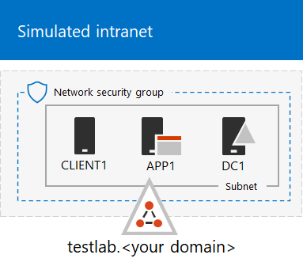

# <a name="the-simulated-enterprise-base-configuration"></a>Baskonfiguration för simulerat företag

*Den här test laboratorie guiden kan användas för både Microsoft 365 för företags-och Office 365 företags test miljöer.*

I den här artikeln beskrivs hur du skapar en förenklad miljö för Microsoft 365 för företag som innehåller:

- En utvärderingsprenumeration eller betald prenumeration på Microsoft 365 E5.
- En förenklad organisations intranät som är ansluten till Internet, bestående av tre virtuella datorer i ett virtuellt Azure-nätverk (DC1, APP1 och KLIENT1).
 


Att skapa en förenklad test miljö inbegriper två faser:
- [Fas 1: Skapa ett simulerat intranät](#phase-1-create-a-simulated-intranet)
- [Fas 2: Skapa en Microsoft 365 E5-prenumeration](#phase-2-create-your-microsoft-365-e5-subscription)

Du kan använda den resulterande miljön för att testa funktionerna i [Microsoft 365 för företag](https://www.microsoft.com/microsoft-365/enterprise) med ytterligare [test labb guider](m365-enterprise-test-lab-guides.md) eller på egen hand.


> [!TIP]
> Om du vill visa en visuell karta till alla artiklar i gruppen Microsoft 365 för Enterprise-testlabbet går du till [Microsoft 365 för Enterprise Test Lab-guide](../downloads/Microsoft365EnterpriseTLGStack.pdf).

## <a name="phase-1-create-a-simulated-intranet"></a>Fas 1: Skapa ett simulerat intranät

I den här fasen skapar du ett simulerat intranät i Azure Infrastructure Services som innehåller en AD DS-domänkontrollant (Active Directory Domain Services), en program Server och en klient dator.

Dessa datorer används i ytterligare [Microsoft 365 för företags test labb guider](m365-enterprise-test-lab-guides.md) för att konfigurera och påvisa hybrid identitet och andra funktioner.

### <a name="method-1-build-your-simulated-intranet-with-an-azure-resource-manager-template"></a>Metod 1: Skapa det simulerade intranätet med en Azure Resource Manager-mall

Med den här metoden använder du en Azure Resource Manager-mall för att bygga det simulerade intranätet. Mallar för Azure Resource Manager innehåller alla instruktioner för hur du skapar Azure Networking-infrastrukturen, de virtuella datorerna och deras konfiguration.

Innan du distribuerar mallen läser du igenom [sidan README-mall](https://github.com/maxskunkworks/TLG/tree/master/tlg-base-config_3-vm.m365-ems) och har följande information:

- Testmiljöns namn på den offentliga DNS-domänen (testlab.\<*your public domain*>) Du anger det här namnet i fältet **domän namn** på sidan **Anpassad distribution** .
- Ett DNS-etikettprefix för URL:erna för de virtuella datorernas offentliga IP-adresser. Du måste ange det här namnet i fältet **Dns Label Prefix** (DNS-etikettprefix) på sidan **Custom deployment** (Anpassad distribution).

När du har läst igenom anvisningarna väljer **du distribuera till Azure** på [sidan README-mall](https://github.com/maxskunkworks/TLG/tree/master/tlg-base-config_3-vm.m365-ems) för att komma igång.

>[!Note]
>Det simulerade intranätet som skapas av Azure Resource Manager-mallen kräver en betald Azure-prenumeration.

När mallen är färdig ser konfigurationen ut så här:



### <a name="method-2-build-your-simulated-intranet-with-azure-powershell"></a>Metod 2: Skapa det simulerade intranätet med Azure PowerShell

I den här metoden använder du Windows PowerShell och Azure PowerShell-modulen till att bygga upp nätverksinfrastrukturen, de virtuella datorerna och deras konfiguration.

Använd den här metoden om du vill skaffa dig erfarenhet av att skapa element i Azure-infrastrukturen ett steg i taget med PowerShell. Du kan sedan anpassa PowerShell-kommandoblocken för din egen distribution av andra virtuella datorer i Azure.

#### <a name="step-1-create-dc1"></a>Steg 1: Skapa DC1

I det här steget skapar du ett Azure Virtual Network och lägger till DC1, en virtuell dator som är en domänkontrollant för en AD DS-domän.

Starta först en Windows PowerShell-kommandotolk på din lokala dator.
  
> [!NOTE]
> Följande kommandouppsättningar använder den senaste versionen av Azure PowerShell. Se [Kom igång med Azure PowerShell-cmdletar](https://docs.microsoft.com/powershell/azureps-cmdlets-docs/). 
  
Logga in på ditt Azure-konto med följande kommando.
  
```powershell
Connect-AzAccount
```

Hämta ditt prenumerationsnamn med följande kommando.
  
```powershell
Get-AzSubscription | Sort Name | Select Name
```

Ange din Azure-prenumeration. Ersätt allt inom citat tecknen, inklusive vinkelparenteser ("<" och ">"), med rätt namn.
  
```powershell
$subscr="<subscription name>"
Get-AzSubscription -SubscriptionName $subscr | Select-AzSubscription
```

Skapa sedan en ny resursgrupp för det simulerade företagstestlabbet. Använd det är kommandot för att lista dina befintliga resursgrupper när du ska fastställa ett unikt resursgruppnamn.
  
```powershell
Get-AzResourceGroup | Sort ResourceGroupName | Select ResourceGroupName
```

Skapa den nya resursgruppen med dessa kommandon. Ersätt allt inom citat tecknen, inklusive vinkelparenteser, med rätt namn.
  
```powershell
$rgName="<resource group name>"
$locName="<location name, such as West US>"
New-AzResourceGroup -Name $rgName -Location $locName
```

Skapa sedan det TestLab virtuella nätverk som ska vara värd för företagets nätverks under nätverk i den simulerade företags miljön och skydda det med en nätverks säkerhets grupp. Fyll i namnet på resursgruppen och kör dessa kommandon vid kommandotolken i PowerShell på din lokala dator.
  
```powershell
$rgName="<name of your new resource group>"
$locName=(Get-AzResourceGroup -Name $rgName).Location
$corpnetSubnet=New-AzVirtualNetworkSubnetConfig -Name Corpnet -AddressPrefix 10.0.0.0/24
New-AzVirtualNetwork -Name TestLab -ResourceGroupName $rgName -Location $locName -AddressPrefix 10.0.0.0/8 -Subnet $corpnetSubnet -DNSServer 10.0.0.4
$rule1=New-AzNetworkSecurityRuleConfig -Name "RDPTraffic" -Description "Allow RDP to all VMs on the subnet" -Access Allow -Protocol Tcp -Direction Inbound -Priority 100 -SourceAddressPrefix Internet -SourcePortRange * -DestinationAddressPrefix * -DestinationPortRange 3389
New-AzNetworkSecurityGroup -Name Corpnet -ResourceGroupName $rgName -Location $locName -SecurityRules $rule1
$vnet=Get-AzVirtualNetwork -ResourceGroupName $rgName -Name TestLab
$nsg=Get-AzNetworkSecurityGroup -Name Corpnet -ResourceGroupName $rgName
Set-AzVirtualNetworkSubnetConfig -VirtualNetwork $vnet -Name Corpnet -AddressPrefix "10.0.0.0/24" -NetworkSecurityGroup $nsg
$vnet | Set-AzVirtualNetwork
```

Nästa steg är att skapa den virtuella DC1-datorn och konfigurera den som domänkontrollant för **testlab.**\<your public domain> AD DS-domän och en DNS-server för de virtuella datorerna i TestLabs virtuella nätverk. Exempel: Om namnet på din offentliga domän är **<span>contoso</span>.com** blir den virtuella datorn DC1 domänkontrollant för domänen **<span>testlab</span>.contoso.com**.
  
Om du vill skapa en virtuell Azure-dator för DC1 fyller du i namnet på din resursgrupp och kör dessa kommandon vid kommandotolken i PowerShell på din lokala dator.
  
```powershell
$rgName="<resource group name>"
$locName=(Get-AzResourceGroup -Name $rgName).Location
$vnet=Get-AzVirtualNetwork -Name TestLab -ResourceGroupName $rgName
$pip=New-AzPublicIpAddress -Name DC1-PIP -ResourceGroupName $rgName -Location $locName -AllocationMethod Dynamic
$nic=New-AzNetworkInterface -Name DC1-NIC -ResourceGroupName $rgName -Location $locName -SubnetId $vnet.Subnets[0].Id -PublicIpAddressId $pip.Id -PrivateIpAddress 10.0.0.4
$vm=New-AzVMConfig -VMName DC1 -VMSize Standard_A2_V2
$cred=Get-Credential -Message "Type the name and password of the local administrator account for DC1."
$vm=Set-AzVMOperatingSystem -VM $vm -Windows -ComputerName DC1 -Credential $cred -ProvisionVMAgent -EnableAutoUpdate
$vm=Set-AzVMSourceImage -VM $vm -PublisherName MicrosoftWindowsServer -Offer WindowsServer -Skus 2016-Datacenter -Version "latest"
$vm=Add-AzVMNetworkInterface -VM $vm -Id $nic.Id
$vm=Set-AzVMOSDisk -VM $vm -Name "DC1-OS" -DiskSizeInGB 128 -CreateOption FromImage
$diskConfig=New-AzDiskConfig -AccountType "Standard_LRS" -Location $locName -CreateOption Empty -DiskSizeGB 20
$dataDisk1=New-AzDisk -DiskName "DC1-DataDisk1" -Disk $diskConfig -ResourceGroupName $rgName
$vm=Add-AzVMDataDisk -VM $vm -Name "DC1-DataDisk1" -CreateOption Attach -ManagedDiskId $dataDisk1.Id -Lun 1
New-AzVM -ResourceGroupName $rgName -Location $locName -VM $vm
```

Du uppmanas att ange ett användarnamn och lösenord för det lokala administratörskontot på DC1. Använd ett starkt lösenord och spara både namnet och lösenordet på en säker plats.
  
Anslut sedan till den virtuella DC1-datorn:
  
1. I [Azure-portalen](https://portal.azure.com)väljer du **resurs grupper** > <***namnet på den nya resurs gruppen***> > **DC1**  >  **Connect**.
    
2. I fönstret Öppna väljer du **Ladda ner RDP File**. Öppna DC1-filen som laddas ner och välj **Anslut**.
    
3. Ange namnet på det lokala administratörskontot för DC1:
    
   - I Windows 7:
    
     I dialog rutan **Windows-säkerhet** väljer du **Använd ett annat konto**. Ange **DC1 \\ ** **User name** < *Local administratörs konto namn*> i användar namn.
    
   - För Windows 8 eller Windows 10:
    
     I dialog rutan **Windows-säkerhet** väljer du **fler alternativ**och väljer sedan **Använd ett annat konto**. Ange **DC1 \\ ** **User name** < *Local administratörs konto namn*> i användar namn.
    
4. Ange lösen ordet för det lokala administratörs kontot i **lösen ord**och välj sedan **OK**.
    
5. Välj **Ja**när du uppmanas till det.
    
Lägg sedan till en extra datadisk som en ny volym med enhetsbokstaven F: med det här kommandot i Windows PowerShell-kommandotolk på administratörsnivå på DC1.
  
```powershell
Get-Disk | Where PartitionStyle -eq "RAW" | Initialize-Disk -PartitionStyle MBR -PassThru | New-Partition -AssignDriveLetter -UseMaximumSize | Format-Volume -FileSystem NTFS -NewFileSystemLabel "WSAD Data"
```

Konfigurera sedan DC1 som domänkontrollant och DNS-server för domänen **testlab.**\<*your public domain*> domän. Ange ditt offentliga domän namn, ta bort vinkelparenteser och kör de här kommandona på en Windows PowerShell-kommandotolk på DC1.
  
```powershell
$yourDomain="<your public domain>"
Install-WindowsFeature AD-Domain-Services -IncludeManagementTools
Install-ADDSForest -DomainName testlab.$yourDomain -DatabasePath "F:\NTDS" -SysvolPath "F:\SYSVOL" -LogPath "F:\Logs"
```
Du måste ange ett administratörslösenord för felsäkert läge. Spara lösenordet på en säker plats.
  
Observera att dessa kommandon kan ta några minuter att slutföra.
  
När DC1 har startat om återansluter du till den virtuella datorn DC1.
  
1. I [Azure-portalen](https://portal.azure.com)väljer du **resurs grupper** > <*resurs gruppens namn*> > **DC1**  >  **Connect**.
    
2. Kör filen DC1. RDP som hämtas och välj sedan **Anslut**.
    
3. I **Windows-säkerhet**väljer du **Använd ett annat konto**. Ange **TESTLAB \\ ** **User name** < *lokala administratörs konto namn*> i användar namn.
    
4. I rutan **lösen ord** anger du lösen ordet för det lokala administratörs kontot och väljer sedan **OK**.
    
5. Välj **Ja**när du uppmanas till det.
    
Skapa sedan ett användar konto i Active Directory som ska användas när du loggar in på datorer med TESTLAB-domän. Kör det här kommandot i en Windows PowerShell-kommandotolk på administratörsnivå.
  
```powershell
New-ADUser -SamAccountName User1 -AccountPassword (read-host "Set user password" -assecurestring) -name "User1" -enabled $true -PasswordNeverExpires $true -ChangePasswordAtLogon $false
```

Observera att du uppmanas att ange lösenordet för User1-kontot med detta kommando. Det här kontot används för fjärr skrivbords anslutningar för alla TESTLAB-domän medlemmar, så välj sedan ett starkt lösen ord. Anteckna User1-kontots lösenord och spara det på en säker plats.
  
Konfigurera sedan det nya User1-kontot som en domän-, företags- och schemaadministratör. Kör det här kommandot i en Windows PowerShell-kommandotolk på administratörsnivå.
  
```powershell
$yourDomain="<your public domain>"
$domainName = "testlab."+$yourDomain
$userName="user1@" + $domainName
$userSID=(New-Object System.Security.Principal.NTAccount($userName)).Translate([System.Security.Principal.SecurityIdentifier]).Value
$groupNames=@("Domain Admins","Enterprise Admins","Schema Admins")
ForEach ($name in $groupNames) {Add-ADPrincipalGroupMembership -Identity $userSID -MemberOf (Get-ADGroup -Identity $name).SID.Value}
```

Stäng fjärrskrivbordssessionen med DC1 och återanslut sedan med TESTLAB\\User1-kontot.
  
För att sedan tillåta trafik för Ping-verktyget kör du det här kommandot i en Windows PowerShell-kommandotolk på administratörsnivå.
  
```powershell
Set-NetFirewallRule -DisplayName "File and Printer Sharing (Echo Request - ICMPv4-In)" -enabled True
```

Den aktuella konfigurationen ser ut så här:
  

  
#### <a name="step-2-configure-app1"></a>Steg 2: Konfigurera APP1

I det här steget skapar och konfigurerar du APP1, som är en programserver som till en början tillhandahåller webb- och fildelningstjänster.

Om du vill skapa en virtuell Azure-dator för APP1 fyller du i namnet på din resursgrupp och kör dessa kommandon vid kommandotolken på din lokala dator.
  
```powershell
$rgName="<resource group name>"
$locName=(Get-AzResourceGroup -Name $rgName).Location
$vnet=Get-AzVirtualNetwork -Name TestLab -ResourceGroupName $rgName
$pip=New-AzPublicIpAddress -Name APP1-PIP -ResourceGroupName $rgName -Location $locName -AllocationMethod Dynamic
$nic=New-AzNetworkInterface -Name APP1-NIC -ResourceGroupName $rgName -Location $locName -SubnetId $vnet.Subnets[0].Id -PublicIpAddressId $pip.Id
$vm=New-AzVMConfig -VMName APP1 -VMSize Standard_A2_V2
$cred=Get-Credential -Message "Type the name and password of the local administrator account for APP1."
$vm=Set-AzVMOperatingSystem -VM $vm -Windows -ComputerName APP1 -Credential $cred -ProvisionVMAgent -EnableAutoUpdate
$vm=Set-AzVMSourceImage -VM $vm -PublisherName MicrosoftWindowsServer -Offer WindowsServer -Skus 2016-Datacenter -Version "latest"
$vm=Add-AzVMNetworkInterface -VM $vm -Id $nic.Id
$vm=Set-AzVMOSDisk -VM $vm -Name "APP1-OS" -DiskSizeInGB 128 -CreateOption FromImage
New-AzVM -ResourceGroupName $rgName -Location $locName -VM $vm
```

Anslut sedan till den virtuella datorn APP1 med namnet och lösenordet för det lokala administratörskontot för APP1 och öppna sedan en kommandotolk i Windows PowerShell.
  
Om du vill kontrollera namnmatchningen och nätverkskommunikationen mellan APP1 och DC1 kör **ping dc1.testlab.**\<*your public domain name*> kommandot och bekräfta att det finns fyra svar.
  
Anslut sedan den virtuella datorn APP1 till TESTLAB-domänen med dessa kommandon i Windows PowerShell-kommandotolken.
  
```powershell
$yourDomain="<your public domain name>"
Add-Computer -DomainName ("testlab." + $yourDomain)
Restart-Computer
```

Observera att när du har kört kommandot **Lägg till dator** måste du ange AUTENTISERINGSUPPGIFTER för TESTLAB \\ Användare1 för domän konto.
  
När APP1 har startat om ansluter du den med TESTLAB\\User1-kontot och öppnar sedan en Windows PowerShell-kommandotolk på administratörsnivå.
  
Gör sedan APP1 till webbserver med det här kommandot i en Windows PowerShell-kommandotolk på administratörsnivå på APP1.
  
```powershell
Install-WindowsFeature Web-WebServer -IncludeManagementTools
```

Skapa sedan en delad mapp och en textfil i mappen på APP1 med dessa PowerShell-kommandon.
  
```powershell
New-Item -path c:\files -type directory
Write-Output "This is a shared file." | out-file c:\files\example.txt
New-SmbShare -name files -path c:\files -changeaccess TESTLAB\User1
```

Den aktuella konfigurationen ser ut så här:
  

  
#### <a name="step-3-configure-client1"></a>Steg 3: Konfigurera CLIENT1

I det här steget skapar och konfigurerar du CLIENT1, som fungerar som en typisk bärbar dator, surfplatta eller stationär dator på intranätet.

> [!NOTE]  
> Med följande kommandouppsättning skapas CLIENT1 med Windows Server 2016 Datacenter, vilket kan göras för alla typer av Azure-prenumerationer. Om du har en Visual Studio-baserad Azure-prenumeration kan du skapa CLIENT1 med Windows 10 med hjälp av [Azure Portal](https://portal.azure.com).
  
Om du vill skapa en virtuell Azure-dator för KLIENT1 fyller du i namnet på resurs gruppen och kör de här kommandona i kommando tolken på din lokala dator.
  
```powershell
$rgName="<resource group name>"
$locName=(Get-AzResourceGroup -Name $rgName).Location
$vnet=Get-AzVirtualNetwork -Name TestLab -ResourceGroupName $rgName
$pip=New-AzPublicIpAddress -Name CLIENT1-PIP -ResourceGroupName $rgName -Location $locName -AllocationMethod Dynamic
$nic=New-AzNetworkInterface -Name CLIENT1-NIC -ResourceGroupName $rgName -Location $locName -SubnetId $vnet.Subnets[0].Id -PublicIpAddressId $pip.Id
$vm=New-AzVMConfig -VMName CLIENT1 -VMSize Standard_A2_V2
$cred=Get-Credential -Message "Type the name and password of the local administrator account for CLIENT1."
$vm=Set-AzVMOperatingSystem -VM $vm -Windows -ComputerName CLIENT1 -Credential $cred -ProvisionVMAgent -EnableAutoUpdate
$vm=Set-AzVMSourceImage -VM $vm -PublisherName MicrosoftWindowsServer -Offer WindowsServer -Skus 2016-Datacenter -Version "latest"
$vm=Add-AzVMNetworkInterface -VM $vm -Id $nic.Id
$vm=Set-AzVMOSDisk -VM $vm -Name "CLIENT1-OS" -DiskSizeInGB 128 -CreateOption FromImage
New-AzVM -ResourceGroupName $rgName -Location $locName -VM $vm
```

Anslut sedan till den virtuella datorn CLIENT1 med namnet och lösenordet för det lokala administratörskontot för CLIENT1 och öppna sedan en Windows PowerShell-kommandotolk på administratörsnivå.
  
Om du vill kontrollera namnmatchningen och nätverkskommunikationen mellan CLIENT1 och DC1 kör **ping dc1.testlab.**\<*your public domain name*> kommandot i Windows PowerShell kommandotolk och bekräfta att det finns fyra svar.
  
Anslut sedan den virtuella datorn CLIENT1 till TESTLAB-domänen med dessa kommandon i Windows PowerShell-kommandotolken.
  
```powershell
$yourDomain="<your public domain name>"
Add-Computer -DomainName ("testlab." + $yourDomain)
Restart-Computer
```

Observera att du måste ange autentiseringsuppgifterna för TESTLAB\\User1-domänkontot när du har kört kommandot **Add-Computer**.
  
När CLIENT1 har startat om ansluter du den med TESTLAB\\User1-kontots namn och lösenord och öppnar sedan en Windows PowerShell-kommandotolk på administratörsnivå.
  
Verifiera sedan att du har åtkomst till webb- och fildelningsresurser på APP1 från CLIENT1.
  
1. I Server hanteraren går du till träd fönstret och väljer **lokal server**.
    
2. I **Egenskaper för KLIENT1** **väljer du** bredvid **förbättrad säkerhets konfiguration i IE**.
    
3. Välj **av** för **Administratörer** och **användare**i **Internet Explorers förbättrad säkerhets konfiguration**och välj sedan **OK**.
    
4. Välj **Internet Explorer**på Start skärmen och välj sedan **OK**.
    
5. Skriv **http<span>://</span>app1. testab**i adress fältet \<*your public domain name*> **/** och tryck sedan på **RETUR**. Du bör se Internet Information Services-standardwebbsidan för APP1.
    
6. På Skriv bords aktivitets fältet väljer du ikonen för Utforskaren.
    
7. Ange ** \\ \\ APP1- \\ filer**i adress fältet och tryck sedan på **RETUR**. Du bör nu se ett mappfönster med innehållet i den delade mappen Filer.
    
8. I fönstret för den delade mappen **Filer** dubbelklickar du på filen **Example.txt**. Du bör se innehållet i filen Example.txt.
    
9. Stäng fönstren för **example.txt – Anteckningar** och den delade mappen **Filer**.
    
Den aktuella konfigurationen ser ut så här:
  


## <a name="phase-2-create-your-microsoft-365-e5-subscription"></a>Fas 2: Skapa en Microsoft 365 E5-prenumeration

I den här fasen skapar du en ny Microsoft 365 E5-prenumeration som använder en ny Azure AD-klientorganisation, en som är separat från din produktionsprenumeration. Du kan göra det på två olika sätt:

- Använd en utvärderingsprenumeration på Microsoft 365 E5.

  Utvärderingsprenumerationen på Microsoft 365 E5 är 30 dagar, som enkelt kan förlängas till 60 dagar. När utvärderingsprenumerationen går ut måste du göra om den till en betald prenumeration eller skapa en ny utvärderingsprenumeration. När du skapar nya utvärderingsprenumerationer lämnar du konfigurationen, som kan innehålla komplexa scenarier.  

- Använd en separat produktionsprenumeration på Microsoft 365 E5 med ett litet antal licenser.

  Detta är en extra kostnad, men ser till att du har en fungerande test miljö som inte upphör; i det kan du prova funktioner, konfigurationer och scenarier. Du kan använda samma testmiljö på lång sikt för koncepttest, demonstration för kollegor och företagsledning samt utveckling och testning av program. Det är den rekommenderade metoden.

### <a name="sign-up-for-an-office-365-e5-trial-subscription"></a>Registrera dig för en utvärderingsprenumeration på Office 365 E5

Från Azure-portalen ansluter du till KLIENT1 med CORP\User1-kontot.

Om du vill skapa en ny Office 365 E5-utvärderingsprenumeration följer du anvisningarna i [Fas 1](lightweight-base-configuration-microsoft-365-enterprise.md#phase-1-create-your-microsoft-365-e5-subscription) i den enkla baskonfigurationen i testlabbguiden.

Om du vill konfigurera den nya Office 365 E5-utvärderingsprenumeration följer du anvisningarna i [Fas 2](lightweight-base-configuration-microsoft-365-enterprise.md#phase-2-configure-your-office-365-trial-subscription) i den enkla baskonfigurationen i testlabbguiden.

#### <a name="using-an-office-365-e5-test-environment"></a>Använda en Office 365 E5-testmiljö

Om du bara behöver en test miljö för Office 365 behöver du inte läsa resten av den här artikeln.

Ytterligare test labb guider som gäller både Microsoft 365 och Office 365 finns i [microsoft 365 för Enterprise Test Lab-guider](m365-enterprise-test-lab-guides.md).

### <a name="add-a-microsoft-365-e5-trial-subscription"></a>Lägga till en utvärderingsprenumeration på Microsoft 365 E5

Om du vill lägga till en Microsoft 365 E5-prov prenumeration och konfigurera dina användar konton med licenser kan du följa anvisningarna i [steg 3](lightweight-base-configuration-microsoft-365-enterprise.md#phase-3-add-a-microsoft-365-e5-trial-subscription) i grundläggande konfigurations test labb Guide.

  
## <a name="results"></a>Resultat

Din testmiljö har nu:
  
- Utvärderingsprenumeration på Microsoft 365 E5.
- Alla dina lämpliga användarkonton är aktiverade att använda Microsoft 365 E5.
- Ett simulerat och förenklat intranät.
    
Den sista konfigurationen ser ut så här:
  

  
Nu kan du experimentera med fler funktioner i [Microsoft 365 för företag](https://www.microsoft.com/microsoft-365/enterprise).
  
## <a name="next-steps"></a>Nästa steg

Utforska dessa ytterligare uppsättningar testlabbguider:
  
- [Identitet](m365-enterprise-test-lab-guides.md#identity)
- [Hantering av mobila enheter](m365-enterprise-test-lab-guides.md#mobile-device-management)
- [Informationsskydd](m365-enterprise-test-lab-guides.md#information-protection)

## <a name="see-also"></a>Se även

[Testlabbguider för Microsoft 365 för företag](m365-enterprise-test-lab-guides.md)

[Översikt över Microsoft 365 för företag](microsoft-365-overview.md)

[Microsoft 365 för företags dokumentation](https://docs.microsoft.com/microsoft-365-enterprise/)
