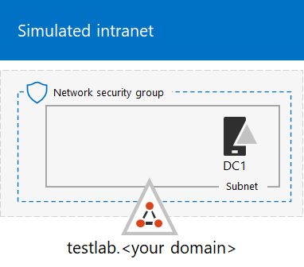

# <a name="the-simulated-enterprise-base-configuration"></a><span data-ttu-id="5fdf2-103">Baskonfiguration för simulerat företag</span><span class="sxs-lookup"><span data-stu-id="5fdf2-103">The simulated enterprise base configuration</span></span>

<span data-ttu-id="5fdf2-104">*Den här testlabbguiden kan användas i både Microsoft 365 Enterprise- och Office 365 Enterprise-testmiljöer.*</span><span class="sxs-lookup"><span data-stu-id="5fdf2-104">*This Test Lab Guide can be used for both Microsoft 365 Enterprise and Office 365 Enterprise test environments.*</span></span>

<span data-ttu-id="5fdf2-105">I den här artikeln får du stegvisa instruktioner för hur du skapar en förenklad miljö för Microsoft 365 Enterprise som innefattar följande:</span><span class="sxs-lookup"><span data-stu-id="5fdf2-105">This article provides you with step-by-step instructions to create a simplified environment for Microsoft 365 Enterprise that includes:</span></span>

- <span data-ttu-id="5fdf2-106">En utvärderingsprenumeration eller betald prenumeration på Microsoft 365 E5.</span><span class="sxs-lookup"><span data-stu-id="5fdf2-106">A Microsoft 365 E5 trial or paid subscription.</span></span>
- <span data-ttu-id="5fdf2-107">Ett förenklat företagsintranät anslutet till Internet som består av tre virtuella datorer på ett virtuellt Azure-nätverk (DC1, APP1 och CLIENT1).</span><span class="sxs-lookup"><span data-stu-id="5fdf2-107">A simplified organization intranet connected to the Internet, consisting of three virtual machines on an Azure virtual network (DC1, APP1, and CLIENT1).</span></span>
 


<span data-ttu-id="5fdf2-109">Du kan använda den resulterande miljön för att testa funktionerna och funktionaliteten i [Microsoft 365 Enterprise](https://www.microsoft.com/microsoft-365/enterprise) med ytterligare [testlabbguider](m365-enterprise-test-lab-guides.md) eller på egen hand.</span><span class="sxs-lookup"><span data-stu-id="5fdf2-109">You can use the resulting environment to test the features and functionality of [Microsoft 365 Enterprise](https://www.microsoft.com/microsoft-365/enterprise) with additional [Test Lab Guides](m365-enterprise-test-lab-guides.md) or on your own.</span></span>


> [!TIP]
> <span data-ttu-id="5fdf2-111">Gå till [Samling med testlabbguider för Microsoft 365 för företag](../media/m365-enterprise-test-lab-guides/Microsoft365EnterpriseTLGStack.pdf) om du vill se en översikt över alla artiklar i samlingen med testlabbguider för Microsoft 365 för företag.</span><span class="sxs-lookup"><span data-stu-id="5fdf2-111">Go to [Microsoft 365 Enterprise Test Lab Guide Stack](../media/m365-enterprise-test-lab-guides/Microsoft365EnterpriseTLGStack.pdf) for a visual map to all the articles in the Microsoft 365 Enterprise Test Lab Guide stack.</span></span>

## <a name="phase-1-create-a-simulated-intranet"></a><span data-ttu-id="5fdf2-112">Fas 1: Skapa ett simulerat intranät</span><span class="sxs-lookup"><span data-stu-id="5fdf2-112">Phase 1: Create a simulated intranet</span></span>

<span data-ttu-id="5fdf2-113">I den här fasen skapar du ett simulerat intranät it Azure-infrastrukturtjänster som omfattar en Active Directory Domain Services-domänkontrollant (AD DS), en programserver och en klientdator.</span><span class="sxs-lookup"><span data-stu-id="5fdf2-113">In this phase, you build a simulated intranet in Azure infrastructure services that includes an Active Directory Domain Services (AD DS) domain controller, an application server, and a client computer.</span></span> 

<span data-ttu-id="5fdf2-114">Du använder dessa datorer i ytterligare [testlabbguider för Microsoft 365 Enterprise](m365-enterprise-test-lab-guides.md) till att konfigurera och visa hybrididentitet och andra funktioner.</span><span class="sxs-lookup"><span data-stu-id="5fdf2-114">You'll use these computers in additional [Microsoft 365 Enterprise Test Lab Guides](m365-enterprise-test-lab-guides.md) to configure and demonstrate hybrid identity and other capabilities.</span></span>

### <a name="method-1-build-your-simulated-intranet-with-an-azure-resource-manager-template"></a><span data-ttu-id="5fdf2-115">Metod 1: Skapa det simulerade intranätet med en Azure Resource Manager-mall</span><span class="sxs-lookup"><span data-stu-id="5fdf2-115">Method 1: Build your simulated intranet with an Azure Resource Manager template</span></span>

<span data-ttu-id="5fdf2-116">I den här metoden använder du en Azure Resource Manager-mall (ARM) för att bygga upp det simulerade intranätet.</span><span class="sxs-lookup"><span data-stu-id="5fdf2-116">In this method, you use an Azure Resource Manager (ARM) template to build out the simulated intranet.</span></span> <span data-ttu-id="5fdf2-117">ARM-mallar innehåller alla instruktioner för att skapa Azure-nätverksinfrastrukturen, de virtuella datorerna och deras konfiguration.</span><span class="sxs-lookup"><span data-stu-id="5fdf2-117">ARM templates contain all of the instructions to create the Azure networking infrastructure, the virtual machines, and their configuration.</span></span>

<span data-ttu-id="5fdf2-118">Innan du distribuerar mallen ska du läsa igenom [mallens README-sida](https://github.com/maxskunkworks/TLG/tree/master/tlg-base-config_3-vm.m365-ems) och ha följande information redo:</span><span class="sxs-lookup"><span data-stu-id="5fdf2-118">Prior to deploying the template, read through the [template README page](https://github.com/maxskunkworks/TLG/tree/master/tlg-base-config_3-vm.m365-ems) and have the following information ready:</span></span>

- <span data-ttu-id="5fdf2-119">Testmiljöns namn på den offentliga DNS-domänen (testlab.\<your public domain>)</span><span class="sxs-lookup"><span data-stu-id="5fdf2-119">The public DNS domain name of your test environment (testlab.\<your public domain>).</span></span> <span data-ttu-id="5fdf2-120">Du måste ange det här namnet i fältet **Domain Name** (Domännamn) på sidan **Custom deployment** (Anpassad distribution).</span><span class="sxs-lookup"><span data-stu-id="5fdf2-120">You'll need to enter this name in the **Domain Name field** of the **Custom deployment** page.</span></span>
- <span data-ttu-id="5fdf2-121">Ett DNS-etikettprefix för URL:erna för de virtuella datorernas offentliga IP-adresser.</span><span class="sxs-lookup"><span data-stu-id="5fdf2-121">A DNS label prefix for the URLs of the public IP addresses of your virtual machines.</span></span> <span data-ttu-id="5fdf2-122">Du måste ange det här namnet i fältet **Dns Label Prefix** (DNS-etikettprefix) på sidan **Custom deployment** (Anpassad distribution).</span><span class="sxs-lookup"><span data-stu-id="5fdf2-122">You'll need to enter this label in the **Dns Label Prefix** field of the **Custom deployment** page.</span></span>

<span data-ttu-id="5fdf2-123">När du har läst igenom de här instruktionerna klickar du på **Deploy to Azure** (Distribuera till Azure) på [mallens README-sida](https://github.com/maxskunkworks/TLG/tree/master/tlg-base-config_3-vm.m365-ems) för att komma igång.</span><span class="sxs-lookup"><span data-stu-id="5fdf2-123">After reading through the instructions, click **Deploy to Azure** on the [template README page](https://github.com/maxskunkworks/TLG/tree/master/tlg-base-config_3-vm.m365-ems) to get started.</span></span>

>[!Note]
><span data-ttu-id="5fdf2-124">Det simulerade intranätet som skapats av ARM-mallen kräver en betald Azure-prenumeration.</span><span class="sxs-lookup"><span data-stu-id="5fdf2-124">The simulated intranet built by the ARM template requires a paid Azure subscription.</span></span>
>

<span data-ttu-id="5fdf2-125">Så här ser konfigurationen ut när mallen har slutförts.</span><span class="sxs-lookup"><span data-stu-id="5fdf2-125">Here is your configuration after the template is complete.</span></span>


### <a name="method-2-build-your-simulated-intranet-with-azure-powershell"></a><span data-ttu-id="5fdf2-127">Metod 2: Skapa det simulerade intranätet med Azure PowerShell</span><span class="sxs-lookup"><span data-stu-id="5fdf2-127">Method 2: Build your simulated intranet with Azure PowerShell</span></span>

<span data-ttu-id="5fdf2-128">I den här metoden använder du Windows PowerShell och Azure PowerShell-modulen till att bygga upp nätverksinfrastrukturen, de virtuella datorerna och deras konfiguration.</span><span class="sxs-lookup"><span data-stu-id="5fdf2-128">In this method, you use Windows PowerShell and the Azure PowerShell module to build out the networking infrastructure, the virtual machines, and their configuration.</span></span>

<span data-ttu-id="5fdf2-129">Använd den här metoden om du vill skaffa dig erfarenhet av att skapa element i Azure-infrastrukturen ett steg i taget med PowerShell.</span><span class="sxs-lookup"><span data-stu-id="5fdf2-129">Use this method if you want to get experience creating elements of Azure infrastructure one step at a time with PowerShell.</span></span> <span data-ttu-id="5fdf2-130">Du kan sedan anpassa PowerShell-kommandoblocken för din egen distribution av andra virtuella datorer i Azure.</span><span class="sxs-lookup"><span data-stu-id="5fdf2-130">You can then customize the PowerShell command blocks for your own deployment of other virtual machines in Azure.</span></span>

#### <a name="step-1-create-dc1"></a><span data-ttu-id="5fdf2-131">Steg 1: Skapa DC1</span><span class="sxs-lookup"><span data-stu-id="5fdf2-131">Step 1: Create DC1</span></span>

<span data-ttu-id="5fdf2-132">I det här steget skapar vi ett virtuellt Azure-nätverk och lägger till DC1, en virtuell dator som är domänkontrollant för en AD DS-domän.</span><span class="sxs-lookup"><span data-stu-id="5fdf2-132">In this step, we create an Azure virtual network and add DC1, a virtual machine that is a domain controller for an AD DS domain.</span></span>

<span data-ttu-id="5fdf2-133">Starta först en Windows PowerShell-kommandotolk på din lokala dator.</span><span class="sxs-lookup"><span data-stu-id="5fdf2-133">First, start a Windows PowerShell command prompt on your local computer.</span></span>
  
> [!NOTE]
> <span data-ttu-id="5fdf2-134">Följande kommandouppsättningar använder den senaste versionen av Azure PowerShell.</span><span class="sxs-lookup"><span data-stu-id="5fdf2-134">The following command sets use the latest version of Azure PowerShell.</span></span> <span data-ttu-id="5fdf2-135">Se [Kom igång med Azure PowerShell-cmdletar](https://docs.microsoft.com/powershell/azureps-cmdlets-docs/).</span><span class="sxs-lookup"><span data-stu-id="5fdf2-135">See [Get started with Azure PowerShell cmdlets](https://docs.microsoft.com/powershell/azureps-cmdlets-docs/).</span></span> 
  
<span data-ttu-id="5fdf2-136">Logga in på ditt Azure-konto med följande kommando.</span><span class="sxs-lookup"><span data-stu-id="5fdf2-136">Sign in to your Azure account with the following command.</span></span>
  
```powershell
Connect-AzAccount
```

<span data-ttu-id="5fdf2-137">Hämta ditt prenumerationsnamn med följande kommando.</span><span class="sxs-lookup"><span data-stu-id="5fdf2-137">Get your subscription name using the following command.</span></span>
  
```powershell
Get-AzSubscription | Sort Name | Select Name
```

<span data-ttu-id="5fdf2-138">Ange din Azure-prenumeration.</span><span class="sxs-lookup"><span data-stu-id="5fdf2-138">Set your Azure subscription.</span></span> <span data-ttu-id="5fdf2-139">Ersätt allt inom citattecknen, inklusive < och >, med det rätta namnet.</span><span class="sxs-lookup"><span data-stu-id="5fdf2-139">Replace everything within the quotes, including the < and > characters, with the correct name.</span></span>
  
```powershell
$subscr="<subscription name>"
Get-AzSubscription -SubscriptionName $subscr | Select-AzSubscription
```

<span data-ttu-id="5fdf2-140">Skapa sedan en ny resursgrupp för det simulerade företagstestlabbet.</span><span class="sxs-lookup"><span data-stu-id="5fdf2-140">Next, create a new resource group for your simulated enterprise test lab.</span></span> <span data-ttu-id="5fdf2-141">Använd det är kommandot för att lista dina befintliga resursgrupper när du ska fastställa ett unikt resursgruppnamn.</span><span class="sxs-lookup"><span data-stu-id="5fdf2-141">To determine a unique resource group name, use this command to list your existing resource groups.</span></span>
  
```powershell
Get-AzResourceGroup | Sort ResourceGroupName | Select ResourceGroupName
```

<span data-ttu-id="5fdf2-142">Skapa den nya resursgruppen med dessa kommandon.</span><span class="sxs-lookup"><span data-stu-id="5fdf2-142">Create your new resource group with these commands.</span></span> <span data-ttu-id="5fdf2-143">Ersätt allt inom citattecknen, inklusive < och >, med de rätta namnen.</span><span class="sxs-lookup"><span data-stu-id="5fdf2-143">Replace everything within the quotes, including the < and > characters, with the correct names.</span></span>
  
```powershell
$rgName="<resource group name>"
$locName="<location name, such as West US>"
New-AzResourceGroup -Name $rgName -Location $locName
```

<span data-ttu-id="5fdf2-144">Skapa sedan det virtuella nätverket TestLab som blir värd för Corpnet-undernätet för den simulerade företagsmiljön och skydda den med en nätverkssäkerhetsgrupp.</span><span class="sxs-lookup"><span data-stu-id="5fdf2-144">Next, you create the TestLab virtual network that will host the Corpnet subnet of the simulated enterprise environment and protect it with a network security group.</span></span> <span data-ttu-id="5fdf2-145">Fyll i namnet på resursgruppen och kör dessa kommandon vid kommandotolken i PowerShell på din lokala dator.</span><span class="sxs-lookup"><span data-stu-id="5fdf2-145">Fill in the name of your resource group and run these commands at the PowerShell command prompt on your local computer.</span></span>
  
```powershell
$rgName="<name of your new resource group>"
$locName=(Get-AzResourceGroup -Name $rgName).Location
$corpnetSubnet=New-AzVirtualNetworkSubnetConfig -Name Corpnet -AddressPrefix 10.0.0.0/24
New-AzVirtualNetwork -Name TestLab -ResourceGroupName $rgName -Location $locName -AddressPrefix 10.0.0.0/8 -Subnet $corpnetSubnet -DNSServer 10.0.0.4
$rule1=New-AzNetworkSecurityRuleConfig -Name "RDPTraffic" -Description "Allow RDP to all VMs on the subnet" -Access Allow -Protocol Tcp -Direction Inbound -Priority 100 -SourceAddressPrefix Internet -SourcePortRange * -DestinationAddressPrefix * -DestinationPortRange 3389
New-AzNetworkSecurityGroup -Name Corpnet -ResourceGroupName $rgName -Location $locName -SecurityRules $rule1
$vnet=Get-AzVirtualNetwork -ResourceGroupName $rgName -Name TestLab
$nsg=Get-AzNetworkSecurityGroup -Name Corpnet -ResourceGroupName $rgName
Set-AzVirtualNetworkSubnetConfig -VirtualNetwork $vnet -Name Corpnet -AddressPrefix "10.0.0.0/24" -NetworkSecurityGroup $nsg
$vnet | Set-AzVirtualNetwork
```

<span data-ttu-id="5fdf2-146">Nästa steg är att skapa den virtuella DC1-datorn och konfigurera den som domänkontrollant för **testlab.**\<your public domain></span><span class="sxs-lookup"><span data-stu-id="5fdf2-146">Next, you create the DC1 virtual machine and configure it as a domain controller for the **testlab.**\<your public domain></span></span> <span data-ttu-id="5fdf2-147">AD DS-domän och en DNS-server för de virtuella datorerna i TestLabs virtuella nätverk.</span><span class="sxs-lookup"><span data-stu-id="5fdf2-147">AD DS domain and a DNS server for the virtual machines of the TestLab virtual network.</span></span> <span data-ttu-id="5fdf2-148">Exempel: Om namnet på din offentliga domän är **<span>contoso</span>.com** blir den virtuella datorn DC1 domänkontrollant för domänen **<span>testlab</span>.contoso.com**.</span><span class="sxs-lookup"><span data-stu-id="5fdf2-148">For example, if your public domain name is **<span>contoso</span>.com**, the DC1 virtual machine will be a domain controller for the **<span>testlab</span>.contoso.com** domain.</span></span>
  
<span data-ttu-id="5fdf2-149">Om du vill skapa en virtuell Azure-dator för DC1 fyller du i namnet på din resursgrupp och kör dessa kommandon vid kommandotolken i PowerShell på din lokala dator.</span><span class="sxs-lookup"><span data-stu-id="5fdf2-149">To create an Azure virtual machine for DC1, fill in the name of your resource group and run these commands at the PowerShell command prompt on your local computer.</span></span>
  
```powershell
$rgName="<resource group name>"
$locName=(Get-AzResourceGroup -Name $rgName).Location
$vnet=Get-AzVirtualNetwork -Name TestLab -ResourceGroupName $rgName
$pip=New-AzPublicIpAddress -Name DC1-PIP -ResourceGroupName $rgName -Location $locName -AllocationMethod Dynamic
$nic=New-AzNetworkInterface -Name DC1-NIC -ResourceGroupName $rgName -Location $locName -SubnetId $vnet.Subnets[0].Id -PublicIpAddressId $pip.Id -PrivateIpAddress 10.0.0.4
$vm=New-AzVMConfig -VMName DC1 -VMSize Standard_A2_V2
$cred=Get-Credential -Message "Type the name and password of the local administrator account for DC1."
$vm=Set-AzVMOperatingSystem -VM $vm -Windows -ComputerName DC1 -Credential $cred -ProvisionVMAgent -EnableAutoUpdate
$vm=Set-AzVMSourceImage -VM $vm -PublisherName MicrosoftWindowsServer -Offer WindowsServer -Skus 2016-Datacenter -Version "latest"
$vm=Add-AzVMNetworkInterface -VM $vm -Id $nic.Id
$vm=Set-AzVMOSDisk -VM $vm -Name "DC1-OS" -DiskSizeInGB 128 -CreateOption FromImage
$diskConfig=New-AzDiskConfig -AccountType "Standard_LRS" -Location $locName -CreateOption Empty -DiskSizeGB 20
$dataDisk1=New-AzDisk -DiskName "DC1-DataDisk1" -Disk $diskConfig -ResourceGroupName $rgName
$vm=Add-AzVMDataDisk -VM $vm -Name "DC1-DataDisk1" -CreateOption Attach -ManagedDiskId $dataDisk1.Id -Lun 1
New-AzVM -ResourceGroupName $rgName -Location $locName -VM $vm
```

<span data-ttu-id="5fdf2-150">Du uppmanas att ange ett användarnamn och lösenord för det lokala administratörskontot på DC1.</span><span class="sxs-lookup"><span data-stu-id="5fdf2-150">You will be prompted for a user name and password for the local administrator account on DC1.</span></span> <span data-ttu-id="5fdf2-151">Använd ett starkt lösenord och spara både namnet och lösenordet på en säker plats.</span><span class="sxs-lookup"><span data-stu-id="5fdf2-151">Use a strong password and record both the name and password in a secure location.</span></span>
  
<span data-ttu-id="5fdf2-152">Anslut sedan till den virtuella datorn DC1.</span><span class="sxs-lookup"><span data-stu-id="5fdf2-152">Next, connect to the DC1 virtual machine.</span></span>
  
1. <span data-ttu-id="5fdf2-153">I [Azure Portal](https://portal.azure.com) klickar du på **Resursgrupper >** [namnet på din nya resursgrupp] **> DC1 > Anslut**.</span><span class="sxs-lookup"><span data-stu-id="5fdf2-153">In the [Azure portal](https://portal.azure.com), click **Resource Groups >** [the name of your new resource group] **> DC1 > Connect**.</span></span>
    
2. <span data-ttu-id="5fdf2-154">Klicka på **Ladda ned RDP-fil** i den öppna rutan.</span><span class="sxs-lookup"><span data-stu-id="5fdf2-154">In the open pane, click **Download RDP file**.</span></span> <span data-ttu-id="5fdf2-155">Öppna filen DC1.rdp som laddats ned och klicka på **Anslut**.</span><span class="sxs-lookup"><span data-stu-id="5fdf2-155">Open the DC1.rdp file that is downloaded, and then click **Connect**.</span></span>
    
3. <span data-ttu-id="5fdf2-156">Ange namnet på det lokala administratörskontot för DC1:</span><span class="sxs-lookup"><span data-stu-id="5fdf2-156">Specify the DC1 local administrator account name:</span></span>
    
   - <span data-ttu-id="5fdf2-157">I Windows 7:</span><span class="sxs-lookup"><span data-stu-id="5fdf2-157">For Windows 7:</span></span>
    
     <span data-ttu-id="5fdf2-158">I dialogrutan **Windows-säkerhet** klickar du på **Använd ett annat konto**.</span><span class="sxs-lookup"><span data-stu-id="5fdf2-158">In the **Windows Security** dialog box, click **Use another account**.</span></span> <span data-ttu-id="5fdf2-159">I **Användarnamn** skriver du **DC1\\**[namn på lokalt administratörskonto].</span><span class="sxs-lookup"><span data-stu-id="5fdf2-159">In **User name**, type **DC1\\**[Local administrator account name].</span></span>
    
   - <span data-ttu-id="5fdf2-160">För Windows 8 eller Windows 10:</span><span class="sxs-lookup"><span data-stu-id="5fdf2-160">For Windows 8 or Windows 10:</span></span>
    
     <span data-ttu-id="5fdf2-161">I dialogrutan **Windows-säkerhet** klickar du på **Fler alternativ** och klickar sedan på **Använd ett annat konto**.</span><span class="sxs-lookup"><span data-stu-id="5fdf2-161">In the **Windows Security** dialog box, click **More choices**, and then click **Use a different account**.</span></span> <span data-ttu-id="5fdf2-162">I **Användarnamn** skriver du **DC1\\**[namn på lokalt administratörskonto].</span><span class="sxs-lookup"><span data-stu-id="5fdf2-162">In **User name**, type **DC1\\**[Local administrator account name].</span></span>
    
4. <span data-ttu-id="5fdf2-163">I **Lösenord** skriver du lösenordet för det lokala administratörskontot och klickar sedan på **OK**.</span><span class="sxs-lookup"><span data-stu-id="5fdf2-163">In **Password**, type the password of the local administrator account, and then click **OK**.</span></span>
    
5. <span data-ttu-id="5fdf2-164">Klicka på **Ja** när du uppmanas att göra det.</span><span class="sxs-lookup"><span data-stu-id="5fdf2-164">When prompted, click **Yes**.</span></span>
    
<span data-ttu-id="5fdf2-165">Lägg sedan till en extra datadisk som en ny volym med enhetsbokstaven F: med det här kommandot i Windows PowerShell-kommandotolk på administratörsnivå på DC1.</span><span class="sxs-lookup"><span data-stu-id="5fdf2-165">Next, add an extra data disk as a new volume with the drive letter F: with this command at an administrator-level Windows PowerShell command prompt on DC1.</span></span>
  
```powershell
Get-Disk | Where PartitionStyle -eq "RAW" | Initialize-Disk -PartitionStyle MBR -PassThru | New-Partition -AssignDriveLetter -UseMaximumSize | Format-Volume -FileSystem NTFS -NewFileSystemLabel "WSAD Data"
```

<span data-ttu-id="5fdf2-166">Konfigurera sedan DC1 som domänkontrollant och DNS-server för domänen **testlab.**\<your public domain></span><span class="sxs-lookup"><span data-stu-id="5fdf2-166">Next, configure DC1 as a domain controller and DNS server for the **testlab.**\<your public domain></span></span> <span data-ttu-id="5fdf2-167">domän.</span><span class="sxs-lookup"><span data-stu-id="5fdf2-167">domain.</span></span> <span data-ttu-id="5fdf2-168">Ange namnet på din offentliga domän, ta bort tecknen \< and > och kör sedan dessa kommandon i en Windows PowerShell-kommandotolk på administratörsnivå på DC1.</span><span class="sxs-lookup"><span data-stu-id="5fdf2-168">Specify your public domain name, remove the \< and > characters, and then run these commands at an administrator-level Windows PowerShell command prompt on DC1.</span></span>
  
```powershell
$yourDomain="<your public domain>"
Install-WindowsFeature AD-Domain-Services -IncludeManagementTools
Install-ADDSForest -DomainName testlab.$yourDomain -DatabasePath "F:\NTDS" -SysvolPath "F:\SYSVOL" -LogPath "F:\Logs"
```
<span data-ttu-id="5fdf2-169">Du måste ange ett administratörslösenord för felsäkert läge.</span><span class="sxs-lookup"><span data-stu-id="5fdf2-169">You will need to specify a safe mode administrator password.</span></span> <span data-ttu-id="5fdf2-170">Spara lösenordet på en säker plats.</span><span class="sxs-lookup"><span data-stu-id="5fdf2-170">Store this password in a secure location.</span></span>
  
<span data-ttu-id="5fdf2-171">Observera att dessa kommandon kan ta några minuter att slutföra.</span><span class="sxs-lookup"><span data-stu-id="5fdf2-171">Note that these commands can take a few minutes to complete.</span></span>
  
<span data-ttu-id="5fdf2-172">När DC1 har startat om återansluter du till den virtuella datorn DC1.</span><span class="sxs-lookup"><span data-stu-id="5fdf2-172">After DC1 restarts, reconnect to the DC1 virtual machine.</span></span>
  
1. <span data-ttu-id="5fdf2-173">I [Azure Portal](https://portal.azure.com) klickar du på **Resursgrupper >** [namnet på din resursgrupp] **> DC1 > Anslut**.</span><span class="sxs-lookup"><span data-stu-id="5fdf2-173">In the [Azure portal](https://portal.azure.com), click **Resource Groups >** [your resource group name] **> DC1 > Connect**.</span></span>
    
2. <span data-ttu-id="5fdf2-174">Kör filen DC1.rdp som laddats ned och klicka på **Anslut**.</span><span class="sxs-lookup"><span data-stu-id="5fdf2-174">Run the DC1.rdp file that is downloaded, and then click **Connect**.</span></span>
    
3. <span data-ttu-id="5fdf2-175">I **Windows-säkerhet** klickar du på **Använd ett annat konto**.</span><span class="sxs-lookup"><span data-stu-id="5fdf2-175">In **Windows Security**, click **Use another account**.</span></span> <span data-ttu-id="5fdf2-176">I **Användarnamn** skriver du **TESTLAB\\**[namn på lokalt administratörskonto].</span><span class="sxs-lookup"><span data-stu-id="5fdf2-176">In **User name**, type **TESTLAB\\**[Local administrator account name].</span></span>
    
4. <span data-ttu-id="5fdf2-177">I **Lösenord** skriver du lösenordet för det lokala administratörskontot och klickar sedan på **OK**.</span><span class="sxs-lookup"><span data-stu-id="5fdf2-177">In **Password**, type the password of the local administrator account, and then click **OK**.</span></span>
    
5. <span data-ttu-id="5fdf2-178">Klicka på **Ja** när du uppmanas att göra det.</span><span class="sxs-lookup"><span data-stu-id="5fdf2-178">When prompted, click **Yes**.</span></span>
    
<span data-ttu-id="5fdf2-179">Skapa sedan ett användarkonto i Active Directory som kommer att användas vid inloggning på TESTLAB-domänmedlemsdatorer.</span><span class="sxs-lookup"><span data-stu-id="5fdf2-179">Next, create a user account in Active Directory that will be used when logging in to TESTLAB domain member computers.</span></span> <span data-ttu-id="5fdf2-180">Kör det här kommandot i en Windows PowerShell-kommandotolk på administratörsnivå.</span><span class="sxs-lookup"><span data-stu-id="5fdf2-180">Run this command at an administrator-level Windows PowerShell command prompt.</span></span>
  
```powershell
New-ADUser -SamAccountName User1 -AccountPassword (read-host "Set user password" -assecurestring) -name "User1" -enabled $true -PasswordNeverExpires $true -ChangePasswordAtLogon $false
```

<span data-ttu-id="5fdf2-181">Observera att du uppmanas att ange lösenordet för User1-kontot med detta kommando.</span><span class="sxs-lookup"><span data-stu-id="5fdf2-181">Note that this command prompts you to supply the User1 account password.</span></span> <span data-ttu-id="5fdf2-182">Eftersom det här kontot kommer att användas för fjärrskrivbordsanslutningar för alla TESTLAB-domänmedlemsdatorer ska du välja ett starkt lösenord.</span><span class="sxs-lookup"><span data-stu-id="5fdf2-182">Because this account will be used for remote desktop connections for all TESTLAB domain member computers, choose a strong password.</span></span> <span data-ttu-id="5fdf2-183">Anteckna User1-kontots lösenord och spara det på en säker plats.</span><span class="sxs-lookup"><span data-stu-id="5fdf2-183">Record the User1 account password and store it in a secured location.</span></span>
  
<span data-ttu-id="5fdf2-184">Konfigurera sedan det nya User1-kontot som en domän-, företags- och schemaadministratör.</span><span class="sxs-lookup"><span data-stu-id="5fdf2-184">Next, configure the new User1 account as a domain, enterprise, and schema administrator.</span></span> <span data-ttu-id="5fdf2-185">Kör det här kommandot i en Windows PowerShell-kommandotolk på administratörsnivå.</span><span class="sxs-lookup"><span data-stu-id="5fdf2-185">Run this command at the administrator-level Windows PowerShell command prompt.</span></span>
  
```powershell
$yourDomain="<your public domain>"
$domainName = "testlab."+$yourDomain
$userName="user1@" + $domainName
$userSID=(New-Object System.Security.Principal.NTAccount($userName)).Translate([System.Security.Principal.SecurityIdentifier]).Value
$groupNames=@("Domain Admins","Enterprise Admins","Schema Admins")
ForEach ($name in $groupNames) {Add-ADPrincipalGroupMembership -Identity $userSID -MemberOf (Get-ADGroup -Identity $name).SID.Value}
```

<span data-ttu-id="5fdf2-186">Stäng fjärrskrivbordssessionen med DC1 och återanslut sedan med TESTLAB\\User1-kontot.</span><span class="sxs-lookup"><span data-stu-id="5fdf2-186">Close the Remote Desktop session with DC1 and then reconnect using the TESTLAB\\User1 account.</span></span>
  
<span data-ttu-id="5fdf2-187">För att sedan tillåta trafik för Ping-verktyget kör du det här kommandot i en Windows PowerShell-kommandotolk på administratörsnivå.</span><span class="sxs-lookup"><span data-stu-id="5fdf2-187">Next, to allow traffic for the Ping tool, run this command at an administrator-level Windows PowerShell command prompt.</span></span>
  
```powershell
Set-NetFirewallRule -DisplayName "File and Printer Sharing (Echo Request - ICMPv4-In)" -enabled True
```

<span data-ttu-id="5fdf2-188">Det här är den aktuella konfigurationen.</span><span class="sxs-lookup"><span data-stu-id="5fdf2-188">This is your current configuration.</span></span>
  

  
#### <a name="step-2-configure-app1"></a><span data-ttu-id="5fdf2-190">Steg 2: Konfigurera APP1</span><span class="sxs-lookup"><span data-stu-id="5fdf2-190">Step 2: Configure APP1</span></span>

<span data-ttu-id="5fdf2-191">I det här steget skapar och konfigurerar du APP1, som är en programserver som till en början tillhandahåller webb- och fildelningstjänster.</span><span class="sxs-lookup"><span data-stu-id="5fdf2-191">In this step, you create and configure APP1, which is an application server that initially provides web and file sharing services.</span></span>

<span data-ttu-id="5fdf2-192">Om du vill skapa en virtuell Azure-dator för APP1 fyller du i namnet på din resursgrupp och kör dessa kommandon vid kommandotolken på din lokala dator.</span><span class="sxs-lookup"><span data-stu-id="5fdf2-192">To create an Azure Virtual Machine for APP1, fill in the name of your resource group and run these commands at the  command prompt on your local computer.</span></span>
  
```powershell
$rgName="<resource group name>"
$locName=(Get-AzResourceGroup -Name $rgName).Location
$vnet=Get-AzVirtualNetwork -Name TestLab -ResourceGroupName $rgName
$pip=New-AzPublicIpAddress -Name APP1-PIP -ResourceGroupName $rgName -Location $locName -AllocationMethod Dynamic
$nic=New-AzNetworkInterface -Name APP1-NIC -ResourceGroupName $rgName -Location $locName -SubnetId $vnet.Subnets[0].Id -PublicIpAddressId $pip.Id
$vm=New-AzVMConfig -VMName APP1 -VMSize Standard_A2_V2
$cred=Get-Credential -Message "Type the name and password of the local administrator account for APP1."
$vm=Set-AzVMOperatingSystem -VM $vm -Windows -ComputerName APP1 -Credential $cred -ProvisionVMAgent -EnableAutoUpdate
$vm=Set-AzVMSourceImage -VM $vm -PublisherName MicrosoftWindowsServer -Offer WindowsServer -Skus 2016-Datacenter -Version "latest"
$vm=Add-AzVMNetworkInterface -VM $vm -Id $nic.Id
$vm=Set-AzVMOSDisk -VM $vm -Name "APP1-OS" -DiskSizeInGB 128 -CreateOption FromImage
New-AzVM -ResourceGroupName $rgName -Location $locName -VM $vm
```

<span data-ttu-id="5fdf2-193">Anslut sedan till den virtuella datorn APP1 med namnet och lösenordet för det lokala administratörskontot för APP1 och öppna sedan en kommandotolk i Windows PowerShell.</span><span class="sxs-lookup"><span data-stu-id="5fdf2-193">Next, connect to the APP1 virtual machine using the APP1 local administrator account name and password, and then open a Windows PowerShell command prompt.</span></span>
  
<span data-ttu-id="5fdf2-194">Om du vill kontrollera namnmatchningen och nätverkskommunikationen mellan APP1 och DC1 kör **ping dc1.testlab.**\<your public domain name></span><span class="sxs-lookup"><span data-stu-id="5fdf2-194">To check name resolution and network communication between APP1 and DC1, run the **ping dc1.testlab.**\<your public domain name></span></span> <span data-ttu-id="5fdf2-195">kommandot och bekräfta att det finns fyra svar.</span><span class="sxs-lookup"><span data-stu-id="5fdf2-195">command and verify that there are four replies.</span></span>
  
<span data-ttu-id="5fdf2-196">Anslut sedan den virtuella datorn APP1 till TESTLAB-domänen med dessa kommandon i Windows PowerShell-kommandotolken.</span><span class="sxs-lookup"><span data-stu-id="5fdf2-196">Next, join the APP1 virtual machine to the TESTLAB domain with these commands at the Windows PowerShell prompt.</span></span>
  
```powershell
$yourDomain="<your public domain name>"
Add-Computer -DomainName ("testlab." + $yourDomain)
Restart-Computer
```

<span data-ttu-id="5fdf2-197">Observera att du måste ange autentiseringsuppgifterna för TESTLAB\\User1-domänkontot när du har kört kommandot **Add-Computer**.</span><span class="sxs-lookup"><span data-stu-id="5fdf2-197">Note that you must supply the TESTLAB\\User1 domain account credentials after running the **Add-Computer** command.</span></span>
  
<span data-ttu-id="5fdf2-198">När APP1 har startat om ansluter du den med TESTLAB\\User1-kontot och öppnar sedan en Windows PowerShell-kommandotolk på administratörsnivå.</span><span class="sxs-lookup"><span data-stu-id="5fdf2-198">After APP1 restarts, connect to it using the TESTLAB\\User1 account, and then open an administrator-level Windows PowerShell command prompt.</span></span>
  
<span data-ttu-id="5fdf2-199">Gör sedan APP1 till webbserver med det här kommandot i en Windows PowerShell-kommandotolk på administratörsnivå på APP1.</span><span class="sxs-lookup"><span data-stu-id="5fdf2-199">Next, make APP1 a web server with this command at an administrator-level Windows PowerShell command prompt on APP1.</span></span>
  
```powershell
Install-WindowsFeature Web-WebServer -IncludeManagementTools
```

<span data-ttu-id="5fdf2-200">Skapa sedan en delad mapp och en textfil i mappen på APP1 med dessa PowerShell-kommandon.</span><span class="sxs-lookup"><span data-stu-id="5fdf2-200">Next, create a shared folder and a text file within the folder on APP1 with these PowerShell commands.</span></span>
  
```powershell
New-Item -path c:\files -type directory
Write-Output "This is a shared file." | out-file c:\files\example.txt
New-SmbShare -name files -path c:\files -changeaccess TESTLAB\User1
```

<span data-ttu-id="5fdf2-201">Det här är den aktuella konfigurationen.</span><span class="sxs-lookup"><span data-stu-id="5fdf2-201">This is your current configuration.</span></span>
  

  
#### <a name="step-3-configure-client1"></a><span data-ttu-id="5fdf2-203">Steg 3: Konfigurera CLIENT1</span><span class="sxs-lookup"><span data-stu-id="5fdf2-203">Step 3: Configure CLIENT1</span></span>

<span data-ttu-id="5fdf2-204">I det här steget skapar och konfigurerar du CLIENT1, som fungerar som en typisk bärbar dator, surfplatta eller stationär dator på intranätet.</span><span class="sxs-lookup"><span data-stu-id="5fdf2-204">In this step, you create and configure CLIENT1, which acts as a typical laptop, tablet, or desktop computer on the intranet.</span></span>

> [!NOTE]  
> <span data-ttu-id="5fdf2-205">Med följande kommandouppsättning skapas CLIENT1 med Windows Server 2016 Datacenter, vilket kan göras för alla typer av Azure-prenumerationer.</span><span class="sxs-lookup"><span data-stu-id="5fdf2-205">The following command set creates CLIENT1 running Windows Server 2016 Datacenter, which can be done for all types of Azure subscriptions.</span></span> <span data-ttu-id="5fdf2-206">Om du har en Visual Studio-baserad Azure-prenumeration kan du skapa CLIENT1 med Windows 10 med hjälp av [Azure Portal](https://portal.azure.com).</span><span class="sxs-lookup"><span data-stu-id="5fdf2-206">If you have a Visual Studio-based Azure subscription, you can create CLIENT1 running Windows 10 with the [Azure portal](https://portal.azure.com).</span></span> 
  
<span data-ttu-id="5fdf2-207">Om du vill skapa en virtuell Azure-dator för CLIENT1 fyller du i namnet på din resursgrupp och kör dessa kommandon vid kommandotolken på din lokala dator.</span><span class="sxs-lookup"><span data-stu-id="5fdf2-207">To create an Azure Virtual Machine for CLIENT1, fill in the name of your resource group and run these commands at the  command prompt on your local computer.</span></span>
  
```powershell
$rgName="<resource group name>"
$locName=(Get-AzResourceGroup -Name $rgName).Location
$vnet=Get-AzVirtualNetwork -Name TestLab -ResourceGroupName $rgName
$pip=New-AzPublicIpAddress -Name CLIENT1-PIP -ResourceGroupName $rgName -Location $locName -AllocationMethod Dynamic
$nic=New-AzNetworkInterface -Name CLIENT1-NIC -ResourceGroupName $rgName -Location $locName -SubnetId $vnet.Subnets[0].Id -PublicIpAddressId $pip.Id
$vm=New-AzVMConfig -VMName CLIENT1 -VMSize Standard_A2_V2
$cred=Get-Credential -Message "Type the name and password of the local administrator account for CLIENT1."
$vm=Set-AzVMOperatingSystem -VM $vm -Windows -ComputerName CLIENT1 -Credential $cred -ProvisionVMAgent -EnableAutoUpdate
$vm=Set-AzVMSourceImage -VM $vm -PublisherName MicrosoftWindowsServer -Offer WindowsServer -Skus 2016-Datacenter -Version "latest"
$vm=Add-AzVMNetworkInterface -VM $vm -Id $nic.Id
$vm=Set-AzVMOSDisk -VM $vm -Name "CLIENT1-OS" -DiskSizeInGB 128 -CreateOption FromImage
New-AzVM -ResourceGroupName $rgName -Location $locName -VM $vm
```

<span data-ttu-id="5fdf2-208">Anslut sedan till den virtuella datorn CLIENT1 med namnet och lösenordet för det lokala administratörskontot för CLIENT1 och öppna sedan en Windows PowerShell-kommandotolk på administratörsnivå.</span><span class="sxs-lookup"><span data-stu-id="5fdf2-208">Next, connect to the CLIENT1 virtual machine using the CLIENT1 local administrator account name and password, and then open an administrator-level Windows PowerShell command prompt.</span></span>
  
<span data-ttu-id="5fdf2-209">Om du vill kontrollera namnmatchningen och nätverkskommunikationen mellan CLIENT1 och DC1 kör **ping dc1.testlab.**\<your public domain name></span><span class="sxs-lookup"><span data-stu-id="5fdf2-209">To check name resolution and network communication between CLIENT1 and DC1, run the **ping dc1.testlab.**\<your public domain name></span></span> <span data-ttu-id="5fdf2-210">kommandot i Windows PowerShell kommandotolk och bekräfta att det finns fyra svar.</span><span class="sxs-lookup"><span data-stu-id="5fdf2-210">command at a Windows PowerShell command prompt and verify that there are four replies.</span></span>
  
<span data-ttu-id="5fdf2-211">Anslut sedan den virtuella datorn CLIENT1 till TESTLAB-domänen med dessa kommandon i Windows PowerShell-kommandotolken.</span><span class="sxs-lookup"><span data-stu-id="5fdf2-211">Next, join the CLIENT1 virtual machine to the TESTLAB domain with these commands at the Windows PowerShell prompt.</span></span>
  
```powershell
$yourDomain="<your public domain name>"
Add-Computer -DomainName ("testlab." + $yourDomain)
Restart-Computer
```

<span data-ttu-id="5fdf2-212">Observera att du måste ange autentiseringsuppgifterna för TESTLAB\\User1-domänkontot när du har kört kommandot **Add-Computer**.</span><span class="sxs-lookup"><span data-stu-id="5fdf2-212">Note that you must supply your TESTLAB\\User1 domain account credentials after running the **Add-Computer** command.</span></span>
  
<span data-ttu-id="5fdf2-213">När CLIENT1 har startat om ansluter du den med TESTLAB\\User1-kontots namn och lösenord och öppnar sedan en Windows PowerShell-kommandotolk på administratörsnivå.</span><span class="sxs-lookup"><span data-stu-id="5fdf2-213">After CLIENT1 restarts, connect to it using the TESTLAB\\User1 account name and password, and then open an administrator-level Windows PowerShell command prompt.</span></span>
  
<span data-ttu-id="5fdf2-214">Verifiera sedan att du har åtkomst till webb- och fildelningsresurser på APP1 från CLIENT1.</span><span class="sxs-lookup"><span data-stu-id="5fdf2-214">Next, verify that you can access web and file share resources on APP1 from CLIENT1.</span></span>
  
1. <span data-ttu-id="5fdf2-215">I Serverhanteraren, i trädfönstret, klickar du på **Lokal server**.</span><span class="sxs-lookup"><span data-stu-id="5fdf2-215">In Server Manager, in the tree pane, click **Local Server**.</span></span>
    
2. <span data-ttu-id="5fdf2-216">I **Egenskaper för CLIENT1** klickar du på **På** bredvid **Förbättrad säkerhetskonfiguration i IE**.</span><span class="sxs-lookup"><span data-stu-id="5fdf2-216">In **Properties for CLIENT1**, click **On** next to **IE Enhanced Security Configuration**.</span></span>
    
3. <span data-ttu-id="5fdf2-217">I **Förbättrad säkerhetskonfiguration i Internet Explorer** klickar du på **Av** för **Administratörer** och **Användare** och klickar sedan på **OK**.</span><span class="sxs-lookup"><span data-stu-id="5fdf2-217">In **Internet Explorer Enhanced Security Configuration**, click **Off** for **Administrators** and **Users**, and then click **OK**.</span></span>
    
4. <span data-ttu-id="5fdf2-218">På Start-skärmen klickar du på **Internet Explorer** och klickar sedan på **OK**.</span><span class="sxs-lookup"><span data-stu-id="5fdf2-218">From the Start screen, click **Internet Explorer**, and then click **OK**.</span></span>
    
5. <span data-ttu-id="5fdf2-219">I adressfältet skriver du **http<span>://</span>app1.testab.**\<your public domain name>**/** och trycker sedan på RETUR.</span><span class="sxs-lookup"><span data-stu-id="5fdf2-219">In the Address bar, type **http<span>://</span>app1.testab.**\<your public domain name>**/**, and then press ENTER.</span></span> <span data-ttu-id="5fdf2-220">Du bör se Internet Information Services-standardwebbsidan för APP1.</span><span class="sxs-lookup"><span data-stu-id="5fdf2-220">You should see the default Internet Information Services web page for APP1.</span></span>
    
6. <span data-ttu-id="5fdf2-221">Klicka på ikonen för Utforskaren i aktivitetsfältet på skrivbordet.</span><span class="sxs-lookup"><span data-stu-id="5fdf2-221">From the desktop taskbar, click the File Explorer icon.</span></span>
    
7. <span data-ttu-id="5fdf2-222">I adressfältet skriver du **\\\\app1\\Filer** och trycker sedan på RETUR.</span><span class="sxs-lookup"><span data-stu-id="5fdf2-222">In the address bar, type **\\\\app1\\Files**, and then press ENTER.</span></span> <span data-ttu-id="5fdf2-223">Du bör nu se ett mappfönster med innehållet i den delade mappen Filer.</span><span class="sxs-lookup"><span data-stu-id="5fdf2-223">You should see a folder window with the contents of the Files shared folder.</span></span>
    
8. <span data-ttu-id="5fdf2-224">I fönstret för den delade mappen **Filer** dubbelklickar du på filen **Example.txt**.</span><span class="sxs-lookup"><span data-stu-id="5fdf2-224">In the **Files** shared folder window, double-click the **Example.txt** file.</span></span> <span data-ttu-id="5fdf2-225">Du bör se innehållet i filen Example.txt.</span><span class="sxs-lookup"><span data-stu-id="5fdf2-225">You should see the contents of the Example.txt file.</span></span>
    
9. <span data-ttu-id="5fdf2-226">Stäng fönstren för **example.txt – Anteckningar** och den delade mappen **Filer**.</span><span class="sxs-lookup"><span data-stu-id="5fdf2-226">Close the **example.txt - Notepad** and the **Files** shared folder windows.</span></span>
    
<span data-ttu-id="5fdf2-227">Det här är den aktuella konfigurationen.</span><span class="sxs-lookup"><span data-stu-id="5fdf2-227">This is your current configuration.</span></span>
  


## <a name="phase-2-create-your-microsoft-365-e5-subscription"></a><span data-ttu-id="5fdf2-229">Fas 2: Skapa en Microsoft 365 E5-prenumeration</span><span class="sxs-lookup"><span data-stu-id="5fdf2-229">Phase 2: Create your Microsoft 365 E5 subscription</span></span>

<span data-ttu-id="5fdf2-230">I den här fasen skapar du en ny Microsoft 365 E5-prenumeration som använder en ny Azure AD-klientorganisation, en som är separat från din produktionsprenumeration.</span><span class="sxs-lookup"><span data-stu-id="5fdf2-230">In this phase, you create a new Microsoft 365 E5 subscription that uses a new Azure AD tenant, one that is separate from your production subscription.</span></span> <span data-ttu-id="5fdf2-231">Du kan göra det på två olika sätt:</span><span class="sxs-lookup"><span data-stu-id="5fdf2-231">You can do this in two ways:</span></span>

- <span data-ttu-id="5fdf2-232">Använd en utvärderingsprenumeration på Microsoft 365 E5.</span><span class="sxs-lookup"><span data-stu-id="5fdf2-232">Use a trial subscription of Microsoft 365 E5.</span></span> 

  <span data-ttu-id="5fdf2-233">Utvärderingsprenumerationen på Microsoft 365 E5 är 30 dagar, som enkelt kan förlängas till 60 dagar.</span><span class="sxs-lookup"><span data-stu-id="5fdf2-233">The Microsoft 365 E5 trial subscription is 30 days, which can be easily extended to 60 days.</span></span> <span data-ttu-id="5fdf2-234">När utvärderingsprenumerationen går ut måste du göra om den till en betald prenumeration eller skapa en ny utvärderingsprenumeration.</span><span class="sxs-lookup"><span data-stu-id="5fdf2-234">When the trial subscription expires, you must either convert it to a paid subscription or create a new trial subscription.</span></span> <span data-ttu-id="5fdf2-235">När du skapar nya utvärderingsprenumerationer lämnar du konfigurationen, som kan innehålla komplexa scenarier.</span><span class="sxs-lookup"><span data-stu-id="5fdf2-235">Creating new trial subscriptions means you will leave your configuration, which could include complex scenarios, behind.</span></span>  

- <span data-ttu-id="5fdf2-236">Använd en separat produktionsprenumeration på Microsoft 365 E5 med ett litet antal licenser.</span><span class="sxs-lookup"><span data-stu-id="5fdf2-236">Use a separate production subscription of Microsoft 365 E5 with a small number of licenses.</span></span>

  <span data-ttu-id="5fdf2-237">Det här är en extra kostnad men ser till att du har en fungerande testmiljö för att testa nya funktioner, konfigurationer och scenarier som inte upphör att gälla.</span><span class="sxs-lookup"><span data-stu-id="5fdf2-237">This is an additional cost, but ensures that you have a working test environment to try features, configurations, and scenarios that does not expire.</span></span> <span data-ttu-id="5fdf2-238">Du kan använda samma testmiljö på lång sikt för koncepttest, demonstration för kollegor och företagsledning samt utveckling och testning av program.</span><span class="sxs-lookup"><span data-stu-id="5fdf2-238">You can use the same test environment over the long term for proofs of concept, demonstration to peers and management, and application development and testing.</span></span> <span data-ttu-id="5fdf2-239">Det är den rekommenderade metoden.</span><span class="sxs-lookup"><span data-stu-id="5fdf2-239">This is the recommended method.</span></span>

### <a name="sign-up-for-an-office-365-e5-trial-subscription"></a><span data-ttu-id="5fdf2-240">Registrera dig för en utvärderingsprenumeration på Office 365 E5</span><span class="sxs-lookup"><span data-stu-id="5fdf2-240">Sign up for an Office 365 E5 trial subscription</span></span>

<span data-ttu-id="5fdf2-241">Anslut till CLIENT1 med CORP\User1-kontot via Azure Portal.</span><span class="sxs-lookup"><span data-stu-id="5fdf2-241">Connect to CLIENT1 with the CORP\User1 account from the Azure portal.</span></span>

<span data-ttu-id="5fdf2-242">Om du vill skapa en ny Office 365 E5-utvärderingsprenumeration följer du anvisningarna i [Fas 1](lightweight-base-configuration-microsoft-365-enterprise.md#phase-1-create-your-office-365-e5-subscription) i den enkla baskonfigurationen i testlabbguiden.</span><span class="sxs-lookup"><span data-stu-id="5fdf2-242">To create a new Office 365 E5 trial subscription, perform the instructions in [Phase 1](lightweight-base-configuration-microsoft-365-enterprise.md#phase-1-create-your-office-365-e5-subscription) of the lightweight base configuration Test Lab Guide.</span></span>

<span data-ttu-id="5fdf2-243">Om du vill konfigurera den nya Office 365 E5-utvärderingsprenumeration följer du anvisningarna i [Fas 2](lightweight-base-configuration-microsoft-365-enterprise.md#phase-2-configure-your-office-365-trial-subscription) i den enkla baskonfigurationen i testlabbguiden.</span><span class="sxs-lookup"><span data-stu-id="5fdf2-243">To configure your new Office 365 E5 trial subscription, perform the instructions in [Phase 2](lightweight-base-configuration-microsoft-365-enterprise.md#phase-2-configure-your-office-365-trial-subscription) of the lightweight base configuration Test Lab Guide.</span></span>

#### <a name="using-an-office-365-e5-test-environment"></a><span data-ttu-id="5fdf2-244">Använda en Office 365 E5-testmiljö</span><span class="sxs-lookup"><span data-stu-id="5fdf2-244">Using an Office 365 E5 test environment</span></span>

<span data-ttu-id="5fdf2-245">Om allt du behöver är en Office 365-testmiljö kan du stanna här.</span><span class="sxs-lookup"><span data-stu-id="5fdf2-245">If all you need is an Office 365 test environment, you can stop here.</span></span> 

<span data-ttu-id="5fdf2-246">Se [Testlabbguider för Microsoft 365 Enterprise](m365-enterprise-test-lab-guides.md) för ytterligare testlabbguider som gäller för både Office 365 och Microsoft 365.</span><span class="sxs-lookup"><span data-stu-id="5fdf2-246">See [Microsoft 365 Enterprise Test Lab Guides](m365-enterprise-test-lab-guides.md) for additional Test Lab Guides that apply to both Office 365 and Microsoft 365.</span></span>

### <a name="add-a-microsoft-365-e5-trial-subscription"></a><span data-ttu-id="5fdf2-247">Lägga till en utvärderingsprenumeration på Microsoft 365 E5</span><span class="sxs-lookup"><span data-stu-id="5fdf2-247">Add a Microsoft 365 E5 trial subscription</span></span>

<span data-ttu-id="5fdf2-248">Om du vill skapa en Microsoft 365 E5-utvärderingsprenumeration och konfigurera dina användarkonton med licenser följer du anvisningarna i [Fas 3](lightweight-base-configuration-microsoft-365-enterprise.md#phase-3-add-a-microsoft-365-e5-trial-subscription) i den enkla baskonfigurationen i testlabbguiden.</span><span class="sxs-lookup"><span data-stu-id="5fdf2-248">To a Microsoft 365 E5 trial subscription and configure your users accounts with licenses, perform the instructions in [Phase 3](lightweight-base-configuration-microsoft-365-enterprise.md#phase-3-add-a-microsoft-365-e5-trial-subscription) of the lightweight base configuration Test Lab Guide.</span></span>

  
## <a name="results"></a><span data-ttu-id="5fdf2-249">Resultat</span><span class="sxs-lookup"><span data-stu-id="5fdf2-249">Results</span></span>

<span data-ttu-id="5fdf2-250">Din testmiljö har nu:</span><span class="sxs-lookup"><span data-stu-id="5fdf2-250">Your test environment now has:</span></span>
  
- <span data-ttu-id="5fdf2-251">Utvärderingsprenumeration på Microsoft 365 E5.</span><span class="sxs-lookup"><span data-stu-id="5fdf2-251">Microsoft 365 E5 trial subscription.</span></span>
- <span data-ttu-id="5fdf2-252">Alla dina lämpliga användarkonton är aktiverade att använda Microsoft 365 E5.</span><span class="sxs-lookup"><span data-stu-id="5fdf2-252">All your appropriate user accounts are enabled to use Microsoft 365 E5.</span></span>
- <span data-ttu-id="5fdf2-253">Ett simulerat och förenklat intranät.</span><span class="sxs-lookup"><span data-stu-id="5fdf2-253">A simulated and simplified intranet.</span></span>
    
<span data-ttu-id="5fdf2-254">Det här är den slutliga konfigurationen.</span><span class="sxs-lookup"><span data-stu-id="5fdf2-254">This is your final configuration.</span></span>
  

  
<span data-ttu-id="5fdf2-256">Nu är du redo att experimentera med fler funktioner i [Microsoft 365 Enterprise](https://www.microsoft.com/microsoft-365/enterprise).</span><span class="sxs-lookup"><span data-stu-id="5fdf2-256">You are now ready to experiment with additional features of [Microsoft 365 Enterprise](https://www.microsoft.com/microsoft-365/enterprise).</span></span>
  
## <a name="next-steps"></a><span data-ttu-id="5fdf2-257">Nästa steg</span><span class="sxs-lookup"><span data-stu-id="5fdf2-257">Next steps</span></span>

<span data-ttu-id="5fdf2-258">Utforska dessa ytterligare uppsättningar testlabbguider:</span><span class="sxs-lookup"><span data-stu-id="5fdf2-258">Explore these additional sets of Test Lab Guides:</span></span>
  
- [<span data-ttu-id="5fdf2-259">Identitet</span><span class="sxs-lookup"><span data-stu-id="5fdf2-259">Identity</span></span>](m365-enterprise-test-lab-guides.md#identity)
- [<span data-ttu-id="5fdf2-260">Hantering av mobila enheter</span><span class="sxs-lookup"><span data-stu-id="5fdf2-260">Mobile device management</span></span>](m365-enterprise-test-lab-guides.md#mobile-device-management)
- [<span data-ttu-id="5fdf2-261">Informationsskydd</span><span class="sxs-lookup"><span data-stu-id="5fdf2-261">Information protection</span></span>](m365-enterprise-test-lab-guides.md#information-protection)

## <a name="see-also"></a><span data-ttu-id="5fdf2-262">Snabbreferens</span><span class="sxs-lookup"><span data-stu-id="5fdf2-262">See also</span></span>

[<span data-ttu-id="5fdf2-263">Testlabbguider för Microsoft 365 Enterprise</span><span class="sxs-lookup"><span data-stu-id="5fdf2-263">Microsoft 365 Enterprise Test Lab Guides</span></span>](m365-enterprise-test-lab-guides.md)

[<span data-ttu-id="5fdf2-264">Distribuera Microsoft 365 Enterprise</span><span class="sxs-lookup"><span data-stu-id="5fdf2-264">Deploy Microsoft 365 Enterprise</span></span>](deploy-microsoft-365-enterprise.md)

[<span data-ttu-id="5fdf2-265">Microsoft 365 Enterprise-dokumentation</span><span class="sxs-lookup"><span data-stu-id="5fdf2-265">Microsoft 365 Enterprise documentation</span></span>](https://docs.microsoft.com/microsoft-365-enterprise/)
