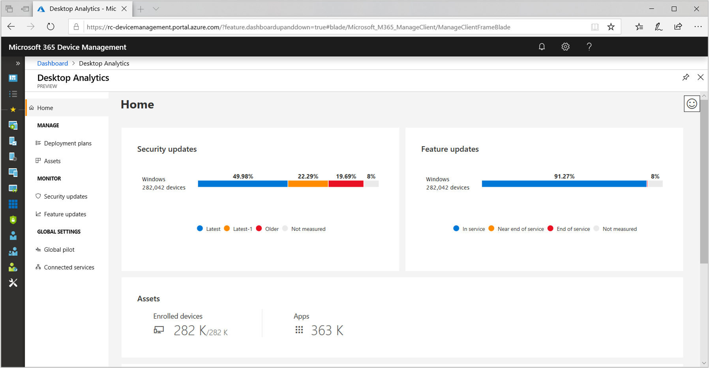
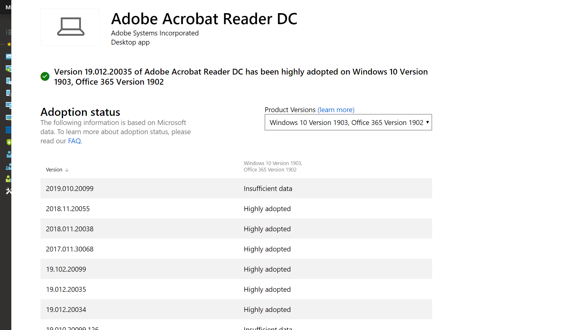

# Steg 1: Beredskap för enheter och appar

<table>
<thead>
<td></td>
<td>
<strong>Steg 1: Beredskap för enheter och appar</strong>

Starta ditt distribution projekt för datorhantering med en inventering av dina enheter och appar, prioritera vad du behöver för att gå vidare, testa prioriterade appar och enheter och åtgärda sedan vad som krävs för att distribueras.
</td>
<td></td>
</thead>
</table>

>[!NOTE]
>Beredskap för enheter och appar är det första steget i vårt rekommenderade distributionsprocesshjul, som täcker de holistiska aspekterna av applikationer och maskinvarukompatibilitet. Om du vill se en fullständig distribution av skrivbordsversionen av kan du gå till [Skrivbordsdistributioncenter](https://aka.ms/HowToShift).
>

Tidigare var ett enormt hinder för att uppgradera användarens skrivbord och applikations- och maskinvarukompatibilitet. De goda nyheterna när du planerar dina arbetspass till Windows 10 och Office 365 ProPlus, är att i stort sett alla program som skrivits under de senaste 10 åren körs på Windows 10, och alla COM-tillägg och VBA-makron din organisation använde i versioner av Office till och med från Office 2010, kommer att fortsätta att fungera med de senaste versionerna av Office, utan att du behöva göra några ändringar.

Beroende på hur storleken och åldern på din organisation är verifiering av applikation- och maskinvarukompatibilitet troligtvis fortfarande ett viktigt första steg för vår rekommenderade distributionsprocess med 8 faser.

I den här artikeln vägleder vi dig genom den första fasen – beredskap för enheter och appar – med Microsoft-verktyg för utvärdering av beredskap, som Desktop Analytics, en intelligent molnbaserad lösning som är tillgänglig med Windows-licensen.

## Kompatibilitetsgenomsökning med Windows 10

Innan du distribuerar Windows 10 rekommenderar Microsoft att du kontrollerar att dina befintliga enheter som kör Windows 7 eller 8/8.1 är kompatibla. Windows 10-installationsmedia stöder en kommandoradväxel för setup.exe för att köra uppgraderingen men endast kontrollera kompatibilitet, inte faktiskt utföra uppgraderingen. ScanOnly kan köras som en kommandofil med skript eller integreras i en aktivitetssekvens för Microsoft Endpoint Configuration Manager, som även kan köra ScanOnly direkt från nätverket så att installationsmedia för Windows 10 inte direktuppspelas på den lokala enheten. När ScanOnly slutförts returneras resultatet via returkoder i loggfiler som genereras av setup.EXE.   

Ett exempel på en ScanOnly-kommandorad som slutförde kompatibilitetskontrollen tyst skulle se ut så här:

    Setup.EXE /Auto Upgrade /Quiet /NoReboot /Compat ScanOnly

Mer information om ScanOnly och andra kommandoväxlar för Windows-installationer finns i kommandoradsalternativen för [Windows-installationer](https://aka.ms/setupswitches).

## Rekommenderat verktyg: Desktop Analytics

Med Desktop Analytics får du många fördelar jämfört med traditionella system för skrivbordshantering och är vårt rekommenderade verktyg. Det är agentlöst och vägleder dig genom vad som behöver göras för att använda informationen för applikationen och enhetskompatibilitet som samlas in genom uppgraderingen av hundratals olika klientdatorer. Med den här informationen får du en detaljerad bedömning som identifierar kompatibilitetsproblem som kan blockera din uppgradering, och den kan användas med länkar till föreslagna korrigeringar som Microsoft känner till.

För att konfigurera Desktop Analytics måste du först konfigurera en Azure-prenumeration och inkludera en arbetsyta för Azure Desktop Analytics-inloggning. När du har aktiverat tjänsten för Desktop Analytics kan du registrera alla Internet-anslutna Windows 7 SP1 eller nyare enheter via grupprincipinställningar – det är det enkelt. Det finns inga agenter att distribuera, och det visuella arbetsflödet i Desktop Analytics vägleder dig från pilotprojekt till produktionsdistribution. Om du vill kan du exportera data från Desktop Analytics till verktyg för distribution av programvara, t. ex. Microsoft Endpoint Configuration Manager (Current Branch), för att rikta datorerna direkt och skapa samlingar när de blir klara för distribution.

Om du inte har konfigurerat Desktop Analytics för din miljö eller vill registrera dig för en utvärderingsversion kan du gå till Desktop Analytics-sidan] (https://www.aka.ms/desktopanalytics) och komma igång.

## Process för beredskap för enheter och appar

Beredskap för enheter och appar består av fyra steg: 1. Lager, 2 Prioritera, 3. Test, 4 Åtgärda. Nu ska vi titta närmare på var och en av dem.

### 1\. Lager

I Desktop Analytics används en agentfri process för att inventera datorerna och programmen över alla enheter. Den innehåller också rapporter om lättillgängliga webbplatser, program och intranätplatser för att hjälpa dig med testning av kompatibilitet senare.

### 2\. Prioritera

Med hjälp av Desktop Analytics får du hjälp att identifiera och prioritera de vanligaste apparna och maskinvaran som används i organisationen, liksom vad du ska tänka på när du ska häva en blockering för så många datorer som möjligt för distribution när du har inventerat.

Det innehåller även vägledning som hjälper dig att utvärdera uppdateringar som krävs för att lösa problem under nästa steg: testning.

### 3\. Testning

Du kommer att märka att de flesta av de program, drivrutiner och tillägg som inventerats fungerar som de är. För objekt som Desktop Analytics bedömer har fel får du information om hur du hittar versionsuppdateringar för att lösa kompatibilitetsproblem. I stället för att avsätta tid och resurser för att lösa komplexa problem i icke-kritiska, glest distribuerade program och äldre enheter kan du välja att arbeta med användare i stället för att återkalla och ersätta objekten.

Du kan även använda Desktop Analytics för att utvärdera problem med webbläsarkompatibilitet, identifiera webbplatser och webbprogram som nås av användare som fortfarande använder ActiveX-kontroller, webbläsartillägg, VBScript eller annan äldre teknik som inte stöds av Microsoft Edge-webbläsaren. Användarna måste fortfarande använda Internet Explorer 11 för de här webbplatserna, och du kan lägga till dem i [företagsläget för webbplatslistan](https://docs.microsoft.com/microsoft-edge/deploy/emie-to-improve-compatibility)med hjälp av Enterprise Mode Site List Manager.

För att hjälpa till med att flytta över till Office 365 ProPlus vill du kanske använda [Readiness Toolkit for Office](https://docs.microsoft.com/deployoffice/use-the-readiness-toolkit-to-assess-application-compatibility-for-office-365-pro) för att testa kompatibiliteten för tillägg och VBA-makron (Microsoft Visual Basic for Applications).

### 4\. Åtgärda

Den sista fasen av beredskap för enheter och appar och program är att ”åtgärda”. Här kan du ta reda på vilka program eller drivrutiner som är nödvändiga. Du kommer att använda dessa för att ersätta eller uppdatera äldre versioner som en del av distributionsprocessen.

När du arbetar genom listan för att åtgärda problem ser du att fler och fler datorer blir ”redo för distribution”. Det innebär att både drivrutiner och appar på datorerna anges som kompatibla med den version av Windows 10 som du använder för distribution.

### Configuration Manager-programvaruinventering för prioritering av program

Configuration Manager-programvaruinventering är ett alternativ till att använda molnbaserade analyslösningar för beredskap för enheter och appar. Du kan använda installationsantal och ökad detaljnivå i olika datorer för att prioritera testning och verifiering av kompatibilitet och ange programpaket som kompatibla med Windows 10 via paketinställningar. Med det här alternativet kan du inte jämföra känd kompatibilitetsinformation med Microsofts analystjänster, men det kan vara en effektiv lösning som riktar sig till en mindre uppsättning prioriterade appar för manuell testning. 

Om du vill ha mer information kan du läsa mer i [introduktionen till programvaruinventering i Configuration Manager](https://docs.microsoft.com/configmgr/core/clients/manage/inventory/introduction-to-software-inventory) och ställa in plattformskraven i programpaket i [Packages and programs in Configuration Manager](https://docs.microsoft.com/configmgr/apps/deploy-use/packages-and-programs) (Paket och program i Configuration Manager).

## App Assure

Ett annat verktyg som kan hjälpa dig med kompatibilitet för Windows 10 och Office 365 ProPlus för appar är programmet [App Assure](https://aka.ms/appassure) som är tillgängligt via FastTrack Center. I händelse av giltiga problem med programvaran hjälper en Microsoft-tekniker dig utan extra kostnad via App Assure för att hjälpa dig att åtgärda inkompatibilitetsproblem i programmet.

## Fortsatt användning av verktyg för diagnostikdata

Desktop Analytics är inte bara ett verktyg som hjälper dig att byta till Windows 10 och Office 365 ProPlus. När du har stationära datorer som körs på Windows 10 och Office 365 kan du använda det för att underhålla din distribution och hantera halvårsvisa funktionsuppdateringar så att du kan hålla dig uppdaterad.

## Nästa steg 

## [Steg 2: Katalog- och nätverksberedskap](https://aka.ms/mdd2)
