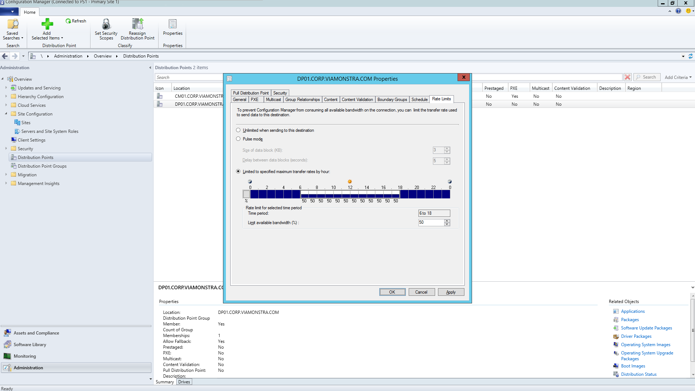
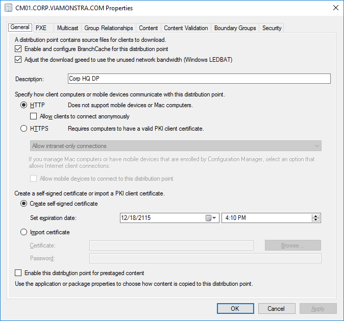
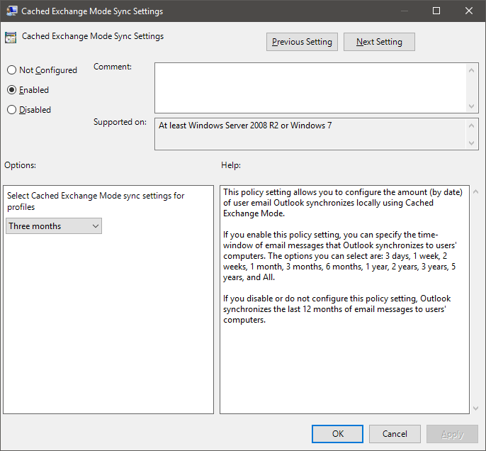
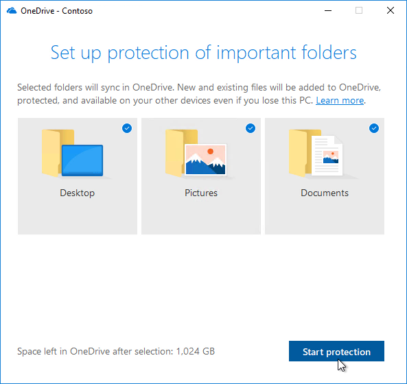

# Steg 2: Katalog- och nätverksberedskapStep 2: Directory and Network Readiness

Kontrollera att katalog och nätverk är konfigurerade och kan stödja ditt skifte till Windows 10 och Office 365 ProPlus.Ensure your directory and the network are configured and ready to support to your shift to Windows 10 and Office 365 ProPlus. Det innebär att användarna måste ha Azure Active Directory-tjänster och nätverket måste ha den kapacitet som krävs för att kunna hantera både den normala trafiken och rörelsen av potentiellt stora data när datorerna uppgraderas och användarnas filer, inställningar och program återställs.This will require Azure Active Directory Services to be in place for users, and your network must have the capacity to handle both its regular traffic and the movement of potentially vast amounts of data as PCs are upgraded, and users’ files, settings and applications are restored.

<table>
<thead>
<td></td>
<td>
<strong>Steg 2: Katalog- och nätverksberedskap</strong><strong>Step 2: Directory and Network Readiness</strong>

Molnanslutna tjänster i Office 365 ProPlus och nya distributionsalternativ som Windows Autopilot kräver Azure Active Directory.Cloud connected services in Office 365 ProPlus and new deployment options like Windows Autopilot require Azure Active Directory. Ditt nätverk och dina anslutningar är också viktiga när du planerar att flytta Windows-avbildningar, appar, drivrutiner och relaterade filer till datorerna.Your network and connectivity are also important areas to plan when moving Windows images, apps, drivers and related files to your PCs. Lär dig hur nya verktyg och distributionsalternativ minskar och effektiviserar nätverkstrafiken.Learn how new tools and deployment options reduce and streamline network traffic.
</td>
<td></td>
</thead>
</table>

>[!NOTE]
>Katalog- och nätverksberedskapen är det andra steget i vår rekommenderade distributionsprocess som fokuserar på Azure Active Directory och optimerar nätverket.Directory and Network Readiness is the second step in our recommended deployment process wheel focusing on Azure Active Directory and optimizing the network. Om du vill se en fullständig skrivbordsdistribution kan du besöka [Center för skrivbordsdistribution](https://aka.ms/HowToShift).To see the full desktop deployment process, visit the [Desktop Deployment Center](https://aka.ms/HowToShift).
>

Katalog- och nätverksberedskapen är grundläggande i att säkerställa en smidig distribution av operativsystem och skrivbord.Directory and Network readiness is fundamental to ensuring a smooth OS and desktop deployment. Precis som med all automatisk distribution är det viktigt att se till att dina filresurser går att nå och att nätverket kan överföra mycket stora filer åt gången. Det kan röra sig om hundratals eller till och med tusentals datorer.As with any automated deployment, it is important to ensure your file shares can be reached, and your network will need to be able to support the transfer of very large files, possibly to hundreds or even thousands of PCs at a time.

När du övergår till Windows 10 och Office 365 ProPlus måste du se till att den molnbaserade identiteten är konfigurerad med Azure Active Directory.With your shift to Windows 10 and Office 365 ProPlus you also now need to make sure that cloud-based identity is set up with Azure Active Directory. Det är viktigt att inte bara för att aktivera Office 365 ProPlus, utan du kan också dra nytta av moderna etableringslösningar som Windows Autopilot.This is key not only to activating Office 365 ProPlus, it also allows you to take advantage of modern provisioning solutions like Windows Autopilot.

I den här artikeln ska vi utforska verktygen och alternativen för att förbereda katalogtjänster, användar- och enhetsbehörigheter, så att de är redo för distribution till Windows 10 och Office 365 ProPlus.In this article we’ll explore the tools and options to prepare your directory services, and user and device permissions, ready for deployment to Windows 10 and Office 365 ProPlus.

## Lägga till Azure Active DirectoryAdding Azure Active Directory

Om din organisation redan använder Office 365, Exchange Online, Microsoft Intune eller andra Microsoft Online-tjänster, använder du redan Azure Active Directory.If your organization already uses Office 365, Exchange Online, Microsoft Intune, or other Microsoft Online services, the good news is you are already using Azure Active Directory. I så fall behöver du bara säkerställa att de användare som omfattas av skrivbordsdistributionen finns i din Azure Active Directory och att licenserna har tilldelats.If you are, you just need to ensure that the users you are targeting for desktop deployment are in your Azure Active Directory and that licenses have been assigned.

Om du inte använder Azure Active Directory för närvarande finns det [flera resurser](https://docs.microsoft.com/azure/active-directory/) som hjälper dig att installera det.If you are not currently using Azure Active Directory, there are [numerous resources](https://docs.microsoft.com/azure/active-directory/) to help you set it up. Du kan vara berättigad till personlig hjälp via Microsoft FastTrack i din Office 365-licens.You may well qualify for personalized assistance via Microsoft FastTrack, as part of your Office 365 license. Mer information om Microsoft FastTrack finns [här](https://fasttrack.microsoft.com).You can check out more about Microsoft Fastrack [here](https://fasttrack.microsoft.com).

När du har Azure Active Directory på plats kan användarna logga in på och aktivera sina Office 365 ProPlus-appar. Du kan även använda Microsoft Intune eller Windows Autopilot-distribution för att distribuera appar och principer automatiskt.Once you have Azure Active Directory in place, your users can sign in to and activate their Office 365 ProPlus apps, and you can use Microsoft Intune or Windows Autopilot deployment for automated deployment of apps and policy.

## NätverksberedskapNetwork Readiness

Du måste överväga bandbreddskraven när du planerar distributionerna.You must consider bandwidth requirements when planning your deployments. Det finns tre huvudsakliga komponenter i en distribution som påverkar nätverket – datoravbildning, programvaruuppdateringar och användaranpassning.There are three main components in a deployment that will have an impact on your network – PC imaging, software updates, and user personalization. Detta kan innebära att mer än 20 GB per dator används vid den första migreringen och sedan att 1 GB eller mer krävs per månad och dator för att vara uppdaterad.Between them, this can mean in excess of 20 GB per PC for the initial migration, and often 1 GB or more per month per PC to stay up-to-date.

Vi börjar med att granska kraven för var och en av de tre huvudkomponenterna:Let’s start by exploring the requirements of each of these three main components:

### DatoravbildningPC Imaging

Vid Windows-avbildningar utan anpassning bör du vanligtvis planera för 3 GB per dator, men vid anpassade avbildningar med appar kan du behöva tillåta 6 GB eller mer.For Windows Images with no customization you should plan typically for 3GB per PC, while for customized images with apps you may need to allow 6GB, or more. Du kan även behöva fundera över drivrutinspaketen. De kan bestå av flera hundra megabyte per dator, ibland upp till 1 GB.You may also need to consider Driver packages; these can be a few hundred megabytes per PC, sometimes up to 1GB.

### ProgramuppdateringarSoftware Updates

Du måste planera nätverksbandbredden vid programuppdateringar.You’ll need to plan network bandwidth for software updates. Windows 10 och Office 365 ProPlus använder en ny tjänstmodell som levererar månatliga och halvårsvisa uppdateringar.Windows 10 and Office 365 ProPlus use a new servicing model delivering monthly and semi-annual updates. Om du inte har använt den här modellen förut, kan du lära dig mer om hur den fungerar [här](https://docs.microsoft.com/windows/deployment/update/waas-overview).If you are new to this model, you can learn more about how this works [here](https://docs.microsoft.com/windows/deployment/update/waas-overview).

Den nya tjänstmodellen innehåller funktionsuppdateringar för Windows två gånger om året, uppdateringar av Office halvårskanal och månatliga kvalitetsuppdateringar.The new servicing model includes Feature Updates for Windows twice a year, Office Semi-Annual Channel Updates, and monthly Quality Updates. Funktionsuppdateringar är vanligtvis 2–4 GB i storlek och uppdateringar av Office halvårskanal är 300–400 MB per uppdatering.Feature Updates are typically 2 – 4GB in size, and Office Semi-Annual Channel updates are 300 – 400 MB per update. Det finns även månatliga kvalitetsuppdateringar.Then there are the monthly Quality Updates. De kan variera från några hundra megabyte till drygt en gigabyte.These may range from a few hundred megabytes to over a gigabyte. Det beror på att månatliga uppdateringar är kumulativa, så storleken ökar under tjänstens livstid för varje Windows 10-version.This is because monthly updates are cumulative, so these increase in size over the servicing lifetime for each Windows 10 version. Det finns verktyg som kan hjälpa till att minska mängden data som måste överföras via nätverket när uppdateringar implementeras.That said, there are tools that can help reduce the amount of data that must pass over the network to implement updates. Vi kommer att beskriva detta mer detaljerat nedan.We will cover this in more detail below.

### AnvändaranpassningUser Personalization

Den tredje komponenten att tänka på är användaranpassning.The third component to consider is user personalization. Här måste du planera nätverksbandbredden för att få plats med att återställa användarfiler, deras inställningar och program i processen att uppdatera eller ersätta datorn.Here you need to plan network bandwidth to accommodate the restoring of user files, their settings, and their applications as part of the PC refresh or replacement process. Tillsammans överstiger objekten ofta 20 GB per dator, men för vissa användare kan de överstiga 100 GB.Together, these items often exceed 20 GB per PC; for some users these may exceed 100 GB.

## Begränsa bandbreddenLimiting Bandwidth

Ett sätt att begränsa effekten av distributionsrelaterad trafik i nätverket, är att begränsa den genom att använda BITS-inställningen (Background Intelligent Transfer Service) på klienterna.One way to limit the impact of deployment-related traffic on the network is to throttle it using the BITS (Background Intelligent Transfer Service) setting on clients. I BITS används en ABR (Adaptive Bit Rate) för att justera tillgänglig bandbredd för distributionsändamål. Den kan konfigureras på klienter med hjälp av grupprinciper.BITS uses an Adaptive Bit Rate (ABR) to adjust bandwidth available for deployment purposes; it can be configured on clients using Group Policy.

[Om BITSAbout BITS](https://docs.microsoft.com/windows/desktop/bits/about-bits)

Om du använder konfigurationshanteraren för Microsoft Endpoint (aktuell förgrening) kan du också konfigurera BITS-aktiverade distributionsplatser eller aktivera multicast med WDS.If you use Microsoft Endpoint Configuration Manager (Current Branch), you can also configure BITS-enabled Distribution Points or enable multicast with WDS.

Att begränsa specifik trafik innebär att normal nätverkstrafik påverkas mindre av att datorerna laddar ned uppdateringar och program.Throttling specific traffic means that normal network traffic is less impacted by PCs downloading updates and applications. Men genom att tilldela en viss procentandel av bandbredden till de här aktiviteterna, påverkas produktiviteten inte alls av Windows- eller Office-distributionen. Processerna fortsätter att fungera, men distributionsrelaterade driftstopp kan förvärras och användare kan vara utelåsta från sina datorer medan distributionen körs.But carving out a certain percentage of bandwidth for these tasks helps ensure productivity isn’t impacted by Windows or Office deployment and processes continue to run as needed, it can worsen deployment-related downtime, with users locked out of their PCs while a deployment runs.

Som tur är finns det nya verktyg som gör det enklare för dig att hantera nätverkets påverkan vid en storskalig skrivbordsdistribution, exempelvis LEDBAT som optimerar användningen av tillgänglig bandbredd och P2P-alternativ som flyttar bort distributionstrafiken från mitten av nätverket och ut i perimeternätverketFortunately, there are new tools to make it easier for you to manage the network impact of a large-scale desktop deployment, including LEDBAT to optimize use of available bandwidth, and peer-to-peer (P2P) options to move deployment traffic away from the center of the network and out to the perimeter

## Rensa bandbreddenScavenging Bandwidth

LEDBAT (Low Extra Delay Background Transport) som stöds i Windows Server 2019 och konfigurationshanteraren för Microsoft Endpoint (aktuell förgrening), är utformad för att optimera nätverkstrafiken till Windows-klienter.Low Extra Delay Background Transport (LEDBAT), supported in Windows Server 2019 and Microsoft Endpoint Configuration Manager (Current Branch), is designed to optimize network traffic to Windows clients.

[De 10 viktigaste nätverksfunktionerna i Windows Server 2019: \#9 LEDBAT – Svarstidsoptimerad bakgrundstransportTop 10 Networking Features in Windows Server 2019: \#9 LEDBAT – Latency Optimized Background Transport](https://blogs.technet.microsoft.com/networking/2018/07/25/ledbat/)

Till skillnad från traditionella begränsningar kan LEDBAT använda all tillgänglig bandbredd i nätverket som en bakgrundsaktivitet, vilket ger direkt bandbredd när annan trafik begär det.Unlike traditional throttling, LEDBAT can use all available network bandwidth as a background task, instantly yielding bandwidth when other traffic requests it. Till skillnad från BITS finns inte någon fördröjning. Allt sker automatiskt – ingen manuell justering eller schemaläggning krävs och allt konfigureras på serversidan.Unlike BITS there is no delay; everything is automated – no manual tuning or scheduling required, and everything is setup server side. Detta ger potentiellt enorma prestandavinster.This affords potentially massive performance gains.

## Peer to peer-alternativPeer-to-Peer options

Peer to peer-alternativen används allt mer i Windows 10-migreringar, för datoravbildning, programuppdatering och användaranpassning.Peer-to-Peer options are increasingly being used in Windows 10 migrations, for PC imaging, software updates and user personalization. De är också värdefulla för att underlätta build till build-uppgraderingar efter din första Windows 10-distribution.They are also valuable in facilitating build-to-build upgrades after your initial Windows 10 deployment. Här visar vi flera exempel som hjälp vid flytt av Windows 10- och Office-relaterad trafik från mitten av nätverket, för att minska behovet av klassiska begränsningar och låta datorerna hitta de uppdateringsfiler de behöver i det lokala nätverket i stället för att hämta dem från en distributionsplats eller Internet.Here we will cover several examples to help move Windows 10 and Office-related traffic away from the center of the network, reducing the need for classic throttling approaches, and allowing PCs to find the update files they need on peers in their local network rather than downloading them from a distribution point or the internet.

Med **BranchCache** kan du ladda ned innehåll i distribuerade miljöer utan att påverka nätverket negativt.**BranchCache** can help you download content in distributed environments without saturating the network. Det finns två alternativ: Värdbaserat cacheläge, där du använder lokala servrar för att cachelagra innehåll och Distribuerat cacheläge (stöds i konfigurationshanteraren), som innebär att klienterna delar redan hämtat innehåll med varandra.It comes in two options: Hosted Cache Mode, which lets you use local servers to cache content, and Distributed Cache Mode (a mode supported in Configuration Manager), which lets clients share already downloaded content with each other.

**Peer-cachelagring** Klienter som stöds av konfigurationshanteraren kan också använda peer-cachelagring.**Peer Cache** Clients supported by Configuration Manager can also make use of Peer Cache. På så sätt kan tillgängliga datorer i nätverket vara värdar för innehållsdistribution.This allows PCs that are reliably available on the network to host source for content distribution. Du bör endast aktivera målenheter med pålitliga nätverksanslutningar som värdar (t.ex. stationära datorer, minitorn och torndatorer).You won’t want to enable this all of your PCs – only target devices with reliable network connections as hosts (e.g. desktop, mini-tower, or tower PCs). Peer-cachelagring kan även användas för distributionsuppgifter som körs i Windows PE under installationen.Peer Cache can even work for deployment tasks running in Windows PE phases during setup.

Obs! BranchCache och Peer-cachelagring kompletterar varandra och kan användas tillsammans i samma miljö.Note: BranchCache and Peer Cache are complementary and can work together in the same environment.

[BranchCache jämfört med Peer-cachelagringBranchCache vs. Peer Cache](https://blogs.technet.microsoft.com/swisspfe/2018/01/25/branch-cache-vs-peer-cache/)

**Leveransoptimering** Leveransoptimering är en annan peer-to-peer-cachelagring som tillhandahåller nätverksbaserade kontroller av distributioner.**Delivery Optimization** Delivery Optimization is another peer-to-peer caching technology, providing network-based controls for deployments. Leveransoptimeringen i Windows 10 uppdaterar inbyggda UWP-appar, installerar program från Microsoft Store och programuppdateringar med hjälp av Express Updates.Windows 10 Delivery Optimization to update built-in UWP apps, also to install applications from the Microsoft Store, and for software updates using Express Updates. Den fanns redan i tidiga versioner av Windows 10, men den har nyligen integrerats med konfigurationshanteraren för Microsoft Endpoint (aktuell förgrening).It has been available since early versions of Windows 10, though it has only recently integrated with Microsoft Endpoint Configuration Manager (Current Branch). Sedan Windows 10 version 1803 innebär de nya konfigurationsalternativen att du kan ange fristående bandbreddsbegränsningar för bakgrundsuppdateringar och förgrundsjobb, t.ex. en programinstallation från Store.Since Windows 10 version 1803 new configuration options mean you can now independently set bandwidth limits for background updates and foreground jobs such as an app install from the Store. Leveransoptimeringen i Windows har också stöd för Office 365 ProPlus i klientuppdateringar, vilka finns i alla Office 365-klientuppdateringskanaler som stöds.Windows Delivery Optimization now also supports Office 365 ProPlus during client updates, available in all supported Office 365 client update channels. Stöd för leveransoptimering i Windows under den initiala installationen av Office 365-klienten kommer snart.Support for Windows Delivery Optimization during Office 365 client initial installation will be coming soon.  

**Ytterligare överväganden för Office 365 ProPlus****Additional Considerations for Office 365 ProPlus**

Förutom leveransoptimeringen finns det tre saker som bidrar till att minska belastningen på nätverket vid Office 365 ProPlus-distributioner.In addition to leveraging Delivery Optimization, here are three items that will help reduce your network load due to Office 365 ProPlus deployments.

**Binary Delta Compression** Office 365 ProPlus använder Binary Delta Compression för att minska bandbredden som används av programuppdateringar vid uppdatering från den senaste Office 365 ProPlus-versionen till nästa version.**Binary Delta Compression** Office 365 ProPlus uses Binary Delta Compression to reduce bandwidth consumed by software updates when updating from the most recent release of Office 365 ProPlus to the next release. Genom att bara hämta de binära nivåändringarna från föregående version, minimeras påverkan från de ökade storlekarna per månad vid kumulativa uppdateringar.By only pulling the binary level changes from the previous release, the impact from month-over-month growth of cumulative updates is minimized. Det går att spara hundratals megabyte data per dator varje månad.This has the potential of saving several hundred megabytes of data, per PC, each month. För att kunna använda den här funktionen kan du inte hoppa över några versioner.In order to use this capability though, you cannot skip releases. Om du gör det måste du ladda ned den fullständiga kumulativa uppdateringen.If you do, then the full cumulative update must be downloaded.

[Ladda ned uppdateringar för Office 365Downloading Updates for Office 365](https://docs.microsoft.com/deployoffice/overview-of-the-update-process-for-office-365-proplus#download-the-updates-for-office-365-proplus)

**Outlook-datafiler** Outlook är ofta konfigurerat att cachelagra användarens hela postlåda lokalt för användning offline.**Outlook Data Files** Outlook is often configured to cache users’ entire mailbox locally for use offline. I de flesta Windows-distributioner, utom vid på-plats-uppgraderingar, kräver detta att användarens Outlook-datafiler återskapar sig själva efter uppgraderingen.In any Windows deployment, except an in-place upgrade, that requires the users’ Outlook Data Files to rebuild themselves after the upgrade. Det här är en automatisk process, men med begränsningarna i Outlook-postlådan som vanligtvis är upp till 100 GB, innebär en ny cachelagring av hela postlådan lokalt för alla användare stora dataöverföringar.This is an automated process, but with Outlook mailbox limits typically set to up to 100GB, re-caching the entire mailbox locally for all users means a lot of data transfer. Om du vill minska belastningen på nätverket kan du använda en grupprincip för att minska inställningen ”E-post som ska behållas offline”.To reduce the network load you may want to consider using Group Policy to reduce the “Mail to keep offline” setting. I Office 365 ProPlus eller Office 2016 är standardvärdet för Outlook inställt på 12 månader.In Office 365 ProPlus or Office 2016 the default value for Outlook is set to 12 months. Om du vill minska risken för nätverkspåverkan kan du ställa in offlinecachen på mellan 1 och 6 månader.In order to reduce network impact consider setting the offline cache to last between 1 to 6 months. Att ändra inställningen påverkar inte din onlinepostlådas storlek och hela postlådan kan fortfarande sökas igenom i Outlook när du är online.Changing this setting does not affect the size of the online mailbox, and the entire mailbox can still be searched via Outlook when online.

**OneDrive-filer på begäran och Flytt av känd mapp** OneDrive är ett bra sätt att synkronisera och skydda användarfiler från datorer och andra enheter i molnet.**OneDrive Files on Demand and Known Folder Move** OneDrive is a great way to synchronize and protect user files from PCs and other devices in the cloud. Med Flytt av känd mapp kan du framtvinga filsynkronisering från en användares mappar Skrivbord, Dokument och Bilder till OneDrive, så att filerna blir tillgängliga när de loggar in på en ny enhet eller en dator med en återställd avbildning.With Known Folder Move, you can enforce file sync from a user’s Desktop, Documents, and Pictures folders to OneDrive making those files available when signing into a new device a or reimaged PC. Kom ihåg att den totala storleken och antalet filer som finns i Skrivbord, Dokument och Bilder innebär att du bör planera distributionen av principer som aktiverar och tillämpar OneDrive på datorerna.Remember though, due to the sheer size and number of files kept in Desktop, Documents, and Pictures locations, you’ll want to be planful with the rollout of policies enabling and enforcing OneDrive on your PCs. Ett alternativ är att använda nätverkskontrollerna för grupprinciper till att begränsa bandbredden som används av OneDrive-synkroniseringstjänsten.One option is to use Group Policy Network controls to throttle bandwidth used by the OneDrive sync service.

[Konfigurera Flytt av känd mappSetup Known Folder Move](https://techcommunity.microsoft.com/t5/Microsoft-OneDrive-Blog/Migrate-Your-Files-to-OneDrive-Easily-with-Known-Folder-Move/ba-p/207076)

[OneDrive-filer på begäranOneDrive Files on Demand](https://www.microsoft.com/microsoft-365/blog/2017/05/11/introducing-onedrive-files-on-demand-and-additional-features-making-it-easier-to-access-and-share-files/)

Om du inte redan har distribuerat OneDrive är skiftet från Windows 7 till Windows 10 en perfekt tidpunkt att aktivera OneDrive och integrera Office 365 ProPlus.If you haven’t already rolled out OneDrive, the shift from Windows 7 to Windows 10 is a perfect opportunity to enable OneDrive and it integrates seamlessly Office 365 ProPlus. Det kan vara en bra idé att börja distribuera samtidigt som du granskar beredskapen för appar och enheter.Consider starting this roll-out while working through your app and device readiness. Detta ger filsynkroniseringen ett försprång innan du börjar flytta Windows-avbildningar och distribuera appar via nätverket.This will give file sync a head start before you start moving Windows images and deploying apps over your network.

## Nästa stegNext Step 

## [Steg 3: Leverans av Office och verksamhetsspecifika apparStep 3: Office and LOB App Delivery](https://aka.ms/mdd3)

## Föregående steg:Previous Step:

## [Steg 1: Beredskap för enheter och apparStep 1: Device and App Readiness](https://aka.ms/mdd1)

## FeedbackFeedback

Vi vill gärna höra vad du tycker.We'd love to hear your thoughts. Välj önskad typ:Choose the type you'd like to provide:

Produktfeedback Logga in för att ge feedback om dokumentationenProduct feedback Sign in to give documentation feedback

Vårt nya feedbacksystem bygger på GitHub-ärenden.Our new feedback system is built on GitHub Issues. Läs mer om den här ändringen i vårt blogginlägg.Read about this change in our blog post.
