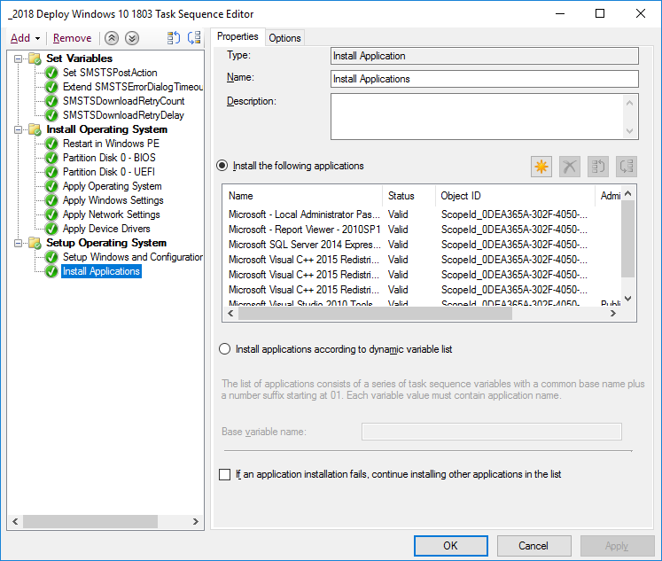
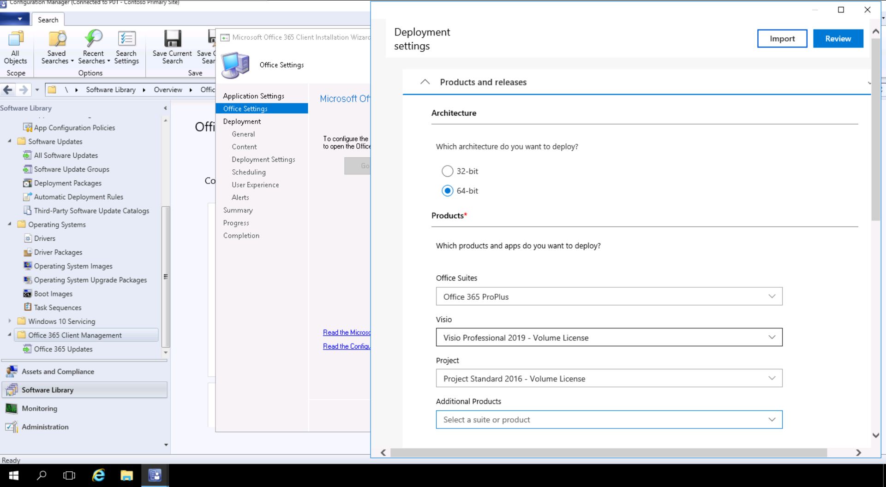

# Steg 3: Leverans av Office- och LOB-apparStep 3: Office and LOB App Delivery

<table>
<thead>
<td></td>
<td>
<strong>Steg 3: Leverans av Office och verksamhetsspecifika appar</strong><strong>Step 3: Office and LOB App Delivery</strong>

Kontrollera att dina appar är paketerade och klara för automatisk installation.Ensure your apps are packaged and ready for automated installation. Ta reda på hur du får nya alternativ för att konfigurera, leverera och hålla Office-apparna uppdaterade med Klicka-och-kör-paketering med Office 365 ProPlus.Learn how Click-to-Run packaging with Office 365 ProPlus gives you new options to configure, deliver and keep your Office apps up-to-date.
</td>
<td></td>
</thead>
</table>

>[!NOTE]
>Leverans av Office- och LOB-appar är det tredje steget i vår rekommenderade arbetsprocesshjul som innehåller alternativen för att installera och hantera Office och LOB.Office and LOB App Delivery is the third step in our recommended deployment process wheel covering the options to install and manage Office and LOB. För att distributionen ska lyckas ska du inte hoppa över de första två stegen.For successful deployment do not skip the first two steps.  Om du vill se den fullständiga skrivbordsdistributionsprocessen kan du gå till [Center för skrivbordsdistribution](https://aka.ms/HowToShift).To see the full desktop deployment process, visit the [Desktop Deployment Center](https://aka.ms/HowToShift).
>

Du är nu redo att leverera Office och dina verksamhetsspecifika appar, och det finns ett antal olika sätt att göra det, däribland några spännande nya alternativ.You are now ready to deliver Office and your Line of Business Apps and there are a number of ways to do this, including some exciting new options. Vissa program är endast tillgängliga som en 32-bitars eller 64-bitars kompilerad version, men andra som Office 365 ProPlus erbjuds både som 32-bitars och 64-bitars inbyggd kompilerad kod, och ett av de största beslut du kommer att göra är vilken version som ska distribueras.While some applications are only available as either a 32-bit or 64-bit compiled version, others such as Office 365 ProPlus, offer both as 32-bit and 64-bit native compiled code, and one of biggest decisions you will make is which version to deploy. Om du vill dra nytta av mer bearbetningskraft och RAM på nya enheter rekommenderar Microsoft att du använder 64-bitarsversionen när det inte finns några 32-bitarsberoenden.To take advantage of additional compute power and RAM on new devices Microsoft recommends using the 64-bit version when there are no 32-bit dependencies. Om du vill ta reda på om det finns några problem med tillägget eller filrelaterad kompatibilitet kan du behöva gå tillbaka till Steg 1: beredskap för enheter och appar innan du fortsätter.To determine any add-in or file-related compatibility challenges you may have it is recommended to revisit Step 1 Device and App Readiness before you continue.

Om inget hindrar dig rekommenderar vi att du använder 64-bitarsversioner av alla appar, t. ex. Microsoft Office.If nothing is blocking you, we recommend you deploy 64-bit versions of all apps, including Microsoft Office. 64-bitars inbyggda kompilerade appar ger bästa möjliga prestanda och är det bästa alternativet.64-bit native compiled apps offer the best performance and is the most future-proof choice.

Det finns många metoder och modeller för installation av appar i Windows, så vi ska se över dina leveransalternativ.There are many methods and models for installing apps on Windows, so let’s look at your delivery options.

[Hantering av program i Windows 10Windows 10 application management](https://docs.microsoft.com/windows/application-management/)

## MSI-baserade distributionerMSI-based Deployments

För dina affärsprogram kan du antagligen använda MSI-baserade paket eller körbara filer och installera appar som en del av en distributionsaktivitetssekvens för operativsystem.For your line of business apps, you’ll probably use MSI-based packages or executable  and install apps as part of an OS deployment task sequence. Windows 10 fortsätter att fungera med dessa paket.Windows 10 continues to work with these packages.

Verktyg för distribution av programvara, t. ex. Microsoft Endpoint Configuration Manager och Microsoft Intune, är också optimerade för att tillhandahålla MSI.Software deployment tools like Microsoft Endpoint Configuration Manager and Microsoft Intune are also optimized to deliver MSI-packaged apps. När du har verifierat dina appar i Windows 10 kan du använda Microsoft Endpoint Configuration Manager (current branch) för programleverans.Once you have validated your apps on Windows 10, you can use Microsoft Endpoint Configuration Manager (current branch) for app delivery. Om du använder företagsportalen i Microsoft Intune kan du utöka valet av IT-hälsoappar som är tillgängliga för din organisation för att inkludera de senaste programmen, och användare kan själva välja vad de behöver.If you use the Company Portal in Microsoft Intune you can extend the choice of IT sanctioned apps available to your organization to include the latest applications, and users to self-select what they need.

## DatoravbildningPC Imaging

En annan populär metod för att leverera appar i programmet är PC Imaging.Another popular method of app delivery is PC imaging. I det här fallet är programmen antingen installerade via aktivitetssekvensen eller manuellt på en exempeldator, och sedan registreras en systemavbildning med de program som krävs för installation.In this case, applications are either installed via task sequence or manually on a sample PC, then a system image is captured with the required applications pre-installed. Imaging-metoden för att bygga och avbilda kan spara tid när du etablerar nya datorer, men kom ihåg att operativsystem och appar i avbildningen blir inaktiva snabbt.The imaging approach to build and capture can save time when provisioning new PCs but remember operating systems and apps within the image can become stale quickly. Den kumulativa uppdateringsmodellen i Windows 10 och Office 365 ProPlus hjälper dig med det här problemet, men det löser inte problemet helt.The Cumulative Update model in Windows 10 and Office 365 ProPlus help with this problem, but doesn’t eliminate it completely. Därför rekommenderar vi en tunn avbildningsmetod där dina program installeras utanför avbildningen vid distributionstillfället.This is why we recommend a thin image approach, where your applications are installed from outside the image at deploy time.

Om du vill ta med Office 365 ProPlus i din avbildning måste du tänka på att det använder en användarspecifik aktivering. Det går inte att föraktivera med systemadministratören. Använd distributionsverktyget för Office för att förinstallera Office på enheten som du vill använda och hoppa över användarinloggningen.If you do want to include Office 365 ProPlus in your image, remember that this uses a user-based activation; it cannot be pre-activated by the system admin. Use the Office Deployment Tool to pre-install Office on the device you are imaging and skip the user sign-in. När avbildningen är distribuerad kan slutanvändarna logga in med sina Office 365-inloggningsuppgifter och aktivera Office 365 ProPlus.Once the image is deployed end users can sign-in using their Office 365 credentials and activate Office 365 ProPlus.

[Skapa en aktivitetssekvens för att installera ett operativsystemCreate a Task Sequence to Install an Operating System](https://docs.microsoft.com/configmgr/osd/deploy-use/create-a-task-sequence-to-install-an-operating-system)

[Distribuera Office 365 ProPlus som en del av en operativsystemavbildningDeploy Office 365 ProPlus as part of an operating system image](https://docs.microsoft.com/deployoffice/deploy-office-365-proplus-as-part-of-an-operating-system-image)

## Office Klicka-och-körOffice Click-to-Run 

Office 365 ProPlus installeras med Klicka-och-kör, och Klicka-och-kör ersätter MSI-baserade paket i alla versioner av kommande Office 2019-versioner för Windows.Office 365 ProPlus is installed using Click-to-Run, and Click-to-Run replaces MSI-based packaging in every version of the upcoming Office 2019 release for Windows. Det har en mängd fördelar, bland annat snabbare installationer, snabbare och mer effektiv uppdatering och renare avinstallation.It brings with it a number of advantages, including faster installations, faster and more efficient updating, and cleaner uninstallation. 

Program som levererats via Klicka-och-kör körs i en virtuell programmiljö på datorn och samexisterar med andra program utan konflikter De upptar även ungefär hälften av diskutrymmet som skulle upptas som ett MSI-baserat paket.Programs delivered via Click-to-Run execute in a virtual application environment on your computer and so co-exist with other applications without conflict; they also take about half the disk space they would as an MSI-based package. Office-program levereras och hanteras via [distribution verktyg för Office](https://www.microsoft.com/download/details.aspx?id=49117), som är det Office-installationsprogram som krävs för att ladda ned, konfigurera och anpassa dina Office-program.Office applications are delivered and managed via the [Office Deployment Tool](https://www.microsoft.com/download/details.aspx?id=49117) which is the Office setup engine needed to download, configure, and customize your Office apps. Distributionsverktyget för Office läser en XML-konfigurationsfil som innehåller metadatainstruktioner för hur du konfigurerar och anpassar din Office-installation.The Office Deployment Tool reads a configuration XML file which provides the metadata instructions on how to configure and customization your Office installation.

Microsoft rekommenderar att du använder [verktyget Office-anpassning ](https://config.office.com/) för att anpassa dina distributionsinställningar och skapa en XML-konfigurationsfil.Microsoft recommends using the [Office Customization Tool](https://config.office.com/) to customize your deployment settings and create your configuration XML file. Med verktyget Office-anpassning kan du ange vilka program och språk som ska installeras, hur programmen ska uppdateras, programinställningar och inställningar för installation.Through the Office Customization Tool you can set which applications and languages will be installed, how the applications will be updated, application preferences, and installation expereince settings.

Om du använder Configuration Manager kan du fortfarande använda det för omfattande distribution av Office 365 ProPlus.If you use Configuration Manager, you can still use it for broad deployment of Office 365 ProPlus. Configuration Manager (current branch) har inbyggt stöd för det uppdaterade verktyget för Office-anpassning, paketanpassning för Klicka-och-kör under installation och ursprungligt stöd för hantering av programuppdatering efter installationen.Configuration Manager (current branch) has native support for the updated Office Customization Tool, package customization for Click-to-Run at install time, and native support for software update management post installation.

[Distributionsguide för Office 365 ProPlusDeployment Guide for Office 365 ProPlus](https://docs.microsoft.com/deployoffice/deployment-guide-for-office-365-proplus)

[Ta bort befintliga MSI-versioner av Office när du uppgraderar till Office 365 ProPlusRemove existing MSI versions of Office when upgrading to Office 365 ProPlus](https://docs.microsoft.com/deployoffice/upgrade-from-msi-version)

[Hantera Office 365 ProPlus med Configuration ManagerManage Office 365 ProPlus with Configuration Manager](https://docs.microsoft.com/configmgr/sum/deploy-use/manage-office-365-proplus-updates)

[Tilldela Office 365-appar till Windows 10-enheter med Microsoft IntuneAssign Office 365 apps to Windows 10 devices with Microsoft Intune](https://docs.microsoft.com/intune/apps-add-office365)

## Webbläsarbaserade apparBrowser-based Apps

Det finns några saker du bör tänka på för att se till att de webbaserade programmen fortsätter att fungera som förväntat.There are a few things to consider in order to make sure that your browser-based applications continue to work as expected. Om du har vissa webbplatser och appar som du vet har kompatibilitetsproblem med Microsoft Edge kan du använda webbplatslistan i företagsläge så att webbplatserna öppnas automatiskt via Internet Explorer 11.If you have specific web sites and apps that you know have compatibility problems with Microsoft Edge, you can use the Enterprise Mode site list so that the web sites will automatically open using Internet Explorer 11.

Om du vet att dina intranät-webbplatser inte kommer att fungera korrekt med Microsoft Edge kan du dessutom konfigurera alla intranät-webbplatser så att de öppnas automatiskt i Internet Explorer 11.Additionally, if you know that your intranet sites aren't going to work properly with Microsoft Edge, you can set all intranet sites to open using Internet Explorer 11 automatically. I den här processen används en XML-fil för att styra om IE11 används för varje webbplats med hjälp av en grupprincip för att verkställa inställningar.This process uses an XML file to govern whether IE11 is used for each site, using Group Policy to enforce settings.

[Vad är företagslägeWhat is Enterprise Mode](https://docs.microsoft.com/internet-explorer/ie11-deploy-guide/what-is-enterprise-mode#what-is-enterprise-mode)

Hittills har vi tagit upp välkända distributionsmetoder.So far, we have covered well known deployment methods. Men det finns två nya metoder för programdistribution som du kanske vill överväga.But there are two new approaches to app deployment you may wish to consider.

## Microsoft Store för företagMicrosoft Store for Business 

Med Microsoft Store för företag får du ett smidigt sätt att identifiera, inhämta, hantera och distribuera kostnadsfria och betalda appar till Windows 10-enheter i skala.Microsoft Store for Business provides a flexible way discover, acquire, manage, and distribute free and paid apps to Windows 10 devices at scale. Som IT-administratör kan du publicera utvalda Microsoft Store-appar, tillsammans med dina egna appar, i din egen privata butik medan du tilldelar och återanvänder licenser efter behov.As an IT admin, you can publish selected Microsoft Store apps, along with your custom own apps, to your own private store while assigning and re-using licenses as needed. Användarna dirigeras endast till den här butiken, och hittar och installerar då endast godkända appar.Your users are directed to this store only, and so can only find and install approved apps.

Store-appar kan skapas internt som UWP-appar, eller så kan du använda Brygga för skrivbordsversion för att paketera om dina befintliga appar och lägga till moderna upplevelser för Windows 10.Store apps can be natively built as UWP apps or you can use the Desktop Bridge to repackage your existing apps for the Store and add modern experiences for Windows 10. Bortsett från koden som du använder för att förbättra Windows 10-upplevelserna förblir dina appar oförändrade och fortsätter att köras i fullständigt användarläget med fullständigt förtroende.Aside from the code that you use to light up Windows 10 experiences, your app remains unchanged and continues to run in full-trust user mode.

## MSIX-skapande av behållareMSIX Containerization

Ett nytt alternativ för paketering av programvara är MSIX.A new option for application packaging is MSIX. I MSIX används tekniken för skapande av behållare som är tillgänglig i Windows, tillsammans med de bästa aspekterna av Klicka-och-kör-, UWP- och MSI-paketering.MSIX uses the containerization technology available in Windows, bringing together the best aspects of Click-to-Run, UWP and MSI packaging. Med verktyg för att migrera befintliga installationer, t. ex. EXE, MSI, APPV och APPX direkt till MSIX, ser vi att MSIX-skapande av behållare ger en enhetlig väg för de många installationstekniker som används i dag.With tools to migrate existing installers like EXE, MSI, APPV and APPX directly to MSIX we see MSIX Containerization provides a unifed path for the many installation technologies in use today. MSIX-support ingår i aktuella versioner av Windows: alla enheter som kör Windows 10 RS5 eller senare innehåller allt du behöver för att installera och köra MSIX-paketerade appar.MSIX support is included in current versions of Windows: any device running Windows 10 RS5 or newer includes everything you need to install and run MSIX packaged apps. Windows 10 integrerar MSIX-behållare dynamiskt, men programmen hålls åtskilda från operativsystemet.Windows 10 dynamically integrates MSIX containers it receives, while keeping the applications separate from the operating system.

Skapande av behållare (containerization) innebär en rensad avinstallation och borttagning av paket, till skillnad från många MSI- och EXE-baserade paket som kan lämna kvar objekt i systemet.Containerization means clean uninstall and removal of packages, unlike a lot of MSI and EXE-based packages today that may leave items on the system. Det innebär också att bara vanliga användaruppgifter måste finnas för att installera-program – du behöver inte ha administratörsautentiseringsuppgifter för att installera MSIX-containrar.It also means only needing Standard User credentials to install applications – you do not have to have Administrator credentials to install MSIX containers. MSIX-containrar är mer effektiva att uppdatera.MSIX containers are more efficient to update too. När en uppdatering publiceras innebär användning av differentiella skillnader att endast att nya nettobinärfiler används, vilket minskar uppdateringsnyttolasten, för snabbare distributioner med mindre bandbredd i nätverket.When an update is published, use of block level differentials means only net new binaries are applied, reducing the update payload, for faster deployments consuming less network bandwidth.

Mer information om MSIX finns på [MSIX-teknikcommunitysidan](https://techcommunity.microsoft.com/t5/MSIX/ct-p/MSIX)You can find more information on MSIX via the [MSIX Tech Community site](https://techcommunity.microsoft.com/t5/MSIX/ct-p/MSIX)

## Nästa stegNext Step

## [Steg 4: Användares filer och inställningarStep 4: User Files and Settings](https://aka.ms/mdd4)

## Föregående stegPrevious Step

## [Steg 2: Katalog- och nätverksberedskapStep 2: Directory and Network Readiness](https://aka.ms/mdd2) 
