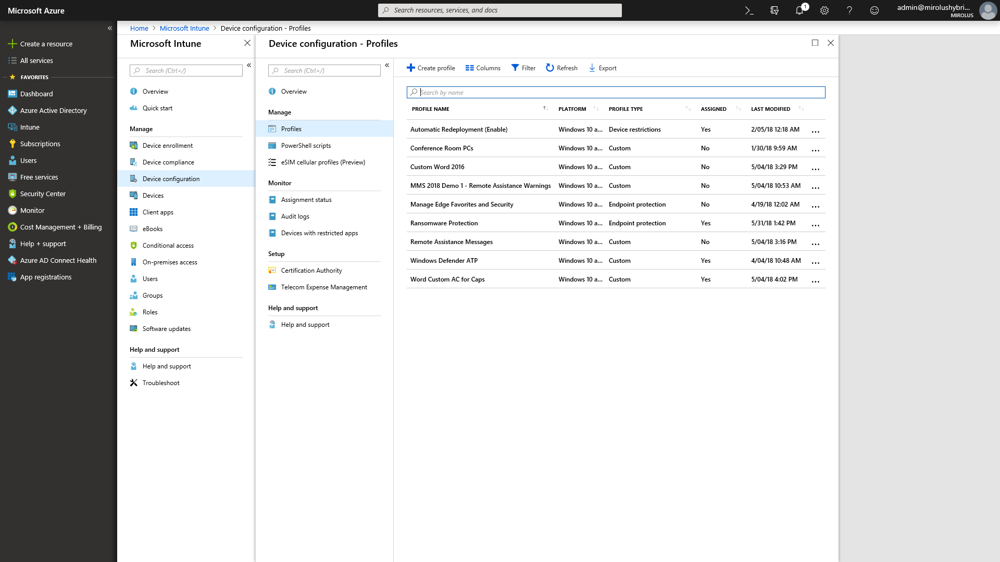

# Steg 5: Överväganden för säkerhet och efterlevnad

<table>
<thead>
<td></td>
<td>
<strong>Steg 5: Överväganden för säkerhet och efterlevnad</strong>

Windows 10 och Office 365 ProPlus ger nya sätt att skydda dina data, enheter och användare, samt möjligheten att snabbt identifiera och reagera på hot. Ta även reda på hur du hanterar vanliga problem som är kopplade till diskkryptering, program mot skadlig kod, samt principer när du flyttar till Windows 10.
</td>
<td></td>
</thead>
</table>

>[!NOTE]
>Säkerhet och efterlevnad är det femte steget i vårt rekommenderade distributionsprocesshjul som omfattar säkerhets- och efterlevnadsöverväganden för Windows 10 och Office 365 ProPlus. Om du vill se en fullständig skrivbordsdistribution kan du besöka [Center för skrivbordsdistribution](https://aka.ms/HowToShift).
>

Nu är det dags att granska alternativ för att anpassa nya säkerhets- och efterlevnadsfunktioner som en del av distributionen av Windows 10 och Office 365 ProPlus, tillsammans med överväganden och vanliga blockerare när du flyttar från tidigare versioner av Windows och Office. Många av de säkerhetsrelaterade funktionerna i Windows 10 driver på bytet till den nyare plattformen. Integrering med molntjänster i Office 365 och identitetsalternativ med hjälp av Azure Active Directory ger dessutom åtkomst till nya och ständigt uppdaterade skydd för dina data, enheter och användare.

## Avhjälpa potentiella säkerhetsrelaterade distributionsblockerare

Innan vi förklarar nya funktioner som du kan lägga till när du flyttar över till Windows 10 och Office 365 ProPlus och ansluter dessa miljöer till molnet ska vi börja med några trender vi sett som ofta kan störa distributionsprocessen.

### Diskkryptering

Vi börjar med ett av de första problemen som kan uppstå vid hårddiskkryptering. Många lösningar för hårddiskkryptering kan inte på ett enkelt sätt uppgraderas från en tidigare version av Windows till en senare version av Windows.

Med vissa lösningar för diskkryptering kan du utföra uppgraderingarna när du använder alternativet "/reflectdrivers" med installationsprogrammet för Windows på vissa versioner av deras plattformar, men andra kan kräva att du dekrypterar enheten före distributionen och sedan krypterar igen efter att Windows 10 har installerats. För vissa lösningar kan du inte heller flytta från MBR (Master Boot Record), med äldre BIOS, till GPT (GUID Partition Table), som krävs för UEFI. Det är viktigt eftersom en 64-bitars version av Windows 10 med UEFI krävs för de nya virtualiseringsbaserade säkerhetsfunktionerna i Windows 10, och de beskrivs nedan.

Ett alternativ för att lösa problemen är att använda BitLocker i Windows 10, som ingår i Windows 10 Pro och senare utgåvor. Med BitLocker kan du pausa skyddet för uppgraderingar av operativsystemet och funktionsuppdateringar som en del av processen.

[Grundläggande BitLocker-distribution](https://docs.microsoft.com/windows/security/information-protection/bitlocker/bitlocker-basic-deployment)

### Kompatibilitet med antivirusprogram och program mot skadlig kod

För det andra, även om vi ser att fler än [99 % av Windows-programmen är kompatibla](https://www.microsoft.com/microsoft-365/blog/2018/09/06/helping-customers-shift-to-a-modern-desktop/) mellan Windows 7 och Windows 10 så är undantagen ofta antivirusprogram eller VPN-klienter (Virtual Private Network). Dessa program implementerar ofta icke-standardiserade utvecklingsmetoder och API:er, som ofta använder odokumenterade sätt för att skydda systemet eller ansluta dig till nätverksresurser.

Därför kan dessa program vara känsliga för ändringar vid ett byte till en ny version av Windows. Om ditt antivirusprogram eller VPN-program inte fungerar i Windows 10, eller efter uppgraderingen, är åtgärden vanligtvis att ersätta programmet du använder med något som stöds och har testats i Windows 10.

### Säkerhetsprinciper

De inställningar för grupprinciper i Active Directory som används för äldre versioner av Windows och Office kanske inte kan översättas direkt till Windows 10 och Office 365 ProPlus, och det finns olika överväganden för de senaste säkerhets- och efterlevnadsfunktionerna. Det är en bra idé att använda Microsoft Security Compliance Toolkit för att få en baslinje för säkerhetsprinciperna för aktuella versioner av Windows och Office. Dessutom är det värt att undersöka principerna för hantering av mobila enheter som en del av Microsoft Intune.

## 

## Nya funktioner för säkerhet och efterlevnad i Microsoft 365

Vi har angett de överväganden du bör göra för att flytta dina nuvarande skydd framåt och saker du bör vara medveten om innan bytet. Nu ska vi ta en titt på nya funktioner som du kan dra nytta av när du flyttar till Windows 10, Office 365 ProPlus och molnbaserade alternativ från EMS och senare.

### Identitets- och åtkomsthantering

Vi börjar med identitets- och åtkomsthantering. Azure Active Directory är identitetskontrollplanen för appar, enheter och molntjänster och är det moderna sättet att ansluta till Office 365 och andra molntjänster. Med villkorsstyrd åtkomst kan du definiera olika autentiseringskrav baserat på var du loggar in från, vilken enhet du använder och saker som avvikande beteenden.

På enhetsnivå kan biometri ge unika identifierare för enklare och säkrare åtkomst till dina enheter och appar – när du går mot målet att eliminera lösenord. Windows Hello tillhandahåller enhetsbaserad multifaktorautentisering. Den använder själva enheten, din PIN-kod eller unika biometriska identifierare, t.ex. ditt ansikte och fingeravtryck, som du kan tillämpa via en princip.

[Grunderna i identitetshantering i Azure](https://docs.microsoft.com/azure/active-directory/fundamentals/identity-fundamentals)

[Förstå identitetslösningar i Azure](https://docs.microsoft.com/azure/active-directory/fundamentals/understand-azure-identity-solutions)

[Villkorsstyrd åtkomst i Azure Active Directory](https://docs.microsoft.com/azure/active-directory/conditional-access/overview)

[Windows Hello för företag](https://docs.microsoft.com/windows/security/identity-protection/hello-for-business/hello-identity-verification)

### Virtualiseringsbaserad säkerhet

Utöver identifikation kan du nu också aktivera löpande skydd mot både kända och okända hot. För att göra detta använder Windows 10 virtualiseringsbaserad säkerhet i kärnan för att säkerställa startintegritet och kodintegritet med säker start. Vi kan också hjälpa till att förhindra stöld av autentiseringsuppgifter med Credential Guard genom att hålla användarhemligheter isolerade från Windows. Och Application Guard kan isolera och minska webbläsarbaserade hot genom att köra webbläsaren i en isolerad behållare. Alla dessa tekniker använder virtualiseringsbaserad säkerhet i Windows 10 och är grundläggande ändringar som inte kan replikeras i ett Windows 7-system – observera att dessa även kräver UEFI, 64-bitars Windows och stöd för virtualiseringstillägg med SLAT – på maskinvarunivå.

[Mer om virtualiseringsbaserad säkerhet](https://docs.microsoft.com/windows-hardware/design/device-experiences/oem-vbs)

### Förbättringar av säkerheten från molntjänster

Med molntjänsterna får du ytterligare ett lager av valfritt skydd för att förbättra säkerheten för Windows och Office. Det kan ge dig en ny nivå av kontroll, oftast i realtid, som direkt kan identifiera, motstå och reagera på nya attacker och angreppstyper, särskilt jämfört med traditionell programuppdatering och AV-signaturfiler, där distributionstiderna för svar och uppdatering är långsammare.

Tillsammans med Microsoft Intelligent Security Graph har du snabbare åtkomst till både information och skydd från nya hot. Här är några exempel på vad du kan dra nytta av, och vi börjar med Office.

**[Dataförlustskydd](https://docs.microsoft.com/office365/securitycompliance/data-loss-prevention-policies)**, inbyggt i Office 365 ProPlus, informerar användarna om säkerhetsprinciper när högriskinnehåll, t.ex. kreditkortsnummer eller ID-nummer, upptäcks. Principer kan informera eller blockera sändning och delning efter att användare har meddelats.

**[Azure information Protection](https://docs.microsoft.com/azure/information-protection/rms-client/client-admin-guide)** är en kompletterande tjänst som kan användas med Office, så att användarna enkelt kan klassificera och märka Office-filerna med etiketter. Den kan utlösa en automatisk åtgärd på filer med etiketter, t.ex. kryptering eller låsning av delning.

Vi har också infört **[Säkra länkar](https://docs.microsoft.com/office365/securitycompliance/atp-safe-links)**-skydd i Office-appar för att skydda dig mot en dynamisk lista med kända skadliga webbplatser.

Dessutom finns **[Säkra bifogade filer](https://docs.microsoft.com/office365/securitycompliance/atp-safe-attachments)** i Outlook och som en del av Exchange Online som är mer omfattande än e-postfiltrering för kontroll av bifogade filer. Om en bifogad fil med hög risk identifieras, informerar Säkra bifogade filer användaren om kända skadliga bilagor och tar bort dem från e-posten.

**[Meddelandekryptering i Office 365](https://docs.microsoft.com/office365/securitycompliance/encryption)** (OME) kan också användas för att skydda e-post och bifogade filer som skickats, och säkerställer att bara avsedda mottagare kan visa e-postinnehåll. OME fungerar smidigt med Google-, Yahoo- och Microsoft-konsumentkontoautentisering, och engångslösenord tillåter användare av andra e-posttjänster att på ett säkert sätt ta emot e-post.

#### Ytterligare Windows 10-skydd

**[Windows Defender-programreglering](https://docs.microsoft.com/windows/security/threat-protection/windows-defender-application-control/windows-defender-application-control)** i Windows 10 fungerar utifrån en godkänd lista över tillåtna och nekade program som Microsoft har kontrollerat när det gäller säkerhet och allt som hanteras av Endpoint Protection-principer med Microsoft Intune.

**[Microsoft Defender Avancerat skydd](https://docs.microsoft.com/windows/security/threat-protection/windows-defender-atp/overview)** är en enhetlig plattform för förebyggande skydd, identifiering efter överträdelse, automatiserad undersökning och svar. Den skyddar slutpunkterna från cyberhot, identifierar avancerade attacker och dataöverträdelser, automatiserar säkerhetsincidenter och förbättrar säkerheten.

**[Exploit Guard](https://docs.microsoft.com/windows/security/threat-protection/windows-defender-exploit-guard/windows-defender-exploit-guard)** hjälper till att minska attackytan för program som körs genom att förhindra att skadlig kod tar sig in i Windows och genom att blockera ej betrodda processer från att komma åt skyddade mappar.

#### Microsoft Intune

[Microsoft Intune](https://docs.microsoft.com/intune/introduction-intune) fungerar som en molnbaserad hanteringstjänst för mobila scenarier, t.ex. iOS-, Android- och Windows-enheter, och kan nu konfigureras för samtidig hantering för att komplettera och utöka kontroller för specifika arbetsbelastningar som hanteras av Konfigurationshanteraren. En fördel med detta är att enheter som kommer åt skyddade resurser kan krävas att registrera sig för enhetshantering – även ej hanterade, ej domänanslutna eller ej Azure AD-anslutna enheter. Du kan också dra nytta av införandet av en detaljerad konfigurations- och efterlevnadsprincip på operativsystem- och programnivån. Programprinciper och -inställningar kan konfigureras centralt och införas för Office 365 ProPlus och Store-appar i Windows 10 med hjälp av Microsoft Intune.

## Nästa steg

## [Steg 6: Distribution av operativsystem och uppdateringar av funktioner](https://aka.ms/mdd6)

## Föregående steg 

## [Steg 4: Användares filer och inställningar](https://aka.ms/mdd4)
