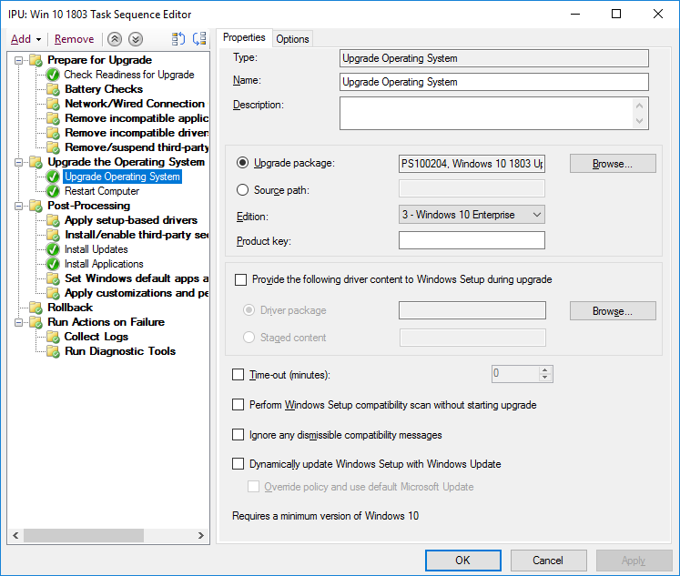
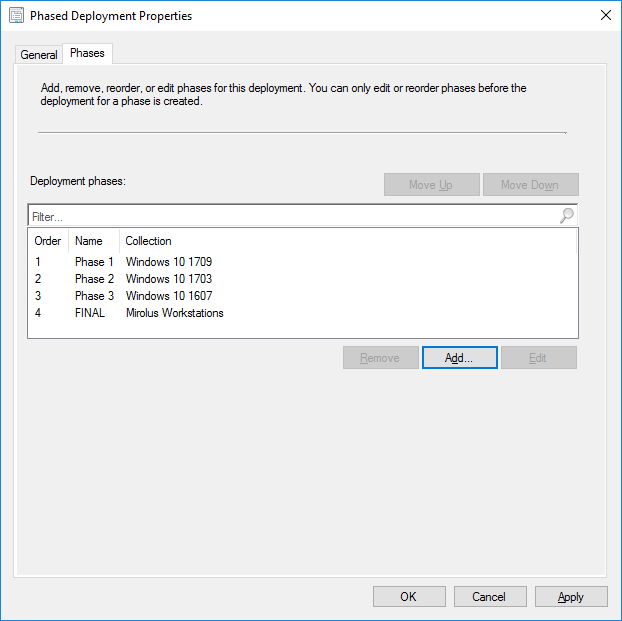
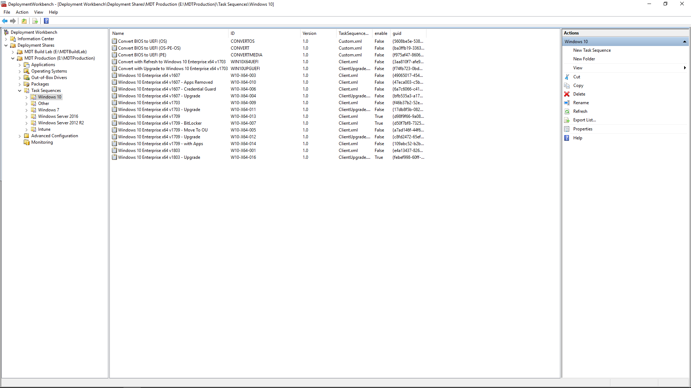

# Steg 6: Distribution av operativsystem och uppdateringar av funktioner

<table>
<thead>
<td></td>
<td>
<strong>Steg 6: Distribution av operativsystem och uppdateringar av funktioner</strong>

Distribution som baseras på aktivitetssekvenser används för att automatisera storskalig och fasindelad distribution för Bare Metal-installationer, uppdatering och ersättning av datorer. Aktivitetssekvenser för uppgradering hjälper dig även att hålla dig uppdaterad med stora halvårsuppdateringar. Och Windows Autopilot är ett nytt tillägg som gör det smidigare att skaffa nya datorer.
</td>
<td></td>
</thead>
</table>

>[!NOTE]
>Distribution av operativsystem och uppdateringar av funktioner är det sjätte steget i vårt rekommenderade distributionsprocesshjul som går igenom distribution av operativsystem, uppgraderingar och funktionsuppdateringar för Windows 10. Om du vill se den fullständiga distributionsprocessen kan du gå till [Center för skrivbordsdistribution](https://aka.ms/HowToShift).
>

Om du har följt distributionsprocesshjulet hittills har du åtminstone delvis slutfört stegen för enhets- och appberedskap, förberett infrastrukturen, konfigurerat och samlat in appaket, har en plan på plats för migrering av användarfiler och konfigurering av standardinställningar samt har planer för att behålla befintliga säkerhetskontroller och kanske distribuera nya.

Nu har vi nått den fas när du sätter ihop alla delar för att automatisera så mycket du kan för att installera Windows 10 och Office 365 ProPlus, tillsammans med nödvändiga drivrutiner, appar och allt annat som behövs.

I slutänden är det bästa måttet på framgång för en OS-distribution att möta användarnas förväntningar och undvika störningar i deras arbete. Och i det här steget börjar du testa och distribuera till pilotanvändare som en del av en stegvis distribution. Och ett tips här: innan du breddar distributionen måste du gå vidare till steg step 8 i vårt distributionsprocesshjul – [Kommunikation och utbildning för användare](https://aka.ms/mdd8) för att se till att användare informeras och förbereds för de förändringar som är på gång och att du kan mäta distributionstakten med kontinuerlig verifiering med hjälp av stegvis distribution.

## Windows avbildningsprocess

De flesta organisationer använder processen för datoravbildning för att konfigurera och fånga in en klon av Windows, bland annat en grunduppsättning av några installerade standardappar eller en ännu tunnare avbildning med bara programkörningar och uppdateringar. Det bästa sättet att göra det här är att använda en virtuell dator för den här processen för att undvika oväntade drivrutinsrelaterade kompatibilitetsproblem och för automationsändamål.

Om du fångar in en avbildning är det bäst att automatisera så mycket som möjligt för att säkerställa att avbildningen blir av bästa kvalitet och processen går att upprepa. För de flesta distributioner rekommenderar vi också att lägga till så få anpassningar och förinstallerade appar som möjligt i Windows-avbildningen innan den fångas in. Den här metoden kallas för ”tunn avbildning”, som kan spara total bandbredd för nätverket genom att ta bort antalet appar i avbildningen. Genom att utgå från en tunn grundavbildning kan du lägga på de appar, språk och konfigurationer som behövs, dynamiskt skräddarsydda för användarna.

Under skapande- och infångningsprocessen använder verktyg som Microsoft Endpoint Configuration Manager (Current Branch) och Microsoft Deployment Toolkit verktyget System Preparation – eller Sysprep – tillsammans med kommandot ”Generalize” för att återförsluta avbildningen innan de fångar in Windows 10-installationen som en avbildning.

Den infångade avbildningen har formatet för Windows-avbildning – WIM – som standardinställd Windows-installationsmedia. När du har din anpassade WIM-fil kan du använda en annan aktivitetssekvens som en del av OS-distributionen i Configuration Manager eller Microsoft Deployment Toolkit för att utföra distributionsrelaterade uppgifter, för att tillämpa avbildningen och köra uppgifter innan och efter att Windows-avbildningen tillämpas.

[Skapa en Windows 10-referensavbildning](https://docs.microsoft.com/windows/deployment/deploy-windows-mdt/create-a-windows-10-reference-image)

[Skapa en aktivitetssekvens för att installera ett operativsystem](https://docs.microsoft.com/configmgr/osd/deploy-use/create-a-task-sequence-to-install-an-operating-system)

### Distributionstyper

Med din anpassade avbildning klar kommer installations- eller migreringstypen att igång i följande kategorier:

  - För det första: **Bare Metal-distribution**. Det här är scenariot som används till att distribuera en avbildning till en ren disk eller till att återavbilda en dator där du inte tänker behålla några data på disken

  - Och för det andra: **Computer Refresh** (datoruppdatering) liknar Bare Metal men med den huvudskillnaden att användartillståndet blir kvar på disken\* eller återställs när installationen är klar

  - Och till sist **Computer Replacement** (datorbyte). Som namnet antyder ersätts datorn med en annan dator. I det här fallet finns det ofta en säkerhetskopia av användarfiler från den första datorn till en central plats, och sedan en återställning av filerna till den andra datorn.

Alla tre scenarierna har något gemensamt: de använder en aktivitetssekvens att köra och en anpassad avbildning kan användas varje gång.

[Mer om distributionsscenarier för Windows 10](https://docs.microsoft.com/windows/deployment/windows-10-deployment-scenarios)

### På plats-uppgradering med automatisering av aktivitetssekvenser

Utöver dessa distributionstyper finns det ett nytt alternativ tillgängligt nu som en aktivitetssekvens för Microsoft Endpoint Configuration Manager (Current Branch) med Windows 10 – och på plats-uppgradering med aktivitetssekvensen för uppgradering.

På plats-uppgraderingar från en tidigare version av Windows kräver inte en aktivitetssekvens men det är en rekommenderad metod vid distribution i företagsskala. Med en på plats-uppgradering kan du inte använda en anpassad avbildning med program men du kan uppdatera den standardinställda install.wim-filen med offlineunderhåll. Du kan till exempel kontrollera att den använder de senaste Windows-uppdateringarna innan uppgraderingar utförs.

På plats-uppgradering använder installationsprogrammet för Windows. Installationsmotorn kör flera små kontroller före installation som letar efter kända kompatibilitetsproblem. Den bevarar även användartillståndet och program och tar bara bort det som inte är kompatibelt med den version av Windows 10 som installeras. Med det här alternativet bevaras tidigare installerade program och användartillstånd. Med på plats-uppgradering kan du även återställa till det föregående installerade operativsystemet om det behövs för felsökning.

[Verifiering före uppgradering av Windows 10 med setup.exe](https://blogs.technet.microsoft.com/mniehaus/2015/08/23/windows-10-pre-upgrade-validation-using-setup-exe/)

Scenariot med på plats-uppgradering kan användas för att migrera till Windows 10 från äldre versioner av Windows, och uppgradera från tidigare versioner av Windows 10. När installationsprogrammet för Windows slutför uppgraderingen kan aktivitetssekvensen fortsätta köras och uppgradera program som Office, ersätta drivrutiner och tillämpa anpassningsinställningar. På samma sätt kan du använda aktivitetssekvensen för uppgradering till att utföra uppgifter före installation.

[Utföra en på plats-uppgradering till Windows 10 med Configuration Manager](https://docs.microsoft.com/windows/deployment/upgrade/upgrade-to-windows-10-with-system-center-configuraton-manager)

[Skapa en aktivitetssekvens för att uppgradera ett operativsystem i Configuration Manager](https://docs.microsoft.com/configmgr/osd/deploy-use/create-a-task-sequence-to-upgrade-an-operating-system)

### Stegvis distribution

När du planerar distributionen riktar du in dig på datorer för Bare Metal-, uppdaterings-, ersättnings- och uppgraderingsvägar. Den rekommenderade metoden i det här fallet är att använda stegvis distribution på samlingar med liknande datorer. På så sätt kan du verifiera kompatibilitet, användaracceptans, förbrukning av nätverksbandbredd och andra faktorer innan du ökar distributionens skala.

### Rekommenderade verktyg: Microsoft Endpoint Configuration Manager (Current Branch) och Microsoft Deployment Toolkit

Oavsett vilken distributionstyp du väljer ska du se till att den är så automatiserad som möjligt för förutsägbarhet och repeterbarhet. Microsoft har två lösningar för att automatisera distributionen av operativsystem med automatiserade aktivitetssekvenser:

  - Med **[Microsoft Endpoint Configuration Manager](https://docs.microsoft.com/configmgr/core/understand/introduction)** (ConfigMgr) får du inbyggda funktioner för distribution av operativsystem som kompletterar funktionerna för programvarudistribution och hantering av programuppdateringar. ConfigMgr används mycket av organisationer av alla storlekar och stöder alla fyra Windows-distributionstyper. Om du vill kan du även integrera ConfigMgr med Microsoft Intune för att lägga till ytterligare funktioner för distribution och enhetshantering.

  - Och ett annat populärt distributionsalternativ är det kostnadsfria **[Microsoft Deployment Toolkit](https://docs.microsoft.com/windows/deployment/deploy-windows-mdt/get-started-with-the-microsoft-deployment-toolkit)** (MDT) som vanligtvis används av små och medelstora organisationer för distribution av operativsystem. Det kräver väldigt lite infrastruktur. MDT integreras med Windows Deployment Services (WDS) för nätverksstart. Det har stöd för alla fyra distributionstyper och installation av program, drivrutiner och inställningar. Och självklart kan MDT även integreras med Configuration Manager.

### Windows Autopilot

Ett nytt alternativ i Windows 10 är att konfigurera nya datorer som en del av uppdateringscykeln för maskinvara med hjälp av Windows Autopilot. Här kan du arbeta med att stödja maskinvaruleverantörer för att anpassa den standardinställda installationsfunktionen för Windows – till exempel genom att ta bort alternativ som visas för användare, som licensavtal eller diagnostiska datainställningar.

När sedan en användare loggar in på datorn under installationen med sina Azure AD-autentiseringsuppgifter registreras enheten i Microsoft Intune, som sedan kan ta över distributionsprocessen och tillämpa program, konfigurationer för programuppdateringar och efterlevnadsprinciper. Med Windows Autopilot kan du även förhindra att användaren kommer åt den första sessionen tills etableringen är klar.

[Översikt över Windows Autopilot](https://docs.microsoft.com/windows/deployment/windows-autopilot/windows-10-autopilot)

[Förutsättningar för Windows Autopilot](https://docs.microsoft.com/windows/deployment/windows-autopilot/windows-10-autopilot#prerequisites)

## Funktionsuppdateringar för Windows Update för företag

Windows Update för företag är en kostnadsfri tjänst som gör att IT-personalen kan hålla Windows 10-enheter ständigt uppdaterade genom att direkt ansluta enheter till Windows Update-tjänsten. Windows Update för företag kan konfigureras via grupprincip eller via MDM-lösningar som Microsoft Intune och gör så att IT-personalen kan skapa [testgrupper för distribution](https://docs.microsoft.com/windows/deployment/update/waas-deployment-rings-windows-10-updates) för att validera nya versioner. Den är integrerad i befintliga hanteringsverktyg som Windows Server Update Services (WSUS), Microsoft Endpoint Configuration Manager (Current Branch) och Microsoft Intune. Dessutom stöder Windows Update för företag peer-to-peer-leverans för att bidra till optimera bandbreddseffektiviteten och minska belastningen på nätverket.

Mer detaljerad information om Windows Update för företag finns i följande dokumentation:

- [Distribuera uppdateringar med Windows Update för företag](https://docs.microsoft.com/windows/deployment/update/waas-manage-updates-wufb)
- [Konfigurera Windows Update för företag](https://docs.microsoft.com/windows/deployment/update/waas-configure-wufb)
- [Integrera Windows Update för företag med befintliga hanteringsverktyg](https://docs.microsoft.com/windows/deployment/update/waas-integrate-wufb)
- [Konfigurera Windows Update för företag med grupprincip](https://docs.microsoft.com/windows/deployment/update/waas-wufb-group-policy)
- [Konfigurera Windows Update för företag med Microsoft Intune](https://docs.microsoft.com/intune/windows-update-for-business-configure)

## Nästa steg 

## [Steg 7: Underhåll av Windows och Office](https://aka.ms/mdd7)

## Föregående steg

## [Steg 5: Överväganden för säkerhet och efterlevnad](https://aka.ms/mdd5)
