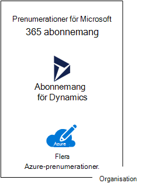

# Prenumerationer, licenser, konton och klienter för Microsofts molntjänster

Microsoft tillhandahåller en hierarki med organisationer, prenumerationer, licenser och användarkonton för konsekvent användning av identiteter och fakturering i molnerbjudanden:
  
- Microsoft 365 och Microsoft Office 365
- Microsoft Azure
- Microsoft Dynamics 365

## Element i hierarkin

Här är elementen i hierarkin:
  
### Organisation

En organisation representerar en affärsenhet som använder Microsofts molntjänster, som vanligtvis identifieras av ett eller flera DNS-domännamn (Domain Name System), till exempel contoso.com. Organisationen är en behållare för-prenumerationer.
  
### Prenumerationer

En prenumeration är ett avtal med Microsoft om att använda en eller flera Microsoft molnbaserade plattformar eller tjänster, för vilka avgifter ska periodiseras baserat på en licensavgift per användare eller för molnbaserad resursförbrukning. 

- Microsofts Software as a Service (SaaS)-baserad molntjänst (Microsoft 365 och Dynamics 365) debiterar licensavgifter per användare. 
- Microsofts Platform as a Service (PaaS) och Infrastructure as a Service (IaaS) molnerbjudanden (Azure), debiterar baserat på förbrukning av molnresurser.
 
Du kan också använda en provprenumeration, men prenumerationen upphör att gälla efter en bestämd tid eller förbrukning. Du kan omvandla en provprenumeration till en betalprenumeration.
  
Organisationer kan ha flera prenumerationer för Microsofts molntjänster. Bild 1 visar en organisation med flera Microsoft 365-prenumerationer, en Dynamics 365-prenumeration och flera Azure-prenumerationer.

**Bild 1: Exempel på flera prenumerationer för en organisation**

  
### Licenser

För Microsofts SaaS molnerbjudanden kan en licens tillåta ett speciellt användarkonto att använda tjänsterna i molnerbjudandet. Som en del av din prenumeration debiteras du en fast månatlig avgift. Administratörer tilldelar licenser till enskilda användarkonton i prenumerationen. I exemplet i Bild 2 har Contoso Corporation en Microsoft 365 E5-prenumeration med 100-licenser som gör att du kan använda upp till 100 enskilda användarkonton för att använda Microsoft 365 E5-funktioner och tjänster.
  
**Bild 2: Licenser i SaaS-baserade prenumerationer för en organisation**

>[!Note]
>Det bästa sättet med säkerhet är att använda separata användarkonton som har tilldelats specifika roller för administrativa funktioner. De här dedikerade administratörskontona behöver inte tilldelas en licens för de molntjänster som de administrerar. Till exempel behöver ett SharePoint-administratörskonto inte tilldelas en Microsoft 365-licens.
>

För Azure PaaS-baserade molntjänster finns det programvarulicenser som är inbyggda i serviceprissättning.
  
För Azure IaaS-baserade virtuella datorer kan kanske fler licenser för att använda programvaran eller programmet som är installerat på en virtuell datorbild krävas. För vissa virtuella datorbilder finns licensierade versioner av programvaran och kostnaden ingår i per minut kostnaden för servern. Exempel är de virtuella datorbilderna för SQL Server 2014 och SQL Server 2016. 
  
För vissa virtuella datorbilder finns provversioner av installerade program och behöver ytterligare programvarulicenser för användning utanför provperioden. SharePoint Server 2016-utvärderingsversionen av virtuell datorbild innehåller till exempel en förinstallerad utvärderingsversion av SharePoint Server 2016. Om du vill fortsätta att använda SharePoint Server 2016 efter utgångsdatumet för utvärderingsversionen måste du köpa en SharePoint Server 2016 licens och kundlicenser från Microsoft. Dessa avgifter är åtskilda från Azure-prenumerationen och kostnaden per minut för att köra den virtuella datorn gäller fortfarande.
  
### Användarkonton

Användarkonton för alla Microsofts molnerbjudanden lagras i Azure Active Directory (Azure AD)-klientorganisationen som innehåller användarkonton och grupper. En Azure AD-klientorganisation kan synkroniseras med dina befintliga Active Directory Domain Services (AD DS)-konton med Azure AD Connect, en Windows serverbaserad tjänst. Detta kallas för katalogsynkronisering.
  
I Bild 3 visas ett exempel på flera prenumerationer för en organisation med hjälp av en vanlig Azure AD-klientorganisation som innehåller organisationens konton.
  
**Bild 3: flera prenumerationer för en organisation som använder samma Azure AD-klientorganisation**

  
### Klientorganisationer

För SaaS molnerbjudanden är klientorganisationen den regionala plats där servrarna som tillhandahåller molntjänster finns. Contoso Corporation valde t. ex. en europeisk region som värd för Microsoft 365-, EMS- och Dynamics 365-klientorganisationer för de 15 000 arbetarna på deras huvudkontor i Paris.
  
Azure PaaS tjänster och virtuella datorbaserade arbetsbelastningar som finns i Azure IaaS kan ha en klientorganisationskonto i vilket Azure-datacenter som helst över hela världen. Du anger vilket Azure-datacenter, platsen, när du skapar Azure PaaS-appen eller-tjänsten eller elementet för en IaaS-arbetsbelastning.
  
En Azure AD-klientorganisation är en särskild instans av Azure AD som innehåller konton och grupper. Betal-eller utvärderingsprenumerationer av Microsoft 365 eller Dynamics 365 innehåller en kostnadsfri Azure AD-klientorganisation. Azure AD-innehavaren inkluderar inte andra Azure-tjänster och är inte samma sak som en Azure-utvärderingsversion eller betald prenumeration.
  
### Sammanfattning av hierarkin

Här är en snabb sammanfattning:
  
- En organisation kan ha flera prenumerationer
    
  - En prenumeration kan ha flera licenser
    
  - Licenser kan tilldelas till enskilda användarkonton
    
  - Användarkonton lagras i en Azure AD-klientorganisation
    
Här är ett exempel på relationen mellan organisationer, prenumerationer, licenser och användarkonton:
  
- En organisation som identifieras genom dess offentliga domännamn.
    
  - En Microsoft 365 E3-prenumeration med användarlicenser.
    
    En Microsoft 365 E5-prenumeration med användarlicenser.
    
    En Dynamics 365 E5-prenumeration med användarlicenser.
    
    Flera Azure-prenumerationer.
    
  - Organisationens användarkonton i en vanlig Azure AD-klientorganisation.
    
Med flera prenumerationer på Microsoft Cloud får du en Azure AD-klientorganisation som agerar som gemensam identitetsleverantör. En central Azure AD-klientorganisation som innehåller de synkroniserade kontona i din lokala AD DS tillhandahåller molnbaserad Identity as a Service (IDaaS) för din organisation. 
  
**Bild 4: Synkroniserade lokala konton och IDaaS för en organisation**

  
Bild 4 visar hur en vanlig Azure AD-klientorganisation används i Microsofts SaaS-molntjänster, Azure PaaS-appar samt virtuella datorer i Azure IaaS som använder Azure AD Domain Services. Med Azure AD Connect synkroniseras den lokala AD DS-skogen med Azure AD-klientorganisationen.
  
## Kombinera prenumerationer för flera Microsoft molnerbjudanden

I följande tabell beskrivs hur du kan kombinera flera Microsoft molnerbjudanden baserat på att redan har en prenumeration för en typ av molnerbjudande (etiketterna som går ner i den första kolumnen) och lägger till en prenumeration för ett annat molnerbjudande (går över kolumnerna).
  
||**Microsoft 365**|**Azure**|**Dynamics 365**|
|:-----|:-----|:-----|:-----|:-----|
|**Microsoft 365**   |SAKNAS    |Du lägger till en Azure-prenumeration i din organisation från Azure-portalen.    |Du lägger till en Dynamics 365-prenumeration i din organisation från administrationscenter för Microsoft 365.    |
|**Azure**   |Du lägger till en Microsoft 365-prenumeration i organisationen.    |SAKNAS    |Du lägger till en Dynamics 365-prenumeration i organisationen.    |
|**Dynamics 365**   |Du lägger till en Microsoft 365-prenumeration i organisationen.    |Du lägger till en Azure-prenumeration i din organisation från Azure-portalen.    |SAKNAS    |
   
Ett enkelt sätt att lägga till prenumerationer i organisationen för Microsoft SaaS-baserade tjänster är via administrationscenter:
  
1. Logga in på administrationscenter för Microsoft 365 ([https://admin.microsoft.com](https://admin.microsoft.com)) med ditt globala administratörskonto.
    
2. Från vänster navigeringsfält i **Administrationscentrets** startsida klickar du på **Fakturering**, och sedan **Köptjänster**.
    
3. På sidan **Köptjänster** kan du köpa dina nya prenumerationer.
    
Administrationscenter tilldelar organisationen och Azure AD-klientorganisationen för din Microsoft 365-prenumeration till de nya prenumerationerna för SaaS-baserade molnerbjudanden.
  
Så här lägger du till en Azure-prenumeration med samma organisation och Azure AD-klientorganisationen som Microsoft 365-prenumeration:
  
1. Logga in på Azure-portalen ([https://portal.azure.com](https://portal.azure.com)) med ditt globala administratörskonto för Microsoft 365.
    
2. I vänster navigeringsfält, klicka på **Prenumerationer** och klicka sedanpå **Lägga till**.
    
3. Välj ett erbjudande och slutför betalningsinformation och avtal genom att gå till sidan **Lägg till prenumerations**.
    
Om du har köpt Azure-och Microsoft 365-prenumerationer separat och vill få åtkomst till Microsoft 365 Azure AD-klientorganisationen från din Azure-prenumeration läser du anvisningarna i [Lägga till en befintlig Azure-prenumeration i Azure Active Directory-klientorganisationen](/azure/active-directory/fundamentals/active-directory-how-subscriptions-associated-directory).
 
## Se även

[Illustrationer för Microsoft moln för företagsarkitektur](../solutions/cloud-architecture-models.md)
  
[Arkitekturmodeller för SharePoint, Exchange, Skype för företag och Lync](architectural-models-for-sharepoint-exchange-skype-for-business-and-lync.md)
  
[Hybridlösningar](hybrid-solutions.md)

## Nästa steg

[Utvärdera Microsoft 365 nätverksanslutningar](assessing-network-connectivity.md)
