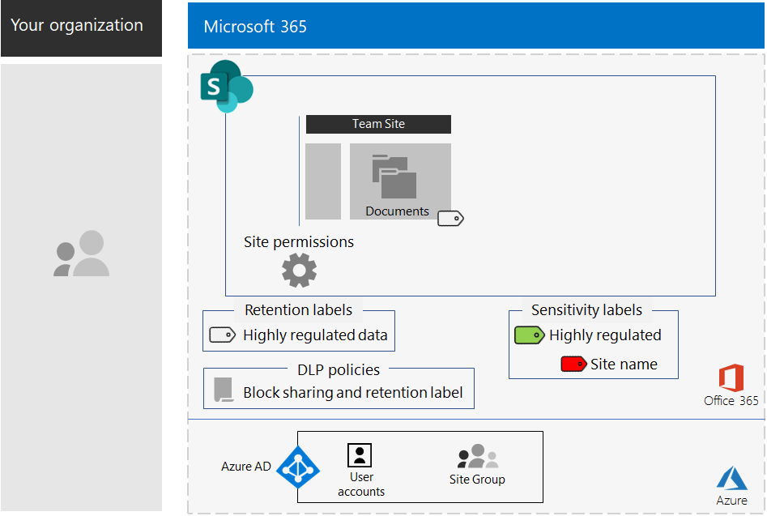

# SharePoint-webbplatser för strikt reglerade dataSharePoint sites for highly regulated data

*Det här scenariot gäller både E3- och E5-versionerna av Microsoft 365 Enterprise**This scenario applies to both the E3 and E5 versions of Microsoft 365 Enterprise*

Microsoft 365 Enterprise innehåller en komplett uppsättning molnbaserade tjänster så att du kan skapa, lagra, skydda och hantera strikt reglerade data som lagras i filer.Microsoft 365 Enterprise includes a full suite of cloud-based services so that you can create, store, secure, and manage your highly regulated data stored in files. Det inkluderar data som:This includes data that is:

- Lyder under regionala bestämmelser.Subject to regional regulations.
- Är de mest värdefulla data för din organisation, t.ex. affärshemligheter, ekonomisk information och personalinformation samt organisationens strategi.The most valuable data for your organization, such as trade secrets, financial or human resources information, and organization strategy.

>[!Note]
> Ett liknande scenario med Microsoft Teams finns [här](secure-teams-highly-regulated-data-scenario.md).A similar scenario using Microsoft Teams is [here](secure-teams-highly-regulated-data-scenario.md).
>

Ett molnbaserat scenario för Microsoft 365 Enterprise som uppfyller detta affärsbehov kräver att du:A Microsoft 365 Enterprise cloud-based scenario that meets this business need requires that you:

- Lagrar filer (dokument, bildspel, kalkylblad osv.) på en SharePoint-gruppwebbplats.Store files (documents, slide decks, spreadsheets, etc.) in a SharePoint team site.
- Lås webbplatsen för att förhindra:Lock down the site to prevent:
  - Åtkomst av användare som inte är medlemmar i webbplatsens Office 365-grupp.Access to users who are not members of the Office 365 group for the site.
  - Webbplatsmedlemmarna från att ge andra personer åtkomst.Members of the site from granting access to others.
  - Icke-medlemmar av webbplatsen från att begära åtkomst till webbplatsen.Non-members of the site from requesting access to the site.
- Konfigurera en Office 365-kvarhållningsetikett för dina SharePoint-webbplatser som ett standardsätt att hindra användare från att skicka filer utanför organisationen.Configure an Office 365 retention label for your SharePoint sites as a default way to block users from sending files outside the organization.
- Kryptera de känsligaste filerna på webbplatsen med kryptering som följer med filen.Encrypt the most sensitive files of the site with encryption that travels with the file.
- Lägg till behörigheter för de känsligaste filerna så att giltiga inloggningsuppgifter för ett användarkonto som har behörighet måste anges även om de delas utanför webbplatsen.Add permissions to the most sensitive files so that if even if they get shared outside of the site, opening the file still requires the valid credentials of a user account that has permission.

I följande tabell beskrivs kraven i det här scenariot för en funktion i Microsoft 365 Enterprise.The following table maps the requirements of this scenario to a feature of Microsoft 365 Enterprise.

|||
|:-------|:-----|
| **Krav****Requirement** | **Microsoft 365 Enterprise-funktion****Microsoft 365 Enterprise feature** |
| Lagra filerStore files | SharePoint-gruppwebbplatserSharePoint team sites |
| Lås webbplatsenLock down the site | Office 365-grupper och behörigheter för SharePoint-gruppwebbplatsOffice 365 groups and SharePoint team site permissions |
| Etikettera filerna på webbplatsenLabel the files of the site | Kvarhållningsetiketter för Office 365Office 365 retention labels |
| Blockera användare från att skicka filer utanför organisationenBlock users when sending files outside the organization | DLP-principer (dataförlustskydd) i Office 365Data Loss Prevention (DLP) policies in Office 365 |
| Kryptera alla filer på webbplatsenEncrypt all of the files of the site | Office 365-känslighetsetiketter eller underetiketterOffice 365 sensitivity labels or sublabels |
| Lägg till behörigheter för webbplatsens filerAdd permissions to the files of the site | Office 365-känslighetsetiketter eller underetiketterOffice 365 sensitivity labels or sublabels |
|||

Här är ett exempel på en konfiguration för en säker SharePoint-webbplats.Here is an example configuration for a secure SharePoint site.

Det här scenariot kräver att du redan har distribuerat:This scenario requires that you have already deployed:

- Fasen [Identitet](identity-infrastructure.md) och steg 1 och 2 av fasen [Informationsskydd](infoprotect-infrastructure.md) i den grundläggande infrastrukturen.The [Identity](identity-infrastructure.md) phase and steps 1 and 2 of the [Information protection](infoprotect-infrastructure.md) phase of the foundation infrastructure. 
- [SharePoint](sharepoint-online-onedrive-workload.md).[SharePoint](sharepoint-online-onedrive-workload.md).

I följande faser får du stegvisa instruktioner hur du utformar, konfigurerar och driver på användningen av SharePoint-webbplatser för strikt reglerade data.The following phases step you through designing, configuring, and driving adoption for SharePoint sites for highly regulated data.

 En sammanfattning på en sida finns på [affischen SharePoint-webbplatser för strikt reglerade data](../media/teams-sharepoint-online-sites-highly-regulated-data/SharePointSitesHighlyRegulatedData.pdf).For a 1-page summary of this scenario, see the [SharePoint sites for highly regulated data poster](../media/teams-sharepoint-online-sites-highly-regulated-data/SharePointSitesHighlyRegulatedData.pdf).

Du kan också ladda ned den här affischen i [PDF](https://github.com/MicrosoftDocs/microsoft-365-docs/raw/public/microsoft-365/media/teams-sharepoint-online-sites-highly-regulated-data/SharePointSitesHighlyRegulatedData.pdf)- eller [PowerPoint](https://github.com/MicrosoftDocs/microsoft-365-docs/raw/public/microsoft-365/media/teams-sharepoint-online-sites-highly-regulated-data/SharePoint-Sites-Highly-Regulated-Data.pptx)-format och skriva ut den i pappersstorleken letter, legal eller tabloid (11 x 17).You can also download this poster in [PDF](https://github.com/MicrosoftDocs/microsoft-365-docs/raw/public/microsoft-365/media/teams-sharepoint-online-sites-highly-regulated-data/SharePointSitesHighlyRegulatedData.pdf) or [PowerPoint](https://github.com/MicrosoftDocs/microsoft-365-docs/raw/public/microsoft-365/media/teams-sharepoint-online-sites-highly-regulated-data/SharePoint-Sites-Highly-Regulated-Data.pptx) formats and print it on letter, legal, or tabloid (11 x 17)-sized paper.

## Villkor för identitet och enhetsåtkomstIdentity and device access prerequisites

För att skydda åtkomsten till SharePoint-webbplatsen ska du se till att du har konfigurerat [principer för identitet och enhetsåtkomst](identity-access-policies.md) och de rekommenderade [principerna för SharePoint-åtkomst](sharepoint-file-access-policies.md).To protect access to the SharePoint site, ensure that you have configured [identity and device access policies](identity-access-policies.md) and the [recommended SharePoint access policies](sharepoint-file-access-policies.md).

## Fas 1: UtformningPhase 1: Design

När du vill skapa en SharePoint-webbplats för strikt reglerade data måste du först identifiera syftet med den.To create a SharePoint site for highly regulated data, you must first identify its purpose. En forsknings- och utvecklingsavdelning i en tillverkningsorganisation kan till exempel behöva en SharePoint-webbplats för att lagra aktuella specifikationer för befintliga produkter och en plats för samarbete om nya produkter.For example, the research and development department of a manufacturing organization needs a SharePoint site to store current design specifications for existing products and a place to collaborate on new products. Bara medlemmar på forsknings- och utvecklingsavdelningen och utvalda chefer får åtkomst till webbplatsen.Only members of the Research & Development department and selected executives will be allowed to access the site.

Syftet avgör viktiga konfigurationselement som:That purpose will drive the determination of essential configuration items such as:

- Office 365-kvarhållningsetiketten som tilldelas dokumentavsnittet på webbplatsen och DLP-principerna för etikettenThe Office 365 retention label to assign to the Documents portion of the site and DLP policies for the label
- Inställningarna för en Office 365-underetikett för känslighet som användare tillämpar på mycket känsliga filer som lagras på webbplatsenThe settings of an Office 365 sensitivity sublabel that users apply to highly sensitive files stored in the site

När du har fastställt detta använder du inställningarna för att konfigurera webbplatsen i fas 2.Once determined, you use these settings to configure the site in Phase 2. 

### Steg 1 Office 365-kvarhållningsetiketter och DLP-principerStep 1 Office 365 retention labels and DLP policies

Office 365-kvarhållningsetiketter tillämpas på dokumentavsnittet på SharePoint-gruppwebbplatsen och är en standardmetod för att klassificera alla filer som lagras på webbplatsen.When applied to the Documents portion of a SharePoint team site, Office 365 retention labels provide a default method of classifying all files stored on the site.
 
För SharePoint-webbplatser för strikt reglerade data måste du avgöra vilken Office 365-kvarhållningsetikett som ska användas.For SharePoint sites for highly regulated data, you need to determine which Office 365 retention label to use.

Information om utformning av Office 365-etiketter finns i [Klassificering och etiketter för Office 365](https://docs.microsoft.com/office365/securitycompliance/secure-sharepoint-online-sites-and-files#office-365-retention-labels).For the design considerations of Office 365 labels, see [Office 365 classification and labels](https://docs.microsoft.com/office365/securitycompliance/secure-sharepoint-online-sites-and-files#office-365-retention-labels).

Använd DLP-principer för att skydda känslig information och förhindra att den avslöjas oavsiktligt eller avsiktligt.To protect sensitive information and prevent its accidental or intentional disclosure, you use DLP policies. Mer information finns i denna [översikt](https://docs.microsoft.com/office365/securitycompliance/data-loss-prevention-policies).For more information, see this [overview](https://docs.microsoft.com/office365/securitycompliance/data-loss-prevention-policies).

För SharePoint-webbplatser måste du konfigurera en DLP-princip för Office 365-kvarhållningsetiketten som tilldelats webbplatsen så att användare förhindras att dela filer med externa användare.For SharePoint sites, you must configure a DLP policy for the Office 365 retention label assigned to the site to block users when they attempt to share files with external users. 

### Steg 2: Din underetikett för känslighet i Office 365Step 2: Your Office 365 sensitivity sublabel

För att tillhandahålla kryptering och en uppsättning behörigheter till de känsligaste filerna måste användarna använda en Office 365-känslighetsetikett eller underetikett.To provide encryption and a set of permissions to your most sensitive files, users must apply an Office 365 sensitivity label or sublabel. En underetikett finns under en befintlig etikett.A sublabel exists under an existing label. 

Använd en känslighetsetikett när du behöver ett litet antal etiketter för både global användning och enskilda privata team.Use a sensitivity label when you need is a small number of labels for both global use and individual private teams. Använd en underetikett för känslighet när du har ett stort antal etiketter eller vill ordna etiketter för säkra webbplatser under den strikt reglerade etiketten.Use a sensitivity sublabel when you have a large number of labels or want to organize labels for secure sites the under your highly regulated label. 

Inställningarna för etiketten eller underetiketten följer med filen.The settings of the applied label or sublabel travel with the file. Även om den läcks utanför webbplatsen kan bara autentiserade användarkonton som har behörighet öppna den.Even if it is leaked outside the site, only authenticated user accounts that have permissions can open it.

### Resultat av utformningenDesign results

Du har fastställt följande:You have determined the following:

- Lämplig Office 365-kvarhållningsetikett och DLP-principen som associeras med etikettenThe appropriate Office 365 retention label and the DLP policy that is associated with the label
- Inställningarna för Office 365-underetiketten för känslighet som inkluderar kryptering och behörigheterThe settings of the Office 365 sensitivity sublabel that include encryption and permissions

## Fas 2: KonfigureraPhase 2: Configure

I den här fasen tar du inställningarna som fastställts i fas 1 och använder dem för att skapa en SharePoint-webbplats för strikt reglerade data.In this phase, you take the settings determined in Phase 1 and implement them to create a SharePoint site for highly regulated data.

### Steg 1: Skapa en privat SharePoint-gruppwebbplats med ägare och medlemmar i motsvarande Office 365-gruppStep 1: Create a private SharePoint team site with owners and members of the corresponding Office 365 group

Skapa en privat SharePoint-gruppwebbplats genom att följa [dessa instruktioner]( https://support.office.com/article/create-a-site-in-sharepoint-online-4d1e11bf-8ddc-499d-b889-2b48d10b1ce8).Follow [these instructions]( https://support.office.com/article/create-a-site-in-sharepoint-online-4d1e11bf-8ddc-499d-b889-2b48d10b1ce8) to create a private SharePoint team site.

### Steg 2: Konfigurera ytterligare behörighetsinställningar för SharePoint-gruppwebbplatsenStep 2: Configure additional permissions settings for the SharePoint team site

Konfigurera dessa behörighetsinställningar på SharePoint-webbplatsen.From the SharePoint site, configure these permission settings.

1. Klicka på inställningsikonen i verktygsfältet och klicka sedan på **Webbplatsbehörigheter**.In the tool bar, click the settings icon, and then click **Site permissions**.
2. I fönstret **Webbplatsbehörigheter** under **Delningsinställningar** klickar du på **Ändra delningsinställningar**.In the **Site permissions** pane, under **Sharing Settings**, click **Change sharing settings**.
3. Under **Delningsbehörigheter** väljer du **Endast webbplatsägare kan dela filer, mappar och webbplats**.Under **Sharing permissions**, choose **Only site owners can share files, folders, and the site**.
4. Inaktivera **Tillåt åtkomstbegäranden** och klicka sedan på **Spara**.Turn off **Allow access requests**, and then click **Save**.

Med dessa inställningar inaktiveras funktionen för webbplatsgruppens medlemmar att dela webbplatsen med andra medlemmar eller för icke-medlemmar att begära åtkomst till webbplatsen.With these settings, the ability for site group members to share the site with other members or for non-members to request access to the site is disabled.

### Steg 3: Konfigurera webbplatsen för en Office 365-kvarhållningsetikettStep 3: Configure the site for an Office 365 retention label

Följ anvisningarna i [Skydda SharePoint-filer med Office 365-etiketter och DLP](https://docs.microsoft.com/office365/enterprise/protect-sharepoint-online-files-with-office-365-labels-and-dlp) när du:Use the instructions in [Protect SharePoint files with Office 365 labels and DLP](https://docs.microsoft.com/office365/enterprise/protect-sharepoint-online-files-with-office-365-labels-and-dlp) to:

1. Skapar och publicerar en kvarhållningsetikett för strikt reglerade data (om det behövs).Create and publish a retention label for highly regulated data (if needed).
2. Konfigurerar webbplatsen för kvarhållningsetiketten som skapats i steg 1.Configure the site for the retention label created in step 1.
3. Skapar en DLP-princip för strikt reglerade data som använder kvarhållningsetiketten som skapats i steg 2 och hindrar användare från att skicka filer utanför organisationenCreate a DLP policy for highly regulated data that uses the retention label created in step 2 and blocks users from sending files outside the organization

#### Steg 4: Skapa en Office 365-underetikett för känslighet för webbplatsenStep 4: Create an Office 365 sensitivity sublabel for the site

Till skillnad från en känslighetsetikett för strikt reglerade data som alla kan tillämpa på valfri fil behöver en säker webbplats en egen underetikett så att filer som tilldelas underetiketten:Unlike a sensitivity label for highly regulated data that anyone can apply to any file, a secure site needs its own sublabel so that files with the sublabel assigned:

- krypteras och krypteringen följer med filen,Are encrypted and the encryption travels with the file.
- innehåller anpassade behörigheter så att bara medlemmar i webbplatsgruppen kan öppna den.Contain custom permissions so that only members of the site group can open it.

För att åstadkomma den här extra säkerhetsnivån för filer på webbplatsen måste du konfigurera en ny känslighetsetikett eller en underetikett för den allmänna etiketten för strikt reglerade filer.To accomplish this additional level of security for files stored in the site, you must configure a new sensitivity label or a sublabel of the general label for highly regulated files. Endast gruppmedlemmarna på webbplatsen ser den i listan med underetiketter för etiketten för strikt reglerade data.Only group members for the site will see it in the list of sublabels for the highly regulated label.

Följ anvisningarna [här](https://docs.microsoft.com/microsoft-365/compliance/encryption-sensitivity-labels) när du vill konfigurera en etikett eller en underetikett för etiketten som du använder för strikt reglerade filer med följande inställningar:Use the instructions [here](https://docs.microsoft.com/microsoft-365/compliance/encryption-sensitivity-labels) to configure a label or a sublabel of the label you are using for highly regulated files with the following settings:

- Namnet på etiketten eller underetiketten innehåller namnet på webbplatsen för enkel koppling när etiketten eller underetiketten tilldelas en fil.The name of the label or sublabel contains the name of the site for easy association when assigning the label or sublabel to a file.
- Kryptering är aktiverat.Encryption is enabled.
- Webbplatsgruppen har samredigeringsbehörighetThe site group has Co-Author permissions.

### KonfigurationsresultatConfiguration results

Du har konfigurerat följande:You have configured the following:

- Striktare behörighetsinställningar på SharePoint-webbplatsenMore restrictive permission settings on the SharePoint site
- En Office 365-kvarhållningsetikett som tilldelats dokumentavsnittet på SharePoint-webbplatsenAn Office 365 retention label assigned to the Documents portion of the SharePoint site
- En DLP-princip för Office 365-kvarhållningsetikettenA DLP policy for the Office 365 retention label
- En Office 365-känslighetsetikett eller en underetikett som användare kan tillämpa på de känsligaste filerna som lagras på webbplatsen. Den krypterar filer och tillåter bara samtidig redigering för medlemmar i webbplatsgruppen.An Office 365 sensitivity label or sublabel that users can apply to the most sensitive files stored in the site, which encrypts the file and only allows Co-Author access for members of the team site group 

Här är en konfiguration som använder en underetikett av etiketten för strikt reglerade data.Here is the resulting configuration that uses a sublabel of the Highly regulated label.

Här är ett exempel på en användare som har tilldelat en underetikett till en fil som lagras på webbplatsen.Here is an example of a user that has applied the sublabel to a file stored in the site.

## Fas 3: Driva på användningenPhase 3: Drive user adoption

En SharePoint-webbplats för strikt reglerade data kan bara skydda data om den används konsekvent för lagring och åtkomst till känsliga filer.A SharePoint site for highly regulated data can only protect that data if it is consistently used for storage and access of sensitive files. Det här är den svåraste fasen eftersom den förlitar sig på att användarna ändrar sina vanor och inställningar.This is the hardest phase because it relies on users changing their habits and preferences. 

Anställda som till exempel lagrar känsliga filer på USB-enheter eller i privata molnbaserade lagringslösningar måste nu enbart lagra dem på en SharePoint-webbplats för strikt reglerade data.For example, employees that are used to storing sensitive files on USB drives or on personal cloud-based storage solutions will now have to store them exclusively in a SharePoint site for highly regulated data.

### Steg 1: Utbilda dina användareStep 1: Train your users

När du har slutfört konfigurationen bör du utbilda användarna som är medlemmar av webbplatsen:After completing your configuration, train the set of users who are members of the site:

- Om vikten av att använda den nya webbplatsen för att skydda värdefulla filer och konsekvenserna av en läcka av strikt reglerade data, till exempel juridiska aspekter, tillsynsböter, utpressningstrojaner eller förlust av konkurrensfördelar.On the importance of using the new site to protect valuable files and the consequences of a highly regulated data leak, such as legal ramifications, regulatory fines, ransomware, or loss of competitive advantage.
- Om åtkomst till webbplatsen och dess filer.How to access the site and its files.
- Hur man skapar nya filer på webbplatsen och laddar upp nya filer som lagras lokalt.How to create new files on the site and upload new files stored locally.
- Hur DLP-principen förhindrar dem från att dela filer externt.How the DLP policy blocks them from sharing files externally.
- Hur man förser de känsligaste filerna med etiketten eller underetiketten för webbplatsen.How to label the most sensitive files with the label or sublabel for the site.
- Hur etiketten eller underetiketten skyddar filer även när de läcker från webbplatsen.How the label or sublabel protects a file even when it is leaked off the site.

I den här utbildningen ska det ingå praktiska övningar så att användarna kan prova funktionerna och se deras resultat.This training should include hands-on exercises so that the users can experience these operations and their results.

### Steg 2: Utföra regelbundna granskningar av användning och filerStep 2: Conduct periodic reviews of usage and files

Under veckorna efter utbildningen kan SharePoint-administratören för SharePoint-webbplatsen:In the weeks after training, the SharePoint administrator for the SharePoint site can:

- Analysera webbplatsens användning och jämföra med den förväntade användningen.Analyze usage for the site and compare it with usage expectations.
- Kontrollera att strikt reglerade filer har etiketterats korrekt med känslighetsetiketten eller underetiketten.Verify that highly sensitive files have been properly labeled with the sensitivity label or sublabel.

  Du kan se vilka filer som har tilldelats en etikett genom att visa en mapp i SharePoint och lägga till kolumnen **Känslighet** genom alternativet **Visa/dölj kolumner** i **Lägg till kolumn**.You can see which files have a label assigned by viewing a folder in SharePoint and adding the **Sensitivity** column through the **Show/hide columns** option of **Add column**.

Vidareutbilda dina användare efter behov.Retrain your users as needed.

### AnvändningsresultatUser adoption results

Strikt reglerade filer lagras enbart på SharePoint-webbplatser för strikt reglerade data och de känsligaste filerna har tilldelats känslighetsetiketten eller underetiketten för webbplatsen.Highly regulated files are stored exclusively on SharePoint sites for highly regulated data and the most sensitive files have the sensitivity label or sublabel for the site applied.

## Så här använde Contoso Corporation en SharePoint-webbplats för strikt reglerade dataHow the Contoso Corporation used a SharePoint site for highly regulated data

Contoso Corporation är ett fiktivt men representativt globalt tillverkningskonglomerat.The Contoso Corporation is a fictional but representative global manufacturing conglomerate. Se hur Contoso skapade, konfigurerade och införde användningen av en [säker SharePoint-webbplats](contoso-sharepoint-online-site-for-highly-confidential-assets.md) för forskningsteamen i Paris, Moskva, New York, Beijing och Bangalore.See how Contoso designed, configured, and then drove the adoption of a [secure SharePoint site](contoso-sharepoint-online-site-for-highly-confidential-assets.md) for their research teams in Paris, Moscow, New York, Beijing, and Bangalore. 

## Se ävenSee also

[Teams för strikt reglerade dataTeams for highly regulated data](secure-teams-highly-regulated-data-scenario.md)

[Arbetsbelastningar och scenarier i Microsoft 365 EnterpriseMicrosoft 365 Enterprise workloads and scenarios](deploy-workloads.md)

[Produktivitetsbiblioteket för Microsoft 365](https://aka.ms/productivitylibrary) (https://aka.ms/productivitylibrary)[Microsoft 365 Productivity Library](https://aka.ms/productivitylibrary) (https://aka.ms/productivitylibrary)

[DistributionsguideDeployment guide](deploy-microsoft-365-enterprise.md)
