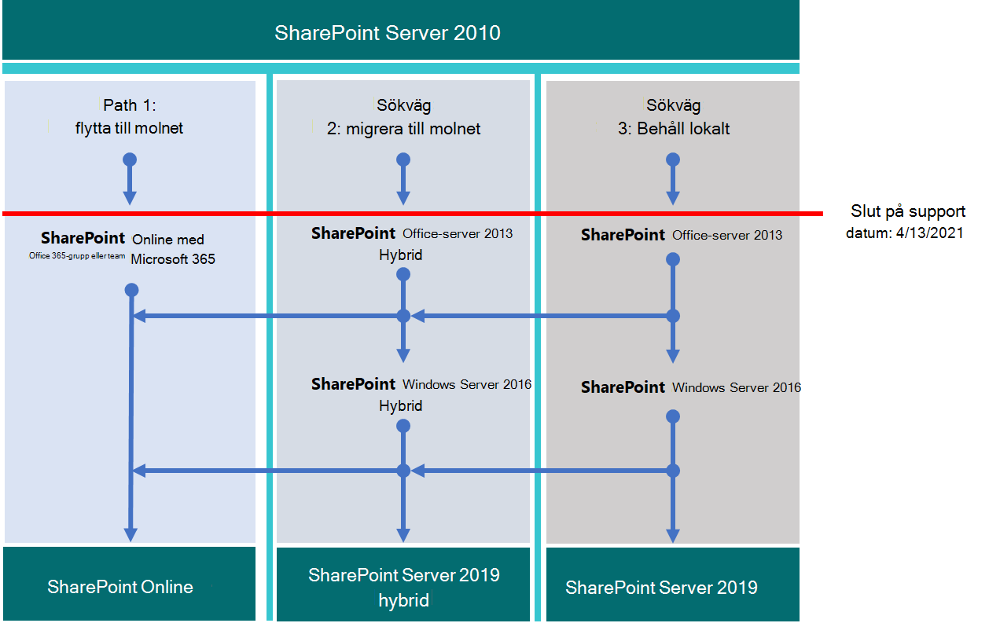

# Uppgradering från SharePoint 2010Upgrading from SharePoint 2010

*Denna artikel gäller för både Microsoft 365 Enterprise och Office 365 Enterprise.**This article applies to both Microsoft 365 Enterprise and Office 365 Enterprise.*

Supporten för Microsoft SharePoint 2010 och SharePoint Server 2010 avslutas **den 13 april 2021.**Microsoft SharePoint 2010 and SharePoint Server 2010 will reach end of support on **April 13, 2021**. Den här artikeln innehåller resurser som hjälper dig att migrera befintliga SharePoint Server 2010-data till SharePoint Online i Microsoft 365 eller uppgradera din lokala SharePoint Server 2010-miljö.This article provides resources to help you migrate your existing SharePoint Server 2010 data to SharePoint Online in Microsoft 365 or upgrade your on-premises SharePoint Server 2010 environment.

## Vad är *slutet på supporten?*What is *end of support*?

De flesta Microsoft-produkter har en supportlivscykel under vilken de får nya funktioner, programkorrigeringar, säkerhetskorrigeringar och så vidare.Most Microsoft products have a support lifecycle, during which they get new features, bug fixes, security fixes, and so on. Efter supportens slutdatum slutar produkten inte att fungera, men Microsoft tillhandahåller inte längre:After the end-of-support date, the product doesn't stop working, but Microsoft no longer provides:

- Teknisk support för problem som kan uppstå.Technical support for problems that may occur.

- Programkorrigeringar för problem som kan påverka servrars stabilitet och användbarhet.Bug fixes for issues that may impact the stability and usability of the server.

- Säkerhetskorrigeringar för säkerhetsproblem som kan göra servern sårbar för säkerhetsbrister.Security fixes for vulnerabilities that may make the server vulnerable to security breaches.

- Tidszonsuppdateringar.Time zone updates.

Det innebär att det inte finns några ytterligare uppdateringar, korrigeringar eller korrigeringar för produkten (inklusive säkerhetskorrigeringar/korrigeringar).That means there will be no further updates, patches, or fixes for the product (including security patches/fixes). Microsoft Support kommer helt att ha gått över till att stödja nyare versioner.Microsoft Support will have fully shifted its support efforts to more recent versions.

När supporten för SharePoint Server 2010 närmar sig kan du ta bort data du inte längre behöver innan du uppgraderar produkten och migrerar viktiga data.As the end of support of SharePoint Server 2010 approaches, delete data you no longer need before you upgrade the product and migrate your important data.

> [!NOTE]
> En programlivscykel varar vanligtvis i tio år från den första versionen.A software lifecycle typically lasts for ten years from the initial release. [Microsoft-lösningsleverantörer](https://go.microsoft.com/fwlink/?linkid=841249) kan hjälpa dig att uppgradera till nästa version av programvaran eller migrera till Microsoft 365 (eller båda).[Microsoft solution providers](https://go.microsoft.com/fwlink/?linkid=841249) can can help you upgrade to the next version of the software or migrate to Microsoft 365 migration (or both). Kontrollera även att du känner till supportdatum för viktiga underliggande tekniker, särskilt för den version av Microsoft SQL Server som du använder med SharePoint.Make sure you're aware of end-of-support dates for critical underlying technologies as well, particularly for the version of Microsoft SQL Server you're using with SharePoint. Mer information finns i Fast [livscykelpolicy.](https://support.microsoft.com/help/14085)For more information, see [Fixed Lifecycle Policy](https://support.microsoft.com/help/14085).

## Planera i förvägPlan ahead

Kontrollera datum då supporten upphör på webbplatsen [För produktens livscykel.](https://support.microsoft.com/lifecycle/search?alpha=SharePoint%20Server%202010)Check the dates that support ends on the [Product Lifecycle site](https://support.microsoft.com/lifecycle/search?alpha=SharePoint%20Server%202010). Planera uppgraderingar eller migreringar med dessa datum i åtanke.Plan your upgrades or migrations with these dates in mind. Kom ihåg att *din produkt inte slutar fungera på* det datum som anges.Remember that your product *won't stop working* at the date listed. Men eftersom din installation inte längre kommer att korrigeras efter det datumet är det bra om du planerar en smidig övergång till nästa version av produkten.But because your installation will no longer be patched after that date, you'll want to plan a smooth transition to the next version of the product.

I den här matrisen ritas en kurs mellan migreringsalternativen:This matrix helps plot a course among migration options:

|Supporten för produkten avslutasEnd of support product|BraGood |BästBest|
|---|---|---|
|SharePoint Server 2010SharePoint Server 2010|SharePoint Server 2013 (lokalt)SharePoint Server 2013 (on-premises)|SharePoint OnlineSharePoint Online|
||SharePoint Server 2013-hybrid med SharePoint OnlineSharePoint Server 2013 hybrid with SharePoint Online|SharePoint Server 2016 (lokalt)SharePoint Server 2016 (on-premises)|
|||SharePoint MolnhybridsökningSharePoint Cloud Hybrid Search|

Om du väljer ett alternativ i den lägre skalan (bra) måste du börja planera för ytterligare en uppgradering strax efter migreringen SharePoint Server 2010.If you choose an option on the low end of the scale (good), you'll need to start planning for another upgrade soon after your migration from SharePoint Server 2010.

Här är de tre sätt du kan gå till för att undvika att supporten för SharePoint Server 2010 tar slut.Here are the three paths you can take to avoid the end of support for SharePoint Server 2010.

> [!NOTE]
> Supporten för SharePoint Server 2010 och SharePoint Foundation 2010 är för närvarande schemalagd för den 13 april 2021.End of support for SharePoint Server 2010 and SharePoint Foundation 2010 is currently scheduled for April 13, 2021. Men kontrollera att du har de [senaste datumen på](https://support.microsoft.com/lifecycle) webbplatsen för Produktlivscykel.But make sure to check the [Product Lifecycle site](https://support.microsoft.com/lifecycle) for the most-current dates.

## Hur går jag vidare?What's next?

SharePoint Server 2013 och SharePoint Foundation 2013 kan installeras lokalt på dina egna servrar.SharePoint Server 2013 and SharePoint Foundation 2013 can be installed on-premises on your own servers. Du kan även använda SharePoint Online, som är en onlinetjänst som är en del av Microsoft 365.Or you can use SharePoint Online, which is an online service that's part of Microsoft 365. Du kan välja att:You can choose to:

- Migrera till SharePoint Online.Migrate to SharePoint Online.

- Uppgradera SharePoint server eller SharePoint Foundation lokalt.Upgrade SharePoint Server or SharePoint Foundation on-premises.

- Gör båda ovanstående.Do both of the above.

- Implementera en [SharePoint en hybridlösning.](/sharepoint/hybrid/hybrid)Implement a [SharePoint hybrid](/sharepoint/hybrid/hybrid) solution.

Överväg de dolda kostnaderna för att underhålla en servergrupp, inklusive underhåll eller migrering av anpassningar och uppgradering av maskinvara.Consider the hidden costs of maintaining a server farm, including maintaining or migrating customizations and upgrading hardware. Om du redovisat dessa faktorer blir det enklare att uppgradera lokalt.If you've accounted for these factors, it will be easier to upgrade on-premises. Om du kör servergruppen på äldre SharePoint-servrar utan tung anpassning kan du dra nytta av en planerad migrering till SharePoint Online.If you run your farm on legacy SharePoint Servers without heavy customization, you could benefit from a planned migration to SharePoint Online. För en lokal SharePoint Server-miljö kan du också överväga att flytta vissa data i SharePoint Online för att minska maskinvaruhanteringen.For an on-premises SharePoint Server environment, you can also consider moving some data in SharePoint Online to reduce hardware management overhead.

> [!NOTE]
> SharePoint-administratörer kan skapa en Microsoft 365-prenumeration, konfigurera nya SharePoint Online-webbplatser och sedan rensa bort SharePoint Server 2010 och ta endast viktiga dokument till nya webbplatser.SharePoint administrators can create a Microsoft 365 Subscription, set up new SharePoint Online sites, and then cut away from SharePoint Server 2010 cleanly, taking only essential documents to the fresh sites. Därefter kan alla återstående data tömmas från SharePoint Server 2010-webbplatsen till de lokala arkiven.Then, any remaining data can be drained from the SharePoint Server 2010 site into on-premises archives.

|SharePoint OnlineSharePoint Online|SharePoint Server lokaltSharePoint Server on-premises|
|---|---|
|Hög kostnad i tid (plan/körning/verifiering)High cost in time (plan/execution/verification)|Hög kostnad i tid (plan/körning/verifiering)High cost in time (plan/execution/verification)|
|Lägre kostnad i pengar (inga maskinvaruinköp)Lower cost in funds (no hardware purchases)|Högre kostnad i pengar (maskinvaruinköp)Higher cost in funds (hardware purchases)|
|One-time cost in migrationOne-time cost in migration|Upprepad kostnad vid framtida migreringarOne-time cost repeated per future migration|
|Låg total kostnad för ägande/underhållLow total cost of ownership/maintenance|Hög total kostnad för ägande/underhållHigh total cost of ownership/maintenance|

Om du flyttar till en Microsoft 365 får du en högre kostnad när du organiserar data och bestämmer vad som ska flyttas till molnet och vad som ska bli kvar.A one-time move to Microsoft 365 will have a higher cost while you organize data and decide what to take to the cloud and what to leave behind. Men när dina data har migrerats kommer framtida uppgraderingar att ske automatiskt, eftersom du inte längre behöver hantera maskinvaru- och programvaruuppdateringar.But after your data is migrated, future upgrades will be automatic, as you'll no longer need to manage hardware and software updates. Drifttiden för servergruppen backas upp genom ett [Microsoft-serviceavtal (SLA).](/office365/servicedescriptions/office-365-platform-service-description/service-level-agreement)And the up time of your farm will be backed by a [Microsoft service level agreement (SLA)](/office365/servicedescriptions/office-365-platform-service-description/service-level-agreement).

### Migrera till SharePoint OnlineMigrate to SharePoint Online

Se till SharePoint Online har alla funktioner du behöver.Make sure SharePoint Online offers all the features you need. Se [SharePoint tjänstbeskrivning](/office365/servicedescriptions/sharepoint-online-service-description/sharepoint-online-service-description).See [SharePoint service description](/office365/servicedescriptions/sharepoint-online-service-description/sharepoint-online-service-description).

Du kan inte migrera direkt från SharePoint Server 2010 (eller SharePoint Foundation 2010) till SharePoint Online.You can't migrate directly from SharePoint Server 2010 (or SharePoint Foundation 2010) to SharePoint Online. Så mycket av migreringen är manuellt.So much of the migration work is manual. Men i det här steget får du möjlighet att använda data och webbplatser som inte längre behövs innan flytten.But this stage gives you the opportunity to prune data and sites that are no longer needed before the move. Du kan arkivera andra data till lagring.You can archive other data into storage. 

Kom ihåg SharePoint server 2010 och SharePoint Foundation 2010 inte slutar fungera när supporten upphör.Remember that SharePoint Server 2010 and SharePoint Foundation 2010 won't stop working at end of support. Administratörerna kan alltså ha en SharePoint en period när de fortfarande kör om deras kunder glömmer att flytta vissa data.So administrators can have a period when SharePoint is still running if their customers forget to move some of their data.

Om du uppgraderar till SharePoint Server 2013 eller SharePoint Server 2016 och bestämmer dig för att placera data i SharePoint Online kan du använda [migrerings-API:t](https://support.office.com/article/Upload-on-premises-content-to-SharePoint-Online-using-PowerShell-cmdlets-555049c6-15ef-45a6-9a1f-a1ef673b867c?ui=en-US&amp;rs=en-US&amp;ad=US) för SharePoint för att migrera information till OneDrive för företag.If you upgrade to SharePoint Server 2013 or SharePoint Server 2016 and decide to put data into SharePoint Online, you might use the [SharePoint Migration API](https://support.office.com/article/Upload-on-premises-content-to-SharePoint-Online-using-PowerShell-cmdlets-555049c6-15ef-45a6-9a1f-a1ef673b867c?ui=en-US&amp;rs=en-US&amp;ad=US) to migrate information into OneDrive for Business.

|SharePoint OnlinefördelSharePoint Online advantage|SharePoint Nackdelar onlineSharePoint Online disadvantage|
|---|---|
|Microsoft tillhandahåller SPO-maskinvara och all maskinvaruadministration.Microsoft supplies SPO hardware and all hardware administration.|Tillgängliga funktioner kan skilja sig SharePoint mellan Server lokalt och SPO.Available features may differ between SharePoint Server on-premises and SPO.|
|Du är global administratör för prenumerationen och kan tilldela administratörer till SPO-webbplatser.You're the global administrator of your subscription and can assign administrators to SPO sites.|Vissa åtgärder som är tillgängliga för en servergruppsadministratör i SharePoint Lokala server finns inte (eller är inte nödvändiga) i SharePoint administratörsrollen i Microsoft 365.Some actions available to a farm administrator in SharePoint Server on-premises don't exist (or aren't necessary) in the SharePoint Administrator role in Microsoft 365. Men SharePoint administration, administration av webbplatssamling och webbplatsägarskap är lokala för din organisation.But SharePoint Administration, Site Collection Administration, and Site Ownership are local to your org.|
|Microsoft tillämpar korrigeringar, korrigeringar och uppdateringar på underliggande maskinvara och programvara, inklusive SQL servrar som SharePoint Online körs på.Microsoft applies patches, fixes, and updates to underlying hardware and software, including SQL servers on which SharePoint Online runs.|Eftersom det inte finns åtkomst till det underliggande filsystemet i tjänsten är anpassningen begränsad.Because there's no access to the underlying file system in the service, customization is limited.|
|Microsoft publicerar [serviceavtal och flyttar](/office365/servicedescriptions/office-365-platform-service-description/service-level-agreement) snabbt för att lösa incidenter på tjänstnivå.Microsoft publishes [service level agreements](/office365/servicedescriptions/office-365-platform-service-description/service-level-agreement) and moves quickly to resolve service-level incidents.|Säkerhetskopiering och återställning och andra återställningsalternativ automatiseras av tjänsten i SharePoint Online.Backup and restore and other recovery options are automated by the service in SharePoint Online. Säkerhetskopior skrivs över om de inte används.Backups are overwritten if not used.|
|Säkerhetstestning och serverprestandajustering utförs kontinuerligt i tjänsten av Microsoft.Security testing and server performance tuning are carried out continuously in the service by Microsoft.|Ändringar av användargränssnittet och SharePoint funktioner installeras av tjänsten och kan behöva vara på eller av.Changes to the user interface and other SharePoint features are installed by the service and may need to be toggled on or off.|
|Microsoft 365 uppfyller många branschstandarder: [Microsofts efterlevnadserbjudanden](/compliance/regulatory/offering-home).Microsoft 365 meets many industry standards: [Microsoft compliance offerings](/compliance/regulatory/offering-home).|[FastTrack-hjälp](https://go.microsoft.com/fwlink/?linkid=518597) för migrering är begränsad.[FastTrack](https://go.microsoft.com/fwlink/?linkid=518597) assistance for migration is limited.    Mycket av uppgraderingen sker manuellt eller via SPO-migrerings-API:t som beskrivs i SharePoint Online OneDrive Översikt över [migreringsinnehåll.](/sharepointmigration/upload-on-premises-content-to-sharepoint-online-using-powershell-cmdlets)Much of the upgrade will be manual or via the SPO Migration API described in the [SharePoint Online and OneDrive Migration Content Roadmap](/sharepointmigration/upload-on-premises-content-to-sharepoint-online-using-powershell-cmdlets).|
|Microsofts supporttekniker och anställda på datacenter har inte obegränsad administratörsåtkomst till din prenumeration.Microsoft Support engineers and datacenter employees don't have unrestricted admin access to your subscription.|Det kan till exempel bli ytterligare kostnader om maskinvaruinfrastrukturen måste uppgraderas för att stödja den nyare versionen av SharePoint eller om en sekundär servergrupp krävs för uppgraderingen.There can be additional costs if hardware infrastructure needs to be upgraded to support the newer version of SharePoint or if a secondary farm is required for upgrade.|
|Lösningsleverantörer kan hjälpa dig med det enda jobbet att migrera dina data till SharePoint Online.Solution providers can help with the one-time job of migrating your data to SharePoint Online.|Det är inte alla ändringar SharePoint online som du har kontroll över.Not all changes to SharePoint Online are within your control. Efter migreringen kan designskillnaderna i menyer, bibliotek och andra funktioner tillfälligt påverka användbarheten.After migration, design differences in menus, libraries, and other features may temporarily affect usability.|
|Onlineprodukter uppdateras automatiskt i tjänsten.Online products are updated automatically across the service. Funktioner kanske förfasas, men det finns ingen livscykel för support.Features may deprecate, but there's no true end of support lifecycle.|Det finns en livscykel för slutet av supporten för SharePoint Server eller SharePoint Foundation samt underliggande SQL-servrar.There's an end-of-support lifecycle for SharePoint Server or SharePoint Foundation as well as underlying SQL servers.|

Om du har bestämt dig för att skapa en ny Microsoft 365-webbplats och manuellt migrerar data till den vid behov, kontrollera dina [Microsoft 365 .](https://www.microsoft.com/microsoft-365/)If you've decided to create a new Microsoft 365 site and will manually migrate data to it as is needed, check your [Microsoft 365 options](https://www.microsoft.com/microsoft-365/).

### Uppgradera SharePoint server lokaltUpgrade SharePoint Server on-premises

Från och med SharePoint Server 2019 måste uppgraderingarna gå *serien igenom.*As of SharePoint Server 2019, upgrades must go  *serially*. Det går inte att uppgradera från SharePoint Server 2010 till SharePoint Server 2016 eller SharePoint 2019 direkt.There's no way to upgrade from SharePoint Server 2010 to SharePoint Server 2016 or to SharePoint 2019 directly. Serieuppgraderingsväg:Serial upgrade path:

- SharePoint Server 2010 \> SharePoint Server 2013 \> SharePoint Server 2016SharePoint Server 2010 \> SharePoint Server 2013 \> SharePoint Server 2016

Det tar tid och planering att följa hela vägen från SharePoint 2010 till SharePoint Server 2016.It will take time and planning to follow the entire path from SharePoint 2010 to SharePoint Server 2016. Uppgraderingar innebär kostnader för maskinvara (SQL-servrar måste också uppgraderas), programvara och administration.Upgrades involve costs for hardware (SQL servers must also be upgraded), software, and administration. Dessutom kan anpassningar behöva uppgraderas eller till och med tas bort.Also, customizations may need to be upgraded or even abandoned. Se till att dokumentera viktiga anpassningar innan du uppgraderar SharePoint servergruppen.Be sure that you document critical customizations before you upgrade your SharePoint Server farm.

> [!NOTE]
> Det är möjligt att behålla supporten för SharePoint 2010-servergruppen, installera en SharePoint Server 2016-servergrupp på ny maskinvara (så att de separata servergruppen körs sida vid sida) och sedan planera och utföra en manuell migrering av innehåll (till exempel för att ladda ned och ladda upp innehåll på nytt).It's possible to maintain your end-of-support SharePoint 2010 farm, install a SharePoint Server 2016 farm on new hardware (so the separate farms run side-by-side), and then plan and execute a manual migration of content (for downloading and re-uploading content, for example). Men det finns potentiella fallgropar i de här manuella flytterna, till exempel dokument från 2010 med ett aktuellt konto som senast ändrades och alias för det konto som flyttar manuellt.But there are potential pitfalls to these manual moves, such as documents coming from 2010 having a current last-modified account with the alias of the account that does the manual move. Och en del arbete måste göras i förväg, till exempel återskapa webbplatser, underwebbplatser, behörigheter och liststrukturer.And some work must be done ahead of time, such as recreating sites, subsites, permissions, and list structures. Se till att rensa miljön innan du uppgraderar.Be sure to clean your environment prior to upgrade. Fundera på vilka data du kan flytta till lagring eller inte längre behöver.Consider what data you can move into storage or no longer need. Det kan minska konsekvenserna av migreringen.This can reduce the impact of migration. Se till att din befintliga servergrupp fungerar innan du uppgraderar, och (verkligen) innan du inaktiverar den!Be certain your existing farm is functional before you upgrade, and (certainly) before you decommission!

Kom ihåg att granska *de uppgraderingsvägar som stöds och inte stöds:*Remember to review the *supported and unsupported upgrade paths*:

- [SharePoint Server 2010](/previous-versions/office/sharepoint-2007-products-and-technologies/cc262747(v=office.12))[SharePoint Server 2010](/previous-versions/office/sharepoint-2007-products-and-technologies/cc262747(v=office.12))

- [SharePoint Server 2013SharePoint Server 2013](/SharePoint/upgrade-and-update/review-supported-editions-and-products-for-upgrading-to-sharepoint-2013)

Om du *har anpassningar är* det viktigt att du planerar för varje steg i migreringsprocessen:If you have *customizations*, it's critical that you plan for each step in the migration path:

- [SharePoint Server 2010](/previous-versions/office/sharepoint-server-2010/cc263203(v=office.14))[SharePoint Server 2010](/previous-versions/office/sharepoint-server-2010/cc263203(v=office.14))

- [SharePoint Server 2013SharePoint Server 2013](/SharePoint/upgrade-and-update/create-a-communication-plan-for-the-upgrade-to-sharepoint-2013)

|Lokal fördelOn-premises advantage|Lokal nackdelOn-premises disadvantage|
|---|---|
|Fullständig kontroll över alla aspekter av SharePoint servergrupp (och dess SQL) från servermaskinvara och uppåt.Full control of all aspects of your SharePoint Farm (and its SQL), from the server hardware up.|Alla avbrott och korrigeringar ansvarar ditt företag för.All breaks and fixes are the responsibility of your company. Men du kan använda dig av betald Microsoft-support om din produkt inte har gått ut och supporten har gått ut.But you can engage paid Microsoft Support if your product isn't past end of support.|
|Fullständig funktionsuppsättning i SharePoint server lokalt med alternativet att ansluta den lokala servergruppen till en SharePoint Online-prenumeration via hybrid.Full feature set of SharePoint Server on-premises with the option to connect your on-premises farm to a SharePoint Online subscription via hybrid.|Uppgraderingar, korrigeringar, säkerhetskorrigeringar, maskinvaruuppgraderingar och allt underhåll av SharePoint Server och dess SQL hanteras lokalt.Upgrade, patches, security fixes, hardware upgrades, and all maintenance of SharePoint Server and its SQL farm are managed on-premises.|
|Fullständig åtkomst för fler anpassningsalternativ än med SharePoint Online.Full access for greater customization options than with SharePoint Online.|[Microsofts efterlevnadserbjudanden](/compliance/regulatory/offering-home) måste konfigureras manuellt lokalt.[Microsoft compliance offerings](/compliance/regulatory/offering-home) must be manually configured on-premises.|
|Säkerhetstestning och serverprestandajustering utförs lokalt under din kontroll.Security testing and server performance tuning are carried out on your premises under your control.|Microsoft 365 göra funktioner tillgängliga för SharePoint Online som inte fungerar tillsammans med SharePoint lokala server.Microsoft 365 may make features available to SharePoint Online that don't interoperate with SharePoint Server on-premise.|
|Lösningsleverantörer kan migrera data till nästa version av SharePoint Server (och därefter).Solution providers can help migrate data to the next version of SharePoint Server (and beyond).|Dina SharePoint Server-webbplatser använder inte [automatiskt SSL-/TLS-certifikat](/SharePoint/security-for-sharepoint-server/enable-tls-1-1-and-tls-1-2-support-in-sharepoint-server-2016) som visas i SharePoint Online.Your SharePoint Server sites will not automatically use [SSL/TLS](/SharePoint/security-for-sharepoint-server/enable-tls-1-1-and-tls-1-2-support-in-sharepoint-server-2016) certificates as is seen in SharePoint Online.|
|Fullständig kontroll över namnkonventioner, säkerhetskopiering och återställning och andra återställningsalternativ SharePoint server lokalt.Full control of naming conventions and backup and restore and other recovery options in SharePoint Server on-premises.|SharePoint Server lokalt är känslig för produktens livscykler.SharePoint Server on-premises is sensitive to product lifecycles.|

### Uppgradera resurserUpgrade resources

Börja med att jämföra maskin- och programvarukrav.Begin by comparing hardware and software requirements. Om din aktuella miljö inte uppfyller grundläggande krav kan du behöva uppgradera maskinvaran i servergruppen eller SQL-servrarna först.If your current environment doesn't meet basic requirements, you may have to upgrade the hardware in the farm or the SQL servers first. 

Du kan bestämma dig för att flytta några av dina webbplatser till den "evighets"-maskinvara som SharePoint Online.You may decide to move some of your sites to the "evergreen" hardware of SharePoint Online. När du har gjort din utvärdering följer du de uppgraderingsvägar och metoder som stöds.Once you've made your assessment, follow supported upgrade paths and methods.

- *Maskin-/programvarukrav för:**Hardware/software requirements for:*

    [SharePoint Server 2010](/previous-versions/office/sharepoint-server-2010/cc262485(v=office.14))  |  [SharePoint Server 2013](/SharePoint/install/hardware-and-software-requirements-0)  |  [SharePoint Server 2016](/SharePoint/install/hardware-and-software-requirements)[SharePoint Server 2010](/previous-versions/office/sharepoint-server-2010/cc262485(v=office.14)) | [SharePoint Server 2013](/SharePoint/install/hardware-and-software-requirements-0) | [SharePoint Server 2016](/SharePoint/install/hardware-and-software-requirements)

- *Programvarubegränsningar för:**Software boundaries and limits for:*

    [SharePoint Server 2010](/previous-versions/office/sharepoint-server-2010/cc262787(v=office.14))  |  [SharePoint Server 2013](/SharePoint/install/software-boundaries-and-limits)  |  [SharePoint Server 2016](/SharePoint/install/software-boundaries-and-limits-0)[SharePoint Server 2010](/previous-versions/office/sharepoint-server-2010/cc262787(v=office.14)) | [SharePoint Server 2013](/SharePoint/install/software-boundaries-and-limits) | [SharePoint Server 2016](/SharePoint/install/software-boundaries-and-limits-0)

- *En översikt över uppgraderingsprocessen för:**The upgrade process overview for:*

    [SharePoint Server 2010](/previous-versions/office/sharepoint-server-2010/cc303420(v=office.14))  |  [SharePoint Server 2013](/SharePoint/upgrade-and-update/upgrade-to-sharepoint-server-2016)  |  [SharePoint Server 2016](/SharePoint/upgrade-and-update/upgrade-to-sharepoint-server-2016)[SharePoint Server 2010](/previous-versions/office/sharepoint-server-2010/cc303420(v=office.14)) | [SharePoint Server 2013](/SharePoint/upgrade-and-update/upgrade-to-sharepoint-server-2016) | [SharePoint Server 2016](/SharePoint/upgrade-and-update/upgrade-to-sharepoint-server-2016)

### Skapa en hybridlösning med SharePoint Online SharePoint server lokaltCreate a hybrid solution with SharePoint Online and SharePoint Server on-premises

En hybridkonfiguration ger det bästa av både lokalt och online för vissa migreringsbehov.A hybrid setup provides the best of both on-premises and online for some migration needs. Du kan ansluta SharePoint Server 2013-, 2016- eller 2019-servergrupper till SharePoint Online för att skapa en SharePoint-hybrid: Läs mer [om SharePoint-hybridlösningar.](https://support.office.com/article/4c89a95a-a58c-4fc1-974a-389d4f195383.aspx)You can connect SharePoint Server 2013, 2016, or 2019 farms to SharePoint Online to create a SharePoint hybrid: [Learn about SharePoint hybrid solutions](https://support.office.com/article/4c89a95a-a58c-4fc1-974a-389d4f195383.aspx).

Om du vill SharePoint en hybridservergrupp är ditt migreringsmål kan du ta reda på vilka webbplatser och användare som ska flytta online och vilka som måste vara lokala.If a hybrid SharePoint Server farm is your migration goal, figure what sites and users to move online and which need to remain on-premises. Om ditt SharePoint servergruppsinnehåll rangordnas som högt, medelstort eller lågt påverkan på ditt företag kan det vara till hjälp med det här beslutet.Ranking your SharePoint Server farm content as high, medium, or low impact to your company can help with this decision. Du kanske bara behöver dela användarkonton för inloggning och sökindexet SharePoint Server med SharePoint Online.You may only need to share user accounts for login and the SharePoint Server search index with SharePoint Online. Men den här faktorn kanske inte är helt klar förrän du tittar på hur webbplatserna används.But this factor may not be clear until you look at how your sites are used. Om ditt företag senare bestämmer sig för att migrera allt innehåll till SharePoint Online kan du flytta alla återstående konton och data online och inaktivera din lokala servergrupp.If your company later decides to migrate all your content to SharePoint Online, you can move all remaining accounts and data online and decommission your on-premises farm. Hantering/administration av SharePoint servergruppen utförs via Microsoft 365 från och med då.Management/administration of the SharePoint farm will be done through Microsoft 365 consoles from that point on.

Bekanta dig med de befintliga typerna av hybrider och hur du konfigurerar anslutningen mellan din lokala SharePoint och din Microsoft 365-prenumeration.Be sure to familiarize yourself with the existing types of hybrids and how to configure the connection between your on-premises SharePoint farm and your Microsoft 365 subscription.

|AlternativOption|BeskrivningDescription|
|---|---|
|[Microsofts efterlevnadserbjudanden.](/compliance/regulatory/offering-home)[Microsoft compliance offerings](/compliance/regulatory/offering-home).|[FastTrack-hjälp](https://www.microsoft.com/fasttrack/microsoft-365) för migrering är begränsad.[FastTrack](https://www.microsoft.com/fasttrack/microsoft-365) assistance for migration is limited.   Mycket av uppgraderingen sker manuellt eller via SPO-migrerings-API:t som beskrivs i SharePoint Online OneDrive Översikt över [migreringsinnehåll.](/sharepointmigration/upload-on-premises-content-to-sharepoint-online-using-powershell-cmdlets)Much of the upgrade will be manual or via the SPO Migration API described in the [SharePoint Online and OneDrive Migration Content Roadmap](/sharepointmigration/upload-on-premises-content-to-sharepoint-online-using-powershell-cmdlets).|
|Microsofts supporttekniker och anställda på datacenter har inte obegränsad administratörsåtkomst till din prenumeration.Microsoft Support engineers and datacenter employees don't have unrestricted admin access to your subscription.|Det kan bli ytterligare kostnader om maskinvaruinfrastrukturen måste uppgraderas för att stödja den nyare versionen av SharePoint, eller om en sekundär servergrupp krävs.There may be additional costs if hardware infrastructure needs to be upgraded to support the newer version of SharePoint, or if a secondary farm is required.|
|Partners kan hjälpa till med det lediga jobbet att migrera dina data till SharePoint Online.Partners can assist with the one-time job of migrating your data to SharePoint Online.||
|Onlineprodukter uppdateras automatiskt i tjänsten.Online products are updated automatically across the service. Funktionerna kanske förfasas, men det finns inget stöd för det.Features may deprecate, but there's no true end of support.||

Om du har bestämt dig för att skapa en ny Microsoft 365 och manuellt migrera data till den efter behov, kontrollera dina [Microsoft 365 alternativ](https://www.microsoft.com/microsoft-365/).If you've decided to create a new Microsoft 365 site and manually migrate data to it as is needed, check your [Microsoft 365 options](https://www.microsoft.com/microsoft-365/).

### Uppgradera SharePoint server lokaltUpgrade SharePoint Server on-premises

Det går inte att hoppa över versioner i SharePoint Uppgraderingar.There's no way to skip versions in SharePoint Upgrades. Det innebär att uppgraderingarna går igenom:That means upgrades go serially:

- SharePoint 2007 \> SharePoint Server 2010 \> SharePoint Server 2013 \> SharePoint Server 2016SharePoint 2007 \> SharePoint Server 2010 \> SharePoint Server 2013 \> SharePoint Server 2016

Om du ska ta hela vägen från SharePoint 2007 till SharePoint Server 2016 innebär det betydande investeringar i tid och innebär att maskinvara (SQL-servrar måste också uppgraderas), programvara och administrationskostnader.To take the entire path from SharePoint 2007 to SharePoint Server 2016 will mean a significant investment of time and will involve hardware (SQL servers must also be upgraded), software, and administration costs. Anpassningar måste uppgraderas eller tas bort beroende på hur kritisk funktionen är.Customizations will need to be upgraded or abandoned, according to the criticality of the feature.

> [!NOTE]
> Det är möjligt att behålla din livscykel för SharePoint 2007-servergruppen, installera en SharePoint Server 2016-servergrupp på ny maskinvara (så att de separata servergruppen körs sida vid sida) och sedan planera och utföra en manuell migrering av innehåll (till exempel för att ladda ned och ladda upp innehåll på nytt).It's possible to maintain your end-of-life SharePoint 2007 farm, install a SharePoint Server 2016 farm on new hardware (so the separate farms run side-by-side), and then plan and execute a manual migration of content (for downloading and re-uploading content, for example). Det finns dock vissa nackdelar med de här manuella flyttarna, till exempel att flytta dokument och ersätta kontot med senast ändrad med alias för det konto som flyttar manuellt.But there are some drawbacks to these manual moves, such as moves of documents replacing the last modified account with the alias of the account that does the manual move. Och mycket arbete måste göras i förväg, till exempel återskapa webbplatser, underwebbplatser, behörigheter och liststrukturer.And much work must be done ahead of time, such as recreating sites, subsites, permissions, and list structures. Fundera i alla fall på vilka data du kan flytta till lagringen eller inte längre behöver minska konsekvenserna av migreringen.In any case, consider what data you can move into storage or no longer need to reduce the impact of migration.

Se till att rensa miljön innan du uppgraderar.Make sure to clean your environment prior to upgrade. Se till att din befintliga servergrupp fungerar innan du uppgraderar, och absolut innan du inaktiverar den!Be certain your existing farm is functional before you upgrade, and certainly before you decommission!

Kom ihåg att granska *de uppgraderingsvägar som stöds och inte stöds:*Remember to review the *supported and unsupported upgrade paths*:

- [SharePoint Server 2007](/previous-versions/office/sharepoint-2007-products-and-technologies/cc262747(v=office.12))[SharePoint Server 2007](/previous-versions/office/sharepoint-2007-products-and-technologies/cc262747(v=office.12))

- [SharePoint Server 2010](/previous-versions/office/sharepoint-2007-products-and-technologies/cc262747(v=office.12))[SharePoint Server 2010](/previous-versions/office/sharepoint-2007-products-and-technologies/cc262747(v=office.12))

- [SharePoint Server 2013SharePoint Server 2013](/SharePoint/upgrade-and-update/review-supported-editions-and-products-for-upgrading-to-sharepoint-2013)

Om du *har anpassningar är* det viktigt att planera uppgraderingen för varje steg i migreringsprocessen:If you have *customizations*, it's critical to plan your upgrade for each step in the migration path:

- [SharePoint 2007](/previous-versions/office/sharepoint-2007-products-and-technologies/cc263203(v=office.12))[SharePoint 2007](/previous-versions/office/sharepoint-2007-products-and-technologies/cc263203(v=office.12))

- [SharePoint Server 2010](/previous-versions/office/sharepoint-server-2010/cc263203(v=office.14))[SharePoint Server 2010](/previous-versions/office/sharepoint-server-2010/cc263203(v=office.14))

- [SharePoint Server 2013SharePoint Server 2013](/SharePoint/upgrade-and-update/create-a-communication-plan-for-the-upgrade-to-sharepoint-2013)

|Lokalt proffsOn-premises pro|Lokal conOn-premises con|
|---|---|
|Fullständig kontroll över alla aspekter av SharePoint servergrupp, allt från servermaskinvara och uppåt.Full control of all aspects of your SharePoint Farm, from the server hardware up.|Alla avbrott och korrigeringar ansvarar ditt företag för.All breaks and fixes are the responsibility of your company. (Men du kan kontakta betald Microsoft Support om din produkt inte har gått ut och supporten har gått ut.)(But you can engage paid Microsoft Support if your product isn't past end of support.)|
|Fullständig funktionsuppsättning i SharePoint server lokalt med alternativet att ansluta den lokala servergruppen till en SharePoint Online-prenumeration via hybrid.Full feature set of SharePoint Server on-premises with the option to connect your on-premises farm to a SharePoint Online subscription via hybrid.|Uppgraderingar, korrigeringar, säkerhetskorrigeringar och allt underhåll SharePoint server hanteras lokalt.Upgrade, patches, security fixes, and all maintenance of SharePoint Server managed on-premises.|
|Fullständig åtkomst för större anpassning.Full access for greater customization.|[Microsofts efterlevnadserbjudanden](/compliance/regulatory/offering-home) måste konfigureras manuellt lokalt.[Microsoft compliance offerings](/compliance/regulatory/offering-home) must be manually configured on-premises.|
|Säkerhetstestning och serverprestandajustering utförs lokalt under din kontroll.Security testing and server performance tuning is carried out on your premises under your control.|Microsoft 365 kan göra funktioner tillgängliga för SharePoint Online som inte fungerar tillsammans SharePoint server lokalt.Microsoft 365 may make features available to SharePoint Online that don't interoperate with SharePoint Server on-premises.|
|Partner kan hjälpa till att migrera data till nästa version av SharePoint Server (och därefter).Partners can help migrate data to the next version of SharePoint Server (and beyond).|Dina SharePoint Server-webbplatser använder inte [automatiskt SSL-/TLS-certifikat](/SharePoint/security-for-sharepoint-server/enable-tls-1-1-and-tls-1-2-support-in-sharepoint-server-2016) som visas i SharePoint Online.Your SharePoint Server sites will not automatically use [SSL/TLS](/SharePoint/security-for-sharepoint-server/enable-tls-1-1-and-tls-1-2-support-in-sharepoint-server-2016) certificates as is seen in SharePoint Online.|
|Fullständig kontroll över namnkonventioner, säkerhetskopiering och återställning och andra återställningsalternativ SharePoint server lokalt.Full control of naming conventions and backup and restore and other recovery options in SharePoint Server on-premises.|SharePoint Server lokalt är känslig för produktens livscykler.SharePoint Server on-premises is sensitive to product lifecycles.|

### Uppgradera resurserUpgrade resources

Börja med att veta att du uppfyller maskinvaru- och programvarukraven och följ sedan de uppgraderingsmetoder som stöds.Begin by knowing that you meet hardware and software requirements, then follow supported upgrade methods.

- *Maskin-/programvarukrav för:**Hardware/software requirements for*:

    [SharePoint Server 2010](/previous-versions/office/sharepoint-server-2010/cc262485(v=office.14))  |  [SharePoint Server 2010](/previous-versions/office/sharepoint-server-2010/cc262485(v=office.14))  |  [SharePoint Server 2013](/SharePoint/install/hardware-and-software-requirements-0)  |  [SharePoint Server 2016](/SharePoint/install/hardware-and-software-requirements)[SharePoint Server 2010](/previous-versions/office/sharepoint-server-2010/cc262485(v=office.14)) | [SharePoint Server 2010](/previous-versions/office/sharepoint-server-2010/cc262485(v=office.14)) | [SharePoint Server 2013](/SharePoint/install/hardware-and-software-requirements-0) | [SharePoint Server 2016](/SharePoint/install/hardware-and-software-requirements)

- *Programvarubegränsningar för:**Software boundaries and limits for*:

    [SharePoint Server 2007](/previous-versions/office/sharepoint-2007-products-and-technologies/cc262787(v=office.12))  |  [SharePoint Server 2010](/previous-versions/office/sharepoint-server-2010/cc262787(v=office.14))  |  [SharePoint Server 2013](/SharePoint/install/software-boundaries-and-limits)  |  [SharePoint Server 2016](/SharePoint/install/software-boundaries-and-limits-0)[SharePoint Server 2007](/previous-versions/office/sharepoint-2007-products-and-technologies/cc262787(v=office.12)) | [SharePoint Server 2010](/previous-versions/office/sharepoint-server-2010/cc262787(v=office.14)) | [SharePoint Server 2013](/SharePoint/install/software-boundaries-and-limits) | [SharePoint Server 2016](/SharePoint/install/software-boundaries-and-limits-0)

- *En översikt över uppgraderingsprocessen för:**The upgrade process overview for*:

    [SharePoint Server 2007](/previous-versions/office/sharepoint-2007-products-and-technologies/cc303420(v=office.12))  |  [SharePoint Server 2010](/previous-versions/office/sharepoint-server-2010/cc303420(v=office.14))  |  [SharePoint Server 2013](/SharePoint/upgrade-and-update/upgrade-to-sharepoint-server-2016)  |  [SharePoint Server 2016](/SharePoint/upgrade-and-update/upgrade-to-sharepoint-server-2016)[SharePoint Server 2007](/previous-versions/office/sharepoint-2007-products-and-technologies/cc303420(v=office.12)) | [SharePoint Server 2010](/previous-versions/office/sharepoint-server-2010/cc303420(v=office.14)) | [SharePoint Server 2013](/SharePoint/upgrade-and-update/upgrade-to-sharepoint-server-2016) | [SharePoint Server 2016](/SharePoint/upgrade-and-update/upgrade-to-sharepoint-server-2016)

### Skapa SharePoint en hybridlösning mellan SharePoint online och lokaltCreate a SharePoint hybrid solution between SharePoint Online and on-premises

Om svaret på dina behov för migrering ligger någonstans mellan kontrollen som erbjuds av lokala och den lägre ägandekostnaden som erbjuds av SharePoint Online kan du ansluta SharePoint Server 2013- eller 2016-servergrupper till SharePoint Online via hybrider.If the answer to your migration needs is somewhere between the control offered by on-premises and the lower cost of ownership offered by SharePoint Online, you can connect SharePoint Server 2013 or 2016 farms to SharePoint Online through hybrids. [Läs mer SharePoint hybridlösningarLearn about SharePoint hybrid solutions](https://support.office.com/article/4c89a95a-a58c-4fc1-974a-389d4f195383.aspx)

Om du beslutar dig för att en SharePoint-hybridservergrupp är bra för ditt företag bör du läsa mer om de befintliga hybridtyperna och hur du konfigurerar anslutningen mellan din lokala SharePoint-servergrupp och Microsoft 365-prenumerationen.If you decide that a hybrid SharePoint Server farm will benefit your business, familiarize yourself with the existing types of hybrids and how to configure the connection between your on-premises SharePoint farm and your Microsoft 365 subscription.

Du kanske vill skapa en Microsoft 365 utvecklings-/testmiljö som du kan konfigurera med [testlabbguider.](m365-enterprise-test-lab-guides.md)You may want to create a Microsoft 365 dev/test environment, which you can set up with [Test Lab Guides](m365-enterprise-test-lab-guides.md). När du har fått en utvärderingsversion eller köpt Microsoft 365-prenumeration kan du skapa webbplatssamlingar, webbplatser och dokumentbibliotek i SharePoint Online som du kan migrera data till.After you get a trial or purchased Microsoft 365 subscription, you can create the site collections, webs, and document libraries in SharePoint Online to which you can migrate data. Du kan migrera manuellt med hjälp av migrerings-API:t eller, om du vill migrera Innehållet på Min webbplats till OneDrive för företag, via hybridguiden.You can migrate manually, by use of the Migration API, or, if you want to migrate My Site content to OneDrive for Business, through the hybrid wizard.

> [!NOTE]
> Om du vill använda hybridalternativet måste SharePoint Server 2010-servergruppen först uppgraderas lokalt till SharePoint Server 2013 eller 2016.To use the hybrid option, your SharePoint Server 2010 farm must first be upgraded on-premises to SharePoint Server 2013 or 2016. SharePoint Foundation 2010 och SharePoint Foundation 2013 har inte stöd för hybridanslutningar med SharePoint Online.SharePoint Foundation 2010 and SharePoint Foundation 2013 don't support hybrid connections with SharePoint Online.

## Sammanfattning av alternativ för Office 2010 klient och servrar och Windows 7Summary of options for Office 2010 client and servers and Windows 7

En visuell sammanfattning av alternativen för uppgradering, migrering och flytt till molnet för Office 2010-klienter och -servrar och Windows 7 finns i slutet av [supportaffischen](../downloads/Office2010Windows7EndOfSupport.pdf).For a visual summary of the upgrade, migrate, and move-to-the-cloud options for Office 2010 clients and servers and Windows 7, see the [end of support poster](../downloads/Office2010Windows7EndOfSupport.pdf).

Den här affischen illustrerar de olika sätt du kan gå för att undvika Office 2010 klient- och serverprodukter och Windows 7-supporten, med föredragna sökvägar och alternativ i Microsoft 365 Enterprise markerat.This poster illustrates the various paths you can take to avoid Office 2010 client and server products and Windows 7 end of support, with preferred paths and option supports in Microsoft 365 Enterprise highlighted.

Du kan också [ladda ned](https://github.com/MicrosoftDocs/microsoft-365-docs/raw/public/microsoft-365/downloads/Office2010Windows7EndOfSupport.pdf) den här affischen och skriva ut den i letter-, legal- eller tabloidformat (11 x 17).You can also [download](https://github.com/MicrosoftDocs/microsoft-365-docs/raw/public/microsoft-365/downloads/Office2010Windows7EndOfSupport.pdf) this poster and print it in letter, legal, or tabloid (11 x 17) format.

## Relaterade artiklarRelated articles

[Resurser som hjälper dig att uppgradera från Office 2007- eller 2010-servrar och -klienterResources to help you upgrade from Office 2007 or 2010 servers and clients](upgrade-from-office-2010-servers-and-products.md)

[Översikt över uppgraderingsprocessen från SharePoint 2010 till SharePoint 2013Overview of the upgrade process from SharePoint 2010 to SharePoint 2013](/SharePoint/upgrade-and-update/overview-of-the-upgrade-process-from-sharepoint-2010-to-sharepoint-2013)

[Metodtips för uppgradering från SharePoint 2010 till SharePoint 2013Best practices for upgrading from SharePoint 2010 to SharePoint 2013](/SharePoint/upgrade-and-update/best-practices-for-upgrading-from-sharepoint-2010-to-sharepoint-2013)

[Felsöka problem med databasuppgradering i SharePoint 2013Troubleshoot database upgrade issues in SharePoint 2013](/SharePoint/upgrade-and-update/troubleshoot-database-upgrade-issues-in-sharepoint-2013)

[Sök efter leverantörer av Microsoft-lösningar som kan hjälpa dig med uppgraderingenSearch for Microsoft solution providers to help with your upgrade](https://go.microsoft.com/fwlink/?linkid=841249)

[Uppdaterad serviceprincip för produkter SharePoint 2013Updated Product Servicing Policy for SharePoint 2013](/SharePoint/product-servicing-policy/updated-product-servicing-policy-for-sharepoint-2013)

[Uppdaterad serviceprincip för produkter för SharePoint Server 2016Updated Product Servicing Policy for SharePoint Server 2016](/SharePoint/product-servicing-policy/updated-product-servicing-policy-for-sharepoint-server-2016)