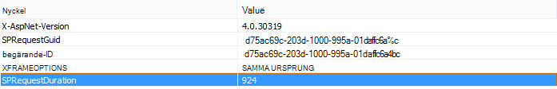
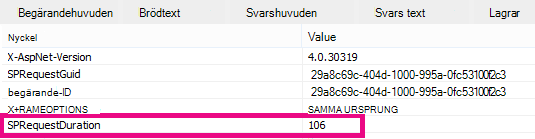

# Använda webbdel för innehållssökning i stället för webbdel för innehållsfråga för att förbättra prestanda SharePoint Online

I den här artikeln beskrivs hur du kan öka prestanda genom att ersätta webbdelen för innehållsfråga med webbdelen för innehållssökning i SharePoint Server 2013 och SharePoint Online.
  
En av de mest kraftfulla nya funktionerna i SharePoint Server 2013 och SharePoint Online är webbdel för innehållssökning (CSWP). Den här webbdelen använder sökindexet för att snabbt hämta resultat som visas för användaren. Använd webbdelen Innehållssökning i stället för webbdel för innehållsfråga (CQWP) på dina sidor för att förbättra prestanda för användarna.
  
Genom att använda webbdel för innehållssökning i över en webbdel för innehållsfråga får du nästan alltid avsevärt bättre prestanda vid sidinläsning SharePoint Online. Det krävs lite ytterligare konfiguration för att få fram rätt fråga, men vinsterna är högre prestanda och nöjdare användare.
  
## Jämförelse av de prestanda som ger dig när du använder webbdel för innehållssökning i stället för webbdel för innehållsfråga

Följande exempel visar de relativa prestandaförbättringar som du kan få när du använder en webbdel för innehållssökning i stället för en webbdel för innehållsfråga. Effekterna blir mer uppenbara med en komplex webbplatsstruktur och mycket breda innehållsfrågor.
  
Den här exempelwebbplatsen har följande egenskaper:
  
- Åtta nivåer med underwebbplatser.
    
- Listor med den anpassade innehållstypen "frukt".
    
- I webbdelen är innehållsfrågan bred, vilket returnerar alla objekt med innehållstypen "frukt".
    
- I exemplet används bara 50 objekt på de 8 webbplatserna. Effekterna blir ännu mer markanta för webbplatser med mer innehåll.
    
Här visas en skärmbild av resultaten från webbdelen för innehållsfråga.
  

  
I Internet Explorer använder du fliken **Nätverk** för F12-utvecklingsverktygen för att titta på informationen för svarshuvudet. På följande skärmbild är värdet för **SPRequestDuration** för den här sidinläsningen 924 millisekunder. 
  

  
 **SPRequestDuration** anger mängden arbete som utförs på servern för att förbereda sidan. Genom att byta webbdelar fråga mot innehåll genom sökning webbdelar avsevärt minskar tiden det tar att återge sidan. Som jämförelse har en sida med en motsvarande webbdel för innehållssökning, som returnerar samma antal resultat, ett **SPRequestDuration-värde** på 106 millisekunder, som visas på skärmbilden: 
  

  
## Lägga till en webbdel för innehållssökning i SharePoint Online

Att lägga till en webbdel för innehållssökning liknar en vanlig webbdel för innehållsfråga. Se avsnittet *"Lägga till en webbdel för innehållssökning"* i [Konfigurera en webbdel för innehållssökning i SharePoint](https://support.office.com/article/Configure-a-Content-Search-Web-Part-in-SharePoint-0dc16de1-dbe4-462b-babb-bf8338c36c9a).
  
## Skapa rätt sökfråga för webbdelen Innehållssökning

När du har lagt till en webbdel för innehållssökning kan du förfina sökningen och returnera de objekt du vill ha. Detaljerade anvisningar om hur du gör detta finns i avsnittet *"Visa* innehåll genom att konfigurera en avancerad fråga i en webbdel för innehållssökning" i Konfigurera en webbdel för innehållssökning [i SharePoint.](https://support.office.com/article/Configure-a-Content-Search-Web-Part-in-SharePoint-0dc16de1-dbe4-462b-babb-bf8338c36c9a)
  
## Verktyg för att skapa och testa frågor

Ett verktyg för att skapa och testa komplexa frågor finns i [Sökfrågeverktyget på](https://sp2013searchtool.codeplex.com/) Codeplex. 
  

