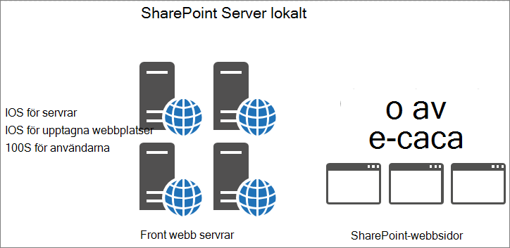
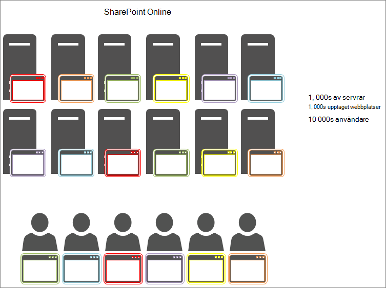

# Använda objektcachen med SharePoint Online

I den här artikeln förklaras skillnaden mellan att använda objektcachen i SharePoint Server 2013 lokalt och SharePoint Online.
  
Det finns betydande negativa konsekvenser för objekt-cachen i distributionen av SharePoint Online. Alla beroenden för objekt-cachen i SharePoint Online minskar tillförlitligheten hos din sida. 
  
## Så fungerar SharePoint Online-och SharePoint Server 2013-objektcache

När SharePoint Server 2013 hanteras lokalt har kunden privata front webb servrar som är värdar för objektcachen. Det innebär att cacheminnet bevaras till en kund och begränsas bara av hur mycket minne som är tillgängligt och tilldelat objektcachen. Eftersom endast en kund betjänas i det lokala scenariot har front webb servrarna vanligt vis användare som skapar förfrågningar till samma webbplatser. Det innebär att cacheminnet blir snabbt och återstår att använda i listan med frågeresultaten och SharePoint-objekt som användarna begär med jämna mellanrum.
  

  
Därför förbättras den andra gången en användare besöker en sida. Efter minst fyra belastningar på samma sida lagras sidan på alla front webb servrar.
  
I SharePoint Online finns det däremot många fler servrar men också många fler webbplatser. Varje användare kan ansluta till en annan front webb server utan cacheminnet. Eller så fyller cacheminnet för en server, men nästa användare till front webb servern begär en sida från en annan webbplats. Eller även om nästa användare begär samma sida som på ett tidigare besök är de belastningsutjämnade till en annan front webb server som inte har den sidan i cacheminnet. I det här fallet hjälper cachelagring inte till användarna alls.
  
I bilden nedan representerar varje prick en sida som en användare begär och var den cachelagrade. Olika färger är olika kunder som gör gemensam användning av SaaS infrastruktur.
  

  
Som du ser i diagrammet är sannolikheten för att en viss användare ska kunna trycka på en server med den cachelagrade versionen av sidan slank. På grund av det stora genomflödet och det faktum att servrarna delas mellan många platser är cacheminnet inte senaste länge eftersom det bara finns så mycket utrymme för cachelagring.
  
Av alla de här anledningarna är det inte ett effektivt sätt att förlita dig på användare att få cachelagrade objekt i SharePoint Online.
  
## Vad kan jag göra om det inte går att använda objektcachen för att förbättra prestanda i SharePoint Online?

Eftersom du inte kan använda cachelagring i SharePoint Online bör du utvärdera alternativa design metoder för SharePoint-anpassningar som använder objektcachen. Detta innebär att du använder olika metoder för prestanda problem som inte förlitar sig på objektcache för att få bra resultat för användarna. Detta beskrivs i några av de andra artiklarna i denna serie och inkluderar:
  
- [Navigerings alternativ för SharePoint Online](navigation-options-for-sharepoint-online.md)
    
- [För minskning och buntar i SharePoint Online](minification-and-bundling-in-sharepoint-online.md)
    
- [Använda Office 365-innehålls leverans nätverk (CDN) med SharePoint Online](use-microsoft-365-cdn-with-spo.md)
    
- [Fördröj inläsning av bilder och Java Script i SharePoint Online](delay-loading-images-and-javascript-in-sharepoint-online.md)
    

