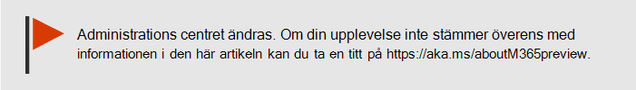
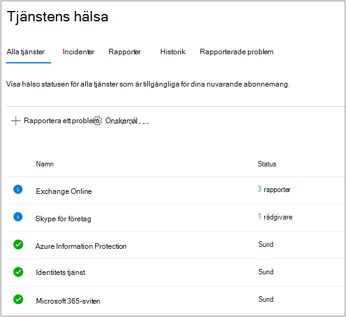
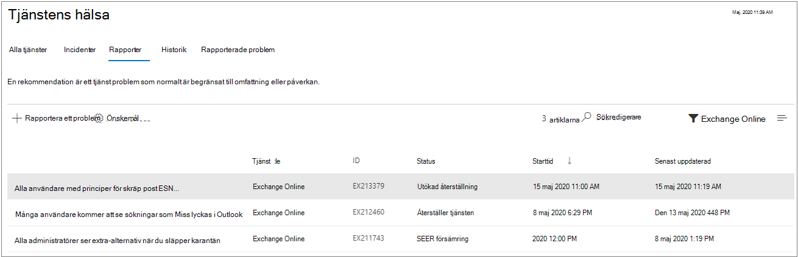
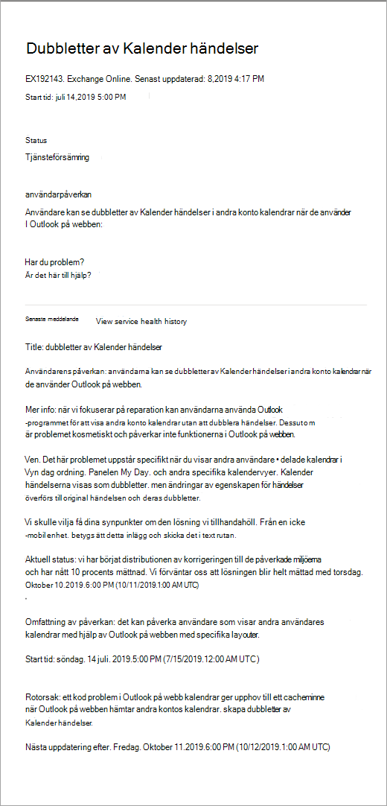
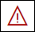
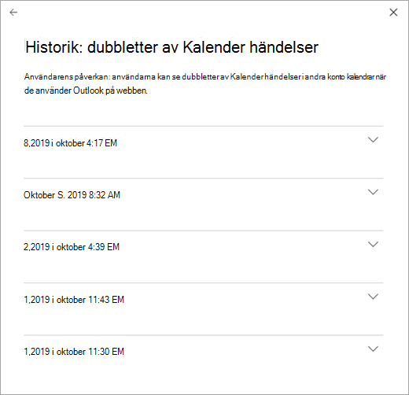

# Så här kontrollerar du Microsoft 365-tjänstens hälsaHow to check Microsoft 365 service health

Du kan se tillståndet för dina Microsoft-tjänster, inklusive Office på webben, Yammer, Microsoft Dynamics CRM och moln tjänster för mobila enheter, på sidan **tjänstens hälsa** i [administrations centret för Microsoft 365](https://go.microsoft.com/fwlink/p/?linkid=2024339).You can view the health of your Microsoft services, including Office on the web, Yammer, Microsoft Dynamics CRM, and mobile device management cloud services, on the **Service health** page in the [Microsoft 365 admin center](https://go.microsoft.com/fwlink/p/?linkid=2024339). Om du har problem med en molnbaserad tjänst kan du kontrollera tjänstens hälsa för att ta reda på om det är ett känt problem där en lösning är på gång innan du ringer supporten eller ägnar tid åt felsökning.If you are experiencing problems with a cloud service, you can check the service health to determine whether this is a known issue with a resolution in progress before you call support or spend time troubleshooting.

Om det inte går att logga in i administrations centret kan du använda [sidan tjänst status](https://status.office365.com) för att kontrol lera kända problem som hindrar dig från att logga in på din klient organisation.If you are unable to sign in to the admin center, you can use the [service status page](https://status.office365.com) to check for known issues preventing you from logging into your tenant.  Du kan också anmäla dig till oss på [@MSFT365status](https://twitter.com/MSFT365Status) på Twitter för att visa information om vissa händelser.Also sign up to follow us at [@MSFT365status](https://twitter.com/MSFT365Status) on Twitter to see information on certain events.

  
### Kontrollera tjänstens hälsaHow to check service health

1. Gå till administrations centret för Microsoft 365 på [https://admin.microsoft.com](https://go.microsoft.com/fwlink/p/?linkid=2024339) och logga in med ett administratörs konto.Go to the Microsoft 365 admin center at [https://admin.microsoft.com](https://go.microsoft.com/fwlink/p/?linkid=2024339), and sign in with an admin account.

    > [!NOTE]
    > Personer som har tilldelats rollen som global administratör eller tjänstadministratör kan visa tjänstens hälsa.People who are assigned the global admin or service administrator role can view service health. För att tillåta Exchange-, SharePoint- och Skype för företag-administratörer att visa tjänstens hälsa, måste de också tilldelas tjänstadministratörsrollen.To allow Exchange, SharePoint, and Skype for Business admins to view service health, they must also be assigned the Service admin role. Mer information om roller som kan visa tjänstens hälsa finns i [om administratörs roller](https://docs.microsoft.com/microsoft-365/admin/add-users/about-admin-roles?view=o365-worldwide&preserve-view=true#roles-available-in-the-microsoft-365-admin-center).For more information about roles that can view service health, see [About admin roles](https://docs.microsoft.com/microsoft-365/admin/add-users/about-admin-roles?view=o365-worldwide&preserve-view=true#roles-available-in-the-microsoft-365-admin-center).
  
2. Om du inte använder det nya administrations centret väljer du alternativet **testa det nya administrations centret** i det övre högra hörnet på **Start** sidan.If you are not using the new admin center, on the **Home** page, select the **Try the new admin center** toggle in the upper-right corner.

3. Om du vill visa tjänstens status går du till **hälso** tillstånd i administrations centret  >  **Service health** eller väljer **tjänstens hälso** kort på **Start instrument panelen**.To view service health, in the admin center, go to **Health** > **Service health** , or select the **Service health** card on the **Home dashboard**. Instrument panels kortet visar om det finns ett aktivt tjänst problem och länkar till sidan för detaljerad **tjänst kontroll** .The dashboard card indicates whether there is an active service issue and links to the detailed **Service health** page.
  
4. På sidan **tjänstens hälsa** visas hälso statusen för varje moln tjänst i ett tabell format.On the **Service health** page, the health state of each cloud service is shown in a table format.

   

Fliken **alla tjänster** (standardvyn) visar alla tjänster och deras aktuella hälso status.The **All services** tab (the default view) shows all services and their current health state. En ikon och kolumnen **status** visar statusen för varje tjänst.An icon and the **Status** column indicate the state of each service. 

Om du vill filtrera vyn till tjänster som för närvarande har en olycka väljer du fliken **tillbud** högst upp på sidan.To filter your view to services currently experiencing an incident, select the **Incidents** tab at the top of the page. Om du väljer fliken **rådgivare** visas bara tjänster som redan har ett råd.Selecting the **Advisories** tab will show only services that currently have an advisory posted. 

På fliken **Historik** visas historiken över de incidenter och rådgivare som har åtgärd ATS.The **History** tab shows the history of incidents and advisories that have been resolved.

Om du upplever ett problem med en Microsoft 365-tjänst och inte ser den på sidan **tjänstens hälsa** kan du berätta om den genom att välja **rapportera ett problem** och fylla i den korta formen.If you're experiencing an issue with a Microsoft 365 service and you don’t see it listed on the **Service health** page, tell us about it by selecting **Report an issue** , and completing the short form. Vi kommer att titta på relaterade data och rapporter från andra organisationer för att se hur omfattande problemet är, och om det kom från vår tjänst.We’ll look at related data and reports from other organizations to see how widespread the issue is, and if it originated with our service. Om så är fallet lägger vi till det som ett nytt tillbud eller råd på sidan **tjänstens hälsa** , där du kan spåra dess upplösning.If it did, we’ll add it as a new incident or advisory on the **Service health** page, where you can track its resolution. Om det inte visas i listan i cirka 30 minuter bör du kontakta supporten för att lösa problemet.If you don’t see it appear on the list within about 30 minutes, consider contacting support to resolve the issue.

Om du vill anpassa vilka tjänster som visas på instrument **panelen väljer du**  >  **anpassad vy** och avmarkerar kryss rutorna för de tjänster som du vill filtrera bort från din kontrollpanelflik för tjänste status.To customize your view of which services show up on the dashboard, select **Preferences** > **Custom view** ,  and clear the check boxes for the services you want to filter out of your Service health dashboard view. Kontrol lera att kryss rutan är markerad för varje tjänst som du vill övervaka.Make sure that the check box is selected for each service that you want to monitor.    

För att registrera dig för e-postaviseringar om nya incidenter som påverkar klient organisationens och status ändringar för en aktiv incident, väljer du **Inställningar** för  >  **e-post** , klickar på **skicka mig Heath meddelanden i e-post** och anger sedan:To sign up for email notifications of new incidents that affect your tenant and status changes for an active incident, select **Preferences** > **Email** , click **Send me service heath notifications in email** , and then specify:

- Upp till två e-postadresser.Up to two email addresses.
- Om du vill få aviseringar eller rådgivareWhether you want notifications for incidents or advisories
- Tjänster som du vill meddelaThe services for which you want notification

> [!NOTE]
> Varje administratör kan ha sina inställningar inställda och ovanstående gräns för två e-postadresser är per administratörs konto.Each admin can have their Preferences set and the above limit of two email address is per admin account.

> [!TIP]
> Du kan också använda [Microsoft 365 admin-appen](https://go.microsoft.com/fwlink/p/?linkid=627216) på din mobila enhet för att Visa tjänstens hälsa, vilket är ett bra sätt att fortsätta med push-meddelanden.You can also use the [Microsoft 365 Admin app](https://go.microsoft.com/fwlink/p/?linkid=627216) on your mobile device to view Service health, which is a great way to stay current with push notifications. 
  
### Visa information om publicerad tjänsthälsaView details of posted service health

I vyn **alla tjänster** visas en sammanfattningsvy över rådgivare eller händelser när du väljer tjänstens status.On the **All services** view, selecting the service status will open a summary view of advisories or incidents.
  

Sammanfattningen av rådgivningen eller incidenten innehåller följande information:The advisory or incident summary provides the following information:

- **Rubrik** – en sammanfattning av problemet.**Title** - A summary of the problem.
- **Tjänst** -namnet på den berörda tjänsten.**Service** - The name of the affected service.
- **ID** -ett numeriskt ID för problemet.**ID** - A numeric identifier for the problem.
- **Status** – hur problemet påverkar tjänsten.**Status** - How this problem affects the service.
- **Start tid** -tiden när problemet påbörjades.**Start time** - The time when the issue started.
- **Uppdaterades senast** – den senaste gången tjänstens hälso meddelande uppdaterades.**Last updated** - The last time that the service health message was updated. Vi skickar vanliga meddelanden för att informera dig om att vi håller på att genomföra en lösning.We post frequent messages to let you know the progress that we're making in applying a solution.

Välj ärendets rubrik om du vill visa ärende detalj sidan som visar mer information om problemet, inklusive [historiken](#history) för alla meddelanden som publicerats medan vi arbetar med en lösning.Select the issue title to see the issue detail page, which shows more information about the issue, including the [history](#history) of all messages posted while we work on a solution.

### Översätta information om tjänstens hälsaTranslate service health details

Eftersom förklaringar om tjänstens hälsa publiceras i realtid översätts de inte automatiskt till ditt språk, och information om en tjänsthändelse finns endast på engelska. Följ de här stegen om du vill översätta en förklaring:Because service health explanations are posted in real-time, they are not automatically translated to your language and the details of a service event are in English only. To translate the explanation, follow these steps:
  
1. Gå till [Translator](https://www.bing.com/translator/).Go to [Translator](https://www.bing.com/translator/).

2. På sidan **Tjänstens hälsa** väljer du en händelse eller rådgivning. Kopiera texten om problemet under **Visa information**.On the **Service health** page, select an incident or advisory. Under **Show details** , copy the text about the issue.

3. Klistra in texten i Translator och välj **Översätt**.In Translator, paste the text and choose **Translate**.

### DefinitionerDefinitions

I de flesta avseenden kommer tjänsterna att visas som friska med ingen mer information.Most of the time, services will appear as healthy with no further information. Om ett problem inträffar i tjänsten identifieras problemet som rådgivning eller incident och aktuell status visas.When a service is having a problem, the issue is identified as either an advisory or an incident and shows a current status.
  
> [!TIP]
> Planerade underhållshändelser visas inte i tjänstens hälsa.Planned maintenance events aren't shown in service health. Du kan spåra planerade underhållshändelser genom att hålla dig uppdaterad i **Meddelandecenter**.You can track planned maintenance events by staying up to date with the **Message center**. Filtrera på meddelanden som kategoriserats som Planera för ändring för att ta reda på när ändringen ska ske, dess påverkan och vilka förberedelser som bör vidtas.Filter to messages categorized as Plan for change to find out when the change is going to happen, its effect, and how to prepare for it. Se [meddelande Center i Microsoft 365](https://support.office.com/article/38fb3333-bfcc-4340-a37b-deda509c2093) för mer information.See [Message center in Microsoft 365](https://support.office.com/article/38fb3333-bfcc-4340-a37b-deda509c2093) for more details.
  
### Incidenter och rådgivningIncidents and advisories

| IkonenIcon | BeskrivningDescription |
|:-----|:-----|
||Om ikonen för rådgivning visas för en tjänst betyder det att vi är medvetna om att ett problem påverkar vissa användare, men att tjänsten fortfarande är tillgänglig. Rådgivning innebär att det ofta finns en lösning på problemet, och problemet kan vara tillfälligt eller är begränsat i omfattning och påverkan på användare.If a service has an advisory shown, we are aware of a problem that is affecting some users, but the service is still available. In an advisory, there is often a workaround to the problem and the problem may be intermittent or is limited in scope and user impact.    |
||Om en aktiv incident visas för tjänsten är det ett kritiskt problem, vilket innebär att tjänsten eller en viktig funktion i tjänsten inte är tillgänglig. Användare kanske inte kan skicka och ta emot e-post eller inte kan logga in. Händelser har betydande påverkan på användarna. Om en händelse pågår tillhandahåller vi uppdateringar om undersökningen, åtgärder och bekräftar lösningen på hälsoinstrumentpanelen.If a service has an active incident shown, it's a critical issue and the service or a major function of the service is unavailable. For example, users may be unable to send and receive email or unable to sign-in. Incidents will have noticeable impact to users. When there is an incident in progress, we will provide updates regarding the investigation, mitigation efforts, and confirmation of resolution in the Service health dashboard.    |

### StatusdefinitionerStatus definitions

| StatusStatus | DefinitionDefinition |
|:-----|:-----|
|**Undersöker****Investigating** | Vi är medvetna om ett potentiellt problem och samlar mer information om vad som händer och dess påverkan.We're aware of a potential issue and are gathering more information about what's going on and the scope of impact. |
|**Tjänsteförsämring****Service degradation** | Vi har bekräftat att det finns ett problem som kan påverka användningen av en tjänst eller funktion. Den här statusen kan visas om till exempel en tjänst fungerar långsammare än vanligt, det sker oregelbundna avbrott eller om en funktion inte fungerar.We've confirmed that there is an issue that may affect use of a service or feature. You might see this status if a service is performing more slowly than usual, there are intermittent interruptions, or if a feature isn't working, for example. |
|**Tjänsteavbrott****Service interruption** | Denna status visas om vi anser att ett problem påverkar möjligheten för användarna att använda tjänsten. I det här fallet är problemet betydande och kan upprepas konsekvent.You'll see this status if we determine that an issue affects the ability for users to access the service. In this case, the issue is significant and can be reproduced consistently. |
|**Återställer tjänsten****Restoring service** | Orsaken till problemet har hittats, vi vet vilka korrigerande åtgärder som ska göras och arbetar med att få tillbaka tjänsten i ett felfritt tillstånd.The cause of the issue has been identified, we know what corrective action to take, and are in the process of bringing the service back to a healthy state. |
|**Utökad återställning****Extended recovery** | Denna status anger att korrigerande åtgärder pågår för att återställa tjänsten för de flesta användare, men att det tar ett tag att nå alla berörda system. Du kan också få den här statusen om vi har gjort en tillfällig lösning för att minska påverkan medan vi jobbar på en permanent korrigering.This status indicates that corrective action is in progress to restore service to most users but will take some time to reach all the affected systems. You might also see this status if we've made a temporary fix to reduce impact while we wait to apply a permanent fix. |
|**Undersökning uppskjuten****Investigation suspended** | Du ser den här statusen om vår detaljerade undersökning av ett potentiellt problem gör att vi måste begära ytterligare information från kunder för att kunna utvidga undersökningen. Om du behöver vidta några åtgärder meddelar vi dig vilka data eller loggar vi behöver.If our detailed investigation of a potential issue results in a request for additional information from customers to allow us to investigate further, you'll see this status. If we need you to act, we'll let you know what data or logs we need. |
|**Tjänsten har återställts****Service restored** | Vi har bekräftat att korrigerande åtgärder har löst problemet och att tjänsten har återställts till ett felfritt läge. Om du vill ta reda på vad som var fel kan du visa information om problemet.We've confirmed that corrective action has resolved the underlying problem and the service has been restored to a healthy state. To find out what went wrong, view the issue details. |
|**Falsk positiv****False positive** | Efter en detaljerad undersökning har vi bekräftat att tjänsten är felfri och fungerar som den ska.After a detailed investigation, we’ve confirmed the service is healthy and operating as designed. Ingen inverkan på tjänsten observerades eller orsaken till att incidenten kom utanför tjänsten.No impact to the service was observed or the cause of the incident originated outside of the service. |
|**Rapport om efterhand efter tillbud****Post-incident report published** | Vi har publicerat en rapport om att få ett specifikt problem som innehåller information om Rotors orsak och nästa steg för att säkerställa ett liknande problem.We’ve published a Post Incident Report for a specific issue that includes root cause information and next steps to ensure a similar issue doesn’t reoccur. |

### HistorikHistory

Tjänstens tillstånd gör att du kan se aktuell hälso status och se historiken för alla tjänste rådgivare och händelser som påverkat din klient organisation under de senaste 30 dagarna.Service health lets you look at current health status and view the history of any service advisories and incidents that have affected your tenant in the past 30 days. Om du vill visa den senaste statusen för alla tjänster väljer du **Visa historik** på sidan ärende information.To view the past health of all services, select **View history** on the issue detail page.
  

  
En lista över alla meddelanden om tjänstens hälsa som publicerats inom den valda tidsramen visas enligt nedan:A list of all service health messages posted in the selected timeframe is displayed, as shown below:
  

  
Expandera en rad för att visa mer information om problemet.Expand any row to view more details about the issue.
  
För mer information om vårt engagemang för drift tid, se [transparenta åtgärder från Microsoft 365](https://go.microsoft.com/fwlink/?linkid=848695).For more information about our commitment to uptime, see [Transparent operations from Microsoft 365](https://go.microsoft.com/fwlink/?linkid=848695).

## Relaterade ämnenRelated topics

[Aktivitets rapporter i administrations centret](https://support.office.com/article/0d6dfb17-8582-4172-a9a9-aed798150263) 
 för Microsoft 365 [Inställningar för meddelande Center](https://docs.microsoft.com/microsoft-365/admin/manage/message-center?view=o365-worldwide&preserve-view=true#preferences11)[Activity Reports in the Microsoft 365 admin center](https://support.office.com/article/0d6dfb17-8582-4172-a9a9-aed798150263)
[Message center Preferences](https://docs.microsoft.com/microsoft-365/admin/manage/message-center?view=o365-worldwide&preserve-view=true#preferences11)
