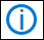

# Så här kontrollerar du Microsoft 365-tjänstens hälsa

Du kan se tillståndet för dina Microsoft-tjänster, inklusive Office på webben, Yammer, Microsoft Dynamics CRM och moln tjänster för mobila enheter, på sidan **tjänstens hälsa** i [administrations centret för Microsoft 365](https://go.microsoft.com/fwlink/p/?linkid=2024339). Om du har problem med en molnbaserad tjänst kan du kontrollera tjänstens hälsa för att ta reda på om det är ett känt problem där en lösning är på gång innan du ringer supporten eller ägnar tid åt felsökning.

Om det inte går att logga in på service portalen kan du använda [sidan tjänst status](https://status.office365.com) för att kontrol lera kända problem som hindrar dig från att logga in på din klient organisation.
  
### Kontrollera tjänstens hälsa

1. Gå till administrations centret för Microsoft 365 på [https://admin.microsoft.com](https://go.microsoft.com/fwlink/p/?linkid=2024339) och logga in med ett administratörs konto.

    > [!NOTE]
    > Personer som har tilldelats rollen som global administratör eller tjänstadministratör kan visa tjänstens hälsa. För att tillåta Exchange-, SharePoint- och Skype för företag-administratörer att visa tjänstens hälsa, måste de också tilldelas tjänstadministratörsrollen. Mer information om roller som kan visa tjänstens hälsa finns i [om administratörs roller](https://docs.microsoft.com/microsoft-365/admin/add-users/about-admin-roles?view=o365-worldwide&preserve-view=true#roles-available-in-the-microsoft-365-admin-center).
  
2. Om du inte använder det nya administrations centret väljer du alternativet **testa det nya administrations centret** i det övre högra hörnet på **Start** sidan.

3. Om du vill visa tjänstens status går du till **hälso**tillstånd i administrations centret  >  **Service health**eller väljer **tjänstens hälso** kort på **Start instrument panelen**. Instrument panels kortet visar om det finns ett aktivt tjänst problem och länkar till sidan för detaljerad **tjänst kontroll** .
  
4. På sidan **tjänstens hälsa** visas hälso statusen för varje moln tjänst i ett tabell format.

   

Fliken **alla tjänster** (standardvyn) visar alla tjänster och deras aktuella hälso status. En ikon och kolumnen **status** visar statusen för varje tjänst. 

Om du vill filtrera vyn till tjänster som för närvarande har en olycka väljer du fliken **tillbud** högst upp på sidan. Om du väljer fliken **rådgivare** visas bara tjänster som redan har ett råd. 

På fliken **Historik** visas historiken över de incidenter och rådgivare som har åtgärd ATS.

Om du upplever ett problem med en Microsoft 365-tjänst och inte ser den på sidan **tjänstens hälsa** kan du berätta om den genom att välja **rapportera ett problem**och fylla i den korta formen. Vi kommer att titta på relaterade data och rapporter från andra organisationer för att se hur omfattande problemet är, och om det kom från vår tjänst. Om så är fallet lägger vi till det som ett nytt tillbud eller råd på sidan **tjänstens hälsa** , där du kan spåra dess upplösning. Om det inte visas i listan i cirka 30 minuter bör du kontakta supporten för att lösa problemet.

Om du vill anpassa vilka tjänster som visas på instrument **panelen väljer du**  >  **anpassad vy**och avmarkerar kryss rutorna för de tjänster som du vill filtrera bort från din kontrollpanelflik för tjänste status. Kontrol lera att kryss rutan är markerad för varje tjänst som du vill övervaka.    

För att registrera dig för e-postaviseringar om nya incidenter som påverkar klient organisationens och status ändringar för en aktiv incident, väljer du **Inställningar**för  >  **e-post**, klickar på **skicka mig Heath meddelanden i e-post**och anger sedan:

- Upp till två e-postadresser.
- Om du vill få aviseringar eller rådgivare
- Tjänster som du vill meddela

> [!NOTE]
> Varje administratör kan ha sina inställningar inställda och ovanstående gräns för två e-postadresser är per administratörs konto.

> [!TIP]
> Du kan också använda [Microsoft 365 admin-appen](https://go.microsoft.com/fwlink/p/?linkid=627216) på din mobila enhet för att Visa tjänstens hälsa, vilket är ett bra sätt att fortsätta med push-meddelanden. 
  
### Visa information om publicerad tjänsthälsa

I vyn **alla tjänster** visas en sammanfattningsvy över rådgivare eller händelser när du väljer tjänstens status.
  

Sammanfattningen av rådgivningen eller incidenten innehåller följande information:

- **Rubrik** – en sammanfattning av problemet.
- **Tjänst** -namnet på den berörda tjänsten.
- **ID** -ett numeriskt ID för problemet.
- **Status** – hur problemet påverkar tjänsten.
- **Start tid** -tiden när problemet påbörjades.
- **Uppdaterades senast** – den senaste gången tjänstens hälso meddelande uppdaterades. Vi skickar vanliga meddelanden för att informera dig om att vi håller på att genomföra en lösning.

Välj ärendets rubrik om du vill visa ärende detalj sidan som visar mer information om problemet, inklusive [historiken](#history) för alla meddelanden som publicerats medan vi arbetar med en lösning.

### Översätta information om tjänstens hälsa

Eftersom förklaringar om tjänstens hälsa publiceras i realtid översätts de inte automatiskt till ditt språk, och information om en tjänsthändelse finns endast på engelska. Följ de här stegen om du vill översätta en förklaring:
  
1. Gå till [Translator](https://www.bing.com/translator/).

2. På sidan **Tjänstens hälsa** väljer du en händelse eller rådgivning. Kopiera texten om problemet under **Visa information**.

3. Klistra in texten i Translator och välj **Översätt**.

### Definitioner

I de flesta avseenden kommer tjänsterna att visas som friska med ingen mer information. Om ett problem inträffar i tjänsten identifieras problemet som rådgivning eller incident och aktuell status visas.
  
> [!TIP]
> Planerade underhållshändelser visas inte i tjänstens hälsa. Du kan spåra planerade underhållshändelser genom att hålla dig uppdaterad i **Meddelandecenter**. Filtrera på meddelanden som kategoriserats som Planera för ändring för att ta reda på när ändringen ska ske, dess påverkan och vilka förberedelser som bör vidtas. Se [meddelande Center i Microsoft 365](https://support.office.com/article/38fb3333-bfcc-4340-a37b-deda509c2093) för mer information.
  
### Incidenter och rådgivning

| Ikonen | Beskrivning |
|:-----|:-----|
||Om ikonen för rådgivning visas för en tjänst betyder det att vi är medvetna om att ett problem påverkar vissa användare, men att tjänsten fortfarande är tillgänglig. Rådgivning innebär att det ofta finns en lösning på problemet, och problemet kan vara tillfälligt eller är begränsat i omfattning och påverkan på användare.    |
||Om en aktiv incident visas för tjänsten är det ett kritiskt problem, vilket innebär att tjänsten eller en viktig funktion i tjänsten inte är tillgänglig. Användare kanske inte kan skicka och ta emot e-post eller inte kan logga in. Händelser har betydande påverkan på användarna. Om en händelse pågår tillhandahåller vi uppdateringar om undersökningen, åtgärder och bekräftar lösningen på hälsoinstrumentpanelen.    |

### Statusdefinitioner

| Status | Definition |
|:-----|:-----|
|**Undersöker** | Vi är medvetna om ett potentiellt problem och samlar mer information om vad som händer och dess påverkan. |
|**Tjänsteförsämring** | Vi har bekräftat att det finns ett problem som kan påverka användningen av en tjänst eller funktion. Den här statusen kan visas om till exempel en tjänst fungerar långsammare än vanligt, det sker oregelbundna avbrott eller om en funktion inte fungerar. |
|**Tjänsteavbrott** | Denna status visas om vi anser att ett problem påverkar möjligheten för användarna att använda tjänsten. I det här fallet är problemet betydande och kan upprepas konsekvent. |
|**Återställer tjänsten** | Orsaken till problemet har hittats, vi vet vilka korrigerande åtgärder som ska göras och arbetar med att få tillbaka tjänsten i ett felfritt tillstånd. |
|**Utökad återställning** | Denna status anger att korrigerande åtgärder pågår för att återställa tjänsten för de flesta användare, men att det tar ett tag att nå alla berörda system. Du kan också få den här statusen om vi har gjort en tillfällig lösning för att minska påverkan medan vi jobbar på en permanent korrigering. |
|**Undersökning uppskjuten** | Du ser den här statusen om vår detaljerade undersökning av ett potentiellt problem gör att vi måste begära ytterligare information från kunder för att kunna utvidga undersökningen. Om du behöver vidta några åtgärder meddelar vi dig vilka data eller loggar vi behöver. |
|**Tjänsten har återställts** | Vi har bekräftat att korrigerande åtgärder har löst problemet och att tjänsten har återställts till ett felfritt läge. Om du vill ta reda på vad som var fel kan du visa information om problemet. |
|**Falsk positiv** | Efter en detaljerad undersökning har vi bekräftat att tjänsten är felfri och fungerar som den ska. Ingen inverkan på tjänsten observerades eller orsaken till att incidenten kom utanför tjänsten. |
|**Rapport om efterhand efter tillbud** | Vi har publicerat en rapport om att få ett specifikt problem som innehåller information om Rotors orsak och nästa steg för att säkerställa ett liknande problem. |

### Historik

Tjänstens tillstånd gör att du kan se aktuell hälso status och se historiken för alla tjänste rådgivare och händelser som påverkat din klient organisation under de senaste 30 dagarna. Om du vill visa den senaste statusen för alla tjänster väljer du **Visa historik** på sidan ärende information.
  

  
En lista över alla meddelanden om tjänstens hälsa som publicerats inom den valda tidsramen visas enligt nedan:
  

  
Expandera en rad för att visa mer information om problemet.
  
För mer information om vårt engagemang för drift tid, se [transparenta åtgärder från Microsoft 365](https://go.microsoft.com/fwlink/?linkid=848695).

## Relaterade ämnen

[Aktivitets rapporter i administrations centret](https://support.office.com/article/0d6dfb17-8582-4172-a9a9-aed798150263) 
 för Microsoft 365 [Inställningar för meddelande Center](https://docs.microsoft.com/microsoft-365/admin/manage/message-center?view=o365-worldwide&preserve-view=true#preferences11)
