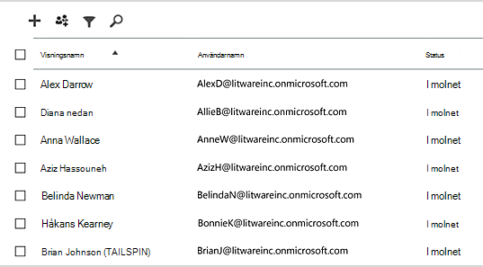
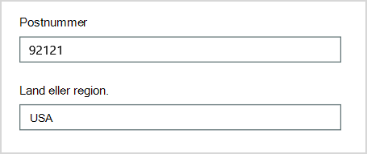
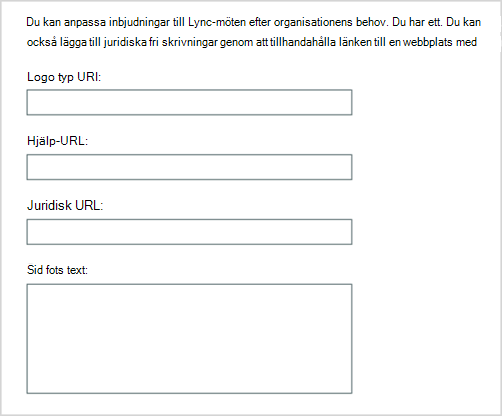
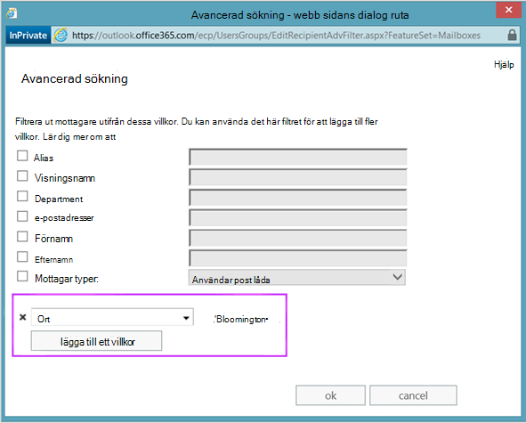
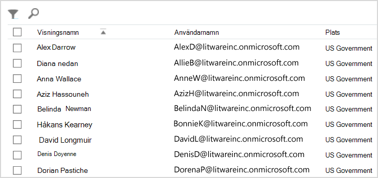
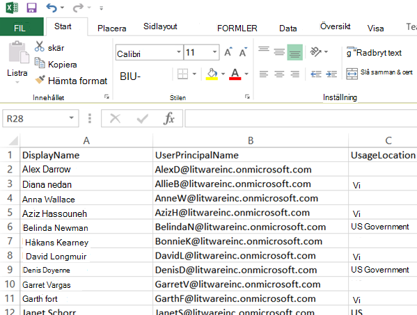
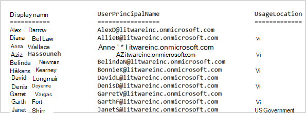

# <a name="why-you-need-to-use-powershell-for-microsoft-365"></a>Varför du behöver använda PowerShell för Microsoft 365

*Denna artikel gäller för både Microsoft 365 Enterprise och Office 365 Enterprise.*

Med Administrationscenter för Microsoft 365 kan du hantera dina Microsoft 365 och licenser. Du kan också hantera dina Microsoft 365 tjänster, till exempel Exchange Online, Teams och SharePoint Online. Om du i stället använder PowerShell för att hantera de här tjänsterna kan du och dra nytta av kommandorads- och skriptspråkmiljön för hastighet, automatisering och ytterligare funktioner.

Den här artikeln visar hur du använder PowerShell för att Microsoft 365 till:

- Visa ytterligare information som du inte kan se i Administrationscenter för Microsoft 365

- Konfigurera funktioner och inställningar som endast är möjliga med PowerShell

- Massåtgärder

- Filtrera data

- Skriva ut eller spara data

- Hantera mellan tjänster

Kom ihåg att PowerShell för Microsoft 365 är en uppsättning moduler för Windows PowerShell, som är en kommandoradsmiljö för Windows-baserade tjänster och plattformar. I den här miljön skapas ett kommandogränssnittsspråk som kan utökas med ytterligare moduler. Det är ett sätt att utföra enkla eller komplexa kommandon eller skript. När du har installerat PowerShell för Microsoft 365-moduler och ansluter till din Microsoft 365-prenumeration kan du till exempel köra följande kommando för att visa alla användarpostlådor för Microsoft Exchange Online:

```powershell
Get-Mailbox
```

Du kan också hämta listan över postlådor med hjälp av Administrationscenter för Microsoft 365 men det är inte enkelt att räkna objekten i alla listor för alla webbplatser för alla dina webbappar.

PowerShell för Microsoft 365 har utformats för att hjälpa dig att hantera Microsoft 365 och inte ersätta Administrationscenter för Microsoft 365. Administratörer måste kunna använda PowerShell för Microsoft 365 eftersom det finns vissa konfigurationsprocedurer som bara kan göras via PowerShell för Microsoft 365 kommandon. I dessa fall behöver du veta hur du:

- Installera PowerShell för Microsoft 365 -moduler (görs bara en gång för varje administratörsdator).

- Anslut prenumerationen på Microsoft 365 (en gång för varje PowerShell-session).

- Samla in den information som behövs för att köra nödvändiga PowerShell för Microsoft 365-kommandon.

- Kör PowerShell för Microsoft 365 kommandon.

När du har lärt dig dessa grundläggande kunskaper behöver du inte lista dina postlådeanvändare med hjälp av **kommandot Hämta** postlåda. Du behöver inte heller förstå hur du skapar ett nytt kommando, som det citerade kommandot tidigare, för att räkna alla objekt i alla listor för alla webbplatser för alla dina webbappar. Microsoft och administratörsgemenskapen kan hjälpa dig med sådana uppgifter vid behov.

## <a name="powershell-for-microsoft-365-can-reveal-information-that-you-cant-see-with-the-microsoft-365-admin-center"></a>PowerShell för Microsoft 365 kan visa information som du inte kan se med Administrationscenter för Microsoft 365

I Administrationscenter för Microsoft 365 finns många användbara uppgifter. Men den visar inte all information som kan Microsoft 365 användare, licenser, postlådor och webbplatser. Här är ett exempel för *användare och grupper* i Administrationscenter för Microsoft 365:



Den här vyn innehåller information som du behöver i många fall. Men det finns tillfällen när du behöver mer. Till exempel Microsoft 365 licensiering (och de Microsoft 365 som är tillgängliga för en användare) beror delvis på användarens geografiska position. Principerna och funktionerna som du kan utöka till en användare som bor i USA kanske inte är desamma som de som du kan utöka till en användare i Indien eller Belgien. Följ dessa steg i Administrationscenter för Microsoft 365 för att avgöra en användares geografiska position:

1. Dubbelklicka på användarens **visningsnamn**.

2. Välj information i visningsfönstret för **användaregenskaper.**

3. Välj ytterligare information i **informationsvisningen.**

4. Bläddra tills du hittar rubriken **Land eller region:**

     

5. Skriv användarens visningsnamn och plats på ett papper eller kopiera och klistra in det i Anteckningar.

Du måste upprepa proceduren för varje användare. Om du har många användare kan det vara omtiga i den här processen. Med PowerShell för Microsoft 365 kan du visa den här informationen för alla dina användare genom att använda följande kommando:

```powershell
Get-AzureADUser | Select DisplayName, UsageLocation
```


>[!Note]
>PowerShell Core stöder inte Microsoft Azure Active Directory-modulen för Windows PowerShell och cmdlets som har *Msol* i sitt namn. Du måste köra dessa cmdlets från Windows PowerShell.
>

Här är ett exempel på resultatet:

```powershell
DisplayName                               UsageLocation
-----------                               -------------
Bonnie Kearney                            GB
Fabrice Canel                             BR
Brian Johnson (TAILSPIN)                  US
Anne Wallace                              US
Alex Darrow                               US
David Longmuir                            BR
```

The interpretation of this PowerShell command is: Get all of the users in the current Microsoft 365 subscription (**Get-AzureADUser**), but only display the name and location for each user **(Select DisplayName, UsageLocation**).

Eftersom PowerShell för Microsoft 365 har stöd för ett kommandogränssnittsspråk kan du ändra informationen som fås med **kommandot Get-AzureADUser** ytterligare. Du kanske till exempel vill sortera de här användarna efter deras plats, gruppera alla brasilianska användare tillsammans, alla USA-användare tillsammans och så vidare. Här är kommandot:

```powershell
Get-AzureADUser | Select DisplayName, UsageLocation | Sort UsageLocation, DisplayName
```

Här är ett exempel på resultatet:

```powershell
DisplayName                                 UsageLocation
-----------                                 -------------
David Longmuir                              BR
Fabrice Canel                               BR
Bonnie Kearney                              GB
Alex Darrow                                 US
Anne Wallace                                US
Brian Johnson (TAILSPIN)                    US
```

The interpretation of this PowerShell command is: Get all the users in the current Microsoft 365 subscription, but only display the name and location for each user and sort them first by their location and then their name (**Sort UsageLocation, DisplayName**).

Du kan också använda ytterligare filtrering. Om du till exempel bara vill se information om användare i Brasilien använder du det här kommandot:

```powershell
Get-AzureADUser | Where {$_.UsageLocation -eq "BR"} | Select DisplayName, UsageLocation
```

Här är ett exempel på resultatet:

```powershell
DisplayName                                           UsageLocation
-----------                                           -------------
David Longmuir                                        BR
Fabrice Canel                                         BR
```

The interpretation of this PowerShell command is: Get all the users in the current Microsoft 365 subscription whose location is Brazil (**Where {$ \_ . Användningsplats -eq "BR"}**) och visa sedan namn och plats för varje användare.

 **En anmärkning om stora domäner**

Om du har en stor domän med tusentals användare kan det leda till begränsning genom att prova några av exemplen som visas i den här artikeln. Baserat på faktorer som att beräkna ström och tillgänglig nätverksbandbredd kanske du försöker göra för mycket på en gång. Stora organisationer kanske vill dela upp några av dessa PowerShell-åtgärder i två kommandon.

Följande kommando returnerar till exempel alla användarkonton och visar namn och plats för varje konto:

```powershell
Get-AzureADUser | Select DisplayName, UsageLocation
```

Det fungerar bra för mindre domäner. Men i en stor organisation kanske du vill dela upp åtgärden i två kommandon: ett kommando för att lagra användarkontoinformationen i en variabel och en annan för att visa den information som behövs. Här är ett exempel:

```powershell
$x = Get-AzureADUser
$x | Select DisplayName, UsageLocation
```

Så här tolkar du den här uppsättningen PowerShell-kommandon:
1. Hämta alla användare i den aktuella Microsoft 365-prenumerationen och lagra informationen i en variabel med namnet $x (**$x = Get-AzureADUser**).
1.  Visa innehållet i variabeln *$x*, men bara inkludera namn och plats för varje användare (**$x | Välj Visningsnamn, Användningsbeläggning**).

## <a name="microsoft-365-has-features-that-you-can-only-configure-with-powershell-for-microsoft-365"></a>Microsoft 365 funktioner som du bara kan konfigurera med PowerShell för Microsoft 365

Syftet Administrationscenter för Microsoft 365 att ge tillgång till vanliga, användbara administrativa uppgifter som gäller för de flesta miljöer. Med andra ord har Administrationscenter för Microsoft 365 utformats så att den vanliga administratören kan utföra de vanligaste administrativa uppgifterna. Men det finns vissa uppgifter som inte kan utföras i administrationscentret.

I administrationscentret för Skype för företag online finns till exempel några alternativ för att skapa anpassade mötesinbjudningar:



Med de här inställningarna kan du anpassa mötesinbjudningar genom att anpassa dem. Men det finns mer att göra inställningar för möteskonfiguration än att bara skapa anpassade mötesinbjudningar. Som standard tillåter möten till exempel:

- Anonyma användare att få automatisk ingång till varje möte.

- Deltagare om du vill spela in mötet.

- Alla användare i organisationen som ska utses till presentatörer när de ansluter till mötet.

De här inställningarna är inte tillgängliga från administrationscentret Skype för företag Online. Du kan styra dem från PowerShell för Microsoft 365. Här är ett kommando som inaktiverar dessa tre inställningar:

```powershell
Set-CsMeetingConfiguration -AdmitAnonymousUsersByDefault $False -AllowConferenceRecording $False -DesignateAsPresenter "None"
```

> [!NOTE]
> Om du vill köra det här kommandot måste du installera [Skype för företag Online PowerShell-modulen](https://www.microsoft.com/download/details.aspx?id=39366).

Tolkning av det här PowerShell-kommandot är:

1. I inställningarna för nya Skype för företag **Online-möten (Set-CsMeetingConfiguration),** inaktiverar du att anonyma användare får automatisk ingång till möten (**-AdmitAnonymousUsersByDefault $False**).
2.  Inaktivera möjligheten för deltagare att spela in möten (**-AllowConferenceRecording $False**).
3. Ange inte alla användare från organisationen som presentatörer (**-DesignateAsPresenter "None"**).

Om du vill återställa de här standardinställningarna (aktivera alternativen) kör du det här kommandot:

```powershell
Set-CsMeetingConfiguration -AdmitAnonymousUsersByDefault $True -AllowConferenceRecording $True -DesignateAsPresenter "Company"
```

Det finns även andra liknande scenarier, och därför bör administratörer veta hur man kör PowerShell för Microsoft 365 kommandon.

## <a name="powershell-for-microsoft-365-is-great-for-bulk-operations"></a>PowerShell för Microsoft 365 är perfekt för massåtgärder

Visuella gränssnitt som Administrationscenter för Microsoft 365 är mest värdefulla när du har en enda åtgärd att göra. Om du till exempel behöver inaktivera ett användarkonto kan du använda administrationscentret för att snabbt hitta och avmarkera en kryssruta. Det kan vara enklare än att utföra en liknande åtgärd i PowerShell.

Men om du måste ändra många saker eller vissa valda saker i en stor uppsättning av andra saker kanske Administrationscenter för Microsoft 365 inte det bästa verktyget. Säg till exempel att du måste ändra prefixet på tusentals telefonnummer eller ta bort den specifika användaren *Ken Myer* från alla dina SharePoint Online-webbplatser. Hur gör du det Administrationscenter för Microsoft 365?

I det sista exemplet säger vi att du har flera hundra SharePoint -webbplatser online och du inte vet vilka Ken Meyer är medlem i. Du måste då börja på Administrationscenter för Microsoft 365 och sedan utföra den här proceduren för varje webbplats:

1. Välj **webbplatsens URL.**

2. I **egenskapsrutan för webbplatssamlingen** väljer **du länken Webbplatsadress** för att öppna webbplatsen.

3. På webbplatsen väljer du **Dela**.

4. I **dialogrutan Dela** väljer du länken som visar alla användare som har behörighet till webbplatsen:

     

5. Välj **Avancerat i** dialogrutan Delas **med.**

6. Bläddra nedåt i listan med användare, hitta och välj Ken Myer (förutsatt att han har behörighet till webbplatsen) och välj sedan **Ta bort användarbehörigheter.**

Det skulle ta *lång tid* för flera hundra webbplatser.

Alternativet är att köra följande kommando i PowerShell för att Microsoft 365 ta bort Ken Myer från alla dina webbplatser:

```powershell
Get-SPOSite | ForEach {Remove-SPOUser -Site $_.Url -LoginName "kenmyer@litwareinc.com"}
```

> [!NOTE]
> Det här kommandot kräver att du installerar [SharePoint PowerShell-modulen](/powershell/sharepoint/sharepoint-online/connect-sharepoint-online).

The interpretation of this PowerShell command is: Get all of the SharePoint sites in the current Microsoft 365 subscription (**Get-SPOSite**) and for each site remove Ken Meyer from the list of users who can access it **(ForEach {Remove-SPOUser -Site $ \_ . URL -LoginName "kenmyer \@ litwareinc.com"}**).

Vi ser Microsoft 365 ta bort Ken Meyer från alla webbplatser, inklusive sådana som han inte har tillgång till. Resultatet kommer därför att visa fel för de webbplatser som han inte har tillgång till. Vi kan använda ytterligare villkor för det här kommandot för att endast ta bort Ken Meyer från de webbplatser där ken finns med på deras inloggningslista. Men de fel som returneras gör ingen skada för webbplatserna. Det här kommandot kan ta några minuter att köra mot hundratals webbplatser, i stället för timmar av arbete via Administrationscenter för Microsoft 365.

Här är ett annat exempel på massåtgärd. Använd det här kommandot för att *lägga till Bonnie Kearney*, SharePoint administratör, på alla webbplatser i organisationen:

```powershell
Get-SPOSite | ForEach {Add-SPOUser -Site $_.Url -LoginName "bkearney@litwareinc.com" -Group "Members"}
```

The interpretation of this PowerShell command is: Get all the SharePoint sites in the current Microsoft 365 subscription and for each site allow Bonnie Kearney access by adding her login name to the Members group of the site (**ForEach {Add-SPOUser -Site $ \_ . URL -LoginName "bkearney \@ litwareinc.com" -Group "Members"}**).

## <a name="powershell-for-microsoft-365-is-great-at-filtering-data"></a>PowerShell för Microsoft 365 ett bra sätt att filtrera data

På Administrationscenter för Microsoft 365 finns flera sätt att filtrera dina data för att enkelt hitta en riktad delmängd information. Till exempel Exchange det enkelt att filtrera på praktiskt taget alla egendom för en användarpostlåda. Här är till exempel listan över postlådor för alla användare som bor i staden Bloomington:



I Exchange administrationscenter kan du också kombinera filtervillkor. Du kan till exempel hitta postlådorna för alla personer som bor i Bloomington och arbeta på ekonomiavdelningen.

Men det finns begränsningar för vad du kan göra Exchange administrationscentret. Det gick till exempel inte lika lätt att hitta postlådorna för personer som bor i *Bloomington* eller San Bloom, eller postlådorna för alla personer som inte bor i Bloomington.

Du kan använda följande PowerShell för Microsoft 365-kommando om du vill visa en lista med postlådor för alla som bor i Bloomington eller San Helena:

```powershell
Get-User | Where {$_.RecipientTypeDetails -eq "UserMailbox&quot; -and ($_.City -eq &quot;San Diego&quot; -or $_.City -eq &quot;Bloomington")} | Select DisplayName, City
```

Här är ett exempel på resultatet:

```powershell
DisplayName                              City
-----------                              ----
Alex Darrow                              San Diego
Bonnie Kearney                           San Diego
Julian Isla                              Bloomington
Rob Young                                Bloomington
```

The interpretation of this PowerShell command is: Get all the users in the current Microsoft 365 subscription who have a mailbox in the city of San Bloomington (**Where {$ \_ . RecipientTypeDetails -eq "UserMailbox" -and ($ \_ . Ort -eq "San Turk" -eller $ \_ . Ort -eq "Bloomington")}**) och visa sedan namn och ort för varje **(Välj visningsnamn, ort**).

Och här är kommandot för att visa alla postlådor för personer som bor var som helst utom Bloomington:

```powershell
Get-User | Where {$_.RecipientTypeDetails -eq "UserMailbox" -and $_.City -ne "Bloomington"} | Select DisplayName, City
```

Här är ett exempel på resultatet:

```powershell
DisplayName                               City
-----------                               ----
MOD Administrator                         Redmond
Alex Darrow                               San Diego
Allie Bellew                              Bellevue
Anne Wallace                              Louisville
Aziz Hassouneh                            Cairo
Belinda Newman                            Charlotte
Bonnie Kearney                            San Diego
David Longmuir                            Waukesha
Denis Dehenne                             Birmingham
Garret Vargas                             Seattle
Garth Fort                                Tulsa
Janet Schorr                              Bellevue
```

The interpretation of this PowerShell command is: Get all the users in the current Microsoft 365 subscription who have a mailbox not located in the city of Bloomington (**Where {$ \_ . RecipientTypeDetails -eq "UserMailbox" -and $ \_ . Ort -ne "Bloomington"}**) och visa sedan namn och ort för varje.

### <a name="use-wildcards"></a>Använda jokertecken

Du kan också använda jokertecken i PowerShell-filter för att matcha en del av ett namn. Anta till exempel att du letar efter ett användarkonto. Allt du kan komma ihåg är att användarens efternamn var *Magnus eller Kanske* Magnus eller *Omsson.* 

Du kan spåra användaren i Administrationscenter för Microsoft 365 med sökverktyget och utföra tre olika sökningar:

- One for  *En för Förend*

- One for  *En för Förend*

- One for  *Jorgenson*

Eftersom alla tre namnen slutar på "son" kan du ange att PowerShell ska visa alla användare vars namn slutar med "son". Här är kommandot:

```powershell
Get-User -Filter '{LastName -like "*son"}'
```

The interpretation of this PowerShell command is: Get all the users in the current Microsoft 365 subscription, but use a filter that only lists the users whose last names end in "son" (**-Filter '{LastName -like " \* son"}'**). De \* står för alla tecken , det vill vara bokstäver i användarens efternamn.

## <a name="powershell-for-microsoft-365-makes-it-easy-to-print-or-save-data"></a>PowerShell för Microsoft 365 gör det enkelt att skriva ut eller spara data

Med Administrationscenter för Microsoft 365 kan du visa listor med data. Här är ett exempel på hur Skype för företag Online-administrationscentret visar en lista över användare som har aktiverats för Skype för företag Online:



Om du vill spara informationen i en fil måste du klistra in den i ett dokument Microsoft Excel kalkylblad. Endera fall kan kräva ytterligare formatering. Dessutom finns det Administrationscenter för Microsoft 365 det går inte att skriva ut den visade listan direkt.

Som tur är kan du använda PowerShell för att inte bara visa listan utan för att spara den i en fil som enkelt kan importeras till Excel. Här är ett exempelkommando för att spara Skype för företag Online-användardata i en FIL med kommaavgränsade värden (CSV), som sedan enkelt kan importeras som en tabell i ett Excel kalkylblad:

```powershell
Get-CsOnlineUser | Select DisplayName, UserPrincipalName, UsageLocation | Export-Csv -Path "C:\Logs\SfBUsers.csv" -NoTypeInformation
```

Här är ett exempel på resultatet:



The interpretation of this PowerShell command is: Get all the Skype för företag Online users in the current Microsoft 365 subscription (**Get-CsOnlineUser**); endast skaffa användarnamn, UPN och plats **(Välj DisplayName, UserPrincipalName, UsageLocation**); och sparar sedan informationen i en CSV-fil med namnet C: \\ Loggar \\SfBUsers.csv (**Export-Csv -Path "C: \\ Logs \\SfBUsers.csv" -NoTypeInformation**).

Du kan också använda alternativ för att spara listan som en XML-fil eller en HTML-sida. Med ytterligare PowerShell-kommandon kan du spara det direkt som en Excel, med valfri anpassad formatering.

Du kan också skicka utdata från ett PowerShell-kommando som visar en lista direkt till standardskrivaren i Windows. Här är ett exempelkommando:

```powershell
Get-CsOnlineUser | Select DisplayName, UserPrincipalName, UsageLocation | Out-Printer
```

Så här kommer det utskrivna dokumentet att se ut:



The interpretation of this PowerShell command is: Get all the Skype för företag Online users in the current Microsoft 365 subscription; endast få användarnamn, UPN och plats; och skicka informationen till standardskrivaren Windows (**Utskrivare).**

Det utskrivna dokumentet har samma enkla formatering som visningen i PowerShell-kommandofönstret. Om du vill ha en papperskopia behöver du bara lägga **till | Skriv ut** till slutet av kommandot.

## <a name="powershell-for-microsoft-365-lets-you-manage-across-server-products"></a>Med PowerShell för Microsoft 365 kan du hantera i olika serverprodukter

De komponenter som ingår i Microsoft 365 är utformade för att fungera tillsammans. Anta till exempel att du lägger till en ny användare Microsoft 365 och anger sådan information som användarens avdelning och telefonnummer. Den informationen blir sedan tillgänglig om du kommer åt användarens information i någon av Microsoft 365-tjänsterna: Skype för företag Online, Exchange eller SharePoint.

Men det är för vanlig information som spänner över produktsviten. Produktspecifik information, till exempel information om en användares e Exchange postlåda, är vanligtvis inte tillgänglig i hela programsviten. Information om till exempel om en användares postlåda är aktiverad eller inte är tillgänglig endast i Exchange administrationscenter.

Anta att du vill skapa en rapport som visar följande information för alla användare:

- Användarens visningsnamn

- Om användaren är licensierad för Microsoft 365

- Om användarens e Exchange postlåda har aktiverats

- Om användaren är aktiverad för Skype för företag Online

Det är inte lätt att skapa en sådan rapport i Administrationscenter för Microsoft 365. I stället måste du skapa ett separat dokument för att lagra informationen, till exempel ett Excel kalkylblad. Hämta sedan alla användarnamn och all licensinformation från Administrationscenter för Microsoft 365, hämta postlådeinformation från administrationscentret för Exchange, hämta Skype för företag Online-information från administrationscentret för Skype för företag Online och kombinera informationen.

Alternativet är att använda ett PowerShell-skript för att sammanställa rapporten åt dig.

Följande exempelskript är mer komplicerat än de kommandon som du har sett hittills i den här artikeln. Men det visar potentialen för att använda PowerShell för att skapa informationsvyer som är svåra att få annars. Här är skriptet för att kompilera och visa den lista du behöver:

```powershell
$x = Get-AzureADUser

foreach ($i in $x)
    {
      $y = Get-Mailbox -Identity $i.UserPrincipalName
      $i | Add-Member -MemberType NoteProperty -Name IsMailboxEnabled -Value $y.IsMailboxEnabled

      $y = Get-CsOnlineUser -Identity $i.UserPrincipalName
      $i | Add-Member -MemberType NoteProperty -Name EnabledForSfB -Value $y.Enabled
    }

$x | Select DisplayName, IsLicensed, IsMailboxEnabled, EnabledforSfB
```

Här är ett exempel på resultatet:

```powershell
DisplayName             IsLicensed   IsMailboxEnabled   EnabledForSfB
-----------             ----------   ----------------   --------------
Bonnie Kearney          True         True               True
Fabrice Canel           True         True               True
Brian Johnson           False        True               False
Anne Wallace            True         True               True
Alex Darrow             True         True               True
David Longmuir          True         True               True
Katy Jordan             False        True               False
Molly Dempsey           False        True               False
```

Tolkning av det här PowerShell-skriptet är:

1. Hämta alla användare i den aktuella Microsoft 365-prenumerationen och lagra informationen i en variabel som heter *$x* (**$x = Get-AzureADUser**).
1. Starta en slinga som körs över alla användare i variabeln $x (**foreach ($i i $x)**).
1. Definiera en variabel *med namnet $y* och lagra användarens postlådeinformation i den ( $y = Get-Mailbox **-Identity $i.UserPrincipalName**).
1. Lägga till en ny egenskap i användarinformationen med namnet *IsMailBoxEnabled.* Ange värdet för egenskapen IsMailBoxEnabled för användarens postlåda (**$i | Add-Member -MemberType NoteProperty -Name IsMailboxEnabled -Value $y.IsMailboxEnabled**).
1. Definiera en variabel *med namnet $y* och lagra användarens Skype för företag Online-information i den ( $y = Get-CsOnlineUser **-Identity $i.UserPrincipalName**).
1. Lägg till en ny egenskap i användarinformationen som heter *EnabledForSfB.* Ange värdet för egenskapen Enabled för användarens onlineinformation för Skype för företag (**$i | Add-Member -MemberType NoteProperty -Name EnabledForSfB -Value $y.Enabled**).
1. Visa listan med användare, men ta bara med deras namn, om de är licensierade och de två nya egenskaperna som anger om deras postlåda är aktiverad och om de är aktiverade för Skype för företag Online (**$x | Välj DisplayName, IsLicensed, IsMailboxEnabled, EnabledforSfB**).

## <a name="see-also"></a>Se även

[Börja använda PowerShell för Microsoft 365](getting-started-with-microsoft-365-powershell.md)

[Hantera Microsoft 365-användarkonton,-licenser och-grupper med PowerShell](manage-user-accounts-and-licenses-with-microsoft-365-powershell.md)

[Använda Windows PowerShell för att skapa rapporter i Microsoft 365](use-windows-powershell-to-create-reports-in-microsoft-365.md)