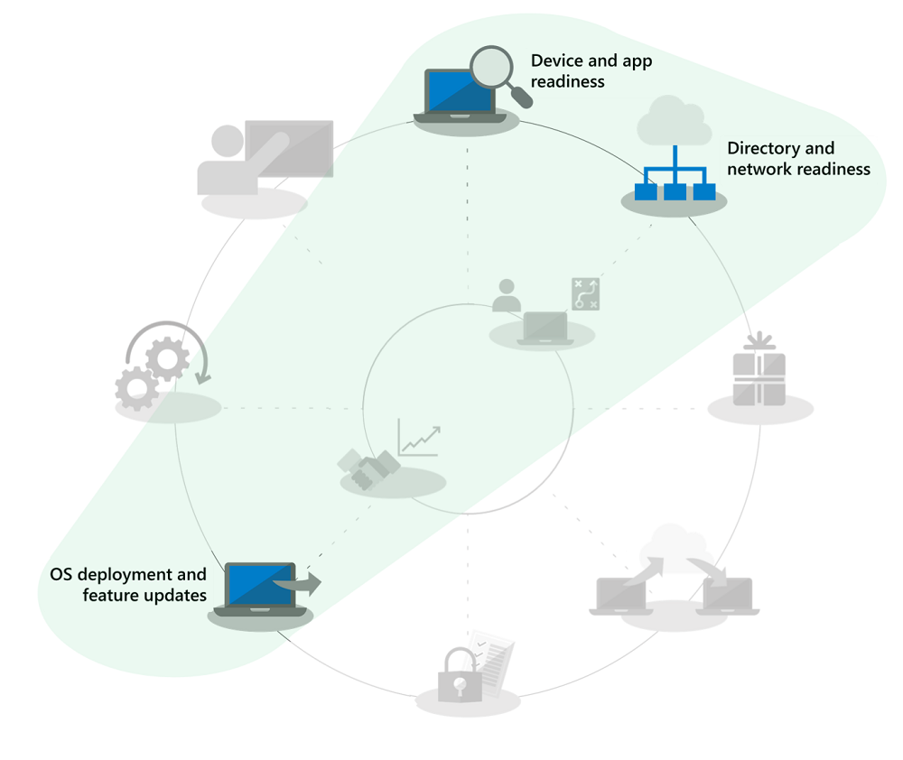

# Automatiserade på plats-uppgraderingar av Windows 7 till Windows 10 för stora organisationerWindows 7 to Windows 10 automated in-place upgrades for large organizations

Från den 14 januari 2020 tillhandahålls inte längre säkerhetsuppdateringar eller support för datorer med Windows 7.As of January 14, 2020, security updates or support for PCs running Windows 7 are no longer provided. Eftersom det finns många distributionsalternativ för att byta från Windows 7 till Windows 10 är en vanlig fråga i IT-communityn vilket som är det snabbaste sättet att gå över från Windows 7 till Windows 10.For the shift from Windows 7 to Windows 10 with multiple options to deploy, a common question in the IT community is, “What’s the fastest way to move from Windows 7 to Windows 10?” Det korta svaret är att göra på plats-uppgraderingar för befintliga datorer och därefter minska fokus på flera aspekter av datordistributionsprocessen.The short answer is to perform in-place upgrades for existing PCs and in doing that you can reduce focus on several aspects of the desktop deployment process.

Med på plats-uppgraderingar minskas omfattningen för flera datordistributionsprocesser dramatiskt, särskilt:Using in-place upgrades, several desktop deployment processes get reduced dramatically in scope, especially:

  - **Programpaketering** och omleverans av nödvändiga verksamhetsspecifika appar – dessa överförs helt enkelt från Windows 7-miljön**Application packaging** and redelivery of required line-of-business apps – these are simply carried forward from the Windows 7 environment

  - **Filmigrering** och grundläggande användarinställningar – dessa överförs också från den tidigare installationen när samma användare behåller enheten**File migration** and basic user settings – these are also carried forward from the previous install when the same user retains the device

De nedtonade uppgifterna i distributionsprocessen är inte objekt som du kan ignorera helt och hållet, men för att spara tid förutsätter detta att du för fram din säkerhetskonfiguration, ändrar programuppdateringsprocesser efter distributionen och vi antar att din användarutbildning för Windows-komponenten till största del har skett hemma för dina användare, då privat köpta Windows-datorer sedan 2012 för det mesta inte har haft Windows 7 förinläst och sedan släppet av Windows 10 2015 majoriteten av Windows 7-hemmasystemen också har uppgraderats till Windows 10.The grayed-out tasks in the deployment process wheel graphic above are not items that you can completely ignore, but to save time this assumes that you’ll bring forward your security configuration, change software update processes post-deployment, and we’ll assume that your user training for the Windows component has largely happened at home for your users, as privately purchased Windows computers since 2012 for most part have not had Windows 7 pre-loaded and since the release of Windows 10 in 2015, the majority of Windows 7 home systems have also been upgraded to Windows 10.

## Tillförlitlighet, skydd och skalning för på plats-uppgraderingarIn-place upgrade reliability, safeguards, and scale

På plats-uppgraderingar till Windows 10 är en tillförlitlig metod för att flytta en befintlig enhet med Windows 7 eller senare till Windows 10, utan att kräva filmigrering eller ominstallation av program.In-place upgrades to Windows 10 are a reliable approach for moving an existing device running Windows 7 or newer to Windows 10, without requiring file migration or application reinstallation. Efter en på plats-uppgradering är användarens filer, inställningar och tillgängliga appar är konsekventa med deras tidigare Windows 7-installation.After an in-place upgrade, the user’s files, settings and available apps are consistent with their previous Windows 7 installation. Uppgraderingar fungerar även när du flyttar från och till samma slags arkitektur (32-bitars till 32-bitars eller 64-bitars till 64-bitars) och från och till samma slags versioner av Windows (Professional till Pro eller Enterprise to Enterprise).Upgrades also work when moving from like-to-like architectures (32-bit to 32-bit or 64-bit to 64-bit) and like-to-like editions of Windows (Professional to Pro or Enterprise to Enterprise).

Uppgraderingsprocessen säkerhetskopierar som standard din tidigare Windows-installation som en del av uppgraderingen, så att vid ett uppgraderingsfel eller om en enhet eller ett program inte fungerar på rätt sätt efter uppgraderingen kan datorn återställas till Windows 7.The upgrade process by default backs-up your previous Windows installation as part of upgrade, so that in the event of an upgrade failure or if a device or application doesn’t function properly post-upgrade, the computer can roll back to Windows 7. Uppgraderade datorer har som standard 10 dagar, så du kan manuellt starta en återställning till Windows 7 om det behövs.Upgraded PCs by default have 10 days so you can manually initiate a roll back to Windows 7 if necessary.

På plats-uppgraderingar kan automatiseras med hjälp av distributionsverktyg i operativsystemet som [Microsoft Endpoint Configuration Manager](https://docs.microsoft.com/mem/configmgr/osd/deploy-use/create-a-task-sequence-to-upgrade-an-operating-system) eller [Microsoft Deployment Toolkit](https://docs.microsoft.com/windows/deployment/upgrade/upgrade-to-windows-10-with-the-microsoft-deployment-toolkit).In-place upgrades can be automated using operating system deployment tools like [Microsoft Endpoint Configuration Manager](https://docs.microsoft.com/mem/configmgr/osd/deploy-use/create-a-task-sequence-to-upgrade-an-operating-system) or the [Microsoft Deployment Toolkit](https://docs.microsoft.com/windows/deployment/upgrade/upgrade-to-windows-10-with-the-microsoft-deployment-toolkit). I den här artikeln beskrivs de automatiserade metoderna och optimeringarna och länkar ges till relaterade resurser där du kan få mer hjälp.This article highlights the automated approaches and optimizations along with links to related resources for additional help.

## Uppgradera ett litet antal datorerUpgrading a small number of computers

För en enstaka dator eller ett fåtal datorer är den manuella uppgraderingsmetoden vanligtvis det bästa alternativet jämfört med mer automatiserade metoder.For a single computer or a handful of computers, the manual approach to upgrade is usually the best option compared to more automated approaches. Du hittar den nödvändiga programvaran och de licenser som behövs i [Microsoft Store](https://go.microsoft.com/fwlink/p/?LinkId=808282), hos andra programvaruåterförsäljare eller i [Volume Licensing Service Center](https://www.microsoft.com/licensing/servicecenter/default.aspx) om du har volymlicensiering.You can find the necessary software and licenses at the [Microsoft Store](https://go.microsoft.com/fwlink/p/?LinkId=808282), other software retailers, or at the [Volume Licensing Service Center](https://www.microsoft.com/licensing/servicecenter/default.aspx) if you have volume licensing. För detaljerade anvisningar om uppgradering av en enstaka dator till Windows 10 och återställningsalternativ efter uppgradering finns i [steg för steg-guiden för manuell uppgradering av Windows 7 till Windows 10](https://docs.microsoft.com/microsoft-365/enterprise/windows-7-to-windows-10-upgrade).For detailed guidance to upgrade a single PC to Windows 10 as well as post-upgrade restore options, see the [Windows 7 to Windows 10 manual upgrade step-by-step guide](https://docs.microsoft.com/microsoft-365/enterprise/windows-7-to-windows-10-upgrade).

## Uppgradera många datorerHow to upgrade many computers

Om du hanterar dussintals eller tusentals datorer är det bästa alternativet att utföra på plats-uppgraderingar med aktivitetssekvensautomatisering med Microsoft Endpoint Configuration Manager eller Microsoft Deployment Toolkit.If you manage dozens or thousands of computers, then your best option is to perform in-place upgrades using task sequence automation with Microsoft Endpoint Configuration Manager or the Microsoft Deployment Toolkit. Processen är mycket tillförlitlig i de flesta fall men, beroende på hur många datorer du uppgraderar, är det ändå bra att ha nödvändig tester och kontroller på plats för att säkerställa framgång vid skalning.While the process is very reliable in most situations, depending on the number of PCs you are upgrading, it still makes sense to have the necessary testing and controls in place to ensure success at scale.

Det betyder att du kan hoppa över katalogberedskap eller aktiviteter kopplade till leverans och paketering samt filmigrering för Azure Active Directory, Office och verksamhetsspecifika appar eftersom de aspekterna behålls som en del av uppgraderingen och säkerheten bör som minimum överföras.This means that you may skip directory readiness or tasks associated with Azure Active Directory, Office and line of business app delivery and packaging and user file migration since those aspects are retained as part of upgrade, and security should be at minimum carried forward. Alla dessa områden kan förbättras med tiden.These areas can all be enhanced over time.

Alternativet för distributionsuppgradering tas upp i [OS-distribution och funktionsuppdateringar](https://www.aka.ms/mdd6) och trots att du enkelt kan skapa skriptlösningar som körs Windows 10-konfiguration på ett automatiserat sätt med minimal eller ingen administrationsinteraktion kan en aktivitetssekvens ge dig mer detaljerad kontroll för att:The upgrade deployment option is covered in [OS Deployment and Feature Updates](https://www.aka.ms/mdd6) and although you can easily build scripted solutions that will run Windows 10 setup in an automated way with minimal or no admin interaction, a task sequence will give you more granular control to:

  - utföra kontroller före distribution,Perform pre-deployment checks,

  - hantera enhetens krypteringstillstånd före uppgradering,Manage drive encryption state pre-upgrade,

  - avinstallera kända problematiska drivrutiner och appar före uppgradering,Uninstall known problematic drivers and apps pre-upgrade,

  - Installera ytterligare drivrutiner och appar efter uppgradering,Install additional drivers and apps post-upgrade,

  - hantera enhetens krypteringstillstånd efter uppgradering,Manage drive encryption state post-upgrade,

  - återställa en dator till ett tidigare tillstånd – där avinstallerade appar eller drivrutiner återinstalleras – vid misslyckad uppgradering,Restore a PC to a previous state – where uninstalled apps or drivers are reinstalled – in the event of a failed upgrade,

  - Förutom allt annat måste du konfigurera för att uppnå ett Business Ready-tillståndAlong with anything else you need to configure to achieve a business ready state

De vanligaste orsakerna till att uppgraderingar kanske inte slutföras eller inte är möjliga är utmaningar med följande:The most common reasons upgrades may not complete or are not possible include challenges with:

  - Inaktuella enhetsdrivrutinerOutdated device drivers

  - Diskkryptering från tredje part3rd party disk encryption

  - Kodlösningar på låg nivå, till exempel skydd mot skadlig kod, VPN eller virtualiseringLow level code solutions, such as anti-malware, VPN or virtualization

Mallar för [uppgraderingsaktivitetssekvenser](https://docs.microsoft.com/mem/configmgr/osd/deploy-use/create-a-task-sequence-to-upgrade-an-operating-system) är inbyggda i Microsoft Endpoint Configuration Manager (Current Branch) och har vari tillgängliga för flera versioner.[Upgrade task sequence](https://docs.microsoft.com/mem/configmgr/osd/deploy-use/create-a-task-sequence-to-upgrade-an-operating-system) templates are built into Microsoft Endpoint Configuration Manager (current branch) and have been available for several releases. I de senaste versionerna har det skett betydande tekniska förbättringar av Configuration Manager som gör processen ännu effektivare för att fastställa beredskapen för enhets- och Office-kompatibilitet, minska nätverkstrafik och konfigurera nya alternativ som OneDrive-säkerhetskopieringIn recent releases, there have been significant technology enhancements to Configuration Manager that make the process even more efficient for determining device and Office compatibility readiness, reducing network traffic, and configuring new options such as OneDrive backup. Titta på det här [Microsoft Mechanics-programmet](https://youtu.be/CYRnAmCD7ls) så får du mer information om de senaste uppdateringarna av OS-distribution med Configuration Manager.Watch this [Microsoft Mechanics show](https://youtu.be/CYRnAmCD7ls) to learn more about recent updates to Configuration Manager OS deployment.

Om du inte använder Microsoft Endpoint Configuration Manager kan du använda Microsoft Deployment Toolkit till att skapa och köra aktivitetssekvenser för uppgraderingsdistribution.If you do not use Microsoft Endpoint Configuration Manager, you can use the Microsoft Deployment Toolkit to build and execute upgrade deployment task sequences.

## Uppgraderingar med förcacheaktivitetssekvenserPre-cache task sequence upgrades

Med [förcachealternativet](https://docs.microsoft.com/mem/configmgr/osd/deploy-use/create-a-task-sequence-to-upgrade-an-operating-system#configure-pre-cache-content) för Configuration Manager-distributionsaktivitetssekvens kan klienter ladda ned relevant innehåll i OS-uppgraderingspaketet innan aktivitetssekvensen uppgraderar operativsystemet.The [pre-cache option](https://docs.microsoft.com/mem/configmgr/osd/deploy-use/create-a-task-sequence-to-upgrade-an-operating-system#configure-pre-cache-content) for Configuration Manager deployment task sequence allows clients to download relevant OS upgrade package content before the task sequence upgrades the operating system. Tidigare skulle start av aktivitetssekvensen starta nedladdningen av paketinnehåll.Previously, initiating the task sequence would initiate the download of package content. Med förcacheinnehåll får du även alternativet för klienten att bara ladda ned det gällande OS-uppgraderingspaketet och allt annat refererat innehåll så snart distributionen tas emot.Pre-cache content also gives you the option for the client to only download the applicable OS upgrade package and all other referenced content as soon as it receives the deployment.

Förcacheaktivitetssekvenser kombinerat med kompatibilitetskontrollerPre-cache task sequences combined with compatibility scans

Förutom att spara tid för paketnedladdningen kan du förcachelagra uppgraderingspaketet och använda installationsprogrammet för Windows till att bedöma om på plats-uppgradering kommer att lyckas innan du kör den faktiska Windows-uppgraderingen.In addition to saving time for the package download, you can pre-cache the upgrade package and use Windows setup to assess whether the in-place upgrade will succeed prior to executing the actual Windows upgrade. Följande kommandoradssyntax kan användas för att köra en kompatibilitetskontroll i bakgrunden och ta reda på om installationsprogrammet för Windows Setup bedömer att enheten är redo för uppgradering: **Setup.EXE /Auto Upgrade /Quiet /NoReboot /Compat ScanOnly**The following command line syntax can be used to silently execute a compatibility scan and find out whether or not Windows Setup assesses the device as ready for upgrade: **Setup.EXE /Auto Upgrade /Quiet /NoReboot /Compat ScanOnly**

Loggar skickas sedan till din definierade serversökväg och installationsprogrammet för Windows visas inte för användaren och stängs utan användarinteraktion.Logs will then be sent to your defined server path and Windows Setup will not show itself to the user and close without user interaction.

Resultatet av själva loggarna är följande:The results of the logs themselves will be:

1.  Om installationsprogrammet inte hittar något kompatibilitetsproblem och datorn verkar uppfylla alla krav returneras MOSETUP\_E\_COMPAT\_SCANONLY (0xC1900210)If Setup does not find any compatibility issue and the PC appears to meet all requirements, it will return MOSETUP\_E\_COMPAT\_SCANONLY (0xC1900210)

2.  Om installationsprogrammet hittar kompatibilitetsproblem som kan åtgärdas, till exempel kända inkompatibla appar, returneras MOSETUP\_E\_COMPAT\_INSTALLREQ\_BLOCK (0xC1900208)If Setup finds actionable compatibility issues, like apps known incompatible, it will return MOSETUP\_E\_COMPAT\_INSTALLREQ\_BLOCK (0xC1900208)

3.  Om installationsprogrammet finner att datorn inte är kvalificerad för Windows 10 returneras MOSETUP\_E\_COMPAT\_SYSREQ\_BLOCK (0xC1900200)If Setup finds the PC is not eligible for Windows 10, it will return MOSETUP\_E\_COMPAT\_SYSREQ\_BLOCK (0xC1900200)

4.  Om installationsprogrammet finner att datorn inte har tillräckligt mycket ledigt utrymme för installationen returneras MOSETUP\_E\_INSTALLDISKSPACE\_BLOCK (0xC190020E)If Setup finds that PC does not have enough free space to install, it will return MOSETUP\_E\_INSTALLDISKSPACE\_BLOCK (0xC190020E)

När du har distribuerat förcachesekvenser med kompatibilitetskontroller för ett stort antal datorer i en samling kan du börja parsa loggfilerna för enhetsberedskap.Once you’ve deployed pre-cache sequences with compatibility scans to a large number of PCs in a collection, you can begin to parse the log files for device readiness. Med hjälp av resultatet ovan kan \#1 (0xC1900210) åtgärdas som ”redo att distribueras” och \#4 (0xC190020E) kan åtgärdas genom att frigöra diskutrymme.Using the outputs listed above, \#1 (0xC1900210) can be actioned as “ready to deploy” and \#4 (0xC190020E) can be actioned by freeing up disk space. Här är det viktigt att vara försiktig med vad som tas bort men Windows Update-rensning, Papperskorgen och Cleanup, Recycle Bin och Tillfälliga filer är bra ställen att börja och i många fall får du tillräckligt mycket utrymme för att uppgraderingen ska lyckas.Here, you’ll want to be careful about what to delete, but Windows Update Cleanup, Recycle Bin, and Temporary Files are places to start and many cases will provide enough space for the upgrade to succeed. Du kan köra kompatibilitetskontrollen så ofta det behövs till datorn är redo för på plats-uppgraderingen.Can you run the compat scan as often as needed until the PC is found ready for the in-place upgrade. Mer information om kommandoradsalternativ för installationsprogrammet för Windows på <https://aka.ms/setupswitches>You can find more information about Windows Setup command line options at <https://aka.ms/setupswitches>

## [Center för skrivbordsdistributionDesktop Deployment Center](https://aka.ms/howtoshift)
