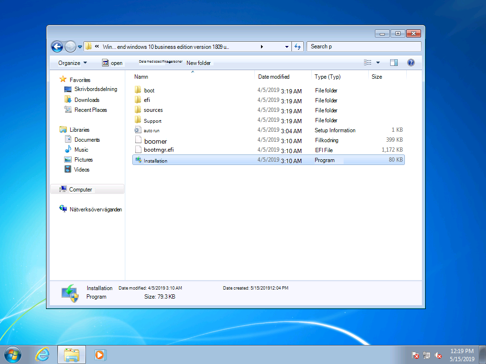
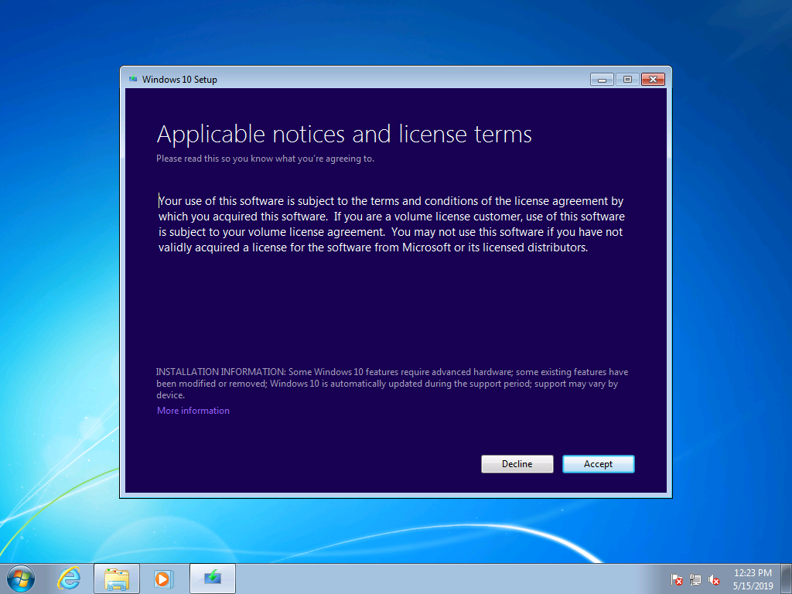
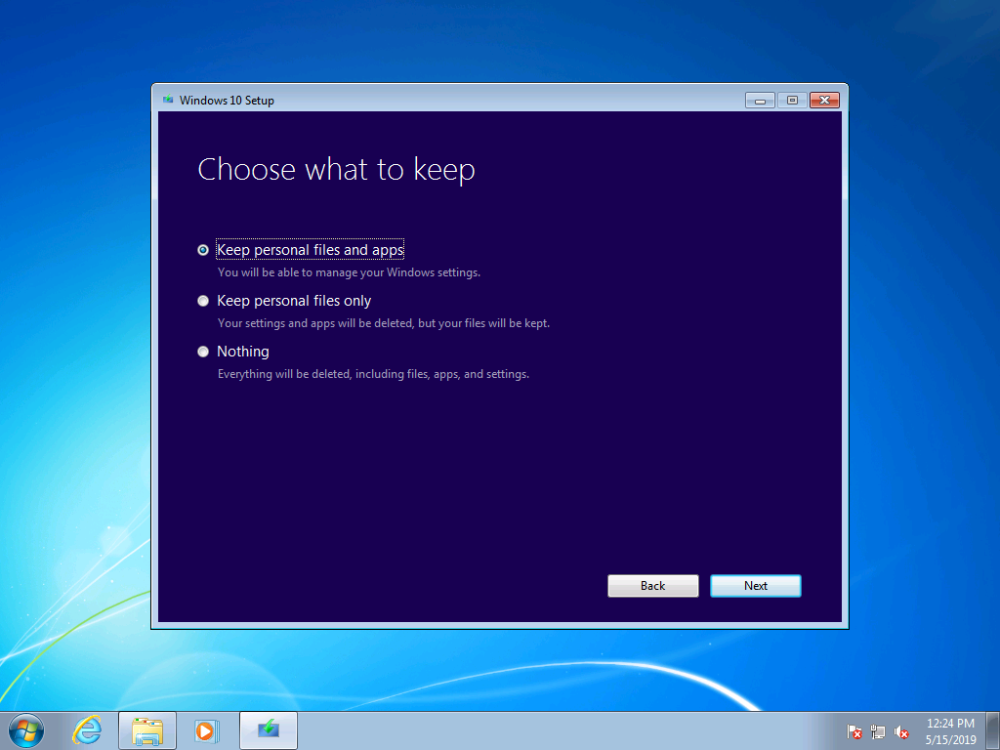
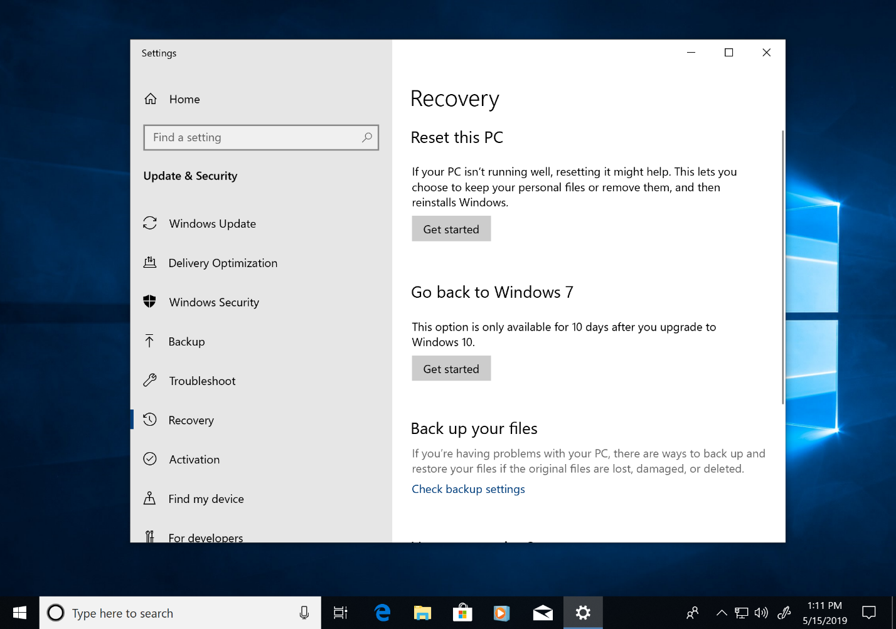
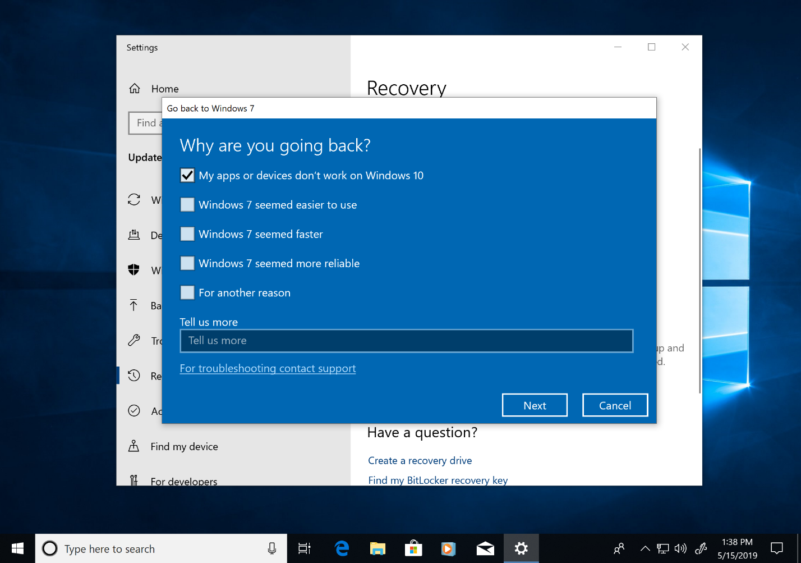

# Steg-för-steg-vägledning för manuell uppgradering av Windows 7 till Windows 10

I den här artikeln beskrivs processen för att manuellt uppgradera en dator med Windows 7 Enterprise till Windows 10 Enterprise. Processen är i stort sett densamma för andra versioner av Windows 7, t. ex. Home och Professional, men du kan också välja att uppgradera direkt med verktyget för att skapa media. Uppgraderingar för alla utgåvor av Windows 7 till Windows 10 kräver en giltig produktnyckel och en motsvarande eller senare version av Windows. Till exempel kan Windows 7 Professional uppgraderas till Windows 10 Pro, men inte till Windows 10 Home. Windows 7 Ultimate måste uppgraderas till Windows 10 Pro.

## Windows 10-uppgraderingar med hjälp av verktyget för att skapa media eller ISO-filer

Du kan uppgradera till Windows 10 direkt med [verktyget för att skapa media](https://www.microsoft.com/software-download/windows10ISO) eller använda det för att ladda ned Windows 10 som en ISO-fil. Du måste anteckna om ditt aktuella system är 32- eller 64-bitars, datorns standardspråk och utgåva av Windows 7 (t.ex. Home, Professional eller Enterprise). I Windows 7 finns den här informationen på Kontrollpanelen \> System och säkerhet \> System. Verktyget för att skapa media har inte stöd för Windows 10 Enterprise för uppgraderingar, skapande av installationsmedia eller nedladdning av ISO-filer. Windows 10 Enterprise krävs om du uppgraderar från Windows 7 Enterprise.

När du uppgraderar från Windows 7 Enterprise till Windows 10 Enterprise måste du ladda ned ISO-filen för ditt språk och din arkitektur (32-bitars eller 64-bitars) från [Volume Licensing Service Center](https://www.microsoft.com/licensing/servicecenter/default.aspx).

Om du planerar att göra uppgraderingen med en ISO-fil måste du extrahera filerna i ISO-filen till ett lokalt filsystem eller en flyttbar enhet, eller så kan du bränna ISO-filen på en DVD-skiva. Du kan extrahera installationsfilerna i ISO-filen med en Windows 8-dator eller en nyare dator och spara filerna på en flyttbar USB-enhet, eller använda ett program som [7zip](https://www.7-zip.org/) för att extrahera innehållet i ISO-filen till en mapp på din lokala enhet i Windows 7.

När installationsmedia finns tillgängliga i Windows 7 kan du påbörja uppgraderingen genom att köra setup.exe som visas nedan.

**Viktigt tips: För en direktuppgradering där programmen och dina data migreras till Windows 10 behöver du initiera processen inifrån en Windows 7-session som körs. Om du startar för att installera media från en DVD- eller USB-enhet får du inte möjlighet att behålla appar och filer. I stället utförs en ren installation av Windows 10.**

Under Windows 10-konfigurationen får du vägledning genom installationsprocessen, och på den första skärmen får du möjlighet att hämta uppdateringar, drivrutiner och valfria funktioner. Det här är ett bra sätt att se till att uppgraderingen lyckas

När uppdateringarna har tillämpats övergår Windows 10-konfigurationen till nästa fas, Välj bild. Här ska du välja din utgåva av Windows. I det här fallet väljer du Windows 10 Enterprise, eftersom datorn har Windows 7 Enterprise installerat.

På nästa skärm i installationsprogrammet för Windows 10 visas tillämpliga meddelanden och licensvillkor. När du har läst och förstått meddelanden och villkor klickar du på ”Acceptera” för att fortsätta eller ”Avböj” för att avbryta.

Installationsprogrammet för Windows 10 letar nu efter ytterligare uppdateringar.

När det är klart är installationsprogrammet för Windows 10 redo att installeras, och konfigureras som standard så att Windows 10 installeras och dina personliga filer och appar behålls. Det här alternativet rekommenderas. Genom att klicka på ”Välj vad du vill behålla” kan du se fler alternativ. Annars klickar du på ”Installera”.

Om du väljer ”Välj vad du vill behålla” visas följande alternativ:

Med alternativet ”Behåll bara personliga filer” flyttas inte dina installerade appar eller inställningar från Windows 7 till Windows 10. I stället flyttas bara dina filer och användarkonton till Windows. Appar måste installeras om senare med det här alternativet. Använd bara det här alternativet om du är trygg med att du kan installera om och konfigurera de appar du behöver när Windows är installerat, annars bör du välja alternativet ”Behåll personliga filer och appar”.

Med alternativet ”Inget” tas dina filer, appar och inställningar bort och en ren installation av Windows utförs. Använd bara det här alternativet om du redan har säkerhetskopierat de data som du vill behålla och vet att du kan installera om apparna.

Nu hämtar Windows 10 uppdateringar igen baserat på vad du har valt på föregående skärm.

Nu installeras Windows 10, vilket tar några minuter, och om du väljer att behålla dina personliga filer och appar kommer allt att finnas på samma filplatser, och dina appar kommer att finnas i Windows 10.

## 

## Återställning i Windows 10

När Windows 10 har installerats får du upp till 10 dagar på dig att återgå till Windows 7 genom återställningsalternativet i Windows 10. Det här kan vara användbart om en enhet eller app på datorn inte fungerar som den ska, och du behöver återgå till din tidigare installation av Windows 7. Efter 10 dagar frigör Windows 10 som standard det utrymme som använts av dina Windows 7-återställningsfiler på hårddisken och raderar filer från föregående installation. Även om du har tagit bort Windows 7 efter den här tidpunkten och du inte kan återställa Windows 7, finns programmen och dina personliga filer kvar i Windows 10.

Om du vill starta processen för att återgå till Windows 7 går du till Inställningar \> Uppdatering och säkerhet \> Återställning. Under Återgå till Windows 7 väljer du ”Kom igång”.

Windows 10 frågar nu varför du väljer att återgå. Om orsaken är teknisk är det bra om du fyller i det, för att underlätta lösningar och se till att andra får nytta av din upplevelse.

Ofta finns det uppdateringar för din version av Windows 10 som skulle kunna lösa dina tekniska problem. Du uppmanas att söka efter uppdateringar, och om du hittar och installerar sådana kontrollerar du sedan om det löste de problem du upplevt.

Om uppdateringarna inte löser problemen och du måste återgå till din tidigare installation av Windows 7 kan det hända att vissa appar måste installeras på nytt, till exempel appar som installerats medan du körde Windows 10, och vissa inställningar kan gå förlorade. Observera att filer och dokument som du har sparat lokalt medan du använde Windows 10 behålls och finns tillgängliga när du återgått till Windows 7. 

Innan du sätter igång behöver du kontrollera att du har ett konto och lösenord för ett lokalt konto eller domänkonto redo från den tidigare Windows 7-installationen.

Härifrån kan du starta processen för att återgå till Windows 7. Efter några minuter startar datorn Windows 7 med samma utseende som innan du uppgraderade till Windows 10.

## Övergå till Windows 10 på en ny dator

Ett annat alternativ som rekommenderas är att övergå till Windows 10 på en ny dator. Om du vill kan du överföra dina filer från den gamla datorn med säkerhetskopiering i [OneDrive](https://support.office.com/article/b5e918be-0fd4-4095-98da-bceed57f8e0c?ocid=MoveToWindows10), [inbyggd säkerhetskopiering och återställning i Windows](https://support.microsoft.com/help/4469209?ocid=MoveToWindows10), manuellt med hjälp av en [extern lagringsenhet](https://support.microsoft.com/help/4465814/windows-7-move-files-off-pc-with-an-external-storage-device?ocid=MoveToWindows10) eller med verktyg som PCmover Express från Laplink. Oavsett vilket av de här alternativen du väljer måste du ändå installera om alla nödvändiga program som inte ingår i Windows 10. Om du vill veta mer om alternativen för manuell övergång från en befintlig dator med Windows 7 till en ny dator med Windows 10 kan du läsa [Övergå till en dator med Windows 10](https://support.microsoft.com/help/4229823?ocid=MoveToWindows10) i Windows-supporten.

## [Center för skrivbordsdistribution](https://aka.ms/howtoshift)
