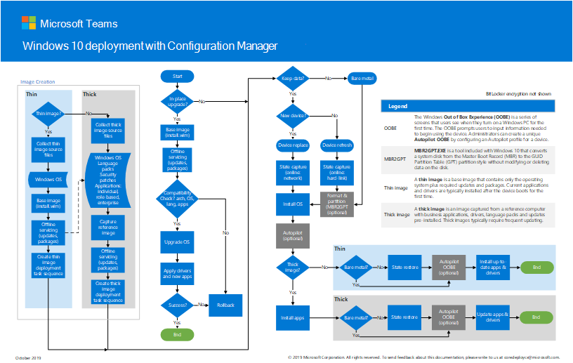

# Steg 2: Distribuera Windows 10 Enterprise för befintliga enheter som en uppgradering på platsStep 2: Deploy Windows 10 Enterprise for existing devices as an in-place upgrade

*Den här artikeln gäller både E3- och E5-versionerna av Microsoft 365 Enterprise**This article applies to both the E3 and E5 versions of Microsoft 365 Enterprise*

Den enklaste vägen för att uppgradera datorer som för närvarande kör Windows 7 eller Windows 8.1 till Windows 10 är genom en uppgradering på plats.The simplest path to upgrade PCs currently running Windows 7 or Windows 8.1 to Windows 10 is through an in-place upgrade. Du kan använda en Configuration Manager -aktivitetssekvens (Configuration Manager) för att helt automatisera processen.You can use a Configuration Manager (Configuration Manager) task sequence to completely automate the process. 

Om du har befintliga datorer med Windows 7 eller Windows 8.1 rekommenderar vi den här sökvägen om din organisation distribuerar Windows 10.If you have existing computers running Windows 7 or Windows 8.1, we recommend this path if your organization is deploying Windows 10. Detta utnyttjar Installationsprogrammet för Windows (Setup.exe) för att utföra en uppgradering på plats, som automatiskt bevarar alla data, inställningar, program och drivrutiner från den befintliga operativsystemversionen.This leverages the Windows installation program (Setup.exe) to perform an in-place upgrade, which automatically preserves all data, settings, applications, and drivers from the existing operating system version. Detta kräver minst IT-insats, eftersom det inte finns något behov av någon komplex distributionsinfrastruktur.This requires the least IT effort, because there is no need for any complex deployment infrastructure.

Följ dessa steg för att konfigurera och distribuera en Windows 10 Enterprise-avbildning med Microsoft Endpoint Configuration Manager som en uppgradering på plats.Follow these steps to configure and deploy a Windows 10 Enterprise image using Microsoft Endpoint Configuration Manager as an in-place upgrade.

## Windows 10-distributionen med Configuration Manager-affischenThe Windows 10 deployment with Configuration Manager poster

Configuration Manager-affischen är en sida i liggande läge (17x11).The Configuration Manager poster is one page in landscape mode (17x11). Klicka på bilden nedan för att visa en PDF-fil i webbläsaren.Click the image below to view a PDF in your browser. 

Du kan också ladda ner denna affisch i [PDF-](https://github.com/MicrosoftDocs/windows-itpro-docs/raw/public/windows/deployment/media/Windows10DeploymentConfigManager.pdf) eller [Visio-format.](https://github.com/MicrosoftDocs/windows-itpro-docs/raw/public/windows/deployment/media/Windows10DeploymentConfigManager.vsdx)You can also download this poster in [PDF](https://github.com/MicrosoftDocs/windows-itpro-docs/raw/public/windows/deployment/media/Windows10DeploymentConfigManager.pdf) or [Visio](https://github.com/MicrosoftDocs/windows-itpro-docs/raw/public/windows/deployment/media/Windows10DeploymentConfigManager.vsdx) format.

## Del 1: Kontrollera beredskapen för att uppgradera WindowsPart 1: Verify readiness to upgrade Windows

Använd först funktionen Uppgraderingsberedskap i Windows Analytics för att ge kraftfulla insikter och rekommendationer om datorer, program och drivrutiner i organisationen, utan extra kostnad och utan ytterligare infrastrukturkrav.First, use the Upgrade Readiness capability of Windows Analytics to provide powerful insights and recommendations about the computers, applications, and drivers in your organization, at no extra cost and without additional infrastructure requirements. Den här nya tjänsten guidar dig genom uppgraderings- och funktionsuppdateringsprojekt med hjälp av ett arbetsflöde baserat på microsofts rekommenderade metoder.This new service guides you through upgrade and feature update projects using a workflow based on Microsoft recommended practices. Aktuella lagerdata gör att du kan balansera kostnader och risker i dina uppgraderingsprojekt.Up-to-date inventory data allows you to balance cost and risk in your upgrade projects.

Se [Hantera Windows-uppgraderingar med uppgraderingsberedskap](https://docs.microsoft.com/windows/deployment/upgrade/manage-windows-upgrades-with-upgrade-readiness) om du vill veta mer, komma igång, använda och felsöka uppgraderingsberedskap.See [Manage Windows upgrades with Upgrade Readiness](https://docs.microsoft.com/windows/deployment/upgrade/manage-windows-upgrades-with-upgrade-readiness) to learn more, get started, use, and troubleshoot Upgrade Readiness.

Följ sedan guiden för att använda Configuration Manager (Current Branch) för att uppgradera Windows 7 eller senare operativsystem till Windows 10.Next, follow the guide to use Configuration Manager (Current Branch) to upgrade Windows 7 or later operating system to Windows 10. Precis som vid alla högriskdistributioner rekommenderar vi säkerhetskopiering av användardata innan du fortsätter.As with any high-risk deployment, we recommend backing up user data before proceeding. OneDrive-molnlagring är klar att användas för licensierade Microsoft 365-användare och kan användas för att lagra sina filer på ett säkert sätt.OneDrive cloud storage is ready to use for licensed Microsoft 365 users and can be used to securely store their files. Mer information finns i [Snabbstartsguide för OneDrive](https://aka.ms/ODfBquickstartguide).For more info, see [OneDrive quick start guide](https://aka.ms/ODfBquickstartguide). För att komma åt den här sidan måste du logga in som klientadministratör eller global administratör i en Office 365- eller Microsoft 365-klientorganisation.To access this page, you must sign in as a tenant admin or global admin in an Office 365 or Microsoft 365 tenant.

En lista över Configuration Manager-versioner och motsvarande Windows 10-klientversioner som stöds finns i [Support för Windows 10 för Configuration Manager](https://docs.microsoft.com/configmgr/core/plan-design/configs/support-for-windows-10).For a list of Configuration Manager versions and the corresponding Windows 10 client versions that are supported, see [Support for Windows 10 for Configuration Manager](https://docs.microsoft.com/configmgr/core/plan-design/configs/support-for-windows-10).

**Så här verifierar du beredskapen för att uppgradera Windows****To verify readiness to upgrade Windows**

Granska de här kraven innan du startar distributionen av Windows 10:Review these requirements before starting your Windows 10 deployment:

- **Windows-utgåvor som kan uppgraderas** – Dina enheter måste köra utgåvor av Windows 7 eller Windows 8.1 som kan uppgraderas till Windows 10 Enterprise.**Windows editions eligible for upgrade** - Your devices must be running editions of Windows 7 or Windows 8.1 that are eligible for upgrade to Windows 10 Enterprise. En lista över utgåvor som stöds finns i [uppgraderingsvägar för Windows 10](https://aka.ms/win10upgradepaths).For a list of supported editions, see [Windows 10 upgrade paths](https://aka.ms/win10upgradepaths). 
- **Enheter som stöds** – De flesta datorer som är kompatibla med Windows 8.1 är kompatibla med Windows 10.**Supported devices** - Most computers that are compatible with Windows 8.1 will be compatible with Windows 10. Du kan behöva installera uppdaterade drivrutiner i Windows 10 för att dina enheter ska fungera korrekt.You may need to install updated drivers in Windows 10 for your devices to properly function. Mer information finns i Specifikationerna för [Windows 10.](https://aka.ms/windows10specifications)See [Windows 10 specifications](https://aka.ms/windows10specifications) for more info.
- **Förberedelse för distribution** – Kontrollera att du har följande innan du börjar konfigurera distributionen:**Deployment preparation** - Make sure you have the following before you start configuring the deployment:
    - Windows 10 installationsmedia - Installationsmediet måste vara placerat på en separat enhet, med ISO redan monterad.Windows 10 installation media - The installation media must be located on a separate drive, with the ISO already mounted. Du kan hämta ISO från [MSDN-prenumeranthämtningar](https://aka.ms/msdn-subscriber-downloads) eller från Servicecenter för [volymlicensiering](https://aka.ms/mvlsc).You can obtain the ISO from [MSDN Subscriber Downloads](https://aka.ms/msdn-subscriber-downloads) or from the [Volume Licensing Service Center](https://aka.ms/mvlsc).
    - Säkerhetskopior av användardata – Även om användardata migreras i uppgraderingen är det bäst att konfigurera ett säkerhetskopieringsscenario.Backups of user data - Although user data will be migrated in the upgrade, best practice is to configure a backup scenario. Exportera till exempel alla användardata till ett OneDrive-konto, BitLocker To Go-krypterat USB-flashminne eller nätverksfilserver.For example, export all user data to a OneDrive account, BitLocker To Go-encrypted USB flash drive, or network file server. Mer information finns i [Säkerhetskopiera eller överföra data i Windows](https://aka.ms/backuptransferdatawindows).For more information, see [Back up or transfer data in Windows](https://aka.ms/backuptransferdatawindows).
- **Förberedelse av miljö** – Du kommer att använda en befintlig Configuration Manager-serverstruktur för att förbereda för operativsystemdistribution.**Environment preparation** - You will use an existing Configuration Manager server structure to prepare for operating system deployment. Förutom basinställningarna bör följande konfigurationer göras i Configuration Manager-miljön:In addition to the base setup, the following configurations should be made in the Configuration Manager environment:
    1. [Utöka Active Directory-schemat](https://aka.ms/extendadschema) och [skapa en systemhanteringsbehållare](https://aka.ms/createsysmancontainer).[Extend the Active Directory Schema](https://aka.ms/extendadschema) and [create a System Management container](https://aka.ms/createsysmancontainer).
    2. Aktivera Identifiering av Active Directory-skog och Active Directory System Discovery.Enable Active Directory Forest Discovery and Active Directory System Discovery. Mer information finns i [Konfigurera identifieringsmetoder för Configuration Manager](https://aka.ms/configurediscoverymethods).For more info, see [Configure discovery methods for Configuration Manager](https://aka.ms/configurediscoverymethods).
    3. Skapa IP-intervallgränser och gränsgrupp för innehåll och platstilldelning.Create IP range boundaries and boundary group for content and site assignment. Mer information finns i [Definiera platsgränser och gränsgrupper för Configuration Manager](https://aka.ms/definesiteboundaries).For more info, see [Define site boundaries and boundary groups for Configuration Manager](https://aka.ms/definesiteboundaries).
    4. Lägg till och konfigurera rollen för reporting services-rapporteringstjänster i Configuration Manager.Add and configure the Configuration Manager reporting services point role. Mer information finns [i Konfigurera rapportering i Configuration Manager](https://aka.ms/configurereporting).For more info, see [Configuring Reporting in Configuration Manager](https://aka.ms/configurereporting).
    5. Skapa en filsystemmappstruktur för paket.Create a file system folder structure for packages.
    6. Skapa en configuration manager-konsolmappstruktur för paket.Create a Configuration Manager console folder structure for packages.
    7. Installera Configuration Manager -uppdateringar (Current Branch) och eventuella ytterligare Windows 10-förutsättningar.Install Configuration Manager (Current Branch) updates and any additional Windows 10 prerequisites.

## Del 2: Lägga till en Windows 10 OS-avbildning med Configuration ManagerPart 2: Add a Windows 10 OS image using Configuration Manager
Nu måste du skapa ett uppgraderingspaket för operativsystemet som innehåller det fullständiga installationsmediet för Windows 10.Now you'll need to create an operating system upgrade package that contains the full Windows 10 installation media. I följande steg använder du Configuration Manager för att skapa ett uppgraderingspaket för Windows 10 Enterprise x64.In the following steps, you’ll use Configuration Manager to create an upgrade package for Windows 10 Enterprise x64.

**Så här lägger du till en Windows 10 OS-avbildning med Configuration Manager****To add a Windows 10 OS image using Configuration Manager**

1. Högerklicka på noden **Operativsystemets uppgraderingspaket** på Configuration **Manager-konsolen** och välj sedan **Lägg till uppgraderingspaket för operativsystem**.Using the Configuration Manager console, in the **Software Library** workspace, right-click the **Operating System Upgrade Packages** node, and then select **Add Operating System Upgrade Package**.
2. På sidan **Datakälla** anger du UNC-sökvägen till Windows 10 Enterprise x64-mediet och väljer sedan **Nästa**.On the **Data Source** page, specify the UNC path to the Windows 10 Enterprise x64 media, and then select **Next**.
3. På sidan **Allmänt** anger du Uppgradering av **Windows 10 Enterprise x64**och väljer sedan **Nästa**.On the **General** page, specify **Windows 10 Enterprise x64 Upgrade**, and then select **Next**. 
4. På sidan **Sammanfattning** väljer du **Nästa**och väljer sedan **Stäng**.On the **Summary** page, select **Next**, and then select **Close**. 
5. Högerklicka på det skapade **Windows 10 Enterprise x64 Update-paketet** och välj sedan **Distribuera innehåll**.Right-click the created **Windows 10 Enterprise x64 Update** package, and then select **Distribute Content**. 
6. Välj distributionsplats.Choose your distribution point.

## Del 3: Konfigurera distributionsinställningarPart 3: Configure deployment settings
I det här steget konfigurerar du en uppgraderingsaktivitetssekvens som innehåller inställningarna för Windows 10-uppgraderingen.In this step, you'll configure an upgrade task sequence that contains the settings for the Windows 10 upgrade. Du identifierar sedan de enheter som ska uppgraderas och distribuerar sedan aktivitetssekvensen till dessa enheter.You'll then identify the devices to upgrade, and then deploy the task sequence to those devices.

### Skapa en aktivitetssekvensCreate a task sequence
Så här skapar du en uppgraderingsaktivitetssekvens:To create an upgrade task sequence, perform the following steps:
  
1. Expandera **operativsystem**i configuration **manager-konsolen på arbetsytan Programvarubibliotek** .In the Configuration Manager console, in the **Software Library** workspace, expand **Operating Systems**. 
2. Högerklicka på noden **Aktivitetssekvenser** och välj sedan **Skapa aktivitetssekvens**.Right-click the **Task Sequences** node, and then select **Create Task Sequence**.
3. På sidan **Skapa en ny aktivitetssekvens** väljer du **Uppgradera ett operativsystem från uppgraderingspaketet**och väljer sedan **Nästa**.On the **Create a new task sequence** page, select **Upgrade an operating system from upgrade package**, and then select **Next**.
4. På sidan **Information om aktivitetssekvens** anger du Uppgradering av **Windows 10 Enterprise x64**och väljer sedan **Nästa**.On the **Task Sequence Information** page, specify **Windows 10 Enterprise x64 Upgrade**, and then select **Next**.
5. På sidan **Uppgradera operativsystemet Uppgradera operativsystemet** väljer du **Bläddra** och väljer **uppgraderingspaketet för Windows 10 Enterprise x64-uppgradering,** väljer **OK**och väljer sedan **Nästa**.On the **Upgrade the Windows operating system** page, select **Browse** and choose the **Windows 10 Enterprise x64 Upgrade operating system upgrade package**, select **OK**, and then select **Next**.
6. Fortsätt genom de återstående guidesidorna och välj sedan **Stäng**.Continue through the remaining wizard pages, and then select **Close**.

### Skapa en enhetssamlingCreate a device collection
När du har skapat uppgraderingsaktivitetssekvensen måste du skapa en samling som innehåller de enheter som du ska uppgradera.After you create the upgrade task sequence, you'll need to create a collection that contains the devices you will upgrade.

> [!NOTE]
> Använd följande inställningar för att testa distributionen på en enda enhet.Use the following settings to test the deployment on a single device. Du kan använda olika medlemskapsregler för att inkludera grupper av enheter när du är redo.You can use different membership rules to include groups of devices when you are ready. Mer information finns [i Så här skapar du samlingar i Configuration Manager](https://docs.microsoft.com/configmgr/core/clients/manage/collections/create-collections).For more info, see [How to create collections in Configuration Manager](https://docs.microsoft.com/configmgr/core/clients/manage/collections/create-collections).

1. Högerklicka på **Enhetssamlingar**i arbetsytan **Resurser och efterlevnad** i Configuration Manager-konsolen och välj sedan Skapa **enhetssamling**.In the Configuration Manager console, in the **Assets and Compliance** workspace, right-click **Device Collections**, and then select **Create Device Collection**. 
2. Ange följande inställningar på sidan **Skapa** enhetsinsamling i guiden Skapa enhetssamling och välj sedan **Nästa:**In the Create Device Collection wizard, on the **General** page, enter the following settings and then select **Next**:
    - Namn: Uppgradering av Windows 10 Enterprise x64Name: Windows 10 Enterprise x64 Upgrade
    - Begränsa insamling: Alla systemLimiting Collection: All Systems
3. På sidan **Medlemskapsregler** väljer du Lägg till > **regeldirekt-regel** för att starta guiden Skapa regel för direktmedlemskap. **Add Rule**On the **Membership Rules** page, select **Add Rule** > **Direct rule** to launch the Create Direct Membership Rule Wizard.
4. På **välkomstsidan** i guiden Skapa direktmedlemskapsregel väljer du **Nästa**.On the **Welcome** page of the Create Direct Membership Rule Wizard, select **Next**.
5. På sidan **Sök efter resurser** anger du följande inställningar och ersätter platshållarvärdets text med namnet på den enhet som du uppgraderar: **Value**On the **Search for Resources** page, enter the following settings, replacing the placeholder **Value** text with the name of the device you are upgrading: 
    - Resursklass: SystemresursResource Class: System Resource
    - Attributnamn: NamnAttribute Name: Name
    - Värde: *PC0003*Value: *PC0003*
6. På sidan **Välj resurser** väljer du enheten och väljer **Nästa**.On the **Select Resources** page, select your device, and select **Next**.
7. Slutför guiden Skapa regel för direktmedlemskap och guiden Skapa enhetssamling.Complete the Create Direct Membership Rule wizard and the Create Device Collection Wizard.  
8. Granska uppgraderingssamlingen för Windows 10 Enterprise x64.Review the Windows 10 Enterprise x64 Upgrade collection. Fortsätt inte förrän du ser de datorer som du har lagt till i samlingen.Do not continue until you see the machines you added in the collection.

### Skapa en operativsystemdistributionCreate an operating system deployment
Följ dessa steg för att skapa en distribution för aktivitetssekvensen.Follow these steps to create a deployment for the task sequence.

1. Högerklicka på aktivitetssekvensen som du skapade i ett föregående steg i Configuration Manager-konsolen i arbetsytan **Programvarubibliotek** och välj sedan **Distribuera**.In the Configuration Manager console, in the **Software Library** workspace, right-click the task sequence you created in a previous step, and then select **Deploy**.
2. På sidan **Allmänt** väljer du uppgraderingssamlingen **för Windows 10 Enterprise x64** och väljer sedan **Nästa**.On the **General** page, select the **Windows 10 Enterprise x64 Upgrade** collection, and then select **Next**.
3. På sidan **Innehåll** väljer du **Nästa**.On the **Content** page, select **Next**.
4. På sidan **Distributionsinställningar** väljer du följande inställningar och väljer sedan **Nästa:**On the **Deployment Settings** page, select the following settings, and then select **Next**:

    > [!NOTE]
    > För den här testdistributionen anger du syftet **till Tillgänglig**, vilket kräver åtgärder från användaren för att starta distributionen.For this test deployment, you'll set the purpose to **Available**, which requires user intervention to start the deployment. I en produktionsmiljö kanske du vill automatisera distributionen med det nödvändiga syftet, vilket innebär att ytterligare alternativ som schemaläggning konfigureras när distributionen körs.In a production environment, you may wish to automate the deployment using the Required purpose, which involves configuring additional options such as scheduling when the deployment is run. 

    - Åtgärd: InstalleraAction: Install
    - Syfte: TillgängligPurpose: Available

5. På sidan **Schemaläggning** godkänner du standardinställningarna och väljer sedan **Nästa**.On the **Scheduling** page, accept the default settings, and then select **Next**.
6. På sidan **Användarupplevelse** godkänner du standardinställningarna och väljer sedan **Nästa**.On the **User Experience** page, accept the default settings, and then select **Next**.
7. På sidan **Aviseringar godkänner** du standardinställningarna och väljer sedan **Nästa**.On the **Alerts** page, accept the default settings, and then select **Next**.
8. På sidan **Sammanfattning** väljer du **Nästa**och väljer sedan **Stäng**.On the **Summary** page, select **Next**, and then select **Close**.

## Del 4: Starta aktivitetssekvensen för Windows 10-uppgraderingPart 4: Start the Windows 10 upgrade task sequence
Följ dessa steg för att starta aktivitetssekvensen För Windows 10-uppgradering på den enhet som du uppgraderar.Follow these steps to start the Windows 10 Upgrade task sequence on the device that you are upgrading.
 
1. Logga in på Windows-datorn och starta **Software Center**.Log on to the Windows computer and start **Software Center**.
2. Markera den aktivitetssekvens som du skapade i ett tidigare steg och välj sedan **Installera**.Select the task sequence that you created in a previous step, and then select **Install**.
3. När aktivitetssekvensen börjar initieras uppgraderingsprocessen automatiskt genom att installera installationsprogrammet för Windows (Setup.exe) med de kommandoradsparametrar som krävs för att utföra en automatisk uppgradering, vilket bevarar alla data, inställningar, appar och Drivrutiner.When the task sequence begins, it automatically initiates the in-place upgrade process by invoking the Windows setup program (Setup.exe) with the necessary command-line parameters to perform an automated upgrade, which preserves all data, settings, apps, and drivers.
4. När aktivitetssekvensen har slutförts kommer datorn att uppgraderas helt till Windows 10.After the task sequence completes successfully, the computer will be fully upgraded to Windows 10.

Om du får problem när du använder Windows 10 i en företagsmiljö kan du läsa [de vanligaste Microsoft-supportlösningarna för de vanligaste problemen](https://docs.microsoft.com/windows/client-management/windows-10-support-solutions).If you experience issues when using Windows 10 in an enterprise environment, you can consult [top Microsoft Support solutions for the most common issues](https://docs.microsoft.com/windows/client-management/windows-10-support-solutions). Dessa resurser omfattar KB-artiklar, uppdateringar och biblioteksartiklar.These resources include KB articles, updates, and library articles.

Under lanseringen av uppdateringar i hela organisationen använder du funktionen Uppdatera efterlevnad i Windows Analytics för att ge en holistisk bild av kompatibiliteten för operativsystemets uppdatering, uppdateringsdistributionsförloppet och felsökning vid felfel för Windows 10-enheter.During the rollout of updates across your organization, use the Update Compliance capability of Windows Analytics to provide a holistic view of OS update compliance, update deployment progress, and failure troubleshooting for Windows 10 devices. Den här nya tjänsten använder diagnostikdata, inklusive installationsförlopp, Windows Update-konfiguration och annan information för att ge sådana insikter, utan extra kostnad och utan ytterligare infrastrukturkrav.This new service uses diagnostic data including installation progress, Windows Update configuration and other information to provide such insights, at no extra cost and without additional infrastructure requirements. Oavsett om den används med Windows Update för företag eller andra hanteringsverktyg kan du vara säker på att dina enheter är korrekt uppdaterade.Whether it's used with Windows Update for Business or other management tools, you can be assured that your devices are properly updated.

Mer information finns i [Övervaka Windows-uppdateringar och Windows Defender Antivirus med uppdateringsefterlevnad](https://docs.microsoft.com/windows/deployment/update/update-compliance-monitor) om du vill veta mer, komma igång och använda Uppdatera efterlevnad.See [Monitor Windows Updates and Windows Defender Antivirus with Update Compliance](https://docs.microsoft.com/windows/deployment/update/update-compliance-monitor) to learn more, get started, and use Update Compliance.

Som en interimskontrollpunkt kan du se [avslutningskriterierna](windows10-exit-criteria.md#crit-windows10-step2) som motsvarar det här steget.As an interim checkpoint, you can see the [exit criteria](windows10-exit-criteria.md#crit-windows10-step2) corresponding to this step.

## Nästa stegNext step

|||
|:-------|:-----|
|| [Distribuera Windows 10 Enterprise för nya enheter med Windows AutopilotDeploy Windows 10 Enterprise for new devices with Windows Autopilot](windows10-deploy-autopilot.md) |
