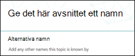

# Skapa ett nytt ämne (för hands version)

> [!Note] 
> Innehållet i den här artikeln gäller för projekt cortex privat för hands version. [Läs mer om Project Cortex](https://aka.ms/projectcortex).

I avsnitts upplevelser kan du skapa ett nytt ämne om ett sådant inte upptäckts genom indexering eller om AI-tekniken inte hittade tillräckligt många belägg för att det ska bli ett ämne.

## Krav

Om du vill skapa ett nytt avsnitt måste du:
- Har en licens för ämne.
- Har behörighet till [**vem som kan skapa eller redigera ämnen**](https://docs.microsoft.com/microsoft-365/knowledge/topic-experiences-user-permissions). Kunskaps administratörer kan ge användarna den här behörigheten i avsnittet behörigheter för kunskaps nätverk. 

> [!Note] 
> Användare som har behörighet att hantera ämnen i ämnes Center (kunskaps chef) har redan behörighet att skapa och redigera ämnen.

## Så här skapar du ett nytt ämne:

1. På sidan avsnitt Center väljer du **nytt** och sedan **sidan ämne**. Om du inte kan se det **nya** alternativet i ämnes centret kanske du inte har behörighet som krävs.

    

2. På sidan ny ämne kan du fylla i informationen om den nya ämnes mal len:

    - Skriv namnet på det nya avsnittet i avsnittet **namn i det här avsnittet** .
    
    - I avsnittet **alternativa namn** skriver du namn eller akronymer som också används för att referera till ämnet.
    
    - Skriv en eller två meningar för ämnet i avsnittet **kort beskrivning** . Den här texten används för det associerade ämnes kortet.
    
    - Skriv namnen på ämnes experterna i avsnittet **personer** . Personer som du lägger till manuellt i ämnet visas på ämnes sidan som **fasta personer**.
    
    - I avsnittet **filer och sidor** väljer du **Lägg till** och på nästa sida kan du välja associerade OneDrive-filer eller SharePoint Online-sidor.
    
    - I avsnittet **Sites** väljer du **Add**. I fönstret  **webbplatser** som visas väljer du de webbplatser som är kopplade till avsnittet.

    
    
3. Om du behöver lägga till andra komponenter på sidan, till exempel text, bilder, webb delar, länkar o.s.v., väljer du ikonen arbets yta mitt på sidan för att hitta och lägga till dem.

    

4. När du är klar väljer du **publicera** för att publicera avsnitts sidan. Publicerade ämnes sidor visas på fliken **sidor** .

När du har publicerat artikeln visas namnet, det alternativa namnet, beskrivningen och de fästa personerna för alla licensierade användare som visar artikeln. Filer, sidor och webbplatser visas bara på sidan ämne om visnings programmet har Office 365-behörigheter för objektet. 

Sidan ny ämne består av webb delar som är *medvetna om kunskaps nätverk*. Det innebär att när AI samlar in mer information om ämnet, uppdateras informationen i dessa webb delar med förslag för att göra sidan mer användbar för användarna.

## Se även

  

