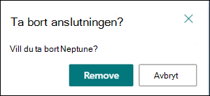

# Skapa ett nytt ämne i Microsoft Viva-ämnen

I Viva-ämnen kan du skapa ett nytt ämne om ett ämne inte upptäcks genom indexering eller om AI-tekniken inte hittar tillräckligt med bevis för att det ska kunna etableras som ett ämne.

> [!Note] 
> Observera att information i ett ämne som har samlats av AI är säkerhets trimad [,](topic-experiences-security-trimming.md)men observera att ämnesbeskrivning och personinformation i ett manuellt skapat ämne visas för alla användare som har behörighet att visa ämnet. 

## Krav

Om du vill skapa ett nytt ämne måste du:
- Ha en Viva Topics-licens.
- Har behörighet till [**Vem kan skapa eller redigera ämnen**](./topic-experiences-user-permissions.md). Knowledge admins can give users this permission in the Viva Topics topic permissions settings. 

> [!Note] 
> Användare som har behörighet att hantera ämnen i ämnescentret (knowledge managers) har redan behörighet att skapa och redigera ämnen.

## Skapa ett ämne

Du kan skapa ett nytt ämne från två platser:

- Startsidan för Ämnescenter: Alla  licensierade användare med behörigheten Vem kan skapa eller redigera ämnen (deltagare) kan skapa ett nytt ämne från ämnescentret genom att välja menyn Nytt och välja <b>Ämnessida.</b> <b></b>  

       

- Sidan Hantera ämnen: Alla licensierade användare med behörigheten Vem kan hantera ämnen (kunskapschefer) kan skapa ett nytt ämne från sidan Hantera ämnen i Ämnescenter genom att välja <b>Ny ämnessida.</b>   

       

### Så här skapar du ett nytt ämne:

1. Välj alternativet för att skapa en ny ämnessida från menyfliksområdet på sidan Hantera ämnen.

2.   I avsnittet **Namnge det här** avsnittet skriver du namnet på det nya avsnittet.

       

3. I <b>avsnittet Alternativa namn</b> skriver du alla andra namn som ämnet kan hänvisas till. 

       
4. Skriv <b>ett</b> par meningar som beskriver ämnet i avsnittet Beskrivning. 

     

4. I avsnittet <b>Fästa personer</b> kan du fästa en person för att visa att personen har en anslutning till ämnet (till exempel en ägare till en ansluten resurs). Börja med att skriva in <b></b> användarens namn eller e-postadress i rutan Lägg till en ny användare och välj sedan den användare du vill lägga till från sökresultatet. Du kan även "ta bort" dem genom att välja <b>ikonen Ta bort från</b> listan på användarkortet. Du kan också dra personen för att ändra ordningen som listan med personer visas.
 
     

5. I avsnittet <b>Fästa filer och sidor kan</b> du lägga till eller "fästa" en fil eller SharePoint-webbplatssida som är kopplad till avsnittet.

    
 
    Om du vill lägga till en ny fil väljer du Lägg till <b>,</b>väljer SharePoint-webbplatsen från ofta besökta eller följda webbplatser och väljer sedan filen från webbplatsens dokumentbibliotek.

    Du kan också använda alternativet <b>Från en länk för</b> att lägga till en fil eller sida genom att ange URL-adressen. 

    > [!Note] 
    > Filer och sidor som du lägger till måste finnas inom samma Microsoft 365-klientorganisation. Om du vill lägga till en länk till en extern resurs i ämnet kan du lägga till den via ikonen för arbetsytan i steg 8.

6.  I <b>avsnittet Relaterade</b> webbplatser visas webbplatser som har information om ämnet. 

     

    Du kan lägga till <b></b> en relaterad webbplats genom att välja Lägg till och sedan söka efter webbplatsen eller välja den i listan med vanliga eller senaste webbplatser. 
    
     

7. I <b>avsnittet Relaterade</b> ämnen visas anslutningar som finns mellan olika ämnen. Du kan lägga till en anslutning <b></b> till ett annat ämne genom att välja knappen Anslut till ett relaterat ämne, skriva namnet på det relaterade ämnet och välja det i sökresultatet. 

      

    Du kan sedan ge en beskrivning av hur ämnena är relaterade och välja <b>Uppdatera</b>. 

     

   Det relaterade ämnet du har lagt till visas som ett anslutet ämne.

     

   Om du vill ta bort ett relaterat ämne markerar du det ämne du vill ta bort och väljer sedan <b>ikonen Ta bort</b> ämne. 
 
      

   Välj sedan Ta <b>bort</b>. 

     
     
 

8. Du kan också lägga till statiska objekt på sidan (t.ex. text, bilder eller länkar) genom att välja ikonen för arbetsytan, som du hittar under den korta beskrivningen. När du markerar den öppnas SharePoint-verktygslådan där du kan välja objektet du vill lägga till på sidan.

     

9. Spara **ändringarna** genom att välja Publicera. 

När du har publicerat sidan visas ämnesnamnet, alternativt namn, beskrivning och fästa personer för alla licensierade användare som visar ämnet. Specifika filer, sidor och webbplatser visas bara på ämnessidan om visningsprogrammet har Office 365-behörigheter till objektet. 

## Se även

