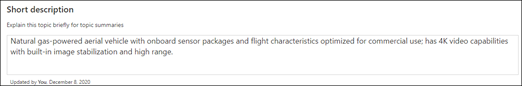
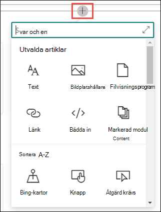

# Skapa ett nytt ämneCreate a new topic 

I Viva Topics kan du skapa ett nytt ämne om ett ämne inte upptäcks genom indexering eller om AI-tekniken inte hittar tillräckligt med bevis för att etablera det som ett ämne.In Viva Topics, you can create a new topic if one is not discovered through indexing or if the AI technology did not find enough evidence to establish it as a topic.

> [!Note] 
> Observera att informationen i ett manuellt skapat ämne är synlig för alla användare som har behörighet att visa ämnet medan information i ett ämne som har samlats av AI är säkerhets trim.While information in a topic that is gathered by AI is [security trimmed](topic-experiences-security-trimming.md), note that information in a manually created topic is visible to all users who have permissions to view the topic. 

## KravRequirements

Om du vill skapa ett nytt ämne måste du:To create a new topic, you need to:
- Ha en Viva Topics-licens.Have a Viva Topics license.
- Ha behörighet till [**vem som kan skapa eller redigera ämnen.**](https://docs.microsoft.com/microsoft-365/knowledge/topic-experiences-user-permissions)Have permissions to [**Who can create or edit topics**](https://docs.microsoft.com/microsoft-365/knowledge/topic-experiences-user-permissions). Knowledge admins can give users this permission in the Viva Topics topic permissions settings.Knowledge admins can give users this permission in the Viva Topics topic permissions settings. 

> [!Note] 
> Användare som har behörighet att hantera ämnen i ämnescentret (knowledge managers) har redan behörighet att skapa och redigera ämnen.Users who have permission to manage topics in the topic center (knowledge managers) already have permissions to create and edit topics.

## Så här skapar du ett ämneTo create a topic

Du kan skapa ett nytt ämne från två platser:You can create a new topic from two locations:

- Startsidan för Ämnescenter: Alla  licensierade användare med behörigheten Vem kan skapa eller redigera ämnen (deltagare) kan skapa ett nytt ämne från ämnescentret genom att välja menyn Nytt och sedan välja <b>Sidan Ämne.</b> <b></b>Topic center home page: Any licensed user with the **Who can create or edit topics** permission (contributors) can create a new topic from the topic center by selecting the <b>New</b> menu and select <b>Topic page</b>.  

       

- Sidan Hantera ämnen: Alla licensierade användare som har behörigheten Vem kan hantera ämnen (knowledge managers) kan skapa ett nytt ämne från sidan Hantera ämnen i Ämnescenter genom att välja <b>Sidan Nytt ämne.</b> Manage topics page:  Any licensed user who has **Who can manage topics** permission (knowledge managers) can create a new topic from the Manage topics page in the Topic Center by selecting <b>New topic page</b>.  

       

### Så här skapar du ett nytt ämne:To create a new topic:

1. I avsnittet **Namnge det här** avsnittet skriver du namnet på det nya avsnittet.In the **Name this topic** section, type the name of the new topic.

       

2. I avsnittet <b>Alternativa namn</b> skriver du andra namn som ämnet kan hänvisas till.In the <b>Alternate Names</b> section, type any other names that the topic might be referred to. 

       
3. Skriv <b>några</b> meningar som beskriver ämnet i avsnittet Beskrivning.In the <b>Description</b> section, type a couple of sentences that describe the topic. 

     

4. I avsnittet <b>Fästa personer kan</b> du fästa en person för att visa personen som ämnesexpert i ämnet.In the <b>Pinned people</b> section, you can "pin" a person to show them as a subject matter expert on the topic. Börja med att skriva in <b></b> användarens namn eller e-postadress i rutan lägg till en ny användare och välj sedan den användare du vill lägga till i sökresultatet.Begin by typing their name or email address in the <b>add a new user</b> box, and then select the user you want to add from the search results. Du kan även "ta bort" dem genom att välja ikonen Ta bort <b>från listan</b> på användarkortet.You can also "unpin" them by selecting the <b>Remove from list</b> icon on the user card. Du kan också dra personen för att ändra ordningen som listan med personer visas.You can also drag the person to change the order that the list of people appear.
 
     

5. I avsnittet <b>Fästa filer och sidor kan</b> du lägga till eller "fästa" en fil eller en SharePoint-webbplatssida som är kopplad till ämnet.In the <b>Pinned files and pages</b> section, you can add or "pin" a file or SharePoint site page that is associated to the topic.

    
 
    Om du vill lägga till en ny fil väljer du Lägg <b>till,</b>väljer SharePoint-webbplatsen från ofta besökta eller följda webbplatser och väljer sedan filen från webbplatsens dokumentbibliotek.To add a new file, select <b>Add</b>, select the SharePoint site from your Frequent or Followed sites, and then select the file from the site's document library.

    Du kan också använda alternativet <b>Från en länk för</b> att lägga till en fil eller sida genom att ange URL-adressen.You can also use the <b>From a link</b> option to add a file or page by providing the URL. 

6.  I <b>avsnittet Relaterade</b> webbplatser visas webbplatser som har information om ämnet.The <b>Related sites</b> section shows sites that have information about the topic. 

     

    Du kan lägga till en relaterad webbplats genom att välja <b>Lägg</b> till och sedan antingen söka efter webbplatsen eller välja den i listan med ofta besökta eller senaste webbplatser.You can add a related site by selecting <b>Add</b> and then either searching for the site, or selecting it from your list of Frequent or Recent sites. 
    
     

7. I <b>avsnittet Relaterade</b> ämnen visas kopplingar som finns mellan olika ämnen.The <b>Related topics</b> section shows connections that exist between topics. Du kan lägga till en anslutning <b></b> till ett annat ämne genom att välja knappen Anslut till ett relaterat ämne, skriva namnet på det relaterade ämnet och välja det i sökresultatet.You can add a connection to a different topic by selecting the <b>Connect to a related topic</b> button, and then typing the name of the related topic, and selecting it from the search results. 

      

    Du kan sedan ge en beskrivning av hur ämnena är relaterade och välja <b>Uppdatera.</b>You can then give a description of how the topics are related, and select <b>Update</b>. 

     

   Det relaterade ämnet som du lagt till visas som ett anslutet ämne.The related topic you added will display as a connected topic.

     

8. Du kan också lägga till statiska objekt på sidan (t.ex. text, bilder eller länkar) genom att välja ikonen för arbetsytan, som du hittar under den korta beskrivningen.You can also add static items to the page (such as text, images, or links) by selecting the canvas icon, which you can find below the short description. När du markerar den öppnas SharePoint-verktygslådan där du kan välja objektet du vill lägga till på sidan.Selecting it will open the SharePoint toolbox from which you can choose the item you want to add to the page.

     

9. Välj **Publicera** för att spara ändringarna.Select **Publish** to save your changes. 

När du har publicerat sidan visas ämnesnamn, alternativt namn, beskrivning och fästa personer för alla licensierade användare som visar ämnet.After you publish the page, the topic name, alternate name, description, and pinned people will display to all licensed users who view the topic. Specifika filer, sidor och webbplatser visas bara på ämnessidan om visningsprogrammet har Office 365-behörighet till objektet.Specific files, pages, and sites will only appear on the topic page if the viewer has Office 365 permissions to the item. 

## Se ävenSee also

  

