# Redigera ett befintligt ämne i Microsoft Viva-ämnen 

 

> [!VIDEO https://www.microsoft.com/videoplayer/embed/RE4LA4n]  

 

Du kan redigera ett befintligt ämne i Viva-ämnen. Du kan behöva göra det här om du vill korrigera eller lägga till ytterligare information på en befintlig ämnessida. 

> [!Note] 
> Observera att informationen om avsnittet och personinformationen som du lägger till manuellt när du redigerar ett befintligt ämne är synlig för alla användare som har behörighet att visa avsnitt medan information i ett ämne som har samlats av AI är säkerhets trimad. 

## Krav

Om du vill redigera ett befintligt ämne måste du:
- Ha en Viva Topics-licens.
- Har behörighet till [**Vem kan skapa eller redigera ämnen**](./topic-experiences-user-permissions.md). Knowledge admins can give users this permission in the Viva Topics topic permissions settings. 

> [!Note] 
> Användare som har behörighet att hantera ämnen i Ämnescenter (knowledge managers) har redan behörighet att skapa och redigera ämnen.

## Redigera en ämnessida

Användare som har **behörigheten** Vem kan skapa eller redigera ämnen kan redigera ett ämne <b></b> genom att öppna ämnessidan från en ämnesbrytning och sedan välja knappen Redigera längst upp till höger på ämnessidan. Ämnessidan kan också öppnas från startsidan för ämnescentret där du hittar alla ämnen som du har en anslutning till.

   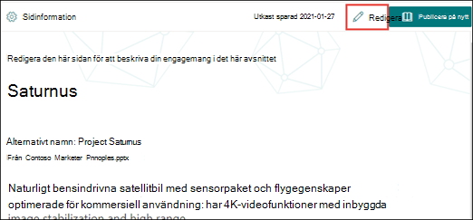   

Knowledge managers can also edit topics directly from the Manage Topics page by selecting the topic, and then <b>selecting Edit</b> in the toolbar.

   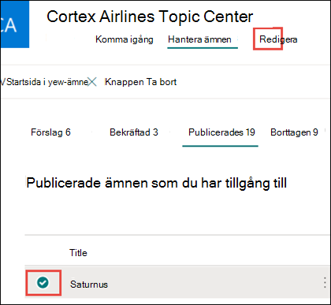   

### Redigera en ämnessida

1. På ämnessidan väljer du **Redigera**. På så sätt kan du göra ändringar efter behov på ämnessidan.

       

2. I <b>avsnittet Alternativa namn</b> skriver du alla andra namn som ämnet kan hänvisas till. 

    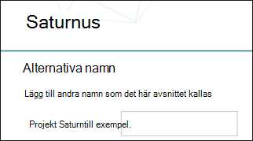   
3. Skriv <b>ett</b> par meningar som beskriver ämnet i avsnittet Beskrivning. Om det redan finns en beskrivning uppdaterar du den om det behövs.

     

4. I avsnittet <b>Fästa personer kan</b> du fästa en person så att de ser att de har en anslutning till ämnet (till exempel en ägare till en ansluten resurs). Börja med att skriva in <b></b> användarens namn eller e-postadress i rutan Lägg till en ny användare och välj sedan den användare du vill lägga till i sökresultatet. Du kan även "ta bort" dem genom att välja <b>ikonen Ta bort från</b> listan på användarkortet.
 
    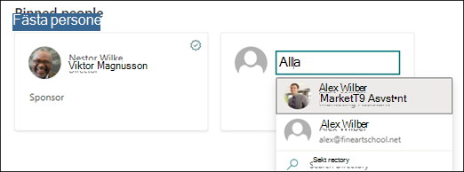 

    I <b>avsnittet Föreslagna personer</b> visas användare som AI tror kan vara anslutna till ämnet från deras anslutning till resurser om ämnet. Du kan ändra deras status från Föreslagen till Fäst genom att klicka på fästikonen på användarkortet.

    

5. I avsnittet <b>Fästa filer och sidor kan</b> du lägga till eller "fästa" en fil eller SharePoint-webbplatssida som är kopplad till avsnittet.

   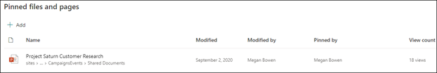 
 
    Om du vill lägga till en ny fil väljer du Lägg till <b>,</b>väljer SharePoint-webbplatsen från ofta besökta eller följda webbplatser och väljer sedan filen från webbplatsens dokumentbibliotek.

    Du kan också använda alternativet <b>Från en länk för</b> att lägga till en fil eller sida genom att ange URL-adressen. 

   > [!Note] 
   > Filer och sidor som du lägger till måste finnas inom samma Microsoft 365-klientorganisation. Om du vill lägga till en länk till en extern resurs i ämnet kan du lägga till den via ikonen för arbetsytan i steg 9.

6. I <b>avsnittet Föreslagna filer och sidor</b> visas filer och sidor som AI föreslår för att associeras till ämnet.

    

    Du kan ändra en föreslagen fil eller sida till en fäst fil eller sida genom att välja ikonen fäst.

7.  I <b>avsnittet Relaterade</b> webbplatser visas webbplatser som har information om ämnet. 

    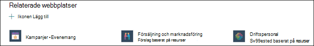 

    Du kan lägga till <b></b> en relaterad webbplats genom att välja Lägg till och sedan söka efter webbplatsen eller välja den i listan med vanliga eller senaste webbplatser. 
    
    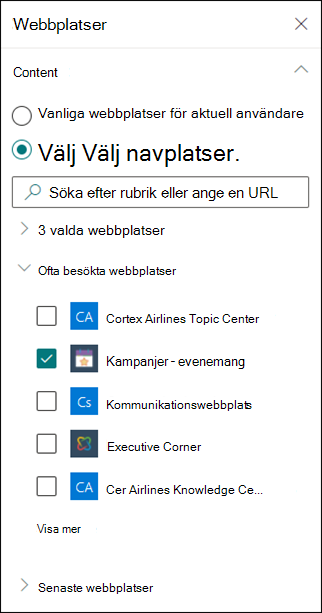 

8. I <b>avsnittet Närliggande</b> information visas kopplingar mellan olika ämnen. Du kan lägga till en anslutning <b></b> till ett annat ämne genom att välja knappen Anslut till ett relaterat ämne, skriva namnet på det relaterade ämnet och välja det i sökresultatet. 

   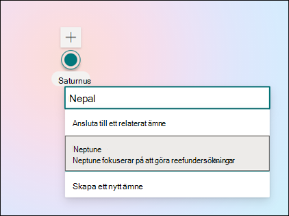   

    Du kan sedan ge en beskrivning av hur ämnena är relaterade och välja <b>Uppdatera</b>. 

   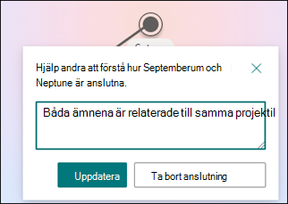  

   Det relaterade ämnet du har lagt till visas som ett anslutet ämne.

   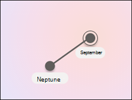  

   Om du vill ta bort ett relaterat ämne markerar du det ämne du vill ta bort och väljer sedan <b>ikonen Ta bort</b> ämne. 
 
      

   Välj sedan Ta <b>bort</b>. 

   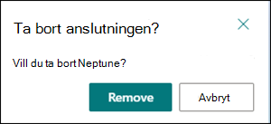  

9. Du kan också lägga till statiska objekt på sidan, t.ex. text, bilder eller länkar, genom att välja ikonen för arbetsytan, som du hittar under den korta beskrivningen. När du markerar den öppnas SharePoint-verktygslådan där du kan välja objektet du vill lägga till på sidan.

   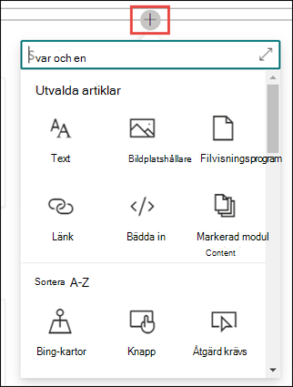  

10. Välj **Publicera** eller **Publicera på nytt** för att spara ändringarna. **Publicera på** nytt är ett tillgängligt alternativ om ämnet har publicerats tidigare.

## Se även

