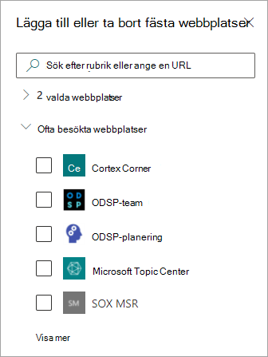
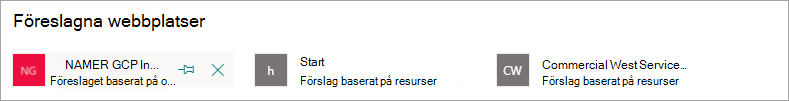

# Redigera ett befintligt ämne i Microsoft Viva-ämnen 

 

> [!VIDEO https://www.microsoft.com/videoplayer/embed/RE4LA4n]  

 

Du kan redigera ett befintligt ämne i Viva-ämnen. Du kan behöva göra det här om du vill korrigera eller lägga till ytterligare information på en befintlig ämnessida. 

> [!Note] 
> När information i ett ämne som har samlats av AI är säkerhets trimad är ämnesbeskrivningen och personinformationen som du lägger till manuellt när du redigerar ett befintligt ämne synlig för alla användare som har behörighet att visa ämnen. 

## Krav

Om du vill redigera ett befintligt ämne måste du:
- Ha en Viva Topics-licens.
- Har behörighet att [skapa eller redigera ämnen](./topic-experiences-user-permissions.md). Knowledge admins can give users this permission in the Viva Topics topic permissions settings. 

> [!Note] 
> Användare som har behörighet att hantera ämnen i ämnescentret (knowledge managers) har redan behörighet att skapa och redigera ämnen.

## Redigera en ämnessida

Användare som har *Vem* kan skapa eller redigera ämnesbehörighet kan redigera ett ämne genom att  öppna ämnessidan från en ämnesstrykning och sedan välja knappen Redigera längst upp till höger på ämnessidan. Ämnessidan kan också öppnas från startsidan för ämnescentret där du hittar alla ämnen som du har en anslutning till.

      

Knowledge managers can also edit topics directly from **the Manage topics** page by selecting the topic, and then selecting **Edit** in the toolbar.

   

### Redigera en ämnessida

1. På ämnessidan väljer du **Redigera**. På så sätt kan du göra ändringar efter behov på ämnessidan.

     

2. I avsnittet **Alternativa namn** skriver du andra namn som ämnet kan hänvisas till. 

    

3. Skriv **ett** par meningar som beskriver ämnet i avsnittet Beskrivning. Om det redan finns en beskrivning uppdaterar du den om det behövs.

     

4. I avsnittet **Fästa personer kan** du fästa en person så att de ser att de har en anslutning till ämnet (till exempel en ägare till en ansluten resurs). Börja med att skriva in  användarens namn eller e-postadress i rutan Lägg till en ny användare och välj sedan den användare du vill lägga till i sökresultatet. Du kan även "ta bort" dem genom att välja **ikonen Ta bort från** listan på användarkortet.
 
     

    I **avsnittet Föreslagna personer** visas användare som AI tror kan vara anslutna till ämnet från deras anslutning till resurser om ämnet. Du kan ändra deras status från Föreslagen till Fäst genom att klicka på fästikonen på användarkortet.

   

5. I avsnittet **Fästa filer och sidor kan** du lägga till eller "fästa" en fil SharePoint en webbplatssida som är kopplad till avsnittet.

   
 
    Om du vill lägga till en ny fil väljer du Lägg till **,** SharePoint webbplats från ofta besökta eller följda webbplatser och väljer sedan filen från webbplatsens dokumentbibliotek.

    Du kan också använda alternativet **Från en länk för** att lägga till en fil eller sida genom att ange URL-adressen. 

   > [!Note] 
   > Filer och sidor som du lägger till måste finnas inom samma Microsoft 365 klientorganisation. Om du vill lägga till en länk till en extern resurs i ämnet kan du lägga till den via ikonen för arbetsytan i steg 9.

6. I **avsnittet Föreslagna filer och sidor** visas filer och sidor som AI föreslår för att associeras till ämnet.

   

    Du kan ändra en föreslagen fil eller sida till en fäst fil eller sida genom att välja ikonen fäst.

7.  I avsnittet **Fästa webbplatser** kan du lägga till eller "fästa" en webbplats som är kopplad till avsnittet. 

    

    Om du vill lägga till en ny webbplats **väljer** du Lägg till och söker sedan efter webbplatsen eller väljer den i listan vanliga eller senaste webbplatser.
    
    

8. I **avsnittet föreslagna webbplatser** visas de webbplatser som AI föreslår för att associeras till ämnet. 

     

    Du kan ändra en föreslagen webbplats till en fäst webbplats genom att välja ikonen fäst.

<!---

7.  The <b>Related sites</b> section shows sites that have information about the topic. 

     

    You can add a related site by selecting <b>Add</b> and then either searching for the site, or selecting it from your list of Frequent or Recent sites. 
    
     

8. The <b>Related topics</b> section shows connections that exists between topics. You can add a connection to a different topic by selecting the <b>Connect to a related topic</b> button, and then typing the name of the related topic, and selecting it from the search results. 

      

    You can then give a description of how the topics are related, and select <b>Update</b>. 

     

   The related topic you added will display as a connected topic.

     

   To remove a related topic, select the topic you want to remove, then select the <b>Remove topic</b> icon. 
 
      

   Then select <b>Remove</b>. 

     

--->

9. Du kan också lägga till statiska objekt på sidan, t.ex. text, bilder eller länkar, genom att välja ikonen för arbetsytan, som du hittar under den korta beskrivningen. Om du markerar den SharePoint verktygslådan där du kan välja objektet du vill lägga till på sidan.

   

10. Välj **Publicera** eller **Publicera på nytt** för att spara ändringarna. **Publicera på** nytt är ett tillgängligt alternativ om ämnet har publicerats tidigare.

