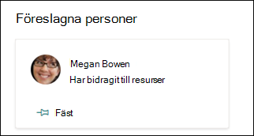

# Redigera ett befintligt ämne i Microsoft Viva-ämnenEdit an existing topic in Microsoft Viva Topics 

 

> [!VIDEO https://www.microsoft.com/videoplayer/embed/RE4LA4n]  

 

Du kan redigera ett befintligt ämne i Viva-ämnen.In Viva Topics, you can edit an existing topic. Du kan behöva göra det här om du vill korrigera eller lägga till ytterligare information på en befintlig ämnessida.You might need to do this if you want to correct or add additional information to an existing topic page. 

> [!Note] 
> När information i ett ämne som har samlats av AI är säkerhets trimad är ämnesbeskrivningen och personinformationen som du lägger till manuellt när du redigerar ett befintligt ämne synlig för alla användare som har behörighet att visa ämnen.While information in a topic that is gathered by AI is [security trimmed](topic-experiences-security-trimming.md), the topic description and people information that you manually add when editing an existing topic is visible to all users who have permissions to view topics. 

## KravRequirements

Om du vill redigera ett befintligt ämne måste du:To edit an existing topic, you need to:
- Ha en Viva Topics-licens.Have a Viva Topics license.
- Har behörighet att [skapa eller redigera ämnen](./topic-experiences-user-permissions.md).Have permissions to [create or edit topics](./topic-experiences-user-permissions.md). Knowledge admins can give users this permission in the Viva Topics topic permissions settings.Knowledge admins can give users this permission in the Viva Topics topic permissions settings. 

> [!Note] 
> Användare som har behörighet att hantera ämnen i ämnescentret (knowledge managers) har redan behörighet att skapa och redigera ämnen.Users who have permission to manage topics in the topic center (knowledge managers) already have permissions to create and edit topics.

## Redigera en ämnessidaHow to edit a topic page

Användare som har *Vem* kan skapa eller redigera ämnesbehörighet kan redigera ett ämne genom att  öppna ämnessidan från en ämnesstrykning och sedan välja knappen Redigera längst upp till höger på ämnessidan.Users who have the *Who can create or edit topics* permission can edit a topic by opening the topic page from a topic highlight, and then selecting the **Edit** button on the top right of the topic page. Ämnessidan kan också öppnas från startsidan för ämnescentret där du hittar alla ämnen som du har en anslutning till.The topic page can also be opened from the topic center home page where you can find all the topics that you have a connection to.

      

Knowledge managers can also edit topics directly from **the Manage topics** page by selecting the topic, and then selecting **Edit** in the toolbar.Knowledge managers can also edit topics directly from the **Manage topics** page by selecting the topic, and then selecting **Edit** in the toolbar.

   

### Redigera en ämnessidaTo edit a topic page

1. På ämnessidan väljer du **Redigera**.On the topic page, select **Edit**. På så sätt kan du göra ändringar efter behov på ämnessidan.This lets you make changes as needed to the topic page.

     

2. I avsnittet **Alternativa namn** skriver du andra namn som ämnet kan hänvisas till.In the **Alternate names** section, type any other names that the topic might be referred to. 

    

3. Skriv **ett** par meningar som beskriver ämnet i avsnittet Beskrivning.In the **Description** section, type a couple of sentences that describes the topic. Om det redan finns en beskrivning uppdaterar du den om det behövs.Or if a description already exists, update it if needed.

     

4. I avsnittet **Fästa personer kan** du fästa en person så att de ser att de har en anslutning till ämnet (till exempel en ägare till en ansluten resurs).In the **Pinned people** section, you can "pin" a person to show them as having a connection the topic (for example, an owner of a connected resource). Börja med att skriva in  användarens namn eller e-postadress i rutan Lägg till en ny användare och välj sedan den användare du vill lägga till i sökresultatet.Begin by typing their name or email address in the **Add a new user** box, and then selecting the user you want to add from the search results. Du kan även "ta bort" dem genom att välja **ikonen Ta bort från** listan på användarkortet.You can also "unpin" them by selecting the **Remove from list** icon on the user card.
 
     

    I **avsnittet Föreslagna personer** visas användare som AI tror kan vara anslutna till ämnet från deras anslutning till resurser om ämnet.The **Suggested people** section shows users that AI thinks might be connected to the topic from their connection to resources about the topic. Du kan ändra deras status från Föreslagen till Fäst genom att klicka på fästikonen på användarkortet.You can change their status from Suggested to Pinned by selecting the pin icon on the user card.

   

5. I avsnittet **Fästa filer och sidor kan** du lägga till eller "fästa" en fil SharePoint en webbplatssida som är kopplad till avsnittet.In the **Pinned files and pages** section, you can add or "pin" a file or SharePoint site page that is associated to the topic.

   
 
    Om du vill lägga till en ny fil väljer du Lägg till **,** SharePoint webbplats från ofta besökta eller följda webbplatser och väljer sedan filen från webbplatsens dokumentbibliotek.To add a new file, select **Add**, select the SharePoint site from your Frequent or Followed sites, and then select the file from the site's document library.

    Du kan också använda alternativet **Från en länk för** att lägga till en fil eller sida genom att ange URL-adressen.You can also use the **From a link** option to add a file or page by providing the URL. 

   > [!Note] 
   > Filer och sidor som du lägger till måste finnas inom samma Microsoft 365 klientorganisation.Files and pages that you add must be located within the same Microsoft 365 tenant. Om du vill lägga till en länk till en extern resurs i ämnet kan du lägga till den via ikonen för arbetsytan i steg 9.If you want to add a link to an external resource in the topic, you can add it through the canvas icon in step 9.

6. I **avsnittet Föreslagna filer och sidor** visas filer och sidor som AI föreslår för att associeras till ämnet.The **Suggested files and pages** section shows files and pages that AI suggests to be associated to the topic.

   

    Du kan ändra en föreslagen fil eller sida till en fäst fil eller sida genom att välja ikonen fäst.You can change a suggested file or page to a pinned file or page by selecting the pinned icon.

7.  I avsnittet **Fästa webbplatser** kan du lägga till eller "fästa" en webbplats som är kopplad till avsnittet.In the **Pinned sites** section, you can add or “pin” a site that is associated to the topic. 

    

    Om du vill lägga till en ny webbplats **väljer** du Lägg till och söker sedan efter webbplatsen eller väljer den i listan vanliga eller senaste webbplatser.To add a new site, select **Add** and then either search for the site, or select it from your list of Frequent or Recent sites.
    
    

8. I **avsnittet föreslagna webbplatser** visas de webbplatser som AI föreslår för att associeras till ämnet.The **Suggested sites** section shows the sites that AI suggests to be associated to the topic. 

     

    Du kan ändra en föreslagen webbplats till en fäst webbplats genom att välja ikonen fäst.You can change a suggested site to a pinned site by selecting the pinned icon.

<!---

7.  The <b>Related sites</b> section shows sites that have information about the topic. 

     

    You can add a related site by selecting <b>Add</b> and then either searching for the site, or selecting it from your list of Frequent or Recent sites. 
    
     

8. The <b>Related topics</b> section shows connections that exists between topics. You can add a connection to a different topic by selecting the <b>Connect to a related topic</b> button, and then typing the name of the related topic, and selecting it from the search results. 

      

    You can then give a description of how the topics are related, and select <b>Update</b>. 

     

   The related topic you added will display as a connected topic.

     

   To remove a related topic, select the topic you want to remove, then select the <b>Remove topic</b> icon. 
 
      

   Then select <b>Remove</b>. 

     

--->

9. Du kan också lägga till statiska objekt på sidan, t.ex. text, bilder eller länkar, genom att välja ikonen för arbetsytan, som du hittar under den korta beskrivningen.You can also add static items to the page — such as text, images, or links - by selecting the canvas icon, which you can find below the short description. Om du markerar den SharePoint verktygslådan där du kan välja objektet du vill lägga till på sidan.Selecting it will open the SharePoint toolbox from which you can choose the item you want to add to the page.

   

10. Välj **Publicera** eller **Publicera på nytt** för att spara ändringarna.Select **Publish** or **Republish** to save your changes. **Publicera på** nytt är ett tillgängligt alternativ om ämnet har publicerats tidigare.**Republish** will be your available option if the topic has been published previously.

