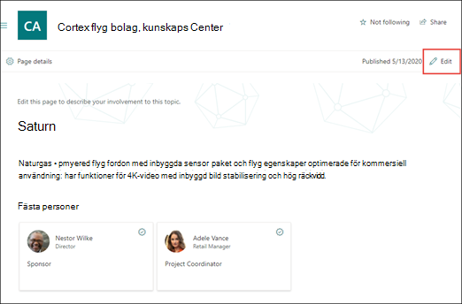

# Redigera ett befintligt ämne (för hands version)

> [!Note] 
> Innehållet i den här artikeln gäller för projekt cortex privat för hands version. [Läs mer om Project Cortex](https://aka.ms/projectcortex).

I avsnitts upplevelser kan du redigera ett befintligt ämne. Du kan behöva göra det här om du vill korrigera eller lägga till ytterligare information på en befintlig ämnes sida. 

## Krav

Om du vill redigera ett befintligt ämne måste du:
- Har en licens för ämne.
- Har behörighet till [**vem som kan skapa eller redigera ämnen**](https://docs.microsoft.com/microsoft-365/knowledge/topic-experiences-user-permissions). Kunskaps administratörer kan ge användarna den här behörigheten i avsnittet behörigheter för kunskaps nätverk. 

> [!Note] 
> Användare som har behörighet att hantera ämnen i ämnes Center (kunskaps chef) har redan behörighet att skapa och redigera ämnen.

## Redigera en ämnes sida

Om du har behörighet att redigera en ämnes sida, kommer du att kunna se **redigering** längst upp till höger på sidan när du har öppnat avsnittet.

      

1. På sidan ämne väljer du **Redigera**.

2. Gör de ändringar du behöver på sidan. Detta inkluderar uppdateringar av följande fält:

    -  Alternativa namn
    -  Beskrivning
    -  Fästa personer
    -  Filer och sidor
    -  Sidor

    Du kan också lägga till statiska objekt på sidan, till exempel text, bilder eller länkar genom att välja ikonen för arbets ytan.

3. Välj **publicera** för att spara ändringarna.

## Se även

  

