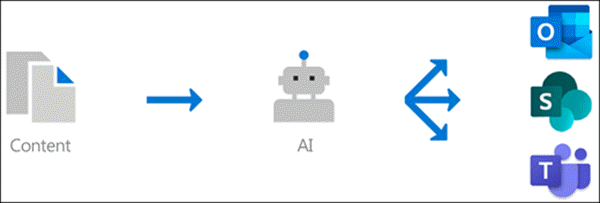

# 0verview för kunskaps hantering (för hands version)

> [!Note] 
> Innehållet i den här artikeln gäller för projekt cortex privat för hands version. [Lär dig mer om Project cortex](https://aka.ms/projectcortex) 

Kunskaps hantering använder Microsoft AI-teknologi, Microsoft 365, Delve, sökning och andra komponenter och tjänster för att bygga ett kunskaps nätverk i din Microsoft 365-miljö. 

      

Målet är att leverera information till användare i program som de använder varje dag, till exempel Outlook, teams och SharePoint.

Användarna kan till exempel se okända villkor i deras e-post, SharePoint-webbplatser eller i team-konversationer, som de vill veta mer om. Kunskaps hantering använder AI för att automatiskt söka efter och identifiera dessa **ämnen**och sammanfattar information om dem, till exempel en kort beskrivning, ämnes experter på ämnet och webbplatser, filer och sidor som är relaterade till det. Du kan välja att uppdatera ämnes informationen efter behov. Du kan sedan göra de avsnitt tillgängliga för användarna, vilket innebär att för varje förekomst av avsnittet som visas i program som Outlook, grupper och SharePoint markeras texten. Användare kan välja att välja ämne för att lära dig mer om det i avsnitts informationen.

## Avsnitts identifiering

Kunskaps hantering använder Microsoft AI-teknologi till att söka efter **ämnen** i din Office 365-miljö.

Ett ämne är en fras eller en term som är organiserad eller viktig. Den har en specifik innebörd för organisationen och har resurser relaterade till det som kan hjälpa folk förstå vad det är och få mer information om den.

När ett ämne identifieras skapas en **ämnes sida** för den som innehåller information som samlats in genom identifiering av ämnen, till exempel:

- En kort beskrivning av ämnet.
- Användare som kan vara kunskapsbaserade i avsnittet.
- Filer, sidor och webbplatser som är relaterade till avsnittet.

## Hantering av ämnen

Hantering av ämnen finns i organisationens **ämnes Center**. Webbplatsen för ämnes Center skapas under installationen och fungerar som din grupp kunskap för organisationen. Den innehåller en lista över alla ämnen som upptäckts i din miljö, samt alla sidor som skapats för dessa ämnen. 

Användare som har rätt behörighet kan göra följande i ämnes centret:

- Bekräfta eller avvisa ämnen som upptäckts i klient organisationen.
- Skapa nya ämnen manuellt efter behov (till exempel om det inte finns tillräckligt med information för att det ska identifieras via AI).
- Redigera befintliga avsnitts sidor. 

Mer information finns i [arbeta med ämne i ämnes centret](work-with-topics.md) .  

## Administratörs kontroller

Med administratörs kontroller i Microsoft 365 Admin Center kan du hantera kunskaps nätverk. De tillåter en Microsoft 365 global-eller SharePoint-administratör att:

- Kontrol lera vilka användare i organisationen som har tillstånd att se ämnen i sina klient program eller i Sök resultat i SharePoint.
- Kontrol lera vilka SharePoint-webbplatser som ska crawlas för att söka efter avsnitt.
- Konfigurera avsnitts identifiering för att exkludera specifika termer som du inte vill ska vara ett ämne.
- Kontrol lera vilka användare som kan bekräfta eller avvisa ämnen i ämnes centret.
- Kontrol lera vilka användare som kan skapa och redigera ämnen i ämnes centret.

Mer information finns i [Hantera kunskaps nätverk](manage-knowledge-network.md) . 

## Ämnes underavsnitt

AI fungerar fort löp ande för att ge förslag på att förbättra dina ämnen när ändringar sker i miljön.

Användare som du tillåter åtkomst till för att se ämnen i deras dagliga arbete får göra förslag för att förbättra dem. Om en användare till exempel visar ämnes sidan och ser information som är felaktig eller måste läggas till kan en länk på ämnes sidan skicka en förfrågan om att uppdatera informationen.

Dessutom kan användare med rätt behörighet tagga objekt som en Teams-konversation som är relevant för ett ämne och lägga till dem i ett visst ämne.

## Se även
[Konfigurera kunskaps hantering](set-up-knowledge-network.md) 
[Översikt över ämnes Center](topic-center-overview.md)
