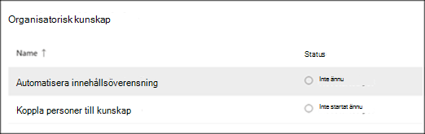
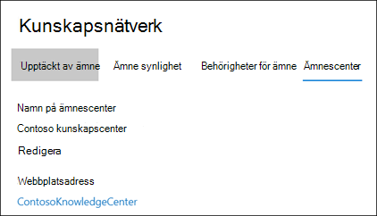
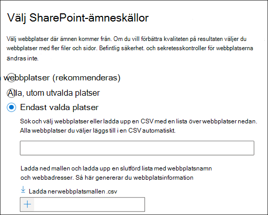
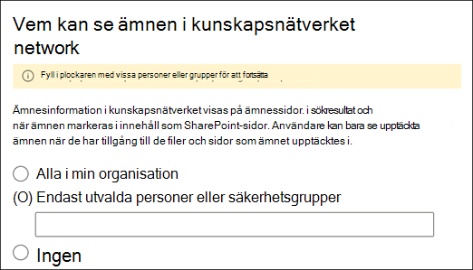
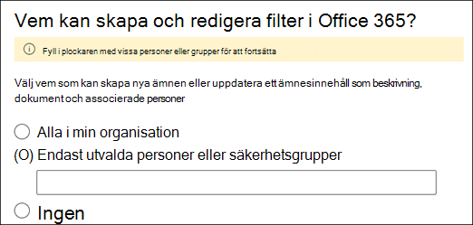
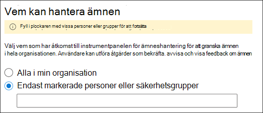
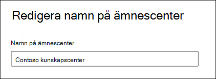

# Hantera din kunskaps Management Network (för hands version)Manage your knowledge management network (Preview)

> [!Note] 
> Innehållet i den här artikeln gäller för projekt cortex privat för hands version.The content in this article is for Project Cortex Private Preview. [Lär dig mer om Project cortex](https://aka.ms/projectcortex).[Find out more about Project Cortex](https://aka.ms/projectcortex).

När du [har konfigurerat kunskaps hanteringen](set-up-knowledge-network.md)kan du när som helst göra ändringar i konfigurations inställningarna via administrations centret för Microsoft 365.After you [set up knowledge management](set-up-knowledge-network.md), at any time afterwards an admin can make adjustments to your configuration settings through the Microsoft 365 admin center.

Du kan till exempel behöva justera dina inställningar för något av följande:For example, you may need to adjust your settings for any of the following:
- Lägga till nya SharePoint-källor i mina avsnitt.Add new SharePoint sources to mine topics.
- Ändra vilka användare som ska ha åtkomst till ämnen.Change which users will have access to topics.
- Ändra vilka användare som har behörighet att utföra uppgifter i ämnes centret.Change which users have permissions to do tasks on the topic center.
- Ändra namnet på ämnes CenterChange the name of your topic center

## KravRequirements 
Du måste ha global administratör eller administratörs behörighet för SharePoint för att kunna komma åt Microsoft 365 Admin Center och hantera organisationens kunskaps uppgifter.You must have Global Admin or SharePoint admin permissions to be able to access the Microsoft 365 admin center and manage Organizational knowledge tasks.

## Så här använder du inställningar för kunskaps hantering:To access knowledge management settings:

1. I administrations centret för Microsoft 365 väljer du **Konfigurera**och sedan avsnittet **organisations** information.In the Microsoft 365 admin center, select **Setup**, and then view the **Organizational Knowledge** section.
2. I avsnittet **organisationsinformation** klickar du på **Anslut personer till kunskap**.In the **Organizational Knowledge** section, click **Connect people to knowledge**. 

      

3. På sidan **Anslut personer till kunskap** väljer du **Hantera** för att öppna fönstret **kunskaps nätverks inställningar** .On the **Connect people to knowledge** page, select **Manage** to open the **Knowledge network settings** pane. 

      

## Ändra hur kunskaps nätverket hittar ämnenChange how the knowledge network can find topics

Välj fliken **identifiering** om du vill uppdatera dina val för avsnitts källor i SharePoint.Select the **Topic discovery** tab if you want to update your choices for  for SharePoint topic sources. Med den här inställningen kan du välja vilka SharePoint-webbplatser i din klient organisation som ska crawlas och mined för avsnitt.This setting let you select the SharePoint sites in your tenant that will be crawled and mined for topics.

1. På fliken **identifiering** , under **Välj SharePoint-ämnes källor**, väljer du **Redigera**.On the **Topic discovery** tab, under **Select SharePoint topic sources**, select **Edit**.
2. På sidan **Select SharePoint topic sources** väljer du vilka SharePoint-webbplatser som ska crawlas som källor för dina ämnen under identifiering.On the **Select SharePoint topic sources** page, select which SharePoint sites will be crawled as sources for your topics during discovery. Detta inkluderar:This includes: 
    a.a. **Alla webbplatser**: alla SharePoint-webbplatser i din klient organisation.**All sites**: All SharePoint sites in your tenant. Här fångar du aktuella och framtida webbplatser.This captures current and future sites. 
    b.b. **Alla, förutom markerade webbplatser**: Skriv namnen på de webbplatser du vill undanta.**All, except selected sites**: Type the names of the sites you want to exclude.  Du kan också ladda upp en lista med webbplatser som du inte vill ska ingå i sökningen.You can also upload a list of sites you want to opt out from discovery. Webbplatser som skapats i framtiden kommer att inkluderas som källor för avsnitts identifiering.Sites created in the future will be included as sources for topic discovery.  
    c.c. **Endast valda webbplatser**: Skriv in namnen på de webbplatser du vill ta med.**Only selected sites**: Type the names of the sites you want to include. Du kan också ladda upp en lista med webbplatser.You can also upload a list of sites. Webbplatser som skapats i framtiden kommer inte att ingå som källor för identifiering av ämnen.Sites created in the future will not be included as sources for topic discovery.  

      
   
    Om du har ett antal webbplatser som du vill undanta (om du markerar **alla, förutom markerade webbplatser**) eller inkludera (om du valde **endast markerade webbplatser**) kan du välja att överföra en CSV-fil med webbplats namn och URL-adresser.If you have a number of sites that you want to exclude (if you select **All, except selected sites**) or include (if you selected **Only selected sites**), you can choose to upload a CSV file with the site names and URLs. Du kan välja **Hämta webbplatsmall. csv** om du vill använda CSV-mallfilen.You can select **Download site template .csv** if you want to use the CSV template file.

3. Välj **Spara**.Select **Save**.

##  Ändra vem som kan se ämnen i din organisationChange who can see topics in your organization

Välj fliken **identifiering** om du vill uppdatera vem i organisationen kan se upptäckta avsnitt i Sök Resultat och när ämnen markeras i innehåll som SharePoint-sidor.Select the **Topic discovery** tab if you want to update who in your organization can see discovered topics in search results and when topics are highlighted in content like SharePoint pages.

1. På fliken **identifiering** , under **vem kan se ämnen i kunskaps nätverket**, väljer du **Redigera**.On the **Topic discovery** tab, under **Who can see topics in the knowledge network**, select **Edit**.
2. På sidan **vem kan se ämnen i kunskaps nätverk** väljer du vilka som kommer att ha till gång till ämnen, till exempel markerade ämnen, ämnes kort, ämnes svar i sökningar och avsnitts sidor.On the **Who can see topics in the knowledge network** page, you choose who will have access to topic details, such as highlighted topics, topic cards, topic answers in search, and topic pages. Du kan välja:You can select: 
    a.a. **Alla i organisationen****Everyone in your organization** 
    b.b. **Endast valda personer eller säkerhets grupper****Only selected people or security groups** 
    c.c. **Ingen****No one** 

       
3. Välj **Spara**.Select **Save**.  
 
> [!Note] 
> Med den här inställningen kan du välja en användare i organisationen, men endast användare som har kunskaps hanterings licenser tilldelade till dem kan visa ämnen.While this setting allows you to select any user in your organization, only users who have knowledge management licenses assigned to them will be able to view topics.

## Ändra vem som har behörighet att utföra uppgifter i ämnes centretChange who has permissions to do tasks on the topic center

Välj fliken **behörigheter för ämne** om du vill uppdatera vilka som har behörighet att göra följande på sidan avsnitts Center:Select the **Topic permissions** tab if you want to update who has permissions to do the following in the topic center page:

- Vilka användare som kan skapa och redigera ämnen: skapa nya avsnitt som inte hittades under identifiering eller redigera befintliga avsnitts sidor.Which users can create and edit topics: Create new topics that were not found during discovery or edit existing topic page details.
- Vilka användare som kan hantera ämnen: bekräfta eller avvisa upptäckta ämnen.Which users can manage topics: Confirm or reject discovered topics.

Så här uppdaterar du vilka som har behörighet att skapa och redigera ämnen:To update who has permissions to create and edit topics:

1. På fliken **behörigheter** under **vem kan skapa och redigera ämnen**väljer du **Redigera**.On the **Topic permissions** tab, under **Who can create and edit topics**, select **Edit**. 
2. På sidan **vem som kan skapa och redigera ämnen** kan du välja:On the **Who can create and edit topics** page, you can select: 
    a.a. **Alla i organisationen****Everyone in your organization** 
    b.b. **Endast valda personer eller säkerhets grupper****Only selected people or security groups** 

       

3. Välj **Spara**.Select **Save**. 

Så här uppdaterar du vilka som har behörighet att hantera ämnen:To update who has permissions to manage topics:

1. Välj **Redigera**under **vilka kan hantera ämnen**på fliken **behörigheter** .On the **Topic permissions** tab, under **Who can manage topics**, select **Edit**. 
2. På sidan **vem kan hantera ämnen** kan du välja:On the **Who can manage topics** page, you can select: 
    a.a. **Alla i organisationen****Everyone in your organization** 
    b.b. **Markerade personer eller säkerhets grupper****Selected people or security groups** 

       

3. Välj **Spara**.Select **Save**. 

##  Uppdatera namnet på ämnes CenterUpdate your topic center name

Välj fliken för **avsnitts Center** om du vill uppdatera namnet på ditt ämnes Center.Select the **Topic center** tab if you want to update the name of your topic center. 

1. Välj **Redigera**under **ämnes Center namn**på fliken **ämnes Center** .On the **Topic center** tab, under **Topic center name**, select **Edit**.
2. Skriv det nya namnet på ämnes centret i rutan **namn** på sidan **Redigera ämnes Center namn** .On the **Edit topic center name** page, in the **Topic center name** box, type the new name for your topic center.
3. Välj **Spara**Select **Save**

       

## Se ävenSee also

  

