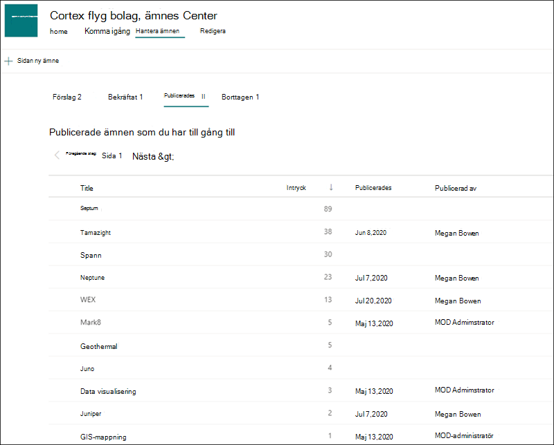
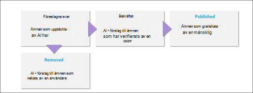

# Hantera ämnen i ämnes centret (för hands version)

> [!Note] 
> Innehållet i den här artikeln gäller för projekt cortex privat för hands version. [Läs mer om Project Cortex](https://aka.ms/projectcortex).

 

> [!VIDEO https://www.microsoft.com/videoplayer/embed/RE4LxDx]  

 

I ämnes Center kan en kunskaps chef Visa sidan **hantera ämnen** för att granska ämnen som har identifierats på SharePoint source locations, enligt vad som anges av din kunskaps administratör.  

      

Kunskaps cheferna hjälper till att hitta upptäckta ämnen via ämnes livs cykeln i vilka ämnen är:

- Föreslagna: ett ämne identifieras av AI och har tillräckligt med stöd resurser, anslutningar och egenskaper för att uppfylla ämnets tröskel.
- Bekräftat: ett ämne som föreslås av AI är validerat. Validering sker genom bekräftelse från en kunskaps administratör. Ett ämne kan dessutom bekräftas om minst två användare ger positiv feedback genom feedback om ämnen som är giltigt.
- Borttaget: ett ämne nekas av en kunskaps administratör och kommer inte längre att synas för tittarna. Ämnet kan vara i vilket tillstånd som helst när det tas bort (föreslås eller bekräftas). 
- Publicerat: ett bekräftat ämne som har uppdaterats manuellt.

      

## Krav

Om du vill hantera ämnen i ämnes centret måste du:
- Har en licens för ämne.
- Har behörighet till [**vem som kan hantera ämnen**](https://docs.microsoft.com/microsoft-365/knowledge/topic-experiences-user-permissions). Kunskaps administratörer kan ge användarna den här behörigheten i avsnittet behörigheter för kunskaps nätverk. 

Du kommer inte att kunna se sidan Hantera ämnen i ämnes centret om du inte har behörigheten **vem kan hantera ämnen** .

I ämnes Center kan en kunskaps chef granska ämnen som har identifierats i de SharePoint source locations som du har angett och kan antingen bekräfta eller avvisa dem. En kunskaps chef kan också skapa och publicera nya avsnitts sidor om en sådan inte fanns i ämnes identifieringen eller redigera befintliga om de måste uppdateras.

## Granska förslag till ämnen

På sidan avsnitt Center hantera ämnen visas de avsnitt som upptäckts på dina angivna SharePoint source locations på fliken **föreslagen** . En kunskaps chef kan granska obekräftade ämnen och välja att bekräfta eller avvisa dem.

Så här granskar du ett föreslaget ämne:

1. På sidan **hantera ämnen** väljer du fliken **föreslag** , markerar avsnittet för att öppna sidan ämne. 

2. På sidan ämne granskar du sidan ämne och väljer **Redigera** om du behöver göra några ändringar på sidan.

3. När du har granskat avsnittet går du tillbaka till sidan Hantera ämnen. För det markerade ämnet kan du:

   - Markera kryss rutan för att bekräfta ämnet.
    
   - Välj **x** om du vill avvisa avsnittet.

    Bekräftade ämnen kommer att tas bort från den **föreslagna** listan och visas nu i listan **bekräftat** .

    Avvisade ämnen tas bort från den **föreslagna** listan och visas nu på fliken **Borttaget** .

     

## Bekräftade ämnen

På sidan Hantera ämnen visas ämnen som upptäckts på dina angivna SharePoint-källor och har bekräftats av en kunskaps chef eller "Fully source" som bekräftats av två eller fler personer via kort återkopplings funktionen på fliken **bekräftad** . Om det behövs kan en användare som har behörighet att hantera ämnen granska bekräftade ämnen och välja att avvisa dem.

Så här granskar du ett bekräftat ämne:

1. På fliken **bekräftat** markerar du avsnittet för att öppna sidan ämne. 

2. På sidan ämne granskar du sidan ämne och väljer **Redigera** om du behöver göra några ändringar på sidan.

Observera att du fortfarande kan välja att avvisa ett bekräftat ämne.  Det gör du genom att gå till det markerade avsnittet i listan bekräftat och välja **x** om du vill avvisa avsnittet.

## Publicerade ämnen
Publicerade ämnen har redigerats så att viss information alltid visas för alla som stöter på sidan. Manuellt skapade avsnitt finns här.

