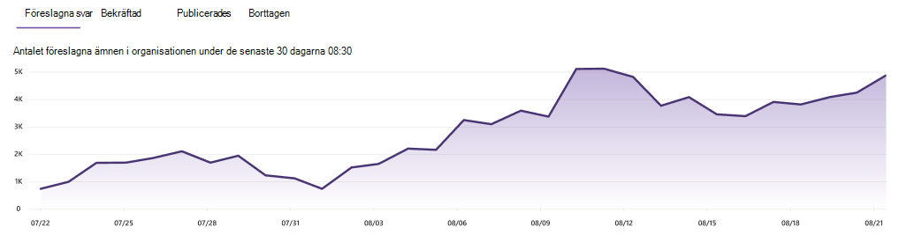

# Hantera ämnen i ämnescentret i Microsoft Viva-ämnen

 

> [!VIDEO https://www.microsoft.com/videoplayer/embed/RE4LxDx]  

 

I ämnescentret viva ämnen kan en  knowledge manager visa sidan Hantera ämnen för att granska ämnen som har identifierats på de källplatser som angetts av din kunskapsadministratör.  

     

## Ämnesfaser

Knowledge managers help to guide discovered topics through the various topic lifecycle stages: **Suggested**, **Confirmed**, **Published**, and **Removed**.

    

- **Förslag:** Ett ämne har identifierats med AI och har tillräckligt med stödresurser, anslutningar och egenskaper. (De är markerade som ett **föreslaget ämne** i användargränssnittet.)

- **Bekräftad:** Ett ämne som har identifierats av AI och har validerats. Validering av avsnitt inträffar när något av följande inträffar:

   - En knowledge manager bekräftar ett ämne. En knowledge manager [bekräftar ett ämne](manage-topics.md#confirmed-topics) på sidan **Hantera** ämnen.

   - Flera användare bekräftar ett ämne. Det måste finnas ett netto av två positiva röster som tagits emot från användare som har röstat med hjälp av feedbackmekanismen för ämneskortet. Om en användare till exempel har röstat på positivt och en användare har röstat nej till ett visst ämne, skulle du fortfarande behöva två positiva röster för att ämnet ska bekräftas.
 
- **Publicerades**: Ett ämne som har använts för utsmning. Manuella redigeringar har gjorts för att förbättra kvaliteten eller så har de skapats av en användare.

- **Tas** bort : Ett ämne som har avvisats och inte längre kommer att visas för läsare. Ett ämne kan tas bort i valfri stat (förslag, bekräftade eller publicerade). Ämnesborttagning inträffar när något av följande inträffar:

   - En knowledge manager tar bort ett ämne. En knowledge manager tar bort ett ämne på **sidan Hantera** ämnen.

   - Flera användare rop negativa röster med hjälp av feedbackmekanismen på ämneskortet. För att ett ämne ska kunna tas bort måste nettot av två negativa röster tas emot från användare. Om en användare till exempel har röstat nej och en användare har röstat positivt på ett visst ämne, skulle du ändå behöva två fler negativa röster för att ämnet ska tas bort.

  När ett publicerat ämne tas bort måste sidan med den curated informationen tas bort manuellt via ämnescentrets sidbibliotek.

> [!Note] 
> På **sidan Hantera ämnen** kan varje kunskapshanterare bara se ämnen där de har åtkomst till underliggande filer och sidor som är kopplade till avsnittet. Den här behörighets trimningen visas i listan med ämnen på flikarna **Föreslagna,** **Bekräftade,** **Publicerade** **och Borttagna.** I avsnittet antal visas dock det totala antalet i organisationen, oavsett behörighet.

## Krav

Om du vill hantera ämnen i ämnescentret måste du:
- Ha en Viva Topics-licens.

- Be den [**Vem hantera behörighet för**](./topic-experiences-user-permissions.md) ämnen. Knowledge admins can give users this permission in the Viva Topics topic permissions settings. 

Du kan inte visa sidan Hantera ämnen **i ämnescentret** om du inte har **behörigheten Vem kan hantera ämnen.**

I ämnescentret kan en knowledge manager granska ämnen som har identifierats på de källplatser du angett och bekräfta eller ta bort dem. En knowledge manager kan också skapa och publicera nya ämnessidor om en inte hittades i identifieringen av ämnen, eller redigera befintliga sidor om de behöver uppdateras.

## Granska föreslagna ämnen

På sidan **Hantera ämnen** visas ämnen som identifierats på SharePoint angivna platser för datakällan på **fliken** Förslag. Vid behov kan en kunskapshanterare granska ämnen som inte har bekräftats och välja att bekräfta eller ta bort dem.

    

Så här granskar du ett föreslaget ämne:

1. På sidan **Hantera ämnen** väljer du **fliken Förslag** och väljer sedan ämnet för att öppna ämnessidan.

2. På ämnessidan granskar du ämnessidan och väljer **Redigera** om du behöver göra ändringar på sidan. När du publicerar eventuella ändringar flyttas det här avsnittet till **fliken Publicerade.**

3. När du har granskat ämnet går du tillbaka till **sidan Hantera** ämnen. För det valda avsnittet kan du:

   - Välj bockmarkeringen för att bekräfta ämnet.
    
   - Välj **x om** du vill ta bort ämnet.

    Bekräftade ämnen tas bort från listan **Förslag** och visas nu i **den bekräftade** listan.

    Borttagna ämnen tas bort från **listan Förslag** och visas nu på fliken **Borttaget.**

### Kvalitetsresultat

Varje ämne som visas på **sidan Föreslagna** ämnen har tilldelats ett kvalitetsresultat. Kvalitetsresultatet är en reflektion av mängden information som medelvärdet ser för information om ämnet, med tanke på att varje användare kan se mer eller mindre information på grund av de behörigheter som de kan ha eller kanske inte har på informationen i ett ämne. 

Kvalitetsresultatet kan bidra till att ge insyn i de ämnen som innehåller mest information och kan vara användbart för att hitta ämnen som kan behöva redigeras manuellt. Ett ämne med lägre kvalitet kan till exempel vara ett resultat av att vissa användare inte har SharePoint-behörigheter till relevanta filer eller webbplatser som AI har inkluderat i ämnet. En deltagare kan sedan redigera ämnet så att det innehåller informationen (vid behov), som sedan kan visas för alla användare som kan visa ämnet.

### Intryck

I kolumnen Intryck visas hur många gånger ett ämne har **visats** för slutanvändarna. Det omfattar vyer via ämnessvarskort i sökningar och genom viktiga ämnen. Den återspeglar inte genomklickning på dessa ämnen, men att ämnet har visats. Kolumnen **Intryck visas** för ämnen på flikarna **Föreslagna**, **Bekräftade,** **Publicerade** och **Borttagna** på **sidan Hantera** ämnen.

## Bekräftade ämnen

På sidan **Hantera** ämnen visas ämnen som identifierats på dina angivna platser i SharePoint-källan och har bekräftats av en knowledge manager eller "crowdsourced" som bekräftas av ett nettot två eller fler personer (balansera negativa användarröster mot positiva användarröster) via feedbackmekanismen för kort visas på fliken **Bekräftad.** Om det behövs kan en användare med behörighet att hantera ämnen granska bekräftade ämnen och välja att avvisa dem.

Granska ett bekräftat ämne:

1. På fliken **Bekräftad** väljer du ämnet för att öppna ämnessidan.

2. På ämnessidan granskar du ämnessidan och väljer **Redigera** om du behöver göra ändringar på sidan.

Observera att du fortfarande kan välja att avvisa ett bekräftat avsnitt. Det gör du genom att gå  till det valda avsnittet på fliken Bekräftad och välja **x** om du vill avvisa ämnet.

## Publicerade ämnen

Publicerade ämnen har redigerats så att specifik information alltid visas för dem som stöter på sidan. Här listas även manuellt skapade ämnen.

   

## Instrumentpanel för antal ämnen

Med det här diagrammet i instrumentpanelsvyn kan du se antalet ämnen i Ämnescenter för Viva. I diagrammet visas antalet ämnen per livscykelfas för ämnen och även hur antal ämnen har trendat över tid. Knowledge managers can visually monitor the rate at which new topics are discovered by AI and the rate at which topics are getting confirmed or published by the knowledge manager or user actions.

Knowledge Managers might see a different count of topics represented in the list of topics on the **Manage topics** page than they see in the dashboard. Det beror på att en kunskapshanterare kanske inte har åtkomst till alla ämnen. Antalet som visas i instrumentpanelsvyn tas innan du använder behörighets trimning. 

   
