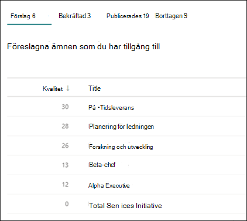
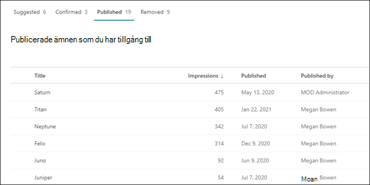

# Hantera ämnen i Ämnescenter 

 

> [!VIDEO https://www.microsoft.com/videoplayer/embed/RE4LxDx]  

 

I ämnescentret viva ämnen kan en  knowledge manager visa sidan Hantera ämnen för att granska ämnen som har identifierats i SharePoint-källplatser som angetts av din kunskapsadministratör.  

      

Knowledge managers help to guide discovered topics through the topic lifecycle in which topics are:

- Förslag: Ett ämne har identifierats av AI och har tillräckligt med stödresurser, anslutningar och egenskaper.
- Bekräftad: Ett ämne som har föreslagits av AI valideras. Valideringen utförs genom att en knowledge manager bekräftar detta. Ett ämne kan också bekräftas om minst två användare ger positiv feedback via feedbackfrågan på ämneskortet.
- Publicerades: Ett bekräftat ämne som har redigerats: manuell redigering har gjorts för att förbättra kvaliteten.
- Tas bort: Ett ämne avvisas av en kunskapshanterare och visas inte längre för tittare. Ämnet kan vara i valgivet läge när det tas bort (förslag, bekräftar eller publiceras). När ett publicerat ämne tas bort måste sidan med den curated informationen tas bort manuellt via ämnescentrets sidbibliotek.

      

> [!Note] 
> På sidan Hantera ämnen kan varje kunskapshanterare bara se ämnen där de har åtkomst till filerna och sidorna i ämnet. Det kommer att återspeglas i avsnitten som visas under flikarna Föreslagna, Bekräftade, Borttaget och Publicerade. I avsnittet antal visas dock det totala antalet i organisationen.

## Krav

Om du vill hantera ämnen i ämnescentret måste du:
- Ha en Viva Topics-licens.

- Ha [**behörigheten Vem kan hantera**](./topic-experiences-user-permissions.md) ämnen. Knowledge admins can give users this permission in the Viva Topics topic permissions settings. 

Du kan inte visa sidan Hantera ämnen i Ämnescenter om du inte har behörigheten Vem **kan hantera** ämnen.

I ämnescentret kan en knowledge manager granska ämnen som har identifierats på de SharePoint-källplatser du angett och antingen bekräfta eller avvisa dem. En knowledge manager kan också skapa och publicera nya ämnessidor om en inte hittades i identifieringen av ämnen, eller redigera befintliga sidor om de behöver uppdateras.

## Granska föreslagna ämnen

På sidan Ämnescenter Hantera ämnen visas ämnen som identifierats på dina angivna platser för SharePoint-källor på **fliken Förslag.** Vid behov kan en kunskapshanterare granska ämnen som inte har bekräftats och välja att bekräfta eller avvisa dem.

      

Så här granskar du ett föreslaget ämne:

1. På sidan **Hantera ämnen** väljer du **fliken Förslag** och väljer ämnet för att öppna ämnessidan. 

2. På ämnessidan granskar du ämnessidan och väljer **Redigera** om du behöver göra ändringar på sidan. När du publicerar eventuella ändringar flyttas det här avsnittet till **fliken Publicerade.**

3. När du har granskat ämnet går du tillbaka till sidan Hantera ämnen. För det valda avsnittet kan du:

   - Välj bockmarkeringen för att bekräfta ämnet.
    
   - Markera **x om** du vill avvisa ämnet.

    Bekräftade ämnen tas bort från listan **Förslag** och visas nu i **den bekräftade** listan.

    Avvisade ämnen tas bort från listan **Förslag** och visas nu på fliken **Borttaget.**

     

### Kvalitetsresultat

Varje ämne som visas på sidan Föreslagna ämnen har tilldelats <b>ett kvalitetsresultat.</b> Kvalitetsresultatet är en reflektion av mängden information som medelvärdet kan se för information om ämnet, med tanke på att varje användare kan se mer eller mindre information på grund av de behörigheter som de kan ha eller inte har på informationen i ett ämne. 

Kvalitetsresultatet kan bidra till att ge insyn i de ämnen som innehåller mest information och kan vara användbart för att hitta ämnen som kan behöva redigeras manuellt.  Ett ämne med lägre kvalitet kan till exempel vara ett resultat av att vissa användare inte har SharePoint-behörigheter till relevanta filer eller webbplatser som AI har inkluderat i ämnet. En deltagare kan sedan redigera ämnet så att det innehåller informationen (vid behov), som sedan kan visas för alla användare som kan visa ämnet.

Kvalitetsresultatet kan variera mellan 1 och 100. Ett nyligen upptäckt ämne får ett kvalitetsresultat på 0 tills två eller fler användare har visat det. Varje användares kvalitetsresultat bestäms av ett antal faktorer, till exempel mängden innehåll som visas för en specifik användare, som styrs av användarens behörigheter eftersom varje ämnessida har säkerhets trimning för AI-genererat innehåll. Kvalitetsresultatet som visas på fliken Föreslagna ämnen är det genomsnittliga resultatet för varje användares poäng.

### Intryck

I kolumnen Intryck visas hur många gånger ett ämne har <b>visats</b> för slutanvändarna. Det omfattar vyer via ämneskort i sökning, genom viktiga ämnen och genom vyer i Ämnescenter. Den återspeglar inte genomklickning på dessa ämnen, men att ämnet har visats. Kolumnen Intryck visas för ämnen på flikarna Föreslagna, Bekräftade, Publicerade och Borttagna på sidan Hantera ämnen.

## Bekräftade ämnen

På sidan Hantera ämnen visas ämnen som identifierats på dina angivna platser för SharePoint-källor och har bekräftats av en knowledge manager eller "crowd-sourced" som bekräftats av två eller flera personer via feedbackmekanismen för kortet på fliken Bekräftad.  Om det behövs kan en användare med behörighet att hantera ämnen granska bekräftade ämnen och välja att avvisa dem.

Granska ett bekräftat ämne:

1. På fliken **Bekräftad** väljer du ämnet för att öppna ämnessidan. 

2. På ämnessidan granskar du ämnessidan och väljer **Redigera** om du behöver göra ändringar på sidan.

Observera att du fortfarande kan välja att avvisa ett bekräftat avsnitt.  Det gör du genom att gå till det valda avsnittet i listan Bekräftad och välja **x** om du vill avvisa ämnet.

## Publicerade ämnen
Publicerade ämnen har redigerats så att specifik information alltid visas för dem som stöter på sidan. Här listas även manuellt skapade ämnen.

     