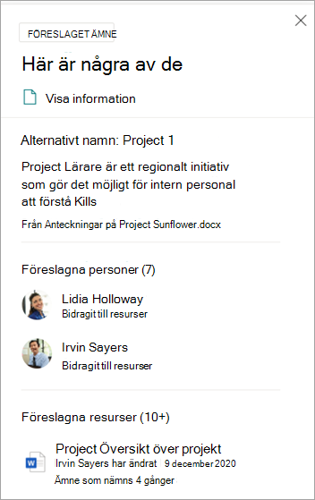
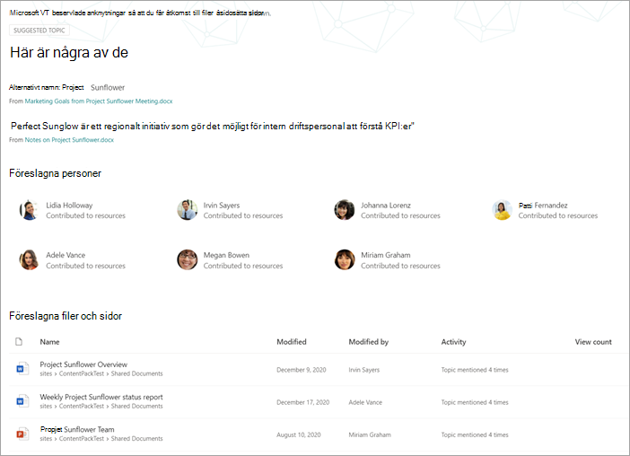
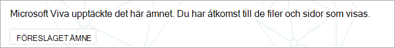
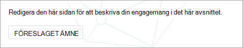
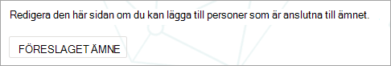
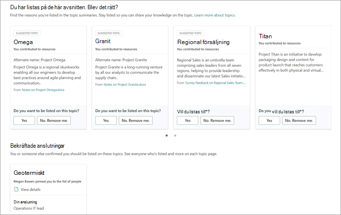

# Hantera ämnen i skala i Microsoft Viva-ämnen

När du indexerar SharePoint eller hela organisationen för Viva Topics kan många ämnen skapas. När det händer och du ser tusentals förslag på sidan Hantera **ämnen** kan det vara svårt att veta var du ska börja. I den här artikeln beskrivs hur Viva Topics hjälper dig att optimera vilka ämnen och vilken information som visas för användare som söker efter information, även i stora organisationer med många ämnen.

Först en påminnelse om de [fyra stegen för ämnen:](manage-topics.md#topic-stages)

- **Förslag:** Ett ämne har identifierats med AI och har tillräckligt med stödresurser, anslutningar och egenskaper. (De är markerade som ett **föreslaget ämne** i användargränssnittet.)

- **Bekräftad:** Ett ämne som har identifierats av AI och har validerats. Validering av avsnitt inträffar när något av följande inträffar:

   - En knowledge manager bekräftar ett ämne. En knowledge manager [bekräftar ett ämne](manage-topics.md#confirmed-topics) på sidan **Hantera** ämnen.

   - Flera användare bekräftar ett ämne. Det måste finnas ett netto av två positiva röster som tagits emot från användare som har röstat med hjälp av feedbackmekanismen för ämneskortet. Om en användare till exempel har röstat på positivt och en användare har röstat nej till ett visst ämne, skulle du fortfarande behöva två positiva röster för att ämnet ska bekräftas.
 
- **Publicerades**: Ett ämne som har använts för utsmning. Manuella redigeringar har gjorts för att förbättra kvaliteten eller så har de skapats av en användare.

- **Tas** bort : Ett ämne som har avvisats och inte längre kommer att visas för läsare. Ett ämne kan tas bort i valfri stat (förslag, bekräftade eller publicerade). Ämnesborttagning inträffar när något av följande inträffar:

   - En knowledge manager tar bort ett ämne. En knowledge manager tar bort ett ämne på **sidan Hantera** ämnen.

   - Flera användare rop negativa röster med hjälp av feedbackmekanismen på ämneskortet. För att ett ämne ska kunna tas bort måste nettot av två negativa röster tas emot från användare. Om en användare till exempel har röstat nej och en användare har röstat positivt på ett visst ämne, skulle du ändå behöva två fler negativa röster för att ämnet ska tas bort.

  När ett publicerat ämne tas bort måste sidan med den curated informationen tas bort manuellt via ämnescentrets sidbibliotek.

## Knowledge Manager-roll 

När du konfigurerar Viva Ämnen lägger du till en grupp användare som har behörighet för att se **sidan Hantera** ämnen i ämnescentret. Den visas endast för de användare som har rollen som primär läroplan för avsnitten. De har tillgång till data om ämnena och kan se listor med alla ämnen som de har tillgång till att granska och hantera.

Anställda med den här rollen bör ha breda behörigheter för att kunna se en rad olika ämnen. Eller om behörigheterna är segmenterade kanske du vill välja en grupp användare som representerar olika områden i verksamheten och kan välja att avaktivera för sina egna områden.

När du först granskar ämnen i ämnescentret är de föreslagna ämnena helt AI-definierade. Knowledge managers might want to review each one before rolling out Viva Topics to a broad user community. När du arbetar med skalning är den här metoden sällan en praktisk metod, på grund av de tusentals ämnena.

Vi rekommenderar att du hittar en balans mellan de mest relevanta eller viktiga ämnena för din första uppsättning användare och att fokusera på hur ämnena ser ut innan Viva Topics distribueras. Börja samla in feedback från användarna och låt crowdsourcing fastställa användnings- och bidragsmönster för dina användare för att informera de strategier som föreslås i den här artikeln.

Det är viktigt att känna igen att systemet identifierar och visar både AI-föreslagna och mänskliga publicerade ämnen för alla användare. Men det innebär inte att alla föreslagna ämnen visas för alla slutanvändare. Säkerhetsinställningarna på plats visar endast de ämnen som varje anställd kan komma åt baserat på behörigheterna som anges för själva innehållet.

Som knowledge manager med behörighet  att visa sidan Hantera ämnen kanske du ser ett mycket större antal ämnen listade på grund av dina egna förhöjda behörigheter, beroende på din roll i organisationen och åtkomstnivå. Du har också tillgång till vyer som gör att du kan se avsnitt som listas på en enda plats i stället för att komma åt dem genom att markera eller söka.

Dessutom är det förmodligen ett mindre antal ämnen som kommer att visas för de flesta användare och en större uppsättning med fler ämnen som kommer att ses mycket mindre ofta på grund av behörigheter. Därför är det bra att först fokusera på de ämnen som är viktigast för organisationen och som troligtvis kommer att ses mer brett.

I den här artikeln beskrivs några strategier för läroplan. Dessa strategier kan innebära att de mindre vanliga eller mindre vanliga ämnena kanske inte alltid används av kunskapschefer. De här föreslagna ämnena är dock alltid användbara och kan ge en person insikter eller en pekare, vilket kan spara tider för anställda när de letar efter en utgångspunkt. Att tillåta uppdateringar via crowdsourk i ämnen är bra och ger mer innehåll och täckning för mindre vanliga ämnen.

I den här artikeln får du vägledning och metodtips för hur du ska hantera ämnen och administration.

## Förstå föreslagna ämnen

När ämnen upptäcks av AI markeras de som ett  föreslaget ämne **,** både på sidan Hantera ämnen och i ämneskorten som visas för användare. Alla ämnen som inte har markerats som borttagna visas för användarna, inklusive bekräftade, publicerade och föreslagna ämnen. Ämnen i alla tre tillstånd är tillgängliga för slutanvändare.

Inom ett ämneskort eller på en sida använder vi olika tips för att visa hur AI:et har genererat informationen. Systemet använder en mängd olika bevis för att lägga till resurser, främst via själva innehållet.

- Etiketter visar att ett ämne föreslås och att det identifierats av Viva Ämnen.  

   

- Information på kortet anger varifrån en definition kommer genom att ange dess källa.

- Föreslagna personer härleds genom att samla personer som har skrivit eller redigerat dokument med ämnes bevis. Om en person skriver ett dokument som har ett ämnesnamn i rubriken och dokumentet har många vyer kan det hända att det bara krävs ett dokument för att personen ska kunna etableras som relaterad. I många fall är dock fler bevis bättre och personer som listas har arbetat med flera dokument.  

   

- För de filer och sidor som visas identifierar systemet hur många gånger ämnet har nämnts i dokumentet, men ämnet måste också nämns i ett särskilt sammanhang som identifierar referensen till ämnet av en viss typ (till exempel projekt eller grupp). Det här är det som räknas som bevis för AI. Systemet tar även hänsyn till förekomsten av ett ämnesnamn i rubrikerna för dokument, typer av dokument och andra analysfunktioner (t.ex. vyer).

   

   

   

De här attributen visar att innehållet har lagts till av AI och hur AI:et har gjort det avgörande.

### Kommunikation

När du kommunicerar till användarna om Viva Topics är det viktigt att förtydliga skillnaden mellan AI-föreslagna ämnen och innehåll och deras kurserade motsvarigheter.

Som läsare bör du visa föreslagna ämnen med ett mer kritiskt öga. De ska inte uppfattas som auktoritativa källor till organisationens sanning. De är i stället ett sätt att hitta verktyg för att få tillgång till tacit som presenteras via det innehåll som du har tillgång till. AI har identifierat ämnet och har tillräckligt med bevis för att visa det, men dess värde har inte bekräftats av en person.

### Crowdsourced-kontroller

Föreslagna ämnen kan förbättras genom att sidans inställningar används och genom crowdsourk feedback om ämnet.

När användarna interagerar med ett föreslaget ämne kan de ställas till en enkel fråga i användargränssnittet. Till exempel: *Var det här avsnittet relevant för sidan?* *Är den här personen relevant för ämnet?* *Var den här definitionen korrekt?* Genom att använda feedback på sådana frågor kan precisionen i avsnitten öka utan att en namngiven person behöver gå till sidan.

Startsidan för ett ämnescenter är en annan plats där feedback om föreslagna ämnen samlas in. I ämnescentret kan en användare se de ämnen som de har kopplats till och kan välja att antingen bekräfta den här kopplingen eller att ta bort den.

   

När du tillåter omfattande crowdsourcing av ämnen, bör du tänka på följande faktorer:

-   Användarna ser alternativet **Redigera** på ämnessidor och kan redigera sidorna på samma sätt som andra moderna SharePoint sidor.

-   Vissa föreslagna ämneswebbdelar kan inte tas bort.  Du kan inte ta bort ämnesnamn, alternativa namn, definition, föreslagna personer och föreslagna resurser.

-   Det kan ta lite tid innan ett föreslaget eller bekräftat  ämne som har publicerats flyttas till listan Publicerade på **sidan Hantera ämnen.**

    -   Den beräknade tiden för ett ämne som ska visas i sökning, markeringar, hashtaggar eller anteckningar är 2 timmar.

    -   Den beräknade tiden för att ett ämne  ska **visas** i listan Publicerade på sidan Hanterade ämnen är högst 24 timmar i de flesta fall. Du bör se dem inom 2 timmar, men eftersom det finns en fullständig synkronisering var 24:e timme bör väntetiden inte vara längre än 24 timmar.

-   Det är möjligt att en användare kan lämna ett publicerat ämne i ett utcheckat eller redigeringstillstånd. En knowledge manager kan se dessa i ämnescentrets sidbibliotek och kan antingen ignorera användarens ändringar för att publicera ämnet på nytt eller kontakta användaren för att begära att de checkar in ämnet.

### Ämnets synlighet och innehåll baseras på en användares behörigheter

När du granskar listan med föreslagna ämnen som en kunskapshanterare bör du tänka på att innehållet i ett föreslaget ämne dynamiskt kommer att baseras på behörigheter. Det föreslagna innehållet och de personer som visas för dig kanske inte är samma som de som visas för en användare eller en annan kunskapsansvarig.

Utifrån behörigheterna för att visa innehåll som är associerat med ett ämne kan varje användare se olika uppsättning föreslagna resurser, personer, alternativa namn och definition.

## Prioritera ämnen för läroplanen

Du kan använda följande strategier för att identifiera ämnen som troligtvis är framträdande och därför är bra på att använda läroplaner. 

### Taxonomier

Användning av befintliga taxonomier kan ge användarna en lista med ämnen som troligtvis är framträdande. De kan till exempel vara:

-   Produkter och tjänster som din organisation tillhandahåller

-   Teams i organisationen

-   Projekt med hög profil

Den här metoden kan även användas på avdelningsnivå eller funktionsnivå, med ämnesexperter som förstår det området i din organisation. Målet är inte att de ska granska ett urval eller alla ämnen. I stället hämtar de sina egna kunskaper om domänen för att styra selektiv läroplan.

### Söka

Vanliga sökord upptäcks ofta som ämnen. Med hjälp av [de vanligaste frågerapporterna i Microsoft Search](/sharepoint/view-search-usage-reports)kan du identifiera de vanligaste sökorden i organisationen. Om ämnen har identifierats för dessa termer, är de bra kandidater för läroplan. Dessa avsnitt kan presenteras som svarskort i Microsoft Search.

Om du använder Microsoft [Search-bokmärken kan](/microsoftsearch/manage-bookmarks)du överväga vilka av dem som kan ersättas med ett ämne. Ett bokmärkessvarskort innehåller en rubrik, en beskrivning och en WEBBADRESS. I vissa fall kan ett ämneskort vara mer användbart för användaren och ett ämneskort visar även resurser och personer.

När en användare söker efter en term som resor visas sökresultat i följande prioritetsordning i Microsoft Search i användarens sökupplevelse:

1.  Publicerade eller bekräftade ämnen

2.  Bokmärken

3.  Föreslagna ämnen

### Intryck och kvalitetsresultat

Antal intryck och [kvalitetsresultat är](manage-topics.md#quality-score) viktiga mått för att förstå ett [ämnes](manage-topics.md#impressions) beteende. Värdet på dessa mått kommer att vara begränsat när bara kunskapschefer eller IT-team har åtkomst till ämnen. Om ämnen sätts in i en pilotgrupp av användare genereras mer representativa data för dessa åtgärder.

Ämnen med ett högt antal intryck kommuniceras troligen oftare. Kvalitetsresultatet för dessa avsnitt ger en känsla för hur omfattande dessa ämnen är. Ämnen med gott intryck och resultat med låg kvalitet är bra mål för kurseringen.

### Viktiga termer från informationsarkitekturen för större organisationswebbplatser

Större portalwebbplatser i organisationen kan ha investerat tid på att organisera sin informationsarkitektur och navigeringen på webbplatsen runt viktiga ämnesområden för sina affärsenheter, produktlinjer, större projekt och så vidare. Genom att granska de här termerna och identifiera och granska ämnen för dessa termer kan det hjälpa användare som söker information om dessa områden.

### Utnyttja interna kunskapsbaser eller wiki-webbplatser

Om din organisation har investerat i kunskapsbaser eller wiki-webbplatser kan de ge dig en lista med ämnen som du kan använda för ditt första kursarbete. Om de är särskilt stora kan du välja de mest visade eller redigerade avsnitten som en utgångspunkt.

## Se även

[Hantera ämnen i ämnes centret](manage-topics.md)

[Översikt över temacenter](topic-center-overview.md)
