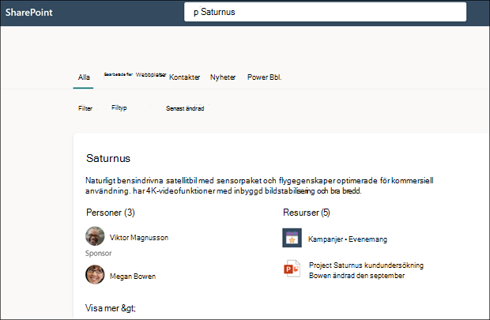

# Använda Microsoft Search till att hitta ämnen i Microsoft Viva-ämnen

Viva Topics-användare kan hitta ämnen genom viktiga ämnen på Sina SharePoint-webbplatser, men de kan också hitta dem via Microsoft Search. 

## Ämnessvar

När du söker efter ett visst ämne i Microsoft Search (till exempel "Saturnus"), visas resultatet i formatet Svarsförslag om ett ämne finns och hittas.

Ämnessvaret visas:
- Ämnesnamn
- Alternativa namn: Alternativa namn eller förkortningar för ämnet.
- Definition: Beskrivning av ämnet som tillhandahålls av AI eller som lagts till manuellt av en person.
- Föreslagna eller fästa personer: Personer som föreslås av AI eller är fästa vid ämnet av en person
- Föreslagna eller fästa resurser: Filer, sidor eller webbplatser som antingen föreslås av AI eller är fästa i ämnet av en person. 

    

Ämnessidan kan visas i sökresultatet även om ämnessvarskortet inte visas.

## Förkortningar

I Viva-ämnen kan du manuellt redigera ett ämne så att en förkortning för det tas med som ett <b>alternativt namn.</b> På så sätt kan en användare som söker efter endast ämnets förkortning hitta ämnessvaret via Microsoft Search.

[Akronym Answers](https://docs.microsoft.com/microsoftsearch/manage-acronyms) är en funktion som tillhandahålls genom Microsoft Search och hanteras separat från Viva Topics.

## Bokmärken och ämnen

[Bokmärken](https://docs.microsoft.com/microsoftsearch/manage-bookmarks) är en Microsoft Search-funktion som hjälper användare att snabbt hitta viktiga webbplatser och verktyg med bara en sökning (till exempel ett resebokningsverktyg på en extern webbplats utanför Microsoft 365-klientorganisationen). De skapas av sökadministratörer i administrationscentret för Microsoft 365. 

För användare som letar efter information om att boka en arbetsresa:

- Om vissa användare känner till reseverktygets namn (till exempel "Samtidiga") är det enklare att skapa ett bokmärke för att gå direkt till den externa webbplatsen.
- För användare som ofta söker efter "resor" skapar du ett ämne på "Resa" som innehåller den information de förväntar sig att se. Det kan vara bra att lägga till en länk till den externa samtidiga webbplatsen i beskrivningen av avsnittet. Om länken istället är till en intern resebokningswebbplats hos Microsoft 365-klientorganisationen kan du lägga till den i "Fästa resurser".
 
### Prioritet för sökresultat 
 
När en användare söker efter en term som "resa" visas sökresultat i användarens sökupplevelse med följande prioritet i Microsoft Search
1. Publicerade eller bekräftade ämnen 
2. Bokmärken
3. Föreslagna ämnen 

