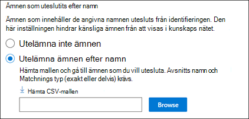
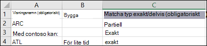

# Konfigurera kunskaps hantering (för hands version)Set up Knowledge Management (Preview)

> [!Note] 
> Innehållet i den här artikeln gäller för projekt cortex privat för hands version.The content in this article is for Project Cortex Private Preview. [Lär dig mer om Project cortex](https://aka.ms/projectcortex).[Find out more about Project Cortex](https://aka.ms/projectcortex).

Du kan använda administrations centret för Microsoft 365 för att ställa in och konfigurera [kunskaps hantering](knowledge-management-overview.md).You can use the Microsoft 365 admin center to set up and configure [Knowledge Management](knowledge-management-overview.md). 

> [!Important]
> Det är viktigt att planera det bästa sättet att ställa in och konfigurera kunskaps hantering i din miljö.It is important to plan the best way to set up and configure Knowledge Management in your environment. Till exempel måste du tänka på följande:For example, you will need to make considerations about the following:
- Vilka SharePoint-webbplatser som du vill analysera för avsnitt.Which SharePoint sites you want to analyze for topics.
- Vilka användare du vill göra ämnen synliga för.Which users you want to make topics visible to.
- Vilka användare som du vill ge behörighet att hantera ämnen i ämnes centret.Which users you want to give permissions to manage topics in the topic center.
- Vilka användare som du vill ge behörighet att skapa eller redigera ämnen i ämnes centret.Which users you want to give permissions to create or edit topics in the topic center.
- Vilket namn du vill ge ditt ämnes Center.What name you want to give your topic center.

> [!Note]
> Det kan vara praktiskt att skapa säkerhets grupper för att ge användarna de behörigheter som krävs för att Visa ämnen, hantera ämne och skapa och redigera ämnen.You may find it useful to create security groups to assign your users the permissions needed to view topics, manage topic, and create and edit topics.

En administratör kan också [göra ändringar i dina valda inställningar när som helst efter installationen](manage-knowledge-network.md) via kunskaps hanterings inställningarna i Microsoft 365 Admin Center.An admin can also [make changes to your selected settings anytime after setup](manage-knowledge-network.md) through the Knowledge Management settings in the Microsoft 365 admin center.

## KravRequirements 
Du måste ha global administratör eller administratörs behörighet för SharePoint för att kunna komma åt Microsoft 365 Admin Center och ställa in organisationens kunskaps uppgifter.You must have Global Admin or SharePoint admin permissions to be able to access the Microsoft 365 admin center and set up Organizational knowledge tasks.

## Konfigurera kunskaps nätverkSet up your knowledge network

Genom att konfigurera kunskaps nätverket får du hjälp med följande:Setting up your knowledge network walks you through the following:

- Avsnitts identifiering: välja ämnen och ämnen som ska undantas från identifieringen.Topic discovery: Selecting topic sources and topics to  exclude from discovery.
- Ämnets synlighet: välja vilka som får Visa ämnen som högdagrar, på sidan Sök och ämnen.Topic visibility: Selecting who can view topics as highlights, in search and topic pages.
- Behörigheter för ämne: välja vem som kan skapa, redigera och hantera ämnen.Topic permissions: Selecting who can create, edit, and manage topics.
- Ämnes Center: skapa ett ämnes Center.Topic center: Create your topic center.
- Granska: kontrol lera och tillämpa dina inställningar.Review: Check and apply your settings.

Så här konfigurerar du ditt kunskaps nätverk:To set up your knowledge network:

1. I administrations centret för Microsoft 365 (admin.microsoft.com) väljer du **Konfigurera**och sedan Visa avsnittet **organisations** information.In the Microsoft 365 admin center (admin.microsoft.com), select **Setup**, and then view the **Organizational Knowledge** section.
2. I avsnittet **organisationsinformation** klickar du på **Anslut personer till kunskap**.In the **Organizational Knowledge** section, click **Connect people to knowledge**. 

      

3. På sidan **Anslut personer till kunskap** klickar du på **komma igång** för att vägleda dig genom installations processen.On the **Connect people to knowledge** page, click **Get started** to walk you through the setup process. 

      

4. På sidan **Välj hur kunskaps nätverket kan hitta ämnes** sidor konfigurerar du identifiering av avsnitt.On the **Choose how the knowledge network can find topics** page, you will configure topic discovery. Välj vilka SharePoint-webbplatser som ska crawlas som källor för dina ämnen under identifiering i avsnittet Välj avsnitts **källor för SharePoint** .In the **Select SharePoint topic sources** section, select which SharePoint sites will be crawled as sources for your topics during discovery. Detta inkluderar:This includes: 
    a.a. **Alla webbplatser**: alla SharePoint-webbplatser i din klient organisation.**All sites**: All SharePoint sites in your tenant. Här fångar du aktuella och framtida webbplatser.This captures current and future sites. 
    b.b. **Alla, förutom markerade webbplatser**: Skriv namnen på de webbplatser du vill undanta.**All, except selected sites**: Type the names of the sites you want to exclude.  Du kan också ladda upp en lista med webbplatser som du inte vill ska ingå i sökningen.You can also upload a list of sites that you want to opt out from discovery. Webbplatser som skapats i framtiden tas med i källor för avsnitts identifiering.Sites created in future will be included as sources for topic discovery.  
    c.c. **Endast valda webbplatser**: Skriv in namnen på de webbplatser du vill ta med.**Only selected sites**: Type the names of the sites you want to include. Du kan också ladda upp en lista med webbplatser.You can also upload a list of sites. Webbplatser som skapats i framtiden kommer inte att ingå som källor för identifiering av ämnen.Sites created in the future will not be included as sources for topic discovery.  

      
   
5. I avsnittet **undanta ämnen efter namn** kan du välja att inkludera namn på ämnen som du inte vill ska finnas med i resultatet.In the **Exclude topics by name** section, you can choose to includes names of topics you don't want to be in the discovered results. Använd den här inställningen för att förhindra att känsliga ämnen tas med i kunskaps nätet.Use this setting to prevent sensitive topics from being included as part of the knowledge network. Alternativen är:Your options include: 
    a.a. **Utelämna inte ämnen****Don't exclude any topics**  
    b.b. **Utelämna ämnen efter namn**: om du har ämnen som du inte vill visa för användarna som en del av kunskaps nätverket.**Exclude topics by name**:  If you have topics you don’t want shown to users as part of the knowledge network. 

      

    #### Så här utesluter du ämnen efter namnHow to exclude topics by name    

    Om du behöver undanta ämnen, efter att du har valt **Uteslut ämnen efter namn**, väljer **du Hämta CSV-mallen**.If you need to exclude topics, after selecting **Exclude topics by name**, select **Download the .csv template**. Använda Excel. CSV-mallen för att inkludera en lista med ämnen som du vill undanta från identifierings resultaten.Use the Excel .CSV template to include a list of topics that you want to exclude from your discovery results.

      

    I CSV-mallen anger du följande information om de avsnitt som du vill undanta:In the CSV template, enter the following information about the topics you want to exclude:

    - **Namn**: Skriv namnet på det ämne som du vill undanta.**Name**: Type the name of the topic you want to exclude. Du kan göra det på två sätt:There are two ways to do this: 
        - Exakt träff: du kan ange exakt namn eller akronym (till exempel *contoso* eller *ATL*).Exact match: You can include the exact name or acronym (for example, *Contoso* or *ATL*). 
        - Ofullständig matchning: du kan exkludera alla ämnen som har ett visst ord i det.Partial match: You can exclude all topics that have a specific word in it.  Till exempel kommer *bågen* att exkludera alla ämnen med ord *båge* i det, till exempel *båge cirkel*, *plasma båge svets*eller *tränings båge*. Observera att den inte utesluter ämnen där texten är inkluderad som en del av ett ord, till exempel *arkitekturen*.For example, *arc* will exclude all topics with the word *arc* in it, such as *Arc circle*, *Plasma arc welding*, or *Training arc*. Note that it will not exclude topics in which the text is included as part of a word, such as *Architecture*. 
    - **Expansion (valfritt)**: om du vill utesluta en akronym skriver du orden som akronym står för.**Expansion (optional)**: If you want to exclude an acronym, type the words the acronym stands for. 
    - **MatchType-exakt/delvis**: Skriv om det namn du angav är en *exakt* eller *delvis* matchnings typ.**MatchType-Exact/Partial**: Type whether the name you entered was an *exact* or *partial* match type. 

    När du har slutfört och sparat CSV-mallfilen väljer du **Bläddra** och letar reda på och markerar den.After you've completed and saved your CSV template file, select **Browse** to locate and select it.
    
    Välj **Nästa**.Select **Next**. 

6. På sidan **vem kan se ämnen och var de kan se dem** ser du avsnitts visning.On the **Who can see topics and where they can see them** page, you will configure topic visibility. I listan **vilka kan se ämnen i kunskaps nätverkets** inställning väljer du vilka som ska ha åtkomst till ämnen, till exempel markerade ämnen, ämnes kort, ämnes svar i sökningar och avsnitts sidor.In the **Who can see topics in the knowledge network** setting, you choose who will have access to topic details, such as highlighted topics, topic cards, topic answers in search, and topic pages. Du kan välja:You can select: 
    a.a. **Alla i organisationen****Everyone in your organization** 
    b.b. **Endast valda personer eller säkerhets grupper****Only selected people or security groups** 
    c.c. **Ingen****No one** 

       

 > [!Note] 
 > Med den här inställningen kan du välja en användare i organisationen, men endast användare som har kunskaps hanterings licenser tilldelade till dem kan visa ämnen.While this setting allows you to select any user in your organization, only users who have knowledge management licenses assigned to them will be able to view topics. 

7. På sidan **behörigheter för hantering av ämnen** kan du välja vem som ska kunna skapa, redigera och hantera ämnen.In the **Permissions for topic management** page, you choose who will be able to create, edit, or manage topics. I avsnittet **vilka som kan skapa och redigera ämnen** kan du välja:In the **Who can create and edit topics** section, you can select: 
    a.a. **Alla i organisationen****Everyone in your organization** 
    b.b. **Endast valda personer eller säkerhets grupper****Only selected people or security groups** 
8. I avsnittet **vilka kan hantera ämnen** kan du välja:In the **Who can manage topics** section, you can select: 
    a.a. **Alla i organisationen****Everyone in your organization** 
    b.b. **Markerade personer eller säkerhets grupper****Selected people or security groups** 

      

    Välj **Nästa**.Select **Next**. 
9. På sidan **skapa ämnes Center** kan du skapa en ämnes Center-webbplats där du kan visa ämnes sidor och ämnen kan hanteras.On the **Create Topic  Center** page, you can create your topic center site in which topic pages can be viewed and topics can be managed.  Skriv ett namn på ämnes centret i rutan **namn på ämnes Center** .In the **Topic center name** box, type a name for your Topic center. Du kan också skriva en kort beskrivning i rutan **Beskrivning** .You can optionally type a short description in the **Site description** box.  

Välj **Nästa**.Select **Next**. 

      

10. På sidan **Granska och slutför** kan du titta på den valda inställningen och välja att göra ändringar.On the **Review and finish** page, you can look at your selected setting and choose to make changes. Om du är nöjd med dina val väljer du **Aktivera**.If you are satisfied with your selections, select **Activate**.

       

11. Sidan **kunskaps nätverk aktive rad** visar och bekräftar att systemet kommer att börja analysera dina valda webbplatser för att få hjälp med ämnen och att skapa kunskaps Center webbplatsen.The **Knowledge network activated** page will display, confirming that the system will now start analyzing your selected sites for topics and creating the Knowledge Center site. Välj **klar**.Select **Done**. 

       

12. Du kommer att återföras till sidan **Koppla personer till kunskap** .You'll be returned to your **Connect people to knowledge** page. Från den här sidan kan du välja **Hantera** för att ändra dina konfigurations inställningar.From this page, you can select **Manage** to make any changes to your configuration settings. 

         

> [!Note]
> När installationen är slutförd kan administratören [ändra dina valda kunskaps hanterings inställningar](manage-knowledge-network.md) när som helst genom att gå tillbaka till den här sidan.After setup, an admin can [make changes to your selected knowledge management settings](manage-knowledge-network.md) any time by returning to this page.

## Se ävenSee also

  

