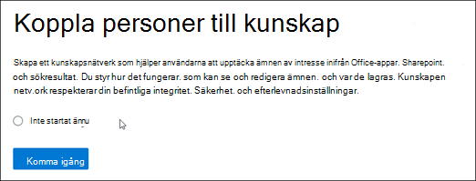
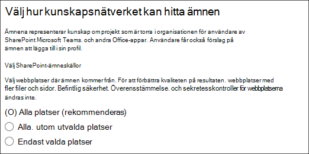
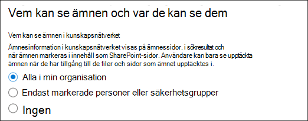
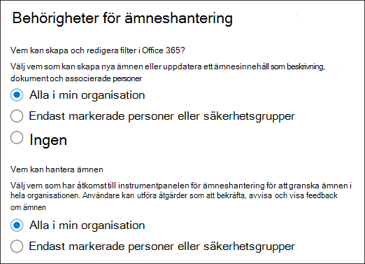
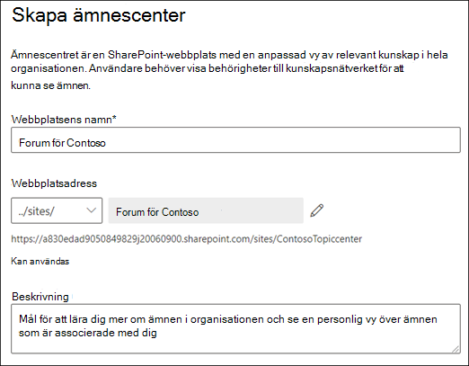
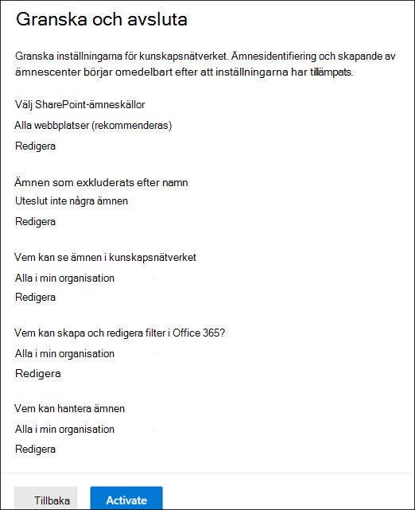
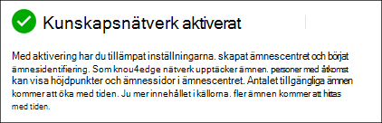
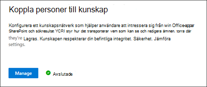

# Konfigurera kunskapshantering (förhandsversion)Set up Knowledge Management (Preview)

> [!Note] 
> Innehållet i den här artikeln är för Project Cortex Private Preview.The content in this article is for Project Cortex Private Preview. [Läs mer om Project Cortex](https://aka.ms/projectcortex).[Find out more about Project Cortex](https://aka.ms/projectcortex).

Du kan använda administrationscentret för Microsoft 365 för att konfigurera [Kunskapshantering](knowledge-management-overview.md).You can use the Microsoft 365 admin center to set up and configure [Knowledge Management](knowledge-management-overview.md). 

> [!Important]
> Det är viktigt att planera det bästa sättet att konfigurera och konfigurera Kunskapshantering i din miljö.It is important to plan the best way to set up and configure Knowledge Management in your environment. Du måste till exempel ta hänsyn till följande:For example, you will need to make considerations about the following:
- Vilka SharePoint-webbplatser du vill analysera för ämnen.Which SharePoint sites you want to analyze for topics.
- Vilka användare du vill göra ämnen synliga för.Which users you want to make topics visible to.
- Vilka användare du vill ge behörighet att hantera ämnen i ämnescentret.Which users you want to give permissions to manage topics in the topic center.
- Vilka användare du vill ge behörighet att skapa eller redigera ämnen i ämnescentret.Which users you want to give permissions to create or edit topics in the topic center.
- Vilket namn du vill ge ditt ämnescenter.What name you want to give your topic center.

> [!Note]
> Det kan vara bra att skapa säkerhetsgrupper för att tilldela användarna de behörigheter som behövs för att visa ämnen, hantera ämnen och skapa och redigera ämnen.You may find it useful to create security groups to assign your users the permissions needed to view topics, manage topic, and create and edit topics.

En administratör kan också [göra ändringar i dina valda inställningar när som helst efter installationen](manage-knowledge-network.md) via knowledge management-inställningarna i Administrationscentret för Microsoft 365.An admin can also [make changes to your selected settings anytime after setup](manage-knowledge-network.md) through the Knowledge Management settings in the Microsoft 365 admin center.

## KravRequirements 
Du måste ha behörighet för global administratör eller SharePoint-administratör för att kunna komma åt Microsoft 365-administrationscentret och konfigurera organisatoriska kunskapsuppgifter.You must have Global Admin or SharePoint admin permissions to be able to access the Microsoft 365 admin center and set up Organizational knowledge tasks.

## Konfigurera kunskapsnätverketSet up your knowledge network

När du konfigurerar kunskapsnätverket får du följande information:Setting up your knowledge network walks you through the following:

- Ämnesidentifiering: Välja ämneskällor och ämnen som ska uteslutas från identifiering.Topic discovery: Selecting topic sources and topics to  exclude from discovery.
- Ämnessynlighet: Välja vem som kan visa ämnen som högdagrar, på sök- och ämnessidor.Topic visibility: Selecting who can view topics as highlights, in search and topic pages.
- Ämnesbehörigheter: Välja vem som kan skapa, redigera och hantera ämnen.Topic permissions: Selecting who can create, edit, and manage topics.
- Ämnescenter: Skapa ditt ämnescenter.Topic center: Create your topic center.
- Granska: Kontrollera och tillämpa inställningarna.Review: Check and apply your settings.

Så här konfigurerar du kunskapsnätverket:To set up your knowledge network:

1. I administrationscentret för Microsoft 365 (admin.microsoft.com) väljer du **Installationsprogrammet**och visar sedan avsnittet **Organisationskunskap.**In the Microsoft 365 admin center (admin.microsoft.com), select **Setup**, and then view the **Organizational Knowledge** section.
2. Klicka på Anslut personer **till kunskap**i avsnittet **Organisationskunskap.**In the **Organizational Knowledge** section, click **Connect people to knowledge**. 

      

3. På sidan **Anslut personer till kunskap** klickar du på Kom **igång** för att gå igenom installationsprocessen.On the **Connect people to knowledge** page, click **Get started** to walk you through the setup process. 

      

4. På sidan **Välj hur kunskapsnätverket kan hitta ämnen** konfigurerar du ämnesidentifiering.On the **Choose how the knowledge network can find topics** page, you will configure topic discovery. I avsnittet **Välj SharePoint-ämneskällor** väljer du vilka SharePoint-webbplatser som ska genomsökas som källor för dina ämnen under identifieringen.In the **Select SharePoint topic sources** section, select which SharePoint sites will be crawled as sources for your topics during discovery. Detta inkluderar:This includes: 
    a.a. **Alla webbplatser:** Alla SharePoint-webbplatser i din klientorganisation.**All sites**: All SharePoint sites in your tenant. Detta fångar nuvarande och framtida webbplatser.This captures current and future sites. 
    b.b. **Alla, utom valda platser:** Skriv namnen på de webbplatser som du vill utesluta.**All, except selected sites**: Type the names of the sites you want to exclude.  Du kan också ladda upp en lista över webbplatser som du vill välja bort från identifiering.You can also upload a list of sites that you want to opt out from discovery. Webbplatser som skapas i framtiden kommer att inkluderas som källor för ämnesidentifiering.Sites created in future will be included as sources for topic discovery.  
    c.c. **Endast valda platser:** Skriv namnen på de platser som du vill inkludera.**Only selected sites**: Type the names of the sites you want to include. Du kan också ladda upp en lista över webbplatser.You can also upload a list of sites. Webbplatser som skapas i framtiden kommer inte att inkluderas som källor för ämnesidentifiering.Sites created in the future will not be included as sources for topic discovery.  

      
   
5. I avsnittet **Uteslut efter namn** kan du välja att ta med namn på ämnen som du inte vill ska finnas i de identifierade resultaten.In the **Exclude topics by name** section, you can choose to includes names of topics you don't want to be in the discovered results. Använd den här inställningen om du vill förhindra att känsliga ämnen inkluderas som en del av kunskapsnätverket.Use this setting to prevent sensitive topics from being included as part of the knowledge network. Dina alternativ inkluderar:Your options include: 
    a.a. **Uteslut inte några ämnen****Don't exclude any topics**  
    b.b. **Uteslut ämne som innehåller dessa termer**: Om du har ämnen som du inte vill visa för användare som en del av kunskapsnätverket.**Exclude topic that contain these terms**:  If you have topics you don’t want shown to users as part of the knowledge network.
   - Ladda ner den medföljande mallen.- Download the provided template.
   - Ange de ämnesnamn som du vill utesluta.- Enter the topic names you want to exclude. Du måste ange matchningstypen som exakt eller partiell.You must indicate the match type as exact or partial. Exakt matchning innebär att ämnen som passar den exakta termen utesluts.Exact match means that topics that fit the exact term will be excluded. Partiell matchning är strängare och innebär att ämnen som innehåller termen utesluts.Partial match is stricter and means that topics that contain the term will be excluded. Om du till exempel anger *Doc* som ämnesnamn utesluts *Doc-sammansättning* medan *Docker* inte gör det.For example, if you enter *Doc* as the topic name, *Doc assembly* will be excluded while *Docker* won't. Ämnesnamn är skiftlägesokänsliga.Topic names are case insensitive.  
        - Välj om du  **+**   vill importera den färdiga CSV-filen.- Select **+** to import your completed CSV file. Välj sedan **Ladda upp**.Then select **Upload**. Du ser en grön bock om filen har bearbetats.You’ll see a green check mark if your file has been processed successfully. Välj **Nästa**.Select **Next**. 

6. På sidan **Vem kan se ämnen och var de kan se dem** konfigurerar du ämnessynlighet.On the **Who can see topics and where they can see them** page, you will configure topic visibility. I inställningen **Vem kan se ämnen i kunskapsnätverket** väljer du vem som ska ha tillgång till ämnesinformation, till exempel markerade ämnen, ämneskort, ämnessvar i sök- och ämnessidor.In the **Who can see topics in the knowledge network** setting, you choose who will have access to topic details, such as highlighted topics, topic cards, topic answers in search, and topic pages. Du kan välja:You can select: 
    a.a. **Alla i organisationen****Everyone in your organization** 
    b.b. **Endast markerade personer eller säkerhetsgrupper****Only selected people or security groups** 
    c.c. **Ingen****No one** 

       

 > [!Note] 
 > Med den här inställningen kan du välja en användare i organisationen, men endast användare som har kunskapshanteringslicenser som tilldelats dem kan visa ämnen.While this setting allows you to select any user in your organization, only users who have knowledge management licenses assigned to them will be able to view topics. 

7. På sidan **Behörigheter för ämneshantering** väljer du vem som ska kunna skapa, redigera eller hantera ämnen.In the **Permissions for topic management** page, you choose who will be able to create, edit, or manage topics. I avsnittet **Vem kan skapa och redigera ämnen** kan du välja:In the **Who can create and edit topics** section, you can select: 
    a.a. **Alla i organisationen****Everyone in your organization** 
    b.b. **Endast markerade personer eller säkerhetsgrupper****Only selected people or security groups** 
8. I avsnittet **Vem kan hantera ämnen** kan du välja:In the **Who can manage topics** section, you can select: 
    a.a. **Alla i organisationen****Everyone in your organization** 
    b.b. **Utvalda personer eller säkerhetsgrupper****Selected people or security groups** 

      

    Välj **Nästa**.Select **Next**. 
9. På sidan **Skapa ämnescenter** kan du skapa en webbplats för ämnescenter där ämnessidor kan visas och ämnen kan hanteras.On the **Create Topic  Center** page, you can create your topic center site in which topic pages can be viewed and topics can be managed.  Skriv ett namn på ämnescentret i **rutan Ämnescenter.**In the **Topic center name** box, type a name for your Topic center. Du kan också skriva en kort beskrivning i rutan **Webbplatsbeskrivning.**You can optionally type a short description in the **Site description** box.  

Välj **Nästa**.Select **Next**. 

      

10. På sidan **Granska och avsluta** kan du titta på den valda inställningen och välja att göra ändringar.On the **Review and finish** page, you can look at your selected setting and choose to make changes. Om du är nöjd med dina val väljer du **Aktivera**.If you are satisfied with your selections, select **Activate**.

       

11. Sidan **Kunskapsnätverk som aktiveras** visas och bekräftar att systemet nu kommer att börja analysera dina valda webbplatser för ämnen och skapa knowledge center-webbplatsen.The **Knowledge network activated** page will display, confirming that the system will now start analyzing your selected sites for topics and creating the Knowledge Center site. Välj **Klar**.Select **Done**. 

       

12. Du kommer tillbaka till din **Anslut personer till kunskapssidan.**You'll be returned to your **Connect people to knowledge** page. På den här sidan kan du välja **Hantera** om du vill göra ändringar i konfigurationsinställningarna.From this page, you can select **Manage** to make any changes to your configuration settings. 

         

> [!Note]
> Efter installationen kan en administratör [göra ändringar i dina valda inställningar för kunskapshantering](manage-knowledge-network.md) när som helst genom att gå tillbaka till den här sidan.After setup, an admin can [make changes to your selected knowledge management settings](manage-knowledge-network.md) any time by returning to this page.

## Se ävenSee also

  

