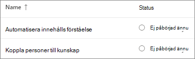
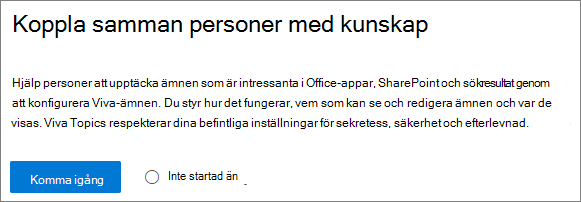
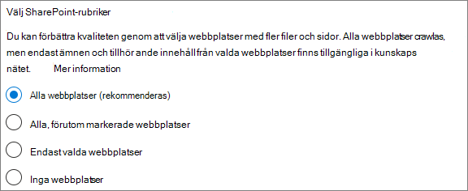
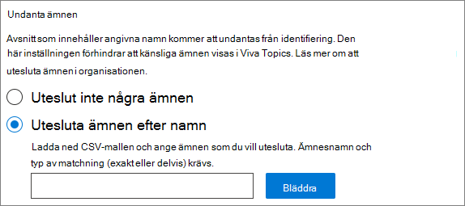
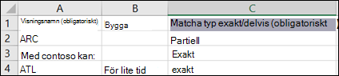
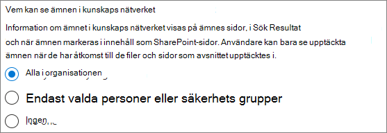
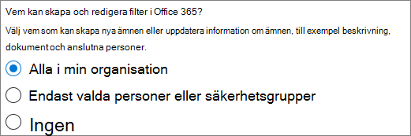
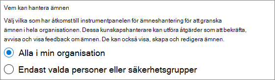
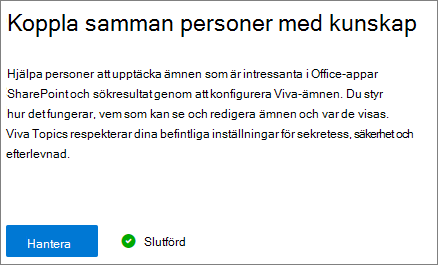

# Konfigurera Microsoft Viva-ämnen

Du kan använda administrationscentret för Microsoft 365 för att konfigurera [ämnen.](topic-experiences-overview.md) 

Det är viktigt att planera det bästa sättet att konfigurera och konfigurera ämnen i din miljö. Läs Plan för [Microsoft Viva Topics innan du](plan-topic-experiences.md) börjar med procedurerna i den här artikeln.

Du måste prenumerera [på Viva Topics](https://www.microsoft.com/microsoft-viva/topics) och vara global administratör eller SharePoint-administratör för att få åtkomst till administrationscentret för Microsoft 365 och konfigurera ämnen.

## Videodemonstration

I den här videon visas processen för att konfigurera ämnen i Microsoft 365.

 

> [!VIDEO https://www.microsoft.com/videoplayer/embed/RE4Li0E]  

 

## Konfigurera ämnen

Så här ställer du in ämnen

1. I [administrationscentret för Microsoft 365](https://admin.microsoft.com)väljer du **Installation** och visar sedan **avsnittet Filer och** innehåll.
2. Klicka på **Anslut personer till** kunskap i avsnittet Filer och **innehåll.**

     

3. På sidan **Anslut personer till kunskap** klickar du på Kom **igång** så får du hjälp med installationen.

     

4. På sidan **Välj hur Viva Ämnen kan hitta ämnen konfigurerar** du identifiering av ämnen. I avsnittet **Välj SharePoint-ämneskällor** väljer du vilka SharePoint-webbplatser som ska crawlas som källor för ämnen under identifieringen. Välj mellan:
    - **Alla webbplatser:** Alla SharePoint-webbplatser i organisationen. Det omfattar aktuella och framtida webbplatser.
    - **Alla, förutom valda webbplatser:** Skriv namnen på de webbplatser som du vill utesluta.  Du kan också ladda upp en lista över webbplatser som du vill avanmäla från identifiering. Webbplatser som skapas i framtiden kommer att ingå som källor för ämnesidentifiering. 
    - **Endast valda webbplatser:** Skriv namnen på de webbplatser som du vill ska ingå. Du kan också ladda upp en lista med webbplatser. Webbplatser som skapas i framtiden kommer inte att inkluderas som källor för identifiering av ämnen.
    - **Inga webbplatser:** Inkludera inte några SharePoint-webbplatser.

     
   
5. I avsnittet **Exkludera ämnen efter namn** kan du lägga till namn på ämnen som du inte vill ska upptäckas. Använd den här inställningen för att förhindra att känslig information inkluderas som ämnen. Alternativen är:
    - **Uteslut inte några ämnen** 
    - **Utesluta ämnen efter namn**

     

    (Knowledge managers can also exclude topics in the topic center after discovery.)

    #### Så här utesluter du ämnen efter namn    

    Om du behöver utesluta ämnen ska du ladda ned CSV-mallen efter att ha valt Exkludera ämnen efter namn och uppdatera den med listan med ämnen som du inte vill ska få.

     

    I CSV-mallen anger du följande information om de ämnen du vill utesluta:

    - **Namn:** Skriv namnet på det ämne som du vill utesluta. Du kan göra det på två sätt:
        - Exakt matchning: Du kan ta med det exakta namnet eller förkortningen (till exempel *Contoso* eller *ATL).*
        - Delvis matchning: Du kan utesluta alla ämnen som innehåller ett visst ord.  En båge *utesluter* till exempel  alla ämnen med ordet båge i den, till exempel arcuscirkel,  *Arcus* arcus-arcus eller *utbildningsbåge.* Observera att den inte exkluderar ämnen där texten ingår som en del av ett ord, till exempel *arkitektur.*
    - **Står för (valfritt)**: Om du vill utesluta en förkortning skriver du orden som förkortningen står för.
    - **MatchType-Exact/Partial:** Ange om namnet du angav var en *exakt eller* *delvis* matchningstyp.

    När du har slutfört och sparat CSV-filen väljer du Bläddra **för att** leta reda på och välja den.
    
    Välj **Nästa**.

6. På sidan **Vilka som kan se ämnen och var de kan se dem** konfigurerar du avsnittets synlighet. I inställningen **Vem kan se ämnen** väljer du vilka som ska ha åtkomst till ämnesinformation, till exempel markerade ämnen, ämneskort, ämnessvar i sökningar och ämnessidor. Du kan välja:
    - **Alla i min organisation**
    - **Endast valda personer eller säkerhetsgrupper**
    - **Ingen**

      

    > [!Note] 
    > Med den här inställningen kan du välja vilken användare som helst i organisationen, men endast användare som har tilldelats licenser för Ämnesupplevelse kan visa ämnen.

7. På sidan **Behörigheter för ämneshantering** väljer du vilka som ska kunna skapa, redigera eller hantera ämnen. I avsnittet **Vem kan skapa och redigera ämnen** kan du välja:
    - **Alla i min organisation**
    - **Endast valda personer eller säkerhetsgrupper**
    - **Ingen**

     

8. I avsnittet **Vem kan hantera ämnen** kan du välja:
    - **Alla i min organisation**
    - **Endast valda personer eller säkerhetsgrupper**

     

    Välj **Nästa**.

9. På sidan **Skapa ämnescenter** kan du skapa en ämnescenterwebbplats där ämnessidor kan visas och ämnen kan hanteras. Ange ett **namn på** ämnescentret i rutan Webbplatsnamn. Du kan också skriva en kort beskrivning i **rutan** Beskrivning. 

   Välj **Nästa**.

     

10. På sidan **Granska och slutför** kan du titta på vald inställning och välja att göra ändringar. Om du är nöjd med dina val väljer du **Aktivera**.

11. Sidan **Aktiverade Viva-ämnen** visas och bekräftar att systemet nu börjar analysera valda webbplatser för ämnen och skapa webbplatsen för ämnescentret. Välj **Klar**.

12. Då kommer du tillbaka till din **sida för att ansluta personer till kunskap.** På den här sidan kan du välja **Hantera** om du vill göra ändringar i dina konfigurationsinställningar. 

        

## Tilldela licenser

När du har konfigurerat ämnesupplevelsen måste du tilldela licenser för de användare som kommer att använda Ämnen. Endast användare med en licens kan se information om ämnen som höjdpunkter, ämneskort, ämnessidor och ämnescentret. 

För att tilldela licenser:

1. I Administrationscenter för Microsoft 365 klickar du på **Användare** > **Aktiva användare**.

2. Markera de användare som du vill licensiera och klicka **på Licenser och program.**

3. Kontrollera **att** sökning efter **Diagramkopplingar med Index och Ämnesupplevelser** är markerade **under** Program.

4. Klicka på **Spara ändringar**.

## Hantera ämnesupplevelser

När du har ställt in Ämnen kan du ändra inställningarna som du valde vid installationen i administrationscentret för [Microsoft 365.](https://admin.microsoft.com/AdminPortal#/featureexplorer/csi/KnowledgeManagement) Se följande exempel:

- [Hantera identifiering av ämnen i Microsoft Viva-ämnen](topic-experiences-discovery.md)
- [Hantera synlighet för ämnen i Microsoft Viva-ämnen](topic-experiences-knowledge-rules.md)
- [Hantera ämnesbehörigheter i Microsoft Viva-ämnen](topic-experiences-user-permissions.md)
- [Ändra namnet på ämnescentret i Microsoft Viva-ämnen](topic-experiences-administration.md)

## Se även

[Översikt över ämnesupplevelser](topic-experiences-overview.md)
