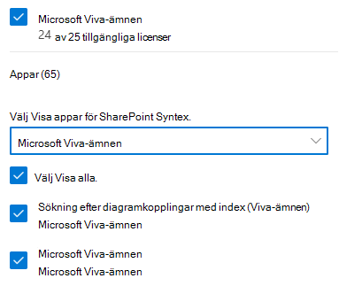

# Konfigurera Microsoft Viva-ämnenSet up Microsoft Viva Topics

Du kan använda administrationscentret för Microsoft 365 för att konfigurera [ämnen.](topic-experiences-overview.md)You can use the Microsoft 365 admin center to set up and configure [Topics](topic-experiences-overview.md). 

Det är viktigt att planera det bästa sättet att konfigurera ämnen i din miljö.It is important to plan the best way to set up and configure topics in your environment. Läs Planera för [Microsoft Viva Topics innan du](plan-topic-experiences.md) börjar med procedurerna i den här artikeln.Be sure to read [Plan for Microsoft Viva Topics](plan-topic-experiences.md) before you begin the procedures in this article.

Du måste prenumerera [på Viva Topics](https://www.microsoft.com/microsoft-viva/topics) och vara global administratör eller SharePoint-administratör för att få åtkomst till administrationscentret för Microsoft 365 och konfigurera Ämnen.You must be [subscribed to Viva Topics](https://www.microsoft.com/microsoft-viva/topics) and be a global administrator or SharePoint administrator to access the Microsoft 365 admin center and set up Topics.

Om du har konfigurerat SharePoint så att [hanterade enheter](/sharepoint/control-access-from-unmanaged-devices)krävs måste du konfigurera Ämnen från en hanterad enhet.If you have configured SharePoint to [require managed devices](/sharepoint/control-access-from-unmanaged-devices), be sure to set up Topics from a managed device.

## VideodemonstrationVideo demonstration

Den här videon visar processen för att konfigurera ämnen i Microsoft 365.This video shows the process for setting up Topics in Microsoft 365.

 

> [!VIDEO https://www.microsoft.com/videoplayer/embed/RE4Li0E]  

 

## Konfigurera ämnenSet up Topics

Så här ställer du in ämnenTo set up Topics

1. I [administrationscentret för Microsoft 365](https://admin.microsoft.com)väljer **du Konfigurera** och visar sedan **avsnittet Filer och** innehåll.In the [Microsoft 365 admin center](https://admin.microsoft.com), select **Setup**, and then view the **Files and content** section.
2. I avsnittet **Filer och innehåll** klickar du på Anslut personer till **kunskap.**In the **Files and content** section, click **Connect people to knowledge**.

     

3. På sidan **Anslut personer till kunskap** klickar du på Kom **igång** så får du de steg för steg som gäller installationen.On the **Connect people to knowledge** page, click **Get started** to walk you through the setup process.

     

4. På sidan **Välj hur Viva Ämnen kan hitta ämnen** konfigurerar du identifiering av ämnen.On the **Choose how Viva Topics can find topics** page, you will configure topic discovery. I avsnittet **Välj SharePoint-ämneskällor** väljer du vilka SharePoint-webbplatser som crawlas som källor för ämnen under identifieringen.In the **Select SharePoint topic sources** section, select which SharePoint sites will be crawled as sources for your topics during discovery. Välj mellan:Choose from:
    - **Alla webbplatser:** Alla SharePoint-webbplatser i organisationen.**All sites**: All SharePoint sites in your organization. Det omfattar nuvarande och framtida webbplatser.This includes current and future sites.
    - **Alla, förutom valda webbplatser:** Skriv namnen på de webbplatser som du vill utesluta.**All, except selected sites**: Type the names of the sites you want to exclude.  Du kan också ladda upp en lista över webbplatser som du vill avanmäla från identifiering.You can also upload a list of sites that you want to opt out from discovery. Webbplatser som skapas i framtiden kommer att ingå som källor för upptäckt av ämnen.Sites created in future will be included as sources for topic discovery. 
    - **Endast valda webbplatser**: Skriv namnen på de webbplatser som du vill ska ingå.**Only selected sites**: Type the names of the sites you want to include. Du kan också ladda upp en lista med webbplatser.You can also upload a list of sites. Webbplatser som skapas i framtiden inkluderas inte som källor för ämnesidentifiering.Sites created in the future will not be included as sources for topic discovery.
    - **Inga webbplatser**: Inkludera inte några SharePoint-webbplatser.**No sites**: Do not include any SharePoint sites.

     
   
5. I avsnittet **Exkludera ämnen efter namn** kan du lägga till namn på ämnen som du inte vill ska upptäckas.In the **Exclude topics by name** section, you can add names of topics you want to exclude from topic discovery. Använd den här inställningen för att förhindra att känslig information inkluderas som ämnen.Use this setting to prevent sensitive information from being included as topics. Alternativen är:The options are:
    - **Undanta inte några ämnen****Don't exclude any topics** 
    - **Utesluta ämnen efter namn****Exclude topics by name**

     

    (Knowledge managers can also exclude topics in the topic center after discovery.)(Knowledge managers can also exclude topics in the topic center after discovery.)

    #### Så här utesluter du ämnen efter namnHow to exclude topics by name    

    Om du behöver utesluta ämnen efter att ha valt Exkludera ämnen efter namn laddar du ned CSV-mallen och uppdaterar den med listan över ämnen som du vill utesluta från dina identifieringsresultat.If you need to exclude topics, after selecting **Exclude topics by name**, download the .csv template and update it with the list of topics that you want to exclude from your discovery results.

     

    I CSV-mallen anger du följande information om de ämnen som du inte vill ska ingå:In the CSV template, enter the following information about the topics you want to exclude:

    - **Namn**: Skriv namnet på det ämne som du vill utesluta.**Name**: Type the name of the topic you want to exclude. Du kan göra det på två sätt:There are two ways to do this:
        - Exakt matchning: Du kan ta med det exakta namnet eller förkortningen (till exempel *Contoso* eller *ATL*).Exact match: You can include the exact name or acronym (for example, *Contoso* or *ATL*).
        - Delvis matchning: Du kan utesluta alla avsnitt som innehåller ett visst ord.Partial match: You can exclude all topics that have a specific word in it.  En båge *utesluter* till exempel  alla ämnen som innehåller ordet båge, t.ex. arcuscirkel,  *Arcus* arcus- eller *utbildningsbåge.* Observera att den inte exkluderar ämnen där texten ingår i ett ord, till exempel *Arkitektur.*For example, *arc* will exclude all topics with the word *arc* in it, such as *Arc circle*, *Plasma arc welding*, or *Training arc*. Note that it will not exclude topics in which the text is included as part of a word, such as *Architecture*.
    - **Står för (valfritt)**: Om du vill utesluta en förkortning skriver du orden förkortningen står för.**Stands for (optional)**: If you want to exclude an acronym, type the words the acronym stands for.
    - **MatchType-Exact/Partial**: Ange om namnet du angav var en *exakt eller* *delvis* matchningstyp.**MatchType-Exact/Partial**: Type whether the name you entered was an *exact* or *partial* match type.

    När du har slutfört och sparat CSV-filen väljer du Bläddra **för att** leta reda på och välja den.After you've completed and saved your .csv file, select **Browse** to locate and select it.
    
    Välj **Nästa**.Select **Next**.

6. På sidan **Vilka som kan se ämnen och var de kan se dem** konfigurerar du avsnittets synlighet.On the **Who can see topics and where can they see them** page, you will configure topic visibility. I inställningen **Vilka kan se ämnen** väljer du vilka som ska ha åtkomst till ämnesinformation, till exempel markerade ämnen, ämneskort, ämnessvar i sökningar och ämnessidor.In the **Who can see topics** setting, you choose who will have access to topic details, such as highlighted topics, topic cards, topic answers in search, and topic pages. Du kan välja:You can select:
    - **Alla i min organisation****Everyone in my organization**
    - **Endast valda personer eller säkerhetsgrupper****Only selected people or security groups**
    - **Ingen****No one**

      

    > [!Note] 
    > Med den här inställningen kan du välja vilken användare som helst i organisationen, men endast användare som har tilldelats ämneserfarenhetslicenser kan visa ämnen.While this setting allows you to select any user in your organization, only users who have Topic Experiences licenses assigned to them will be able to view topics.

7. På sidan **Behörigheter för ämneshantering** väljer du vilka som ska kunna skapa, redigera eller hantera ämnen.In the **Permissions for topic management** page, you choose who will be able to create, edit, or manage topics. I avsnittet **Vem kan skapa och redigera ämnen** kan du välja:In the **Who can create and edit topics** section, you can select:
    - **Alla i min organisation****Everyone in my organization**
    - **Endast valda personer eller säkerhetsgrupper****Only selected people or security groups**
    - **Ingen****No one**

     

8. I avsnittet **Vem kan hantera ämnen** kan du välja:In the **Who can manage topics** section, you can select:
    - **Alla i min organisation****Everyone in my organization**
    - **Endast valda personer eller säkerhetsgrupper****Only selected people or security groups**

     

    Välj **Nästa**.Select **Next**.

9. På sidan **Skapa ämnescenter** kan du skapa en ämnescenterwebbplats där ämnessidor kan visas och ämnen kan hanteras.On the **Create topic center** page, you can create your topic center site in which topic pages can be viewed and topics can be managed. Ange **ett namn** på ämnescentret i rutan Webbplatsnamn.In the **Site name** box, type a name for your topic center. Du kan också skriva en kort beskrivning i **rutan** Beskrivning.You can optionally type a short description in the **Description** box. 

   Välj **Nästa**.Select **Next**.

     

10. På sidan **Granska och slutför** kan du titta på vald inställning och välja att göra ändringar.On the **Review and finish** page, you can look at your selected setting and choose to make changes. Om du är nöjd med dina val väljer du **Aktivera**.If you are satisfied with your selections, select **Activate**.

11. Sidan **Viva Ämnen som** har aktiverats visas och bekräftar att systemet nu börjar analysera valda webbplatser för ämnen och skapa webbplatsen för ämnescenter.The **Viva Topics activated** page will display, confirming that the system will now start analyzing your selected sites for topics and creating the topic center site. Välj **Klar**.Select **Done**.

12. Du kommer nu tillbaka till **kunskapssidan för Anslut personer till** kunskap.You'll be returned to your **Connect people to knowledge** page. På den här sidan kan du välja **Hantera** om du vill göra ändringar i dina konfigurationsinställningar.From this page, you can select **Manage** to make any changes to your configuration settings. 

        

Observera att första gången ämnesidentifiering är aktiverat kan det ta upp till två veckor för alla föreslagna ämnen att visas i vyn Hantera ämnen.Note that the first time topic discovery is enabled, it may take up to two weeks for all suggested topics to appear in the Manage Topics view. Ämnesidentifiering fortsätter allt eftersom nytt innehåll eller uppdateringar av innehåll görs.Topic discovery continues as new content or updates to content are made. Det är normalt att ha fluktuationer i antalet föreslagna ämnen i organisationen eftersom Viva Topics utvärderar ny information.It is normal to have fluctuations in the number of suggested topics in your organization as Viva Topics evaluates new information.

## Tilldela licenserAssign licenses

När du har konfigurerat ämnesupplevelsen måste du tilldela licenser för de användare som kommer att använda ämnen.Once you have configured topic experiences, you must assign licenses for the users who will be using Topics. Endast användare med en licens kan se information om ämnen, till exempel höjdpunkter, ämneskort, ämnessidor och ämnescentret.Only users with a license can see information on topics including highlights, topic cards, topic pages and the topic center. 

För att tilldela licenser:To assign licenses:

1. I Administrationscenter för Microsoft 365 klickar du på **Användare** > **Aktiva användare**.In the Microsoft 365 admin center, under **Users**, click **Active users**.

2. Välj de användare som du vill licensiera och klicka på **Licenser och appar.**Select the users that you want to license, and click **Licenses and apps**.

3. Under **Licenser** väljer du **Viva Ämnen.**Under **Licenses**, select **Viva Topics**.

4. Kontrollera **att** sökningen med **Index (Viva Topics)** och **Viva** Topics är markerad under Appar.Under **Apps**, make sure **Graph Connectors Search with Index (Viva Topics)** and **Viva Topics** are both selected.

   > [!div class="mx-imgBorder"]
   > 

5. Klicka på **Spara ändringar**.Click **Save changes**.

## Hantera ämnesupplevelserManage topic experiences

När du har ställt in Ämnen kan du ändra inställningarna som du valde vid installationen i administrationscentret för [Microsoft 365.](https://admin.microsoft.com/AdminPortal#/featureexplorer/csi/KnowledgeManagement)Once you have set up Topics, you can change the settings that you chose during setup in the [Microsoft 365 admin center](https://admin.microsoft.com/AdminPortal#/featureexplorer/csi/KnowledgeManagement). Se följande exempel:See the following references:

- [Hantera identifiering av ämnen i Microsoft Viva-ämnenManage topic discovery in Microsoft Viva Topics](topic-experiences-discovery.md)
- [Hantera synlighet för ämnen i Microsoft Viva-ämnenManage topic visibility in Microsoft Viva Topics](topic-experiences-knowledge-rules.md)
- [Hantera ämnesbehörigheter i Microsoft Viva-ämnenManage topic permissions in Microsoft Viva Topics](topic-experiences-user-permissions.md)
- [Ändra namnet på ämnescentret i Microsoft Viva-ämnenChange the name of the topic center in Microsoft Viva Topics](topic-experiences-administration.md)

## Se ävenSee also

[Översikt över ämnesupplevelserTopic Experiences Overview](topic-experiences-overview.md)
